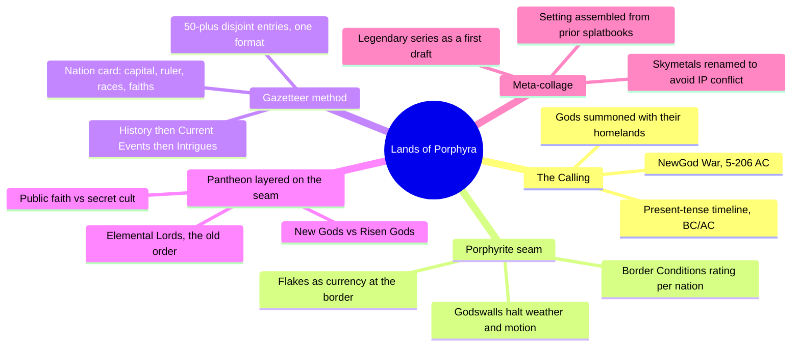
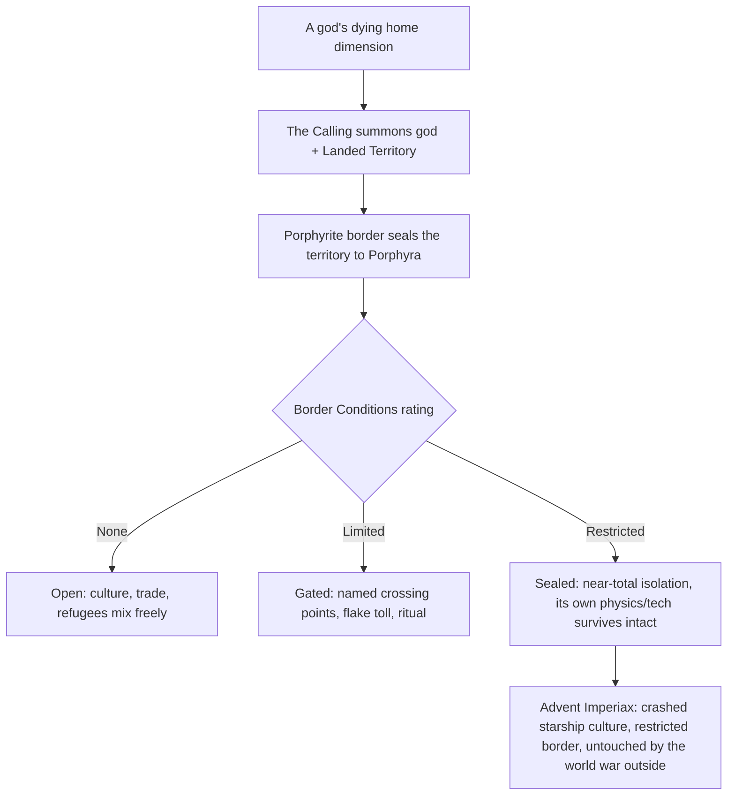
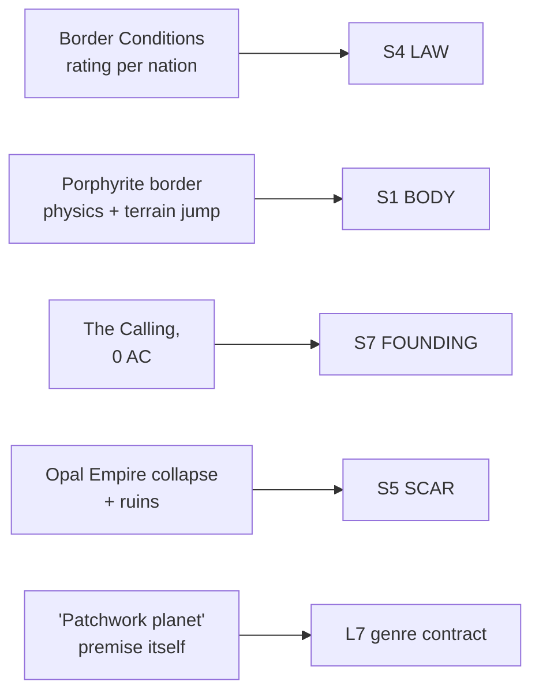

# BVX.1181 — Lands of Porphyra Campaign Setting — Purple Duck Games (2015)

### Knowledge Entry — Distill

A 212-page Pathfinder-compatible campaign setting built from over 50 gazetteer nations, all stitched onto one planet through a single explicit collage mechanic; the clearest instance in the shelf of a world designed to hold incompatible pieces on purpose rather than blend them into one coherent tone.

## TABLE OF CONTENTS
- [Core Thesis](#1-core-thesis)
- [Mind Models](#2-mind-models)
- [Framework](#3-framework--structure)
- [Key Concepts](#4-key-concepts)
- [Heuristics](#5-heuristics--decision-rules)
- [Invariants](#6-invariants)
- [Pitfalls](#7-pitfalls--myths)
- [Application](#8-application)
- [Cross-References](#9-cross-references)
- [Provenance](#10-provenance--confidence)

---

## 1 · CORE THESIS

Porphyra is built like an anthology: every land is a separate piece of setting, sealed at its border by a rated seam (a porphyrite godswall) instead of blended into one coherent whole. Incompatible genres coexist because incompatibility is licensed by canon, gated by a Border Conditions field on every nation, not smoothed away by worldbuilding.

---

## 2 · MIND MODELS

*Required. Minimum two diagrams, maximum five.*

**Diagram 1 — the whole argument.**
Caption: *one founding event (The Calling) explains both the world's fracture and the book's own format — a gazetteer of sealed pieces, not a unified continent.*

**Diagram 2 — the central mechanism (a border that grades how much two genres are allowed to touch).**
Caption: *the seam isn't binary open-or-closed, it's a three-step gate, and that gate is a printed field on every nation, not an implied boundary.*

**Diagram 3 — mapped onto the Command's SETTING SLICE (S1–S12).**
Caption: *this book's strongest feed is a law field, not a lore field — the seam is graded and enforced, which is why S4 carries the weight here rather than S1 or S7 alone.*

---

## 3 · FRAMEWORK / STRUCTURE

The book is a gazetteer, not a narrative: a Foreword and Introduction (in-world epistolary fiction narrating The Calling), then "The World of Porphyra" and "Porphyrite Borders and Landed Territories" (the mechanic, stated once, up front), then "History of Porphyra" (a bulleted BC/AC timeline), then the gazetteer proper — over 100 pages of nation entries running alphabetically from Advent Imperiax to Wastes of Simoon, each one a fixed template: a stat-block header (Capital, Settlements, Ruler, Government, Races, Faiths, Resources, Languages, Border Conditions), then History, then Current Events, then settlement detail, then a short list of Intrigues (ready-to-run adventure hooks). After the gazetteer, the book widens outward from land to world-systems: Seas, Races, Religion (New Gods, Risen Gods, Elemental Lords, Protean Lords, Other Faiths), Life on Porphyra (calendar, holidays, daily texture), Trade, Flora and Fauna, Languages, Magic, Psionics, Orders and Organizations, then crunch (Prestige Classes, Regional and Campaign Traits), then Personages and a starter adventure. A closing "Other Works of Porphyra" section lists the dozen-plus standalone splatbooks the setting was assembled from — the book's own production history mirrors its in-fiction premise: pieces from elsewhere, stitched to one frame.

---

## 4 · KEY CONCEPTS

| Concept | What it is | Why it matters |
|---|---|---|
| **The Calling** | The founding event (0 AC): the Cormazog Alliance of orcs and elves speaks THE WORD, tearing the multiverse's borders and summoning gods to Porphyra — who arrive bringing their home Lands with them | The single point every nation's history and every calendar date keys to; the world's fracture and the book's gazetteer format both trace back to one dated event |
| **Landed Territory** | A literal piece of another reality, brought by a god and sealed into Porphyra's surface by porphyrite, preserving that land's own climate, flora, fauna, and culture regardless of what borders it | The mechanism that authorizes an arctic wasteland to sit beside a tropical jungle with zero transitional terrain — incoherence is licensed, not accidental |
| **Porphyrite border ("godswall")** | A low hedge of purple crystal that halves the velocity of anything passing through it, blocks weather and most living motion, and repels undead; crossing requires a ritual, a toll ("flakes"), or a Khilite priest | The seam made physical and mechanical — not lore text but a rules effect with a stated cost, so the border is something a table actually plays through |
| **Border Conditions rating** | A printed field on every nation's stat block: None, Limited, or Restricted, often with a clause naming which side is sealed | Quantifies exactly how much two adjacent, tonally clashing regions are allowed to touch — the seam has a dial, not a switch |
| **Landed vs. Native races** | Every race entry states which category it belongs to: Landed (arrived with a god) or Native (already on Porphyra before The Calling) | Makes displacement and belonging a first-class stat rather than backstory color — who was here first is a fact the setting tracks, not just narrates |
| **New Gods / Risen Gods / Elemental Lords / Protean Lords** | Four distinct pantheon tracks: deities who Called territories in, deities Arisen from Porphyra's own people, the old pre-Calling ruling divinities, and a fourth chaos-aligned track | A religion system built the same way the geography is — stacked, layered arrivals rather than one coherent theology |
| **The nation card** | The recurring stat-block header (Capital, Settlements, Ruler, Government, Races, Faiths, Resources, Languages, Border Conditions) opening every gazetteer entry | A portable comparison tool: any two of the 50-plus nations can be weighed against each other at a glance, independent of how different their genres are |
| **Intrigues** | A short bulleted list of adventure hooks closing every nation entry | Converts a static gazetteer page into an instigation device — every piece of the collage comes pre-loaded with a reason to visit it |
| **Meta-collage (production history)** | The "Other Works of Porphyra" appendix lists the standalone splatbooks (the Legendary series, Monsters of Porphyra, Fehr's Ethnology, class books) the setting's content was assembled from | The in-fiction collage premise mirrors the real production process: a company's back catalog stitched into one frame, the same move at two scales |

---

## 5 · HEURISTICS & DECISION RULES

| Situation | Do this | Not this |
|---|---|---|
| Two regions you want in the same world clash in tone or genre | Give the seam between them a stated mechanism and a rated permeability | Blend the tones until the clash disappears, or hand-wave the border as empty space |
| Introducing a wildly different pocket (a crashed spaceship culture, a pulp jungle, a steampunk city) | Seal it behind a Restricted border so its internal logic survives contact with the rest of the world | Let it dilute toward setting-average the moment it borders anything else |
| Writing a nation's stat block | Fill capital, ruler, government, races, faiths, resources, languages, and a border rating as one repeatable card | Write a bespoke essay per nation that can't be compared to its neighbors |
| Deciding how deep to write a nation's backstory | Write the dated bullet points that still cause a current conflict, then stop | Write the full millennium a nation has existed |
| Explaining why a race is where it is | State whether it Landed (arrived with a god) or is Native, and what that costs it now | Leave origin as unexamined flavor |
| Wanting a gazetteer entry to be playable, not just readable | Close it with two or three concrete adventure hooks tied to its specific conflict | Stop at description and leave instigation to the GM |
| Building a setting from a company's or a writer's existing scattered material | Treat prior standalone works as Landed pieces to be seamed in explicitly, crediting the source | Discard prior material or silently retcon it flat to match new canon |

---

## 6 · INVARIANTS

1. **A collage world needs a stated seam mechanism**, not just adjacency on a map, or the clashing pieces read as an authoring mistake instead of a design.
2. **The seam must be gradable, not binary.** None / Limited / Restricted lets some regions leak into each other while others stay hermetically distinct — uniform permeability collapses the patchwork back into one setting.
3. **A founding event dates and explains the fracture itself**, and every subsequent local history keys to it, even where local history predates the event by millennia.
4. **A land's genre and physics survive its transplant.** A Landed Territory is not reskinned to match its neighbors; that non-blending is the entire point of the mechanic.
5. **Comparable entries need a shared card.** Fifty nations across a dozen genres stay legible only because every one answers the same fixed set of fields.
6. **Belonging (Landed vs. Native, who displaced whom) is tracked as data**, not left as unexamined backstory, whenever multiple waves of arrival share a world.
7. **A gazetteer entry earns its keep by instigating play**, not merely describing a place; description without a hook is inert regardless of how vivid it is.

---

## 7 · PITFALLS / MYTHS

- Assuming a shared world requires a shared tone — Porphyra's central move is refusing that assumption and building the refusal into the setting's physics.
- Treating a border between clashing regions as empty space or a vague "here be dragons" gap, instead of giving it a mechanism, a cost, and a rating.
- Writing every region's history to equal depth regardless of whether it bites in the present — Porphyra's own timeline stays a bullet list for exactly this reason.
- Letting a transplanted, genre-foreign pocket (technology, a different physics, a different pantheon) gradually dissolve into setting-average once it's been present a while; Advent Imperiax stays sealed on purpose, a millennium in.
- Forgetting that a race's arrival has a cost — displacement (Landed races pushing out Native ones, or vice versa) needs to be visible in the text, not smoothed into peaceful coexistence by default.
- Discarding a company's or writer's older, disconnected material when unifying a setting, rather than seaming it in and crediting it — Porphyra's own appendix does the latter explicitly.

---

## 8 · APPLICATION

- **Spine level:** SETTING (non-story-spine source; keys to the entity beside the L0–L7 spine, per the SETTING SLICE's binding rule that setting is a Domain embodied, never a level)
- **12-layer character stack:** none directly — a setting-side source; its Landed-vs-Native belonging split is structurally the same move as an L8 belonging-architecture question, but this entry itself feeds SETTING only
- **plot_systems:** contextual candidate once `04_PLOT_SYSTEMS/` opens — the Border Conditions gate (Diagram 2) is a ready-made escalation lever: raising or lowering a region's rating mid-story is a structural way to open or close access without inventing a new device
- **Setting:** primary — feeds S4 LAW and S1 BODY at full strength (the seam mechanism is this book's real center of gravity), S7 FOUNDING primary via The Calling, S5 SCAR and S11 VECTOR supporting, S8 HABIT contextual, plus L7 genre-contract primary via the patchwork frame itself

The steal-worthy move for a science-fiction setting built on TTRPG craft is the seam, not the lore: a world doesn't need one coherent physics or tone to hold together, it needs a stated, rated mechanism that licenses incompatibility at chosen points and forbids it everywhere else. This reframes "how do wildly different star systems, factions, or eras share one continuity" from a problem to solve away into a design object to build on purpose: a jump-gate, a quarantine treaty, a comms-lag boundary, or an exclusion zone can carry the porphyrite border's exact job — graded, stated in-world, printed as a field on every faction's own card rather than implied by the map. The nation-card format is directly portable as a faction template, and the Intrigues field is a cheap habit worth stealing outright: every location card should close with concrete hooks, not just description. The meta-collage appendix carries its own lesson for this shelf's own working method: when assembling a setting from scattered prior material, seam pieces in explicitly and credit the source, rather than pretend it sprang from one unified vision.

---

## 9 · CROSS-REFERENCES

| Related entry | Relation |
|---|---|
| [[BVX.0458]] | Kobold Guide to Worldbuilding — the craft-essay counterpart; its present-tense-history rule and nation-scale governance essay are the theory this book runs as a worked, 50-nation instance |
| [[BVX.1170]] | Classic BattleTech Total Warfare — sibling SETTING-SLICE instance where a *mechanic* (zellbrigen) encodes culture; Porphyra's Border Conditions field is the same move applied to geography and genre-contact instead of honor |
| [[BVX.0362]] | Era Report 2750 — another deep-lore faction gazetteer; contrast their unified-universe history against Porphyra's deliberately non-unified, seam-based one |
| [[BVX.1122]] | GURPS Hot Spots: Renaissance Venice — a single-place-deep-dive SETTING instance; this entry is its structural opposite, a wide gazetteer of sealed pieces rather than one place explored in depth |

---

## 10 · PROVENANCE & CONFIDENCE

Full text, pdftotext extraction, 212pp. Read in full: front matter and credits, "The World of Porphyra," "Porphyrite Borders and Landed Territories" (the seam mechanic, including the Porphyrite Passage spell), "History of Porphyra" (complete BC/AC timeline), the Advent Imperiax gazetteer entry in full (capital-to-Intrigues), "Seas of Porphyra," the opening of "Races of Porphyra," "Life on Porphyra" (calendar, Legend of the Seven Days), and "Other Works of Porphyra" (the production-history appendix, in full). Sampled via targeted grep across the ~50-entry gazetteer (pp. 10–119): confirmed the Border Conditions field's presence and its three-tier rating across 25-plus additional nation entries without deep-reading each one; sampled the Religion section's deity-card format without deep-reading all 27 gods. Not extracted: Prestige Classes, Regional and Campaign Traits, Magic/Psionics crunch, and the starter adventure — mechanical-crunch chapters with no direct bearing on the collage-worldbuilding method this distill targets.

Title, author list, publisher, and year (2015) are taken from the book's own title page (Project Lead, Contributing Authors, Publisher: Purple Duck Games) cross-checked against the book's own OGL/copyright section, which lists "Lands of Porphyra © 2015, Purple Duck Games." `zotero_key` is left blank pending the next inventory reconciliation pass. The S-layer keying in frontmatter `feeds:` is this distill's synthesis against `ssot_03_setting_system.md` (PART A, the twelve-layer SETTING SLICE), matched against the pattern already set by BVX.0458 and BVX.1170.

## META
- Template: BVX-LEARN-v4.0
- Source classification: full-text campaign-setting sourcebook, deep extraction on the collage mechanism and one full gazetteer entry, sampled across the remaining ~50-entry gazetteer and the Religion/crunch chapters
- Created / Updated: 2026-09-29
