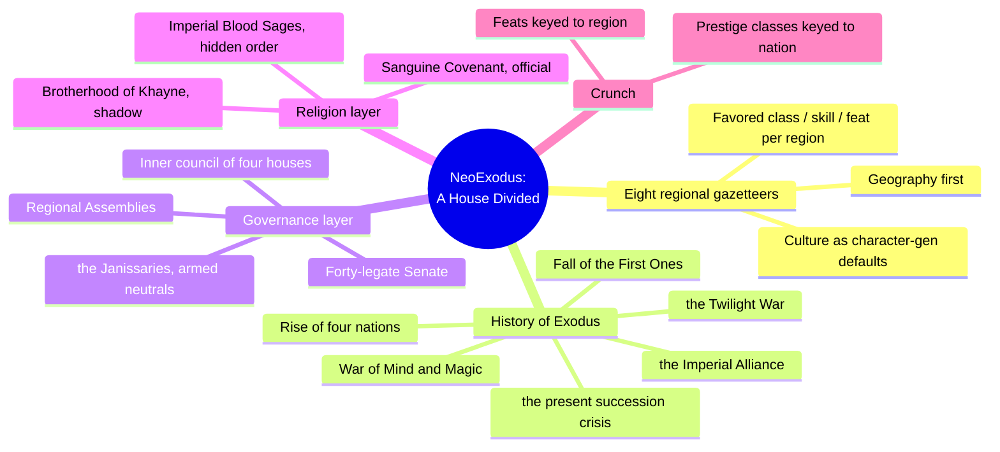
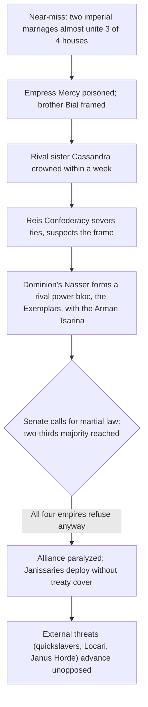
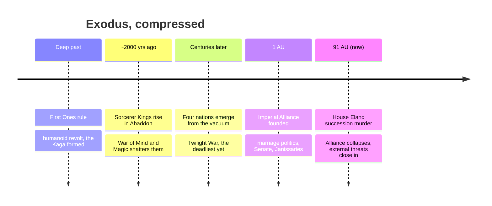
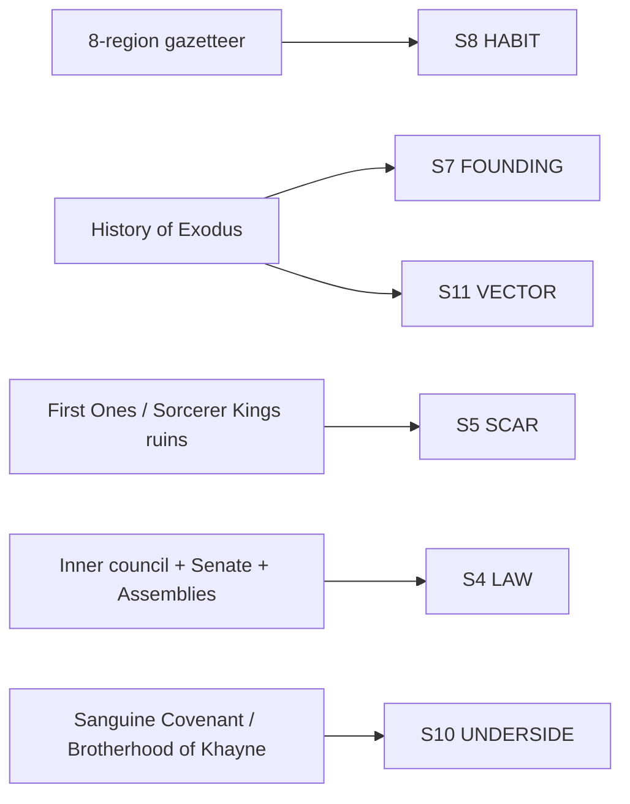

# BVX.1182 — NeoExodus: A House Divided Campaign Setting — Joshua Cole, Richard Farrese, Lee Hammock, with Louis Porter, Jr. (2007)
### Knowledge Entry — Distill

A d20/OGL campaign setting for the world of Exodus, built as history-first: two thousand years of chained cause and effect end in a present-day succession murder that unravels the alliance holding four rival empires together. A worked instance for the setting shelf, not a craft essay.

## TABLE OF CONTENTS
- [Core Thesis](#1-core-thesis)
- [Mind Models](#2-mind-models)
- [Framework](#3-framework--structure)
- [Key Concepts](#4-key-concepts)
- [Heuristics](#5-heuristics--decision-rules)
- [Invariants](#6-invariants)
- [Pitfalls](#7-pitfalls--myths)
- [Application](#8-application)
- [Cross-References](#9-cross-references)
- [Provenance](#10-provenance--confidence)

---

## 1 · CORE THESIS

NeoExodus stages its collapse twice: a magic-versus-psionics war fells a god-ruled empire and seeds four rival dynasties, then five centuries later one house's succession murder unravels the alliance those dynasties built to survive the first collapse. Houses nest fractally — tribe, noble house, imperial house, Senate — and a wound at any level cascades upward through all of them.

---

## 2 · MIND MODELS

*Required. Minimum two diagrams, maximum five.*

**Diagram 1 — the whole argument.**
Caption: *the book is two machines bolted together — a region-by-region gazetteer and a two-thousand-year causal chain — and the second one is where the house-politics engine actually lives.*

**Diagram 2 — the central mechanism (the house-politics cascade, a process).**
Caption: *the alliance fails from a single murder because its only shutoff valve is a supermajority vote, and the four powers who'd have to supply that majority are the same four who just stopped trusting each other.*

**Diagram 3 — the deep-history spine (a repeating sequence, timeline).**
Caption: *the same shape repeats three times at shrinking scale — collapse, vacuum, new power, alliance, second collapse — which is the book's real argument about how Exodus works.*

**Diagram 4 — mapped onto the Command's SETTING SLICE.**
Caption: *the book is a dense worked instance of five S-layers at once and thin everywhere the crunch takes over instead.*

---

## 3 · FRAMEWORK / STRUCTURE

Two structures run side by side with almost no explicit cross-referencing between them, left for a GM to synthesize:

| Section | What it covers | Shape |
|---|---|---|
| Regional gazetteer (8 entries) | Abbaddon, Cordel, Gavea, Koryth, Nas, Sametia, Uthara, Wyldlands of Bal — each with Overview, Geography, named places of interest, People (favored classes, starting skills, starting feats, favored prestige classes) | Repeats the same template per region; culture is authored as character-build defaults |
| History of Exodus | One continuous chronological narrative, First Ones to the present (91 AU) | A single causal chain, not a timeline of disconnected events — every later section presumes the reader carries the earlier one forward |
| Governance and organizations | The Imperial Alliance's inner council, Senate, Assemblies; the Janissaries (armed neutral order); the Sanguine Covenant and its shadow, the Brotherhood of Khayne | Embedded inside the History section rather than given its own systematic write-up — no separate "Organizations" chapter with goals/methods/headquarters entries |
| Crunch | Prestige classes (Confederate Sentinel, Dominion Khalid Asad, Imperial Blood Sage, others), feats, presumably spells/items in the unread tail | Each prestige class is keyed to one nation or one organization from the history, closing the loop between lore and character options |

The book has no stated design philosophy, no "how to build a setting" essay — unlike BVX.0458, this is a finished instance to mine, not a method to extract. Its craft is legible only by reading what it *does*.

---

## 4 · KEY CONCEPTS

| Concept | What it is | Why it matters |
|---|---|---|
| **Nested houses** | Tribe (blood) inside noble house (regional) inside imperial house (one of four) inside the Senate (all of them, uneasily) | The same binding-principle logic as BVX.0458's tribe/city-state/nation ladder, but run one level higher into an actual supranational body |
| **The near-miss unification** | Two of four imperial houses come within one generation of merging by marriage, which would have given one dynasty three-fifths of the continent bloodlessly | Shows the alliance's stability was always accidental — it survived by *failing* to consolidate, not by design |
| **The murder-to-collapse chain** | Poisoning → hasty succession → severed diplomatic ties → a rival secret power bloc → a Senate vote every empire refuses to honor | A five-step chain where each link is a plausible, human-scale decision; no single actor intends the alliance's collapse |
| **The Janissaries** | An armed order founded explicitly *against* centralized power, who nonetheless became the alliance's enforcement arm and now deploy without treaty cover | A faction whose founding principle and current function have inverted — a built-in source of internal contradiction the GM can pull on |
| **Public/shadow religion split** | The Sanguine Covenant (official, state-sanctioned) versus the Brotherhood of Khayne (outlawed, recruits from the Covenant's own bored aristocracy) | Confirms BVX.0458's mystery-cult pattern with a twist: the shadow religion's recruits come from the failures and dropouts of the public one |
| **Imperial Blood Sages** | A secret order of diviner-assassins embedded inside the alliance's own government, tasked with guarding it from destabilization | Political intrigue given a mechanical body — the setting's paranoia is playable, not just narrated |
| **Present-tense history, worked** | Every historical beat (the Kaga's withdrawal, the Cavians' near-extinction, the founding of the Dominion) is narrated specifically because it explains something true in 91 AU | A concrete instance of BVX.0458's present-tense-history rule, extended across two thousand years without ever losing the thread back to "now" |
| **External threats held in reserve** | Quickslavers (an alien mind-parasite plague), the Locari (insectoid invaders), the Janus Horde (barbarian warband), the mysterious Lawgiver — all named, none resolved | Existential threats are set up and then deliberately left open, so the internal house collapse reads as more urgent than the external ones |

---

## 5 · HEURISTICS & DECISION RULES

| Situation | Do this | Not this |
|---|---|---|
| Building a supranational alliance of rival powers | Give it one hard voting threshold (a supermajority) that only works while trust holds | Give it a strong central authority that never needs member buy-in |
| Wanting the alliance to break believably | Route the failure through a personal-scale crime (murder, succession dispute) that individually makes sense to every actor | Break it with an external invasion or a single villain's master plan |
| Writing deep backstory for a collapse-based setting | Chain every era's ending directly into the next era's cause, no gaps | Write eras as isolated flavor entries a reader can skip |
| Wiring culture to player-facing mechanics | Pair each region's geography with concrete character-build defaults (classes, skills, feats) | Describe a culture in prose only and leave the mechanical hook to the GM |
| Designing an enforcement faction | Found it on a principle its later function will contradict (anti-centralization order that becomes centralized enforcement) | Design a faction whose founding purpose and current role always agree |
| Stacking existential threats against a political crisis | Introduce several and resolve none, so the internal crisis reads as the more urgent story | Resolve external threats early so the political thread has to carry weight alone |
| Building a shadow religion or cult | Recruit it from the official faith's own disaffected members, not from outsiders | Make the shadow faith a wholly separate, foreign import |

---

## 6 · INVARIANTS

1. **A house-politics engine needs a near-miss before its collapse.** The setting shows the alliance almost solidifying (the near-unification marriage) before showing it come apart — the audience has to see what was almost saved.
2. **The failure mechanism is procedural, not villainous.** No single antagonist breaks the alliance; a voting rule, a grief-driven succession, and mutual suspicion do it collectively.
3. **Houses recur at every scale.** Tribe, noble house, imperial house, and the Senate all share the same blood/loyalty logic; a wound introduced at the smallest scale (one murder) reaches the largest (continental war) because the scales are structurally identical, not because the plot forces it.
4. **History only earns a paragraph if it explains the present.** Every historical section in this book closes a loop back to 91 AU; nothing is included purely as flavor.
5. **Enforcement factions carry their founding contradiction forward.** An order founded to prevent centralization, now serving as the centralizing power's enforcement arm, generates ongoing tension without further authorial effort.
6. **External threats are a pressure valve, not a plot.** Named-but-unresolved dangers (quickslavers, Locari, the Horde) exist to make the internal collapse feel expensive, not to be the main event.

---

## 7 · PITFALLS / MYTHS

- Treating "the villain did it" as the only believable way to break a large alliance — this setting breaks itself through ordinary succession law and a supermajority rule nobody thought would ever bind them.
- Writing culture as pure lore prose with no mechanical anchor — every region here ties directly into character-generation choices, which is what makes the gazetteer usable at the table rather than just read.
- Giving an enforcement faction a founding purpose that never complicates its later role — a faction whose principles and current job agree completely has nothing left to generate friction.
- Resolving every external threat before the internal political crisis lands — this book deliberately leaves the quickslavers, the Locari, and the Lawgiver open, so none of them steal focus from the house collapse.
- Assuming a shadow cult must recruit from outside the official faith — the Brotherhood of Khayne draws specifically from the Sanguine Covenant's own bored, disaffected nobility.

---

## 8 · APPLICATION

- **Spine level:** SETTING (non-story-spine source; setting is a Domain embodied, never a story-spine rung, per the v4 template's binding rule)
- **12-layer character stack:** none directly — this is a setting-side source; the murder-to-collapse chain (Diagram 2) is structurally the same move as auditing a character's L6 DRIVE want against its costs, run at the scale of a whole political system, but it is not itself a character-layer feed
- **plot_systems:** primary candidate — the house-politics cascade (Diagram 2) is a ready-made plot generator: pick any political body bound by a hard voting rule, introduce a personal-scale crime at its most trusted node, and let the cascade run
- **Setting:** primary — a worked instance across five SETTING SLICE layers (S4, S5, S7, S8, S10, S11 primary; S6 contextual), the concrete companion to BVX.0458's toolkit essays

The steal for a science-fiction writer building a post-collapse universe on rival houses: don't design the collapse as an invasion or a single villain's plot. Design one hard institutional rule (a supermajority, a succession law, a single shared treaty clause) that only holds while every party still trusts every other party, then break that trust with one personal-scale crime at the most visible node in the system. Let the houses' shared structure — the same blood/loyalty logic repeated at tribe, noble-house, and imperial-house scale — carry the wound upward on its own, without needing a mastermind. Keep the external threats (this book's quickslavers, Locari, and Janus Horde stand-ins) visible and unresolved throughout, so the internal collapse reads as the story that actually costs something. A science-fiction analog needs only the substitution: swap magic/psionics for two incompatible technologies or ideologies at the origin collapse, swap the Sanguine Covenant/Brotherhood of Khayne split for a state ideology and its banned dissident offshoot, and the engine runs unchanged.

---

## 9 · CROSS-REFERENCES

| Related entry | Relation |
|---|---|
| [[BVX.0458]] | The Kobold Guide to Worldbuilding — the toolkit/method sibling; this entry is the worked instance, that one the craft essays (present-tense history, tribe/city-state/nation, public/personal religion) this book independently confirms in practice |
| [[BVX.1122]] | GURPS Hot Spots: Renaissance Venice — a second worked-instance sibling on the SETTING shelf; where that one is a single city's texture, this one is a continental alliance's political mechanism |

---

## 10 · PROVENANCE & CONFIDENCE

Full text, pdftotext extraction from a two-column layout PDF (112 pages), clean enough to read continuously despite column-interleaving artifacts on a handful of pages. Read in full: front matter and OGL boilerplate (skimmed for provenance only); the complete regional gazetteer for Abbaddon, Cordel, Gavea, Koryth, Nas, Sametia, Uthara, and Wyldlands of Bal (Overview/Geography/People sections); the entire "History of Exodus" chapter from the fall of the First Ones through "Exodus today" (91 AU), including the Twilight War, the founding of the Imperial Alliance, the near-unification marriages, and the House Eland succession crisis. Sampled: the prestige-class chapter (Confederate Sentinel read in full as a worked example of region-to-crunch wiring; Dominion Khalid Asad and Imperial Blood Sage read partially for organizational detail). Not read: feats, spells, magic items, and character-sheet appendices in the book's back matter — confirmed by grep to contain no additional setting-building content, only mechanical crunch and blank play-aid forms.

No Zotero key is on file for this source (drop-folder PDF, unkeyed in the live inventory as of 2026-09-29); `zotero_key` left blank pending a library pass. The `feeds:` keying against `ssot_03_setting_system.md`'s S-layers is this distill's own synthesis, run the same way BVX.0458 keyed its craft essays — here applied to a finished setting instance rather than a how-to text.

## META
- Template: BVX-LEARN-v4.0
- Source classification: full-text campaign-setting book, deep extraction on gazetteer + history, sampled on prestige-class crunch, back-matter confirmed empty of setting content
- Created / Updated: 2026-09-29
