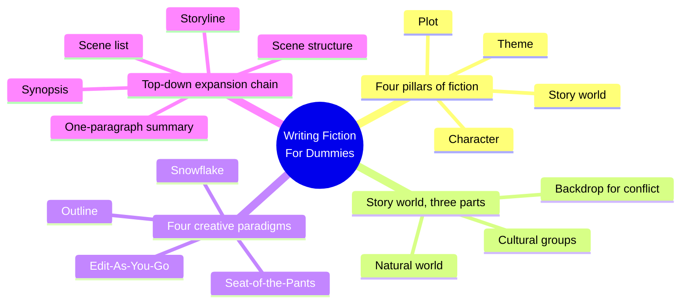
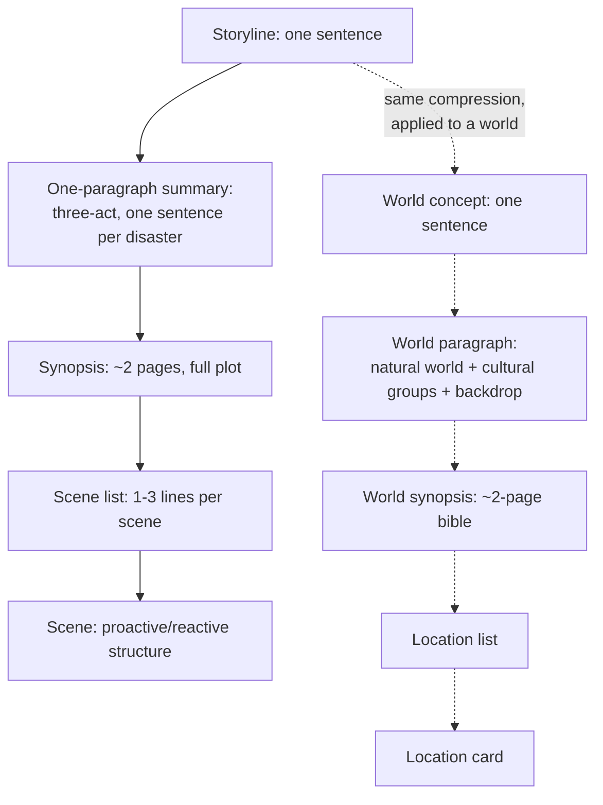
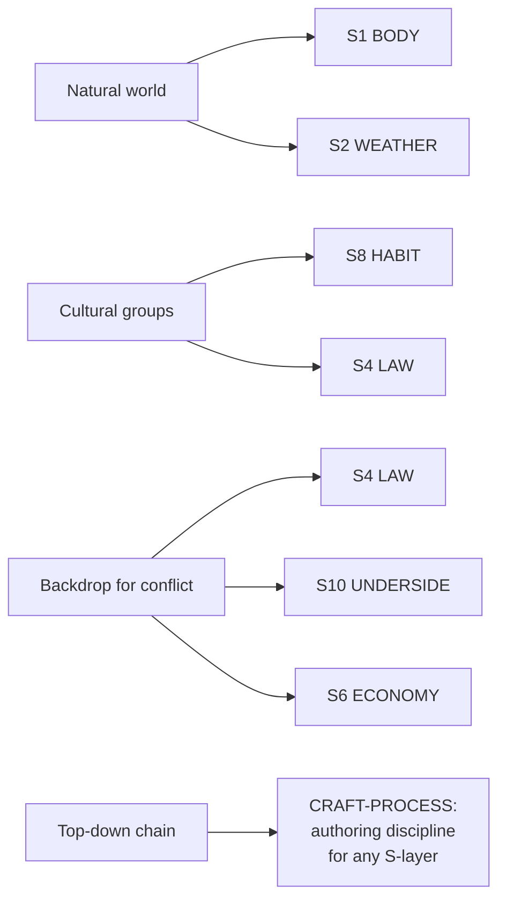

# BVX.1183 — Writing Fiction For Dummies — Randy Ingermanson and Peter Economy (2009)
### Knowledge Entry — Distill

A general fiction-writing craft manual by the creator of the Snowflake Method; Chapter 6 builds the story world in three parts, and Chapters 8-9 run the same top-down compression Ingermanson is known for, sentence to paragraph to synopsis to scene list, on plot, which ports cleanly onto setting.

## TABLE OF CONTENTS
- [Core Thesis](#1-core-thesis)
- [Mind Models](#2-mind-models)
- [Framework](#3-framework--structure)
- [Key Concepts](#4-key-concepts)
- [Heuristics](#5-heuristics--decision-rules)
- [Invariants](#6-invariants)
- [Pitfalls](#7-pitfalls--myths)
- [Application](#8-application)
- [Cross-References](#9-cross-references)
- [Provenance](#10-provenance--confidence)

---

## 1 · CORE THESIS

Story world is one of fiction's four pillars, built from three parts: natural world, cultural groups, and a conflict-generating backdrop. The same top-down compression Ingermanson uses for plot, one sentence, then a paragraph, then a synopsis, then a scene list, works just as well for building a setting layer by layer before committing to depth.

---

## 2 · MIND MODELS

*Required. Minimum two diagrams, maximum five.*

**Diagram 1 — the whole argument.**
Caption: *five toolkits, one instinct: name the minimum viable parts, then compress before you expand.*

**Diagram 2 — the central mechanism (a process, run once on plot and portable onto setting).**
Caption: *the five-rung compression chain the book runs on plot, solid arrows, ports rung-for-rung onto setting, dashed arrows: sentence, paragraph, synopsis, list, unit.*

**Diagram 3 — mapped onto the Command's SETTING SLICE.**
Caption: *the three-part story-world model lands on four of twelve S-layers cleanly; the top-down chain itself is not a layer, it is the authoring discipline for building any of them in order.*

---

## 3 · FRAMEWORK / STRUCTURE

Part II ("Creating Compelling Fiction") stacks the four pillars in build order: Chapter 6 builds story world, Chapter 7 builds character, Chapters 8-10 build plot in three descending layers, and Chapter 11 builds theme. Chapter 6 opens by naming the three parts every story world needs, then gives a plain research checklist, then proves the model against four published novels of different genres (romance, historical, thriller, science fiction). Chapters 8-9 then run the book's real spine move twice over: Chapter 4 already sorted four common creative paradigms (Seat-of-the-Pants, Edit-As-You-Go, Snowflake, Outline) onto two build directions, top-down or bottom-up, and Chapters 8-9 walk the top-down direction in full: storyline, one-paragraph summary, synopsis, scene list, individual scene structure. The bottom-up direction runs the identical chain in reverse. Chapter 6 never names the Snowflake Method directly when building world, but its three-part model plus the plain research checklist is the same compress-first instinct applied one layer earlier, before plot exists at all.

---

## 4 · KEY CONCEPTS

| Concept | What it is | Why it matters |
|---|---|---|
| **Four pillars of fiction** | Story world, character, plot, theme (Ch. 2) | Story world is asserted as load-bearing, ranked equal to plot, not decorative background |
| **Three-part story world** | Natural world, cultural groups, backdrop for conflict | The minimum viable world: the book states plainly that without all three, "you simply can't have a story" |
| **Backdrop for conflict** | The political, cultural, religious, or interpersonal climate that makes conflict possible | The part that turns a setting from scenery into a story engine; absent it, detail has nothing to push against |
| **Story-world research checklist** | Geography, climate, cultural groups, history, languages, culture (food, sleep, work, entertainment) | A plain operational list, scaled to how far the genre sits from the writer's own lived experience |
| **Storyline (one-sentence summary)** | A minimalist, backloaded single sentence naming the story's hook, 14-27 words in the book's own examples | Forces the writer to name the one sellable thing before building anything else; the same discipline compresses a world concept |
| **Top-down vs. bottom-up paradigm** | Two build directions; Snowflake and Outline are top-down, Seat-of-the-Pants and Edit-As-You-Go are bottom-up | Naming a direction up front prevents drifting between the two, which the book calls the actual failure mode |
| **One-paragraph summary** | A paragraph mapping the one-sentence storyline onto three-act structure, one sentence per disaster | The load-bearing middle rung between a bare concept and a full synopsis; cheap to revise, expensive to skip |
| **Synopsis** | A roughly two-page document describing the full plot | The sales-facing layer, and the first point where full detail gets checked against the compressed concept |
| **Scene list** | One to three sentences per scene, built from the synopsis (top-down) or from a finished draft (bottom-up) | The layer at which a full scene-by-scene, or location-by-location, inventory first gets built |
| **Deus ex machina rule** | Answering the story's central question by violating the story world's own established rules | The story world's rules are binding on the plot's resolution, not just its texture; breaking them reads as cheap |
| **Story question** | The single dramatic question the whole plot answers, e.g. "Will Luke defeat the Empire?" | Keeps the backdrop for conflict honest: no clear question implies no real backdrop, only flavor |

---

## 5 · HEURISTICS & DECISION RULES

| Situation | Do this | Not this |
|---|---|---|
| Starting a new setting from nothing | Name its natural world, its cultural groups, and its backdrop for conflict before any other detail | Start with random flavor details with no conflict source behind them |
| Deciding how much worldbuilding to do | Match research depth to how far the genre sits from your own experience (hometown needs little, SF/fantasy/historical needs real research) | Research every category to the same encyclopedic depth regardless of genre |
| Planning a large setting | Work top-down: one-sentence concept, then one-paragraph summary, then a synopsis-level bible, then a location list, then a location card | Start with a fully detailed location card and hope a governing concept emerges later |
| Choosing a build direction | Commit to top-down or bottom-up and work the corresponding chapters in that order | Drift between directions mid-project, producing neither momentum nor coherence |
| Resolving a plot your setting has constrained | Resolve inside the story world's own established rules | Break the world's rules at the climax to force a convenient ending |
| Pitching a setting-heavy story | Compress it to one storyline sentence naming the world's hook | Ramble the full worldbuilding bible at an agent, editor, or reader in one breath |

---

## 6 · INVARIANTS

1. A story needs all three story-world parts, natural world, cultural groups, and a conflict-generating backdrop, or it has no engine; the book states this as a hard requirement, not a preference.
2. Research depth should scale to genre distance from the writer's own life, not to completeness for its own sake.
3. A setting's own established rules bind its ending; a resolution that violates them is a deus ex machina, regardless of how satisfying it feels to write.
4. Every creative paradigm resolves to one of two build directions, top-down or bottom-up; there is no third axis.
5. Compression, one sentence, then one paragraph, reveals whether a concept (story or world) has a real engine before the expensive layers get built on top of it.

---

## 7 · PITFALLS / MYTHS

- Rambling through worldbuilding exposition when a single compressed sentence would sell the hook faster (the book's own elevator-pitch scene makes this the opening lesson of the storyline chapter).
- Researching every category to the same depth regardless of how close the genre sits to the writer's lived experience; a contemporary hometown novel and a science-fiction empire do not owe the same research budget.
- Building detail with no conflict-bearing backdrop behind it: pretty geography and culture that generate no story question are scenery, not a story world.
- Mixing top-down and bottom-up mid-project without ever committing to one, which the book names directly as the actual failure mode, not either direction alone.
- Resolving a climax by quietly breaking a rule the story world itself established earlier, the deus ex machina the book calls out through Aristotle's critique of Euripides.

---

## 8 · APPLICATION

- **Spine level:** SETTING (primary, the three-part model and research checklist), with CRAFT-PROCESS (secondary, the top-down compression chain itself is an authoring technique, not setting content)
- **12-layer character stack:** none directly; the deus-ex-machina rule (a world's rules bind its plot's resolution) is structurally the same move as auditing an L12 storyform constraint against a scene's ending, but this source does not itself feed a character layer
- **plot_systems:** contextual candidate once `04_PLOT_SYSTEMS/` opens; the storyline-to-synopsis-to-scene-list chain is a ready-made authoring sequence for any plot layer, not setting-specific, and the deus-ex-machina rule is a ready constraint-check for any scene resolution
- **Setting:** primary. The three-part model feeds S1 BODY and S2 WEATHER (natural world), S8 HABIT (cultural groups), and S4 LAW, with S6 ECONOMY and S10 UNDERSIDE as contextual overlap, from backdrop for conflict

Tested against a SETTING-SLICE build in progress rather than a finished instance: the top-down chain is the book's real gift to a setting system, even though the book never states it as a setting method. Ingermanson wrote the dedicated *How to Write a Novel Using the Snowflake Method* ([[BVX.0118]], not yet distilled) as a plot-only extension of this same compression instinct; here in the general-craft book, the identical five-rung move (sentence, paragraph, synopsis, list, unit) sits one chapter earlier, applied to story world's three parts rather than to plot's three-act structure. The practical move for a SETTING SLICE build: before writing a place's full S1-S11 record, write a one-sentence world concept, then a one-paragraph summary that names its natural world, its cultural groups, and its backdrop for conflict in turn, then a two-page world synopsis, then a location list, then individual location cards, exactly the discipline Chapters 8-9 run on plot. The three-part model itself is thinner than the Command's twelve-layer SETTING SLICE (it covers four of twelve S-layers, per Diagram 3), so it functions best as a fast first-pass triage before the full slice gets filled, not as a replacement for it.

---

## 9 · CROSS-REFERENCES

| Related entry | Relation |
|---|---|
| [[BVX.0118]] | How to Write a Novel Using the Snowflake Method, Ingermanson's dedicated plot-only book, undistilled sibling; this entry's top-down chain (Ch. 8-9) is the same method run one layer earlier, on story world rather than plot |
| [[BVX.0458]] | The Kobold Guide to Worldbuilding, the founding SETTING-shelf distill; a TTRPG-craft counterpart with a full twelve-of-eleven S-layer feed versus this entry's four-layer, general-fiction-craft feed |
| [[BVX.1122]] | GURPS Hot Spots: Renaissance Venice, the worked SETTING-SLICE instance; this entry supplies the compression discipline that instance's own build would have used |
| [[BVX.0349]] | Against Worldbuilding, and Other Provocations, undistilled counter-argument sibling; its root claim (worldbuilding should serve pressure, not inventory) matches this entry's research-depth heuristic almost exactly |
| [[BVX.0193]] | Truby, The Anatomy of Story, story-spine sibling; a structural counterpart to this book's plot-layer chapters, useful alongside the storyline-to-scene chain here |

---

## 10 · PROVENANCE & CONFIDENCE

Full text, pdftotext extraction, 388pp, with a machine-readable table of contents but a page layout (running two-column sidebars, boxed Tip/Remember elements) that produced noticeably scrambled extraction in places: several subsection headers survive only in the TOC and could not be located in the body text (notably "Creating a Sense of Place," "Deciding What Drives Your Cultural Groups," and "Choosing the Backdrop for Conflict" in Chapter 6, and the full body of the Chapter 4 creative-paradigms section). Read in full or near-full: the Chapter 6 opening ("Identifying the Parts of a Story World," the three-part model), the Chapter 6 research checklist (Geography through Culture), the four novel case studies (Pride and Prejudice, The Pillars of the Earth, Patriot Games, Ender's Game); Chapter 8's storyline section including all 20 published-novel storyline examples, the three-act structure walkthrough, the story question, and the deus-ex-machina rule; Chapter 9's top-down/bottom-up ordering logic and its worked Ender's Game synopsis and scene-list example. Sampled: Chapter 2 (only the four-pillars mention), Chapter 4 (only the two back-references to it from Chapter 9, since the section's own body did not survive extraction), Chapter 7 and Chapter 10 (skimmed for confirmation that no further setting-relevant material sat there, per the brief's instruction to note other craft rules only briefly).

The S-layer keying in frontmatter `feeds:` and Diagram 3 is this distill's own synthesis against `ssot_03_setting_system.md` (PART A, the SETTING SLICE), matching this book's three-part model onto four of the twelve S-layers plus one general authoring-process feed. Confidence is set to medium rather than high because of the extraction gaps noted above: the missing Chapter 6 subsections ("Creating a Sense of Place," "Choosing the Backdrop for Conflict") likely hold additional craft detail on description technique that this distill could not verify directly.

## META
- Template: BVX-LEARN-v4.0
- Source classification: full-text book, deep extraction on Chapters 6, 8, and 9; partial extraction due to page-layout scrambling on parts of Chapters 4 and 6; light sampling on Chapters 2, 7, 10
- Created / Updated: 2026-09-29
