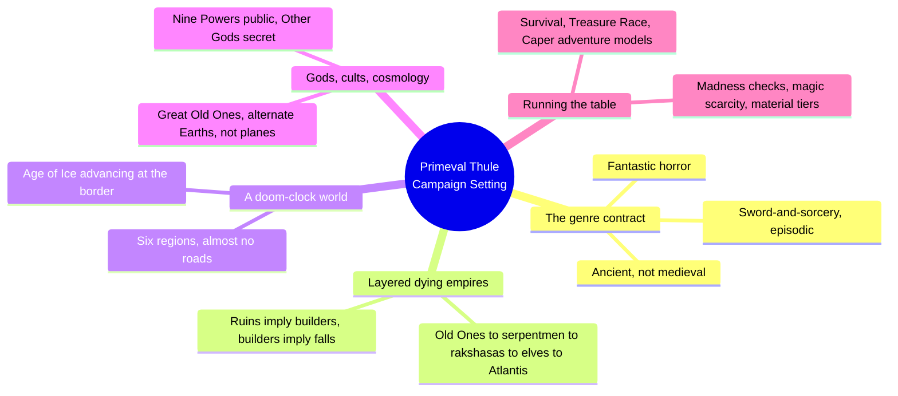
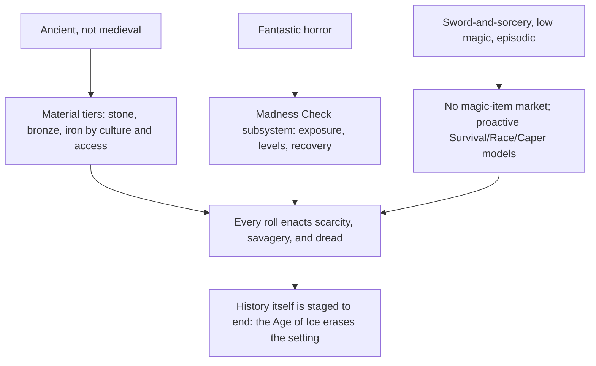
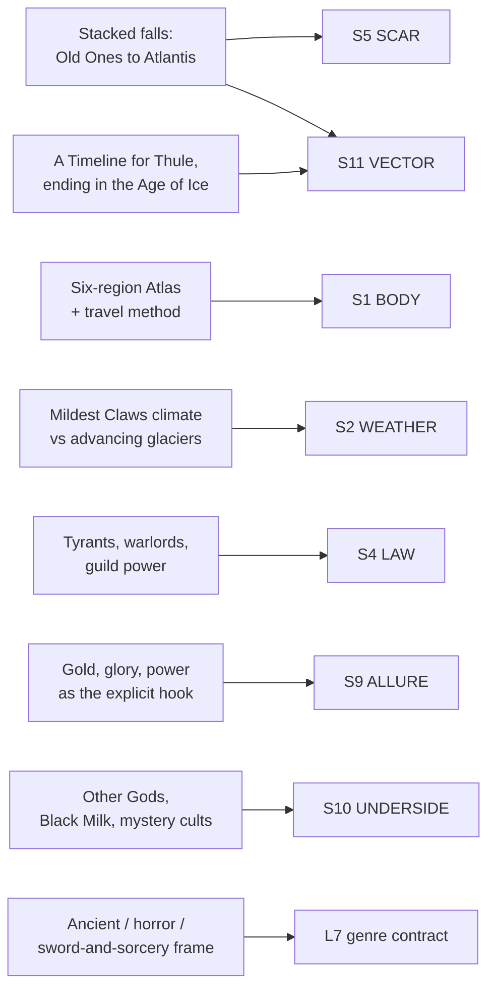

# BVX.1184 — Primeval Thule Campaign Setting — Richard Baker, David Noonan, Stephen Schubert (2014)
### Knowledge Entry — Distill

A worked sword-and-sorcery setting (Sasquatch Game Studio, D&D 4E/Pathfinder/13th Age compatible), read here not for its stat blocks but for the engineering: how it states dread and savagery as flat declaratives up front, then spends the rest of the book converting each one into a subsystem a table actually plays.

## TABLE OF CONTENTS
- [Core Thesis](#1-core-thesis)
- [Mind Models](#2-mind-models)
- [Framework](#3-framework--structure)
- [Key Concepts](#4-key-concepts)
- [Heuristics](#5-heuristics--decision-rules)
- [Invariants](#6-invariants)
- [Pitfalls](#7-pitfalls--myths)
- [Application](#8-application)
- [Cross-References](#9-cross-references)
- [Provenance](#10-provenance--confidence)

---

## 1 · CORE THESIS

Primeval Thule states its dread up front, as seven flat declaratives, then spends the whole book converting them into subsystems: a foretold Age-of-Ice ending, a Madness Check meter, a no-item-market magic economy, and a bronze-stone-iron material ladder. Tone survives contact with dice only when it is mechanized, not merely narrated.

---

## 2 · MIND MODELS

*Required. Minimum two diagrams, maximum five.*

**Diagram 1 — the whole argument.**
Caption: *the setting is built in five working blocks, and the last one — running the table — is where the other four get converted into things a die roll can touch.*

**Diagram 2 — the central mechanism (a conversion process, run once per genre commitment).**
Caption: *three genre promises each get exactly one crunchy subsystem instead of a paragraph of adjectives; that conversion, not the flavor text, is why the dread stays on the table after session one.*

**Diagram 3 — mapped onto the Command's SETTING SLICE (S1–S12).**
Caption: *the book's strongest single move, the layered-falls history, lands squarely on S5 SCAR and S11 VECTOR at once; the genre contract itself is the L7 read, exactly where Kobold's Baur essay also landed.*

---

## 3 · FRAMEWORK / STRUCTURE

Seven chapters plus an appendix, but the book's own logic runs in five working blocks rather than chapter order:

| Block | Chapters | What it does |
|---|---|---|
| The genre charter | Introduction | States seven flat declaratives about the world's tone before a single mechanic appears |
| The cosmology and history | Ch.1: The Primeval Continent | Stacks five prehuman-to-human empires, each fallen, plus gods, secret lore, and cosmology |
| The people | Ch.2: Heroes of Thule | Races, classes, and 19 heroic narratives (sampled only, outside this distill's scope) |
| The geography | Ch.3: Atlas of Thule | Six regions plus two island regions, each with a governing tension and worked city entries |
| Running the table | Ch.4: The Thulean Campaign | Converts the genre charter into subsystems: madness, magic scarcity, material tiers, adventure models |
| The worked instance | Ch.5: Quodeth, City of Thieves | One city built out in full, with three ready-to-play adventures (sampled) |
| Bestiary and magic | Ch.6–7, Appendix | Monster and spell content, game-system conversions (not read for this distill) |

The Introduction's "Seven Qualities of Thule" (barbaric; the wilderness is savage; cities are wicked places; the world is mysterious; magic is a secret man was not meant to know; ancient evils threaten mankind; freebooters, mercenaries, opportunists) is the charter every later chapter is answerable to. Chapter 4 is the payoff chapter: it is where each of those seven lines gets a rule.

---

## 4 · KEY CONCEPTS

| Concept | What it is | Why it matters |
|---|---|---|
| **Seven Qualities of Thule** | Seven one-line tonal declaratives stated before any mechanic exists | The charter the rest of the book is graded against; every subsystem in Ch.4 traces back to one of these seven lines |
| **Stacked dying empires** | Five layered civilizational falls in strict order: Great Old Ones, serpentmen, rakshasas, elves, Atlantis, then the current city-states | "Ruins imply a builder" taken to its recursive extreme: every age's dungeon is the previous age's fallen capital |
| **The Age of Ice doom clock** | A dated Timeline for Thule that names the world's own ending (glaciers erasing the continent) as part of the baseline, not a later reveal | The setting's decline is stated, not discovered; every region and city is already mid-collapse when play starts |
| **Ancient, not medieval** | A deliberate substitution list: bronze not steel, ziggurats not cathedrals, chariots not stirrup cavalry, hand-copied scrolls not printed books | Small factual swaps, not vibes, are what make "ancient" legible at the table instead of just asserted |
| **Fantastic horror + sword-and-sorcery** | The explicit genre contract: episodic personal stakes, low magic, monsters that cannot always be beaten, heroes who barely change | Names the sub-genre precisely enough that it converts cleanly into rules rather than staying a mood board |
| **Material tiers (stone / bronze / iron)** | Weapon and armor materials gated by culture: savage tribes use stone/bone, city-states and barbarians use bronze/copper, only dwarves (and lost Atlantis) know iron and steel | Arms and armor literally encode who is civilized and who still holds lost knowledge; a combat penalty enforces the fiction |
| **Madness Checks** | A leveled sanity-track subsystem (exposure, DC, cumulative penalties, recovery on rest) triggered by aberrant creatures, alien runes, or a Great Old One's voice | Converts "encountering Lovecraftian horror" from narration into a resource cost players actually feel |
| **Low-magic economy** | Magic items cannot be bought or sold, NPC spellcasters are scarce, alternate rewards (blessings, scaling gear) replace the usual magic-shop loop | Structural scarcity, not a difficulty dial the GM can quietly ignore |
| **Public / folk / secret gods** | Nine Powers (public pantheon, inscrutable), Forest Gods (barbarian nature spirits), Other Gods (Great Old Ones, secret, degenerate-cult only) | The Lovecraftian horror always sits one tier below what is sanctioned; nothing cosmic is ever the state religion |
| **Proactive adventure models** | Survival Adventure, Treasure Race, Caper: three templates that put the PCs' own ambition in the driver's seat instead of a villain's opening move | Keeps play episodic and greed-driven by structure, not just by GM reminder |
| **Region-first Atlas method** | Six continental regions plus two island regions, each summarized by one governing tension before terrain is described; city entries close with two-line Concerns and Secrets fields | Geography is subordinate to the region's dramatic question; the Concerns/Secrets pair is a compressed dread-and-decline instance per place |

---

## 5 · HEURISTICS & DECISION RULES

| Situation | Do this | Not this |
|---|---|---|
| Want dread that survives play | Give it a resource cost (a Madness Check, a scarcity rule) | Narrate it scarier and hope the mood holds |
| Want the world to feel old | Swap one concrete material or technology fact per scene (bronze blade, no stirrups, hand-copied scroll) | Describe it as "ancient" and change nothing mechanical |
| Placing a ruin or dungeon | Give it a named fallen builder from the stacked-empire lattice | Hand-wave "ancient evil place," builder unspecified |
| Naming a divine or cosmic threat | Decide public-tier (Nine Powers), folk-tier (Forest Gods), or secret-tier (Other Gods) before writing it | Let every threat be equally visible and equally sanctioned |
| Writing a region | State its one governing tension first, geography second | Lead with terrain and hope a theme emerges |
| Closing out a city entry | End with a two-line Concerns/Secrets pair: the stated problem versus the real one | Stop at population and a list of landmarks |
| Structuring an adventure | Pick one of Survival, Treasure Race, or Caper and build the hook from PC ambition | Default to "villain acts, PCs react" |
| Setting the world's endpoint | Give it a dated, foretold collapse baked into the baseline | Leave the setting's future open and add doom later as a twist |

---

## 6 · INVARIANTS

1. **Every ruin had a builder, and that builder fell to something with an even older ruin.** Dying empires stack; they never stand alone.
2. **Tone survives contact with dice only when it is mechanized.** Horror stays horror when it costs a resource; low magic stays low only when the market itself is structurally absent.
3. **The world's ending is foretold at genesis, not saved for a twist.** The doom clock is part of the baseline setup, stated on page one.
4. **Access to metalworking is a legible savagery gauge, not flavor text.** Stone, bronze, and iron are gated by culture and enforce a mechanical penalty, not just a description.
5. **Public religion is always shallower than the truth.** Whatever is sanctioned (Nine Powers) sits one tier above whatever is actually cosmic (Other Gods); the gap between them is where secret cults live.
6. **Player motivation is explicit and mercenary by default.** Gold, glory, and power are the stated contract; noble crusade is the exception, not the frame.
7. **Geography is subordinate to a place's governing tension.** A region or city is written from its dramatic question outward, not from its terrain inward.

---

## 7 · PITFALLS / MYTHS

- Treating "ancient world" as reskinned medieval fantasy with more sand. The book insists on specific factual swaps (materials, timekeeping, stirrup-less cavalry), not a change of adjectives.
- Letting Lovecraftian horror stay purely descriptive. Without a mechanic like the Madness Check, cosmic horror is flavor text a table quickly stops respecting.
- Writing dungeons as "ancient evil place, builder unknown." This breaks the stacked-empire logic the whole cosmology and Atlas depend on.
- Defaulting to reactive adventure design (a threat acts, the PCs respond) inside a sword-and-sorcery frame. It quietly converts an episodic, greed-driven game back into a conventional heroic-fantasy one.
- Holding a setting's collapse back as a late reveal. Thule's Age of Ice is stated in the introduction and the timeline both; the dread comes from knowing the ending, not from discovering it.
- Making every god equally visible. Collapsing the public/folk/secret tiering removes the exact gap that secret cults and Lovecraftian infiltration (Imystrahl's Black Milk) are built to occupy.

---

## 8 · APPLICATION

- **Spine level:** SETTING (non-story-spine source; keys to the entity beside the L0–L7 spine, per the SETTING SSOT's binding rule that setting is a Domain embodied, never a level)
- **12-layer character stack:** none directly; the material-tier and public/secret-god splits are structurally the same move as auditing an L4 WILL constraint or an L10 SHADOW gap, but this source stays setting-side
- **plot_systems:** contextual candidate once `04_PLOT_SYSTEMS/` opens; the three proactive adventure models (Survival, Treasure Race, Caper) are ready-made scene-generation templates keyed to PC ambition rather than villain action
- **Setting:** primary; this is a worked SETTING-shelf instance alongside GURPS Hot Spots: Renaissance Venice, but its strongest contribution is a craft move Venice doesn't carry: a history built as a strict stack of fallen precursor civilizations, each one's ruin becoming the next age's dungeon, with the whole arc foretold to end in ice.

The one idea worth stealing outright for a science-fiction setting: **the tone-to-rule conversion.** Primeval Thule names its genre contract in three lines (ancient not medieval, fantastic horror, sword-and-sorcery episodic scale) and then hands each line exactly one subsystem, a material-tier table, a Madness Check track, and a no-market magic economy, so that dread and scarcity are enforced by the rules a player touches every session, not by prose the GM has to keep re-selling. A science-fiction universe can run the same play: name the genre contract explicitly, then build one mechanic per line (resource scarcity for a scavenger economy, a corruption or contact meter for cosmic-horror exposure, a tech-tier table gating who has access to lost precursor knowledge) rather than leaving tone as description. The layered-falls history (S5 SCAR stacked five deep, feeding directly into S11 VECTOR's foretold Age-of-Ice ending) is the second reusable move: a setting's decline can be staged as a genealogy of falls, each one legible as the next age's dungeon, rather than a single flat backstory event.

---

## 9 · CROSS-REFERENCES

| Related entry | Relation |
|---|---|
| [[BVX.0458]] | The Kobold Guide to Worldbuilding — theory/toolkit counterpart; Baur's "How Real is Your World?" genre-lineage essay is the L7 move this book performs concretely rather than in the abstract |
| [[BVX.1122]] | GURPS Hot Spots: Renaissance Venice — sibling worked SETTING-shelf instance; Venice is the historically-anchored counter-example (S11 VECTOR present but undramatized) to Thule's foretold, dramatized collapse |
| [[BVX.0349]] | Against Worldbuilding, and Other Provocations — counter-argument sibling; Thule's tight Seven Qualities charter and its refusal to detail every region equally is a working answer to the kitchen-sink pitfall that book names as a thesis |

---

## 10 · PROVENANCE & CONFIDENCE

Full text, pdftotext extraction, 274pp, two-column layout with legible chapter breaks and a machine-readable TOC. Read in full: front matter and credits; Table of Contents; the Introduction (the Seven Qualities of Thule); Chapter 1, The Primeval Continent, in full, including A Savage World, Tyranny and Wickedness, Life in Thule, Gods and Cults (the Nine Powers and the Great Old Ones), Secret Lore (History of Thule, A Timeline for Thule, Sources of Magic, Distant Spheres, Alternate Earths, Parallel Dimensions), and In Closing. Read in full: the opening of Chapter 4, The Thulean Campaign (An Ancient World, Fantastic Horror, Sword and Sorcery, Running a Game in Thule, Creating Primeval Adventures, Wilderness Challenges, Madness and Horror, A Low-Magic Setting, Stone Age and Bronze Age Materials). Sampled: Chapter 3, Atlas of Thule (the region-method introduction and Travel in Thule read in full; the Claws of Imystrahl region and the Imystrahl city entry read in full as a worked example of the Concerns/Secrets city-entry pattern; the remaining five regions not read); Chapter 4's Campaign Arcs (the Idol of Daoloth arc read in full as a worked example of a Lovecraftian-artifact treasure-race structure; the God of the Stone Skulls arc sampled at its opening). Not read beyond the Table of Contents: Chapter 2 (Heroes of Thule: races, classes, 19 narratives), Chapter 5 (Quodeth, City of Thieves, including its three ready-to-play adventures), Chapter 6 (Monsters and Villains bestiary), Chapter 7 (Magic and Spells), and the Appendix (Game System Conversions).

The S-layer keying in frontmatter `feeds:` and Diagram 3 is this distill's synthesis against the Command's SETTING SLICE (S1–S12) taxonomy, following the same method BVX.0458 and BVX.1122 established for the SETTING shelf. The `spine: [SETTING]` and empty character-stack application are asserted per the v4 template's binding rule (setting is an entity beside the spine, never an L0–L7 level). No Zotero record exists yet for this title; it is filed in the `_PDF_DROP` staging area (src: drop, no zkey) pending a Zotero import pass, so `zotero_key` is left blank rather than fabricated.

## META
- Template: BVX-LEARN-v4.0
- Source classification: full-text sourcebook, deep extraction on core cosmology/history/genre-mechanics chapters, sampled on the Atlas and Campaign Arcs sections, unread on the crunch-only chapters (heroes, city adventures, bestiary, spells, appendix)
- Created / Updated: 2026-09-29
