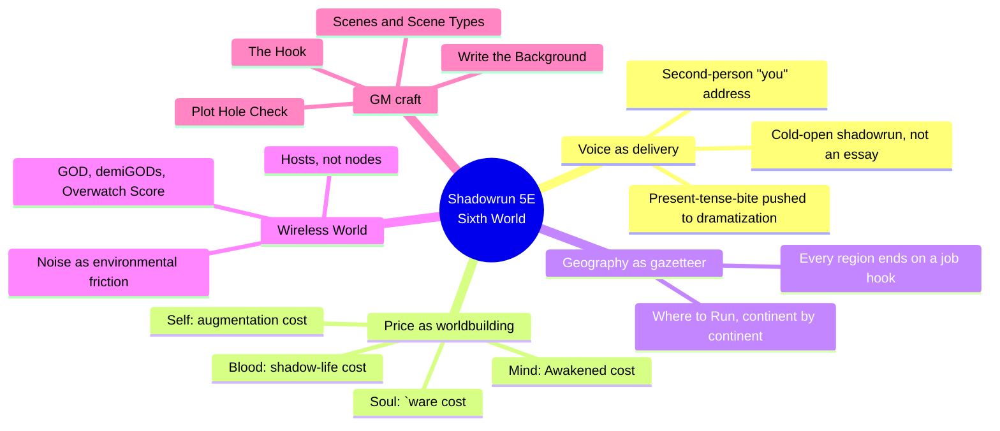
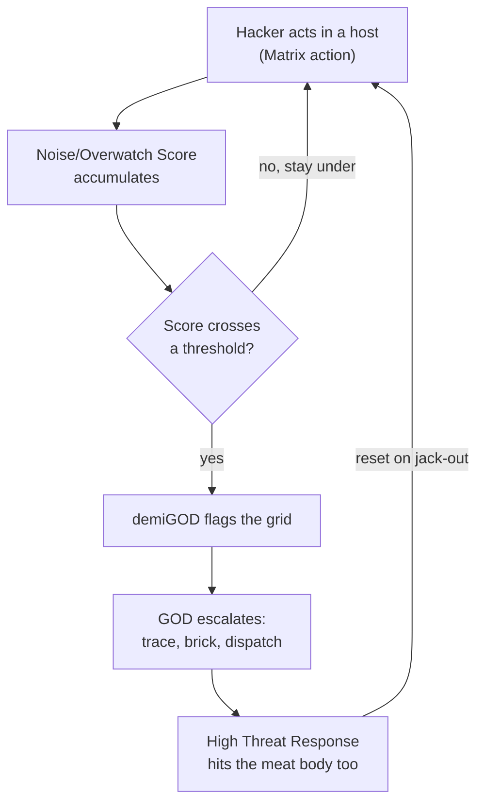
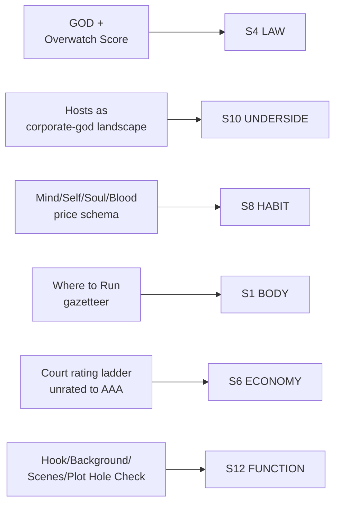

# BVX.1185 — Shadowrun, Fifth Edition — Catalyst Game Labs (2013)
### Knowledge Entry — Distill

The 5E core rulebook (CAT27000) for the Sixth World; distilled here for what 5E changes from 4E (BVX.0508) — a second-person in-world voice, a four-part price schema replacing exposition, and the Matrix rebuilt as a wireless landscape policed by GOD instead of a node-and-subscription rules chapter.

## TABLE OF CONTENTS
- [Core Thesis](#1-core-thesis)
- [Mind Models](#2-mind-models)
- [Framework](#3-framework--structure)
- [Key Concepts](#4-key-concepts)
- [Heuristics](#5-heuristics--decision-rules)
- [Invariants](#6-invariants)
- [Pitfalls](#7-pitfalls--myths)
- [Application](#8-application)
- [Cross-References](#9-cross-references)
- [Provenance](#10-provenance--confidence)

---

## 1 · CORE THESIS

Shadowrun 5E teaches its dystopian setting by making the reader live inside it, not read about it: a cold-open shadowrun replaces a history essay, and a four-part price schema (mind, self, soul, blood) turns belonging into a ledger. The Matrix, wireless now, is drawn as a lit landscape you fly through and GOD polices, not a subsystem you learn.

---

## 2 · MIND MODELS

*Required. Minimum two diagrams, maximum five.*

**Diagram 1 — the whole argument.**
Caption: *five moves distinguish 5E from 4E — a dramatized cold-open in place of an essay, a price-ledger in place of a faction survey, a continent gazetteer, a wireless landscape in place of a rules chapter, and a GM procedure for building any scene the same way.*

**Diagram 2 — the central mechanism (a real-time escalation, not a static topology).**
Caption: *the wireless Matrix is a chase, not a place — every action leaks noise, noise becomes Overwatch Score, and Score becomes consequence, which is why 5E can drop 4E's separate node-subscription rules and still feel more dangerous.*

**Diagram 3 — mapped onto the Command's SETTING SLICE, delta from 4E only.**
Caption: *5E's strongest new feeds cluster on LAW and UNDERSIDE (the wireless Matrix) and on HABIT (the price ledger) — exactly the layers 4E's own distill (BVX.0508) left thin or handled differently.*

---

## 3 · FRAMEWORK / STRUCTURE

The setting-relevant material runs in the same outside-in shape as 4E, but each stage is rebuilt:

| Section | Governing move | Delta from 4E |
|---|---|---|
| "Another Night, Another Run" / "The Battle Fought" | A full shadowrunner-voice job, start to finish, with no narrator explaining the world | 4E opened on a shorter vignette then handed history to an essay; 5E stretches the dramatized cold-open to carry the whole orientation |
| "Life in the Sixth World" → "Everything Has a Price" | Four short essays, one per price (mind, self, soul, blood), each addressed to "you" | New organizing device; 4E's street-level survey covered similar ground topic by topic (housing, money, SIN) rather than cost by cost |
| "Where to Run" | A continent gazetteer, each region closing on a one-line adventure hook | Not present in 4E's distilled chapters; geography as a hook generator, not backstory |
| "A Day in Your Life" | The shadowrun's own procedure: people you know, the meet, legwork, the plan, do it, wrap it up | Doubles as a player-facing GM template, unusual for a setting chapter |
| "The Opposition" / "Off the Job" | Corps, gangs, law enforcement, then money and media, still second-person | Continues 4E's faction-stack logic; adds the Court's rating ladder explicitly |
| "Wireless World" / "The Matrix" | A guided first-person tour of the Matrix as landscape, then a dense in-world jargon glossary | Full rebuild from 4E's node/subscription model to hosts, marks, GOD, and Overwatch Score |
| "Gamemaster Advice" → "Designing a Run" | The Hook, Write the Background, Scenes, Scene Types, Opposition, Plot Hole Check | Not present in 4E's distilled material; a general-purpose scene-construction procedure |

The load-bearing move, same as 4E: rules arrive last, after fiction and street texture. What 5E changes is what fills that space — a cost ledger instead of a survey, a landscape instead of a diagram.

---

## 4 · KEY CONCEPTS

| Concept | What it is | Why it matters |
|---|---|---|
| **The four-part price schema** | Four short essays — Paying with Your Mind (magic), Your Self (augmentation), Your Soul (`ware), Your Blood (the shadow life) — each closing on what that path costs | Replaces a topic survey with a cost ledger; every character option in the setting is legible as "what did you trade for this" before a single rule is read |
| **Second-person in-world address** | The whole orientation chapter speaks directly to "you," the reader-as-shadowrunner, never to a neutral player | Voice as worldbuilding: the reader learns the Sixth World's stakes by being addressed as someone already inside it, not told about it from outside |
| **The Corporate Court rating ladder** | Unrated → A → AA → AAA, each rung defined by a criterion (multinational, resilient enough, a Court seat), not a size estimate | Turns the faction stack's economic gate into something a GM can apply to any new corp on the fly, rather than a fact to be looked up |
| **Hosts, not nodes** | The Matrix has no separate node-by-node topology; everything is an icon in one continuous virtual landscape, with hosts as huge, self-contained places that "hover" over the physical world they mirror | The single biggest structural change from 4E: geography and the Matrix are now literally superimposed, not parallel systems |
| **GOD / demiGOD / Overwatch Score** | The Corporate Court's Matrix police (GOD), its per-grid subdivisions (demiGODs), and the rising meter (Overwatch Score) that measures how loudly a hacker is announcing themselves | Makes Matrix danger a visible, climbing number instead of an abstract subscription risk — the same shape as a stealth game's alert meter |
| **Noise as environmental friction** | Spam zones, static zones, and bad connections that degrade Matrix actions the way weather or terrain degrades a physical action | The wireless Matrix gets its own weather system; friction is spatial, not just adversarial |
| **The Hook** | The single seed idea (an NPC, an object, an image) that a GM builds a whole run around, explicitly allowed to come from anywhere | Names the smallest unit of scenario design; a hook is not a plot, it is the one thing that made the GM want to run this |
| **Write the Background** | A backstory for the run's plot itself — who really hired the runners and why — written for the GM's own use, most of which players may never see | The payoff is improvisational: when players break the plan, the GM can invent forward from a real, already-decided motive instead of stalling |
| **Scenes and Scene Types** | A run decomposed into modular scenes, each with one critical element defined, filed under a repeating type (Social, Investigation, Action) | A scene template a GM can stamp out fast, the same discipline Baur's Big Ten profile brought to factions in the Kobold Guide, applied here to plot units instead of NPCs |
| **Plot Hole Check** | After a run is fully planned, the GM rereads it in reverse — climax to opening — to test whether the forward causality still holds | A concrete proofreading technique for causality: writing backward from an ending is easy, reading backward catches what writing forward hides |

---

## 5 · HEURISTICS & DECISION RULES

| Situation | Do this | Not this |
|---|---|---|
| Orienting a reader to a dystopian setting | Open on one dramatized job, in the protagonist's own voice, start to finish | Open on a neutral essay explaining the world before showing anyone living in it |
| Explaining what a character option costs | Write one short piece per cost category, addressed directly to the reader | Bury the cost inside a rules paragraph as a side effect |
| Sorting a power structure into tiers | Define each tier by a testable criterion (what you must be true of to belong) | Describe tiers by vague size or vibe ("really big," "the top guys") |
| Building a pervasive technology's danger | Give it a visible, climbing meter tied to player action (Overwatch Score) | Leave danger as a background probability the players can't see or manage |
| Giving a virtual space texture | Let it degrade under in-world causes (noise, static, weather) the way physical space does | Treat the virtual space as a frictionless abstraction with only binary success/failure |
| Starting a scenario | Let a single vivid hook (image, NPC, object) be enough to start, and build outward from it | Wait for a complete plot before starting to write |
| Preparing for players to go off-script | Write a background for the plot itself, including facts players may never learn | Write only what the players are meant to discover, then freeze when they diverge |
| Checking a finished plot for holes | Reread the whole thing in reverse, climax to start | Only reread forward, in the order it was written |

---

## 6 · INVARIANTS

1. **A setting's cold-open teaches more than its history chapter.** 5E doubles down on 4E's present-tense-bite rule by replacing the essay with a fully dramatized job.
2. **A cost made explicit and itemized is more legible than a cost implied by consequence.** The four-part price schema turns "everything has a price" from a slogan into four short, checkable ledgers.
3. **A tier system needs a criterion, not a size estimate.** The Court's rating ladder is reusable on any new faction precisely because it's testable.
4. **A pervasive danger needs a visible meter.** Overwatch Score works because the player can watch it climb, not because the underlying math is complex.
5. **Virtual space earns believability from the same textures physical space has** — friction, weather, degradation — not from being rules-clean.
6. **A GM background exists to be improvised from, not merely followed.** Its value is measured at the moment a plan breaks, not at the moment it's written.
7. **Forward-written plots hide their own gaps; only a backward read exposes them.** Plot Hole Check is a proofing direction, not a proofing intensity.

---

## 7 · PITFALLS / MYTHS

- Opening a dystopian setting with exposition instead of letting the reader live one scene inside it first.
- Treating "everything has a price" as a theme statement instead of writing the actual four ledgers it implies.
- Ranking factions by adjective ("huge," "scary") instead of a testable membership criterion.
- Building a pervasive-tech danger system the player can't see accumulating in real time.
- Designing a virtual setting as a clean abstraction with no friction, weather, or degradation of its own.
- Writing a run's background only as far as the players are meant to discover it, leaving the GM nothing to improvise from when they don't.
- Proofing a finished plot only in the direction it was written, which hides exactly the causality gaps a backward read would catch.

---

## 8 · APPLICATION

- **Spine level:** SETTING (non-story-spine source, keyed beside the L0–L7 spine per the SETTING SLICE's binding rule)
- **12-layer character stack:** none directly; the four-part price schema is structurally the same audit move as costing an L6 DRIVE want, applied at the setting level instead of the character level
- **plot_systems:** primary candidate once `04_PLOT_SYSTEMS/` opens — the Hook to Background to Scenes to Plot Hole Check pipeline is a ready-made, reusable scene-construction procedure, and Plot Hole Check specifically is a backward-read proofing technique worth generalizing past TTRPG use
- **Setting:** primary; this entry's feeds sit almost entirely on the delta from BVX.0508 — S4 LAW and S10 UNDERSIDE at primary strength (the wireless Matrix, GOD, hosts), S8 HABIT at primary (the price schema), S1 BODY and S6 ECONOMY at supporting, S7 FOUNDING and S12 FUNCTION at contextual

Tested directly against a corporate-institution setting like DCUS: the four-part price schema is the sharpest single steal in this entry — DCUS already needs a version of "what does belonging to the Ultra School cost," and 5E's method (name the cost category, address the reader directly, close on the trade) is a faster route there than a descriptive paragraph. The GOD/Overwatch Score mechanism is a reusable shape for any setting that needs a *visible, climbing* danger meter tied to player action rather than a hidden probability — useful anywhere DCUS's institutional surveillance needs to feel live rather than backstory. Plot Hole Check (reread the finished plot in reverse) is a craft technique worth lifting outright for any scene sequence, TTRPG or not. Where this source stays close to 4E rather than changing it: the faction stack itself, SIN as underclass generator, and the deniable-asset protagonist mechanism are carried over structurally unchanged, so this entry does not re-distill them; see BVX.0508 for the full treatment.

---

## 9 · CROSS-REFERENCES

| Related entry | Relation |
|---|---|
| [[BVX.0508]] | Shadowrun, Fourth Edition — the direct predecessor; this entry exists specifically to cover the delta (wireless Matrix rebuild, price-schema voice, gazetteer, GM run-design procedure) rather than repeat what that entry already carries |
| [[BVX.0458]] | Kobold Guide to Worldbuilding — the SETTING-shelf theory counterpart; its "dynamite not encyclopedia" thesis and Baur's four-slot faction template are the same design instinct behind the Court's rating ladder and the Big Ten profiles |
| [[BVX.1122]] | GURPS Hot Spots: Renaissance Venice — a concrete SETTING-SLICE instance; useful contrast in how a historical-city sourcebook handles S1/S6 versus this corporate-megacity core rulebook |
| [[BVX.0399]] | Cyberpunk 2.0.2.0, undistilled sibling; the genre-adjacent corporate-dystopia RPG most useful to cross-check the wireless-Matrix and price-schema methods against |

---

## 10 · PROVENANCE & CONFIDENCE

Full text, pdftotext extraction, ~474pp (2nd printing, CAT27000). Read in full or near-full against 4E's own distilled scope, focused on delta: front matter and credits; the two-part opening fiction ("Another Night, Another Run" / "The Battle Fought"); "Life in the Sixth World" in full (Everything Has a Price — Magic/Mind, MegaCorps/Self, `Wares/Soul, Shadows/Blood; Where to Run, all continents; A Day in Your Life — People You Know, the Meet, Legwork, the Plan, Do It, Wrap It Up, What You Might Be Doing; The Opposition; Off the Job — Money, the Matrix, Music, Trideo); the "Wireless World" / "The Matrix" chapter opening (the guided tour, Matrix Basics, the full in-world jargon glossary) in full; the "Introduction" to Magic (sampled for voice, not re-distilled since 4E already covers magic's social order); "Gamemaster Advice" → "Designing a Run" in full (The Hook, Write the Background, Scenes, Scene Types, Opposition design, Plot Hole Check, Game Extras). Not re-extracted: mechanics chapters (combat, skills, gear, full Matrix/magic rules crunch), which carry no setting content beyond what 4E's distill already covers.

The S-layer keying in frontmatter `feeds:` and Diagram 3 follows the same method BVX.0458 and BVX.0508 established for the SETTING shelf, against `ssot_03_setting_system.md` (PART A, the twelve-layer SETTING SLICE), with this entry's keying deliberately scoped to what changed or was added versus BVX.0508 rather than re-keying material both editions share. `spine: [SETTING]` and the empty character-stack application are asserted per the v4 template's binding rule that setting is a Domain embodied beside the story spine, never an L0–L7 rung on it.

## META
- Template: BVX-LEARN-v4.0
- Source classification: full-text core rulebook, deep extraction on the setting/voice/Matrix/GM-craft chapters scoped to the 4E→5E delta, mechanics chapters not re-extracted
- Created / Updated: 2026-09-29
