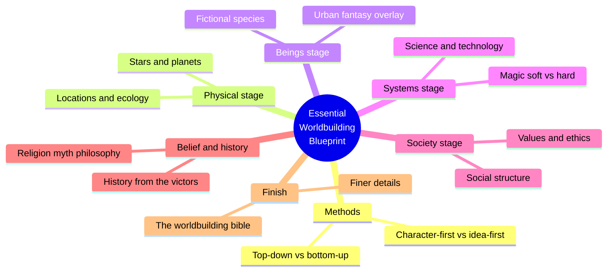
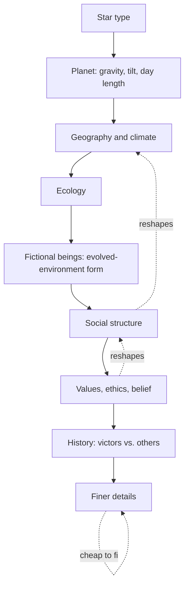
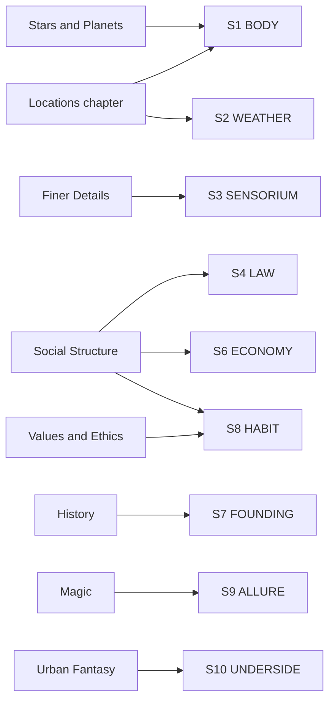

# BVX.1186 — The Essential Worldbuilding Blueprint and Workbook — Scribe Forge (2020)
### Knowledge Entry — Distill

A genre-agnostic fiction worldbuilding workbook (fantasy, paranormal romance, space opera) built as thirteen short craft chapters, each paired one-to-one with a fill-in worksheet; the second SETTING-shelf source built as a process tool rather than a theory or a worked instance.

## TABLE OF CONTENTS
- [Core Thesis](#1-core-thesis)
- [Mind Models](#2-mind-models)
- [Framework](#3-framework--structure)
- [Key Concepts](#4-key-concepts)
- [Heuristics](#5-heuristics--decision-rules)
- [Invariants](#6-invariants)
- [Pitfalls](#7-pitfalls--myths)
- [Application](#8-application)
- [Cross-References](#9-cross-references)
- [Provenance](#10-provenance--confidence)

---

## 1 · CORE THESIS

Build top-down in a fixed cascade: star, then planet, then geography and climate, then beings, then society, then belief, then history. Every layer constrains the next and is reshaped by it in turn. The worksheet, not the prose, is the deliverable: a project bible you fill once and reuse per world.

---

## 2 · MIND MODELS

*Required. Minimum two diagrams, maximum five.*

**Diagram 1 — the whole argument.**
Caption: *thirteen chapters sort into six build stages, each shadowed by its own worksheet — the book is a procedure, not a reference.*

**Diagram 2 — the central mechanism (a constraint cascade, run once per world).**
Caption: *nothing gets designed in isolation — each stage hands the next stage a set of constraints, and late stages can still reach back and force an earlier one to change.*

**Diagram 3 — mapped onto the Command's SETTING SLICE (S1–S12).**
Caption: *nine chapters land on seven of twelve slice layers; the Finer Details chapter is this source's standout contribution — it is the first library source to fill S3 SENSORIUM directly, the gap BVX.0458 flagged and left open.*

---

## 3 · FRAMEWORK / STRUCTURE

Three parts, built to be worked in lockstep rather than read cover to cover:

| Part | Contents | Function |
|---|---|---|
| **Part 1** | 13 short chapters: Stars/Planets, Locations, Fictional Beings, Magic, Urban Fantasy/Paranormal Romance, Science, Technology, Social Structure, Values/Ethics, Religion/Mythology/Philosophy, History, Finer Details | Craft guidance and genre-specific tips, each chapter pointing forward to its own worksheet page |
| **Part 2** | 11 worksheets, one per applicable chapter, each a series of single-question pages headed "Project Name" | The actual deliverable — a fillable "project bible," explicitly designed for photocopying and reuse across worlds and locations |
| **Part 3** | Appendix A (curated external resources by topic: general, worksheets/checklists, maps, languages/names, alien species, history) and Appendix B (software tools: novel-writing, mapping) | Positions the book as a hub pointing outward, not a closed system |

Two explicit build orders open the book (**Methods of Worldbuilding**, p.3) and govern how the rest is used: **top-down** (plan the whole cascade before writing, more consistent, higher upfront cost) and **bottom-up** (build only what the current scene needs, less overhead, more retrofit risk). Two starting points cross-cut these: **start with a character** (derive society from them) or **start with an idea** (a premise like "a society run by women," then design outward). The book does not rule between them; it hands the writer the choice on page 3 and never revisits it.

Every chapter that isn't universally relevant explicitly tells the reader when to skip it (Earth-set stories skip Stars and Planets; non-urban-fantasy projects skip that chapter entirely) — permission to work a subset of the cascade, not the whole thing.

---

## 4 · KEY CONCEPTS

| Concept | What it is | Why it matters |
|---|---|---|
| **The constraint cascade** | Star → planet → geography/climate → ecology → beings → society → values → history, each stage limiting the next | The book's real spine; almost every craft point traces back to "this was set two stages ago, so this stage inherits it" |
| **Frameworks vs. details** | Frameworks (the six-stage cascade) are costly to change mid-draft; details (fashion, art, holidays, naming) are cheap to change | A depth-allocation rule: plan the cascade carefully, improvise the details |
| **Evolved environment vs. current environment** | A being's body and instincts are shaped by the environment its *ancestors* evolved in, not necessarily where it lives now | Explains mismatches without hand-waving (a domesticated animal in a city still behaves like its wild ancestor) |
| **Soft magic / hard magic** | Sanderson's split: soft magic is mysterious, unsuited to solving problems; hard magic has explicit rules the reader has learned, and can resolve conflict | Gatekeeps when magic is allowed to save a character versus when it would read as a cheat |
| **Sanderson's four laws (applied)** | 1) power to solve conflict is proportional to reader understanding, 2) limitations matter more than powers, 3) deepen what exists before adding more, 4) err toward awesome | The book routes every magic-system question through this filter, then extends law 3 into a full consequence checklist (technology, science, health care, law, war, economy, art) |
| **History from the victors** | The worksheet has the writer draft an event from the winning side's point of view, then ask what other groups say about the same event | A built-in perspective-conflict generator: one event, several factions, several "truths" |
| **Tech/culture parity** | A society's technology level must be commensurate with the rest of its culture — no light sabers for medieval knights, no internal combustion for hunter-gatherers | A consistency check applied across the whole cascade, not just to gadgets |
| **The worldbuilding bible** | A single running document (the worksheets themselves, or Appendix B software) that tracks every decision made | The book's actual product; Part 1 is instruction, Part 2 is the bible's blank pages |

---

## 5 · HEURISTICS & DECISION RULES

| Situation | Do this | Not this |
|---|---|---|
| Choosing a build order | Pick top-down for a planned series, bottom-up for a single fast draft — and commit | Drift between the two and lose both consistency and speed |
| A character needs to solve a problem with magic | Only if the reader already understands the rule that lets it work | Introduce a new magical solution in the moment (deus ex machina) |
| Designing any magic or tech system | Write what it *cannot* do before what it can | List powers/features with no stated limits |
| Designing a fictional being's body | Derive form from the environment it *evolved* in | Derive form from the environment it lives in *now*, if the two differ |
| Setting a culture's core value | Name one or two values, then name the contradiction most people live with anyway | Present the culture as uniformly living its stated ideal |
| Writing world history | Draft the victor's version, then ask what the losers and bystanders say | Write one "objective" account and stop |
| Allocating drafting time | Nail the six-stage cascade before writing; leave fashion, art, and naming loose | Spend early drafting time polishing details that are cheap to change later |
| Setting a society's technology | Match it to the rest of the culture's development level | Add an advanced gadget because it's cool, with no cultural support for it |
| Deciding how much worldbuilding a chapter needs | Match depth to the being/place's story role (background creature = light fill; main character species = full worksheet) | Fill every worksheet to the same depth regardless of story weight |

---

## 6 · INVARIANTS

1. **Every part of a world is interconnected.** A change at one stage of the cascade propagates forward and can force a rewrite of a later stage — and, less often, an earlier one.
2. **Nothing in a designed world is entirely positive or entirely negative.** Balance is a design requirement, not a nicety.
3. **Limitations generate story problems; raw power does not.** A system's "cannot" is more load-bearing than its "can."
4. **A being's design follows its evolutionary environment, not its current one**, unless magic or engineering explicitly overrides biology.
5. **History is always told from a victor's position first.** Other perspectives must be actively solicited, not assumed to surface on their own.
6. **Technology (and by extension magic) must stay commensurate with the surrounding culture's development.** A single anachronistic tool without support elsewhere breaks believability.
7. **Frameworks are expensive to revise after drafting begins; details are cheap.** This asymmetry, not any moral rule, is why the book sequences the cascade before the details chapter.

---

## 7 · PITFALLS / MYTHS

- Skipping straight to "cool" gadgets or magic powers without first fixing what they *cannot* do — makes both feel arbitrary rather than earned.
- Solving a plot problem with a magical ability the reader hasn't been shown the rules for — reads as a cheat even in an otherwise well-built soft-magic world.
- Designing a fictional being purely from its current habitat, ignoring the environment its lineage actually evolved in — produces a body that doesn't match its own stated instincts.
- Treating a culture's stated core value as something everyone actually lives by, with no dissent, hypocrisy, or subculture variation.
- Giving a society a level of technology unsupported by the rest of its development (the book's own example: medieval knights with light sabers).
- Writing a "neutral" single-account history instead of running the victors/losers worksheet, which erases the friction that makes history usable for plot.
- Spending disproportionate early-draft time on finer details (fashion, holidays, naming) before the load-bearing cascade (star through history) is settled, since the cascade is the expensive layer to fix later.

---

## 8 · APPLICATION

- **Spine level:** SETTING, primary; CRAFT-PROCESS, secondary — this is a workbook, and its worksheet *form* (one question per page, headed "Project Name," numbered for reuse) is itself a transferable process artifact, independent of its content.
- **12-layer character stack:** contextual only — the Fictional Beings chapter's evolved-environment method is a body-design tool that could inform an alien or paranormal L1 CORE fill, but it is written for species, not individual characters, and stays off the character stack proper.
- **plot_systems:** contextual candidate — the History worksheet's victors/losers/other-groups triad is a ready-made scene-hook generator once `04_PLOT_SYSTEMS/` opens: run any settled historical event through it to surface a live faction grievance.
- **Setting:** primary — this source fills seven of twelve SETTING SLICE layers (S1, S2, S3, S4, S6, S7, S8 at primary/supporting strength, S9 and S10 thinner), and it is the first SETTING-shelf source to feed S3 SENSORIUM directly, closing a gap BVX.0458 left explicitly open.

The book is not sold as a TTRPG product and never mentions a GM, a player, or a campaign — but its worksheet mechanics are structurally identical to gazetteer and GM-screen conventions from the tabletop trade: one topic per page, a repeatable header field ("Project Name") standing in for a place or faction ID, and explicit encouragement to photocopy and renumber pages per instance. That is the concrete TTRPG tool worth stealing here: not a rule or a taxonomy, but the *form itself* — a fill-in-the-blank, one-topic-per-card template built for running the same schema across many instances. It is the closest thing in the library to a working draft of the Command's own SCENE CARD notation (`ssot_03_setting_system.md`), arrived at independently, from the fiction-writer's side rather than the GM's side, and validates that a one-slot-per-layer physical card is the right shape for filling a slice repeatably rather than writing free prose per place. Its weakest chapter against the slice is Fictional Beings — rich and specific, but built for individual species, not places, so it sits outside S1–S12 entirely rather than filling one thinly.

---

## 9 · CROSS-REFERENCES

| Related entry | Relation |
|---|---|
| [[BVX.0458]] | Kobold Guide to Worldbuilding — the founding SETTING-shelf distill; this source fills S3 SENSORIUM, the gap that entry named explicitly, but is thinner on S5 SCAR and S11 VECTOR, which Kobold covers strongly |
| [[BVX.1122]] | GURPS Hot Spots: Renaissance Venice — the worked-instance counterpart; this entry is the generic-procedure counterpart, running the same cascade logic on any genre rather than one researched city |
| [[BVX.0349]] | Against Worldbuilding, and Other Provocations — counter-argument sibling; this book's own skip-what-doesn't-apply instruction is a mild, workbook-native version of Kennedy's kitchen-sink warning |
| [[BVX.1173]] | Curse of Strahd — a filled S12 FUNCTION instance; useful contrast, since this workbook's process never asks the writer to bind a place to a storyform the way a TTRPG campaign module does |
| [[BVX.1165]] | Fantasy World-Building: A Guide to Developing Mythic Worlds and Legendary Creatures — undistilled sibling, same general (non-TTRPG) worldbuilding-guide register |

---

## 10 · PROVENANCE & CONFIDENCE

Full text, ~120,000 characters, clean plain-text extraction with a machine-readable table of contents. Read in full: front matter and "How to Use This Guide"; "Tips to Get Started" (worldbuilding methods); all thirteen Part 1 chapters (Stars and Planets; Locations: Geography, Climate, Ecology; Fictional Beings; Magic; Urban Fantasy and Paranormal Romance; Science; Technology; Social Structures; Values and Ethics; Religion, Mythology, and Philosophy; History; The Finer Details); the full Part 2 worksheet set (confirmed one-to-one against Part 1, read in full to verify the question-per-page pattern held across all eleven worksheets rather than sampled); Appendix A (Resources) and Appendix B (Tools) in full; the closing "About us" note (source of the author attribution to the Scribe Forge imprint, no individual writer credited on the title or copyright page).

The S-layer keying in frontmatter `feeds:` and Diagram 3 is this distill's synthesis against `ssot_03_setting_system.md` (PART A, the twelve-layer SETTING SLICE), matching the table form set by BVX.0458 and BVX.1122. `zotero_key` is blank pending the next inventory pass; `bvx_provisional: true` since this id isn't yet reconciled against the library, matching the convention set by BVX.1173 and BVX.1171 in this same intake wave.

## META
- Template: BVX-LEARN-v4.0
- Source classification: full-text workbook, complete read (all three parts, all thirteen chapters, all eleven worksheets, both appendices)
- Created / Updated: 2026-09-29
