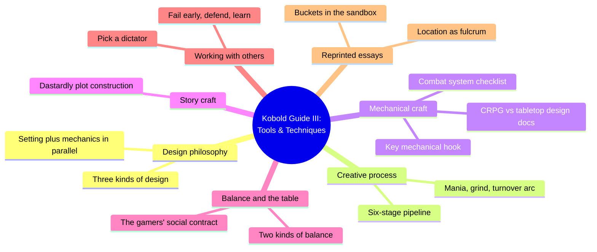
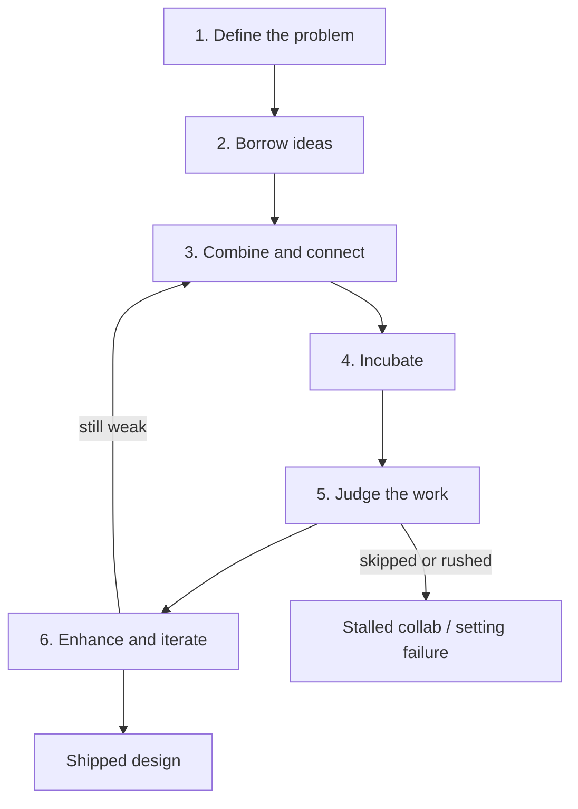
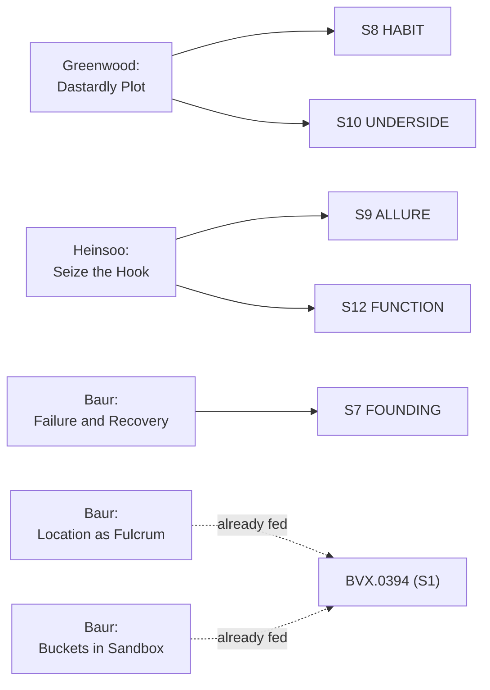

# BVX.1187 — The Kobold Guide to Game Design, Volume III: Tools & Techniques — ed. Janna Silverstein (2010)
### Knowledge Entry — Distill

Twelve essays on the working craft of RPG design (mostly Wolfgang Baur, with Cook, Greenwood, Heinsoo, and McComb); the third of the original Kobold Guide volumes, largely a process-and-collaboration book, with two essays it shares verbatim with BVX.0394 and one essay — Crafting a Dastardly Plot — that is new setting-adjacent material this distill exists to capture.

## TABLE OF CONTENTS
- [Core Thesis](#1-core-thesis)
- [Mind Models](#2-mind-models)
- [Framework](#3-framework--structure)
- [Key Concepts](#4-key-concepts)
- [Heuristics](#5-heuristics--decision-rules)
- [Invariants](#6-invariants)
- [Pitfalls](#7-pitfalls--myths)
- [Application](#8-application)
- [Cross-References](#9-cross-references)
- [Provenance](#10-provenance--confidence)

---

## 1 · CORE THESIS

A designer fully controls only two things, the rules and the setting; everything else (NPC voice, plot, the players' choices) survives contact with the table only if the GM chooses to run it as written. Every craft skill in this volume, from the creative-thought pipeline to collaboration to failure, exists to protect one of those two levers.

---

## 2 · MIND MODELS

*Required. Minimum two diagrams, maximum five.*

**Diagram 1 — the whole argument.**
Caption: *twelve essays sort into six craft clusters — this is a working-designer's toolbox, not a worldbuilding theory, and two of its essays are reprints already claimed by BVX.0394.*

**Diagram 2 — the central mechanism (the creative-thought pipeline, a process).**
Caption: *nearly every other essay in the book is a close-up of one stage in this pipeline — mania and despair are what stages four through six feel like from inside, and collaboration or failure are what happens when a stage gets skipped.*

**Diagram 3 — mapped onto the Command's SETTING SLICE (S1–S12).**
Caption: *only three essays land new setting territory; the other two setting-shaped essays in this volume are the same text BVX.0394 already fed, so no new claim is staked on S1.*

---

## 3 · FRAMEWORK / STRUCTURE

Twelve essays, no shared spine beyond "here's how the work actually gets done":

| Essay | Author | Governing question |
|---|---|---|
| What is Design? | Baur | What levers does a designer actually control, and how do rules and setting share the work? |
| Designing RPGs: Computer and Tabletop | McComb | What does a CRPG's design document demand that a tabletop rulebook can leave to the GM? |
| The Process of Creative Thought | Baur | What is the repeatable pipeline behind a "flash of insight"? |
| Creative Mania & Design Despair | Baur | How does a project's emotional arc predict where a designer needs the most discipline? |
| Seize the Hook | Heinsoo | What mechanic must evoke a game's theme, and what happens when you follow its full implications? |
| Basic Combat Systems for Tabletop Games | McComb | What's the minimum checklist for a working dispute-resolution system? |
| Crafting a Dastardly Plot | Greenwood | What makes a villain's scheme feel dastardly rather than decorative? |
| Location as a Fulcrum for Superior Design | Baur | What's the one story element a designer fully controls? (reprinted; primary claim already in BVX.0394) |
| Myths & Realities of Game Balance | Cook | Who actually delivers "game balance," the rulebook or the table? |
| Buckets in the Sandbox | Baur | Does "open world" mean "no structure"? (reprinted; primary claim already in BVX.0394) |
| Collaboration and Design | Baur | What habits keep a multi-designer project from stalling or exploding? |
| Failure and Recovery | Baur | How does a designer fail early, defend what can't be fixed, and learn from the rest? |

---

## 4 · KEY CONCEPTS

| Concept | What it is | Why it matters |
|---|---|---|
| **Three kinds of design** | New rules, new experiences, new modes of play — each needs a different skill set | Frames every other essay as serving one of these three jobs |
| **Setting plus mechanics in parallel** | RPG audiences split between rules-tinkerers and setting-explorers; a design that only serves one starves the other | Names the same rules/flavor tension BVX.0458 and BVX.0394 argue from the worldbuilding side, here argued from the production side |
| **Six-stage creative pipeline** | Define, borrow, combine, incubate, judge, enhance | The volume's throughline; nearly every other essay is a close reading of one stage |
| **Mania, grind, turnover arc** | The emotional cost of stages four through six: euphoric start, joyless middle, hopeful-or-enraged handoff | Lets a designer budget for the grind instead of mistaking it for a sign the project has failed |
| **Key mechanical hook** | The one mechanic that must evoke the game's theme (Call of Cthulhu's Sanity, RuneQuest's Rune sacrifice, Cults of Prax) | A game succeeds or fails on whether this hook changes how the character is played, not on how clever it looks on paper |
| **Cults of Prax cosmology-as-class** | RuneQuest's gods and cults, gated behind rune magic, function as the game's class system | Worldbuilding and mechanics fuse: a cosmology becomes structural the moment it gates real character options |
| **Distributed design** | A tabletop rulebook stays terse because the GM improvises the rest; a CRPG design document must specify everything a GM would have made up | Explains why the same "10x10 room, an orc, a chest" line needs one sentence at a table and a binder of specs for a game studio |
| **Two kinds of game balance** | Character-vs-character ("time to shine") and character-vs-challenge | Neither is fixable by rules text alone; both need a human at the table |
| **The gamers' social contract** | Balance is delivered by trust between GM and players, not by the rulebook | "Don't be a jerk" is, per Cook, the actual first rule of every RPG |
| **Dastardly plot construction** | Mystery, menace, contingency branches, impostors, and several rival plots running at once | Turns "the villain has a scheme" into a reusable checklist for faction conflict and belonging-architecture stress |
| **Pick a dictator** | A design collaboration needs one person with the authority to stop discussion, enforce decisions, and veto dead ends | Peer-only collaboration, tried without a dictator, produced only creative stalemate |
| **Setting Failures / commit-and-defend** | Once a setting ships, it can't be un-shipped; the designer's only moves are moving past it or learning from it | The production-side twin of BVX.0458's present-tense-history rule: a founding choice isn't just written lean, it's permanent |

---

## 5 · HEURISTICS & DECISION RULES

| Situation | Do this | Not this |
|---|---|---|
| Splitting effort between rules and setting | Build both in parallel, sized to your audience's taste | Assume one carries the other |
| Facing a genuinely new design problem | Run it through define, borrow, combine, incubate, judge, enhance | Force combination and judgment before the problem is defined |
| Hitting the "grind" phase of a manuscript | Expect it, save a rewarding section for the end, keep moving | Mistake the grind for proof the project is bad |
| Choosing a mechanic to build a game's identity around | Chase one hook that evokes the theme, then follow its full consequences | Stop at a clever mechanic that connects to nothing else |
| Building a setting's magic or cosmology | Gate real character options behind cult or cosmology membership | Publish gods and magic systems as flavor text with no mechanical teeth |
| Running a group design project | Name one dictator with veto power up front | Let every collaborator hold equal, unbreakable say |
| A shipped setting detail turns out wrong | Move past it quietly, or own the lesson for next time | Publicly insist the flawed choice was right all along |
| Writing a villain's scheme | Give it contingency branches, an impostor, and rival plots running at once | Write one clean plan with no fallback and no competitors |
| Diagnosing "unbalanced" complaints at the table | Check the social contract and the GM's calibration first | Assume the rulebook's math alone is broken |

---

## 6 · INVARIANTS

1. A designer fully controls only the rules and the setting; everything else is improvised, tweaked, or ignored at the table.
2. Creative work runs the same six-stage pipeline (define, borrow, combine, incubate, judge, enhance) whether or not the designer names the stages.
3. A key mechanical hook is judged by whether it changes how a character is played, not by how clever it looks on the page.
4. Game balance is a property of the table's social contract; no amount of rules text can deliver it alone.
5. A dastardly plot needs menace, mystery, contingency, and company — several rival schemes in motion, not one clean villain plan.
6. Collaboration needs a single decision-owner; unanimity among equals produces stalemate, not synthesis.
7. Setting choices, once published, are functionally irreversible; the only professional responses are moving past a bad one or learning from it before the next.

---

## 7 · PITFALLS / MYTHS

- Writing a tabletop rulebook like a CRPG design document, over-specifying details a GM would rather improvise.
- Falling in love with an early idea and skipping the critical-judgment stage.
- Publishing a magic system or pantheon as flavor text with no mechanical consequence, the Cults of Prax counter-example inverted.
- Blaming the rulebook for "unbalanced" play instead of the table's social contract.
- Running a design collaboration as a democracy with no one holding veto power.
- Writing a villain plot with a single plan and no contingency or rival scheme.
- Publicly defending a setting decision that can't actually be fixed, instead of quietly moving past it.

---

## 8 · APPLICATION

- **Spine level:** SETTING (per the assignment; most of this volume is general design-process craft, not setting-structural — the same honest framing BVX.0394 uses for its own non-setting majority)
- **12-layer character stack:** none directly — Crafting a Dastardly Plot's motive-plus-contingency method is the same move as sketching an L6 DRIVE want and its costs for a minor antagonist, but it isn't itself a character-layer feed
- **plot_systems:** primary candidate once `04_PLOT_SYSTEMS/` opens — Crafting a Dastardly Plot's checklist (mystery, menace, contingency branches, impostors, several plots running at once) is a ready-made generator for a SCENE CARD's villain-thread and complication fields; the creative-thought pipeline (Diagram 2) is a usable scaffolding for any generator that needs to model "idea to shipped content"
- **Setting:** supporting — three essays land new territory (S7, S8, S9, S10, S12 at supporting/contextual strength); two essays (Location as a Fulcrum, Buckets in the Sandbox) are the same text already fed as primary by BVX.0394 and are not re-claimed here

The setting-useful third of this volume is a TTRPG tool a writer can steal directly: Crafting a Dastardly Plot is a working method for building faction conflict that a GM (or a novelist) can run cold, right down to the rule that a robust campaign needs at least two, usually four or more, plots in motion before the PCs' own plots even start. Tested against DCUS in `ssot_03`: the Star-Rating administration, the Sync Cult, and the buried Skeeter Creek legacy identity are three plots that were already running simultaneously before Tori's own plot begins, exactly the "several rival plots at once" shape Greenwood describes, and the rename lattice (Skeeter Creek to Red Hills to DCUS) is a live instance of the Setting Failures invariant: each rebrand was a founding decision nobody could take back, only build around. Seize the Hook's Cults of Prax example is the cleanest single worked case in the library so far of a cosmology gating character mechanics rather than decorating them, worth citing whenever S9 ALLURE or S12 FUNCTION needs a concrete non-Dramatica reference point. The book's non-setting two-thirds (creative process, combat math, collaboration, failure) is general design craft, useful to the Command's own build discipline but not itself feeding the setting slice.

---

## 9 · CROSS-REFERENCES

| Related entry | Relation |
|---|---|
| [[BVX.0394]] | Complete Kobold Guide to Game Design — the 2019 compilation that already reprints and fully distills this volume's Location as a Fulcrum and Buckets in the Sandbox essays; this entry deliberately does not re-stake those primary claims |
| [[BVX.0458]] | Kobold Guide to Worldbuilding — primary SETTING distill; this volume's Setting Failures section (S7) and Dastardly Plot method (S8, S10) are production-craft companions to 0458's present-tense-history and mystery-cult claims |
| [[BVX.1122]] | GURPS Hot Spots: Renaissance Venice — worked SETTING-SLICE instance; Dastardly Plot's contingency-branch method is a cheap way to stress-test whether a sourcebook's faction roster actually has rival plots in motion |

---

## 10 · PROVENANCE & CONFIDENCE

Full text, pdftotext extraction, 86pp, clean text layer with a machine-readable table of contents and legible page-footer chapter markers. The originally staged extraction file for this id was the wrong book (Kobold Guide to Game Design, Volume I: Adventures); this distill was built from the corrected Volume III: Tools & Techniques file after that mismatch was caught and flagged mid-task.

Read in full: "What is Design?" (Baur); "Designing RPGs: Computer and Tabletop" (McComb); "The Process of Creative Thought" (Baur); "Creative Mania & Design Despair" (Baur); "Seize the Hook" (Heinsoo); "Crafting a Dastardly Plot" (Greenwood); "Myths & Realities of Game Balance" (Cook); "Collaboration and Design" (Baur); "Failure and Recovery" (Baur, including the "Setting Failures" section). Sampled: "Basic Combat Systems for Tabletop Games" (McComb — the opening framing and attack-system checklist header, not the full modifier and damage tables; out of scope, mechanical rather than setting-adjacent); "Location as a Fulcrum for Superior Design" (Baur — opening section only, confirmed word-for-word identical in premise and argument to the essay BVX.0394 already extracted in full); "Buckets in the Sandbox: Non-Linear and Event-Driven Design" (Baur — opening "Non-linear Structure" section only, likewise confirmed as the same reprinted essay BVX.0394 already covers). Not read: contributor biographies (out of scope).

The S-layer keying in frontmatter `feeds:` is this distill's synthesis against `ssot_03_setting_system.md` (PART A, the twelve-layer SETTING SLICE), cross-checked against BVX.0394's and BVX.0458's existing feeds to avoid duplicate primary strength on Location as a Fulcrum's S1 claim or Buckets in the Sandbox's plot-structure territory. All new feeds here run supporting or contextual, since the book's setting-relevant material (Dastardly Plot, Seize the Hook's Cults of Prax example, Failure and Recovery's Setting Failures section) sharpens layers the siblings already claim at primary strength rather than opening new ones. `spine: [SETTING]` follows the key supplied with this task; per the v4 template's binding rule, setting is an entity beside the L0–L7 spine, never a level this distill claims the source occupies.

## META
- Template: BVX-LEARN-v4.0
- Source classification: full-text essay collection, deep extraction on 9 of 12 essays, sampled on 3 (2 of which are confirmed reprints already fully distilled elsewhere), contributor bios out of scope
- Created / Updated: 2026-09-29
