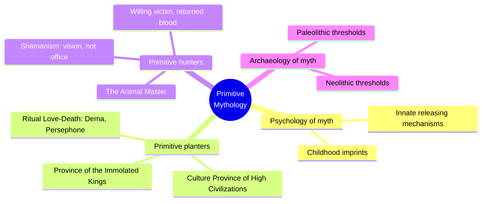
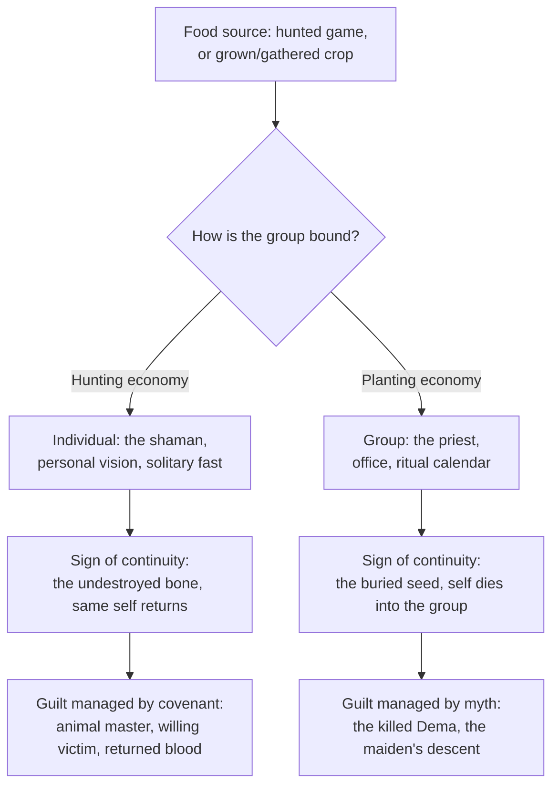
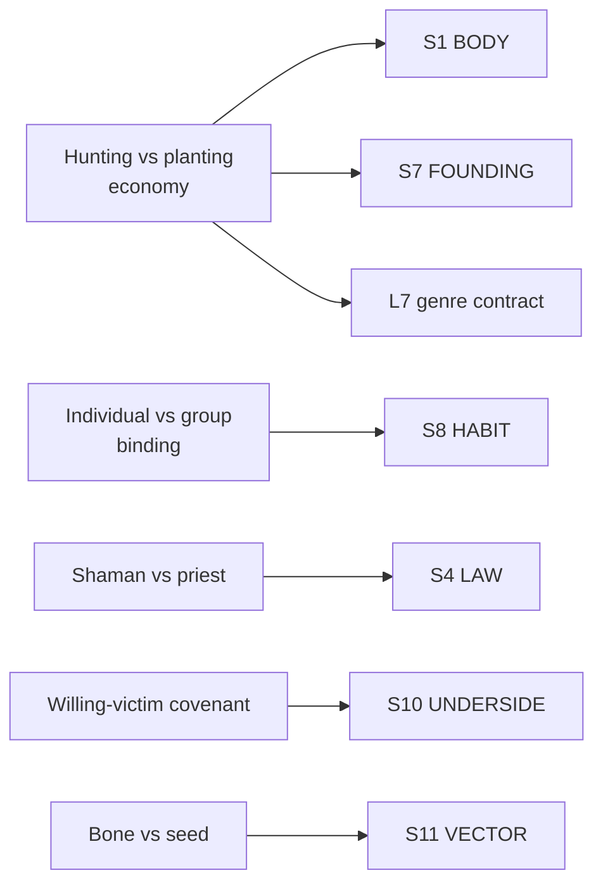

# BVX.1188 — The Masks of God, Volume I: Primitive Mythology — Joseph Campbell (1959)
### Knowledge Entry — Distill

Campbell's first volume in the series, tracing mythology from the paleolithic hunt through the neolithic garden to the first hieratic city-states; read here for its method: a culture's way of getting food generates the shape of its myth and rite.

## TABLE OF CONTENTS
- [Core Thesis](#1-core-thesis)
- [Mind Models](#2-mind-models)
- [Framework](#3-framework--structure)
- [Key Concepts](#4-key-concepts)
- [Heuristics](#5-heuristics--decision-rules)
- [Invariants](#6-invariants)
- [Pitfalls](#7-pitfalls--myths)
- [Application](#8-application)
- [Cross-References](#9-cross-references)
- [Provenance](#10-provenance--confidence)

---

## 1 · CORE THESIS

A people's way of getting food is not backdrop to its myths; it is the engine that generates them. Hunters, who take a life that could have run, build individual-centered myth around a negotiated animal-master covenant. Planters, who raise food from a killed and buried body, build group-centered myth around the calendar, the priesthood, and death-and-resurrection.

---

## 2 · MIND MODELS

*Required. Minimum two diagrams, maximum five.*

**Diagram 1 — the whole argument.**
Caption: *four parts, one spine: psychology sets up the mechanism, planters and hunters run it two opposite ways, archaeology dates the sequence.*

**Diagram 2 — the central mechanism (a causal chain, economy to ritual).**
Caption: *swap the food source at the top and every downstream layer, authority, the sign of personal continuity, the guilt-management ritual, flips in lockstep.*

**Diagram 3 — mapped onto the Command's SETTING SLICE.**
Caption: *the economy fork lands hardest on FOUNDING, HABIT, and LAW; a designer can run any fictional culture's production mode through this chain to generate the other three.*

---

## 3 · FRAMEWORK / STRUCTURE

Four parts, ten chapters, running one causal chain (food source to myth) twice, once for planters, once for hunters, bracketed by the psychological setup and the archaeological dating:

| Part | Chapters | What it traces |
|---|---|---|
| **I — The Psychology of Myth** | 1: The Enigma of the Inherited Image · 2: The Imprints of Experience | The biological substrate myth writes onto: innate releasing mechanisms and early-life imprints that make a mind receptive to whatever mythic system its way of life supplies |
| **II — The Mythology of the Primitive Planters** | 3: The Culture Province of the High Civilizations · 4: The Province of the Immolated Kings · 5: The Ritual Love-Death | The staged sequence from proto-neolithic garden-plus-hunt to the hieratic city-state, the sacral king bound to the planting economy's death-for-life logic, and the killed-maiden (Dema) mythologem, Persephone, Hainuwele, that founds a planting culture's food and group-centered religion |
| **III — The Mythology of the Primitive Hunters** | 6: Shamanism · 7: The Animal Master · 8: The Paleolithic Caves | The shaman-vs-priest contrast, the animal-master covenant and Ritual of the Returned Blood that make killing for food a sacrament, and Father Schmidt's three-stage typology tying social organization to mode of food production |
| **IV — The Archaeology of Myth** | 9: Mythological Thresholds of the Paleolithic · 10: Mythological Thresholds of the Neolithic | Dates the whole argument against the hominid and archaeological record, from Australopithecus through Cro-Magnon to the first Near Eastern villages |

Parts II and III are the load-bearing pair: each runs the same question, what does this economy make of death, authority, and the guilt of eating another life, to two opposite answers.

---

## 4 · KEY CONCEPTS

| Concept | What it is | Why it matters |
|---|---|---|
| **The hunter/planter accent** | Campbell's own stated first distinction: "the accent of the planting rites is on the group; that of the hunters, rather, on the individual" | The hinge the whole volume turns on; everything in Parts II–III works this claim out chapter by chapter |
| **Shaman vs priest** | The shaman is self-made through a solitary vision (an Ojibway boy fasting alone); the priest holds an office in a recognized organization, a rank others held before him | Names the two forms religious-political authority takes, keyed to whether the group hunts or plants |
| **The willing victim** | The mythic claim that the animal, via its "animal master," or the killed Dema-being, consents to be taken as food, turning a kill into a sacrament | Recurs on both sides of the food divide, in the Blackfeet buffalo hunt and the Hainuwele planting myth alike |
| **The Ritual of the Returned Blood** | Hunting-culture rites (the buffalo dance, covering a killed animal's blood and entrails) that promise the game's essence, not its life, was taken, so the species returns next season | The hunter's technology for guilt-free killing, matched in function, not form, by the planter's Dema myth |
| **Bone vs seed** | The hunter's sign of continuity is the undissolved bone (the same individual reconstructed); the planter's is the buried, germinating seed (the self dies into something else) | A compact, portable symbol pair for any culture's afterlife doctrine |
| **The Dema mythologem (Hainuwele)** | The maiden Hainuwele, killed and cut into pieces at a festival, whose buried body-parts become the food plants | The planting culture's founding myth in pure form: food is a murder with a harvest attached |
| **The masked gods of the calendar** | Community-wide masked-god ceremonies (Pueblo dwellers) scheduled by a religious calendar and run by trained priest societies, where one bad season means famine | Shows why planting religion is elaborate where hunting religion is light: the planter's stakes are calendric and communal |
| **Schmidt's three (four) stages** | Small egalitarian gatherer bands, then large patriarchal totemistic hunting bands with secret men's lodges, then matriarchal tropical planting cultures, then (Ch. 3) the hieratic city-state | A staged, food-driven social ladder a designer can place a fictional culture on any rung of |
| **The mythological event** | A single, unique moment, not a gradual unfolding, at which the present order of animals, plants, and rites was fixed | Origin is a datable incident, not a process; a founding myth reads stronger built this way |

---

## 5 · HEURISTICS & DECISION RULES

| Situation | Do this | Not this |
|---|---|---|
| Choosing a culture's religious authority | Derive it from the food economy: hunting bands get shamans, planting or city cultures get priests | Assign either by genre convention, unlinked to how the culture eats |
| Designing an afterlife doctrine | Give hunters a bone-type doctrine (the individual persists); give planters a seed-type doctrine (the self dies into the group's renewal) | Give every culture the same generic afterlife |
| Assigning gendered social power | Derive it from who produces the food: rough equality in simple bands, male dominance in big-game hunting bands, female dominance in early planting cultures | Make every "primitive" culture uniformly patriarchal or matriarchal by default |
| Writing a founding/origin myth | Root it in one decisive killing whose body becomes the food supply | Write food's origin as a peaceful, unearned gift |
| Explaining a culture's kill without horror | Give it a willing-victim covenant: an animal master's gift, a returned-blood ritual, a founding murder recast as sacrament | Leave the kill morally unaddressed |
| Building a hunting culture's initiation | Base it on a solitary vision-quest fast, outcome open and personal | Script it as a fixed, group-choreographed pageant |
| Building a planting or city culture's rite | Base it on a group-synchronized calendar ceremony run by a trained priesthood | Make it a lone vision-quest with no communal stakes |
| Aging a culture from village to city-state | Route it through staged sequence: garden-plus-hunt, settled village, temple-figurine culture, hieratic city-state | Jump straight from "tribe" to "kingdom" |
| Building a non-agrarian sci-fi economy (salvage, mining, hydroponics) | Run the same chain: what is taken, how the group binds around it, who holds authority, what covenant manages the guilt | Copy a real hunter or planter culture's surface trappings without re-deriving the chain |

---

## 6 · INVARIANTS

1. **A culture's mode of getting food generates its myth and rite structure**, it is the cause, not a decoration of an independently invented religion.
2. **Hunting economies produce individual-centered myth and shamanic authority; planting economies produce group-centered myth and priestly authority.**
3. **Taking another life to live always demands mythic justification.** The willing-victim logic converts predation into sacrament on both sides of the food divide.
4. **A culture's sign of personal continuity mirrors its economy's logic of taking life**: the undissolved bone for hunters, the buried seed for planters.
5. **Social power follows whoever produces the food**: equality in simple bands, patriarchy in big-game hunting bands, matriarchy in early planting cultures.
6. **A culture's religious-political form develops through a staged sequence** (band, hunting band, planting village, hieratic city-state), not an arbitrary jump.
7. **The same root problem, how to justify killing in order to eat, gets opposite mechanisms depending on the food source**, not the culture's disposition.

---

## 7 · PITFALLS / MYTHS

- Treating "hunter-gatherer" as one bucket; the book distinguishes at least three economically distinct types, each with its own myth signature.
- Giving a hunting culture a hieratic priesthood with no shamanic core, or a planting culture a purely personal religion with no communal ritual.
- Assigning gendered social power arbitrarily instead of deriving it from who produces the food.
- Depicting a culture that kills for food with zero ritual acknowledgment; the book shows this always demands a covenant or founding myth.
- Writing a food-origin myth as a peaceful gift when the source pattern is a violent killing whose body becomes the crop.
- Making every "primitive" culture equally rigid or loose in ritual life; the hunter's world is explicitly lighter than the planter's dense, high-stakes calendar.

---

## 8 · APPLICATION

- **Spine level:** L0 (a foundational claim about how myth is generated) and SETTING (a setting-design method, per the v4 template's rule that setting sits beside the L0–L7 spine)
- **12-layer character stack:** none directly; the economy-to-ritual chain is the same shape of move as deriving an L7 ORIGIN record, but this source stays setting-side
- **plot_systems:** contextual; the willing-victim covenant is a ready ritual or questline generator, and the killing-of-the-Dema pattern is a template for a founding-atrocity quest or a culture's origin myth
- **Setting:** primary; feeds S7 FOUNDING, S8 HABIT, and S4 LAW at primary strength, S1 BODY, S10 UNDERSIDE, and S11 VECTOR at supporting strength, plus L7 genre-contract contextually

As a culture generator: pick a fictional culture's food-getting mode first (hunted, foraged, grown, herded, or, for a science-fiction universe, mined, salvaged, synthesized, farmed off-world) and let that choice set four downstream layers in order: how the social unit is bound (individual or group), who holds authority and how (personal vision or held office), what the culture's continuity doctrine looks like (persistent self or self-dissolved-into-renewal), and what covenant manages the guilt of the culture's own extraction from the world. Schmidt's stage ladder (egalitarian band, patriarchal hunting band, matriarchal planting culture, hieratic city-state) is a ready progression for aging one culture across a timeline, or for placing sibling cultures at different rungs to generate friction between them. The bone-vs-seed pair is a compact shorthand: hand a culture one symbol and its theology of death and personal survival follows. Read against the Kobold Guide's craft-side menu (BVX.0458) and Volume II's geography-to-cosmology chain (BVX.0835), this book supplies a third leg of the same method: geography sets the terrain, economy sets what the terrain is used for, and both together generate a culture that reads as caused rather than decorated.

---

## 9 · CROSS-REFERENCES

| Related entry | Relation |
|---|---|
| [[BVX.0835]] | Campbell, The Masks of God, Volume II: Oriental Mythology — direct sibling; that volume runs a geography-to-cosmology chain on settled river civilizations, this one runs the earlier economy-to-ritual chain that feeds into it |
| [[BVX.0836]] | Campbell, The Masks of God, Volume IV: Creative Mythology — direct sibling; this volume traces collectively-inherited myth generated by a food economy, that one traces individually-authored myth once economic determinism loosens |
| [[BVX.0458]] | Kobold Guide to Worldbuilding — craft-side sibling; Baur's tribe/city-state/nation essay mirrors this book's Schmidt-stage social ladder, both keying governance to the group's mode of survival |
| [[BVX.0616]] | Campbell, The Hero with a Thousand Faces — same author, complementary axis; that book traces the individual hero across cultures, this one traces the economy's grip on myth before individual authorship is possible |
| [[BVX.0834]] | Campbell, The Masks of God, Volume III: Occidental Mythology — undistilled direct sibling; likely the Levant/Western doctrinal frame downstream of this volume's planting-economy, hieratic-kingship material |

---

## 10 · PROVENANCE & CONFIDENCE

Full text, JCF Collected Works digital edition (2018/2020 reprint of the 1959 original, revised 1969), pdftotext extraction, 22,127 lines, 513 ebook page-break marks (a pagination proxy, not a printed page count). Confirmed from the title page as Volume I, Primitive Mythology, matching this brief's target. Read in full: front matter (Foreword, "On Completion of The Masks of God," "A Note on the 1969 Edition of Primitive Mythology," the table of contents). Read via targeted grep-and-range extraction, not cover-to-cover, per the brief's reading budget and its aim at the hunter/planter method: the earth-as-mother passage contrasting hunters' womb-imagery with planters' sown-body imagery (Part One); the Hainuwele/Persephone killed-maiden sequence (Chapter 5); the shaman-vs-priest contrast including the Ojibway vision-fast and Ruth Benedict's Pueblo material, and the explicit group/individual accent statement (Chapter 6); the animal-master, willing-victim, and Ritual of the Returned Blood material built around the Blackfoot buffalo-drive legend (Chapter 7); and Father Schmidt's three-stage social typology (Chapter 8). Not deep-read: Chapter 3 (Culture Province of the High Civilizations) and Chapter 4 (Province of the Immolated Kings) beyond endnote-confirmed scope; Chapters 1–2 beyond the front matter and the earth-mother passage; Chapters 9–10 beyond confirming scope via the TOC and endnotes.

`year: 1959` is taken from the title page's copyright line ("Text copyright © 1959, 1969 by Joseph Campbell"), the original publication year rather than the 1969 revision or the 2018/2020 reprint, matching the convention set by the BVX.0835 and BVX.0836 sibling entries. The `feeds:` keying against the SETTING SLICE is this distill's own synthesis, built the same way as its siblings: primary strength where a chapter is structurally identical to the S-layer's definition (S7, S8, S4), supporting strength where the material is folded into a larger argument (S1, S10, S11).

## META
- Template: BVX-LEARN-v4.0
- Source classification: full-text extraction, deep read on the front matter and targeted chapters (5, 6, 7, 8) via grep-and-range, sampled/confirmed-by-TOC on Chapters 1–4 and 9–10
- Created / Updated: 2026-09-29
