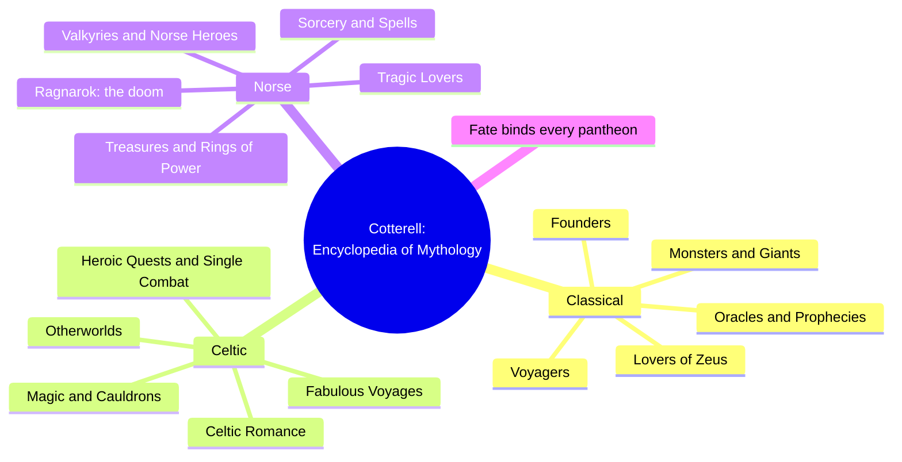
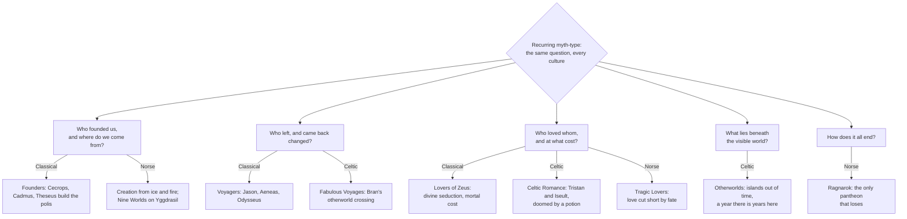
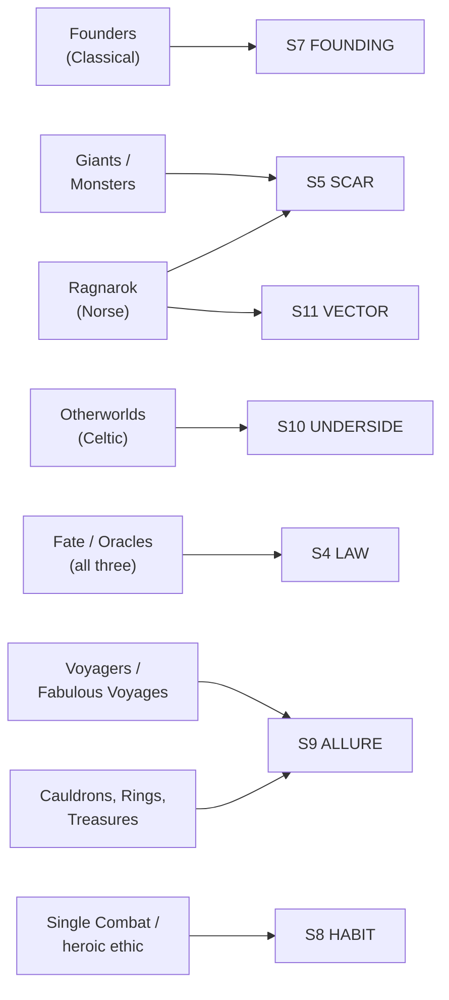

# BVX.1189 — The Encyclopedia of Mythology: Classical, Celtic, Norse — Arthur Cotterell (1996)
### Knowledge Entry — Distill

A single-volume reference encyclopedia (Hermes House / Anness, 1996, reprinted 2006) covering three European mythological traditions side by side; read here as an organizing scheme: three pantheons, each broken into the same handful of recurring myth types, that a setting designer can pull a culture's myth layer from.

**Provenance flag up front:** the library's file label read "The Ultimate Encyclopedia of Mythology," but the text's own title page, copyright page, and Contents confirm this is Cotterell's narrower *Encyclopedia of Mythology: Classical, Celtic, Norse* (three regions only, no Egyptian/Near Eastern/Asian/African/American sections). Same author and publisher family as the broader "Ultimate" volume, different book. The library holds only this copy; distilled as the book actually present, filed under the assigned id. See §10.

## TABLE OF CONTENTS
- [Core Thesis](#1-core-thesis)
- [Mind Models](#2-mind-models)
- [Framework](#3-framework--structure)
- [Key Concepts](#4-key-concepts)
- [Heuristics](#5-heuristics--decision-rules)
- [Invariants](#6-invariants)
- [Pitfalls](#7-pitfalls--myths)
- [Application](#8-application)
- [Cross-References](#9-cross-references)
- [Provenance](#10-provenance--confidence)

---

## 1 · CORE THESIS

An encyclopedia has no single argument; this one has an organizing grid instead. Three regional pantheons (Classical, Celtic, Norse) each resolve into the same ~8 recurring myth types (founders, voyagers, lovers, oracles, monsters, otherworlds, doom), differently flavored per culture but answering the same handful of human questions.

---

## 2 · MIND MODELS

*Required. Minimum two diagrams, maximum five.*

**Diagram 1 — the whole argument.**
Caption: *three pantheons, each organized by the same set of thematic "feature spreads" cross-referenced from hundreds of A–Z named entries: the book is a grid, not a narrative.*

**Diagram 2 — the central mechanism (a taxonomy of myth-type questions, answered differently per culture).**
Caption: *read this as the reference grid itself: pick a row (the question), then read across for how each culture staged its answer.*

**Diagram 3 — mapped onto the Command's SETTING SLICE (S1–S12).**
Caption: *seven feature-spread clusters land on six SETTING layers, cleanly; this source is thin on S1–S3 geography/sensorium and silent on S12 FUNCTION, since it never treats myth as game mechanics.*

---

## 3 · FRAMEWORK / STRUCTURE

The book runs two organizing layers at once, and that doubling is itself the reusable design move:

1. **The alphabetical layer.** Every named figure, place, or object gets one entry, filed under "the name used in the original country of origin" (Author's Note). Italic capitals mark any name with its own entry; a "(See also X)" line closes an entry out to the thematic layer below.
2. **The thematic layer.** Within each of the three regional parts, ~8 "special feature spreads" (two-to-four page essays, e.g. Founders, Voyagers, Ragnarok) group scattered A–Z entries into one myth-type and state what that type is *for*: Founders explains why cities need a founder-hero; Ragnarok explains why the Norse afterlife is structurally different from the other two.

Each regional part is bookended the same way: an Introduction (cosmology, pantheon's own character, a couple of pages) followed by the alternating rhythm of A–Z entries and feature spreads. Classical runs Introduction → Lovers of Zeus → Heroes → Oracles and Prophecies → Voyagers → Monsters and Fabulous Beasts → Forces of Nature → Giants → Founders. Celtic runs Introduction → Celtic Otherworlds → Sages and Seers → Magic and Enchantment → Wondrous Cauldrons → Celtic Romance → Single Combat → Heroic Quests → Fabulous Voyages. Norse runs Introduction → Nature Spirits → Treasures and Talismans → Norse Heroes → The Valkyries → Sorcery and Spells → Tragic Lovers → Rings of Power → Ragnarok.

The three sequences are not identical (Norse alone ends on an eschaton; Celtic alone foregrounds Otherworld geography as its own category), but each is a complete pass across the same underlying question set the Preface names directly (§4).

---

## 4 · KEY CONCEPTS

| Concept | What it is | Why it matters |
|---|---|---|
| **The universal question list** | The Preface's own inventory of what myth is "about," stated once for all three traditions: love and jealousy, generational conflict, violence and single combat, trickster mischief, illness, death and rebirth, enchantment, the unknown (voyage or quest), monster-contest, betrayal, fertility, madness, fate and misfortune, the human/divine relation, creation, and the nature of the universe | This is the book's real organizing scheme underneath the regional split: a checklist of the themes any culture's myths will eventually visit, useful independent of which pantheon you're building |
| **Fate as the law above the gods** | Even a pantheon's chief god cannot escape or fully control fate: Zeus "has a duty to see that fate takes its proper course," Odin "can do nothing about his future death at Ragnarok," Lugh "cannot save his son Cuchulainn" | Names the one invariant that survives across all three systems (§6.1); a candidate top rule for any invented pantheon's own S4 LAW |
| **Founder myth as a package deal** | A city's legendary founder (Cecrops, Cadmus, Theseus, Dido) delivers institutions and identity at once: laws, an alphabet, a religious cult, a name, not just an origin date | A founding myth should do civic work (what the city now believes about itself), not just explain who arrived first |
| **The Otherworld as displaced geography** | Reached by sea, populated by gods and the recently dead, running on non-linear time (Bran's crew feel a year pass while decades pass at home); leaving carries a one-way cost: set foot on native soil again and every unlived year catches up at once | A concrete mechanism for a setting's hidden layer: not secrecy but a genuinely different place with its own physics, reachable and re-enterable only on hard terms |
| **Ragnarok's structural uniqueness** | Apocalypse is "a common mythical theme, but the Norse vision is starker than most and unique in the loss of its gods"; doom is foreknown, collectively suffered, and (in one version) survived only by a purged, renewed world | The book's own comparative judgment: not every pantheon needs a doom-myth, but if one has it, it should cost the gods something the others don't lose |
| **The lure of the unknown** | The Classical Voyagers (Jason, Aeneas, Odysseus) are driven by "the lure of the unknown," which "prompts all restless heroes to strike out on a new path in search of a fabulous treasure or shining dream" | A one-line design brief for any culture's own explorer-myths: name the treasure or dream before naming the itinerary |
| **Special feature spread** | A short thematic essay layered over the alphabetical entries, naming a myth-type and cross-referencing every A–Z entry that instantiates it | The structural trick worth stealing directly: tag your setting's individual myths/figures by type, then write one short essay per type that says what the type is *for* |

---

## 5 · HEURISTICS & DECISION RULES

| Situation | Do this | Not this |
|---|---|---|
| Inventing a city or nation's origin myth | Bundle the founder with an institution (a law, a craft, a cult) the culture still credits them for | Give a founder a name and a date with no lasting civic fingerprint |
| Building a "hidden world" or afterlife | Give it its own time rule and a real cost to leave and re-enter | Make it a secret room with the same physics as the front stage |
| Deciding whether a pantheon needs a doom-myth | Only write one if the ending costs the gods something specific and irreversible | Bolt on an apocalypse because "epic settings have one" |
| Writing a culture's explorer or quest myths | State the treasure or dream the journey chases before plotting the route | Write an itinerary first and backfill a reason to travel |
| Auditing a setting's myth layer for gaps | Run it against the Preface's ~15-item question list (love, death, fate, the unknown, betrayal, creation, etc.) and flag which questions have no myth yet | Assume the myth layer is complete because a pantheon and a creation story exist |
| Deciding how "real" fate should feel | Make it bind the setting's own gods, not just its mortals | Let divine characters override consequence whenever convenient |
| Organizing a bestiary of setting myths | Tag each myth by type (founder, voyage, doom, otherworld…) and write one short essay per type | Leave every myth as an isolated named entry with no cross-reference layer |

---

## 6 · INVARIANTS

1. **Fate outranks every god.** In all three systems the chief deity or greatest hero can slow fate's operation but never overturn it, stated three separate times, once per pantheon, in the book's own Preface.
2. **Ruins and dooms need a mechanism, not just a mood.** Ragnarok is inevitable because the universe was "flawed from the outset," not because the narrative needed an ending.
3. **A founder myth is inseparable from what the city becomes.** The founding act and the resulting institution are told as one unit, never as separate facts.
4. **An otherworld runs on its own time, not the traveler's.** Every Otherworld-type myth in the book marks the time distortion explicitly; it is never incidental detail.
5. **A myth-type recurs across cultures because it answers a fixed human question**, not because cultures copied each other; the same ~15 questions (§4) surface independently in Greek, Celtic, and Norse material.

---

## 7 · PITFALLS / MYTHS

- Treating an encyclopedia's alphabetical order as its actual structure: the real organizing scheme is the thematic feature-spread layer underneath, and that layer is what a setting designer should copy.
- Writing a doom-myth or apocalypse as scenery: the book is explicit that Ragnarok's power comes from the gods losing something real, not from the imagery of fire and flood alone.
- Inventing a founder without an institutional consequence: a name-only founder does none of the civic identity work the Classical Founders spread describes.
- Building a hidden/otherworld layer that behaves like ordinary geography with a curtain over it: the source's Otherworld myths all carry a time-cost or entry-cost that ordinary places don't.
- Assuming "myth" means "pantheon and creation story" and stopping there — the Preface's ~15-item question list shows how much more ground a culture's myths are expected to cover (love, betrayal, madness, fertility, the unknown, and so on).

---

## 8 · APPLICATION

- **Spine level:** SETTING (non-story-spine source; keys beside the L0–L7 spine, per the template's binding rule that setting is a Domain embodied, never a story-spine level)
- **12-layer character stack:** none directly — this is a myth/setting-side source, not a character-layer source
- **plot_systems:** contextual candidate — the Preface's ~15-item universal-question list (§4) is a ready-made myth-gap checklist: run any drafted culture's myth set against it and flag unanswered questions before calling the myth layer done
- **Setting:** primary — feeds six SETTING SLICE layers (S4, S5, S7, S9, S10, S11; see frontmatter `feeds:`) directly off the three feature-spread clusters (Founders, Ragnarok/Giants, Otherworlds, Voyagers/Cauldrons/Rings, and the fate thesis)

Use this source as a grid, not a narrative: pick a culture being built for the setting, then walk it down the same ~8 myth-type rows this book uses per pantheon (founders, voyagers, lovers, oracles/fate, monsters, magic/objects, an otherworld or hidden layer, and — optionally — a doom). Not every culture needs every row filled the same way a real pantheon doesn't (the book itself shows Norse alone carrying an explicit eschaton), but an empty row is a visible gap, not a neutral omission. The Otherworld mechanism (own time rule, hard entry/exit cost) is the single most portable piece of craft here for a hidden-layer setting element; the founder-as-package-deal concept is the most portable piece for any culture's origin story.

---

## 9 · CROSS-REFERENCES

| Related entry | Relation |
|---|---|
| [[BVX.0458]] | Kobold Guide to Worldbuilding — TTRPG-craft counterpart; that entry supplies the *method* for building a setting layer by layer, this entry supplies raw cross-cultural myth *material* to feed into that method |
| [[BVX.1122]] | GURPS Hot Spots: Renaissance Venice — a worked concrete-setting instance; this entry stays at the level of myth-type pattern rather than one instantiated culture |

---

## 10 · PROVENANCE & CONFIDENCE

**File-label mismatch, resolved by coordinator ruling.** The scratchpad text file assigned to id BVX.1189 was library-labeled "The Ultimate Encyclopedia of Mythology (Arthur Cotterell)." On inspection, the title page reads "THE ENCYCLOPEDIA OF MYTHOLOGY — Classical, Celtic, Norse — ARTHUR COTTERELL" (Hermes House, an imprint of Anness Publishing, © 1996, 2006), and the Contents page lists only three regional sections (Classical p8, Celtic p90, Norse p172) — no Egyptian, Near Eastern, Indian, Chinese, Japanese, African, or Native American material, which a genuinely "Ultimate"/world-mythology Cotterell volume would carry. This is confirmed as the narrower, differently titled book; the library holds only this copy. Per the coordinator's explicit instruction, distilled under the title the file actually contains, filed at the originally assigned id BVX.1189, with this note standing as the permanent record of the mismatch.

Full text, OCR/pdftotext extraction (~256pp, noisy OCR with frequent character-run-together and line-wrap artifacts, legible throughout). Read directly: front matter and Author's Note (naming and cross-reference conventions); the Preface (the cross-cultural fate/destiny thesis and the ~15-item universal-question list, quoted in §4 and §6); the Classical Mythology introduction; the Founders and Voyagers feature spreads (full); the Celtic Otherworlds material via the Bran, son of Febal entry (the otherworld-voyage mechanism, quoted in §4); the Norse Ragnarok feature spread (full); scattered confirmation of Norse cosmology (Nine Worlds, Yggdrasil) via alphabetical entries. Not separately read in full: the Celtic and Norse regional introductions, the remaining ~21 feature spreads, and the bulk of the several hundred A–Z entries — the thematic layer's shape was established from the Contents page plus the spreads actually read, and the pattern held consistently across the three regions (introduction → alternating A–Z entries and feature spreads → cross-references) wherever sampled.

The SETTING-layer keying in frontmatter `feeds:` and Diagram 3 is this distill's synthesis, built by direct analogy to BVX.0458's SETTING SLICE mapping method, not asserted by the source itself (the book never uses SETTING SLICE vocabulary).

## META
- Template: BVX-LEARN-v4.0
- Source classification: full-text OCR extraction, deep read on Preface/Founders/Voyagers/Ragnarok/Otherworld material, sampled elsewhere; title/scope mismatch against original library label resolved and logged above
- Created / Updated: 2026-09-29
