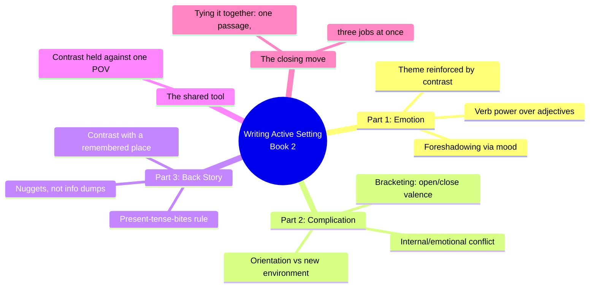
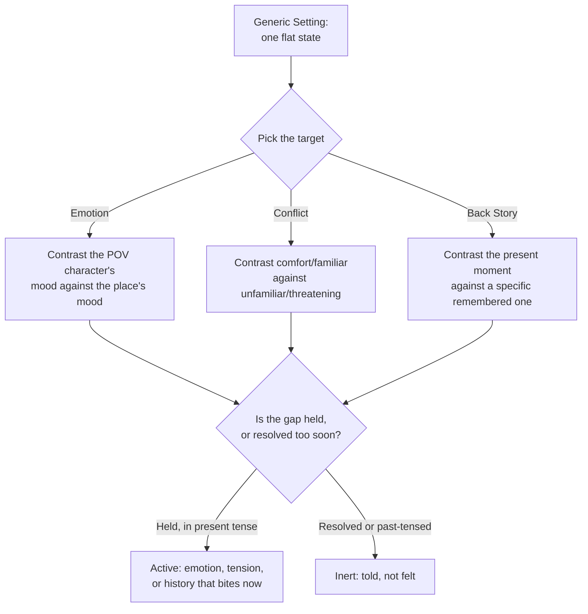
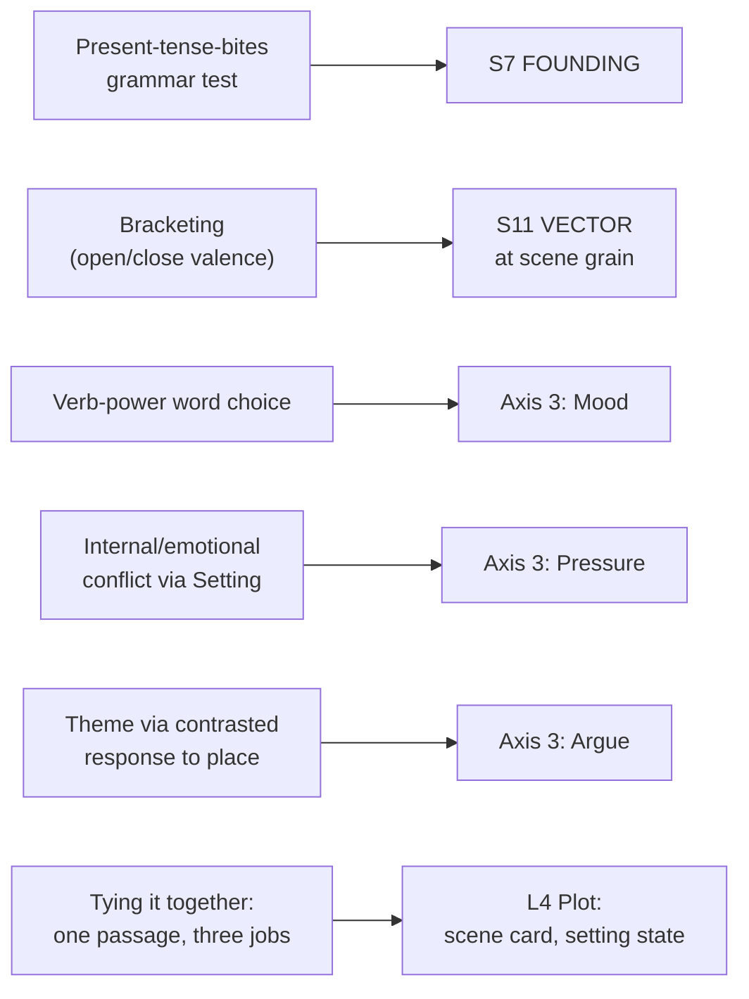

# BVX.1190 — Writing Active Setting, Book 2: Emotion, Conflict and Back Story — Mary Buckham (2013)
### Knowledge Entry — Distill

The original solo edition of the middle third of Buckham's workshop trilogy: contrast, not description, is the single mechanism that makes setting carry emotion, manufacture conflict, and deliver back story without stalling the scene.

## TABLE OF CONTENTS
- [Core Thesis](#1-core-thesis)
- [Mind Models](#2-mind-models)
- [Framework](#3-framework--structure)
- [Key Concepts](#4-key-concepts)
- [Heuristics](#5-heuristics--decision-rules)
- [Invariants](#6-invariants)
- [Pitfalls](#7-pitfalls--myths)
- [Application](#8-application)
- [Cross-References](#9-cross-references)
- [Provenance](#10-provenance--confidence)

---

## 1 · CORE THESIS

Setting delivers emotion, conflict, and back story through the same single move: contrast, held against a specific POV character's attention. A beautiful place turning ugly, a present car racing versus a past car that already crashed, a childhood room versus the man standing in it now. No contrast, no charge.

---

## 2 · MIND MODELS

*Required. Minimum two diagrams, maximum five.*

**Diagram 1 — the whole argument.**
Caption: *three jobs, one shared tool — every part of this book is contrast applied to a different target.*

**Diagram 2 — the central mechanism (contrast run against three different targets).**
Caption: *the same swap, applied three times: whatever the target, the craft move is hold two states against each other and let the gap do the work.*

**Diagram 3 — mapped onto the Command's SETTING SLICE and L4 plot.**
Caption: *this book's contribution lands as a grammar-level test for S7 and a scene-grain trajectory dial for S11, not a new S-layer of its own.*

---

## 3 · FRAMEWORK / STRUCTURE

Three parts, each ending in Assignment and Recap, exactly as the omnibus's middle third — this is the standalone 2013 first edition, published before Books 1 and 3 were compiled with it into the 2015 Writer's Digest omnibus (BVX.0056).

| Part | Content | Governing move |
|---|---|---|
| **1 — Using Setting to Show Emotion** | Concrete description, foreshadowing, reinforcing story themes | Word choice and mood-contrast ratchet the reader's emotional read of a scene |
| **2 — Using Setting to Create Complication** | Internal/emotional conflict, orientation and conflict, conflict via contrast | A character's response to a place, and the bracketing of positive/negative word choices, manufacture tension |
| **3 — Using Setting to Show Back Story** | Defining back story, using contrast, tying it all together | Back story earns its space only in present-tense contrast with a specific remembered place; the closing chapter shows one passage doing all three jobs at once |

Every chapter runs the same teardown: hypothetical flat first draft, then a published passage (Deaver, Harris, Beaton, Mosley, Tropper, Zusak, Briggs, Gerritsen, Kingsolver, Richards, Ford, Leonard, Gardiner, Marsh, Collins, Steinbeck, Strout, Crutcher, Pickard), annotated clause by clause.

---

## 4 · KEY CONCEPTS

| Concept | What it is | Why it matters |
|---|---|---|
| **Contrast as the shared mechanism** | Every technique in this book (mood-shift, foreshadowing, conflict, back story) reduces to holding two states against each other rather than describing one state well | The book's real unity; not stated as a rule by Buckham but demonstrable across all three parts and every worked example |
| **Verb power over adjectives** | "Clouds hunkering over the horizon" beats "big clouds" or "fluffy clouds"; a strong verb carries emotional charge an adjective string cannot | The book's most repeated craft note in Part 1; a mechanical substitution test for a flat passage |
| **Foreshadowing via mood contrast** | A setting's emotional coloring, seeded early, prevents an abrupt swing from one story emotion to its opposite later | Foreshadowing here is not plot mechanics, it is emotional pacing done through the reader's read of place |
| **Internal/emotional conflict through Setting** | A character's specific, detailed read of a space (an office, a basement, an overgrown yard) reveals conflict they have not voiced | Setting becomes a proxy for interiority the POV character would not narrate directly |
| **Orientation and conflict** | Contrasting a character's comfort-zone setting against an unfamiliar or threatening one foreshadows story trouble before it happens | Works even with vague, non-specific setting nouns; the contrast itself, not the detail level, carries the foreshadowing |
| **The bracketing technique** | Open and close a passage on the same emotional valence to resolve tension (Steinbeck's Cannery Row: poem...dream); reverse the order to transition the reader from one feeling to the opposite instead | A controllable dial: the book demonstrates the identical word list reordered to prove the effect is structural, not accidental |
| **The present-tense-bites rule, formalized** | "A car raced toward her" (live story question) versus "A car had raced toward her when she was seven" (outcome already known, tension drained) | Turns Buckham's own back-story principle (echoed independently in BVX.0458's Baur rule) into a mechanical tense test any writer can run on a paragraph |
| **Back story via contrast with a specific remembered place** | Back story lands hardest as one paragraph contrasting a present setting against a named, sensory-specific past one, not as a summary of events | Strout's Tucson desert vs. the ragged coastline; Kingsolver's squeaking porch swing now silenced |
| **Tying it together: triple-duty passages** | The book's closing demonstration: one setting passage (Tropper's "crappy house," Pickard's classroom memory) doing emotion, conflict, and back story simultaneously | The most advanced move in the book: not "use one technique," but layer two or three in the same lines without expanding the word count |
| **Telling-then-showing, or showing-then-telling** | Explicit permission to open a passage with a telling line ("The day suited his mood") before showing it, or the reverse | Corrects an oversimplified "always show, never tell" rule; sequencing, not elimination, is the actual craft choice |

---

## 5 · HEURISTICS & DECISION RULES

| Situation | Do this | Not this |
|---|---|---|
| A setting passage reads flat | Swap adjective strings for one strong, specific verb | Pile on more adjectives to compensate |
| Signaling a scene's emotional tone early | Seed the mood through setting word choice before the emotional beat arrives | Let the reader be blindsided by an unforeshadowed emotional swing |
| Revealing a character's unspoken conflict | Show their specific, detailed read of a space they are in | Have them state the conflict directly in dialogue or interior monologue |
| Foreshadowing trouble via a new environment | Contrast it against the character's established comfort zone | Describe the new place neutrally with no comparison point |
| Wanting a passage to resolve its tension | Bracket the description with matching valence at open and close | Bracket with mismatched valence and expect resolution instead of transition |
| Wanting a passage to transition the reader's feeling | Open on one emotional valence, close on the opposite | Open and close on the same valence and expect a shift |
| Deciding whether back story earns its place | Run the tense test: does it read as a live present-tense question, or an already-resolved past-tense fact | Include it because it is true and interesting to the writer |
| Delivering back story | Contrast the present setting against one specific, sensory-named past place, in a short nugget | Summarize a character's history in a paragraph of exposition |
| Revising a scene for economy | Look for one setting passage that can carry emotion, conflict, and back story together | Write three separate passages, one per job, and accept the word-count cost |

---

## 6 · INVARIANTS

1. **Contrast, not description, produces charge.** A setting held in isolation, however well-observed, does not by itself generate emotion, conflict, or the weight of back story.
2. **Verb choice outperforms adjective choice for emotional charge.** This holds across every worked example in Part 1 without exception.
3. **Back story only earns space if it reads as present tense to the story question, regardless of when the events actually occurred.** Grammatical tense is a legitimate diagnostic, not just a style note.
4. **Bracketing valence controls whether a passage resolves or transitions.** Same-valence brackets resolve tension; opposite-valence brackets transition the reader's feeling without resolving anything.
5. **A single setting passage can carry more than one job at once without growing longer.** The book's own most advanced chapters exist to prove this, not merely assert it.
6. **Telling and showing are sequencing choices, not a strict hierarchy.** A short telling line followed by showing (or the reverse) is a legitimate, repeatedly demonstrated structure.
7. **The technique scales down to vague nouns.** Several of the strongest conflict examples (Marsh's dockside, the "new school" assignment) use generic setting nouns and still land, because the contrast, not the noun's specificity, is doing the work.

---

## 7 · PITFALLS / MYTHS

- Assuming "show, don't tell" means telling is never allowed; the book repeatedly opens a passage with a telling line as the setup for the show.
- Writing back story that is factually true about the character but generates no present story question, then including it anyway because it is interesting to the writer.
- Confusing detail volume with effect: several of the book's most powerful conflict passages use almost no specific nouns, only a well-placed contrast.
- Bracketing a passage with mismatched valence while intending resolution, which produces an unintended transition instead.
- Treating internal conflict as something that must be stated in dialogue or narration rather than shown through a character's read of a space.
- Padding a scene with three separate passages (one for emotion, one for conflict, one for back story) instead of layering jobs into one.
- Reaching for adjective strings under deadline pressure instead of the harder, better craft move of finding one exact verb.

---

## 8 · APPLICATION

- **Spine level:** SETTING (primary) and L4 (plot, secondary) — every worked example in this book operates at scene grain: one passage, timed to one moment in the story, doing one or more of emotion, conflict, or back-story work for that specific scene, the same grain as a scene card's setting state.
- **12-layer character stack:** none directly. Internal/emotional conflict shown through a character's read of a place is structurally adjacent to WILL (boundary and resistance) and WOUND (what a space triggers), but this book stays a setting-side source; it does not itself assign character-layer values.
- **plot_systems:** contextual candidate once `04_PLOT_SYSTEMS/` opens. The bracketing technique (open/close valence) is a ready-made scene-level tension dial: decide before drafting whether a setting passage should resolve (matched brackets) or transition (mismatched brackets) the reader's emotional state, then write to that choice.
- **Setting:** supporting. This book deepens three of BVX.0056's six jobs (Mood, Pressure, Argue) with mechanism BVX.0056 only sampled, and independently confirms S7 FOUNDING's present-tense-bites rule as a mechanical grammar test rather than a content rule.

**Where this is a TTRPG tool a writer can steal:** boxed text and location write-ups usually fail at exactly what this book drills. A GM or sourcebook writer building the DCUS setting can run any location description through three questions before publishing it: does the word choice (verbs, not adjectives) set the emotional register the encounter needs; does the description bracket its valence deliberately, matched to resolve the scene's tension or mismatched to transition into the next beat; and if any world history is mentioned, does it pass the present-tense test (does it change what a character does right now, or is it dead trivia). The "tying it together" move, one passage doing double or triple duty, is the direct fix for the classic sourcebook failure of a paragraph of lore followed by a separate paragraph of atmosphere followed by a separate paragraph of the actual threat: Buckham's worked examples show all three can be the same four sentences.

---

## 9 · CROSS-REFERENCES

| Related entry | Relation |
|---|---|
| [[BVX.0056]] | A Writer's Guide to Active Setting — the 2015 omnibus that reprints this book as Part Two (Ch.4-6, sampled there); this entry deep-extracts what 0056 only sampled and owns the six-job filter and subjective-filter framework that this book assumes |
| [[BVX.0269]] | Writing Active Setting, Book 2: Emotion, Conflict & Back Story — likely duplicate catalog entry for the same original edition; reconcile on next index pass |
| [[BVX.0458]] | Kobold Guide to Worldbuilding — Baur's present-tense-history rule, arrived at independently from the TTRPG design side; this book's tense-grammar test operationalizes the same law at the sentence level |
| [[BVX.1122]] | GURPS Hot Spots: Renaissance Venice — a worked SETTING-SLICE instance; this book's bracketing and triple-duty techniques are exactly the missing FUNCTION-layer craft a trade gazetteer like that one needs to turn its facts into scenes |
| [[BVX.0267]] | Writing Active Hooks, Book 2 — Buckham's sibling series applying the same contrast-and-specificity discipline to story openings |

---

## 10 · PROVENANCE & CONFIDENCE

Full text, pdftotext extraction, ~98,000 characters (~17,000 words), clean text layer, machine-readable table of contents. Read in full, cover to back matter: front matter (copyright, acknowledgements); the complete Overview; Part 1 (Introduction, Using Concrete Descriptions, Foreshadowing, Reinforcing Story Themes, Assignment, Recap) in full; Part 2 (Internal/Emotional Conflict, Orientation and Conflict, Conflict Via Contrast, Assignment, Recap) in full; Part 3 (Defining Back Story, Using Contrast, Tying It All Together, Assignment, Recap) in full; the Wrap Up and Bibliography. The 64-page PDF (Zotero storage key GLJJ2X4E, one of three loose-attachment duplicates for this title in the library) is a single-book first edition (Cantwell Publishing LLC, 2013, ISBN 978-1-939210-01-2), predating the 2015 Writer's Digest omnibus already held as BVX.0056.

The S7 FOUNDING and Axis 3 FUNCTION keying in frontmatter `feeds:` extends BVX.0056's existing attribution to the specific mechanism this standalone edition makes explicit (the tense-grammar test, the bracketing technique) that the omnibus distill only sampled from these same chapters. `spine: [SETTING, L4]` and the L4 secondary application line follow the given spine keys and the library's existing convention (BVX.1156, BVX.1124, BVX.1125) for setting-craft sources whose worked examples operate at scene grain.

## META
- Template: BVX-LEARN-v4.0
- Source classification: full-text single-source craft manual, deep extraction cover to back matter
- Created / Updated: 2026-09-29
