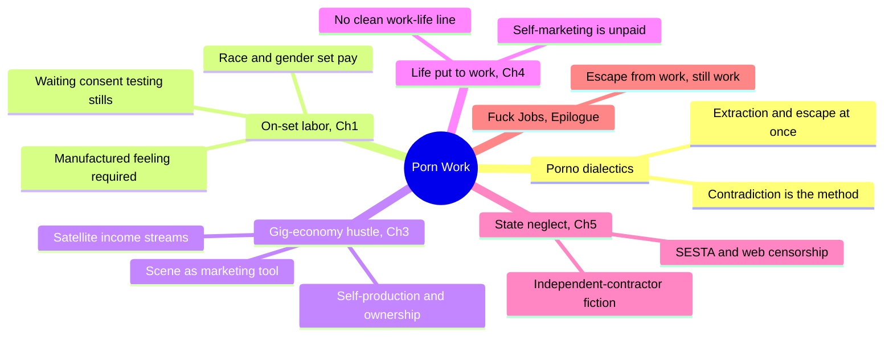
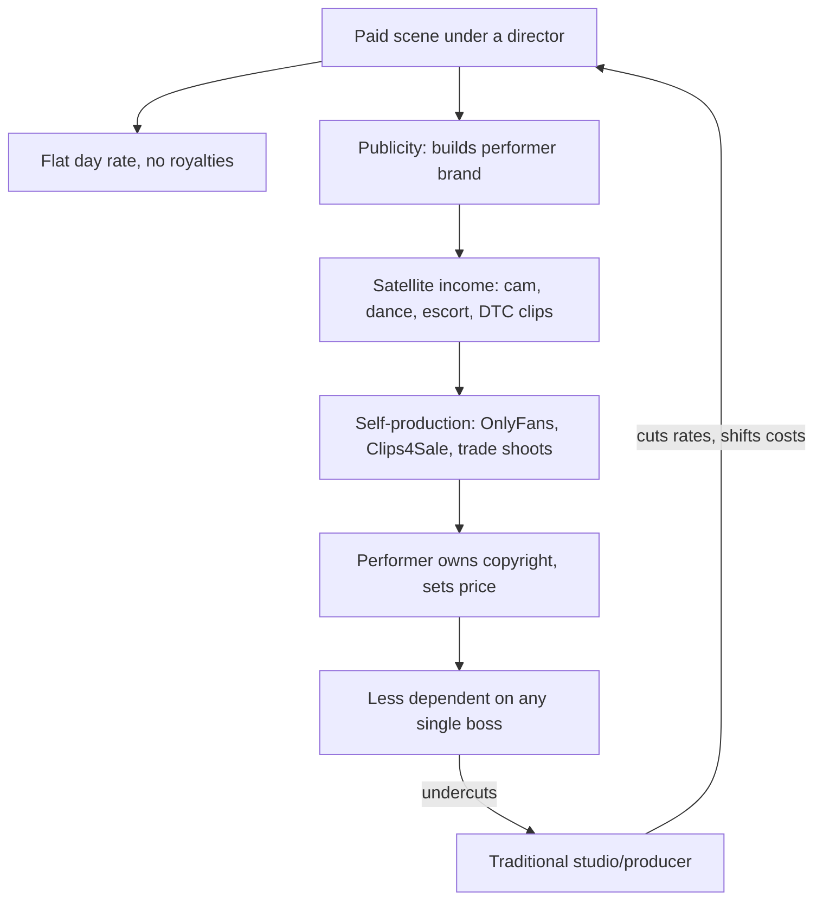
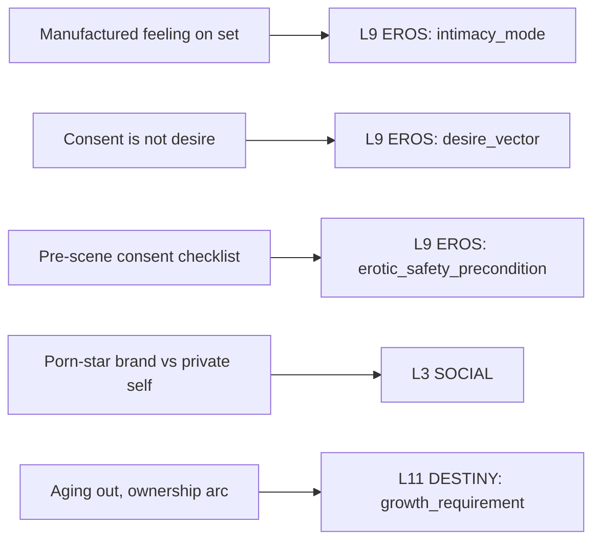

# 🧬 MSX.18 — Porn Work: Sex, Labor, and Late Capitalism — Berg (2021)
### Knowledge Entry — Distill

An ethnography of eighty-one porn performers, managers, and crew (1970s-2010s interviews), read here for one thing: what waged and self-produced sex work actually looks like as a job, and what that tells a writer about characters who sell intimacy for a living.

## TABLE OF CONTENTS
- [Core Thesis](#1-core-thesis)
- [Mind Models](#2-mind-models)
- [Framework](#3-framework--structure)
- [Key Concepts](#4-key-concepts)
- [Heuristics](#5-heuristics--decision-rules)
- [Invariants](#6-invariants)
- [Pitfalls](#7-pitfalls--myths)
- [Application](#8-application)
- [Cross-References](#9-cross-references)
- [Provenance](#10-provenance--confidence)

---

## 1 · CORE THESIS

Porn work is real work: performers manufacture feeling under a wage relation that pays no royalties, so they turn scenes into advertising, self-produce, and stack satellite income to take more from the industry than it takes from them. Class position (worker, manager, producer) shifts within a single career, sometimes a single day.

---

## 2 · MIND MODELS

*Required. Minimum two diagrams, maximum five.*

**Diagram 1 — the whole argument.**
Caption: *five chapters trace one arc, from the set floor to the state, and the book closes on the same both/and it opens with: porn work is an escape from work and also work.*

**Diagram 2 — the central mechanism (a paid scene as a marketing tool).**
Caption: *the wage buys a director's scene, but the performer's brand is what actually gets paid; that loop is why studios are losing ground to performers with a smartphone.*

**Diagram 3 — mapped onto the Command's character system (L9 EROS, L3 SOCIAL, L11 DESTINY).**
Caption: *the book's four load-bearing labor facts each land on a named EROS variable, not on a mood; this is a schema for how a sex-work character's desire and performance are structured, not just a vibe.*

---

## 3 · FRAMEWORK / STRUCTURE

Introduction plus five chapters plus an epilogue, each keyed to one site of struggle: the set (Ch1), authenticity (Ch2, sampled only), the gig economy (Ch3), the work/life boundary (Ch4), and the state (Ch5). Berg's method, "porno dialectics," runs the same move on every site: name the extraction, then show workers turning it into leverage, without resolving the contradiction.

The book also hands over a concrete production workflow, the part a writer needs to render a set truthfully:

| Stage | What happens | Who controls it |
|---|---|---|
| Negotiate | Genre, partners, acts, and rate are agreed in advance; anything outside that must be renegotiated on set | Performer, agent, director |
| Paperwork | Modeling release, independent-contractor tax forms, age verification ("2257") | Studio |
| STI protocol | Testing, PrEP, barrier methods, or none, varies by genre and company | Studio norm, not law |
| Prep | Hair, makeup, douching; increasingly self-supplied as budgets shrink | Performer (cost shifted down) |
| Wait | Unpaid-feeling but paid time; also where community, mutual aid, and organizing happen | Nobody; the schedule itself |
| Stills | Unpaid promotional photography, folded into the same release | Studio |
| The scene | Physically demanding positioning ("opening up" for camera), emotional labor of manufactured feeling | Director, camera |
| Pay | Flat day rate regardless of hours; no royalties; rate set by gender, race, and acts performed | Studio, contested by performer |

Self-production runs a different workflow entirely: finance the shoot ($0 to $20,000), own the copyright, set the price, distribute direct-to-consumer, and use free social media as the marketing layer a studio's publicity budget used to be. The two workflows compete for the same worker's time, which is the book's real argument: the waged workflow is losing to the owned one.

---

## 4 · KEY CONCEPTS

| Concept | What it is | Why it matters |
|---|---|---|
| **Porno dialectics** | Reading porn work as both extraction and struggle at once, without ranking or resolving the contradiction | The book's method: "porn work can be better than straight work and also just as extractive. Both things are true" |
| **A scene is just a marketing tool** | Waged scenes function less as the payday and more as free advertising for a performer's owned income streams | Reverses the naive reading of piracy and low wages as pure loss; a pirated studio scene still sells the performer's brand |
| **Whorearchy** | Workers' own ranking of sex-industry income streams, porn star at the top, informal or criminalized work lower | Explains why performers keep "porn star" as primary identity even when it pays less than escorting or camming |
| **Underwear dialectics** | Studios push wardrobe costs onto performers, who then resell worn items to fans at a markup | A worked example of a cost-shift becoming a profit center; the pattern repeats across the whole book |
| **Satellite industries** | Dancing, camming, escorting, and direct-to-consumer sales that most performers depend on more than scene fees | Paid scene work alone cannot sustain almost any performer; this is the norm, not a sign of failure |
| **Class as an adjective, not a noun** | Resnick and Wolff's line, used to describe workers who are performer, manager, and producer within one career or one day | Orthodox "worker vs. boss" language cannot describe porn's labor market; Berg needs new vocabulary and builds one |
| **Enthusiastic-consent critique** | The idea that only "hotly desired, for its own sake" sex is legitimate erases most paid, and much unpaid, sex | Lets a writer separate "did they consent" from "did they want it" without treating either question as settled by the other |
| **Racialized, gendered rate structure** | Pay is set by gender, race (an "interracial" premium extracted from non-Black performers' preferences), and penetration type, by convention, not skill | Table 1 in the source gives real numbers: Black women's rates run $200-$400 below white counterparts for identical acts |
| **SESTA/FOSTA and platform enclosure** | 2018 US legislation and platform terms-of-service sweeps that closed sites sex workers used to advertise, screen, and get paid | Framed as anti-trafficking, it mainly removed the tools independent workers used to avoid managers and pimps |
| **Life put to work** | Morini and Fumagalli's term for the unpaid self-marketing, self-making labor (social media, brand maintenance, "always on" exposure) that surrounds any paid scene | The workday has no clean end; a character's "time off" is still brand-tending time |

---

## 5 · HEURISTICS & DECISION RULES

| Situation | Do this | Not this |
|---|---|---|
| Writing why a sex-worker character takes a scene | Give layered reasons: money, professionalism, escaping worse work, sometimes desire, often several at once | Collapse the motive into "victim" or "turned-on exhibitionist" |
| Writing consent on a paid-sex set | Show negotiated, itemized, revisable terms: a checklist, a "no list," a pre-scene talk about dos and don'ts | Write consent as one blanket yes, or as simply absent |
| Showing rough or intense sex on screen | Distinguish choreographed rough (negotiated, controlled) from real violence dressed up as rough | Read visual intensity itself as evidence of harm |
| A character monetizing intimacy directly (an OnlyFans-style setup) | Show them owning the copyright, setting the price, using a paid gig as an ad for the owned channel | Assume self-production is automatically more exploited, or automatically more free, than studio work |
| A performer character who also directs or produces | Let them act like a boss when wearing that hat, calculating costs in dollars per minute, even while sympathetic | Flatten worker-managers into pure villain or pure ally |
| Depicting pay differences across race and gender in a sex-industry setting | Base the gap on hiring discrimination and a negotiated "preference" premium, not on a skill difference | Write pay as a neutral, meritocratic default |
| A platform crackdown or "protective" policy hits a sex-worker character | Show it cutting off independent income and pushing them back toward a manager | Write the policy as a clean, costless win for safety |
| A character's public brand versus private self | Give them a maintained on-camera persona distinct from an off-camera "just me" register, and let the character move between the two on purpose | Assume the brand is either wholly fake or wholly authentic |
| Writing burnout in erotic or creative-sector work | Show it arriving through unpaid self-marketing and constant availability, not just the paid hours on screen | Limit the character's workday to the scenes the reader actually sees |

---

## 6 · INVARIANTS

1. **Scene fees alone do not support a career.** Almost every performer, star or not, depends on satellite income; this is structural, not a personal failure to "make it."
2. **Consent and desire are different variables.** A "yes" motivated by money, fatigue, or professionalism is still consent; treating "for its own sake" as the only legitimate motive erases most paid, and much unpaid, sex.
3. **Class position is fluid within a single career, sometimes a single day.** The same person can be worker, manager, and producer in the same week, and orthodox worker-versus-boss language does not describe this.
4. **Pay hierarchies track race, gender, and act type by industry convention, not by a hidden meritocracy.** Rates are set at "the lowest amount that will still get someone to shoot."
5. **A waged scene and a self-produced scene run on different economics.** The first is labor with no royalties; the second is ownership with retained, if smaller, profit.
6. **Democratized production cuts both ways at once.** Cheap cameras and direct-to-consumer platforms raise competition and lower average rates while simultaneously raising the ceiling on worker autonomy and ownership; the two effects are not separable.
7. **State and platform "protections" aimed at sex work routinely reduce independent options.** Regardless of stated intent, they tend to push workers back toward managed or criminalized arrangements.
8. **Emotional labor is inseparable from physical labor on set.** Manufacturing believable desire while managing fatigue, safety, and a scene partner's needs is one skill, not two.

---

## 7 · PITFALLS / MYTHS

- Treating "enthusiastic consent" as the only legitimate standard, which makes instrumental, tired, or businesslike consensual sex look suspect or fake.
- Reading rough or degrading-looking scenes as evidence of real harm; choreography and negotiation shape most of what looks rough on camera.
- Assuming self-production and direct-to-fan platforms are automatically more liberating, or automatically more exploitative, than studio work; both run the same wage-versus-ownership dynamic, just distributed differently.
- Treating "porn star" earnings as representative; even in-demand performers describe swings from $20,000 a month to $3,500 the next, and cannot live on paid scenes alone.
- Assuming a director or producer stands outside the worker experience; most porn managers were, are, or will again be performers, and vice versa.
- Reading anti-trafficking internet legislation as a clean protective measure; SESTA/FOSTA mainly removed the tools independent workers used to screen clients and avoid managers.
- Assuming higher "interracial" or novelty-tagged rates reflect generosity toward marginalized performers; the premium is extracted from non-Black performers' stated preferences, while Black performers are paid less for the identical act.

---

## 8 · APPLICATION

- **Spine level:** [L5] WOUND, per this batch's assigned keying (non-story-spine labor source; the wound frame is the accumulated damage of a precarious, undercompensated career, not a single injury)
- **12-layer character stack:** L9 EROS, primary (`intimacy_mode`, `desire_vector`, `erotic_safety_precondition`); L3 SOCIAL, supporting (a maintained public brand distinct from the private self); L11 DESTINY, contextual (`growth_requirement`, the aging-out and ownership arc)
- **plot_systems:** contextual candidate once `04_PLOT_SYSTEMS/` opens; the hustle (scene-as-marketing-tool, satellite income under precarity) is a ready-made engine for financial-pressure scene conflict
- **Setting:** none directly; this is a labor-and-character source, not a SETTING-shelf one, though its whorearchy and satellite-industry structure could seed an S6 ECONOMY or S8 HABIT instance for any setting that includes a sex-industry economy

Berg's real contribution to the intimacy layer is refusing the choice between "sex worker as victim" and "sex worker as empowered hustler." A character selling sex or intimacy should be written with a stacked, sometimes contradictory `desire_vector`: money and fatigue and professionalism and, sometimes, real want, held together rather than resolved. The `intimacy_mode` variable should be able to hold "performed for pay, genuinely felt in part" without that being a contradiction the character needs to fix. The public/private split (L3 SOCIAL against the private self) is equally portable to any character whose living depends on a maintained, watched persona, adult performer or not.

---

## 9 · CROSS-REFERENCES

| Related entry | Relation |
|---|---|
| [[🧬 MSX.17 — Mating in Captivity — Perel (2006)]] | Contrast: Perel locates desire inside the couple's psychic space (distance, mystery, the anchor and the wave); Berg relocates it inside the wage relation. Read together for a fuller `desire_vector`: desire structured by intimacy-distance *and* by who is paying whom. |

---

## 10 · PROVENANCE & CONFIDENCE

Full text, pdftotext extraction (~196pp main text before notes/index), clean text layer with a machine-readable table of contents. Read in full: the Introduction (the porno-dialectics argument, the short history of porn work from loops through the digital and OnlyFans era, and the chapter-by-chapter synopsis); Chapter 1, "Porn Feels Different Than It Looks: Porn Work on Set" (full, including the pay-rate table); Chapter 3, "A Scene Is Just a Marketing Tool: Hustling in Porn's Gig Economy" (full); the Epilogue, "Fuck Jobs" (full). Substantially sampled: Chapter 4, "Porn and the Boundaries between Life and Work" (opening section, "Fuck Overtime!" and "Wages for Porn Work," read in full; "Exposure" section read in full; remainder not extracted) and Chapter 5, "Maybe the State Should Pay: Sex, Work, and the State" (opening section on independent-contractor misclassification read in full; remainder not extracted). Not read: Chapter 2, "I Was in Love! And Then It Was Over: Authenticity Work," and the Appendix on research methods; both are represented only by the Introduction's own synopsis of them.

This is a PDF-drop item, not a Zotero-library record: no `zotero_key` exists, and the library's own inventory carries it under a pending id (`BVX.0761`) alongside the `MSX.18` legacy subject code assigned for this task per `_meta/DECISIONS.md` (D1/D4, the legacy MSX/PSY codes surviving under the flat-serial-ID scheme). The `feeds:` variable names (`intimacy_mode`, `desire_vector`, `erotic_safety_precondition`, `SOCIAL`, `growth_requirement`) are taken directly from the L9 EROS and adjacent layer definitions in `ssot_02_character_systems_vertical_slice.md` PART A, not inferred loosely.

## META
- Template: BVX-LEARN-v4.0, sexuality variant (BOLO 87/88, `brief.DISTILL.md` as changed by `brief.DISTILL.sex.md`)
- Source classification: full-text book, deep extraction on 3 of 5 chapters plus introduction and epilogue, partial extraction on 2 chapters
- Created / Updated: 2026-09-29
