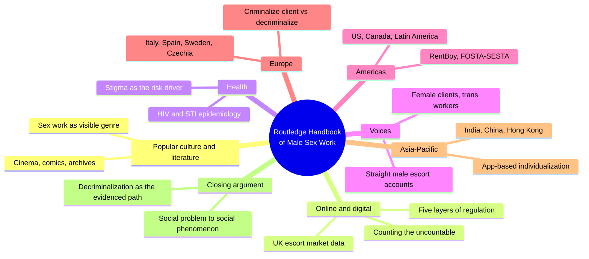
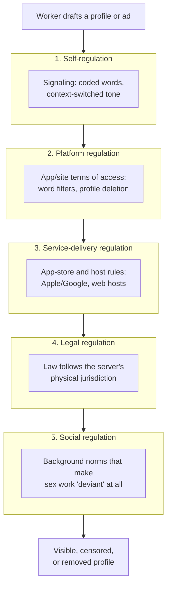
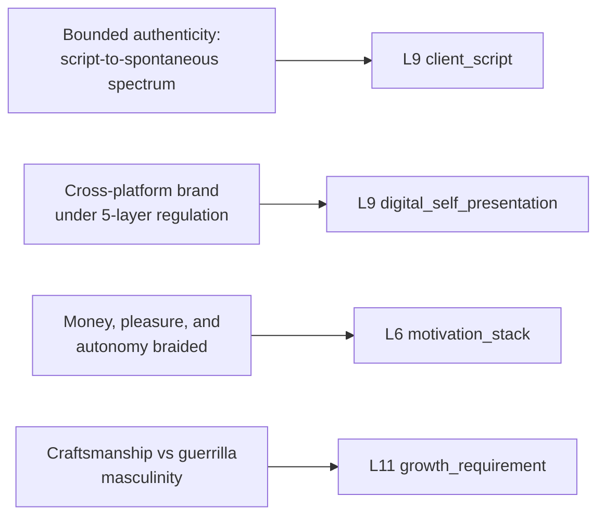

# 🧬 MSX.19 — The Routledge Handbook of Male Sex Work, Culture, and Society — Scott, Grov & Minichiello (2021)
### Knowledge Entry — Distill

A 37-chapter academic handbook (Routledge, 2021) that reframes male sex work from a hidden "social problem" into a documented "social phenomenon," surveying its history, digital infrastructure, client relations, and regulation across North America, Europe, and Asia-Pacific.

## TABLE OF CONTENTS
- [Core Thesis](#1-core-thesis)
- [Mind Models](#2-mind-models)
- [Framework](#3-framework--structure)
- [Key Concepts](#4-key-concepts)
- [Heuristics](#5-heuristics--decision-rules)
- [Invariants](#6-invariants)
- [Pitfalls](#7-pitfalls--myths)
- [Application](#8-application)
- [Cross-References](#9-cross-references)
- [Provenance](#10-provenance--confidence)

---

## 1 · CORE THESIS

Male sex work is not a pathology to be explained but an occupation to be described: workers manage a paid sexual encounter along a scripted-to-spontaneous spectrum, build a digital identity under five stacked layers of regulation, and reclaim masculinity through whatever script their legal and economic context allows. Stigma, not the exchange itself, generates the harm.

---

## 2 · MIND MODELS

*Required. Minimum two diagrams, maximum five.*

**Diagram 1 — the whole argument.**
Caption: *eight regional and topical parts converge on one editorial move: stop asking whether male sex work is pathological, start documenting how it actually works.*

**Diagram 2 — the central mechanism (five layers of digital regulation).**
Caption: *no online sex-work space is a lawless commons; every post is filtered through five stacked layers before a client ever sees it, and a change at any layer bleeds through to the rest.*

**Diagram 3 — mapped onto the Command's character stack.**
Caption: *the handbook's four load-bearing findings each answer a different question a writer asks about a sex-work character; none of them substitute for the others.*

---

## 3 · FRAMEWORK / STRUCTURE

Eight parts, not a linear argument but a survey built to force the same reframe from every angle: popular culture and literature (Parts I-II) establish that male sex work has always been publicly visible in fiction and film even while criminalized in fact; the online part (Part III) documents the infrastructure that now carries most of the trade; public-health (Part IV) reframes risk as stigma-driven rather than identity-driven; a voices part (Part V) hands the page directly to escorts, female clients, and trans workers; three regional parts (Americas, Europe, Asia-Pacific, Parts VI-VIII) show the same occupation taking different shape under different law; a closing chapter argues decriminalization is the only regime with evidence behind it. The editors' framing move, stated on the cover and enacted chapter by chapter, is retrieving the subject "from silence and invisibility on the one hand and its association with scandal and stigma on the other."

---

## 4 · KEY CONCEPTS

| Concept | What it is | Why it matters |
|---|---|---|
| **Social problem to social phenomenon** | The book's editorial reframe: stop researching male sex work as pathology, start documenting it as an occupation with markets, venues, and career paths | Sets the register for every chapter; a character in this world is a worker with a business model, not a case study |
| **The counting problem** | Nobody agrees who counts as a "sex worker" (casual, incidental, full-time, aspiring); global estimates range from 8 to 42 million sex workers with no reliable male-female split | Undercuts any confident population-level claim a writer might be tempted to state as settled fact |
| **Five layers of digital regulation** | Self, platform, service-delivery, legal, and social regulation stack on every online sex-work post; each layer can override or bleed into the others (Callander & DeVeau) | The mechanism behind every scene where a character's ad gets pulled, his account gets banned, or a law abroad kills his market overnight |
| **Bounded authenticity** | Bernstein's term, used by Walby: paid encounters range from distant/scripted to intimate/spontaneous, and workers narrate this range rather than picking one lane | Kills the binary of "real feelings" versus "just a transaction" as the only two settings for a sex-work scene |
| **Sexual scripts vs. sexual stories** | Gagnon and Simon's scripting theory (cultural, interpersonal, intrapsychic scripts) versus Plummer's narrative-construction-of-self theory; Walby argues touch itself breaks the script | A vocabulary for why an encounter can start scripted and then go off-book mid-scene, which is dramatically the more interesting moment |
| **Brand-building across platforms** | Workers run a website, one or more escort directories, and social media simultaneously, each tuned to a different clientele register (UK data: one escort built his site for "chief executives," his directory listing for "Mr. White Van Man") | A sex-work character's online presence is deliberate market segmentation, not a single leaked self |
| **Gendered client stigma** | Male buyers are coded as predators; female buyers are coded as either victims or "sluts," never as ordinary consumers (Caldwell & de Wit) | A female client character carries a different, harsher, and more contradictory stigma script than a male one; they are not interchangeable |
| **Craftsmanship masculinity vs. guerrilla masculinity** | Hong Kong go-go-zai reclaim status through skill and professional pride (work is legal, stable); mainland Chinese Money Boys reclaim status through future-oriented entrepreneurial ambition (work is criminalized, migrant, precarious) (Yau & Kong) | Two distinct, locally coherent ways the same stigmatized occupation gets turned back into a masculine identity |
| **App-based individualization** | In urban China, WeChat payment plus geosocial dating apps let a man become a sex worker by messaging alone, no venue or employer required, blurring "hooking up" and "selling sex" into the same act (Cai) | Digital infrastructure does not just advertise existing sex work, it can manufacture the category itself out of ordinary hookup behavior |
| **Decriminalization vs. legalization vs. prohibition** | Decriminalization removes sex-work-specific law and treats it as an ordinary business; legalization means state licensing, which can add surveillance and forced testing; prohibition/abolition criminalizes some or all parties | The book's evidenced conclusion: only decriminalized jurisdictions (New South Wales, New Zealand) show measurable harm reduction |

---

## 5 · HEURISTICS & DECISION RULES

| Situation | Do this | Not this |
|---|---|---|
| Writing a male escort's client-facing self | Place each encounter somewhere on the scripted-to-spontaneous spectrum and let it move mid-scene | Write him as either coldly transactional or secretly in love, with no middle setting |
| Writing his online presence | Show him tuning tone and content per platform, and give the platform's rules teeth (word filters, deletions) | Write the internet as a space where he can post anything he wants |
| Writing why he does the work | Braid money, pleasure, and autonomy-seeking together in the same breath | Pick one motive as the "real" one and treat the others as cover story |
| Writing his sense of masculinity | Tie his reclaiming strategy to his actual legal and economic footing: pride in skill where the work is stable and legal, future-oriented ambition where it is precarious and criminalized | Write generic shame, or a single universal "sex workers feel X about themselves" |
| Writing a client, especially a woman | Give her a distinct stigma script (victim or deviant, rarely just "customer") separate from the male client's script (predator) | Reuse the male client's shame beat for a female client |
| Writing a legal or regulatory threat to the business | Let one country's law (where the server sits) end the market globally overnight, then let a mirror site reopen somewhere friendlier within days | Treat digital sex-work markets as either permanently safe or permanently destroyed by a single law |
| Writing across a country setting | Let local law and economic precarity produce a different occupational identity, not just a different risk number | Import a Western, global-north stigma script wholesale into another setting |

---

## 6 · INVARIANTS

1. **Stigma generates the harm, not the exchange.** Distress correlates with social stigma far more reliably than with the act of selling sex itself.
2. **The count is always contested.** Definitional boundaries (casual, incidental, full-time, aspiring) mean every population estimate is a methodological argument, not a fact.
3. **No online space is unregulated.** Self, platform, service-delivery, legal, and social regulation act simultaneously on every post; removing one does not remove the others.
4. **Law follows the server, not the user.** A worker anywhere can be shut down by a law passed where his platform happens to be hosted.
5. **A paid encounter is scriptable and breakable in the same session.** Scripting does not preclude spontaneity; spontaneity does not erase the script.
6. **Client stigma is gendered, not symmetric.** Society narrates male buyers and female buyers through entirely different, non-interchangeable moral scripts.
7. **Masculinity is reclaimed locally, not universally.** The specific strategy (craft pride, entrepreneurial hope, danger-tolerance) tracks the specific legal and economic conditions of the place, not a generic occupational psychology.
8. **Decriminalization is the one regime with evidence behind it.** Every other model (legalization, prohibition, abolition targeting clients) carries documented costs decriminalized jurisdictions do not show.

---

## 7 · PITFALLS / MYTHS

- Treating "sex worker" as a fixed, self-evident identity rather than a spectrum that includes casual, incidental, and aspiring participants who may never adopt the label.
- Assuming digital platforms are a lawless free space; every post sits under five active layers of regulation whether the worker notices them or not.
- Assuming male sex work is a gender-flipped copy of female sex work; clientele, stigma shape, and venue mix all differ.
- Conflating trafficking with sex work broadly, or generalizing from the worst documented cases to the whole occupation.
- Assuming hookup apps (Grindr and peers) are simply replacing paid sex work; the evidence shows growth and individualization, not straightforward substitution.
- Importing global-north research categories and stigma scripts onto other regions without adjusting for local law, migration, and economy (the book's own closing "southern theory" critique of its field).

---

## 8 · APPLICATION

- **Spine level:** L5
- **12-layer character stack:** L9 primary (`client_script`, `digital_self_presentation`); L6 supporting (`motivation_stack`); L11 primary (`growth_requirement`)
- **plot_systems:** contextual candidate once plot systems open: the five-layer regulation stack (Diagram 2) is a ready-made external-pressure generator, a single law change or platform ban can force a character to relocate his entire business overnight, exactly as RentBoy's operators and the German site that replaced them did
- **Setting:** contextual only, not primary; a setting with an analogous stigmatized-labor economy could borrow the decriminalization/legalization/prohibition typology (§4) as a ready-made policy axis for how that labor is governed

This is a sociology and policy handbook, not a craft book, so its use for character work is indirect but precise: it supplies the actual mechanics (scripting, platform regulation, gendered client stigma, locally-coded masculinity) that a writer needs to render a sex-work character or storyline as observed rather than imagined. The strongest single transferable move is the bounded-authenticity spectrum (§4): it replaces the lazy binary of "he's faking it" or "he's fallen for a client" with a continuum a character can slide along within one scene, which is both more accurate to the source research and more dramatically useful. The five-layer regulation model (Diagram 2) is the second most transferable piece, since it converts "the internet" from an undifferentiated backdrop into a stack of concrete, breakable constraints a plot can push against. The Hong Kong/mainland China chapter is the clearest worked example in the book of how legal and economic context, not personality, determines which masculine script a stigmatized worker reaches for.

---

## 9 · CROSS-REFERENCES

| Related entry | Relation |
|---|---|
| [[🧬 MSX.17 — Mating in Captivity — Perel (2006)]] | Perel's desire-versus-security tension in private relationships is the domestic mirror of this book's client-script spectrum in paid ones; both argue against reading intimacy as a fixed, singular setting |
| [[🧬 MSX.21 — Do Me! — Müller (2014)]] | Müller's practitioner guide supplies the explicit practice vocabulary; this handbook supplies the academic and occupational frame those practices sit inside |

---

## 10 · PROVENANCE & CONFIDENCE

Full text, pdftotext extraction of a 37-chapter, ~600-page academic handbook (Routledge, 2021), read against the TOC and the editors' opening framing rather than end to end, per the size ceiling for this distill. Read in full or near-full: Chapter 13 (Minichiello, Scott, Harrington, Callander & Grov, "Quantifying global male sex worker communities in the technology era," including the Male Escort Global Survey 2018 data); Chapter 14 (Callander & DeVeau, "Male sex work and digital regulation," the five-layer regulation model in full); Chapter 16 (Walby, "Internet-based male sex work," opening theoretical framing); Chapter 17 (Sanders, Pitcher, Scoular, Campbell & Cunningham, "Male independent sex workers in the digital age," the Beyond the Gaze UK survey data); Chapter 20 (Durocher, first-person straight-male-escort account, in full); Chapter 21 (Caldwell & de Wit, "Female clients of male sex workers," through the activity-based stigma findings); Chapter 23 (Grov & Westmoreland, "Male sex work in North America," the Classified Project, Sex and Love Study, and RentBoy study sections); Chapter 34 (Cai, "Male sex work in China," in full, including the Zhang and Feng ethnographic vignettes); Chapter 36 (Yau & Kong, "Male sex work and masculinities in Hong Kong and Mainland China," in full, including the discussion and conclusion); and the closing chapter (Scott, Grov & Minichiello, "Decriminalization as a goal"). Sampled only: contents, figures/tables lists, and contributor biographies. Not read: the majority of Parts I, II, IV, VI, VII, and the India chapter (Ch. 33), which the brief's chapter list did not prioritize.

The feeds mapping is this distill's synthesis: the handbook is sociology and policy, not a character-craft source, so the L9/L6/L11 keying identifies the mechanics (scripting, platform regulation, motivation-braiding, locally-coded masculine reclamation) rather than quoting any explicit character-system vocabulary from the source.

## META
- Template: BVX-LEARN-v4.0
- Source classification: full-text academic handbook, deep extraction on 10 of 37 chapters plus editorial framing and closing chapter
- Created / Updated: 2026-09-29
