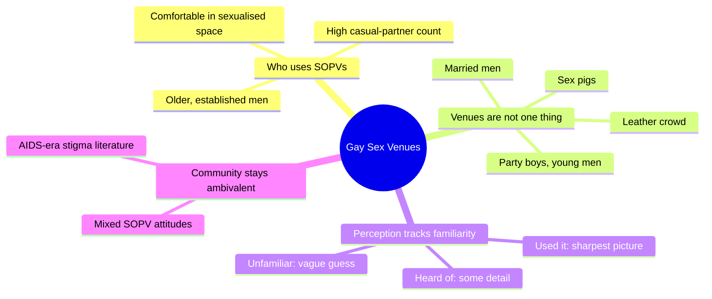
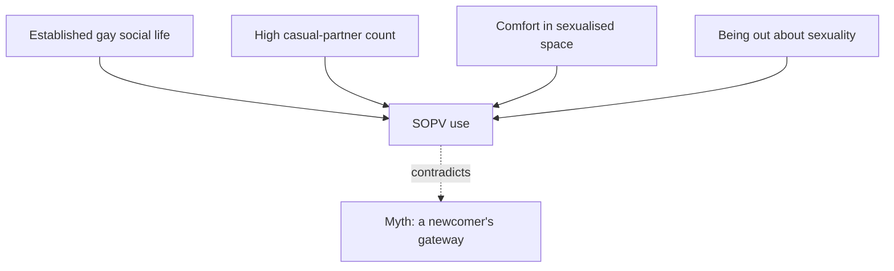
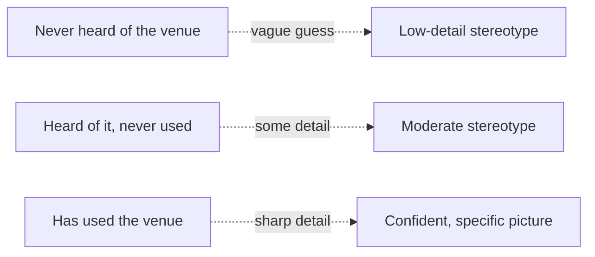
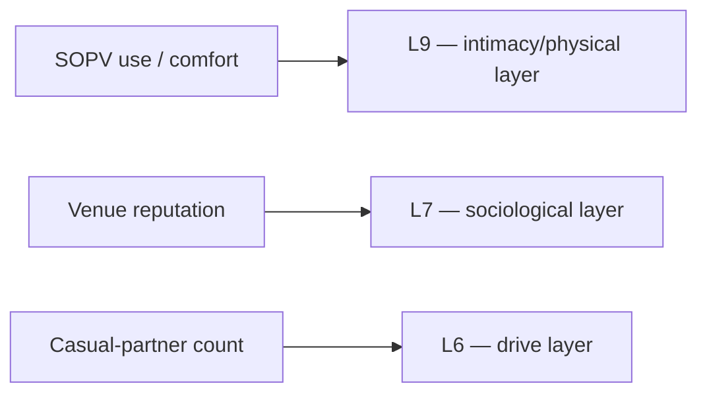

# 🧬 MSX.20 — Sex on Premises Venues — Smith, Grierson & von Doussa (2010)
### Knowledge Entry — Distill

A short Australian sexual-health survey paper on who uses gay sex-on-premises venues (saunas, bathhouses, sex clubs), how those venues differ from one another, and how the wider gay community perceives both the venues and their patrons — read whole (five journal pages).

## TABLE OF CONTENTS
- [Core Thesis](#1-core-thesis)
- [Mind Models](#2-mind-models)
- [Framework](#3-framework--structure)
- [Key Concepts](#4-key-concepts)
- [Heuristics](#5-heuristics--decision-rules)
- [Invariants](#6-invariants)
- [Pitfalls](#7-pitfalls--myths)
- [Application](#8-application)
- [Cross-References](#9-cross-references)
- [Provenance](#10-provenance--confidence)

---

## 1 · CORE THESIS

Gay men's sex-on-premises venues (SOPVs) are not one undifferentiated vice district but a stratified social geography: each venue carries its own known clientele, use is concentrated among older, socially established men with unusually high partner counts rather than newcomers, and community perception of any given venue sharpens only with a rater's own familiarity or use.

---

## 2 · MIND MODELS

*Required. Minimum two diagrams, maximum five.*

**Diagram 1 — the whole argument.**
*The paper on one screen: who goes, what venues actually are, and how the community reads them.*

**Diagram 2 — the central mechanism.**
*Venue use is an extension of an already-established gay social and sexual life, not an on-ramp into one.*

**Diagram 3 — the familiarity-attribution gradient.**
*The less a person actually knows a venue, the vaguer and more generic their claim about its crowd — treat outsider gossip about a venue as unreliable by design.*

**Diagram 4 — mapped onto the Command's systems.**
*Three concrete, measured variables a writer can hang directly on the 12-layer stack.*

---

## 3 · FRAMEWORK / STRUCTURE

A self-administered questionnaire handed out at a large gay and lesbian community festival in Melbourne (2007), not recruited from inside venues — so the sample is community-wide, not venue-biased. It gathered: basic demographics; sexual identity and HIV status; relationship status and length; number of casual partners in the past year; an "outness" scale (four items: out with friends, family, workmates, neighbours); a "comfort with sexualised spaces" scale (comfort introducing a new boyfriend met in each of eight settings, from a community meeting to a sauna); an alcohol-and-other-drugs (AOD) breadth scale; and an 11-item scale of general attitude toward SOPVs. Separately, for each of 11 named, real local venues, respondents were asked which characteristics they'd ascribe to that venue's patrons, from a fixed list of ten (leather men, married men, HIV-positive men, HIV-negative men, party boys, young men, Asian men, sex pigs, "very much part of the gay community," "not much part of the gay community"). Analysis ran in three layers: bivariate comparison of users versus non-users; a multivariate logistic regression to find independent predictors of use; and a binomial-test comparison of patron-attribution rates across three familiarity tiers per venue (never heard of it / heard of it but not used / used it).

---

## 4 · KEY CONCEPTS

| Concept | What it is | Why it matters |
|---|---|---|
| SOPV (sex-on-premises venue) | The paper's umbrella term for saunas, bathhouses, sex clubs — any venue built for gay men to have sex with each other on site | Gives a writer a neutral, in-field vocabulary term instead of only "bathhouse" or slang |
| Outness scale | Four-item measure of how out a man is with friends, family, workmates, neighbours | A quantifiable, gradient trait, not a binary closeted/out flag |
| Comfort-with-sexualised-spaces scale | Measures ease introducing a partner met in progressively more sexualised settings, sauna at the extreme | The independent variable that most cleanly separates users from non-users |
| SOPV attitude scale | 11-item measure of general approval/disapproval of sex venues (lower = more approving) | Shows attitude and behaviour are separable — a man can use venues without approving of them, or vice versa |
| Patron attribution | Respondents assigning stereotyped traits (leather, married, young, sex pig, etc.) to a *named* venue's users | The mechanism that turns "a sex club" into a specific, reputationally distinct place |
| Familiarity tiers | Never heard of / heard of but unused / used — the three levels the paper compares attribution rates across | The gradient that drives how confidently any given character could describe a venue |
| "Married men" | The single most commonly ascribed patron trait across all 11 venues (25.0% overall) | Names a population using SOPVs while structurally outside the "out gay community" story |
| Benign-differentiation logic | The paper's core policy point: because venues attract different clienteles, health messaging (and by extension characterisation) should be venue-specific, not one blanket "sex venue" story | Directly transferable to worldbuilding: a setting's sex venues should differ from each other on purpose |

---

## 5 · HEURISTICS & DECISION RULES

| Situation | Do this | Not this |
|---|---|---|
| Writing a character's first bathhouse visit | Write it as one more step in an already-active gay social and sexual life | Write it as a naive newcomer's induction into gay identity |
| Populating a city's sex venues in a setting | Give each venue its own specific, named reputation (older/married crowd, leather crowd, younger/party crowd) | Treat every "sex club" in the setting as an interchangeable generic location |
| A character describing a venue they've never set foot in | Have them speak in vague, secondhand, generic stereotype | Give an outsider precise, confident insider knowledge of who actually goes there |
| A regular describing the same venue | Let them cite specific, confident, granular detail about the crowd | Flatten insider and outsider knowledge to the same level of certainty |
| Writing a partnered or married man at a venue | Treat it as ordinary — about half of surveyed users are in a regular relationship with a man | Assume venue attendance signals singleness or a hidden double life by default |
| Establishing why a character seeks out casual sex venues | Anchor it in an already-high volume of casual partners, the strongest predictor found | Anchor it in vague "sexual confidence" or "openness" alone |
| Setting the wider community's opinion of a venue | Write it as genuinely mixed and unresolved, even among out, socially embedded gay men | Write a single monolithic "the gay community thinks X" verdict |
| A young or newly out character wanting to visit a venue | Play it as socially less typical — younger men are the least likely age group to be users | Default to "every gay man tries this young" |

---

## 6 · INVARIANTS

1. **SOPV users skew older and more socially established**, not younger or newly out; venues are not, in this data, an entry point into gay life.
2. **Casual-partner count is the dominant predictor of venue use**, outweighing outness, comfort, and attitude scores by a wide margin.
3. **Venues are not interchangeable.** Distinct venues in the same city carry distinct, widely recognised clientele reputations (leather, married, young, sex pig, and so on).
4. **Perception sharpens with familiarity.** The less a person knows a venue, the vaguer their claim about its patrons; users hold the most specific, most confident picture — and are the ones a writer should trust for accurate in-world detail.
5. **Being partnered is not a barrier to use.** About half of surveyed users are in a regular relationship with a man, and non-monogamous arrangements are common among them.
6. **"Married men" is the single most commonly ascribed clientele label overall**, ahead of every other category — SOPVs sit at a social seam the "out and proud" community story doesn't fully cover.
7. **Community attitudes toward SOPVs stay ambivalent**, not simply accepting or simply condemning, even among people embedded in gay social life.
8. **HIV status is a weak, non-independent predictor of use** once other factors are controlled — venue attendance is not primarily an HIV-risk-group marker.

---

## 7 · PITFALLS / MYTHS

- **The gateway myth.** SOPVs are popularly framed (the paper cites *Faggots*, *Sexual Ecology*, *And the Band Played On*) as where naive young gay men get pulled into "the worst excesses of gay life." The data says the opposite: users are older and already socially established.
- **The monolith myth.** Treating "the bathhouse" or "the sex club" as one generic setting erases the sharp, real differentiation this paper documents between named venues.
- **The single-man myth.** Assuming venue-goers are unpartnered or secretly cheating; roughly half are in a regular relationship, openly.
- **The reliable-outsider myth.** Any character's claim about who goes to a venue is only as good as their familiarity with it — secondhand reputation is gossip-grade, not fact, until earned by use.
- **The HIV-marker myth.** Equating sex-venue use with a distinct, high-risk HIV population overstates a relationship that mostly disappears once other variables are controlled for.
- **The single-city, single-year ceiling.** This is one convenience sample from one 2007 Melbourne festival; the authors flag self-report bias and non-participation bias. Treat the findings as a strong pattern to borrow from, not a universal law to transplant unmodified onto another city, era, or culture.

---

## 8 · APPLICATION

*Prose carries the why; `feeds:` carries the wiring (D3). Both required, neither redundant.*

- **Spine level:** [L5] — non-story-structural source; kept for batch consistency, not because the paper argues a plot-structure claim.
- **12-layer character stack:** L9 (intimacy/physical — venue comfort and practice), L7 (sociological — venue-based community stratification), L6 (drive — casual-partner volume) supporting.
- **plot_systems:** Not applicable; this is demographic and perceptual data, not a plot mechanism.
- **Setting:** Directly a setting-shelf source. Use it to build a city's gay sex-venue geography as a differentiated social map rather than a single backdrop: an older/married-leaning sauna, a leather-coded club, a younger/party-boy venue, each with its own known reputation that in-world characters would already carry as background knowledge, graded by how well they actually know the place.

A writer building a science-fiction setting on TTRPG craft can lift this paper's method directly: instead of one "the sex venue" location, stat out two or three named venues, assign each a distinct, community-recognised clientele profile, and let characters' confidence describing any of them scale with their own familiarity tier — never heard of it, heard of it, or been there. That familiarity gradient is a portable worldbuilding tool for any stratified social space (a bar, a black-market den, a temple), not only a sex venue: it gives a GM or writer a built-in rule for how reliable a piece of in-world gossip should read.

---

## 9 · CROSS-REFERENCES

| Related entry | Relation |
|---|---|
| [[🧬 PSY.03 — Unlimited Intimacy — Dean (2009)]] | Same social world (cruising, SOPVs, gay male subculture); Dean's ethnographic and theoretical account of cruising and kinship pairs with this paper's demographic and perceptual survey data |
| [[🧬 MSX.12 — The Faggot Bible — FagMasterPDX (2018)]] | Practical vocabulary and scene-craft companion for the same venues and clientele categories this paper measures from the outside |

---

## 10 · PROVENANCE & CONFIDENCE

Read whole: a five-page peer-reviewed research paper (*Sexual Health*, 2010), sourced from a plain-text drop, not the Zotero library proper (no Zotero key on hand). All figures, table values, and quoted conclusions above are drawn directly from the paper's Results and Discussion sections; note that the OCR'd statistical table (adjusted odds ratios) is noisy in places, so this distill leans on the paper's own plain-language Results/Discussion sentences over the raw table numbers wherever the two seemed to diverge. Confidence is medium: the method is sound and the qualitative pattern is clearly stated by the authors, but the sample is a single convenience sample (one city, one 2007 festival, n = 287) that the authors themselves flag as limited, and the paper is now over fifteen years old.

## META
- Template: BVX-LEARN-v4.0
- Source classification: full text, read whole
- Created / Updated: 2026-09-29
