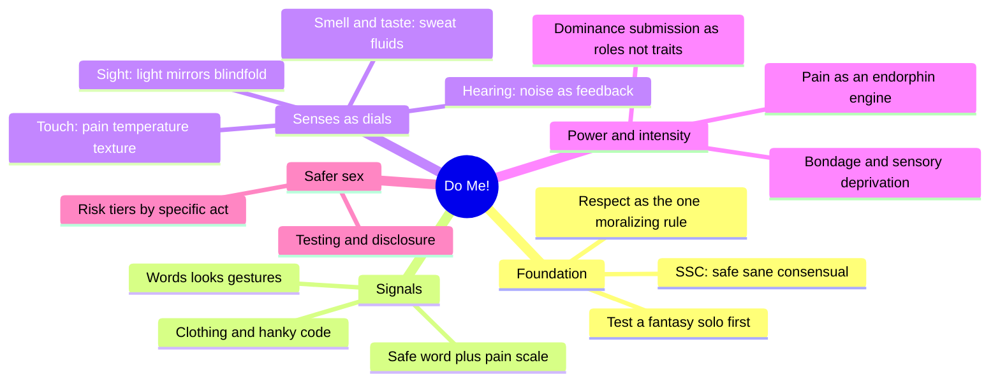
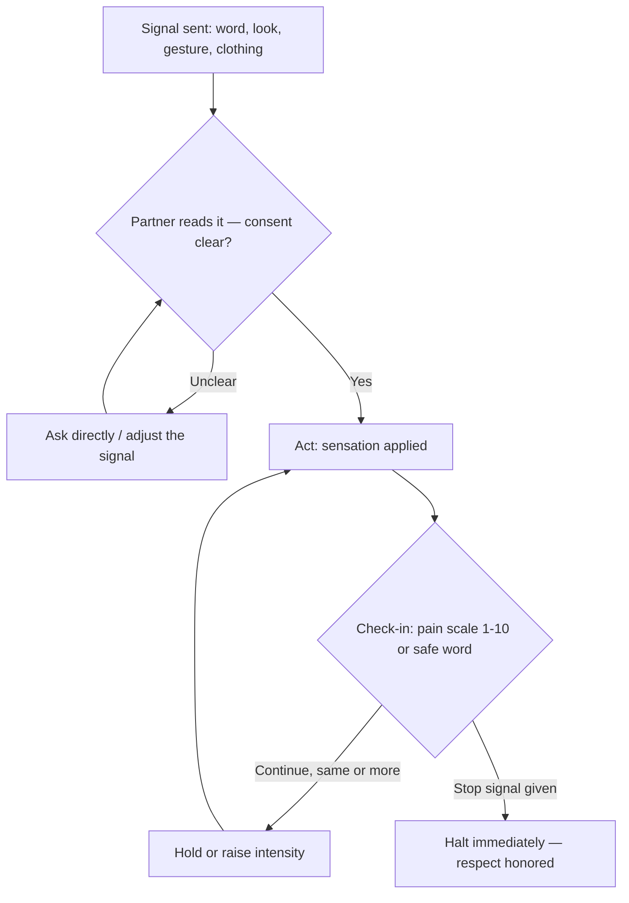
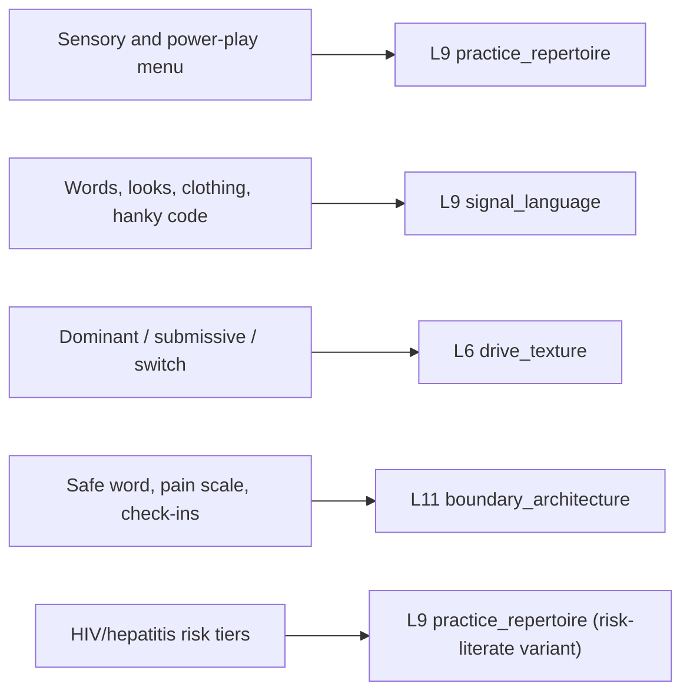

# 🧬 MSX.21 — Do Me! — Müller (2014)
### Knowledge Entry — Distill

A working practitioner's guide to gay men's sex from a Berlin fetish-scene writer, not a clinician; its value is the map of practices, the signal vocabulary, and the safer-sex risk tiers, stated frankly and without euphemism.

## TABLE OF CONTENTS
- [Core Thesis](#1-core-thesis)
- [Mind Models](#2-mind-models)
- [Framework](#3-framework--structure)
- [Key Concepts](#4-key-concepts)
- [Heuristics](#5-heuristics--decision-rules)
- [Invariants](#6-invariants)
- [Pitfalls](#7-pitfalls--myths)
- [Application](#8-application)
- [Cross-References](#9-cross-references)
- [Provenance](#10-provenance--confidence)

---

## 1 · CORE THESIS

Good gay sex runs on a communication system, not technique: partners set consent once (safe, sane, consensual), then use continuous signals — words, looks, clothing, a pain scale, a safe word — to escalate or halt any sense, role, or intensity. Nothing else in the book works once that channel closes.

---

## 2 · MIND MODELS

*Required. Minimum two diagrams, maximum five.*

**Diagram 1 — the whole argument.**
Caption: *five practice domains sit on top of one consent foundation and one signal channel — the book is a menu, but the menu only works if the foundation underneath it holds.*

**Diagram 2 — the central mechanism (a process, run identically for every practice in the book).**
Caption: *every act in the book, from a wink to full mummification, runs through the same signal-consent-calibrate loop — the loop is the actual subject, the acts are just where it gets applied.*

**Diagram 3 — mapped onto the Command's character stack.**
Caption: *the book's four working parts land on four different layers — this is why one source feeds practice vocabulary, communication style, role default, and safety architecture separately rather than as one blob called "kink."*

---

## 3 · FRAMEWORK / STRUCTURE

The book has no numbered system; it runs as a chapter sequence that widens outward, then narrows to a closing safety appendix:

| Section | Governing question |
|---|---|
| Really Good Sex | What conditions (SSC, respect, tested fantasy) make sex "really good" rather than just sex? |
| The Right Man | Does good sex require the right partner, or the right approach to whichever partner is present? |
| External Circumstances | How do setting, light, and furnishings become part of the scene's design? |
| Rituals and Signals | What nonverbal vocabulary lets two men negotiate an encounter without narration? |
| Master of the Senses | How is each of the five senses independently turned up, down, or off? |
| A Recipe for Good Sex | How do movement/stillness, empathy/selfishness, dominance/submission, role-play, and pain/pleasure combine into a scene? |
| Concluding Thoughts | What is this book actually claiming — universal truths or one man's working opinion? |
| Safer Sex | Which specific acts carry which specific HIV/hepatitis risk? |

Five short fictional interludes (two couples, Brad/Corey and Bruce/Joaquin) illustrate signal-use and power exchange in practice; three interviews (a mummification bottom, a BDSM dom, a theologian on the "body and soul" question) supply the book's only first-person testimony and its only explicit language for negotiated 24/7 dynamics, contracts, and the ethics of anonymous sex.

---

## 4 · KEY CONCEPTS

| Concept | What it is | Why it matters |
|---|---|---|
| **SSC (safe, sane, consensual)** | The book's one stated ethical floor, borrowed from S&M culture and applied to all sex, not just kink | Everything else in the book (role-play, pain, bondage, anonymous sex) is framed as permissible only inside this floor |
| **Ground Rule: Respect** | The single explicit "moralizing" passage: don't violate your own integrity or your partner's, whatever the act | Distinguishes eroticized degradation (chosen, bounded) from actual harm (unchosen, unbounded) |
| **Signal system** | A layered nonverbal vocabulary — words, looks, gestures, clothing, laughter — that carries consent and desire before or instead of speech | Lets strangers (bar, darkroom, sauna) negotiate a scene as reliably as established couples; failure to read it is the book's most-repeated failure mode |
| **Hanky/color code** | A now-largely-retired but still-cited color vocabulary (pink=dildo, dark blue=fucking, black=BDSM, red=fisting, yellow=piss, brown=scat, orange=anything) | A compressed public signal for a private preference; useful as period detail and as a model for any in-world signaling system |
| **Five-sense toolkit** | Sight, touch, smell, taste, hearing treated as separately adjustable dials (light, blindfold, mirrors, temperature, texture, scent, noise) | Reframes "variety" as sensory substitution rather than act substitution: the same act reads differently through a different sense channel |
| **Movement and standstill** | Alternating action and enforced immobility (pinning, bondage) as an arousal-curve technique, not just a kink aesthetic | Gives a mechanical account of why restraint feels erotic even absent pain: predictability removed, control transferred, tension built |
| **Dominant/submissive as role, not identity** | Active/passive, top/bottom, dom/sub are situational positions most men can occupy either side of, not fixed types | Undercuts a flattened "he's a top" character shorthand; the book insists competent dominance requires more empathy than passivity does |
| **Calibrated pain (the 1-10 scale)** | A running numeric check-in during pain play, used to titrate intensity in real time | The book's concrete safety mechanism for anything beyond a slap or a bite; makes "how much is too much" answerable mid-scene |
| **Negotiated 24/7 / contract** | A living, renegotiable agreement (from the Herrmeistersir interview) covering obedience, discipline, and scene safety, explicitly not a legal document | Models how a fictional power-exchange relationship can be structured without either romanticizing or flattening it into abuse |
| **Safer-sex risk tiers** | A three-tier list (low-risk, presumed-safe, high-risk) sorting specific acts, not "gay sex" as a category, by actual HIV/hepatitis transmission risk | The book's most clinically precise section; corrects the common error of treating all anal, oral, or fluid contact as equally risky |
| **Body and soul (the "knowing" frame)** | The closing interview's argument that anonymous sex can still be mutual "knowing," and that sex directed only at an object (leather, a role) rather than a person is where the union breaks down | Gives a vocabulary for distinguishing depersonalized-but-consensual play from actually depersonalizing a partner |

---

## 5 · HEURISTICS & DECISION RULES

| Situation | Do this | Not this |
|---|---|---|
| A fantasy hasn't been tried before | Test it solo (masturbate to it) to learn if it actually arouses you before asking a partner to perform it | Assume a fantasy that turns you on in the abstract will also turn you on enacted |
| A partner rejects a specific fantasy | Look for a nearby act that satisfies the same underlying want, and stay flexible | Abandon the partner over one refused act, or pressure him into it |
| Starting bondage, pain, or power-exchange play | Agree a safe word and a 1-10 pain scale before the scene starts, and test the safe word once mid-scene | Escalate intensity by feel alone, or assume prior sessions set standing consent |
| Running mummification or full sensory deprivation | Stay present and attentive for the entire session; treat it as advanced practice needing supervision | Leave a bound, gagged, or blindfolded partner alone, even briefly |
| Wearing or reading a hanky-code color or fetish item in public | Know what the specific signal actually communicates before displaying it | Wear a signal as costume without intending to honor what it invites |
| Judging whether an act is HIV/hepatitis-safe | Check the specific act against the book's three risk tiers | Generalize from "gay sex is risky" or "we're both bottoms so it's fine" |
| Noticing new symptoms or a possible exposure | Get tested, then tell recent partners so they can test too | Stay silent and wait to see if symptoms resolve |
| A relationship's sex has gone flat | Change light, sense-channel, setting, or role deliberately — defamiliarize one variable | Run the identical script and expect the same charge indefinitely |
| Taking the dominant role in a scene | Keep reading the partner's signals and adjust the plan in real time | Treat "being dominant" as switching off attention to the other person |
| Deciding how far to push a scene | Increase intensity only with agreement, in increments, checking the numeric scale as you go | Jump straight to high intensity on the assumption that tolerance is shared |

---

## 6 · INVARIANTS

1. **Consent (SSC) is the load-bearing condition.** Every act catalogued in the book (vanilla, kink, anonymous, or scripted) is framed as contingent on it; nothing described is presented as safe or good without it.
2. **Respect is the one non-negotiable floor.** Any act is permissible inside it; violating another person's (or your own) integrity ends the book's endorsement regardless of the act.
3. **No act is universally hot or universally off-limits.** Desire and disgust are individually calibrated; the book repeatedly declines to rank acts by inherent value.
4. **Novelty raises a stimulus's impact; repetition dulls it.** Darkness, blindfolds, new lighting, new roles, and new settings work by defamiliarizing a sense channel, not by adding a new act.
5. **Dominance and submission are positions, not fixed identities.** Most men can occupy either; a "switch" is normal, not a compromise.
6. **Pain and pleasure share nervous-system wiring.** Pain becomes erotic specifically inside a negotiated, communicated frame; outside that frame it is just pain.
7. **Safer-sex risk attaches to the specific act and fluid/tissue contact, not to "gay sex" as a category.** Oral, rimming, fisting, and anal each carry different risk depending on exact conditions.
8. **Competent dominance requires more empathy than passivity, not less.** Technique without attention to the partner's signals is bad sex regardless of who is nominally in control.

---

## 7 · PITFALLS / MYTHS

- Treating a described fantasy as an instruction to perform immediately with whichever partner is available, instead of a private test to run first.
- Assuming dominance is a fixed personality trait rather than a role that specifically demands reading the other person well.
- Believing oral sex, rimming, or fisting carry no HIV risk simply because they aren't anal intercourse: the book uses three tiers, not two, and several "gentler" acts still carry non-trivial hepatitis or STI risk.
- Skipping a safe word or check-in because "it hasn't come up before": the book treats the check-in as routine maintenance, not a sign of distrust.
- Leaving a bound, blindfolded, or gagged partner unattended, mistaking physical restraint for a safe condition.
- Confusing consensual, mutually desired "using" of a partner with actually using someone who hasn't consented — the book's own distinction turns entirely on both parties wanting the dynamic.
- Treating a hanky-code color or a negotiated slave contract as legally binding or universally understood, rather than as a local, revocable signal between the specific people using it.
- Assuming heavy sensory deprivation is a casual beginner practice; the book explicitly flags it as advanced, trust-dependent, and structurally similar to an interrogation technique.

---

## 8 · APPLICATION

- **Spine level:** L5
- **12-layer character stack:** L9 (practice_repertoire, signal_language), L6 (drive_texture), L11 (boundary_architecture)
- **plot_systems:** contextual — the signal-consent-escalate loop (Diagram 2) is a reusable scene-pacing structure for any negotiated-intensity scene, sexual or not (a fight, an interrogation, a seduction), wherever consent and escalation both need to be dramatized rather than assumed
- **Setting:** none directly; the book's sensory-manipulation toolkit (light, sound, scent, texture) is a usable reference for staging any scene that depends on deliberately engineered atmosphere

For character work, this book's real contribution is vocabulary and mechanism, not psychology: it gives concrete, specific acts and signals (rather than a vague "he's adventurous") to hang on `practice_repertoire`, gives a working nonverbal grammar for `signal_language` that can vary independently of a character's stated desires (fluent vs. illiterate in reading signals is its own trait), and gives `boundary_architecture` a testable mechanism: a stated limit is dramatically inert until something tests whether it's honored under pressure. The dominant/submissive-as-role argument (Invariant 5) is the single most transferable idea outside a sexual context: it argues against writing a character's `drive_texture` as a fixed type, instead treating it as a default under normal conditions that the story can specifically invert.

---

## 9 · CROSS-REFERENCES

| Related entry | Relation |
|---|---|
| [[MSX.14]] | The New Bottoming Book — Easton & Hardy (2001); shares the SSC/negotiated-consent frame and the receptive-partner vocabulary, with far more clinical depth on the bottom's side of the exchange |
| [[MSX.15]] | The New Topping Book — Easton & Hardy (2003); the direct counterpart on the dominant/active side, more systematic than this book's dominance chapter |
| [[MSX.11]] | How to Suck Cock Like a Pro — FagMasterPDX (2018); overlapping oral-sex technique content, narrower scope, same frank register |
| [[MSX.12]] | The Faggot Bible — FagMasterPDX (2018); a sibling frank-practical-guide source on the same MSX shelf |
| [[MSX.17]] | Mating in Captivity — Perel (2006); the psychological counterpart on why distance and mystery sustain desire — this book supplies the concrete acts, Perel supplies the theory of why they work |

---

## 10 · PROVENANCE & CONFIDENCE

Full text read, plain-text extraction (~38,000 words, all chapters), clean throughout with a legible table of contents. Read in full: Preface; Really Good Sex (Sex and Sex, Planned or Spontaneous, Male Fantasies, SSC, Ground Rule: Respect); The Right Man; Are You Up for Some Really Good Sex?; External Circumstances (setting, light, furnishings, hooks/slings); Rituals and Signals (words, looks, gestures, laughter, clothing, things, hanky code) with both illustrative sex-story interludes; Master of the Senses (sight, touch, smell, taste, hearing) with all four illustrative interludes; A Recipe for Good Sex (movement and standstill, men and movement/rest, bondage and mummification, the Olaf interview, confidence and empathy, voyeurism/exhibitionism, the foursome interlude, dominant/submissive, the Herrmeistersir interview, role-play, the rent-boy interlude, pleasure and pain, the Fred interview); Concluding Thoughts; Safer Sex; About the Author; Imprint.

This is a personal, first-person practitioner's guide by a television/journalism writer working in the gay fetish scene, not a clinical or research text — confidence is medium: high for the descriptive map of practices, signals, and the safer-sex risk tiers (these read as careful and specific), lower for claims stated as biological fact in passing (testosterone/pain-tolerance asides, hormone mechanisms) which are offered with the same confident tone as the practical advice but are not sourced. The `spine: [L5]` and `feeds:` keying follows the BOLO 88 sexuality-shelf brief's instruction to take frontmatter shape from MSX.17 and section structure from the TEMPLATE.distill.v4 model (BVX.0458).

## META
- Template: BVX-LEARN-v4.0
- Source classification: full-text, single-source practitioner guide, no sampling
- Created / Updated: 2026-09-29
