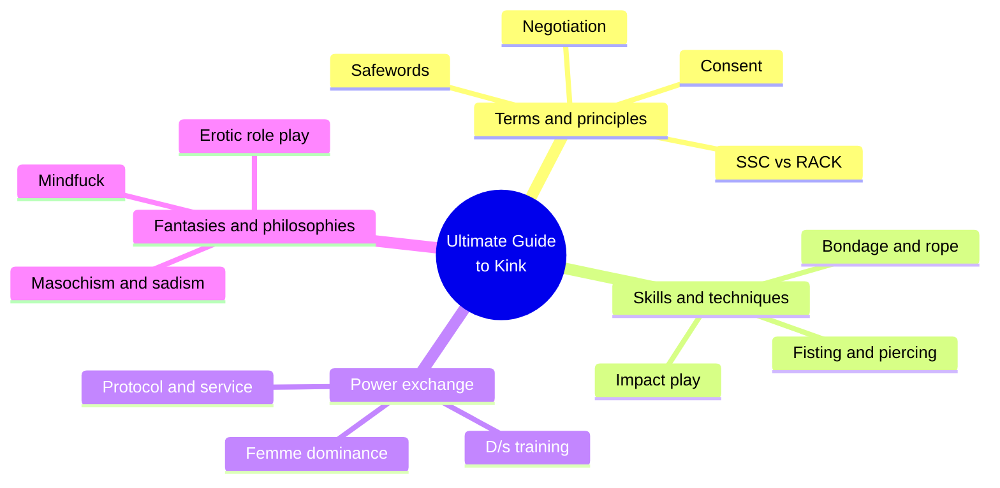
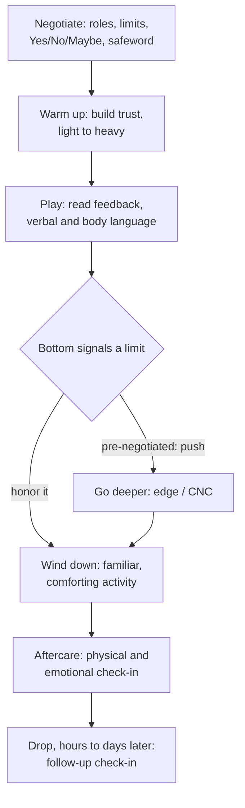
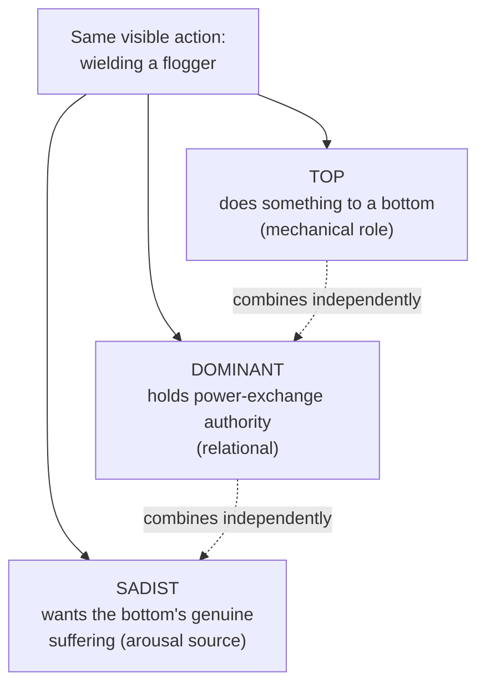
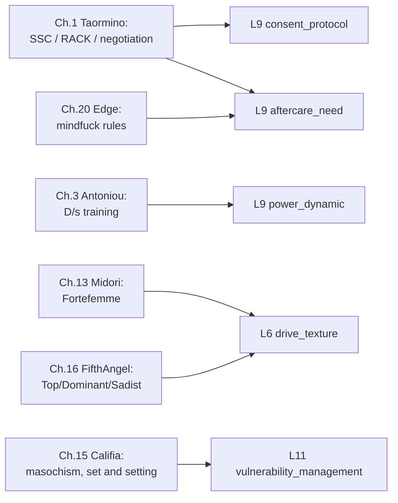

# 🧬 MSX.22 — The Ultimate Guide to Kink — Taormino, ed. (2012)
### Knowledge Entry — Distill (v4)

A twenty-chapter anthology of working BDSM/kink educators (Taormino, Antoniou, Midori, Califia, FifthAngel, Edge, and others), organized as skills-and-techniques plus fantasies-and-philosophies; the field manual for how a kink scene actually runs, negotiation to aftercare.

## TABLE OF CONTENTS
- [Core Thesis](#1-core-thesis)
- [Mind Models](#2-mind-models)
- [Framework](#3-framework--structure)
- [Key Concepts](#4-key-concepts)
- [Heuristics](#5-heuristics--decision-rules)
- [Invariants](#6-invariants)
- [Pitfalls](#7-pitfalls--myths)
- [Application](#8-application)
- [Cross-References](#9-cross-references)
- [Provenance](#10-provenance--confidence)

---

## 1 · CORE THESIS

Kink is a negotiated exchange of power and sensation, run on one shared skeleton: negotiate, warm up, play, read feedback, wind down, debrief. Two competing ethics govern how much risk gets owned: SSC (safe, sane, consensual) sanitizes the risk; RACK (risk-aware consensual kink) names the risk and proceeds anyway. Consent, not activity, is the line between kink and abuse.

---

## 2 · MIND MODELS

*Required. Minimum two diagrams, maximum five.*

**Diagram 1 — the whole argument.**
Caption: *twenty chapters sort into four working registers, terminology, technique, power exchange, and fantasy, but every register runs the same negotiation-first logic.*

**Diagram 2 — the central mechanism (a process, the same one under every practice).**
Caption: *regardless of activity, a scene runs this six-beat arc; only the plateau decision branches by how much was pre-negotiated.*

**Diagram 3 — the central distinction the book keeps re-teaching (Top / Dominant / Sadist).**
Caption: *the same flogger stroke can be all three, any two, or just one; treating them as synonyms is the community error FifthAngel's chapter exists to correct.*

**Diagram 4 — mapped onto the Command's character stack.**
Caption: *the negotiation and aftercare chapters feed L9 directly; the dominance-psychology and masochism chapters feed the drive and vulnerability layers beside it.*

---

## 3 · FRAMEWORK / STRUCTURE

The book has no single spine; it is an anthology, organized into two parts, each chapter owned by a different community educator:

| Part | Chapters | Register |
|---|---|---|
| Skills and Techniques | 1–10 | Nuts-and-bolts how-to: terminology/principles (1), impact play (2), D/s training (3), fisting (4), bondage (5), cock and ball play (6), tantra (7), piercing (8), rough sex (9), anal fisting (10) |
| Fantasies and Philosophies | 11–20 | Edgier, more personal: erotic role play (11), animal role play (12), feminine dominance (13), a submissive's manifesto (14), masochism (15), sadism (16), age play (17), taboo role play (18), "The Dark Side" (19), mindfuck (20) |

Chapter 1 (Taormino) is the load-bearing chapter: it sets the vocabulary (kink, BDSM, D/s, top/bottom/switch, sadomasochism) and the five community values (consent, negotiation, safety/risk-reduction, communication, aftercare) that every later chapter assumes without re-explaining. The book's structural claim is that these values are practice-agnostic: the same negotiation-to-aftercare shape underwrites a spanking, a full D/s training program, a role-play abduction fantasy, and a psychological mindfuck scene alike.

---

## 4 · KEY CONCEPTS

| Concept | What it is | Why it matters |
|---|---|---|
| **SSC (safe, sane, consensual)** | 1983 GMSMA motto (credited to David Stein): kink is safe, sane, and consensual, as opposed to abuse | Founding public-facing and internal-values phrase; later critiqued for sanitizing risk that is actually present |
| **RACK (risk-aware consensual kink)** | 1999 term (Gary Switch): consent plus acknowledged, managed risk, not risk-free safety | Makes room for edge play, heavy scenes, and CNC that SSC's language struggled to own honestly |
| **Yes/No/Maybe list** | A three-column negotiation worksheet covering activities and sex, completed before a scene | Turns "what are we doing tonight" into a documented, revisitable agreement instead of guesswork |
| **Safeword** | A word or signal outside ordinary scene dialogue (never "stop" or "no") that halts play immediately | Necessary because scene dialogue, a captive begging to stop, is often part of the fantasy itself |
| **Consensual nonconsent (CNC)** | Pre-negotiated waiver of in-scene veto: the bottom sets parameters in advance, the top then proceeds without further check-in | The single most useful device for staging a scene that reads as forced while remaining fully agreed |
| **Top / Dominant / Sadist** | Three independent axes: Top does something to a bottom (mechanical); Dominant holds power-exchange authority (relational); Sadist wants the bottom's genuine suffering (arousal source) | Same visible action can be any combination; conflating them is the book's most-corrected community error |
| **Set and setting** | Borrowed from Timothy Leary: set is the players' mindset going in, setting is the physical environment | Both are prepared deliberately, like blocking a scene, before intensity is introduced |
| **No-fault play** | An agreed stance that mishaps (a mistimed stroke, a triggered flashback) are the cost of edge play, not grounds for blame, given good-faith effort | Lets partners recover from an error without ending the relationship or the practice |
| **Subspace / drop** | Subspace: a trance-like altered state a bottom can reach in a heavy scene; drop: a postscene crash (bottom, top, or event drop) that can hit hours or days later | Aftercare has to plan for a delayed emotional bill, not just the immediate glow |
| **Aftercare** | Physical and emotional check-in after a scene: hydration, warmth, debrief, reassurance, sometimes a follow-up days later | The scene is not over when the toys are put away; tops need it as much as bottoms do |
| **Three tenets of flogging** | Janette Heartwood's framework: accuracy (hits land where intended), intensity (escalates at the bottom's pace), connection (relational presence throughout) | A general-purpose rubric for describing any skilled physical scene, not only flogging |
| **The "3 F'n MFs"** | Fear-based, fantasy-based, and faith-based mindfuck, each with its own goal and pre-scene questions | Categorizes psychological play by what it does to the bottom's head, not by its surface content |
| **The safety valve** | The bottom holding two thoughts at once, "I'm safe and this isn't real" and "but what if it is," sliding between them to regulate fear | The mechanism that makes high-stakes role play (kidnapping, interrogation, threat) survivable and repeatable |

---

## 5 · HEURISTICS & DECISION RULES

| Situation | Do this | Not this |
|---|---|---|
| Starting any new scene type | Negotiate roles, activities (Yes/No/Maybe), limits, safeword, and medical disclosure first | Assume goodwill and improvise from zero |
| Bottom's feedback is ambiguous (growling, crying, stomping) | Pause and ask what the reaction means | Assume you already know what it signifies |
| Staging an impact, bondage, or intensity scene | Build from light to heavy with a plateau check partway through | Start at full intensity and expect trust to already exist |
| A scene includes dark role play (rape, taboo, humiliation fantasy) | Negotiate it explicitly beforehand and confirm it is fantasy, not a trauma trigger | Assume dark fantasy content signals real desire or pathology |
| A character reads as dominant or sadistic by nature | Separate their behavior (topping), relational stance (dominance), and arousal source (sadism); they need not align | Write "dominant" as one fused personality trait |
| Depicting the end of a scene | Show both partners handled: physical comfort, emotional debrief, maybe a delayed follow-up | Cut away at climax as if the scene simply ends there |
| A character wants a scene to feel "real" (mindfuck-style) | Control what information the other party has access to; reveal less than seems necessary | Over-explain or overact to sell the illusion |
| A submissive character hits a limit mid-scene | Have the top make a visible choice: honor it and wind down, or push only if pre-negotiated | Let the scene drift past agreed limits with no decision point on the page |
| A dominant character makes an in-scene error | Show acknowledgment and repair (no-fault), not denial or an apology that breaks the dynamic | Have the scene continue as if unnoticed, or let it end the relationship |

---

## 6 · INVARIANTS

1. **Consent, not the content of an act, separates kink from abuse.** No activity is inherently safe or inherently abusive outside its negotiation.
2. **Every scene has a shape**: negotiate, warm up, play, reach and handle a plateau, wind down, provide aftercare, regardless of the specific practice.
3. **Top/bottom, Dominant/submissive, and sadist/masochist are three separate axes**, not one spectrum; any combination is possible in the same person or the same scene.
4. **Fantasy content is not literal intent.** A fantasy about violence, taboo, or nonconsent is not evidence that a person wants it enacted outside its frame.
5. **In-scene feedback is often nonverbal** (breathing, posture, sound) and must be actively read, especially when a verbal check-in would break the dynamic being played.
6. **Aftercare is not optional and is not only for the bottom.** Drop can hit either partner, hours or days after the scene ends.
7. **Risk cannot be eliminated from kink, only acknowledged and managed** (RACK's premise); describing it as risk-free (pure SSC) misdescribes what is actually happening.

---

## 7 · PITFALLS / MYTHS

- Treating "no safeword" or "consensual nonconsent" as meaning no consent was given: CNC is a pre-negotiated waiver of in-scene veto, not an absence of agreement.
- Assuming a submissive or masochist character has low self-worth or is being exploited; the book separates kink identity from psychopathology explicitly, against the DSM's own historical framing.
- Writing "Dominant" and "sadist" as interchangeable; a Dominant can be entirely non-sadistic, and a sadist need not hold relational power at all.
- Skipping negotiation because partners are "experienced" or because a scene is "just role play, not real BDSM"; the book applies the same negotiation requirement to fantasy play.
- Ending a scene at climax with no aftercare beat, especially after an intense exchange, which erases the emotional cost the book treats as real and recurring.
- Confusing fear-based mindfuck with actual mind control or with nonconsensual head games; the defining feature of mindfuck is that all parties agreed to the lie in advance.
- Treating a dominant character's confidence as innate and effortless; the book frames it as built (Midori's Archetype Exercise) and maintained through ongoing self-honesty about flaws.

---

## 8 · APPLICATION

- **Spine level:** L5
- **12-layer character stack:** L9 (`consent_protocol`, `power_dynamic`, `aftercare_need`), L6 (`drive_texture`), L11 (`vulnerability_management`)
- **plot_systems:** candidate: the six-beat scene arc (Diagram 2) is a portable template for writing any on-page power-exchange or kink scene so it reads as structured and consensual by default, with deviation from the arc (skipped negotiation, no aftercare, ignored limits) available as a deliberate red flag when a story wants one
- **Setting:** contextual: the kink-community milieu (play parties, dungeons, munches, national organizations of the NLA/TES type) is available as background texture for a character's social world

This is the frankest, most clinical-where-source-is-clinical material yet distilled for the intimacy/sexuality layer: several contributors, FifthAngel and Edge specifically, write from an openly gay-male leather/S&M vantage, giving direct, unromanticized material for a gay or bi male character's interior logic as a Dominant, sadist, or mindfucker (Ch.16, Ch.20) without pathologizing the drive itself. The Top/Dominant/Sadist axis split (Diagram 3) is the single most useful tool here: it lets a writer give a character a consistent kink identity that does not collapse into a stock "dominant alpha" or "broken submissive" cliché, because behavior, relational authority, and arousal source can be dialed independently. The CNC and mindfuck-rules material (control the info, less is more, deliver and maintain, the safety valve) is also the book's best answer to a real craft problem: how to write a scene that must read as forced or nonconsensual on the page while the underlying character logic (and, by extension, the author's handling of consent) stays ethically load-bearing and intentional rather than accidental.

---

## 9 · CROSS-REFERENCES

| Related entry | Relation |
|---|---|
| [[🧬 MSX.14 — The New Bottoming Book — Easton & Hardy (2001)]] | Sibling practice manual, bottom-side counterpart to this book's receptive-role material (Ch.14's manifesto, Ch.15's masochism chapter) |
| [[🧬 MSX.15 — The New Topping Book — Easton & Hardy (2003)]] | Sibling practice manual, top-side counterpart to this book's dominance and sadism chapters (Ch.13, Ch.16) |
| [[🧬 MSX.17 — Mating in Captivity — Perel (2006)]] | Different register (long-term desire theory) on the same territory this book treats as explicit practice: distance, power, and eroticized aggression inside a bond |
| [[🧬 PSY.04 — Women and Kink — Rehor & Schiffman (2021)]] | Complementary demographic lens (women's kink participation and research) against this book's mixed-gender, queer-inclusive anthology approach |

---

## 10 · PROVENANCE & CONFIDENCE

Full text, pdftotext extraction, twenty-chapter anthology (source_type book). Read in full or substantial extraction: the introduction (Taormino, "Playing on the Erotic Edge"); Chapter 1, "'S Is For...'" (Taormino: terminology, the five principles, SSC/RACK history, safewords, communication, aftercare, full); Chapter 2, "Making an Impact" (Lolita Wolf: spanking and caning in full, flogging's three tenets in full); Chapter 3, "How to Train Your Sex Slave" (Antoniou: negotiation, exercises, reward/punishment, full); Chapter 11, "Stop, Drop, and Role!" (Mollena Williams: role-play negotiation and aftercare/reentry, full); Chapter 13, "Fortefemme" (Midori: dominance archetype and practical scene tips, full); Chapter 14, "Submissive: A Personal Manifesto" (Madison Young, full); Chapter 15, "Enhancing Masochism" (Patrick Califia: definitions, set and setting, consensual nonconsent, no-fault play, full); Chapter 16, "Inside the Mind of a Sadist" (FifthAngel: Top/Dominant/Sadist distinction, history of the term, CNC, aftercare/aftermath, full); Chapter 20, "Mindfuck" (Edge: the 3 F'n MFs, the rules, the safety valve, before/during/after structure, handling danger, full).

Sampled via table of contents only, not extracted: Chapters 4–10 (fisting, bondage, cock and ball play, tantra, piercing, rough sex, anal fisting) and Chapters 12, 17–19 (animal role play, age play, taboo role play, "The Dark Side"). This is a deliberate focus pass against the brief (negotiation/consent frameworks, power exchange and role play, scene structure start to finish) rather than a full-book extraction; the unread chapters are largely technique-specific (the physical mechanics of a given kink) rather than framework-bearing, and were deprioritized against the ones actually feeding the consent, power-exchange, and aftercare variables above.

## META
- Template: BVX-LEARN-v4.0
- Source classification: full-text anthology, deep extraction on 9 of 20 chapters plus the introduction, sampled via table of contents on the remaining 11
- Created / Updated: 2026-09-29
