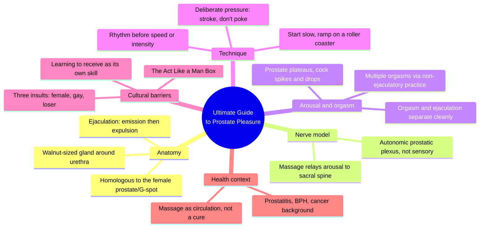
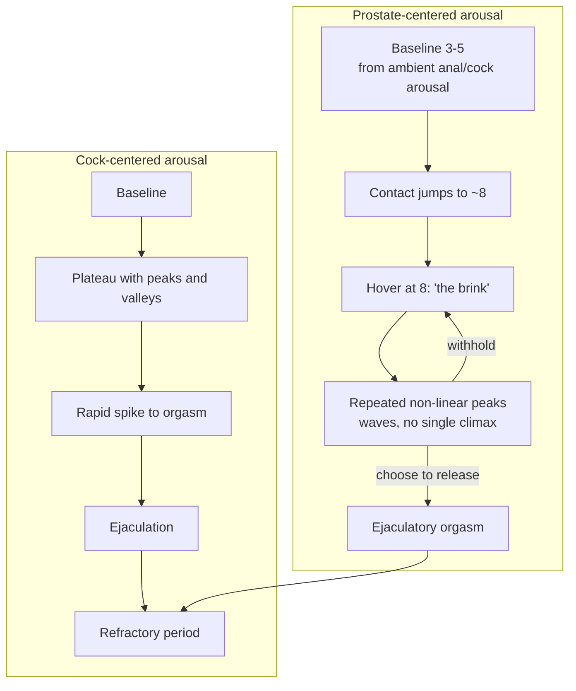
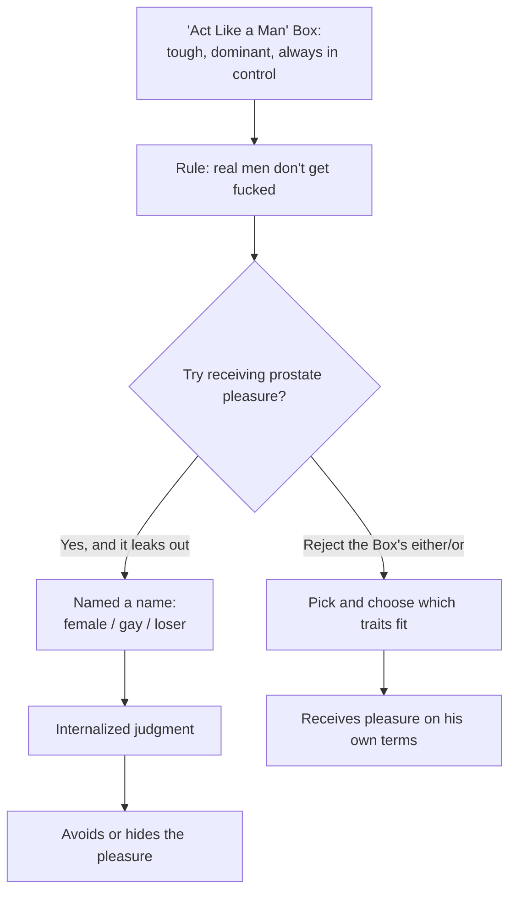
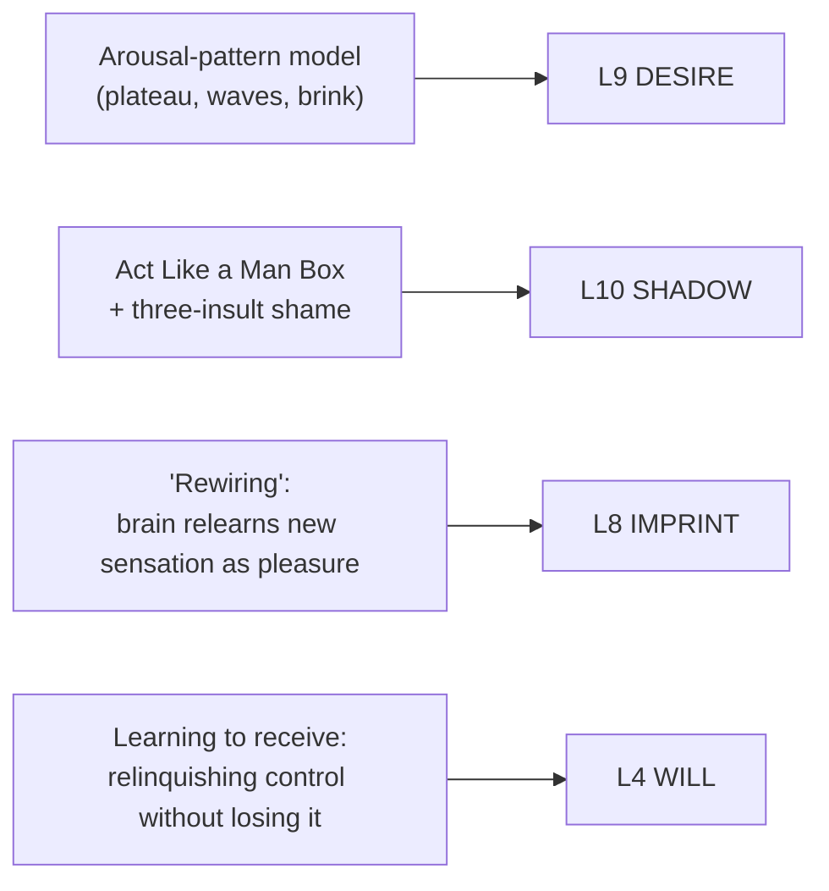

# 🧬 MSX.23 — The Ultimate Guide to Prostate Pleasure — Glickman & Emirzian (2013)
### Knowledge Entry — Distill

A sex educators' field guide to the prostate: anatomy, a home-grown arousal model built from two surveys of hundreds of men, room-by-room technique, and a direct dismantling of the masculinity beliefs that keep most men from ever finding out what the gland can do.

## TABLE OF CONTENTS
- [Core Thesis](#1-core-thesis)
- [Mind Models](#2-mind-models)
- [Framework](#3-framework--structure)
- [Key Concepts](#4-key-concepts)
- [Heuristics](#5-heuristics--decision-rules)
- [Invariants](#6-invariants)
- [Pitfalls](#7-pitfalls--myths)
- [Application](#8-application)
- [Cross-References](#9-cross-references)
- [Provenance](#10-provenance--confidence)

---

## 1 · CORE THESIS

Prostate pleasure is real, learnable, and structurally different from cock-centered pleasure: arousal jumps to a plateau and hovers in waves instead of building to a single spike. The main barrier is not anatomy but a masculinity script that equates receiving with becoming female, gay, or weak.

---

## 2 · MIND MODELS

*Required. Minimum two diagrams, maximum five.*

**Diagram 1 — the whole argument.**
Caption: *six working parts, one throughline: the gland is real, the pleasure is learnable, and the biggest obstacle standing between them is a story about masculinity, not the body.*

**Diagram 2 — the central mechanism (two arousal patterns, contrasted).**
Caption: *cock arousal spikes once and drops; prostate arousal jumps early, plateaus high, and can be ridden as repeated waves before a chosen release. Confusing the second pattern for a failure of the first is the book's most common troubleshooting call.*

**Diagram 3 — the masculinity-shame mechanism ("Act Like a Man" Box).**
Caption: *the Box manufactures the barrier before the body ever gets a vote; the fix is not proving you're still a "real man," it's rejecting the either/or that built the Box in the first place.*

**Diagram 4 — mapped onto the Command's 12-layer character stack.**
Caption: *four book mechanisms land on four distinct layers; none of them are the same claim wearing different clothes.*

---

## 3 · FRAMEWORK / STRUCTURE

Fifteen chapters run in three movements, bookended by a foreword from sex educator Carol Queen:

| Movement | Chapters | Job |
|---|---|---|
| Ground the reader | 1–3 | Answer the FAQ objections up front, then establish that prostate pleasure is real and describe the gland itself |
| How-to | 4–12 | Hygiene, painless penetration, arousal and mindset, locating the gland solo and partnered, opening the topic with a partner, massage technique, the perineum, toys, anal sex and strap-on play |
| The larger stakes | 13–15 | Masculinity and the "Act Like a Man" Box, prostate health conditions, the possible health benefits of massage |

The book's own hinge is Chapter 6, "Searching for the 'Magic Button'": it explicitly refuses the idea that finding the prostate is a location problem ("push the button, get pleasure") and reframes the whole project as a mind-body and nervous-system learning curve. Everything before Chapter 6 sets up why that reframe is needed; everything after it is built on top of it.

The data underneath the arousal-and-technique chapters comes from two of the authors' own surveys: one of about 75 people on technique (givers and receivers, all orientations), one of receivers only on subjective sensation. Quoted respondents carry the book's most specific claims about how prostate orgasm actually feels.

---

## 4 · KEY CONCEPTS

| Concept | What it is | Why it matters |
|---|---|---|
| **The P-spot / male G-spot** | The prostate's popular rebrand, drawing a direct anatomical and phenomenological parallel to the female G-spot and the (contested) female prostate/Skene's glands | Names the gland as an intentional pleasure organ instead of a medical afterthought; the homology claim is real (same embryonic tissue), the G-spot-is-the-female-prostate claim is not settled science |
| **The sensory/autonomic nerve split** | The prostate itself carries few true sensory receptors; the pleasure is thought to run through the autonomic prostatic plexus, which relays arousal signals to the sacral spine (S2–4) rather than reporting touch to the brain the way skin does | Explains why "massaging the gland" and "feeling pleasure from the gland" are not quite the same claim, and why sensation is diffuse rather than localized |
| **"Deliberate" pressure (stroke, don't poke)** | Firm, broad-surface, sustained contact spread across the finger pad, as opposed to a narrow fingertip jab | The single most repeated technique instruction in the book; pressure is force divided by area, so the same force applied narrowly reads as painful poking and applied broadly reads as pleasurable stroking |
| **The roller-coaster ramp** | Build stimulation intensity for a stretch, back off, build again higher, repeat, rather than a single steady escalation | Prevents nerve overload/numbing; backing off "resets" sensitivity so the next increase registers as new information instead of more of the same |
| **Rewiring** | The brain has to learn, through repetition, to interpret an unfamiliar internal-pressure signal as pleasure rather than as a bladder cue or noise | Explains why a first (or fifth) attempt can feel like nothing, and why that is not evidence of the technique being wrong |
| **Lingering on the brink** | Prostate arousal can jump quickly to a near-orgasmic plateau (roughly 8 of 10) and hover there through repeated peaks, for minutes to hours, instead of resolving quickly into a single climax | The book's clearest structural claim: prostate arousal does not obey the standard excitement-plateau-orgasm-resolution curve built from penile response |
| **Orgasm/ejaculation separability** | Ejaculation is a spinal-cord reflex (emission then expulsion); orgasm is a cerebral-cortex event. They usually coincide but do not have to | The mechanism behind multiple, non-ejaculatory orgasms; removes the refractory period as a hard ceiling on how much pleasure one session can hold |
| **The "Act Like a Man" Box** (via Paul Kivel) | A culturally consistent checklist of "real man" traits (tough, dominant, always in control, never receptive) policed by three insults for falling outside it: you're female, you're gay, you're a loser | Names the actual obstacle to prostate exploration for most men: not squeamishness about anatomy, but fear of losing masculine standing |
| **Learning to receive** | The skill of allowing a partner to lead and give pleasure without treating that as a permanent surrender of control | Distinct from the physical skill of relaxing the sphincters; many men who can physically tolerate penetration still find receiving-as-a-role psychologically harder than giving |
| **The bounded space of eroticism (implicit)** | Being penetrated, dominated, or made to feel vulnerable in bed does not carry the same meaning it would outside of sex | The book never names this as a concept the way Perel does, but every myth it debunks (penetration = domination = loss of manhood) rests on collapsing bedroom meaning into everyday meaning |

---

## 5 · HEURISTICS & DECISION RULES

| Situation | Do this | Not this |
|---|---|---|
| Applying finger pressure to the prostate | Spread contact across the finger pad, hold it, slide smoothly | Jab with the fingertip like ringing a doorbell |
| Starting a new session | Begin with light pressure and slow strokes, ramp gradually | Open with the hard, fast pressure that feels good later, at climax |
| Excitement is climbing fast | Back off intensity for a stretch, then build again higher (roller coaster) | Keep escalating linearly until it overloads or numbs out |
| Nothing is felt on early attempts | Keep trying across multiple sessions; treat it as a nervous-system learning curve | Conclude the technique or the location is wrong and give up |
| Choosing rhythm vs. speed | Hold a steady, repeated rhythm and vary stroke type, pressure, or location deliberately | Randomly switch speed and motion mid-stroke |
| A man wants to try receiving but fears the label | Separate what happens in bed from what it means about his masculinity or orientation | Treat penetration-as-receiver as evidence about who he "really" is |
| A partner reacts with disgust or refusal | Give space, revisit later, ask what specifically bothers them, don't push or shame | Force the issue in the moment or drop it forever without a real conversation |
| Wanting to extend pleasure across a session | Learn to separate orgasm from ejaculation (build PC-muscle control, withhold release) | Treat the first orgasm as the natural end of the session |
| Combining cock and prostate stimulation | Alternate first, build each individually, only combine once both are practiced | Attempt both at full intensity simultaneously from the start |
| Judging a man's masculinity (his own or a partner's) | Let him pick and choose which "real man" traits actually fit him | Enforce the Box's all-or-nothing standard, or its mirror-image "anti-Box" |

---

## 6 · INVARIANTS

1. **Arousal, not location, determines whether prostate stimulation feels good.** The prostate swells and becomes receptive under arousal; an unaroused prostate reads as uninteresting or uncomfortable regardless of finger placement accuracy.
2. **Pressure spread over area reads as pleasure; pressure concentrated at a point reads as pain.** This is physics (force divided by area), not technique mysticism, and it holds across fingers, toys, and fisting.
3. **Orgasm and ejaculation are separable processes.** One can occur without the other; this is what makes multiple, non-ejaculatory orgasms structurally possible for anyone with a prostate.
4. **Novel sensation requires interpretive learning before it registers as pleasure.** The brain, not the gland, is where "rewiring" happens; early numbness or ambiguity is expected, not diagnostic of failure.
5. **The mind-body connection is not optional for receptive pleasure.** Stress, unexamined negative emotion, or performance anxiety tighten the pelvic floor and block exactly the relaxation penetration requires.
6. **The masculinity script that forbids receiving predates and outlasts any individual man's actual desire.** It is culturally manufactured and policed by name-calling (female, gay, loser), not derived from anatomy or orientation.
7. **Consent, communication, and pacing govern safety more than any specific technique does.** Every escalation in the book (more fingers, toys, fisting) is gated on going slowly, listening to the body, and never forcing.

---

## 7 · PITFALLS / MYTHS

- Treating the prostate as a "magic button": push it, get instant pleasure. Location alone does not guarantee sensation; arousal state and nervous-system familiarity do most of the work.
- Assuming male receptive penetration is inherently gay, feminizing, or evidence of being dominated in daily life rather than in a bounded erotic context.
- Assuming a man who prefers to give pleasure is virtuous and a man who wants to receive it is failing some standard of manliness ("real men give, they don't ask").
- Going in hard and fast on a first attempt because "more intensity means more pleasure"; this is the single most common way sensation gets numbed out or turned painful.
- Believing that if nothing is felt in early attempts, the technique, the location, or the man's capacity for pleasure must be wrong, rather than recognizing an ordinary rewiring curve.
- Confusing prostate massage's medical framing (extraction of prostatic fluid, health-maintenance narrative) with its erotic framing, and assuming the former disqualifies the latter.
- Interpreting a partner's disgust reaction as a verdict on the asker's desires rather than as the partner's own unrelated hang-up.
- Believing that once a man "goes bottom," he has permanently given up the top role, rather than treating role as fluid and revisitable.

---

## 8 · APPLICATION

- **Spine level:** L5 (per the sexuality-shelf assignment; the book's material sits inside the WOUND-adjacent territory of shame and self-judgment even though its primary content is technique and arousal mechanics, not backstory)
- **12-layer character stack:** L9 DESIRE (primary, the arousal-pattern model itself), L10 SHADOW (primary, the "Act Like a Man" Box and its three-insult shame architecture), L8 IMPRINT (supporting, the rewiring mechanic), L4 WILL (supporting, learning to receive), L6 DRIVE (contextual, exploration and role-reversal motivators)
- **plot_systems:** none directly; this is a body-of-knowledge source for rendering scenes and interiority truthfully, not a scene-generation method
- **Setting:** none

For a writer building the intimacy layer of a character system, this book is most useful as a truth-check against two failure modes: writing male receptive pleasure as either nonexistent (only women and gay men "count" as receivers) or as a settled, shame-free given (skipping the internal negotiation most men actually run). The Box mechanism (Diagram 3) is directly usable as a character's internal obstacle course: a man's specific fear is rarely "will this feel good," it is "what does wanting this make me, and who gets to call me that name." The arousal-pattern contrast (Diagram 2) is useful anywhere a scene needs to render an orgasm from the inside without defaulting to the cock-centered build-and-release template; the plateau-and-waves pattern gives a different rhythm to write toward, longer, less resolved, harder to end cleanly. The rewiring concept (L8) is a reusable beat for any character encountering a new form of pleasure or intimacy: the first attempt reading as nothing, or as confusing, is realistic and does not need to be narrated as failure.

---

## 9 · CROSS-REFERENCES

| Related entry | Relation |
|---|---|
| [[🧬 MSX.17 — Mating in Captivity — Perel (2006)]] | Perel's "bounded space of eroticism," where power dynamics that would be oppressive outside sex become pleasurable inside it, is the unstated theoretical frame under this book's entire myth-debunking project; this book supplies the specific male-receptive case Perel's frame leaves general |
| [[🧬 MSX.14 — The New Bottoming Book — Easton & Hardy (2001)]] | Sibling text on the psychology and ethics of receiving; that book covers power-exchange bottoming broadly, this one is anatomically and technically specific to one gland |
| [[🧬 MSX.15 — The New Topping Book — Easton & Hardy (2003)]] | Companion giving-side text; useful alongside this book's massage-technique chapter for the giver's half of the same scene |
| [[🧬 PSY.01 — Whole-Body Sex — Walker (2020)]] | Shares this book's core claim that pleasure need not be genitally localized; Whole-Body Sex generalizes what this book demonstrates specifically through prostate-triggered full-body and non-ejaculatory orgasm |

---

## 10 · PROVENANCE & CONFIDENCE

Full-text extraction (pdftotext), roughly 81,000 words across an estimated 270 pages, clean text with a machine-readable table of contents and legible chapter breaks (occasional mojibake on em dashes and curly quotes, not a comprehension problem). Read in depth: the foreword and introduction; Chapter 1 (FAQ objections); Chapter 2 (sensation vocabulary, prostate orgasm, lingering on the brink, multiple orgasms) in full; Chapter 3 (prostate anatomy, phases of ejaculation, the male-G-spot/nerve debate, the root-chakra sidebar) in full; Chapter 6 (mind-body connection, realistic expectations, learning to receive, arousal, rewiring, breath, PC-muscle tone, Tantra vs. fantasy) in full; Chapter 9 (prostate massage technique, deliberate pressure, poking vs. stroking, rhythm, the named stroke catalog, fisting) in full; Chapter 13 (the Act Like a Man Box, the three-pillar shame argument) through its central argument. Sampled or skimmed rather than deep-extracted: Chapter 4 (hygiene, enemas), Chapter 5 (penetration basics, bearing down), Chapter 7 (locating the gland, setup checklist), Chapter 8 (opening the topic with a partner), Chapters 10–12 (perineum, toys, anal sex/strap-on), Chapters 14–15 (prostate health conditions, possible health benefits). The health chapters were deliberately not deep-read; they sit outside this distill's assigned focus (anatomy, the arousal/orgasm model, technique, and cultural/psychological barriers) and would need a separate pass if the health-benefits claims become load-bearing elsewhere.

The `feeds:` keying is this distill's own synthesis against the Command's 12-layer character stack, inferred from comparable entries (MSX.17's L9/L6/L11 usage, BVX.0209's L5/L6/L8/L4/L10 usage) rather than read from a single canonical layer-definition document; treat the specific layer numbers as provisional pending a cross-check against the SSOT if one surfaces.

## META
- Template: BVX-LEARN-v4.0
- Source classification: full-text book, deep extraction on 6 of 15 chapters, sampled on 7, skipped on 2 (health chapters, out of assigned focus)
- Created / Updated: 2026-09-29
