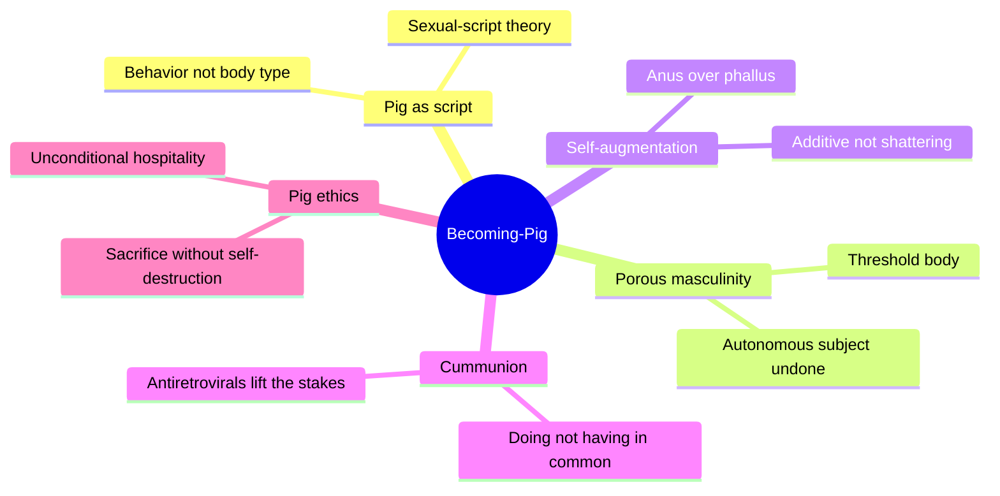
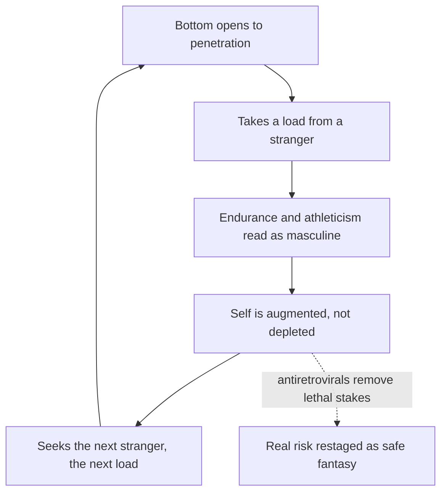
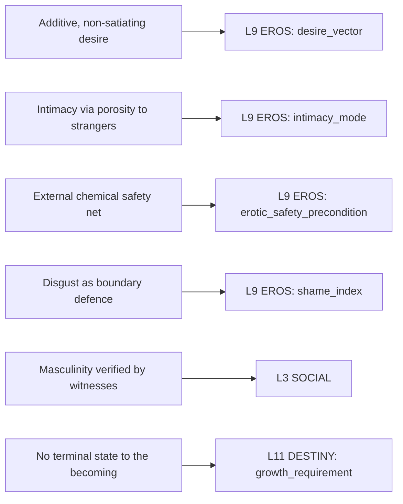

# 🧬 MSX.24 — Bareback Porn, Porous Masculinities, Queer Futures: The Ethics of Becoming-Pig — Florêncio (2020)
### Knowledge Entry — Distill

An art historian's study of the contemporary gay "pig," read here for one thing: how a masculinity gets built by opening the body to strangers instead of sealing it shut, and what that structure of desire, intimacy, and ethics offers a writer working with gay and bi men's sex, bodies, and communities.

## TABLE OF CONTENTS
- [Core Thesis](#1-core-thesis)
- [Mind Models](#2-mind-models)
- [Framework](#3-framework--structure)
- [Key Concepts](#4-key-concepts)
- [Heuristics](#5-heuristics--decision-rules)
- [Invariants](#6-invariants)
- [Pitfalls](#7-pitfalls--myths)
- [Application](#8-application)
- [Cross-References](#9-cross-references)
- [Provenance](#10-provenance--confidence)

---

## 1 · CORE THESIS

Gay "pig" masculinity is a script, not a body type: it is built by opening the body to strangers' fluids rather than sealing it shut, using antiretrovirals to convert HIV's lethal stakes into safe fantasy. Masculinity then accrues through what a man endures and lets in, load after load, never through what he penetrates or finishes.

---

## 2 · MIND MODELS

*Required. Minimum two diagrams, maximum five.*

**Diagram 1 — the whole argument.**
Caption: *five chapters trace one figure from history to ethics, and the book closes where queer theory usually stops: not at self-shattering, but at a duty to welcome the stranger.*

**Diagram 2 — the central mechanism (self-augmenting anality).**
Caption: *masculinity does not deplete with each penetration here, it compounds; the loop only runs because a chemical safety net removed the old lethal stakes from each turn.*

**Diagram 3 — mapped onto the Command's character system (L9 EROS, L3 SOCIAL, L11 DESTINY).**
Caption: *each load-bearing structural claim in the book lands on a named variable, not a vibe; this is how a "pig" character's desire gets built, not just flavoured.*

---

## 3 · FRAMEWORK / STRUCTURE

An introduction plus five chapters, each keyed to one register of the same argument: history (how "pig" became a script), embodiment (what a porous body threatens), pharmacology (what toxicity augments), sociability (what strangers can build without holding anything in common), and ethics (what hospitality owes the stranger).

| Chapter | Register | What it establishes |
|---|---|---|
| Introduction | Sexual-script theory | "Pig" names a behaviour, not a look; it emerged as a subcultural taxonomy alongside antiretrovirals, online porn, and chemsex |
| 1. A Pig Is What a Pig Does | History (1970s–2019) | Traces "pig" through fetish magazines (*Drummer*, *Kumpel*, *Projet X*) and porn video, through the AIDS-era split between "clean" assimilationist gay masculinity and its "dirty" underground |
| 2. Porous Man w/holes | Political philosophy | Sets the bourgeois autonomous body (Kant, Hobbes) and its wholeness ideal against the "pig" as a masculinity of the threshold, akin to the monster and the literal pig |
| 3. Self-Augmenting Masculinities | Psychoanalysis, biopolitics | Reframes bareback intoxication as additive self-augmentation (Tomso, Sloterdijk) rather than self-shattering jouissance (Bersani); dephallicizes masculinity onto the anus |
| 4. The Cummunion of Strangers | Political theory of community | Uses Esposito's *communitas* to argue strangers need share nothing to belong together; antiretrovirals let fluid exchange mean kinship without HIV as the shared property |
| 5. Pig Ethics, Queer Futures | Ethics of hospitality | Draws on Derrida and Dufourmantelle to frame "pigsex" as a rehearsal of unconditional welcome to the wholly other, provided care structures exist to keep sacrifice from becoming annihilation |

---

## 4 · KEY CONCEPTS

| Concept | What it is | Why it matters |
|---|---|---|
| **"A pig is what a pig does"** | Unlike bear, otter, or twink (looks-based categories), "pig" is a Gagnon-and-Simon sexual script: a behavioural identity taken up and performed, not a body type inhabited | Gives a writer a clean device for behavior-defined subcultural identity, portable beyond this one subculture |
| **Masculinities of the threshold** | Following Stallybrass and White's reading of the literal pig as a "creature of the threshold," the gay pig occupies the border the bourgeois body was built to police: clean/dirty, human/animal, inside/outside | The monster and the pig are the two figures modernity uses to define the "whole" body negatively, by what it excludes |
| **Self-augmenting anality** | Masculinity actualized through the anus's capacity to take in "load after load," not through the erect, ejaculating penis; endurance and athleticism replace the cumshot as masculinity's anchor | Directly dephallicizes a hypermasculine identity; a bottom becomes "more masculine" the more he receives, not less |
| **Fluidal communion / nobjects** | Sloterdijk's term (via Macho) for matter that augments a subject by intimate addition rather than confirming it by opposition, as an object does | Explains why gay pigs describe being "loaded up" as building them up, not diminishing them |
| **Additive economy of excess** | Tomso's reading of bareback sex against Bersani's "solipsistic" orgasmic jouissance: viral/fluid sex is "not so much a shattering force as it is an additive one," resembling Bataille's unproductive expenditure | Offers a life-affirming account of extreme sex distinct from both the death-drive reading and the redemptive "turn shit into gold" reading |
| **Communitas vs. community** | Esposito's etymology: *communitas* derives from *munus* (duty, gift), so what is shared is given away, not jointly possessed; "what we share with another ceases to be our own" | Lets characters belong to each other through an act (doing-in-common) rather than through a shared trait, HIV status included |
| **Cummunion** | Florêncio's coinage for the queer world-making enacted through fluid exchange: connective tissue between strangers rather than confirmation of a shared identity | A usable frame for any scene where sex, not talk, is what builds the bond |
| **Pharmacopornographic hacking** | Preciado's term for reappropriating the same molecular technologies (antiretrovirals) that surveil bodies, turning them into tools for new pleasures and kinships ("copyleft revolution") | A biomedical safety net does not neutralize a practice's political charge; it can relocate it |
| **Xeno-hospitality / unconditional welcome** | Derrida and Dufourmantelle's hospitality proper: welcome that precedes and does not depend on the stranger first proving themselves safe or familiar | Distinguishes a genuinely open ethical gesture from a conditional, vetted, transactional one |
| **The ethical act (Antigone, Abraham)** | Lacan and Kierkegaard's shared structure: one becomes oneself by breaking the law one was given, trembling toward an unknown outcome, not by following a script to a known one | A model for a character's defining moral choice being illegible in advance, felt as trembling rather than certainty |

---

## 5 · HEURISTICS & DECISION RULES

| Situation | Do this | Not this |
|---|---|---|
| Writing a hypermasculine bottom or "pig" character | Build his masculinity from endurance, athleticism, and eagerness to receive; the hole, not the penis, is his working organ | Write penetration as automatically emasculating or passive |
| Writing group or communal sex | Let connection form through the fluid exchange and the doing-together itself | Require the participants to already share an identity, a look, or a backstory to feel like kin |
| Writing bareback or other real-risk sexual subcultures | Show layered, coexisting motives: kinship-building, aesthetic pleasure, transgression, care, sometimes desire for risk itself | Reduce the behavior to a single death-drive or self-destruction explanation |
| Writing a character's disgust reaction to a body or fluid | Treat disgust as the boundary defence of an intact identity, and desire as what pushes through it, not around it | Write disgust and desire as mutually exclusive states |
| Writing a scene of welcome to a genuine stranger | Make the hospitality unconditional: no password, no proof of safety or familiarity required first | Gate the welcome behind the stranger first speaking the host's language, proving their bona fides |
| Writing an "authentic" or "raw" sex scene, on camera or off | Show the construction underneath the effect (framing, lighting, narration, editing, anonymity) even while it reads as unmediated | Treat depicted intensity or explicitness as evidence of unmediated truth |
| Writing a subculture outsiders call deviant or pathological | Investigate its own vocabulary, rituals, and internal ethics before judging it | Diagnose or pathologize the practice before establishing what it means to its own participants |
| Writing a technology (drug, prophylactic, app) that changes what a risky practice means | Show it relocating the practice's stakes and symbolism, not simply removing risk or resistance | Assume a safety technology automatically defuses a practice's political or identity charge |
| Writing a character's defining sacrifice or self-giving act | Frame it as generative, an act of hospitality that risks the self without requiring its destruction | Write shared vulnerability or self-giving as pure, zero-sum loss |

---

## 6 · INVARIANTS

1. **Behavior defines the identity here, not appearance.** "Pig," unlike bear, otter, or twink, names what a man does sexually, not what he looks like.
2. **Receptivity can out-masculinize penetration.** When endurance and athleticism are the measure, taking in more marks a man as more masculine, not less.
3. **Disgust is a boundary-defense mechanism, not desire's opposite.** Eroticized porosity means pushing desire through disgust, not eliminating disgust first.
4. **Additive desire and goal-directed desire are structurally different.** One accumulates without a finish line; the other resolves on acquisition. A character can run on either.
5. **Communion does not require something held in common.** It can be an act done together (a "doing-in-common") rather than a trait, status, or identity jointly possessed.
6. **A biomedical or technological mediation can change what a transgression means without removing its symbolism.** Antiretrovirals stopped bareback sex from being lethal; they did not stop it from carrying meaning.
7. **Hospitality, to be unconditional, asks nothing of the stranger in return.** A welcome that requires the stranger to prove themselves first is a conditional, diminished form of the same gesture.
8. **A subculture's internal vocabulary and ritual structure precede, and exceed, any pathologizing frame imposed from outside.**

---

## 7 · PITFALLS / MYTHS

- Reading bareback or other risk-embracing sex as pure self-destruction, a "death wish"; this erases the kinship-building, aesthetic, and communal motives the source documents at length.
- Assuming penetration equals passivity equals emasculation; contemporary "pig" porn and subculture build masculinity on the opposite read, receptivity as athletic achievement.
- Treating a porn video's or a scene's "documentary realism" as unmediated fact; subtitles, camera placement, staged anonymity, and editing all manufacture the reality-effect.
- Collapsing community into "things held in common"; Esposito's etymology runs the other way; what is *communis* is what has ceased to be anyone's private property.
- Assuming a subculture member's rejection of a safety technology (PrEP, in this case) is automatically resistance, or automatically recklessness; motives are layered and contested even within the subculture itself.
- Writing hospitality as something a stranger must earn by first proving familiarity or safety; genuine (Derridean) hospitality precedes and does not depend on that proof.
- Assuming risk-taking sexual communities have no infrastructure of care; the source documents drug-and-sex harm-reduction workshops, darkroom friendships, and everyday mutual aid running alongside the risk.

---

## 8 · APPLICATION

- **Spine level:** [L5] Character, per this batch's assigned keying; a source for the intimacy/sexuality layer of the character system, not a story-spine structural one.
- **12-layer character stack:** L9 EROS, primary (`desire_vector`, `intimacy_mode`); L9 EROS, supporting (`erotic_safety_precondition`, `shame_index`); L3 SOCIAL, contextual (witnessed, collectively verified masculinity); L11 DESTINY, primary (`growth_requirement`, an open-ended, antiteleological becoming).
- **plot_systems:** contextual candidate once `04_PLOT_SYSTEMS/` opens; a communal-sex, subcultural-initiation, or hospitality-to-a-stranger scene is a ready-made engine for a character's defining ethical choice, structured like the Antigone/Abraham "ethical act" rather than a normal decision tree.
- **Setting:** none directly; this is a character-and-ethics source, not a SETTING-shelf one, though its subcultural infrastructure (darkrooms, sex clubs, care networks, hanky-code legibility) could seed an S6 ECONOMY or S8 HABIT instance for any setting with an adult sexual subculture.

Florêncio's real contribution to the intimacy layer is a structural alternative to the two stock readings of extreme sex, victimhood/self-destruction on one side, redemptive empowerment on the other. A `desire_vector` for a "pig" or bareback-adjacent character should be additive and open-ended rather than goal-resolving: the point is the next stranger, not a culminating orgasm. An `intimacy_mode` built on porosity to the unfamiliar is a distinct register from MSX.17's distance-within-a-known-partner model, and both can coexist across different relationships in the same character's life. The `erotic_safety_precondition` variable should be able to hold an external, chemical, invisible-to-the-scene safety net (antiretrovirals here) as its own category, separate from the negotiated, visible, in-scene consent checklist MSX.18 documents for paid porn labor. Finally, the book's ethics chapter is portable well past this subculture: any character whose defining act is welcoming a genuine stranger, sexually or otherwise, without first requiring the stranger to prove themselves, is running the same "xeno-hospitality" this source names.

---

## 9 · CROSS-REFERENCES

| Related entry | Relation |
|---|---|
| [[🧬 PSY.03 — Unlimited Intimacy — Dean (2009)]] | Direct dialogue and revision: Dean's barebackers "breed" kinship through shared HIV status, a private thing rendered common; Florêncio argues *communitas* needs no shared possession at all, and that antiretrovirals have made HIV incidental to "pigsex" kinship. Read together for a fuller `desire_vector` on any bareback-culture character, pre- and post-U=U. |
| [[🧬 MSX.17 — Mating in Captivity — Perel (2006)]] | Structural contrast: Perel's eroticism needs distance inside a known, ongoing partnership (the anchor and the wave); Florêncio's needs strangers and bodily porosity, distance abolished by unfamiliarity rather than preserved by mystery. Two opposite architectures of desire, both keyed to `intimacy_mode`. |
| [[🧬 MSX.18 — Porn Work — Berg (2021)]] | Adjacent, different register: Berg reads porn as waged labor and manufactured feeling; Florêncio reads the same industry (overlapping even on Treasure Island Media) as a philosophical and ethical text. Read together for a fuller `SOCIAL` read on a porn-performer character, paid brand against communal kinship. |

---

## 10 · PROVENANCE & CONFIDENCE

Full text read in its entirety: the Preface and Acknowledgements, the Introduction ("Pig Masculinities"), and all five chapters (1, "A Pig Is What a Pig Does"; 2, "Porous Man w/holes"; 3, "Self-Augmenting Masculinities"; 4, "The Cummunion of Strangers"; 5, "Pig Ethics, Queer Futures"), including chapter endnotes and reference lists used to confirm terms and dates. The source text is a plaintext extraction with visible diacritic-encoding corruption throughout (author's name renders as "Jo�o Flor�ncio", "é"/"è" and similar characters drop out across the file); this affected only display characters, not argument content, and has been corrected by hand in this distill from context and the book's known bibliographic record.

This is a Zotero-library item (`BVX.0713` in the library's own inventory, subject MSX, matching the `MSX.24` legacy subject code assigned for this task per `_meta/DECISIONS.md` D1/D4); no `zotero_key` was available in the working set at extraction time, so the field is left blank pending a library cross-check. The `feeds:` variable names (`desire_vector`, `intimacy_mode`, `erotic_safety_precondition`, `shame_index`, `SOCIAL`, `growth_requirement`) are taken directly from the L9 EROS and adjacent layer definitions in `ssot_02_character_systems_vertical_slice.md` PART A, matching the vocabulary MSX.18 already uses from the same source.

## META
- Template: BVX-LEARN-v4.0, sexuality variant (BOLO 87/88, `brief.DISTILL.md` as changed by `brief.DISTILL.sex.md`)
- Source classification: full-text book, read in full (Preface through Chapter 5, endnotes and references included)
- Created / Updated: 2026-09-29
