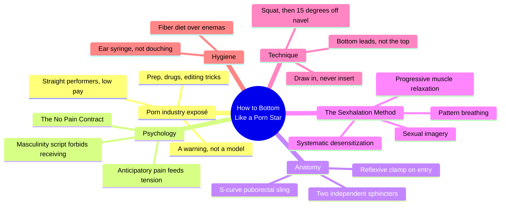
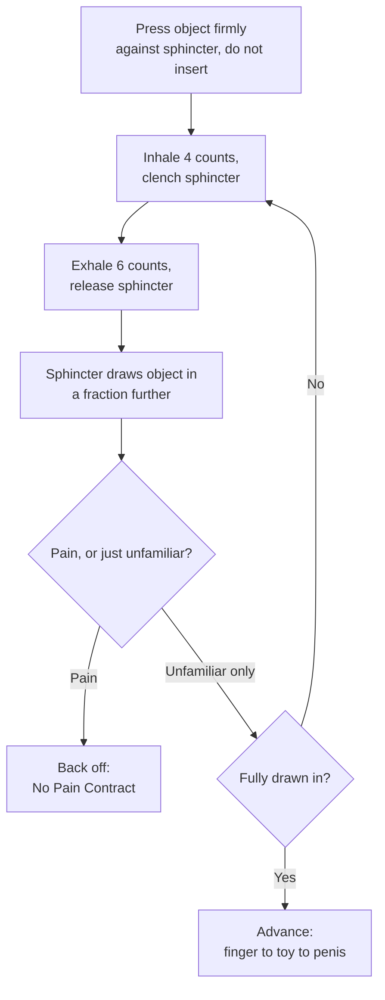
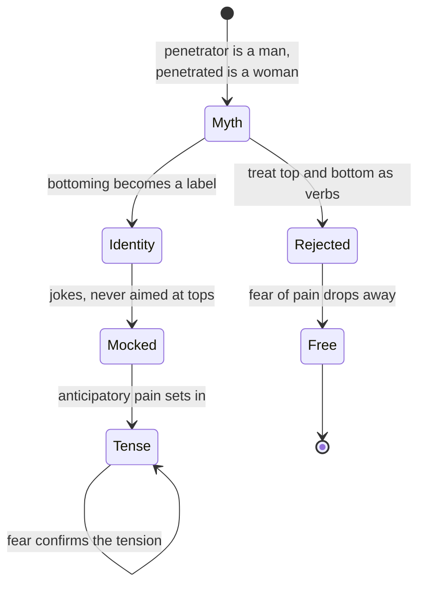
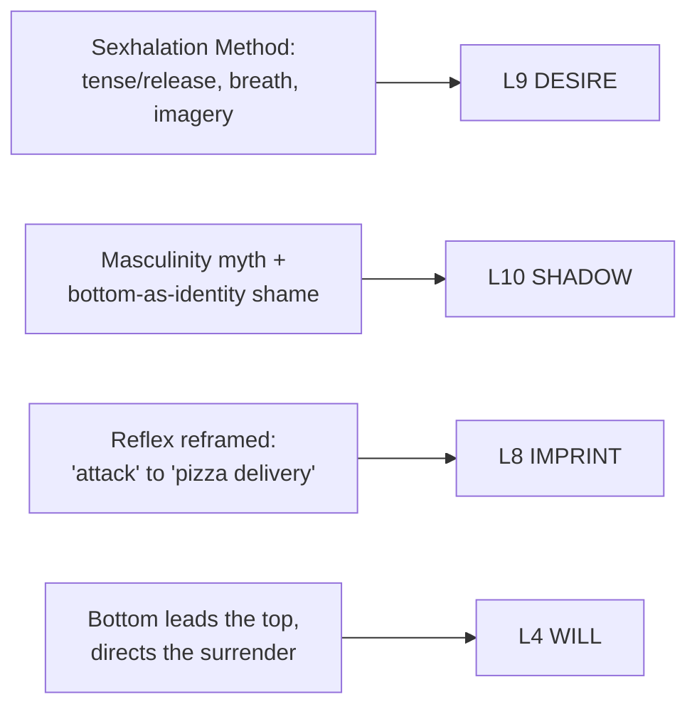

# 🧬 MSX.25 — How to Bottom Like a Porn Star — Miller (2014)
### Knowledge Entry — Distill

A self-published, advice-column-voiced guide that locates the pain of anal sex in three fixable anatomical points, teaches a named breath-and-tension technique to relax around them, and opens with an extended, anecdotal look inside a porn shoot that doubles as unrelated but useful backstage material.

## TABLE OF CONTENTS
- [Core Thesis](#1-core-thesis)
- [Mind Models](#2-mind-models)
- [Framework](#3-framework--structure)
- [Key Concepts](#4-key-concepts)
- [Heuristics](#5-heuristics--decision-rules)
- [Invariants](#6-invariants)
- [Pitfalls](#7-pitfalls--myths)
- [Application](#8-application)
- [Cross-References](#9-cross-references)
- [Provenance](#10-provenance--confidence)

---

## 1 · CORE THESIS

Pain in anal sex comes from three fixable points, a tensed sphincter, an angled rectal S-curve, and a reflexive clamp-down, not from size mismatch. A breath-paced desensitization technique ("draw in, don't insert") removes all three; the deeper obstacle is a masculinity script that shames the wish to receive at all.

---

## 2 · MIND MODELS

*Required. Minimum two diagrams, maximum five.*

**Diagram 1 — the whole argument.**
Caption: *six working parts; the porn industry supplies the hook and the cautionary tale, not the method, everything actually useful sits in the psychology, anatomy, and technique branches.*

**Diagram 2 — the central mechanism (the Sexhalation cycle).**
Caption: *one repeating loop does all the work, tense on the inhale, release on the exhale, let the sphincter draw the object in a fraction further, gated the entire time by a single pain check.*

**Diagram 3 — the masculinity-shame mechanism, as a state change.**
Caption: *the myth manufactures the fear before any body is involved; the exit isn't proving masculinity, it's refusing the myth's premise that a sex act carries a gender.*

**Diagram 4 — mapped onto the Command's 12-layer character stack.**
Caption: *four mechanisms, four layers; the WILL mapping is this book's most distinctive claim among its siblings, control as the precondition for surrender, not its opposite.*

---

## 3 · FRAMEWORK / STRUCTURE

Ten chapters run in four movements, framed throughout by the author's syndicated-advice-column voice (comic, profane, unreliable-narrator by design):

| Movement | Chapters | Job |
|---|---|---|
| Hook and warning | 1 (plus scattered "Hey, Woody!" drug Q&A) | A behind-the-scenes look at a porn shoot, then an extended, digressive argument that porn-industry pain management (drugs, ice, numbing cream) is exactly what not to copy |
| Psychology | 2 | Names the masculinity myth that blocks bottoming and introduces the "No Pain Contract" as its antidote |
| Anatomy and method | 3–5 | The two sphincters, the S-curve, reflexive contraction, then the Sexhalation Method built from four pillars to address all three |
| Hygiene, position, and walkthrough | 6–10 | Fiber diet and the ear syringe (not enemas), squatting and the 15-degree angle of entry, then a full narrative walkthrough (Adam and Steve) and a closing recap |

The book's own hinge is Chapter Five: everything before it argues why drugs, numbing cream, and ice are the wrong answer to pain; everything after it is the Sexhalation Method built to be the right one. Chapter One's porn-shoot material (diet prep, drug use rates, straight performers, editing tricks, pay scale, post-shoot Epsom-salt baths) never resurfaces as technique. It stands alone as scene-accurate texture for a porn-industry setting, separate from the book's actual argument about how to bottom.

---

## 4 · KEY CONCEPTS

| Concept | What it is | Why it matters |
|---|---|---|
| **The No Pain Contract** | A mental commitment to never proceed through pain, no matter how little or how much a partner encourages it | Converts "anticipatory pain" (tension caused by expecting to hurt) into "anticipatory pleasure"; the single biggest lever the book pulls before any technique starts |
| **The two sphincters** | An external sphincter under conscious control, an internal one that is not, governed by the autonomic nervous system like a heartbeat | Explains why "just relax" fails: the muscle that most needs to relax cannot be commanded, only coaxed into releasing on its own |
| **The S-curve / puborectal sling** | A muscular sling pulls the lower rectum toward the navel, creating an S-shape; an object entering at the wrong angle hits the rectal wall near-perpendicularly | The book's second, distinct pain point, separate from sphincter tension; explains why angle and position matter as much as relaxation |
| **Draw in, don't insert** | Pressing an object against the anus without pushing, then letting the sphincter relax onto it during a paced exhale | The book's core physical instruction: relaxation creates a small "vacuum" that pulls the object in, rather than force pushing past resistance |
| **The Sexhalation Method** | Four combined pillars, systematic desensitization, pattern breathing (inhale 4, exhale 6), progressive muscle relaxation, sexual imagery | The book's named, teachable technique; distinguishes tensing-then-releasing (more effective) from just trying to relax cold |
| **The 15-degree angle of entry** | Guiding penetration about 15 degrees away from the navel rather than straight in | Keeps the entering object roughly parallel to the rectal wall instead of perpendicular to it, avoiding the S-curve's sharpest point |
| **The bottom takes control** | The receiving partner, not the top, should choose position, guide the angle, and set the pace, especially the first several times | The top cannot feel the receiver's anatomy from outside; ceding control to him is framed as the single most common cause of unnecessary pain |
| **Pain versus unfamiliarity** | A trained distinction between a genuinely new sensation (stay, let it become familiar) and actual pain (stop, back off) | Prevents both premature stopping (mistaking novelty for injury) and the opposite error (pushing through real pain because "it's supposed to feel weird") |
| **The Ick Factor and fiber** | The rectum stores nothing; residue is a diet problem, not an anatomy problem, solved by 30-40 grams of daily fiber, not by hosing the rectum out | Reframes cleanliness anxiety as solvable through diet rather than through medically risky flushing |
| **The porn industry as anti-model** | Extensive detail on drug use (crystal, ecstasy, poppers, GHB), aggressive douching (Shower Shot kits), and numbing cream, presented as common practice and explicitly rejected | Doubles as accurate genre material for writing a porn-shoot scene, and as the book's own contrast case: mask the pain versus remove its cause |

---

## 5 · HEURISTICS & DECISION RULES

| Situation | Do this | Not this |
|---|---|---|
| An object is pressed against the anus | Press firmly, pause, then relax onto it on the exhale | Push or insert against a still-tensed sphincter |
| Deciding what position to try first | Squat, or any position pulling the knees toward the chest, to straighten the S-curve | Lie flat on your back or stand, where the S-curve is sharpest |
| Guiding penetration | Angle roughly 15 degrees away from the navel | Aim straight in toward the navel, hitting the rectal wall near-perpendicularly |
| A sensation feels strange | Ask "is this pain or just unfamiliar?"; if unfamiliar, stay and let it settle | Assume all new sensation is pain and stop, or push through it assuming it must be pain and therefore ignorable |
| First few times with a new partner | The receiving partner sets position, pace, and depth; the top follows | Let the top "take charge" because that fits the fantasy |
| Worried about cleanliness | Raise dietary fiber to 30-40 grams a day; use a small ear syringe if still concerned | Reach for an enema or a douche kit as routine maintenance |
| Feeling the urge to defecate mid-penetration | Recognize it as a stretch-receptor false alarm and wait a few seconds for it to pass | Panic, stop the encounter, or assume something has gone wrong |
| Wanting to eliminate pain fast | Slow the pace further; go slower than feels necessary | Use poppers, numbing cream, ice, or other substances to mask sensation |
| A partner says "just relax" | Recognize this as unhelpful and use a structured technique (breath count, tense-then-release) instead | Try to will the internal sphincter to relax through willpower alone |
| Judging whether bottoming fits your masculinity | Treat "top" and "bottom" as verbs describing an act, not identities that define you | Internalize jokes or mockery about "being a bottom" as a verdict on your character |

---

## 6 · INVARIANTS

1. **Pain has three separable sources: sphincter tension, S-curve angle, and reflexive contraction.** Each requires its own fix; solving one does not solve the others.
2. **The internal sphincter and puborectal sling do not respond to conscious command.** Like a heartbeat, they are autonomic; the only lever is indirect, patience combined with a paced technique, not willpower.
3. **Relaxation that follows deliberate tension is deeper than relaxation attempted cold.** Tensing a muscle first, then releasing it, produces a more complete release than trying to relax directly.
4. **An object relaxed onto meets less resistance than an object inserted.** Forceful insertion tightens surrounding muscle; passive drawing-in, paced to an exhale, does not trigger the same clamp.
5. **A body reflexively contracts around anything newly inserted, regardless of relaxation or angle.** This initial clamp is protective and temporary; going slowly is what lets it pass.
6. **Masking pain with drugs or numbing agents removes the warning signal without removing its cause.** The underlying tension and angle problem remains, and the risk of tissue damage or infection increases because it can no longer be felt.
7. **The rectum does not store feces; residue is a diet variable, not a fixed anatomical fact.** Adequate fiber intake, not flushing, is what determines cleanliness.
8. **The masculinity script that forbids receiving is cultural, not anatomical.** It is enforced through mockery of bottoms and near-total silence about tops, a one-directional social penalty with no basis in the act itself.

---

## 7 · PITFALLS / MYTHS

- Using recreational drugs, poppers, or numbing cream to tolerate pain rather than removing its cause; masks the injury signal without preventing the injury.
- Treating porn-industry practice (drugs to stay hard or stay open, aggressive high-pressure douching, ice as a numbing agent) as a technique model rather than a cautionary contrast.
- Letting the top "take charge" during early attempts because it fits the fantasy, when he cannot feel the receiver's anatomy and is statistically likely to go too fast, too hard, or at the wrong angle.
- Treating any new or unfamiliar sensation as proof of pain or of doing something wrong, rather than distinguishing unfamiliarity from actual pain.
- Assuming a straight, missionary-position, ninety-degree approach is neutral; it is the position least likely to straighten the S-curve.
- Relying on enemas or frequent douching for cleanliness; both strip protective rectal mucus, raise infection risk, and can create a dependency on flushing to have a bowel movement at all.
- Believing bottoming makes a man less masculine, or that this fear should be dealt with by disguising or suppressing the desire rather than by rejecting the premise.
- Confusing an unaroused, uncooperative response to prostate stimulation with something being wrong; response varies by individual and by arousal state, not by technique failure alone.

---

## 8 · APPLICATION

- **Spine level:** L5
- **12-layer character stack:** L9 DESIRE (primary, sexual imagery and anticipatory pleasure as active fuel), L10 SHADOW (primary, the "bottoming makes you a woman" myth enforced by mockery), L8 IMPRINT (supporting, reflexive sensations relearned as safe through repetition), L4 WILL (primary, the paradox of controlling one's own surrender)
- **plot_systems:** none directly; Chapter One's porn-shoot detail (prep, drugs, straight performers, editing tricks, pay, aftercare) is reusable setting texture for a scene set on a porn shoot, independent of the book's bottoming method
- **Setting:** none beyond the porn-industry backstage material noted above

This book's sharpest contribution is the L4 WILL paradox, "controlling your surrender", as a concrete mechanical fact rather than an abstract claim: the receiving partner must actively direct position, pace, and angle to safely inhabit a fantasy of being taken. That is a usable beat for any character learning to receive in any register: competence precedes surrender, not the reverse. The masculinity-shame mechanism (Diagram 3) is thinner than MSX.23's Act Like a Man Box but gives a plainer, more colloquial version, useful for a character whose internal voice runs on locker-room mockery rather than a named checklist. The Sexhalation Method (Diagram 2) is a good template for any scene of negotiated, paced trust-building, tense, release, check for pain, advance, repeat, well beyond its literal context.

---

## 9 · CROSS-REFERENCES

| Related entry | Relation |
|---|---|
| [[🧬 MSX.14 — The New Bottoming Book — Easton & Hardy (2001)]] | Agrees that the bottom, not the top, must run the encounter, echoing MSX.14's "full-power bottom" reframe, and that receiving requires active self-knowledge rather than passivity. Weaker on everything else MSX.14 builds a philosophy around: no negotiation framework or Yes/No/Maybe tool, no scene-space/real-world-space boundary, no aftercare concept, no engagement with power-exchange. This book's "take control" is purely mechanical (pace, angle, position); MSX.14's is ethical and psychological (consent as ongoing collaboration, power-with versus power-over). Where MSX.14 treats bottoming as an identity worth defending against gatekeeping, this book treats "bottom" as a verb and stops there. |
| [[🧬 MSX.23 — The Ultimate Guide to Prostate Pleasure — Glickman & Emirzian (2013)]] | Agrees closely on two points: a masculinity-policing myth (mockery of "bottoms" here, a three-insult Box there) as the real obstacle ahead of anatomy, and a rewiring mechanic where an unfamiliar sensation must be relearned through repetition as safe rather than threat. Weaker on sourcing throughout: no nerve or gland anatomy to match MSX.23's autonomic-plexus account, no engagement with orgasm/ejaculation separability beyond a passing mention, and no survey data, this book's claims rest on anonymous porn-industry anecdotes rather than MSX.23's two surveys. MSX.23 treats indifference to prostate stimulation as neutral variation; this book leans slightly more dismissive of it ("shoulder-shrugging"). |
| [[🧬 MSX.17 — Mating in Captivity — Perel (2006)]] | Perel's claim that eroticism requires a "bounded space" where ordinary rules (fairness, control, safety) are suspended is the unstated frame under this book's own "controlling your surrender" paradox; the Sexhalation Method's use of sexual imagery as a required pillar, not decoration, is a small, concrete instance of Perel's argument that desire needs active imaginative fuel, not just physical technique. |

---

## 10 · PROVENANCE & CONFIDENCE

Full-text extraction (plain text, no native page numbers; the page count above is estimated from word count at roughly 300 words per page). Read in full, front to back: all ten chapters plus the front-matter "Hey, Woody!" drug-advice column material and the closing author biography. Confidence is medium, not high: the book is self-published and uncredentialed in its physiological claims (no citations, unlike MSX.23's sourced nerve and orgasm material), and its central evidence, the "porn star interviews," is anonymous and unverifiable by design. Its comic, deliberately unreliable-narrator voice (jokes about theft from an overdosed friend, an author-bio anecdote about a veterinarian who slept with his patients) is a genre choice, not a data problem, but it lowers this source's standing as a clinical reference relative to its siblings. Treat the anatomical claims (two sphincters, the S-curve, the vacuum effect of relaxation) as plausible alongside MSX.14 and MSX.23's more careful accounts, and treat the Sexhalation Method itself as this book's genuine, distinct contribution regardless of the surrounding voice.

The `feeds:` keying is this distill's own synthesis against the 12-layer character stack, following the pattern set by MSX.17 and MSX.23, not read from a single canonical layer-definition document; treat the layer numbers as provisional pending a cross-check against the SSOT if one surfaces.

## META
- Template: BVX-LEARN-v4.0
- Source classification: full-text book (self-published ebook), complete read, medium confidence (anecdotal/uncredentialed source, plausible claims)
- Created / Updated: 2026-09-29
