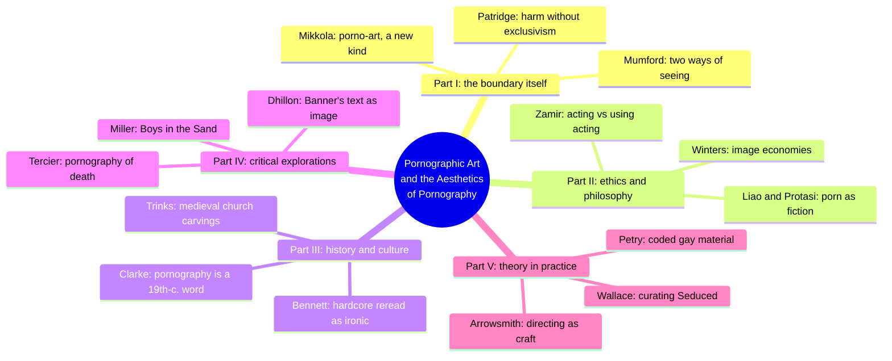
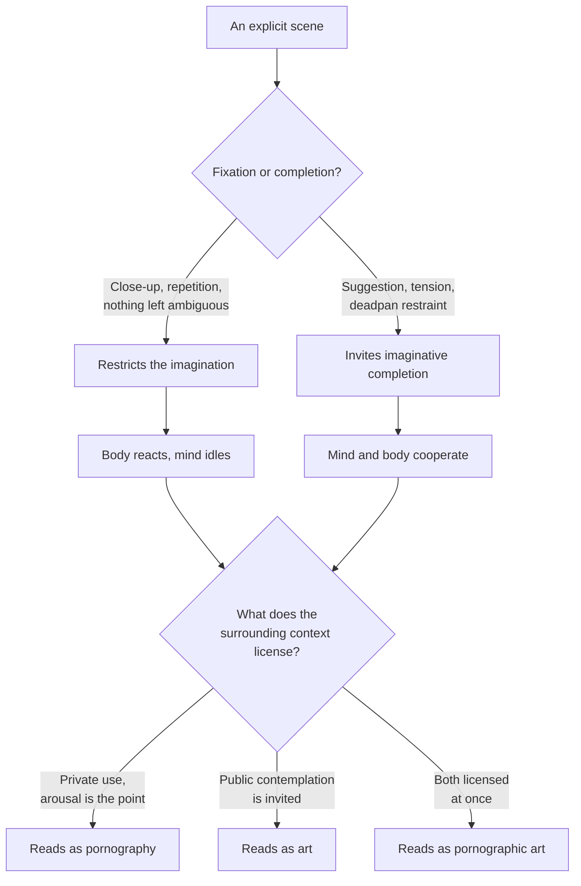
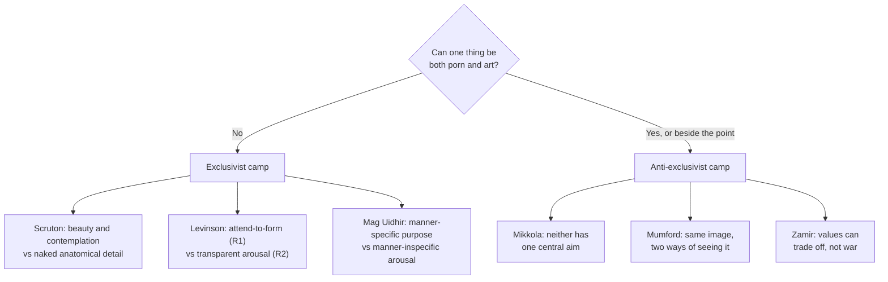
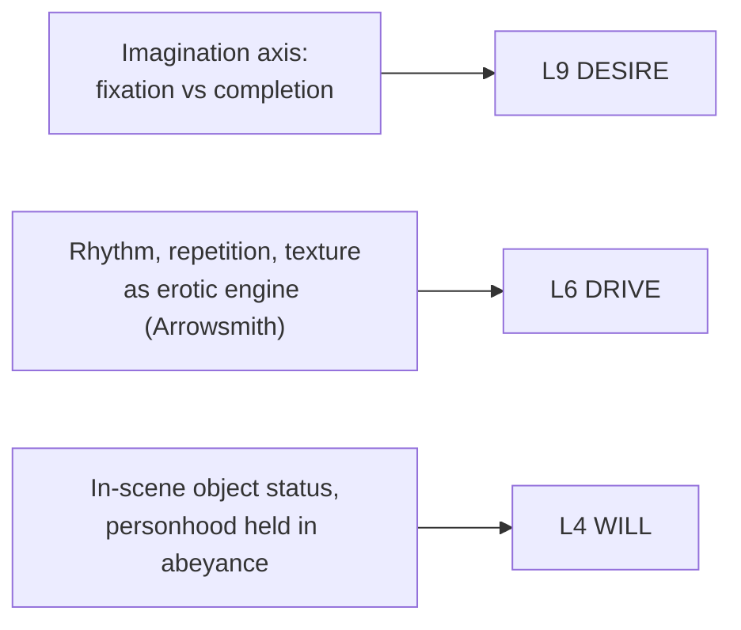

# 🧬 MSX.26 — Pornographic Art and the Aesthetics of Pornography — Maes (2013)
### Knowledge Entry — Distill

Fifteen philosophers, art historians, and practising pornographers test whether "pornographic art" is a contradiction in terms; the collection's real payload is a set of working distinctions for what makes an explicit representation read as art, as porn, or as both at once.

## TABLE OF CONTENTS
- [Core Thesis](#1-core-thesis)
- [Mind Models](#2-mind-models)
- [Framework](#3-framework--structure)
- [Key Concepts](#4-key-concepts)
- [Heuristics](#5-heuristics--decision-rules)
- [Invariants](#6-invariants)
- [Pitfalls](#7-pitfalls--myths)
- [Application](#8-application)
- [Cross-References](#9-cross-references)
- [Provenance](#10-provenance--confidence)

---

## 1 · CORE THESIS

The porn/art divide collapses once the assumption that pornography's essential aim is arousal and art's is contemplation is dropped. What actually decides whether an explicit scene reads as art, porn, or both is whether it fixes attention through close-up and repetition or leaves room for imaginative completion, and what context licenses the audience to do with it.

---

## 2 · MIND MODELS

*Required. Minimum two diagrams, maximum five.*

**Diagram 1 — the whole argument.**
Caption: *fifteen essays sort into five tests of one question — does a sharp dividing line between art and pornography survive contact with actual cases?*

**Diagram 2 — the central mechanism (the imagination axis).**
Caption: *explicitness alone decides nothing; what a scene fixes versus leaves open, and what the surrounding context licenses, decides whether it reads as porn, art, or both at once.*

**Diagram 3 — the exclusivist standoff, mapped.**
Caption: *three unrelated exclusivist arguments (beauty, attention, manner-specificity) converge on the same ban; every rebuttal in the book attacks the shared premise that pornography has one essential aim, not the arguments' logic.*

**Diagram 4 — mapped onto the Command's 12-layer character stack.**
Caption: *three book mechanisms land on three distinct layers; the imagination axis is the primary lever, the other two are craft-adjacent supports.*

---

## 3 · FRAMEWORK / STRUCTURE

Fifteen essays in five parts, each testing the same question from a different discipline:

| Part | Contributors | Job |
|---|---|---|
| I. Art or porn: clear division or false dilemma? | Mikkola, Patridge, Mumford | Test whether a sharp dividing line survives scrutiny |
| II. Aesthetics of pornography: philosophical and ethical | Zamir, Liao & Protasi, Winters | Ask what pornography does to performers, viewers, and fiction's persuasive power |
| III. Aesthetics of pornography: historical and cultural | Clarke, Trinks, Bennett | Show "pornography" is itself a 19th-century category, read backward onto older explicit material |
| IV. Pornographic art: critical explorations | Miller, Tercier, Dhillon | Close-read specific works that already sit on the boundary |
| V. Pornographic art: theory in practice | Petry, Wallace, Arrowsmith | Hand the argument to people who make or curate the material |

Editor Hans Maes's introduction is the load-bearing chapter: it traces how modern aesthetics (Shaftesbury, Kant, Schopenhauer, Bell) walled off sensual pleasure from aesthetic pleasure, how 20th-century thinkers (Nietzsche, Nehamas, Shusterman) tore that wall down for *erotic* art, and how the same suspicion simply relocated onto *pornographic* art (Scruton, Levinson, Mag Uidhir). Parts I–V are the book's attempt to see whether that relocated wall holds.

---

## 4 · KEY CONCEPTS

| Concept | What it is | Why it matters |
|---|---|---|
| **Porno-art** (Mikkola) | A proposed new artefactual kind, built on Thomasson's intention-based account of artefacts; requires makers who share a concept of porno-art itself — still being invented, not yet fully real | Combining pornographic and artistic intent doesn't land in the overlap of two existing categories; it can generate a third kind needing its own criteria |
| **R1/R2 exclusivism** (Levinson) | Art aims at reception R1 (attention to form, medium, manner); pornography aims at R2 (transparent arousal and release); declared incompatible by definition | The single most cited argument against pornographic art; most of the book tests whether R1 and R2 are really that separable |
| **Manner-specificity** (Mag Uidhir) | Art's purposes, if it has any, must be manner-specific; pornography's arousal purpose is manner-inspecific; a purpose can't be both at once | A leaner, beauty-independent version of the same ban |
| **Ways of seeing** (Mumford) | The same image can be literally seen two ways — pornographically or aesthetically — like a Necker cube flip; context licenses each way, not the image's intrinsic properties | Relocates the porn/art question onto the viewer's (or writer's) mode of engagement — the most directly actionable idea here for a writer |
| **Pornographic value vs. aesthetic value** (Zamir) | Two value sets that can conflict scene to scene: better acting can undercut arousal, more arousal can undercut craft; porn "uses" acting instrumentally | Names the actual trade-off a writer manages moment to moment, not an all-or-nothing verdict |
| **Explicitness as imagination-restriction** (Zamir, Mumford) | Pornographic explicitness is fixation and repetition that "leave nothing for the imagination"; erotica and art invite imaginative completion instead | A craft lever independent of how graphic a scene is — two equally explicit scenes can sit on opposite sides of this line |
| **Image economies** (Winters) | Each pictorial practice has its own conventions for the viewer's relation to the image: public contemplation of the surface (painting) vs. masking out the medium to reach the act (porn) | Technique around explicit content, not just the content, sets how it reads; Cecily Brown's brushwork "thwarts the interest of the prurient" while depicting explicit sex |
| **Frenzy of the visible + deadpan flatness** (Sontag, via Arrowsmith) | Pornography wants to show the "truth" of bodily pleasure exhaustively, yet its characters are conventionally flat; the flatness clears room for the audience's own feeling | Restraint in interiority can intensify rather than dilute a scene; over-narrating feeling crowds the reader out |
| **Bounded objectification** (Zamir, quoting Kent & Morreau) | A character's personhood is "held in abeyance" inside one scene so fantasy runs without judgment; scene-scoped, not a verdict on the whole person | Permission, and a limit, for writing a character as desired-object in one scene without collapsing their characterization into it |
| **The unlovely** (Winters, via Coetzee's *Disgrace*) | Pornography, like the novel's prostitution analogy, can let people denied sensual regard have appetites addressed without burdening anyone else | An ethical frame for explicit material that is neither pure exploitation nor high art |

---

## 5 · HEURISTICS & DECISION RULES

| Situation | Do this | Not this |
|---|---|---|
| Writing a sex scene you want to read as art, not just description | Build tension and suggestion; leave some completion to the reader's imagination | Fixate on mechanical, anatomical close-up as the whole scene |
| Worried explicitness disqualifies the scene from being "serious" | Judge it by whether mind and body cooperate — plot, character, and stakes carrying the arousal | Assume explicitness alone settles the question either way |
| A character's desire or shame needs to feel earned, not generic | Use rhythm, repetition, texture, and point of view as the erotic engine | Rely solely on describing body parts and acts |
| A scene needs emotional truth without collapsing the arousal | Keep interiority understated; let restraint make room for the reader's own response | Over-narrate the character's feelings and crowd out reader identification |
| Deciding whether a scene "counts" as art or porn | Ask what the scene's own economy asks of the reader — contemplation, or private use, or both | Assume a single feature (nudity, an act, a word count) settles it |
| A character is written to be sexually objectified within a scene | Treat it as scene-bounded craft: object status is local to that scene | Let the objectifying frame bleed into how the narrative treats them elsewhere |
| Justifying why a scene needs to be explicit at all | Ask whether cutting the explicit content would cost the story something (stakes, character truth, the payoff of built tension) | Add explicitness as decoration unconnected to any built tension |
| Choosing between arousing and meaningful | Treat them as two values in tension to be balanced per scene, not a binary choice | Assume increasing one always increases or destroys the other |

---

## 6 · INVARIANTS

1. **No representation is essentially pornographic or artistic by content alone.** Classification depends on intention, use, and the context surrounding the representation, not on any single intrinsic feature (nudity, explicitness, an act depicted).
2. **Sexual arousal and aesthetic engagement are not automatically opposed.** Mind and body can cooperate within a single response; the "exclusivist" ban on this is a contested philosophical claim, not a settled fact.
3. **Fixation narrows; suggestion invites.** Close-up, repetition, and closed ambiguity restrict imaginative engagement; tension, suggestion, and restraint invite it. This is a craft axis, not a moral one.
4. **A performer's or character's in-scene object status is bounded to that scene.** It need not, and structurally should not, define their personhood across the rest of the narrative.
5. **Pornographic value and aesthetic/craft value can trade off.** Pushing one sometimes costs the other, but neither guarantees harm or help to the other in general — the relationship is contextual, not lawlike.
6. **Emotional flatness or restraint in an explicit scene is not automatically a craft failure.** It can be the exact mechanism that leaves room for the audience's own feeling to complete the scene.
7. **A way of seeing can be chosen or refused.** The same scene can be read pornographically or aesthetically depending on the reader's mode of attention, not only on the object itself.

---

## 7 · PITFALLS / MYTHS

- Assuming sexual arousal and aesthetic seriousness are mutually exclusive (the exclusivist position argued by Scruton, Levinson, and Mag Uidhir, and contested throughout the book).
- Treating explicitness itself as the marker of low seriousness (Dutton's "sex is too simple" claim, cited and rejected in the introduction).
- Confusing "the nude" (idealized, art-sanctioned) with "the naked" (exposed, degraded) as an intrinsic property of an image rather than a framing convention that can be argued either way.
- Piling on maximal anatomical detail and mistaking that for intensity — Sontag's point, borne out by Arrowsmith's practice, is that too much information can flatten a scene rather than charge it.
- Assuming a scene must choose between arousing and meaningful; Winters's Cecily Brown example and Mumford's *Autobiography of a Flea* example show craft and heat can coexist in the same work.
- Believing more character interiority always strengthens an explicit scene — the opposite can be true, since too much narrated feeling crowds out the reader's own participation.
- Reading older explicit material through the modern category of "pornography" — Clarke and Trinks show the term and its arousal-centred meaning are 19th-century inventions; ancient and medieval sexual imagery served apotropaic, religious, comic, or status functions that don't map onto that later concept.

---

## 8 · APPLICATION

- **Spine level:** L5
- **12-layer character stack:** L9 DESIRE (primary — the imagination axis is the actual render-lever for any scene of desire or arousal), L6 DRIVE (supporting — rhythm, repetition, and texture as an erotic engine independent of explicit content), L4 WILL (contextual — bounded, scene-scoped objectification as a negotiated surrender/control move)
- **plot_systems:** contextual candidate once a scene-pacing system opens — the built tension → release structure (suggestion, build, payoff) that the book keeps rediscovering across painting, film, and prose is itself a transferable mini-plot-system for pacing any explicit scene
- **Setting:** none

For a writer rendering explicit content, this book's gift is levers, not a verdict. The imagination axis (Diagram 2) says explicitness is not the enemy of art; fixation is — a scene can be graphic and still invite completion if it uses suggestion and built tension rather than pure inventory. Sontag's deadpan-flatness point, via Arrowsmith's own practice, permits understatement in a sex scene: restraint can be what lets the reader's own feeling in, not a failure to characterize. Bounded objectification (Zamir, Kent & Morreau) answers how a character can be written as desired-object within one scene without that scene defining them elsewhere. And the book's insistence that context, not content, decides how a scene reads (Winters, Mumford) is a reminder that framing — what leads in, what follows — does real work in whether a scene lands as gratuitous, as art, or as both.

---

## 9 · CROSS-REFERENCES

| Related entry | Relation |
|---|---|
| [[🧬 MSX.17 — Mating in Captivity — Perel (2006)]] | Perel's "bounded space of eroticism" (power dynamics that would be oppressive outside sex become pleasurable inside it) is the psychological-relationship-side twin of this book's bounded-objectification concept; one is about couples, the other about the viewer/reader's frame |
| [[🧬 MSX.18 — Porn Work — Berg (2021)]] | Sibling text on the performer's side of the same industry Zamir analyzes philosophically here; Berg supplies the labor-conditions ground truth that Zamir's "acting vs. using acting" distinction argues from in the abstract |
| [[🧬 CRE.01 — Bloom's Literary Themes Human Sexuality — Bloom & Hobby (2009)]] | Literary-craft sibling on rendering sexuality in prose; this book supplies the philosophical vocabulary (imagination axis, image economies, bounded objectification) that a craft-focused source like Bloom's collection applies to specific texts |

---

## 10 · PROVENANCE & CONFIDENCE

Full-text extraction (pdftotext) of the complete Palgrave Macmillan 2013 edition, front matter through index (roughly 300 pages of body text). Read in depth from the chapters' own text: the Introduction (Hans Maes) in full, including its own chapter-by-chapter synopsis of all fifteen essays; Mari Mikkola's "Pornography, Art and Porno-Art" (the artefactual-kind argument and the porno-art proposal, in full); Stephen Mumford's "A Pornographic Way of Seeing" (institutional theory, ways of seeing, the erotica/pornography split) through its central argument; Tzachi Zamir's "Pornography and Acting" (the acting/using-acting distinction and the pornographic-value/aesthetic-value trade-off) through its central argument; Edward Winters's "Image Economies and the Erotic Life of the Unlovely" (the Cecily Brown reading and the "unlovely" concept) in its opening movement; Anna Arrowsmith's "My Pornographic Development" (practitioner craft: rhythm and texture as erotic engine, the Sontag deadpan-flatness argument, and the functional reading of pornographic tropes) substantially in full.

Known only through Maes's own introduction-level synopsis, not read from the chapters' own text: Patridge (Ch. 2), Liao & Protasi (Ch. 5), Clarke (Ch. 7), Trinks (Ch. 8), Bennett (Ch. 9), Miller (Ch. 10), Tercier (Ch. 11), Dhillon (Ch. 12), Petry (Ch. 13), and Wallace (Ch. 14). Their positions in the Framework and Key Concepts sections are Maes's own summaries, treated as reliable secondary description rather than first-hand extraction; Patridge's harm-based non-exclusivism and Bennett's account of academic pornography-rehabilitation are the likeliest candidates for a deeper pass later.

## META
- Template: BVX-LEARN-v4.0
- Source classification: full-text essay collection, deep extraction on the Introduction plus 5 of 15 chapters, synopsis-level coverage (via the editor's own introduction) on the remaining 10
- Created / Updated: 2026-09-29
