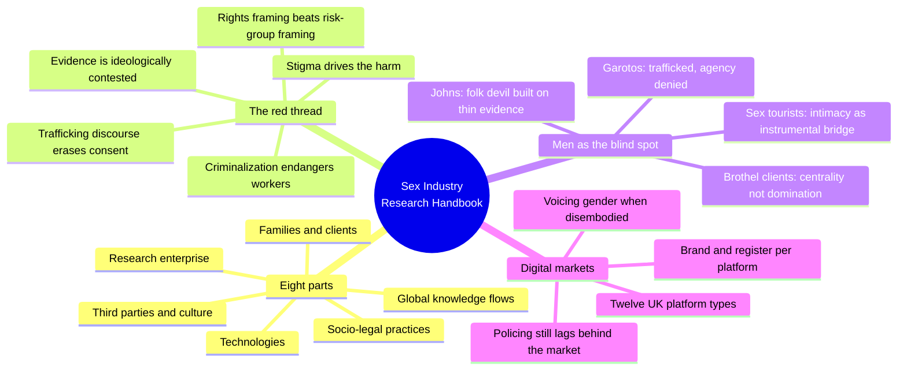
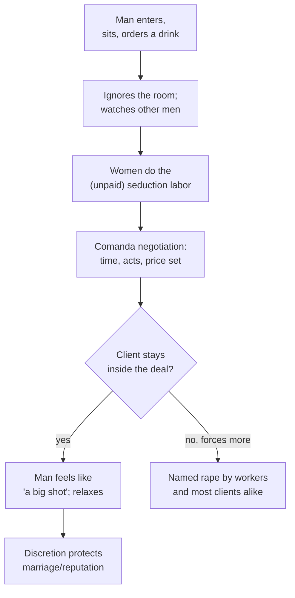
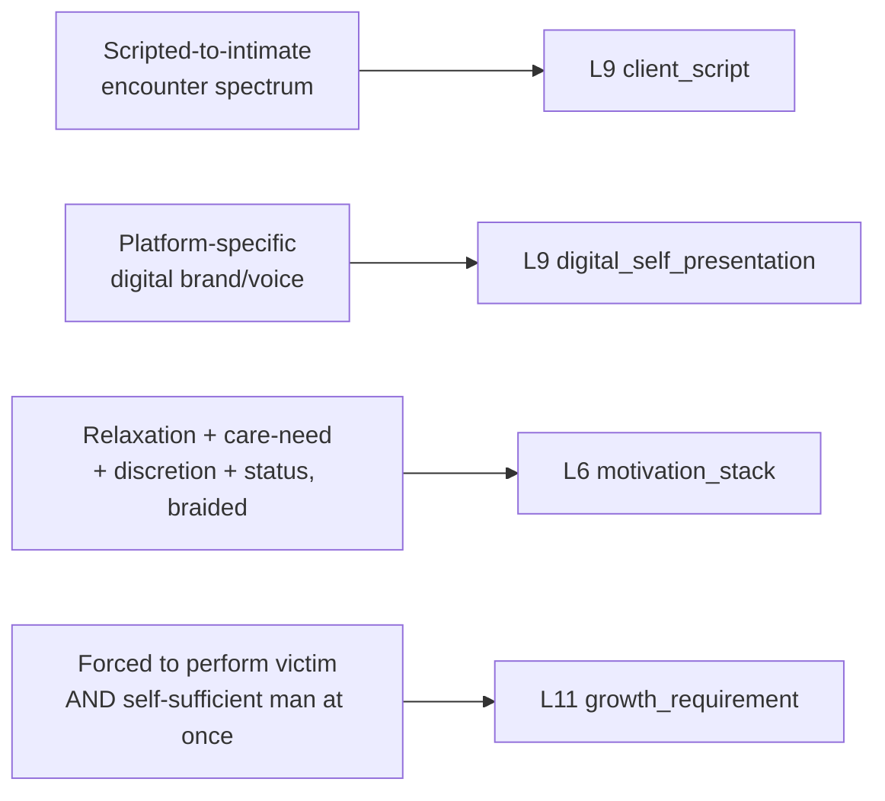

# 🧬 MSX.27 — Routledge International Handbook of Sex Industry Research — Dewey, Crowhurst & Izugbara (2018)
### Knowledge Entry — Distill

A 57-chapter academic handbook (Routledge) uniting researchers, sex workers, and activists from 28 countries around eight themes — research methods, law, global knowledge flows, families, clients, third parties, cultural representations, technology — read here for what it says about men in the sex industry, the clients of sex workers, and digital sex markets.

## TABLE OF CONTENTS
- [Core Thesis](#1-core-thesis)
- [Mind Models](#2-mind-models)
- [Framework](#3-framework--structure)
- [Key Concepts](#4-key-concepts)
- [Heuristics](#5-heuristics--decision-rules)
- [Invariants](#6-invariants)
- [Pitfalls](#7-pitfalls--myths)
- [Application](#8-application)
- [Cross-References](#9-cross-references)
- [Provenance](#10-provenance--confidence)

---

## 1 · CORE THESIS

Sex industry research replaces the victimizer/victim binary with observed practice: brothel clients chase centrality and indifference, not domination; sex-tourists, phone-sex callers, and criminalized "johns" mostly seek negotiated intimacy, not conquest; trafficked men get forced into the same coercion-or-agency script imposed on women. Stigma and criminalization, not the exchange, generate the harm.

---

## 2 · MIND MODELS

*Required. Minimum two diagrams, maximum five.*

**Diagram 1 — the whole argument.**
Caption: *eight thematic sections converge on one editorial "red thread," and the chapters chosen for this distill keep surfacing the same erased figure — the man, as trafficked worker, ordinary client, or coded digital persona.*

**Diagram 2 — the central mechanism (the brothel encounter as inverted courting).**
Caption: *in Rio's brothels the normal pursuit script runs backward — women seduce, men wait to be chosen — and it is this reversal, not ownership of women's bodies, that men are paying to experience.*

**Diagram 3 — mapped onto the Command's character stack.**
Caption: *the four load-bearing findings pulled from this handbook each answer a different writer's question about a sex-work-adjacent man, and none substitutes for another.*

---

## 3 · FRAMEWORK / STRUCTURE

Eight parts, each opened by a short editorial introduction (Dewey, Crowhurst & Izugbara) that states the section's key themes, previews each chapter's argument, and names future research gaps: the research enterprise, socio-legal practices, global knowledge flows, families and intimate relationships, clients, third parties, cultural representations, and technologies. The editors' own frame, laid out in the Introduction and Chapter 2, is that sex industry research sits permanently between two poles — sex worker rights advocacy and neo-abolitionism — and that five findings nonetheless hold as a "red thread" across nearly all of it regardless of a researcher's politics:

| # | The red-thread finding |
|---|---|
| 1 | Stigma and marginalization, not the exchange itself, drive most negative outcomes for sex workers |
| 2 | Regulatory approach (criminalized, legal, decriminalized) directly shapes labor conditions and risk |
| 3 | Sex worker rights movements have shifted research away from a pure "risk group" framing |
| 4 | Sex-trafficking discourse now dominates policy and collapses voluntary sex workers into victims/criminals |
| 5 | "Evidence-based" policy is compromised because all sides can and do mobilize supporting evidence |

This distill drew specifically on Part V (Clients, chapters 31, 32, 34), Part III's Chapter 23 (a trafficked-men case study), Part IV's Chapter 30 (gay sex tourism), and Part VIII (Technologies, chapters 51, 52, 56) — the sections the brief named: men in the industry, clients, and digital markets.

---

## 4 · KEY CONCEPTS

| Concept | What it is | Why it matters |
|---|---|---|
| **The red thread (5 findings)** | The editors' claim that stigma, regulatory context, rights framing, trafficking discourse, and contested evidence recur across the whole contested field | Gives a writer a shared factual floor to build from even when characters or narrators hold opposed politics about sex work |
| **Hommo-sexualité / brothel centrality** | Blanchette & da Silva's Irigaray-derived argument (Ch. 32) that men in Rio's brothels are not there to objectify women but to be the temporary center of a woman's performed desire | Replaces "men buy domination" with "men buy a scripted reversal of normal courting," a far more specific and dramatizable want |
| **Bounded authenticity / girlfriend experience** | Bernstein's and Sanders' term (used across Ch. 30, 31, 34, 56) for paid intimacy that mixes real emotional content into a commercial frame without either side treating it as a contradiction | Kills the binary of "he's lying about caring" vs. "he's genuinely in love"; both operate at once, and the ratio can shift within one encounter |
| **The garoto's forced paradox** | Mitchell's account (Ch. 23) of Brazilian male migrant sex workers in Spain who must perform victimhood to avoid deportation while the state simultaneously requires "hegemonic masculine" self-sufficiency to be granted legitimacy | The clearest source example of a character built entirely out of an institution's contradictory demands rather than out of his own psychology |
| **Authenticity-seeking intimacy in sex tourism** | Yang's finding (Ch. 30) that gay Taiwanese tourists read "being taken to the money boy's hometown" as proof of real love, while for the Thai worker the same gesture carries no such weight | A single act, two incompatible readings, driven by which culture assigns it meaning — a portable device for any cross-cultural intimacy scene |
| **The john as folk devil / End Demand** | Mosley's account (Ch. 34) of a growing "Nordic model" campaign that criminalizes buying sex, built on an image of the client as predator that the chapter's own case studies (five named clients, one prosecutor transcript) contradict | Shows exactly how a policy narrative outruns its evidence, and dramatizes the human cost (an arrest, a public shaming, a suicide) when it does |
| **Power of the weak** | Cohen's concept, cited in Ch. 30: in transnational paid intimacy the ostensibly powerless local partner can reverse the power relation by managing the foreign client's need for authenticity | Prevents writing every cross-border sex-industry relationship as one-directional exploitation |
| **Voicing gender / "doing the woman"** | Selmi's account (Ch. 56) of phone-sex operators, including a male operator, who succeed by competently performing stereotyped gender markers rather than by expressing an authentic self | Recasts disembodied erotic labor as a citation skill (Butler's "citing gender norms"), not a fantasy free-for-all or a self-betrayal |
| **Twelve platform types (Beyond the Gaze, UK)** | Campbell et al.'s typology (Ch. 52) of the UK's online sex-work ecosystem: multi-service platforms, escort directories, personal websites, dating/hook-up apps used covertly, classified ads coded as "massage," and more | Converts "the internet" into a set of distinct, differently regulated markets a plot can specifically name and exploit or threaten |
| **Client demographic and motivational ordinariness** | Recurring finding across Ch. 31's literature review and Ch. 34's case studies: clients as a population resemble non-clients more than they resemble the "predator" stereotype; documented violence clusters in a small minority | The single most load-bearing corrective for writing any client character without reaching for either "monster" or "pathetic loner" as a default |

---

## 5 · HEURISTICS & DECISION RULES

| Situation | Do this | Not this |
|---|---|---|
| Writing a client in a brothel or paid-sex scene | Make him passive, indifferent to the room, and let a worker do the visible seduction labor; his fantasy is being pursued, not pursuing | Write him stalking, ogling, or forcing his way toward a woman as the default posture |
| Writing why a character pays for sex | Braid several motives at once — relaxation, discretion for a marriage, feeling important, a genuine wish for care or conversation | Pick one motive ("lonely," "violent," "can't get sex any other way") and treat it as the whole man |
| Writing a trafficked or coerced male sex worker | Force him into a real bind: perform helplessness for the state while the same state expects masculine self-sufficiency to be believed at all | Write him as either a straightforward victim or a straightforward free agent; the source case had neither available to him |
| Writing a cross-cultural sex-tourism or paid-intimacy relationship | Let the same gesture (a gift, a visit home, a shared meal) mean "serious relationship" to one party and "ordinary courtesy" to the other | Assume both parties read the relationship's stakes identically |
| Writing a criminalized client or a prosecution/"End Demand" plotline | Show the state needing to find coercion it cannot document, and let the public-shaming machinery (arrest before charge, media naming, job loss) outrun the actual evidence | Write the arrest as a clean, proportionate response to a documented crime |
| Writing disembodied or performed sex work (phone, cam, texting) | Show the worker actively, skillfully citing recognizable gender and body markers to make the client believe; that competence is the paid skill | Write it as either a low-stakes fantasy free space or as the worker's authentic self simply "coming through" |
| Writing a character's online sex-work business | Give him a specific platform (directory vs. personal site vs. covertly-used dating app) with its own register, audience, and rules, not a generic "the internet" | Treat every online sex-work presence as interchangeable |
| Writing a female client of a male sex worker or escort | Give her the field's own thin literature: distinct motivations (romance, therapeutic release, novelty), a stigma script gendered differently from a male buyer's, and comparatively low researched incidence of violence toward her | Recycle the male-client script wholesale onto a female buyer |

---

## 6 · INVARIANTS

1. **Stigma, not the exchange, is the field's own named cause of harm** — the editors' first "red thread" finding, repeated across nearly every section.
2. **Clients are demographically and motivationally unremarkable as a population**; documented violence and coercion cluster in a small, identifiable minority, not the median case.
3. **Paid intimacy runs on a scripted-to-spontaneous spectrum**, not a fixed setting; the same encounter can shift registers mid-scene.
4. **Negotiation, not the presence of money, defines consent inside a commercial sexual exchange**; moving beyond what was agreed is named rape by workers and clients alike, not treated as a gray area.
5. **Criminalizing the buyer does not eliminate the market**; it removes the tools (screening, advance negotiation online) that protect the seller, and concentrates remaining risk.
6. **Trafficking discourse requires a performance of pure victimhood** to be legally legible, which strips agency from anyone — especially a man — whose actual situation is partial coercion plus rational economic calculation.
7. **Digital markets multiply venue types faster than research or policing can track them**; a dozen distinct UK platform categories existed years before most police forces had a coherent online strategy.
8. **Gender performance under stigma is a trained, citable skill**, most visible when the body is absent (phone sex) and the performer must be doubly deliberate about it (as with the chapter's male phone operator).

---

## 7 · PITFALLS / MYTHS

- Reading brothel dynamics as straightforward "objectification" or "male domination" when the observed pattern (passive, indifferent men; actively seducing women) runs backward from that assumption.
- Building "End Demand" or client-criminalization plots on the unexamined premise that most buyers are predators; the chapter's own case studies and cited surveys consistently contradict it.
- Assuming men cannot be sex-trafficked, or writing a male trafficking victim as simply lying about coercion because he also made rational economic choices — both were true at once in the source case.
- Treating a sex-tourism "authentic intimacy" gesture as manipulation by definition; the direction of exploitation in transnational paid intimacy can run either way, and often surprises the party assumed to hold the power.
- Writing disembodied sex work (phone, text, cam) as either a harmless fantasy playground or as inherently more alienating than embodied work; the source finds it demands *more* deliberate gender-performance skill, not less investment.
- Treating "the internet" as one undifferentiated sex-work venue; the UK data names a dozen platform types with distinct business models, demographics, and legal exposure.
- Importing a single country's regulatory model (criminalize the buyer, legalize, decriminalize) as a universal template without tracking what it actually changed on the ground where it was tried.

---

## 8 · APPLICATION

- **Spine level:** [L5]
- **12-layer character stack:** L9 primary (`client_script`, `digital_self_presentation`); L6 supporting (`motivation_stack`); L11 primary (`growth_requirement`, specifically the garoto's forced victim/self-sufficient-man paradox)
- **plot_systems:** contextual candidate once plot systems open — the "End Demand" prosecution machinery (Ch. 34) is a ready-made external-pressure generator (an arrest, a shaming campaign, a lost job, escalating past the actual evidence); the UK's twelve-platform digital ecosystem (Ch. 52) supplies a menu of distinct, individually disruptable business models for any character running an online sex-work operation
- **Setting:** contextual — a setting's own criminalize/legalize/decriminalize policy axis (echoing MSX.19 §4) can be borrowed wholesale for any analogous stigmatized-labor economy; Rio's tolerated, "unofficially official" brothel districts and its one true red-light district (Vila Mimosa) are a ready venue model distinct from fully legal or fully criminalized alternatives

This handbook's chief transferable contribution is corrective: it replaces four stock figures — predator client, purely-victimized trafficked man, manipulative sex tourist, disembodied "fantasy" phone-sex encounter — with the field's own messier, observed versions. Ch. 23 (garotos) is the strongest source for a character forced to perform a state-mandated identity against his lived reality; Ch. 32 (brothels) is strongest for a client scene that isn't a predation script; Ch. 51-52 (technologies) is strongest for a specific, breakable online business rather than a vague digital backdrop.

---

## 9 · CROSS-REFERENCES

| Related entry | Relation |
|---|---|
| [[🧬 MSX.17 — Mating in Captivity — Perel (2006)]] | Perel's desire-versus-security tension in private relationships and this handbook's bounded-authenticity spectrum in paid ones both argue against reading intimacy as a single, fixed setting; read together for a fuller `client_script` |
| [[🧬 MSX.18 — Porn Work — Berg (2021)]] | Berg's "consent is not desire" and manufactured-feeling findings in porn work are the on-camera analogue of this handbook's brothel and phone-sex findings: paid intimacy is a trained performance that can still carry real feeling |
| [[🧬 MSX.19 — The Routledge Handbook of Male Sex Work — Scott, Grov & Minichiello (2021)]] | Direct companion volume: MSX.19's five-layer digital regulation model and bounded-authenticity spectrum are built from the same academic literature this handbook draws on, and its `client_script`/`digital_self_presentation` variables are reused here rather than reinvented |

---

## 10 · PROVENANCE & CONFIDENCE

Full text, pdftotext extraction of a 57-chapter, ~622-page academic handbook (Routledge; copyright page dated 2019, brief and library record cite 2018), read against the table of contents and the editors' own chapter-overview paragraphs rather than end to end, per the size ceiling and the brief's chapter priorities (men in the sex industry, clients, digital markets). Read in full: the Introduction and Ch. 2 ("Sex industry research: key theories, methods, and challenges"); Ch. 23 (garotos, Mitchell); Ch. 30 (gay sex tourism Bangkok, Yang); the Part V introduction and Ch. 31 ("Clients," Dewey/Crowhurst/Izugbara); Ch. 32 (brothels, Blanchette & da Silva); Ch. 34 (the john, Mosley); the Part VIII introduction and Ch. 51; Ch. 52 (UK digital sex work, Campbell et al.); and Ch. 56 (phone sex, Selmi). Sampled only via the editors' own chapter-overview paragraphs, not read in full: Ch. 33 (Australia), 35 (Nigeria), 36 (China), 53 (support-service tech), 54 (digital-age labor), 55 (India mobile phones), and the opening of Ch. 57 (the "whore gaze"). Not read: the bulk of Parts I, II, III (apart from Ch. 23), IV (apart from Ch. 30), VI, and VII.

The `feeds:` mapping reuses the L9 `client_script` and `digital_self_presentation` names introduced in [[MSX.19]] rather than inventing new ones, since both books draw on the same literature (Bernstein's bounded authenticity, Sanders' client studies); read the two distills' `feeds` as one continuous mechanism. The `growth_requirement` note is this distill's own synthesis of the garotos chapter's masculinity-under-contradiction argument.

## META
- Template: BVX-LEARN-v4.0, sexuality variant (BOLO 87/88, `brief.DISTILL.md` as changed by `brief.DISTILL.sex.md`)
- Source classification: full-text academic handbook, deep extraction on 8 of 57 chapters plus both editorial introductions used, partial extraction (editorial summary only) on 7 further chapters
- Created / Updated: 2026-09-29
