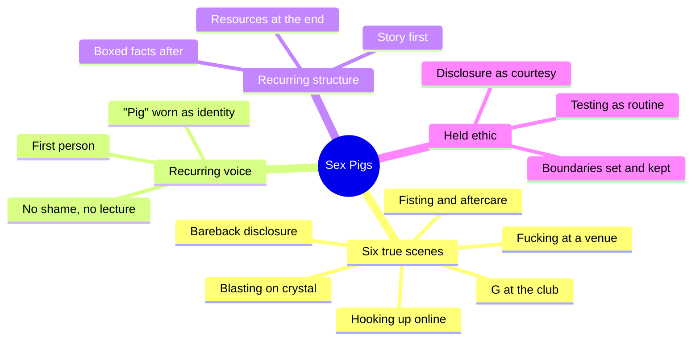
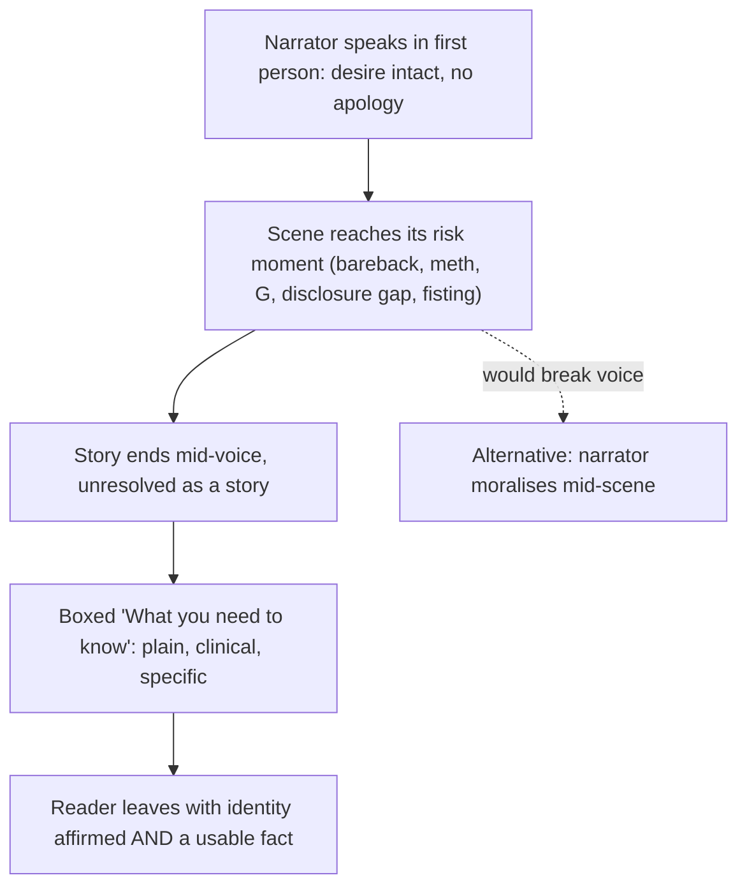
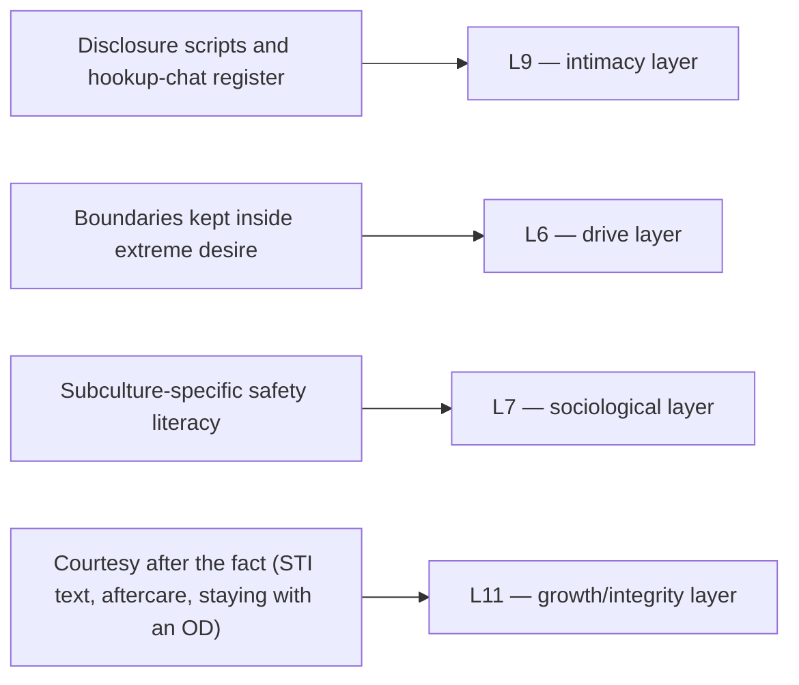

# 🧬 MSX.28 — Sex Pigs — PLWHA NSW (2007)
### Knowledge Entry — Distill

A short Australian community health pamphlet: six true first-person accounts of extreme, drug-fuelled, bareback "pig" sex, each paired with a boxed harm-reduction fact sheet. Read whole (twenty pages).

## TABLE OF CONTENTS
- [Core Thesis](#1-core-thesis)
- [Mind Models](#2-mind-models)
- [Framework](#3-framework--structure)
- [Key Concepts](#4-key-concepts)
- [Heuristics](#5-heuristics--decision-rules)
- [Invariants](#6-invariants)
- [Pitfalls](#7-pitfalls--myths)
- [Application](#8-application)
- [Cross-References](#9-cross-references)
- [Provenance](#10-provenance--confidence)

---

## 1 · CORE THESIS

Gay and bi men who embrace extreme, drug-fuelled, bareback "pig" sex are not thereby careless: they hold personal boundaries, disclose HIV status on their own terms, and manage real risk deliberately. Desire and harm reduction are not opposites; the same first-person voice can carry both without shame.

---

## 2 · MIND MODELS

*Required. Minimum two diagrams, maximum five.*

**Diagram 1 — the whole argument.**
*The pamphlet on one screen: six scenes, one recurring voice, one recurring structure.*

**Diagram 2 — the central mechanism.**
*The pamphlet's real craft trick: it never breaks the narrator's voice to deliver the safety information. The fact box arrives right after the story, at the exact point of relevance.*

**Diagram 3 — mapped onto the Command's systems.**
*Three scene-craft variables a writer can hang directly on a character, plus one care variable that cuts against a lazy "dirty equals reckless" default.*

---

## 3 · FRAMEWORK / STRUCTURE

A 20-page community health pamphlet published by People Living with HIV/AIDS (NSW), the centrepiece print artefact of the multi-channel "Sex Pigs: dark and dirty sex and managing your health" campaign (postcards, media, the pamphlet). It runs six interview-derived, pseudonymous first-person monologues — "Dirty little bareback fucker," "Blasting," "Cubicles and G," "Hooking up," "Clubbing and fucking," "Fisting" — plus a closing "Getting the message" story about post-hookup STI disclosure. Every monologue is unedited for shame or hedging: the narrator says exactly what they did, wanted, and felt. Immediately after each story sits a boxed, bullet-point "What you need to know" sidebar in a flatter, clinical register — the pamphlet's only place where facts, thresholds, and phone numbers appear. A final "For more information" page compiles hotlines (PEP, gay men's health), organisations (ACON, PLWHA NSW, Sydney Sexual Health Centre), and the one paragraph of law (the NSW Public Health Act's disclosure duty). Credited work: concept and campaign by Kathy Triffitt, edited by Glenn Flanagan, designed by Slade Smith, photographed by Jamie Dunbar.

---

## 4 · KEY CONCEPTS

| Concept | What it is | Why it matters |
|---|---|---|
| Full disclosure as identity | The opening narrator's fixed line, "I'm HIV positive, I'll bareback with you if you're positive," stated once on a profile so it never needs repeating | Turns a health fact into a piece of settled character voice, not an awkward mid-scene confession |
| Blasting | Injecting crystal methamphetamine immediately before or during a sex session, chasing a "full-on head space for a wild fuck" | The self-escalation pattern (more crystal, then more guys, then days lost) is the mechanism, not the drug alone |
| "Needs discussion" | An online profile flag under "safe sex" signalling an undefined, negotiated arrangement rather than a clear status | A euphemism a character can use, or be caught out by: negotiated safety is not the same as known safety |
| G (GHB) dosing margin | The gap between an effective dose and an overdose is small; redosing "too early" before the first dose has landed is the actual failure mode shown | Gives a writer the precise, narrow-margin mechanic behind a realistic G overdose scene |
| PEP (post-exposure prophylaxis) | A four-week antiretroviral course that can prevent HIV infection after a specific exposure, most effective started within 72 hours | The pamphlet's one hard deadline: a usable ticking-clock device for a risk scene |
| Fisting build-up | Progressive dildo practice teaches the body to relax on approach; described as "more about width than length," with aftercare and continuous check-ins during the act | A concrete, technical, non-mystified account of a specific practice, useful for writing it without cliché |
| Glove-changing between partners | Changing latex gloves between fisting partners is named as the specific act that prevents Hepatitis C and other STI transmission | A small, correct, load-bearing detail: the kind that makes a scene read as authored by someone who knows the practice |
| Courtesy disclosure text | The closing narrator texts a former hookup partner the moment he's diagnosed with an STI, unprompted and without being asked | Shows care operating inside "piggy" self-description — the two are not opposites in this text |

---

## 5 · HEURISTICS & DECISION RULES

| Situation | Do this | Not this |
|---|---|---|
| Writing a character who embraces extreme or "dirty" sex | Give them explicit, stated personal boundaries they hold even under drugs or pressure | Write "pig" identity as a synonym for having no limits at all |
| Writing an HIV-status disclosure moment | Make it a settled line the character already has ready (a profile statement, a rehearsed opener) | Stage it as a raw, first-time confession every single time |
| Writing a character who says they're HIV negative | Let some of them be wrong, or two years out of date on testing, without making them a liar | Treat every stated status as verified fact the moment it's spoken |
| Writing a drug-fuelled sex marathon | Show the self-escalation (more of the drug, then more partners, then lost time) as the actual arc | Show drug use as a flat, static backdrop detail |
| Writing a GHB (G) scene | Use the narrow dose/overdose margin and "redosed too early" as the specific failure point | Write an overdose as random bad luck with no mechanism |
| Writing a hookup-chat negotiation | Let a euphemism ("needs discussion") do real narrative work, something the reader can catch before the character does | Have characters state their status plainly and completely every time, with no ambiguity |
| Writing a scene at a sex club or venue | Let a character ask a partner's status mid-act and receive an answer that may not be true | Skip the question entirely, or assume asking guarantees a true answer |
| Writing aftermath (an STI diagnosis, an overdose) | Show the mundane next step: a texted heads-up, a doctor's appointment, staying with someone for half an hour | Cut to black and skip the unglamorous, caretaking part of the scene |

---

## 6 · INVARIANTS

1. **"Pig" identity is bounded, not boundless.** Every narrator names limits they keep, even mid-binge; the word describes an appetite, not an absence of self-governance.
2. **Disclosure runs on scripts and assumptions as much as plain statement.** A profile line, a euphemism, or a guess ("I was neg last time I got tested") all substitute for a direct, current answer.
3. **Escalation in a drug-sex session is self-perpetuating and specific.** More crystal begets more guys begets more crystal; the pattern, not the substance alone, is what a writer should track.
4. **GHB's danger sits in the margin between dose and overdose, and in timing a second dose too soon.** This is the one mechanism the text isolates precisely.
5. **PEP has a hard 72-hour window.** It is the pamphlet's only real deadline device.
6. **Regular STI testing (about every three months, covering urine, throat and anal swabs, and blood) is presented as routine scene hygiene**, not an emergency-only visit; most of the STIs named here are frequently asymptomatic.
7. **Care persists past the hookup.** A courtesy disclosure text, staying with an overdosed stranger, changing gloves between partners: these are written as ordinary, expected behaviour inside the scene, not exceptional virtue.
8. **The register never breaks.** The pamphlet states risk facts in a separate box, in a separate voice, and never has the narrator moralise about their own desire.

---

## 7 · PITFALLS / MYTHS

- **The dirty-equals-careless myth.** Writing a bareback/pig character as having no risk awareness at all contradicts every narrator here, who all describe a specific personal risk calculus.
- **The disclosure-is-always-explicit myth.** Real disclosure in this text is often partial, euphemistic, or simply out of date, not a clean spoken fact every time.
- **The one-dose-is-safe myth for G.** The overdose described here comes from redosing too soon, not from using the drug at all.
- **The HIV-is-the-only-risk myth.** The closing story treats gonorrhoea, chlamydia, NSU, and syphilis as ordinary, expected findings from routine testing; HIV is the headline risk, not the only one.
- **The safe-sex-means-risk-free myth.** Condom use is named explicitly as reducing, not eliminating, STI risk; regular testing is still required.
- **The single-voice-source myth.** This is edited, campaign-shaped testimony collected by a health promotion team, not raw unmediated ethnography. Treat its craft (voice plus fact box) as the transferable asset, not its six accounts as a representative sample.

---

## 8 · APPLICATION

*Prose carries the why; `feeds:` carries the wiring (D3). Both required, neither redundant.*

- **Spine level:** [L5], non-story-structural source; a texture and voice source, not a plot-structure claim.
- **12-layer character stack:** L9 (intimacy, disclosure scripts and hookup register), L6 (drive, bounded desire under drugs), L7 (sociological, subculture-specific safety literacy), L11 (growth/integrity, courtesy and aftercare acts) supporting.
- **plot_systems:** Not applicable; this is testimony and health messaging, not a plot mechanism.
- **Setting:** A texture/voice source for the intimacy layer of a fiction character system. It supplies the exact register (cadence, euphemism, and boxed-fact counterpoint) a writer needs to render men's dirty, drugged, or extreme sex scenes truthfully rather than either sanitised or gratuitous.

For a writer, the pamphlet's real craft lesson is structural, not topical: it never lets the safety information break the narrator's voice. The story runs uninterrupted in the character's own words, all the way to the risk moment, then a separate box in a flatter register delivers the fact. That voice/fact split is a portable technique for any scene carrying real-world danger inside a character's own desire (drugs, combat, extreme sport), where a writer wants the reader to feel the character's wanting on its own terms before the cost is stated plainly, in a different voice, right beside it.

---

## 9 · CROSS-REFERENCES

| Related entry | Relation |
|---|---|
| [[🧬 MSX.24 — Bareback Porn, Porous Masculinities, Queer Futures — Florêncio (2020)]] | Same self-identifying term, "pig," and the same bareback/porous-masculinity scene; this pamphlet is closer to the primary testimony Florêncio's later academic "becoming-pig" theorising is written to account for |
| [[🧬 MSX.20 — Sex on Premises Venues — Smith, Grierson & von Doussa (2010)]] | Same Australian gay sexual-health context and the same "sex pig" clientele category; that paper's outside, quantitative view of venues pairs with this pamphlet's inside, first-person testimony |
| [[🧬 MSX.17 — Mating in Captivity — Perel (2006)]] | Perel's claim that desire feeds on risk, mystery, and the unknown is the same mechanism these narrators describe living out at the extreme end: boundaries as what makes the risk survivable rather than reckless |

---

## 10 · PROVENANCE & CONFIDENCE

Read whole: a 20-page pamphlet, sourced from a plain-text OCR drop, no Zotero key on hand. The OCR is clean in the six narrative bodies but scrambles word order badly inside several of the boxed "What you need to know" sidebars (interleaved with decorative pull-quote text). This distill draws its boxed facts from the sidebar passages that OCR'd cleanly and from the plain-language repetition of the same facts inside the pull quotes, not from the garbled interleaved lines. Author is the organisation People Living with HIV/AIDS (NSW), now Positive Life NSW; individual credits (concept/campaign: Kathy Triffitt; editor: Glenn Flanagan; design: Slade Smith; photos: Jamie Dunbar) are stated on the pamphlet's closing page. The publication year is not printed in the source text itself. 2007 is inferred from external corroboration: a contemporary press reference to the same "Pigs, no condoms" campaign imagery, and Positive Life NSW's own campaign page noting the campaign was evaluated in 2008 to 2009, consistent with an earlier 2007 launch. Confidence is medium: the qualitative content is read whole and direct, but the year is externally inferred rather than stated in-text, and the six accounts are edited campaign testimony rather than a research sample.

## META
- Template: BVX-LEARN-v4.0
- Source classification: full text, read whole
- Created / Updated: 2026-09-29
