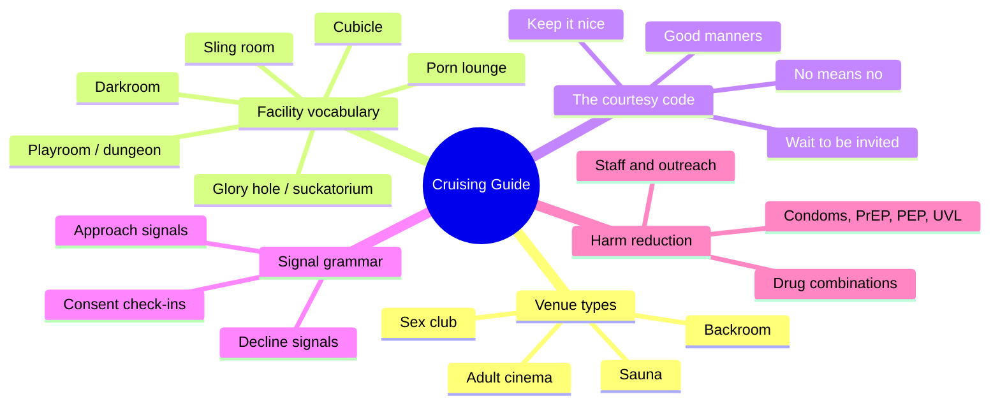
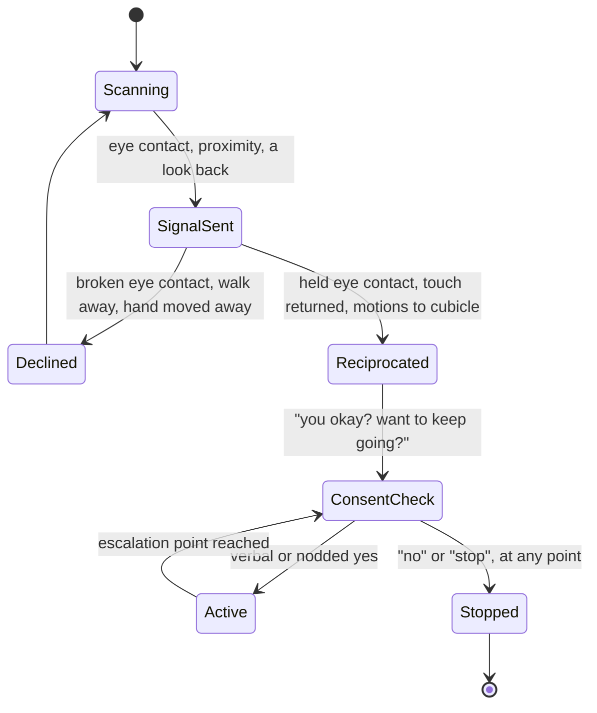
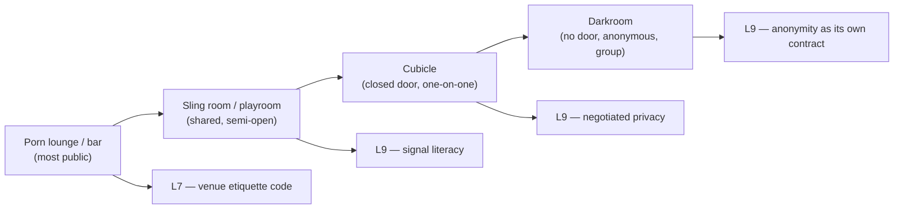

# 🧬 MSX.29 — Cruising Guide — Thorne Harbour Health (2018)
### Knowledge Entry — Distill

A short Australian harm-reduction pamphlet teaching first-timers the vocabulary, layout, and nonverbal rulebook of sex-on-premises venues (SOPVs) — read whole (roughly four pages of running text).

## TABLE OF CONTENTS
- [Core Thesis](#1-core-thesis)
- [Mind Models](#2-mind-models)
- [Framework](#3-framework--structure)
- [Key Concepts](#4-key-concepts)
- [Heuristics](#5-heuristics--decision-rules)
- [Invariants](#6-invariants)
- [Pitfalls](#7-pitfalls--myths)
- [Application](#8-application)
- [Cross-References](#9-cross-references)
- [Provenance](#10-provenance--confidence)

---

## 1 · CORE THESIS

Cruising is a nonverbal negotiation system, not an absence of communication: specific body-language signals propose and specific ones decline, the venue's architecture stages how anonymous or private that negotiation gets, and "no means no" plus staff backing are what keep the whole wordless system safe.

---

## 2 · MIND MODELS

*Required. Minimum two diagrams, maximum five.*

**Diagram 1 — the whole argument.**
*The pamphlet on one screen: what a venue is built from, what the courtesy code demands, and the two harm-reduction stacks (drugs, STIs) layered on top.*

**Diagram 2 — the central mechanism (the cruising signal loop).**
*Cruising runs as a state machine: a signal is sent, read, and either escalates step by step or is declined at any point — and any "yes" stays revocable mid-scene.*

**Diagram 3 — mapped onto the Command's systems.**
*The pamphlet's four venue types sit on one anonymity gradient a writer can restage in any setting, not only a real-world sauna.*

---

## 3 · FRAMEWORK / STRUCTURE

The pamphlet is a first-timer's field manual, not an argument: it moves from what a venue is, to what's inside it, to how to behave, to how to read the room, to how to stay safe. Five blocks, in order: (1) a definition of the sex-on-premises venue (SOPV) and its three business types — sex clubs, saunas, backrooms — plus adult cinemas as a fourth, looser category; (2) conditions of entry, the venue's own house rules (fees, ID, ban-list scanners, intoxication refusal, liquor licensing); (3) a facility glossary defining eight pieces of venue vocabulary by name; (4) "How to cruise," split explicitly into Part 1 (the rules: consent, courtesy, patience) and Part 2 (the signals: how interest and refusal actually look); (5) a harm-reduction closing block covering aggression, drugs and alcohol, and the full STI/HIV prevention toolkit, ending in a resource list. Nothing is argued; everything is named and sequenced for someone standing in the lobby for the first time.

---

## 4 · KEY CONCEPTS

| Concept | What it is | Why it matters |
|---|---|---|
| SOPV (sex on premises venue) | A privately owned business — sex club, sauna, or backroom — where men pay to enter, undress, and have sex with other men on site | The pamphlet's umbrella term; gives a writer one clean category word for a whole class of venue |
| Cruising | Wordless negotiation of sexual interest through body language and movement, with talk kept brief when it happens at all | The named skill the whole pamphlet teaches; a distinct communication register from ordinary flirtation |
| Cubicle | A small lockable-door room, usually with a vinyl mattress | The venue's smallest unit of negotiated privacy — one-on-one, door closed by choice |
| Darkroom | A doorless, very-low-light room built for anonymous, often group, play | The opposite pole from the cubicle: privacy through darkness and numbers, not a door |
| Glory hole / suckatorium | A cock-height hole between two cubicles, for anonymous oral contact through the wall | Turns a wall into a negotiation surface with no face attached to it |
| Sling room / playroom / dungeon | A room built around specific equipment — a sling, bondage points, a fuck bench | Names the venue's kink-specific, sometimes bookable, staged spaces |
| Porn lounge | A screening area with seating, used to watch, be seen, and gauge the room | The pamphlet's suggested entry point — the low-commitment place to start a visit |
| Conditions of entry | The venue's own business rules: a fee, sometimes ID, a scanner checking a prior-ban list, refusal if visibly drunk or drug-affected | Reminds a writer the space is commercially self-policing before any social code even starts |
| The harm-reduction stack | Condoms, PrEP, PEP, and UVL (undetectable = untransmittable, "U=U"), each covering a different gap, none of them total | A precise, current toolkit — not one blanket "use protection" instruction |

---

## 5 · HEURISTICS & DECISION RULES

| Situation | Do this | Not this |
|---|---|---|
| Writing a cruising approach | Stage it through eye contact, proximity, a look back over the shoulder, or a hand grazed in passing — no dialogue needed | Have the character verbally proposition a stranger as the opening move |
| Writing a decline | Have the declining character break eye contact, look away, step out of the sightline, or gently move a hand aside | Have them need to say a word, or have the other party keep pushing after the cue |
| Writing an escalation past first contact | Insert a check-in beat — "you okay?", "want to keep going?" — before the scene goes further | Let silence stand in for ongoing consent once things have started |
| Populating a fictional cruising space | Give it an anonymity gradient — a public lounge, a semi-open play room, a closed cubicle, a doorless dark room — each with a different social contract | Write one undifferentiated "back room" and let every scene happen in it |
| A character new to a scene | Have them start in the most public, lowest-commitment area (the lounge) to read the room before going further in | Drop a first-timer straight into the darkroom with full fluency |
| A character breaking the code | Have them grab or touch without any returned signal, hog a cubicle without using it, or keep cruising someone who's said no — and have it cost them (embarrassment, ejection, a ban) | Play code violations as cost-free or as the norm |
| A character managing risk | Give them a specific, named practice — carries condoms, is on PrEP, tests on a regular rhythm, knows their own or a partner's UVL status | Give them a vague "he's careful" and leave the mechanism unstated |
| Staging a drug-adjacent scene | Reflect a real, specific interaction the character would actually know (ED drugs clear of poppers; G not mixed with alcohol; hydration in a wet-heat room) | Wave at "he was on something" with no specificity |
| A venue's staff or house rules | Show them as a real backstop — refusing entry, intervening on aggression, running a ban list — not decoration | Make the venue lawless or staff-absent by default |

---

## 6 · INVARIANTS

1. **No means no, absolute and immediate.** A stop or a no at any point in a scene ends it there; this sits above every other rule in the pamphlet's own ordering.
2. **Consent is checked, not assumed from silence.** The pamphlet's own worked phrase is a direct question — "you okay? want to keep going?" — answered by a verbal yes or a clear nod.
3. **Initiation without a returned signal is not cruising, it's groping.** The code requires waiting to be invited; touching first and hoping is a code violation with real consequences (ejection, a ban).
4. **Venue architecture encodes the social contract.** A cubicle's closed door, a darkroom's absence of one, and a sling room's fixed equipment each pre-negotiate a different kind of scene before anyone signals anything.
5. **The venue is a business layered under the social code.** Entry fees, ID checks, ban-list scanners, and intoxication refusal exist independently of, and prior to, the cruising etiquette itself.
6. **Prevention is a stack, not a single tool.** Condoms, PrEP, PEP, and UVL/U=U each close a different gap (transmission during sex, pre-exposure, post-exposure, viral suppression); none of them covers every STI.
7. **Drug and alcohol risk is specific, not generic.** The pamphlet names exact dangerous combinations (erectile-dysfunction drugs with poppers; GHB with alcohol) rather than a blanket "be careful."
8. **Aggression is treated as an exception the venue is built to handle**, via staff, not as an inherent risk of the space itself.

---

## 7 · PITFALLS / MYTHS

- **The silent-consent myth.** Treating a nonverbal "yes" as permanent once given; the pamphlet insists consent is re-checked as a scene escalates and is revocable at any single moment.
- **The initiation-without-invitation myth.** Assuming touching first is just forward cruising; without a returned signal it is groping, and the pamphlet frames it as a bannable offense, not a bold move.
- **The condom-is-enough myth.** Treating condoms as the whole answer to STI risk; the pamphlet stacks them with PrEP, PEP, UVL, and regular testing because condoms don't cover everything.
- **The one-safe-drug myth.** Assuming any recreational or performance drug is fine alone; the pamphlet flags specific combinations (ED drugs with poppers, G with alcohol) as the actual danger point, not drug use in general.
- **The generic-back-room myth.** Treating sex clubs, saunas, backrooms, and adult cinemas as interchangeable; they differ in facilities, supervision, and even whether condoms and lube are provided at all (adult cinemas often don't).
- **The lawless-darkroom myth.** Assuming the most anonymous room in a venue means no rules apply; the same no-means-no and staff backstop still governs it.

---

## 8 · APPLICATION

*Prose carries the why; `feeds:` carries the wiring (D3). Both required, neither redundant.*

- **Spine level:** [L5]
- **12-layer character stack:** L9 (intimacy/physical — signal literacy, consent-checking habit), L7 (sociological — the venue's etiquette code and its enforcement), L6 (drive — risk-management practice) supporting.
- **plot_systems:** Not applicable; this is a behavioral and etiquette manual, not a plot mechanism.
- **Setting:** A direct setting-shelf source. The four venue types and eight facility terms are a ready-made kit for staging any sexualized space in a science-fiction setting — a station's version of a sauna, a ship's version of a darkroom — each with its own entry conditions, equipment, and anonymity level, instead of one generic "sex venue" backdrop.

For a writer building a setting on TTRPG craft, the pamphlet's real gift is the signal-and-refusal grammar itself: a portable, dialogue-free negotiation system (approach cue, read, escalate-or-decline, mid-scene check-in, immediate stop on "no") that works for any consent-bearing scene in any genre, not only a real-world cruising venue. Pair it with the anonymity gradient — public lounge to semi-open play room to closed cubicle to doorless darkroom — as a reusable staging tool: place a scene at a point on that gradient and the social contract for it comes pre-loaded. The venue-as-business layer (fees, ID, a ban list, a no-admittance-if-intoxicated rule) is equally portable for any restricted-access space a GM or writer needs to feel real rather than lawless.

---

## 9 · CROSS-REFERENCES

| Related entry | Relation |
|---|---|
| [[🧬 MSX.20 — Sex on Premises Venues — Smith, Grierson & von Doussa (2010)]] | Same venues and vocabulary (SOPVs, saunas, sex clubs) seen from the outside, as a demographic survey of who uses them and how the community perceives each venue's reputation; this pamphlet supplies the inside view — the signal grammar and courtesy code a survey respondent would already know from having been there |
| [[🧬 PSY.03 — Unlimited Intimacy — Dean (2009)]] | Deeper ethnographic and theoretical account of cruising and barebacking subculture; this pamphlet is the plain-language, harm-reduction-first companion to Dean's more academic treatment of the same practice |

---

## 10 · PROVENANCE & CONFIDENCE

Read whole: a short (roughly four running pages) plain-language health-promotion pamphlet, sourced from a plain-text drop (OCR'd, with minor character-encoding artifacts around apostrophes), not the Zotero library proper (no Zotero key on hand). The text identifies itself only as "Cruising: A Down an' Dirty Guide to Cruising and Sex on Premises Venues" and points readers to downandirty.org, Touchbase, PrEP'D For Change, and Thorne Harbour Health for further resources — the publisher attribution and year above are inferred from those markers (downandirty.org is Thorne Harbour Health's Sexually Adventurous Men project) and web research done alongside this distill, not printed in the pamphlet itself; treat the year as approximate. Confidence is medium: the pamphlet's own content (facility definitions, etiquette rules, signal vocabulary, harm-reduction guidance) is read directly and distilled faithfully, but the bibliographic year could not be independently confirmed against a dated original.

## META
- Template: BVX-LEARN-v4.0
- Source classification: full text, read whole; publisher/year inferred from internal citations and web research
- Created / Updated: 2026-09-29
