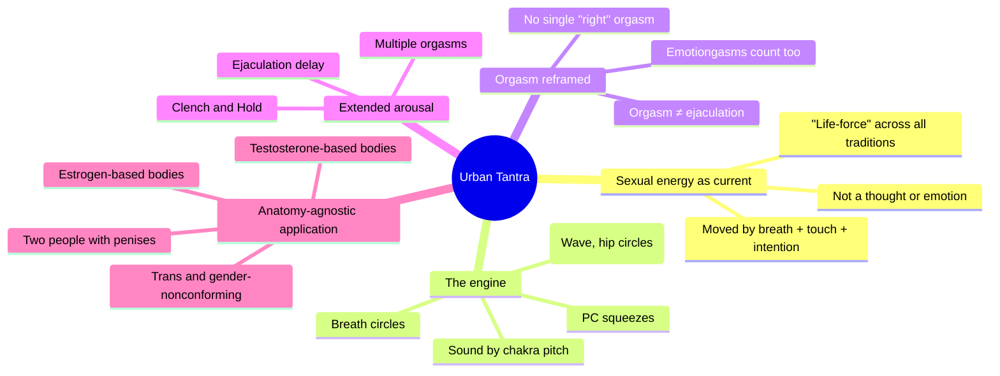
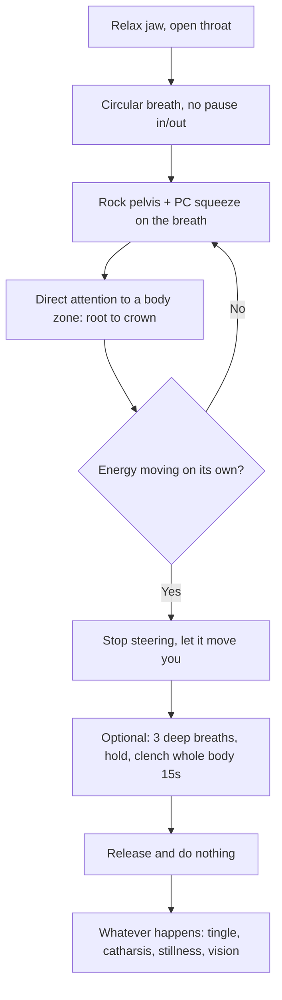
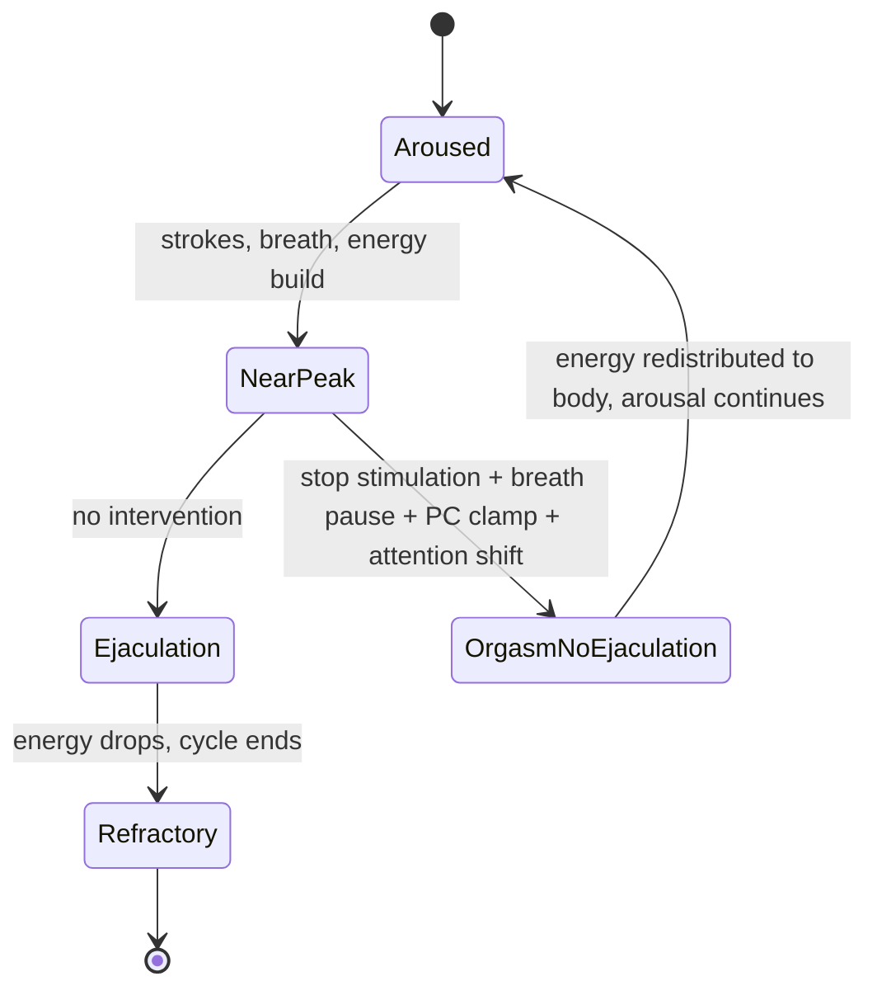

# 🧬 MSX.30 — Urban Tantra — Carrellas (2017)
### Knowledge Entry — Distill

A queer, sex-positive, gender-inclusive rewrite of Tantra and Taoist sexual-energy practice for a Western urban audience: breath, movement, sound, and muscle as tools to build and circulate arousal separately from genital orgasm, taught through solo and partnered rituals for bodies of every configuration.

## TABLE OF CONTENTS
- [Core Thesis](#1-core-thesis)
- [Mind Models](#2-mind-models)
- [Framework](#3-framework--structure)
- [Key Concepts](#4-key-concepts)
- [Heuristics](#5-heuristics--decision-rules)
- [Invariants](#6-invariants)
- [Pitfalls](#7-pitfalls--myths)
- [Application](#8-application)
- [Cross-References](#9-cross-references)
- [Provenance](#10-provenance--confidence)

---

## 1 · CORE THESIS

Sexual energy is a trainable body current, moved by breath, muscle, sound, and attention, not a genital event. Orgasm and ejaculation are two separate processes; decoupling them buys extended, whole-body, repeatable arousal. Because the mechanism is breath and muscle rather than a specific anatomy, it transfers unmodified across genders, bodies, and pairings.

---

## 2 · MIND MODELS

*Required. Minimum two diagrams, maximum five.*

**Diagram 1 — the whole argument.**
Caption: *one engine (breath, muscle, sound, attention) drives every technique in the book; anatomy only decides which strokes you use to feed it.*

**Diagram 2 — the central mechanism (breath-energy circuit).**
Caption: *the same six-step circuit underlies the Breath Energygasm, the Clench and Hold, and every partnered massage in the book; only the input (breath alone, or breath plus a partner's hands) changes.*

**Diagram 3 — orgasm and ejaculation as independent states.**
Caption: *the book's load-bearing move for extended arousal: treat ejaculation as an optional exit ramp, not the destination, and multiple orgasms become available to any body with a penis.*

---

## 3 · FRAMEWORK / STRUCTURE

The book runs solo before partnered, and gender-inclusive before gender-specific, by design. Part 1 sets the philosophy (ecstasy over adrenaline, presence over goal). Part 2 (chapters 8 to 11) builds the individual toolkit this distill focuses on: what sexual energy is, the totality of orgasm, breath and energy orgasms, and solo Tantra. Part 3 applies that same toolkit to a partnered ritual, staged as set, chill/warm, come together, rock and roll, afterglow. Chapters 17 to 20 run the identical Erotic Awakening Massage three times, once "for people with pussies," once "for people with penises," once gender-free for trans and gender-nonconforming bodies, to make the point structurally: the ritual doesn't change, only the anatomy-specific strokes inside it do. Part 4 extends the same energy mechanics into BDSM, ritual design, and group sex.

---

## 4 · KEY CONCEPTS

| Concept | What it is | Why it matters |
|---|---|---|
| Sexual energy as current | A physical, moveable energy (kundalini / chi / life-force), not a feeling or a thought; demonstrated by hand-friction before any genital involvement | Decouples "arousal" from "genitals," which is what makes the whole system portable across bodies |
| The Microcosmic Orbit / Inner Flute | A closed energy loop: up the spine (Governor channel) to the crown, down the front (Functional channel) to the perineum, tongue on the palate closes the circuit | The physical circuit every breath technique in the book is routing energy through |
| Breath Energygasm | A chakra-by-chakra connected breath (no pause between in/out) that builds an orgasmic state without touch | The proof case that orgasm can run on breath alone; the base skill under every partnered technique |
| The Clench and Hold | Charge with breath, then hold a full breath while clenching every major muscle group, then release into stillness | The book's signature extended-arousal technique; used solo, partnered, and as the standard ending to all three Erotic Awakening Massages |
| Orgasm vs. ejaculation | Ejaculation is a reflex spasm that follows orgasm, not orgasm itself; the two can be trained apart | The single concept that unlocks multiple orgasms and extended arousal for any body with a penis |
| Emotiongasm | Laughter, rage, or crying that builds and releases via the same breath-muscle-sound mechanism as a genital orgasm | Widens "orgasm" past genital release, which matters for characters whose arousal or catharsis doesn't route through sex at all |
| Hormone-based, not gender-based, technique split | "Estrogen-based" and "testosterone-based" bodies replace "women" and "men" as the organizing categories for technique | Keeps the whole system usable by trans, nonbinary, and intersex readers without a separate rulebook |
| Same tissue, different mold | Clitoris and penis, labia and scrotum, share embryonic origin tissue; illustrated explicitly for the gender-free massage | Grounds the anatomy-agnostic claim in developmental biology, not just inclusive language |
| Resilient Edge of Resistance | The touch pressure point where tissue offers both resistance and give; the calibration standard for every stroke in the book | One tactile rule replaces a hundred stroke-specific pressure instructions |
| Gender-free Erotic Awakening Massage | A version of the ritual that drops anatomical names (penis, vulva) in favor of sensation language, built at trans students' request | Direct L8 material: touch retrained around dysphoria rather than around a fixed body plan |

---

## 5 · HEURISTICS & DECISION RULES

| Situation | Do this | Not this |
|---|---|---|
| Arousal is building toward ejaculation and you want it to continue | Stop stimulation 10 to 20 seconds, breathe, clamp the PC muscle, shift attention out of the genitals | Push through to climax as fast as possible |
| You don't know a partner's preferred anatomy language | Ask what they call their genitals and how they want touch referred to before touching | Default to "penis"/"vulva" or guess from presentation |
| A partner (of any gender) says they've "never had an orgasm" | Ask whether they've had a laughing, crying, or rage catharsis; point out that's the same mechanism | Treat lack of genital orgasm as a fixed diagnosis |
| Two men are partnering with the book's penis-specific techniques | Use the "People with Penises" chapter directly; nothing in it assumes a partner without a penis | Assume the book's penis content is written for mixed-sex pairs only |
| Touch stalls or a partner tenses under a stroke | Back off pressure until you find where resistance meets give (Resilient Edge), don't force through it | Increase pressure to "get a reaction" |
| A scene needs a character's desire to visibly move through the body, not just spike and drop | Route it through breath, sound pitch, and movement stages (root to crown) rather than a single genital cue | Write arousal as a single instant on/off switch |
| A trans or gender-nonconforming character's arousal is being written | Let sensation and requested language, not assigned anatomy, drive what touch does | Import cis-gendered orgasm mechanics wholesale onto a body that doesn't map to them |

---

## 6 · INVARIANTS

1. **Breath is genderless.** Every technique in the book, regardless of which anatomy chapter it lives in, starts and ends with conscious breath; it is the one universal input.
2. **Orgasm and ejaculation are separable processes**, not synonyms, for any body producing ejaculate. Training the gap between them is what produces multiple and extended orgasms.
3. **Sexual energy follows attention.** Where you focus, energy concentrates; this is stated as a mechanical rule, not a metaphor, and is the basis for every energy-circulation technique.
4. **All external genitals develop from the same embryonic tissue** (glans, shaft, bulbs, legs, frenulum are shared structures under different names). Anatomical difference is a matter of configuration, not kind.
5. **A technique built for one anatomy transfers to any body with that anatomy**, independent of the practitioners' genders or the pairing's orientation. A prostate is a prostate whether the person receiving is a straight man, a gay man, or a trans woman.
6. **There is no single correct orgasm.** Volcanic, energetic, emotional, and locationless orgasms are all named as equally valid; ranking them is treated as the cultural error, not the variety.
7. **Extended arousal requires accepting non-linearity.** Energy will rise and stall and need to be re-primed from a lower chakra; this is normal operation, not a failed attempt.

---

## 7 · PITFALLS / MYTHS

- Treating "higher" chakras or "spiritual" release as better than genital or embodied pleasure; the book explicitly reframes the goal as dropping *into* the body, not escaping it.
- Assuming ejaculation avoidance means avoiding orgasm; they are separable, and the goal is more orgasms, not fewer.
- Reading fantasy, kink, or BDSM sensation-play as incompatible with "sacred" sex; the book treats Tantra and BDSM as running on the identical energy/endorphin/ritual mechanism.
- Using anatomical labels (penis, vulva, clitoris) as a default with a partner whose language for their own body may differ, especially where gender dysphoria is present.
- Assuming techniques written "for people with penises" are implicitly heterosexual; the chapter never specifies a partner's anatomy or gender, only the receiver's.
- Believing a vibrator, dildo, or intense stroke "desensitizes" tissue over time; the book states this directly as a myth worth naming and dismissing.
- Forcing pressure or pace to "get a result"; the Resilient Edge of Resistance rule exists specifically against this impulse.

---

## 8 · APPLICATION

- **Spine level:** [L5]
- **12-layer character stack:** L9 (desire_vector: energy-as-current mechanism), L6 (drive_texture: orgasm/ejaculation split as a controllable choice), L8 (sensory_imprint_rewiring: gender-free touch retraining), L11 (growth_requirement: unlearning as the path to erotic competence)
- **plot_systems:** n/a (practice manual, not a narrative source)
- **Setting:** n/a

For rendering men's sex frankly and precisely, this book supplies the mechanism PSY.10 (Magnificent Sex) describes from the outside: PSY.10 finds that extraordinary lovers report presence, connection, and "flow" states that dwarf orgasm in importance; Urban Tantra hands the writer the actual breath-and-muscle procedure that produces those reported states, chakra by chakra, stroke by stroke. Where PSY.10 says great lovers are made through unlearning shame, this book is the unlearning curriculum: the Breath Energygasm and Clench and Hold are trainable skills a character could plausibly practice, fail at, and improve at over time, giving an intimacy arc concrete beats instead of a vague "became more open" summary.

For queer men specifically: chapter 19's cock-strokes and ejaculation-delay techniques are anatomy-keyed, not orientation-keyed. Nothing in the instructions assumes the giver lacks a penis; a scene between two men can use this material unmodified, including the P-spot (prostate) material that bridges directly to MSX.23. The book's own history matters here too: Carrellas developed these techniques teaching "Sacred Sex" and "Fun with Breath and Energy Orgasms" workshops first to gay men with AIDS in 1980s New York, explicitly as safer sex that didn't require ejaculatory, penetrative, or even genital contact to reach ecstatic states. That origin makes the extended-arousal-without-ejaculation frame a plausible, period-grounded practice for a queer male character to have learned, not an anachronistic import. For gender-nonconforming or trans characters, chapter 20's language protocol (ask preferred terms, use sensation words over anatomy words, treat the "unlearn what you know" stance as a skill) is directly usable as a scene's blocking without further research.

---

## 9 · CROSS-REFERENCES

| Related entry | Relation |
|---|---|
| [[🧬 PSY.10 — Magnificent Sex — Kleinplatz & Ménard (2020)]] | PSY.10 documents the phenomenology (presence, connection, flow) this book supplies the breath-and-muscle procedure for; read together as why-and-how pair |
| [[🧬 MSX.23 — The Ultimate Guide to Prostate Pleasure — Glickman & Emirzian (2013)]] | Both use a P-spot/prostate arousal model that plateaus and re-peaks rather than building to a single spike; MSX.23 goes deeper on the anatomy and masculinity-shame angle this book only touches |
| [[🧬 MSX.17 — Mating in Captivity — Perel (2006)]] | Perel's "separateness" and "mystery" as desire fuel sit at the psychological register; this book's breath/energy work is the somatic register operating alongside it |

---

## 10 · PROVENANCE & CONFIDENCE

Sourced from full text: front matter, forewords, and introduction (context and queer/BDSM/trans framing); Part 2 in full (chapters 8 to 11: sexual energy, orgasm, breath and energy orgasms, solo Tantra); the Erotic Awakening Massage chapters (17 to 20: shared setup, and the "people with pussies," "people with penises," and trans/gender-nonconforming versions); the opening of chapter 21 (Tantric BDSM). Chapters not read in full (12 to 16 ritual staging, 22 to 24 sex magic and group Tantra, references) were surveyed via table of contents only and are not drawn on for claims above. Confidence is high for the breath/energy/extended-arousal mechanism and its gender-inclusive framing, which is the book's most consistently repeated content; medium for anything implied about chapters not read.

## META
- Template: BVX-LEARN-v4.0
- Source classification: full-text (targeted chapters) + TOC survey (remainder)
- Created / Updated: 2026-09-29 / 2026-09-29
