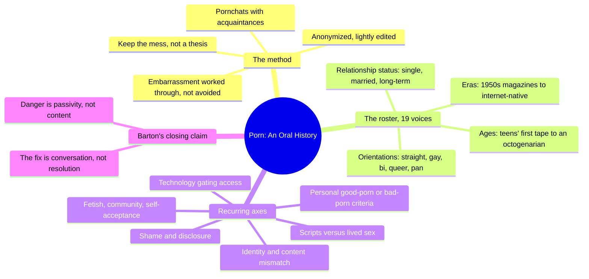
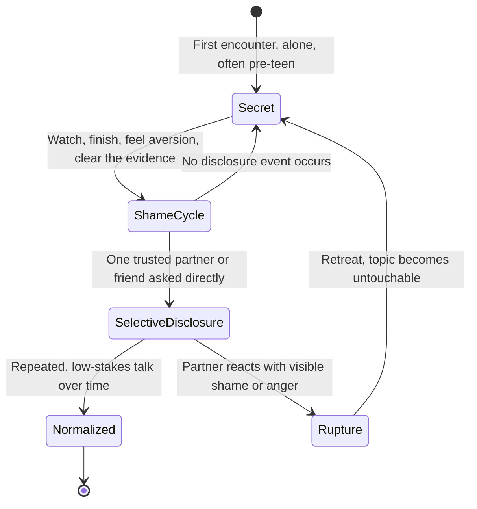
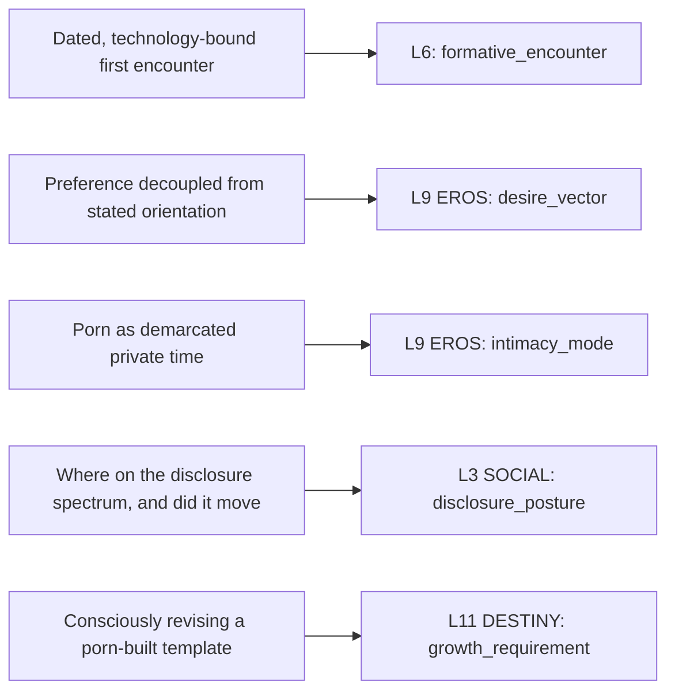

# 🧬 MSX.31 — Porn: An Oral History — Barton (2023)
### Knowledge Entry — Distill

Nineteen unscripted "pornchats" between a translator-essayist and her acquaintances, anonymized and lightly edited, read here for one thing: the actual range of how ordinary adults describe, feel about, and manage their relationship with porn, as raw material for giving a fiction character a truthful porn history rather than a stock one.

## TABLE OF CONTENTS
- [Core Thesis](#1-core-thesis)
- [Mind Models](#2-mind-models)
- [Framework](#3-framework--structure)
- [Key Concepts](#4-key-concepts)
- [Heuristics](#5-heuristics--decision-rules)
- [Invariants](#6-invariants)
- [Pitfalls](#7-pitfalls--myths)
- [Application](#8-application)
- [Cross-References](#9-cross-references)
- [Provenance](#10-provenance--confidence)

---

## 1 · CORE THESIS

Nobody's relationship to porn resembles anyone else's, and the shared feature across nineteen very different lives is not the content watched but the silence around it. Shame does its damage less through what people watch than through the fact that they never talk about it, which produces passivity where a real conversation would produce agency.

---

## 2 · MIND MODELS

*Required. Minimum two diagrams, maximum five.*

**Diagram 1 — the whole argument.**
Caption: *the book is a method (talk to people you already know, keep the mess) applied across a genuinely wide roster of voices, converging on one closing claim: talking is the intervention, not any particular verdict on porn.*

**Diagram 2 — the central mechanism (the shame-to-disclosure arc).**
Caption: *the same four-stage arc recurs across unrelated speakers; where a person sits on it, and whether they ever move, matters more than what they watch.*

**Diagram 3 — mapped onto the Command's character system (L9 EROS, L3 SOCIAL, L11 DESTINY).**
Caption: *the book's four load-bearing patterns each land on a named variable, giving a writer a schema for a character's porn history instead of a mood.*

---

## 3 · FRAMEWORK / STRUCTURE

A short introduction (Barton's own tangled relationship to the topic and the method she settled on), nineteen numbered, anonymized chat transcripts (each opens with a one-line demographic tag: orientation, age band, relationship status), and a closing reflection ("Zero Again") that reads the whole set against Audre Lorde's "Uses of the Erotic." No thematic chapters, no argued thesis chapters: the structure *is* the interview set. Barton deliberately rejected essay form because condensing the interviews into themes would have erased the individual voices; the raw, contradictory, sometimes meandering shape of each conversation is the point, not a flaw to edit out.

The nineteen speakers, by the tags the book itself gives them (the actual demographic range a writer can draw a cast from):

| # | Tag |
|---|---|
| One | straight woman, late 30s, long-term partner, children |
| Two | gay man, 40s, expat in Japan, single |
| Three | straight man, 30s, long-term partner |
| Four | queer woman, mid-30s, married to a woman |
| Five | straight man, early 20s, recently single |
| Six | queer, late 40s, long-term partner |
| Seven | woman, mid-30s, long-term partner (man) |
| Eight | queer woman, late 20s, has dated men and women, single |
| Nine | woman, early 20s, hetero-leaning, intentionally single |
| Ten | gay trans man, 30s |
| Eleven | straight man, early 80s, partner lives separately |
| Twelve | pansexual woman, 30s, long-term male partner |
| Thirteen | straight man, late 30s, US, long-term partner |
| Fourteen | gay man, early 30s, US, single |
| Fifteen | straight woman, early 30s, married, children |
| Sixteen | woman, late 30s, single |
| Seventeen | straight man, late 30s, single |
| Eighteen | bisexual woman, 30s, UK, married to a man, children |
| Nineteen | bisexual man, mid-30s, married to a woman, one child |

---

## 4 · KEY CONCEPTS

| Concept | What it is | Why it matters |
|---|---|---|
| **The pornchat method** | Interviewing people she already knew, one-on-one, unstructured, kept close to verbatim | Produces the texture a writer needs: real hedging, self-correction, and contradiction inside one person's account, not a tidy composite quote |
| **The "spoken life" gap** | Barton's term for the near-total absence of porn from ordinary conversation, even among people who discuss everything else | Explains why characters' porn histories are so rarely written with any specificity; the silence is itself a fact to dramatize |
| **Good porn / bad porn as personal criteria, not a genre** | Nearly every speaker has an idiosyncratic definition (Two: no exploitation, no ugliness, an interesting face; Fourteen: under twenty minutes, intimacy over cum) | A character's taste in porn is a character detail as specific as taste in music; it should be built, not defaulted to "watches porn" |
| **Scripts versus lived sex** | Fourteen's account of porn supplying a "blueprint" for what a partner might want, then having to ask whether anyone in the room actually wants it | Gives a writer language for a character mistaking a performed cue for a partner's real desire, and for the work of unlearning it |
| **The demarcation function** | For Nineteen and Six, porn/masturbation is valued partly as a bounded private zone separate from partner, children, and work self | Lets a writer motivate a character's porn use as need for solitude or self-time, not only as sex drive |
| **The shame-clear-cache cycle** | Fourteen's daily pattern: watch, finish, feel immediate aversion, clear browsing data, repeat | A concrete, filmable behavioral signature for a character stuck at the Secret/ShameCycle stage of Diagram 2 |
| **Disclosure as the hard part, not the fix** | Barton's closing observation that talking about porn is often harder than any subsequent behavior change, but is still the load-bearing move | Frames a "porn conversation" scene between characters as the dramatic event, independent of what gets decided |
| **Identity/content mismatch** | Two's straight-coded aesthetic imprinting (Playboy) despite being gay from early consciousness; Fourteen finding no image of men in straight magazines and avoiding gay porn out of fear it would "tip him over" | A caution against writing a character's porn taste as a simple mirror of their stated orientation |
| **Era as a hard constraint on access** | Eleven's five technology phases (pulp fiction and top-shelf magazines to 8mm film to VHS to DVD to a single recommended website) versus Nineteen's dial-up thumbnail grid at eleven | Porn history is dateable; a character's era of adolescence sets the medium, the acquisition ritual, and the vocabulary available to them |
| **Fetish community as a path to self-acceptance, not just kink** | Ten's arc from private, self-loathing shame about a specific fetish to finding an anonymous online community that normalizes it, without ever resolving the wish to also have "normal" sex that gets them off | Models a character whose sexuality includes an unintegrated, unresolved piece, rather than a clean coming-to-terms arc |

---

## 5 · HEURISTICS & DECISION RULES

| Situation | Do this | Not this |
|---|---|---|
| Giving a character a porn history | Build one dated, specific first-encounter memory (object, place, technology, who was there) and one adult-era description of taste | Write "he watches porn" with no specifics, or a generic teenage-discovery montage |
| Deciding what a character finds arousing | Let it run independent of, or in tension with, their stated orientation or identity | Assume porn taste mirrors the demographic label a reader already has for the character |
| Writing a couple's disclosure scene about porn | Make the emotional charge come from *how* it's said (shame, evasiveness, casualness) more than *what* is confessed | Write the confession's content as the source of the conflict |
| A character seems to hide something shameful and small | Consider a private-zone/demarcation motive (needing separate space) before defaulting to infidelity-adjacent guilt | Assume secrecy about masturbation or porn always signals betrayal or dysfunction |
| Showing porn shaping a character's expectations of a partner | Show them catching themselves mid-assumption and asking whether the other person actually wants what porn taught them to expect | Present porn-derived scripts as simply, silently enacted and accurate |
| A character has an unusual or niche fetish | Give them an online community, a self-loathing streak, and an unresolved edge, not a tidy reveal-and-accept arc | Play it either purely for shock or for a clean, complete self-acceptance ending |
| Writing an older character's porn history | Anchor it to the actual media technology of their adolescence and note how liberalization and closure moved in waves, not one line of progress | Assume porn access and attitudes only ever became more permissive over a lifetime |
| A character claims to be totally unashamed about porn | Ground it in something concrete (a low-key, practical family, or one specific formative rupture that didn't stick) rather than an innate trait | Write unshamed sexuality as simply a personality type with no origin |
| Depicting a racialized character's experience of being desired | Show fetishization as a distinct, nameable dynamic (assumed roles, dating-versus-sex asymmetry, having to litigate it with strangers) | Collapse "being desired" and "being fetishized" into the same experience |

---

## 6 · INVARIANTS

1. **No two people's relationship with porn matches, even within the same identity category.** Two gay men in this book (Two and Fourteen) have almost opposite histories, tastes, and shame patterns; identity predicts far less than a writer might assume.
2. **Silence, not content, is the load-bearing problem.** Across nineteen speakers, the harm described traces back to never having discussed porn with anyone, not to any particular thing watched.
3. **First encounters are dated and technology-bound, and they imprint.** What was accessible at the moment of first exposure (a magazine, a tape, a dial-up thumbnail grid) becomes a lasting reference point even decades later.
4. **Desire and disclosure are separate axes that can move independently.** A person can be sexually at ease with their own porn use while still never having told a partner, or vice versa.
5. **A private, bounded zone is itself a function porn serves**, separate from arousal, especially inside long relationships, parenting, and cohabitation.
6. **Aesthetic criteria for "good" and "bad" porn are personal, specific, and non-transferable**; two people can watch the identical scene and read consent and enjoyment in it oppositely.
7. **Shame does not require an unhappy household to form**, and its absence does not require an unusually open one; both patterns appear in the interviews without a clean causal story.
8. **Talking about porn is frequently harder than changing behavior around it**, and doing the former does not guarantee the latter follows.

---

## 7 · PITFALLS / MYTHS

- Assuming a character's porn taste follows neatly from their sexual orientation; several speakers' strongest formative material contradicts their identity.
- Writing porn disclosure as a single clean confession scene that resolves the issue; several speakers describe disclosure as ongoing, partial, and still uncomfortable even inside good relationships.
- Treating heavier or niche-fetish content as evidence of escalating desensitization; more than one speaker explicitly wants *less* extreme, more intimate material as they age, not more.
- Reading a couple's shared porn-watching as automatically erotic or automatically comfortable; two speakers each describe it going from mutual to separate mid-scene, or working only as a minor addition to a mood already set.
- Assuming older generations had a simpler or more repressed relationship to porn; Eleven's account includes an entire liberalization-then-closure arc across seven decades, not a straight line from prudish to permissive.
- Treating a person's stated lack of shame as proof of an untroubled sexual history; it can equally reflect a practical, low-emphasis family culture that never made an issue of it.
- Assuming fetish communities exist to produce full self-acceptance; Ten's account keeps an unresolved, still-disliked edge even after finding a community.

---

## 8 · APPLICATION

- **Spine level:** [L5] WOUND, per this batch's assigned keying (a texture/voice source on shame, disclosure, and desire, not a story-spine structural source)
- **12-layer character stack:** L9 EROS, primary (`desire_vector`, `intimacy_mode`); L3 SOCIAL, primary (`disclosure_posture`); L11 DESTINY, supporting (`growth_requirement`, shame-to-integration arcs); L6, contextual (`formative_encounter`, the dated first-exposure memory)
- **plot_systems:** contextual candidate once `04_PLOT_SYSTEMS/` opens; the shame-to-disclosure arc (Diagram 2) is a ready-made four-stage engine for a relationship subplot turning on a porn-related conversation or its avoidance
- **Setting:** none directly; a texture/voice source for the intimacy layer, not a SETTING-shelf source

Barton's real gift to a character system is the demonstration, nineteen times over, that porn history resists formula. A writer reaching for "this character watches porn" should instead answer four small questions the book asks of every speaker: what was the dated, specific first encounter; what does this specific person consider good versus bad porn and why; where do they sit on the secrecy-to-disclosure spectrum and has it ever moved; and does porn serve them as arousal, as private demarcated time, or as something else entirely (information, company, ritual). Read against MSX.18 (Berg), the two sources cover different ends of the same subject: Berg gives the labor and performance side of porn (what it is to make it for a wage), Barton gives the reception side (what it is to live with watching it). Together they let a `desire_vector` be built from both directions: what a character wants, and, if relevant, what a character does for money that requires performing what others want.

---

## 9 · CROSS-REFERENCES

| Related entry | Relation |
|---|---|
| [[🧬 MSX.18 — Porn Work — Berg (2021)]] | Companion read: Berg covers the production/labor side of porn (performers, wages, the industry), Barton covers the reception/audience side (ordinary viewers' relationship to it). Read together for a `desire_vector` and `intimacy_mode` that account for both what is wanted and, where relevant, what is performed. |
| [[🧬 MSX.17 — Mating in Captivity — Perel (2006)]] | Contrast and complement: Perel theorizes why distance and mystery generate desire inside a couple; Barton's interviewees supply concrete, first-person cases of porn as exactly that kind of private, separate, demarcated erotic zone inside long relationships. |

---

## 10 · PROVENANCE & CONFIDENCE

Full text, pdftotext extraction, clean text layer, no machine-readable table of contents (the book's own contents page lists the nineteen chapters by number-word only). Read in full: the front matter and "Zero" (Barton's introduction and account of her method); the closing "Zero Again" (her synthesis against Audre Lorde's "Uses of the Erotic," including the works-referenced list); and seven of the nineteen full interview chapters, selected to cover the widest span of the demographic range the book itself provides (Two, gay man in his 40s; Six, queer in their late 40s; Ten, gay trans man in his 30s; Eleven, straight man in his early 80s; Fourteen, gay man in his early 30s; Nineteen, bisexual man in his mid-30s). The remaining twelve chapters were sampled only for their opening one-line demographic tag (used in §3's roster table) and were not read in full; their content is not drawn on elsewhere in this distill.

This is a PDF-drop item, not a Zotero-library record: no `zotero_key` exists. The `feeds:` variable names follow the L9 EROS and adjacent layer definitions used in `MSX.18`'s frontmatter, extended here with a new `disclosure_posture` and `formative_encounter` field for the patterns this source surfaces that Berg's did not.

## META
- Template: BVX-LEARN-v4.0, sexuality variant (BOLO 87/88, `brief.DISTILL.md` as changed by `brief.DISTILL.sex.md`)
- Source classification: full-text book, deep extraction on intro, conclusion, and 7 of 19 interview chapters, all 19 chapters' opening tags captured for the roster
- Created / Updated: 2026-09-29
