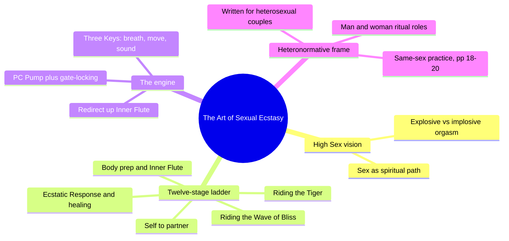
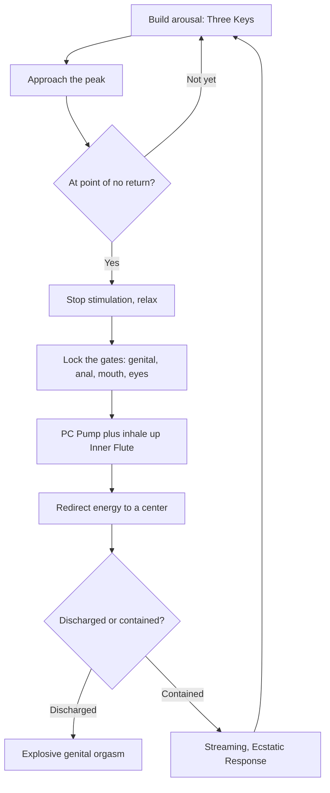
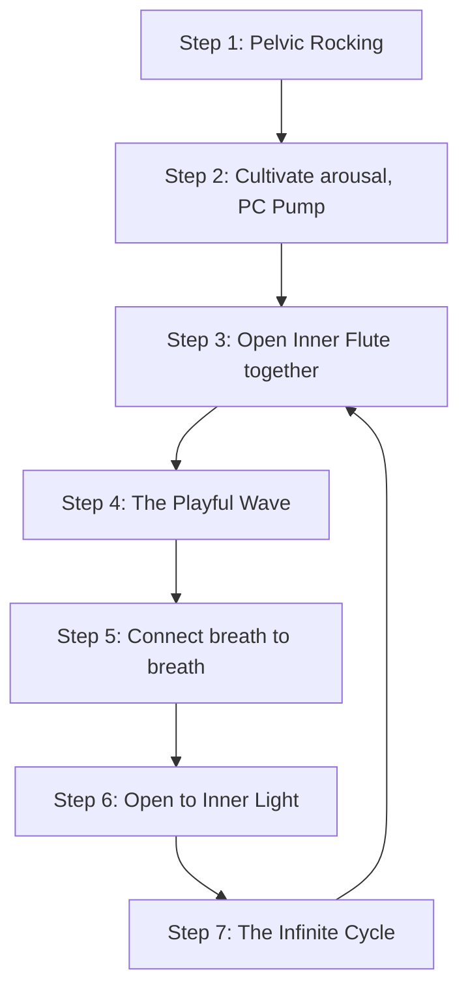
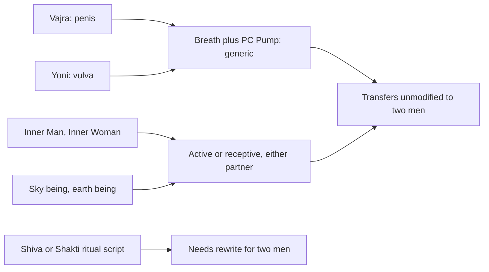

# 🧬 MSX.32 — The Art of Sexual Ecstasy — Anand (1989)
### Knowledge Entry — Distill

A 1989 neotantra course book (Tarcher; BVX.0788 in the catalog, first distilled under the legacy code PHI.01) that trains lovers, in twelve graduated stages, to build genital arousal with breath and muscle and then contain and redirect it rather than discharge it — written to heterosexual couples throughout, with a two-page passage explicitly extending the method to same-sex partners.

## TABLE OF CONTENTS
- [Core Thesis](#1-core-thesis)
- [Mind Models](#2-mind-models)
- [Framework](#3-framework--structure)
- [Key Concepts](#4-key-concepts)
- [Heuristics](#5-heuristics--decision-rules)
- [Invariants](#6-invariants)
- [Pitfalls](#7-pitfalls--myths)
- [Application](#8-application)
- [Cross-References](#9-cross-references)
- [Provenance](#10-provenance--confidence)

---

## 1 · CORE THESIS

Arousal is a current built by breath, muscle, and sound, then contained and redirected rather than discharged: explosive genital orgasm and implosive whole-body ecstasy manage the same energy differently. A seven-step sequence trains that redirect skill. The scripting is heterosexual and gendered; the mechanism (breath, PC pump, gate-locking, polarity as role not anatomy) is body-generic.

---

## 2 · MIND MODELS

*Required. Minimum two diagrams, maximum five.*

**Diagram 1 — the whole argument.**
Caption: *one training ladder, one recurring engine, and one explicit but thin exception to an otherwise heterosexual script.*

**Diagram 2 — the central mechanism (the edge-and-redirect loop, run at every skill level from solo self-pleasuring through the capstone practice).**
Caption: *the whole book is one loop taught four times at rising difficulty — the only variable is how many "gates" you learn to lock at once.*

**Diagram 3 — the practice sequence in focus: the seven-step Riding the Wave of Bliss.**
Caption: *the capstone is the same edge-and-redirect loop run continuously in a seated, locked posture, cycling instead of resolving.*

**Diagram 4 — what transfers to men with men, and what doesn't.**
Caption: *the mechanism and the polarity concept are body-generic; only the ritual script (names, postures, cosmology) is hard-coded to a man and a woman.*

---

## 3 · FRAMEWORK / STRUCTURE

Twelve chapters run as a strictly sequential curriculum, each explicitly building on the last: Awakening Your Inner Lover (solo foundation) → Opening to Trust (sacred space, resistance) → Skills for Enhancing Intimacy (senses, play) → Honoring the Body Ecstatic (touch, stretch, purification) → Opening the Inner Flute (PC Pump, Sexual Breathing, Pelvic Rocking — the base engine) → Self-Pleasuring Rituals (the engine applied solo, then observed, then shared) → Harmonizing Your Inner Man and Inner Woman (polarity as role) → Awakening the Ecstatic Response (Shaking Loose, Streaming, the Butterfly, Bonding Relaxation) → Expanding Orgasm (healing genital and anal tension) → From Orgasm to Ecstasy (Riding the Tiger, the Valley Orgasm) → Riding the Wave of Bliss (the seven-step capstone). Three appendices close the book: Safe Sex, Musical Selections, Resources. The author states the sequencing is load-bearing: skipping ahead to Riding the Tiger without PC Pump, Sexual Breathing, and ejaculation-withholding skill already in place is named as a design error, not a shortcut.

---

## 4 · KEY CONCEPTS

| Concept | What it is | Why it matters |
|---|---|---|
| **High Sex** | Anand's name for the whole system: not one technique but a graduated program reframing sex as a spiritual and energetic practice rather than tension release | The organizing claim everything else serves; ecstasy is trained, not stumbled into |
| **The Three Keys** | Breath, movement, and sound, used together to generate and amplify arousal | The base amplifier used in literally every exercise in the book, solo through capstone |
| **The PC Pump** | Rhythmic contraction of the pubococcygeus muscle, paired with breath | The physical handle on arousal: builds it, controls ejaculation, and moves energy upward |
| **The Inner Flute** | A visualized channel from perineum to crown linking seven chakras (the Taoist "Hollow Bamboo" by another name) | The pathway redirected arousal is imagined traveling; the mechanism that turns genital sensation into whole-body sensation |
| **Gate-locking** | Closing the genital, anal, mouth, and eye "gates" (through muscle tension, mouth-to-mouth contact, and mutual gaze) so energy cannot leak out | Explains why the seated Wave of Bliss posture is described as more powerful than any other position: every exit is shut at once |
| **Point of no return / Riding the Tiger** | Building arousal deliberately to the edge of the involuntary orgasmic reflex, then stopping and redirecting instead of discharging | The book's central discipline; "riding" rather than suppressing, since force just recreates the tension it's meant to dissolve |
| **Explosive vs. Valley (implosive) orgasm** | Two management modes for one arousal buildup: outward discharge (explosive) vs. inward diffusion through non-doing (Valley Orgasm) | Reframes "no ejaculation" as a different destination, not a failure to arrive |
| **Inner Man and Inner Woman** | A Jungian-flavored active/receptive (yang/yin) polarity each partner is asked to cultivate in themselves | Explicitly not anatomy-bound in the book's own argument — the polarity is a role, which is the hinge the same-sex passage swings on |
| **Streaming / Ecstatic Response** | Spontaneous, involuntary body vibration once chronic tension dissolves under sustained high arousal | The payoff state the whole ladder builds toward; described as happening on its own once blocks clear, never forced |
| **Riding the Wave of Bliss (seven steps)** | The capstone seated posture and sequence (Diagram 3) that locks all gates and circulates energy between partners in a closed loop, the "Infinite Cycle" | The single most detailed practice sequence in the book; the clearest worked example of the edge-and-redirect loop run to completion |
| **"Practicing with a Partner of the Same Sex" (pp. 18-20)** | A named passage stating the training "can be beneficial to partners of the same sex," reasoned from the polarity concept: any couple, gay or straight, has one partner in whom male qualities are more dominant and one more feminine | The book's own license for the transfer this distill is built to answer; two paragraphs in a 472-page book, not a developed second track |
| **Anal Healing Massage** | Treats anal tension as stored trauma (toilet training, punishment, rough exams) independent of orientation | Names the orgasmic potential of the anus as "independent of any homosexual tendencies" — useful material wrapped in a defensive, period-typical disclaimer |

---

## 5 · HEURISTICS & DECISION RULES

| Situation | Do this | Not this |
|---|---|---|
| Arousal is building too fast in any practice | Stop stimulation, relax, PC Pump plus inhale to redirect the energy upward | Clench and push through to climax |
| Learning the multi-step practices | Master PC Pump, Sexual Breathing, and Pelvic Rocking separately first | Jump straight to Riding the Tiger or the Wave of Bliss |
| A session feels flat, nothing is happening | Trust non-doing (the Valley Orgasm's "effortless" model) and wait 10 to 20 minutes | Force streaming, check the clock, or judge the session a failure |
| A partner is reluctant to try the training | Practice solo, let the results attract them, offer practices without naming the book | Argue, guilt-trip, or insist |
| Writing a scene between two men using this book's mechanics | Keep the mechanism (breath, PC Pump, gate-locking, edge-and-redirect) and the polarity concept (active/receptive as a role) | Import the man/woman ritual script (Shiva/Shakti salutation, sky-being/earth-being cosmology, the default Wave posture) unmodified |
| A character fears receptive or anal pleasure signals something about his orientation | Use the book's own move: separate the tissue's orgasmic potential from identity | Reproduce the "does not change his sexual preference" defensive line as if it were settled fact rather than 1989 anxiety |
| Depicting extended, non-ejaculatory arousal | Write the edge-and-redirect loop (Diagram 2): build, stop, lock, redirect, repeat | Write arousal as one continuous line to a single peak |

---

## 6 · INVARIANTS

1. **Arousal is a body current, not only a mental state.** It is built by breath, muscle, and sound (the Three Keys) and moved by attention, treated as a mechanical claim throughout, not a metaphor.
2. **Discharge and containment are alternative endpoints for the same buildup**, not different intensities of the same event. Choosing one over the other is a trained skill.
3. **The redirect skill (stop, relax, lock, breathe upward) is identical whether solo or partnered, first exercise or capstone.** Riding the Wave of Bliss is the same loop as the beginner's self-pleasuring ritual, run continuously.
4. **Later practices structurally require earlier ones.** Riding the Tiger and the Wave of Bliss are stated to fail without PC Pump, Sexual Breathing, Pelvic Rocking, and ejaculatory control already trained.
5. **Polarity (active/yang, receptive/yin) is framed as a role each partner inhabits and can trade**, not a trait fixed by anatomy or sex, even though the book's own default scripting assigns it by gender.
6. **Genital and anal tissue holds emotional and trauma history regardless of the person's orientation**; the healing method (conscious touch, breath, communication) is presented as orientation-neutral even where the surrounding prose is not.
7. **Same-sex application is explicitly sanctioned by the author in 1989**, on the polarity logic above, even though pronouns, ritual names, and postures default to a man and a woman everywhere else in the book.

---

## 7 · PITFALLS / MYTHS

- Reading the man/woman ritual language (Shiva/Shakti salutations, Vajra/Yoni terms) as evidence the underlying mechanism requires a mixed-sex pair. It doesn't; the mechanism is breath and muscle, and the book's own same-sex passage says so.
- Treating "Riding the Tiger" as suppression. It is redirection under relaxation; clenching through discomfort recreates the muscular block the whole method exists to dissolve.
- Overweighting the same-sex passage. It is two pages of license and reasoning, not a rewritten or gender-inclusive edition — contrast MSX.30 (Urban Tantra), which runs the identical energy mechanism through a fully rebuilt, explicitly queer and trans-inclusive frame.
- Confusing implosive (Valley) orgasm with "no orgasm." The text describes it as effortless and often more intense, just non-explosive, not absent.
- The Anal Healing Massage chapter's reassurance ("does not change his sexual preference," anal orgasm exists "independent of any homosexual tendencies") both normalizes anal pleasure and quietly treats gayness as the danger being reassured against. Useful as a period artifact of 1989 anxiety, not as a model for a contemporary character's interior voice.
- Assuming the seven-step Wave of Bliss requires penetrative penis-in-vagina contact to function. The book itself notes the practice "can be just as efficient" without an erection or penetration, with genitals merely in contact — the gate-locking and breath mechanism is what does the work.

---

## 8 · APPLICATION

- **Spine level:** [L5]
- **12-layer character stack:** L9 (desire_vector — arousal as a current built and redirected by breath/muscle/attention; polarity_role — active/receptive as a tradeable role), L6 (drive_texture — the point of no return as a controllable, trainable threshold rather than a fixed cliff), L11 (growth_requirement — a strictly sequential curriculum, practice building to enjoyment)
- **plot_systems:** n/a (practice manual, not a narrative source)
- **Setting:** n/a

For the intimacy layer of the character system, and for gay and bi men's sex specifically: strip the ritual script (Sanskrit names, Shiva/Shakti salutations, sky-being/earth-being cosmology, the default woman-on-top capstone posture) and what remains is a body-generic arousal-management toolkit — build with breath, movement, and sound; edge at the point of no return; lock the gates; redirect up an imagined channel; let contained energy stream. That toolkit needs no partner of a particular sex to run. The book's own "Practicing with a Partner of the Same Sex" passage (pp. 18-20) reasons from exactly this: masculine and feminine are framed as a polarity every couple negotiates, gay or straight, so two men map as "one more yang, one more yin" rather than requiring a woman in the room. Read against MSX.30 (Urban Tantra), which runs the identical breath-muscle-energy mechanism through a deliberately queer, gender-inclusive rebuild published almost thirty years later: MSX.32 is what the mechanism looked like while still merely tolerating a same-sex reader; MSX.30 is what it looks like once a writer (or a teacher) removes the heteronormative default on purpose rather than appending an exception to it. What MSX.32 still contributes on its own terms is granularity Urban Tantra compresses — the named "gates," the four-level escalation of the same edge-and-redirect loop from solo practice to the seated Wave, and the Inner Man/Inner Woman material as concrete, tradeable blocking a scene can use once the pronouns and posture defaults are rewritten for the characters actually on the page.

---

## 9 · CROSS-REFERENCES

| Related entry | Relation |
|---|---|
| [[🧬 MSX.30 — Urban Tantra — Carrellas (2017)]] | Same breath/muscle/energy-redirect mechanism, rebuilt gender-inclusive by design rather than tolerated by exception; read as this book's queer-forward descendant |
| [[🧬 MSX.17 — Mating in Captivity — Perel (2006)]] | Perel's psychological register (separateness, mystery, as desire's fuel) runs alongside this book's somatic register (breath, muscle, energy); companion pair, same relation MSX.30 draws to Perel |
| [[🧬 PHI.01 — The Art of Sexual Ecstasy — Anand (1989)]] | Same book, same author, catalogued once already (BVX.0788) and distilled under the legacy PHI code for its spiritual-philosophy angle; this entry re-distills it for the sexuality shelf's practice-sequence and heteronormative-transfer angle — read together, not as duplicates |
| [[🧬 MSX.23 — The Ultimate Guide to Prostate Pleasure — Glickman & Emirzian (2013)]] | MSX.23's plateau/re-peak prostate arousal model is the anatomical specific case of this book's general edge-and-redirect loop |

---

## 10 · PROVENANCE & CONFIDENCE

Full text (OCR scan, ~472pp per catalog entry BVX.0788, ~895KB / roughly 150,000 words extracted). Read in full: front matter and jacket copy; the Introduction ("The Way In"); "How to Use This Book," including "Practicing with a Partner" and "Practicing with a Partner of the Same Sex" (pp. 18-20, read in full — the passage this distill's heteronormative-transfer angle is built on); Chapter 6, "Opening the Inner Flute" (PC Pump, Sexual Breathing, Pelvic Rocking, chakra theory); Chapter 9, "Awakening the Ecstatic Response" (Shaking Loose, the Streaming Process, the Butterfly, Bonding Relaxation), including the Ecstatic-Response-versus-orgasm comparison passage; the Anal Healing Massage passage in Chapter 10; Chapter 11, "From Orgasm to Ecstasy" (Riding the Tiger Alone and Together, the Valley Orgasm Levels One and Two), in full; Chapter 12, "Riding the Wave of Bliss," including the complete seven-step sequence, the Infinite Cycle, and the Advanced Infinite Cycle, in full. Sampled via table of contents and targeted search only, not deep-extracted: Chapters 3 to 5 (sensory awakening, trust, sacred space rituals), Chapter 7 (Self-Pleasuring Rituals, beyond the passages on the point-of-no-return technique itself), Chapter 8 (Inner Man/Inner Woman role-play exercises, beyond the polarity concept extracted for Key Concepts), and Appendices I to III (Safe Sex, Music, Resources). Confidence is high for the arousal/redirect mechanism, the seven-step Wave sequence, and the same-sex-practice passage, all read in full; medium for chapters surveyed only by table of contents.

## META
- Template: BVX-LEARN-v4.0
- Source classification: full-text (targeted chapters, OCR) plus TOC survey (remainder)
- Created / Updated: 2026-09-29 / 2026-09-29
