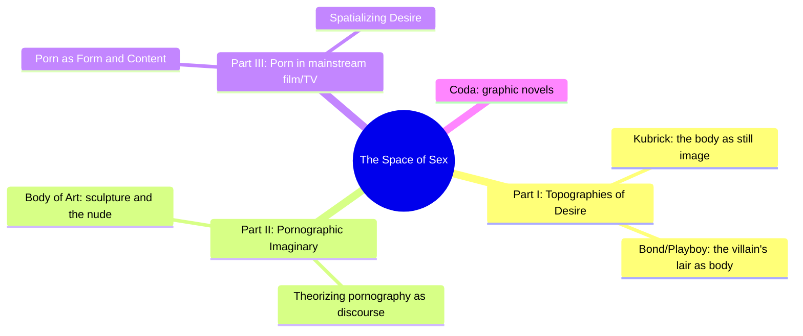
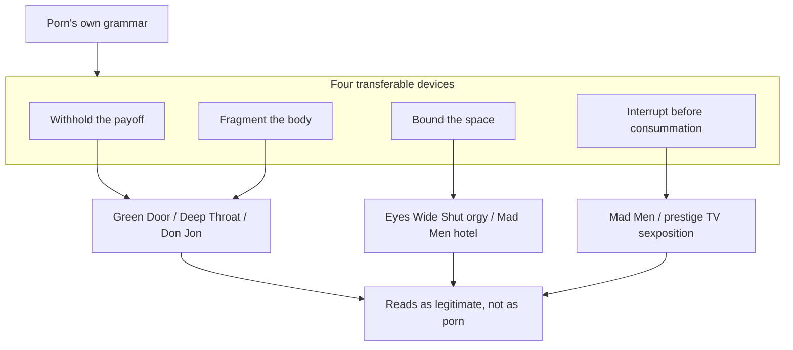
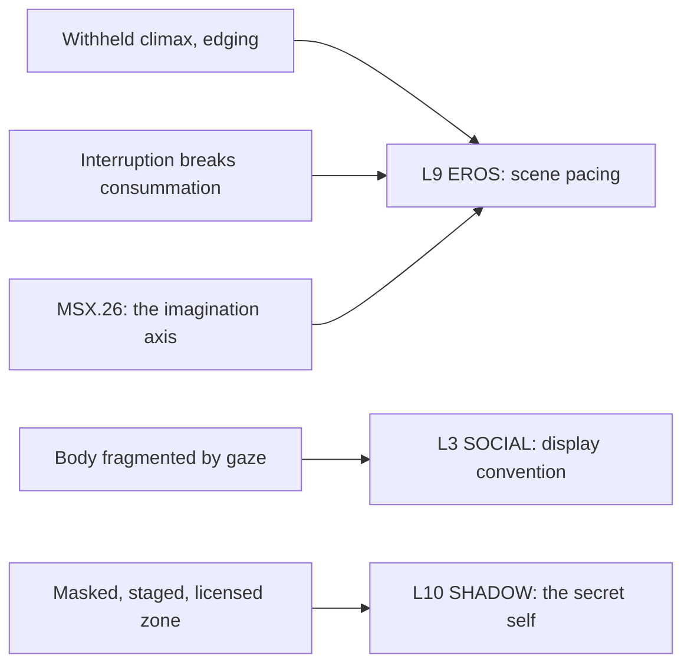

# 🧬 MSX.33 — The Space of Sex — Waldrep (2021)
### Knowledge Entry — Distill

A film-studies monograph tracing how pornography's look and grammar, not just its content, migrated into "legitimate" mainstream film and prestige television from the 1970s art-porn wave through 2010s streaming; its case studies are a working parts-bin for how an explicit scene gets shot, paced, and licensed.

## TABLE OF CONTENTS
- [Core Thesis](#1-core-thesis)
- [Mind Models](#2-mind-models)
- [Framework](#3-framework--structure)
- [Key Concepts](#4-key-concepts)
- [Heuristics](#5-heuristics--decision-rules)
- [Invariants](#6-invariants)
- [Pitfalls](#7-pitfalls--myths)
- [Application](#8-application)
- [Cross-References](#9-cross-references)
- [Provenance](#10-provenance--confidence)

---

## 1 · CORE THESIS

Mainstream film and television absorb pornography's grammar long before they absorb its explicitness: a withheld payoff, a fragmented body, and a bounded, licensed space for transgression. What decides whether a scene reads as porn, as art, or as both is never the explicitness itself; it is the pacing and framing built around it.

---

## 2 · MIND MODELS

*Required. Minimum two diagrams, maximum five.*

**Diagram 1 — the whole argument.**
Caption: *three parts move from a single director's body-as-image (Kubrick) to a theory of pornography to a decade of case studies — the book is building its own toolkit as it goes, not applying a finished one.*

**Diagram 2 — the central mechanism (how mainstream borrows porn's structure).**
Caption: *four transferable devices, not the sex act itself, are what actually cross from porn into mainstream film and TV — this is the checklist for writing an explicit beat.*

**Diagram 3 — mapped onto the Command's 12-layer character stack.**
Caption: *the four devices sort cleanly onto three layers — pacing feeds EROS directly, the licensed zone feeds the SHADOW double, and camera choice feeds SOCIAL display.*

---

## 3 · FRAMEWORK / STRUCTURE

Three parts, each doing different work, bookended by an introduction that states the thesis (the body is becoming the mise-en-scène of contemporary moving imagery) and a coda on graphic novels:

| Part | Chapters | Governing move |
|---|---|---|
| I. Topographies of Desire | Kubrick's late films; the Bond/Playboy aesthetic | Establishes the body-as-architecture idea through a single high-art auteur, then a mass-cultural parallel that shared his production designer |
| II. The Pornographic Imaginary | Theorizing Pornography; Body of Art | Builds the theory: what pornography *is*, historically and structurally, and how art history's nude already rehearsed the same problem |
| III. The Space of Sex in Contemporary Film and TV | Porn as Form and Content; Spatializing Desire | Runs the theory against 2000s–2010s film (Don Jon, The Canyons, Savages, Magic Mike, Nymphomaniac) and TV (Mad Men, True Blood, Lost, Entourage, Watchmen) |
| Coda | Graphic novels | Y: The Last Man, Saga, Sex Criminals — tests whether an unconstrained medium (drawn, not filmed) does anything freer with sex than film or TV manage |

The book is explicitly inductive: Waldrep tracked contemporary film and TV as it happened (blog, then journal) and only worked out the theory afterward, which is why Part III reads as a running commentary rather than a proof of a pre-stated thesis.

---

## 4 · KEY CONCEPTS

| Concept | What it is | Why it matters |
|---|---|---|
| **The money shot as structural template** | Porn's externalized male orgasm, staged apart from the body it belongs to | Mainstream film rarely shows it, but keeps its structure: a withheld, delayed, externalized payoff that the whole scene has been building toward |
| **Body fragmentation by gender** | Porn (and much mainstream film) renders the female body as landscape/wholeness, the male body as a part — the penis standing in for the whole man | A default convention, not a law; naming it makes it a choice a writer can keep, invert, or refuse |
| **The anti-fetish** | The oversized, unreal porn penis: an object of arousal and of dissociation (ego-bruising) at once | Exaggeration doesn't intensify identification, it can break it; realism, not scale, is what lets a viewer/reader stay inside a body |
| **The bounded, licensed space** | A masked ball, a staged theater-within-the-story, a locked hotel room: a zone where the normal moral order is suspended for the scene's duration | This is how *Behind the Green Door*, *Eyes Wide Shut*, and *Mad Men*'s Baltimore hotel all let transgression happen without contaminating the story around it |
| **The believable miscue** | An unscripted imperfection (an actor coming early, a visible flinch) breaking through a staged sex scene | What reads as "real" in an explicit scene is the crack in the performance, not the performance's polish |
| **Interruption as tension device** | A phone ringing, a fire alarm, a knock: the mechanism that halts consummation right before it happens | Preserves both narrative tension and the characters' (and story's) plausible deniability; used almost identically in *Eyes Wide Shut* and *Mad Men* |
| **Sexposition vs. integral sex** | *Game of Thrones*-style nudity used to disguise a plot data-dump, versus *The Girlfriend Experience*'s sex scenes that carry the plot themselves | The difference between porn's *look* used as wallpaper and porn's *structure* actually doing narrative work |
| **Doubling / the secret self** | A character's hidden desire or habit running parallel to their public role (Don and Sal's shared temptation, Don Jon's porn habit, vampirism-as-forbidden-desire on *True Blood*) | This is how mainstream narrative imports porn's psychological charge (shame, secrecy, risk) while keeping the content off-screen |
| **Film's Aristotelian arc vs. TV's melodrama** | Film compresses to one sustained dramatic arc; serial TV sprawls, resets weekly, and answers to a network's or platform's own constraints | Explains structurally why film can sustain one long, explicit sequence and TV mostly substitutes nudity, repetition, or the sexposition workaround |
| **1970s "Golden Age" camera choices** | *Behind the Green Door*'s disorienting angles, close-ups on the face over the genitals, extended real-time duration | Concrete, transferable shot choices used to make an explicit scene feel authored rather than gynecological or purely functional |

---

## 5 · HEURISTICS & DECISION RULES

| Situation | Do this | Not this |
|---|---|---|
| Writing toward a scene's climax | Withhold and delay the payoff (edging); let anticipation do the work | Rush straight to the act because it's the "point" of the scene |
| Filming or describing a body in an explicit scene | Choose fragmentation (close, partial, metonymic) or wholeness deliberately, for the effect it produces | Default to a convention (female = whole, male = a part) without noticing it's a choice |
| Staging a group or transgressive scene | Bound it: a mask, a stage-within-the-story, a frame that licenses it as a suspended zone | Let it bleed into the story's ordinary moral order with no containing frame |
| Wanting a sex scene to feel real, not performed | Let one small imperfection or unscripted reaction land | Polish every beat until it reads as choreography |
| Building tension toward a near-miss encounter | Interrupt right before consummation (a call, a noise, a summons) | Let the moment resolve cleanly, with nothing at stake |
| Putting recurring sex or nudity into a serial format | Make it carry plot or character weight itself | Use it as decoration or distraction while exposition happens underneath it |
| Handling a character's porn habit, kink, or secret desire | Trust the audience to sit with the ambiguity | Over-explain it as an addiction needing a clean lesson or cure |
| Wanting an explicit or art-adjacent scene to land as serious | Keep the "steamy" charge that gave the scene its reason to exist | Let artistic ambition or self-conscious prestige smother the frisson (the Sarris pitfall) |

---

## 6 · INVARIANTS

1. **Explicitness alone never decides whether a scene reads as porn, art, or both.** Pacing, framing, and the license granted by context do that work instead.
2. **The devices transfer before the content does.** Withholding, fragmentation, and bounded space show up in mainstream film and TV constantly; the sex act itself much less often.
3. **Camera choice encodes gender.** Wholeness versus fragmentation is not neutral; it is the default grammar for how female and male bodies get filmed, and it can be used knowingly or inherited blindly.
4. **A licensed zone contains transgression.** Masks, a staged frame, or a non-place (hotel room, elevator, secluded house) let a scene go further precisely because the frame marks it as separate from ordinary consequence.
5. **TV's seriality resists what film's arc can sustain.** A weekly-reset or platform-constrained format substitutes nudity, repetition, or exposition-via-titillation for the single sustained explicit sequence film can build toward.
6. **Believability comes from the crack, not the polish.** An imperfect, seemingly genuine reaction inside a staged scene is what makes an audience believe it, not technical smoothness.
7. **Doubling carries porn's psychology without porn's content.** The secret self, the closet, the affair, and the habit are the mainstream's working substitute for depicted explicitness.

---

## 7 · PITFALLS / MYTHS

- Treating "artistic seriousness" as license to add explicit content without doing the pacing and framing work — the result is what one critic called a "caul of despair" (*Love*, and the U.S. cut of *Nymphomaniac*).
- Confusing nudity with depicted sex: a lot of prestige-TV skin is atmosphere, not story, and does none of porn's structural work.
- Over-explaining a character's porn habit or kink as a disease needing a cure (*Don Jon*'s unresolved moralizing) instead of trusting ambiguity.
- Assuming exaggerated anatomy or performance reads as more arousing; porn's own oversized penis is as much an "anti-fetish" that breaks identification as it is an object of desire.
- Letting artful restraint or pretension kill the charge a scene needs to exist for — the exact complaint 1970s art-porn drew from critics who preferred it "steamy" and unashamed.
- Assuming the body-as-landscape/body-as-part gender split is natural rather than a filming convention available to keep, invert, or discard.

---

## 8 · APPLICATION

- **Spine level:** L5
- **12-layer character stack:** L9 EROS (primary — scene pacing: withhold, fragment, bound, interrupt, as a direct toolkit for writing or shooting an explicit beat); L10 SHADOW (supporting — the secret self and the licensed/masked zone as the mainstream's substitute for depicted content); L3 SOCIAL (contextual — the gendered body-display convention as a choice, not a default)
- **plot_systems:** contextual — the four-device checklist (withhold, fragment, bound, interrupt) is directly reusable as a scene-craft pass over any drafted explicit beat, independent of genre
- **Setting:** contextual — the "bounded, licensed space" (a masked stage, a hotel room, a non-place like an elevator or airport) is itself a craft tool that makes an explicit scene read as authored rather than gratuitous; this dovetails with, but does not formally feed, the SETTING-shelf's S10 UNDERSIDE (public/private) and S3 SENSORIUM categories already opened by [[BVX.0458]]

Read for the sexuality shelf's practical half: this is less a theory of desire (that is Perel's and Maes's territory) than a parts-bin of concrete choices — camera angle, withheld payoff, masked frame, interruption — that a writer can apply directly when a scene needs to be explicit and also needs to work. The case studies (*Don Jon*'s addiction-narrative failure, *Mad Men*'s interrupted-tryst doubling, *Magic Mike*'s commodified male display) are worked examples of the heuristics above succeeding or visibly failing, which makes them more useful than the book's own more abstract theorizing chapters.

---

## 9 · CROSS-REFERENCES

| Related entry | Relation |
|---|---|
| [[🧬 MSX.26 — Pornographic Art and the Aesthetics of Pornography — Maes (2013)]] | Theory counterpart, explicitly linked per brief: Maes's imagination axis (fixation/close-up/repetition versus suggestion/tension/restraint) is the mechanism *underneath* why Waldrep's case studies land where they do — read Maes for the test, Waldrep for the corpus it's tested against |
| [[🧬 MSX.17 — Mating in Captivity — Perel (2006)]] | Perel's "bounded space of eroticism" (rules of ordinary life suspended so desire can operate) is the clinical version of Waldrep's staged, masked, licensed zone — same structural claim, one from a therapist's chair, one from a film critic's seat |
| [[BVX.0458]] | The Command's SETTING-shelf founding distill; Waldrep's non-places and bounded venues are a ready-made craft supplement to S10 UNDERSIDE and S3 SENSORIUM, though not formally fed here |

---

## 10 · PROVENANCE & CONFIDENCE

Full text, pdftotext extraction (~216pp estimated from chapter proportions; no printed page numbers survived extraction). Read in full: Introduction (including the "Note on the Overall Structure" and the pandemic-era afterword); Chapter 3, "Theorizing Pornography," in its entirety (the Greek/Roman origins argument, the porn-debates section, the psychology-of-porn section on Butler and trans representation, and the full 1970s "Golden Ages of Porn" history through *Deep Throat*, *The Devil in Miss Jones*, and *Behind the Green Door*); Chapter 5, "Porn as Form and Content," nearly in full (the film/TV economics preamble, and the case studies on *Don Jon*, *Bang Gang*, *The Canyons*, *Savages*, *Magic Mike*, *Tinker Tailor Soldier Spy*, *Nymphomaniac*, and the horror/sci-fi coda on *It Follows*, *Drag Me to Hell*, and *Ex Machina*); Chapter 6, "Spatializing Desire," nearly in full (the film/TV form argument, the extended *Mad Men* reading across two episodes, *True Blood*, *Lost*, *Entourage*'s Sasha Grey arc, *Watchmen*'s Dr. Manhattan, and the graphic-novel coda on *Y: The Last Man*, *Saga*, and *Sex Criminals*).

Sampled only, not deep-extracted: Chapter 1 ("Framing the Image: The Female Body in Late Kubrick" — read through the Kubrick-as-still-photographer argument, not the full chapter); Chapter 2 ("The Spy Who Loved Me: Bond and the Playboy Aesthetic") and Chapter 4 ("Body of Art," on sculpture and the nude) were not directly read; their content is inferred only from the introduction's own chapter summary and the table of contents. This is a deliberate scope cut against the brief's focus (mainstream absorption of porn's look and structure for shooting and pacing an explicit story), which sits almost entirely in Chapters 3, 5, and 6. Bibliography and index were not read.

The `feeds:` keying (L9 primary, L10 supporting, L3 contextual) is this distill's own synthesis against the Command's 12-layer character stack; the book itself uses no such vocabulary. The cross-reference to [[🧬 MSX.26]] is per the assigning brief's explicit instruction to link it; the relation stated (imagination-axis mechanism vs. film/TV corpus) is this distill's own reading of how the two books complement each other, not a claim either author makes.

## META
- Template: BVX-LEARN-v4.0
- Source classification: full-text pdftotext extraction, deep read on 3 of 6 chapters plus intro and coda, sampled on 2 chapters
- Created / Updated: 2026-09-29
