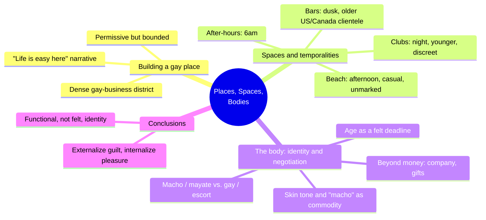
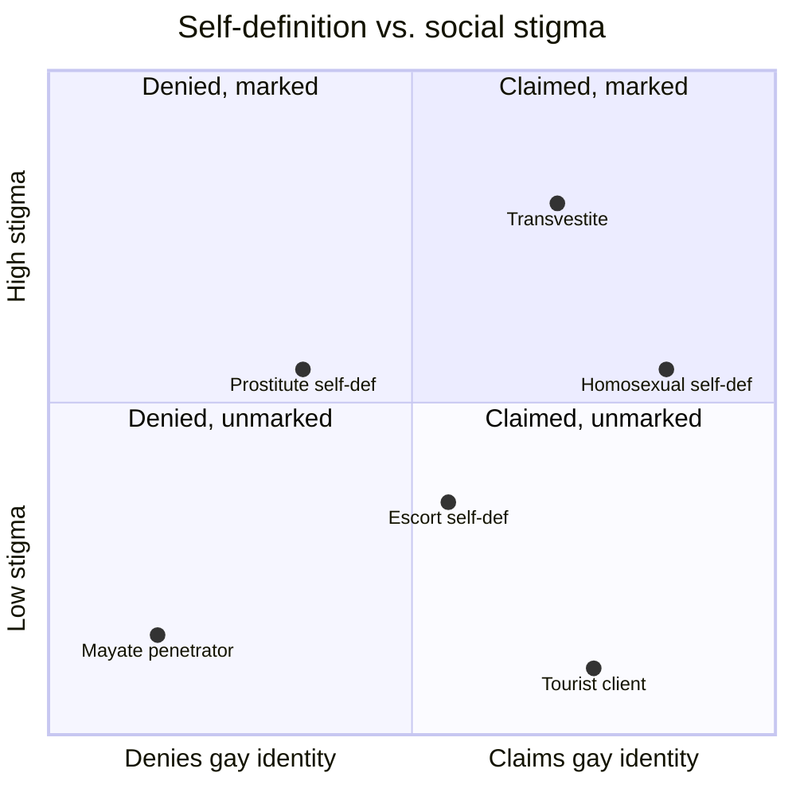
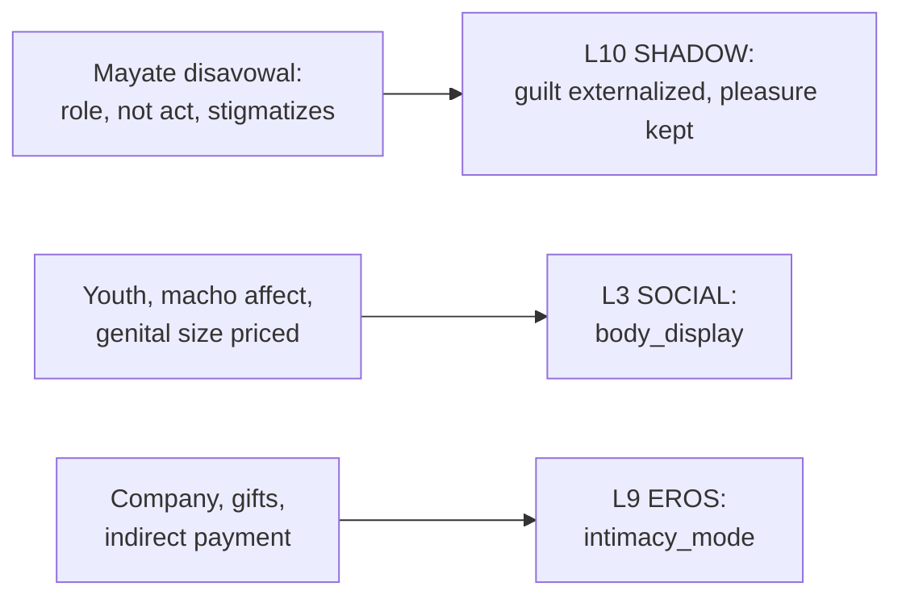

# 🧬 MSX.34 — Places, Spaces and Bodies — Mendoza (2014)
### Knowledge Entry — Distill

A short qualitative geography paper (twelve semi-structured interviews with male sex workers in Old Vallarta, plus participant observation) tracing how a specific built "gay place," a daily circuit of venues, and a body-identity economy jointly organize male-to-male sex tourism in Puerto Vallarta, Mexico.

## TABLE OF CONTENTS
- [Core Thesis](#1-core-thesis)
- [Mind Models](#2-mind-models)
- [Framework](#3-framework--structure)
- [Key Concepts](#4-key-concepts)
- [Heuristics](#5-heuristics--decision-rules)
- [Invariants](#6-invariants)
- [Pitfalls](#7-pitfalls--myths)
- [Application](#8-application)
- [Cross-References](#9-cross-references)
- [Provenance](#10-provenance--confidence)

---

## 1 · CORE THESIS

Puerto Vallarta's male sex trade runs on three linked economies: a built, densely gay-marked district that manufactures easy entry; a daily circuit (beach, dusk bar, night club) that routes different transactions to different hours and clients; and a body-identity economy where sexual role, not the act itself, decides who is stigmatized as "gay."

---

## 2 · MIND MODELS

*Required. Minimum two diagrams, maximum five.*

**Diagram 1 — the whole argument.**
Caption: *three sections build one claim in stages: the place gets constructed first, then the daily routine that plays out inside it, then the body-and-identity logic that governs who is safe and who is marked.*

**Diagram 2 — the central mechanism (the daily circuit).**
Caption: *the trade is not one venue, it is a schedule: each place routes a different register of the same transaction to a different hour and a different age of client.*

**Diagram 3 — the identity-stigma logic (a two-axis tradeoff).**
Caption: *stigma does not track the sex act, it tracks self-definition: a mayate who penetrates and claims no gay identity sits in the lowest-stigma corner, a transvestite or an openly homosexual self-definer sits in the highest.*

**Diagram 4 — mapped onto the Command's 12-layer character stack.**
Caption: *three findings, three feeds: the mayate disavowal is a shadow logic, the priced body is a display convention, and the company-over-cash pattern is an intimacy-mode texture.*

---

## 3 · FRAMEWORK / STRUCTURE

A single case-study article, structured in four moves:

1. **Theoretical framing.** Positions the paper inside critical/queer geography's long argument about whether GLT-marked urban space is liberatory (re-territorializing, visibility-producing) or market-captured (gentrifying, disciplining, eventually "cleansing" itself of the sex workers and homeless people who first made it queer).
2. **Method.** Twelve semi-structured interviews with male sex workers in Old Vallarta (October–November 2007), recruited through local NGOs, direct contact with gay-bar/hotel staff, the internet, and snowball referral from other workers; supplemented by participant observation at the beach, bars, and night clubs.
3. **Three findings sections, in order.** "Building up a 'Gay Place'" (how Vallarta became a consolidated gay destination, and why entry into sex work there reads as easy and casual); "Spaces and Temporalities" (the material, scheduled geography of where and when transactions happen); "The Body: Identity and Negotiation" (how heteronormative categories break down under macho-tradition role logic, and how the body itself becomes a priced, negotiated object).
4. **Conclusions.** Ties the three sections together: Vallarta is not oppressive in the way the broader sex-tourism literature often assumes; it is a functionally used, spatially and temporally organized scenario that interviewees pass through without claiming it, or often a gay identity, as their own.

---

## 4 · KEY CONCEPTS

| Concept | What it is | Why it matters |
|---|---|---|
| **The consolidated gay place** | Old Vallarta's roughly fifteen-minute-walk concentration of gay bars, clubs, hotels, and businesses | Density itself does work: it manufactures visibility, permissiveness, and a low-friction on-ramp into sex work that interviewees describe as something that "just happened" rather than a decision |
| **The casual-entry narrative** | Workers frame their start in prostitution as socially transmitted and unplanned ("a friend told me life was easy here") rather than as a deliberate choice | This is the paper's clearest pattern across interviews: entry reads as drift, not decision, inside a place already coded as permissive |
| **Externalized guilt, internalized pleasure** | Workers credit outside forces (friends, tourists, "the city") for their entry, while describing the work and the surrounding gay lifestyle as something they enjoy | Lets a character hold both a disclaimed origin story and a private, undenied pleasure at once, without contradiction reading as dishonesty |
| **The daily circuit** | Beach (afternoon) → bars (dusk, older clientele) → night clubs (night, younger clientele) → after-hours clubs (6am) | Male prostitution here is a work schedule tied to specific places, not a single continuous activity in one venue |
| **Mayate** | A man who has sex with men, typically as the penetrating partner, while explicitly rejecting a gay identity | The load-bearing local category: in macho-dominant Mexico, the penetrator is not considered, and is not stigmatized as, homosexual |
| **Self-definition spread** | Interviewees defined themselves variously as prostitute, escort, masseur, mayate, or transvestite, not uniformly as "prostitute" | "Prostitute" carries stigma some workers actively reject; self-definition is a real variable, not a label a writer can assign uniformly |
| **The body as priced commodity** | Clients read for youth, a dark-skinned "macho" Mexican affect, and genital size; a light-skinned worker described being less successful with American clients specifically because of his skin tone | Desirability here is a specific, culturally coded bundle, not a generic "attractive young man" default |
| **Age as a felt deadline** | Workers over 25 in this sample already called themselves "old" and stated plans to retire from prostitution | Age anxiety is economic and time-bound, not vanity; it comes with a stated (if often unmet) exit plan |
| **Beyond-cash exchange** | Some transactions run on "company," gifts, or indirect monetary help instead of a stated rate; one worker explicitly said clients "want to help" rather than simply pay | Complicates a purely transactional read of sex tourism: personality, quietness, and attentiveness are also being purchased and supplied |
| **The functional, unattached relation to place** | Interviewees related to Vallarta as a useful "scenario" for their work, without personal or identity-conferring attachment to the city itself | The place organizes their labor completely without becoming part of who they say they are |

---

## 5 · HEURISTICS & DECISION RULES

| Situation | Do this | Not this |
|---|---|---|
| Writing a sex worker character's self-definition | Give him a functional identity (mayate, escort, masseur, prostitute) independent of what he does in bed | Assume the sex act automatically determines a "gay" identity |
| Depicting entry into sex work | Write it as casual and socially transmitted ("a friend told me"), inside a place already coded as permissive | Stage a single dramatic decision-point origin scene |
| Writing a worker discussing his own job | Let him externalize the cause (friends, tourists, the city) while privately, quietly enjoying the work and its lifestyle | Force him into either a pure-victim or a pure-cynic register |
| Building a tourist-client character | Give him the documented profile: 36–50, American or Canadian, often traveling alone, seeking company or a macho encounter as much as sex | Reduce him to money-for-orgasm with no other motive |
| Choosing where a transaction-scene happens | Route it to the right hour and venue: beach (afternoon, casual, unmarked), bar (dusk, older clientele, visible flirting), club (night, younger, discreet) | Set every encounter in one generic "gay bar" |
| Writing a worker anxious about aging | Give him a self-imposed retirement age around 25 and a stated (probably unmet) future plan | Play the anxiety as vanity rather than an economic deadline |
| Writing race and skin tone between client and worker | Treat dark-skinned "macho" Mexican masculinity as the actively marketed commodity, and note that light skin can specifically cost a worker American clientele | Assume one universal, race-blind standard of desirability |
| Writing a man who has sex with men but rejects "gay" | Play it as a stable, non-stigmatized local identity (mayate) organized around role, not as closeted denial waiting to break | Flatten every such character into a closet-case arc |

---

## 6 · INVARIANTS

1. **The built environment does the sorting.** A dense, bounded gay district manufactures both visibility and a low-friction path into sex work; roughly a fifteen-minute walk holds Old Vallarta's entire gay-marked economy.
2. **Role, not the sex act, assigns stigma.** In this macho-dominant setting, the penetrating partner is not considered homosexual and is not stigmatized; the receptive partner is.
3. **Guilt is externalized, pleasure is internalized.** Interviewed workers consistently credit outside forces for their entry into sex work while privately describing the work, and the gay lifestyle around it, as enjoyable.
4. **The transaction routes by place and hour, not at random.** Afternoon beach reads casual and unmarked; dusk bars read visibly transactional with older clientele; night clubs read discreet with younger clientele.
5. **The body is priced on a specific bundle,** not a universal standard: youth, a "macho" dark-skinned affect, and genital size are the named, recurring criteria.
6. **Age is a felt deadline.** Workers in this sample treated the mid-twenties as roughly the line past which they expected to retire from prostitution.
7. **Money is necessary but not sufficient to describe the exchange.** Company, gifts, and indirect payment coexist with, and sometimes substitute for, a stated rate.
8. **Personal and work time are not kept separate for many workers;** sex work and everyday identity overlap rather than staying compartmentalized.
9. **This is a small, place-specific qualitative sample (N=12).** Its patterns describe Old Vallarta in 2007, not male sex tourism universally.

---

## 7 · PITFALLS / MYTHS

- Treating GLT/queer space as purely liberatory: the critical geography the paper cites (Toronto's gay village) shows the same density that produces visibility can later drive a "cleansing" gentrification of the sex workers and homeless people who helped constitute the space.
- Assuming "prostitute" is the natural label for every man selling sex to men; most interviewees self-defined otherwise (escort, masseur, mayate) and some explicitly rejected "prostitute" for its stigma.
- Reading a mayate as a closeted or self-hating gay man; the category functions as a stable, non-stigmatized identity inside its own cultural logic, not a way station toward coming out.
- Assuming a worker feels attached to, or defined by, his city; interviewees related to Vallarta functionally, as a working "scenario," without personal or identity-conferring attachment to the place itself.
- Flattening client desire to money and orgasm; several transactions in the study were explicitly negotiated around company, personality, and "the way they behave," not price alone.
- Assuming every client matches one "gringo" stereotype; the profile named (older, often solo, seeking company) is a documented pattern, not the only one, and clients varied in what they sought and offered.
- Reading age concern in a sex-work character as vanity; in this sample it tracked a specific, self-stated economic exit age, not a general fear of getting older.

---

## 8 · APPLICATION

- **Spine level:** L5
- **12-layer character stack:** L10 SHADOW (primary — the mayate disavowal, guilt externalized and pleasure kept, as a structural identity logic rather than self-deception); L3 SOCIAL (primary — body_display: the specific priced bundle of youth, macho affect, and genital size, reusing MSX.33's variable for a gendered-but-culturally-specific display convention); L9 EROS (supporting — intimacy_mode: company, gifts, and indirect payment as a real texture between pure transaction and relationship)
- **plot_systems:** contextual; the daily circuit (beach → dusk bar → night club → after-hours) is a ready-made scene-routing tool for any subplot involving a sex-tourism destination, and the age-25 retirement deadline is a concrete, self-imposed clock a character can be written against
- **Setting:** primary; this is a working model for how a single built "gay place" organizes visibility, permissiveness, and daily scheduling into one coherent economy, directly useful for constructing an analogous district, port, or resort inside the setting system

This is the sexuality shelf's clearest companion to the setting shelf's place-construction work: it shows a "gay place" being built and maintained through the same density-and-permission logic the setting shelf studies elsewhere, but run through bodies and sex work specifically. The load-bearing move for character work is Diagram 3: stigma in this world tracks self-definition and role, not the sex act, so a mayate penetrator and an openly gay self-definer occupy structurally different social positions even performing identical acts. That is a precise, non-cliché way to write masculinity, denial, and desire in a macho-coded setting without defaulting to a closet-case arc. The "beyond money" finding (company, gifts, "they want to help") also gives PSY.09's client-side data a face: it is exactly the kind of quasi-relationship transaction that could sit underneath PSY.09's partnered-traveler statistic.

---

## 9 · CROSS-REFERENCES

| Related entry | Relation |
|---|---|
| [[🧬 PSY.09 — Sex Tourism and HIV Risk — Harry-Hernández et al. (2019)]] | Direct empirical sibling on sex tourism, opposite lens: PSY.09 quantifies risk and health outcomes across a large survey sample; this paper supplies the qualitative interior, place, identity, and body-economy, for the same broad phenomenon in a different city |
| [[🧬 MSX.17 — Mating in Captivity — Perel (2006)]] | Perel's "bounded space of eroticism" (a zone where ordinary rules are suspended) is the clinical-theory version of what this paper shows built at city scale: Old Vallarta itself functions as a bounded, licensed zone for transactions that would read differently elsewhere |
| [[🧬 MSX.33 — The Space of Sex — Waldrep (2021)]] | Shares the bounded/licensed-space logic and the body_display variable directly; Waldrep theorizes how mainstream film stages a masked zone for transgression, this paper shows an actual city district performing the same containing function for sex tourism |

---

## 10 · PROVENANCE & CONFIDENCE

Full text read in whole: a 16-page journal article (*Athens Journal of Tourism*, Vol. 1, No. 3, September 2014, pp. 175–190), including the abstract, theoretical framing, methodology, all three findings sections, conclusions, and the full reference list. All quotes, pseudonymous interviewee details (Table 1: age, place of birth, sexual preference, self-definition, encounter places, jobs, and future plans), and venue names (Blue Chairs, Bar Los Amigos, Paco Paco, Mañana) are taken directly from the article's own text and table, not paraphrased from a secondary source.

Confidence is high for what the article itself reports: a well-described qualitative method (twelve semi-structured interviews plus participant observation, named recruitment channels, named limitations of the approach). Confidence is explicitly lower, and the article says so itself, for generalization beyond Old Vallarta in 2007: N=12 is a small, place- and period-specific sample, and the authors frame their claims as case-study findings within a larger critical-geography debate, not as population-level statistics (contrast PSY.09's N=580 survey design).

The `feeds:` keying (L10 primary, L3 primary, L9 supporting) is this distill's own synthesis against the Command's 12-layer character stack; the article itself uses no such vocabulary. The `body_display` and `shadow_content` variable names are reused deliberately from MSX.33's and other existing entries' established vocabulary for the L3/L10 layers rather than invented fresh, per the shared 12-layer character-stack schema.

## META
- Template: BVX-LEARN-v4.0
- Source classification: full-text journal article, complete read
- Created / Updated: 2026-09-29
