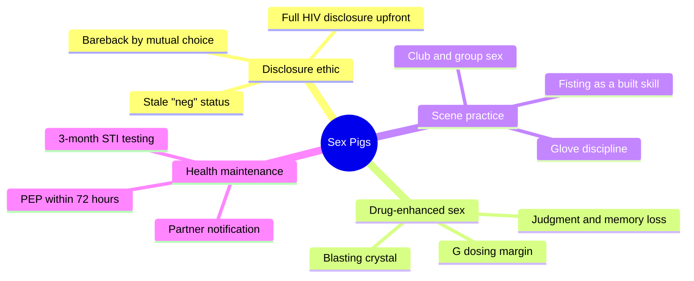
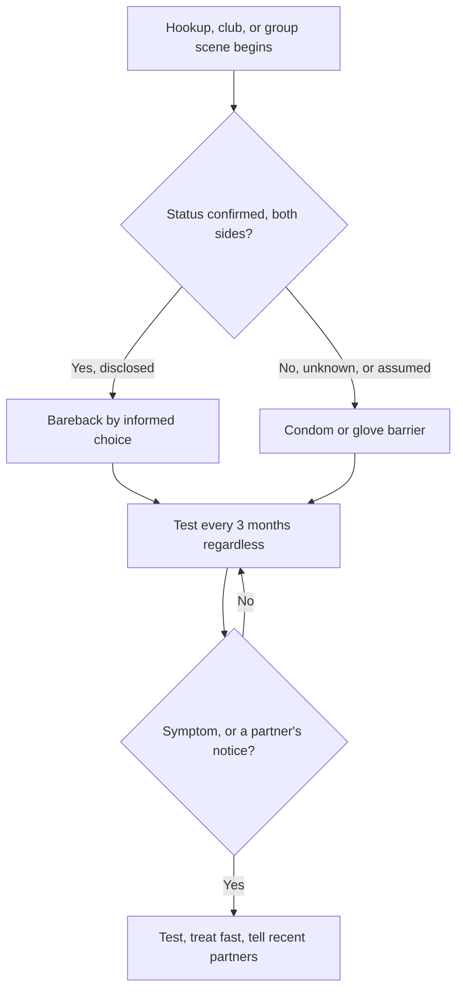
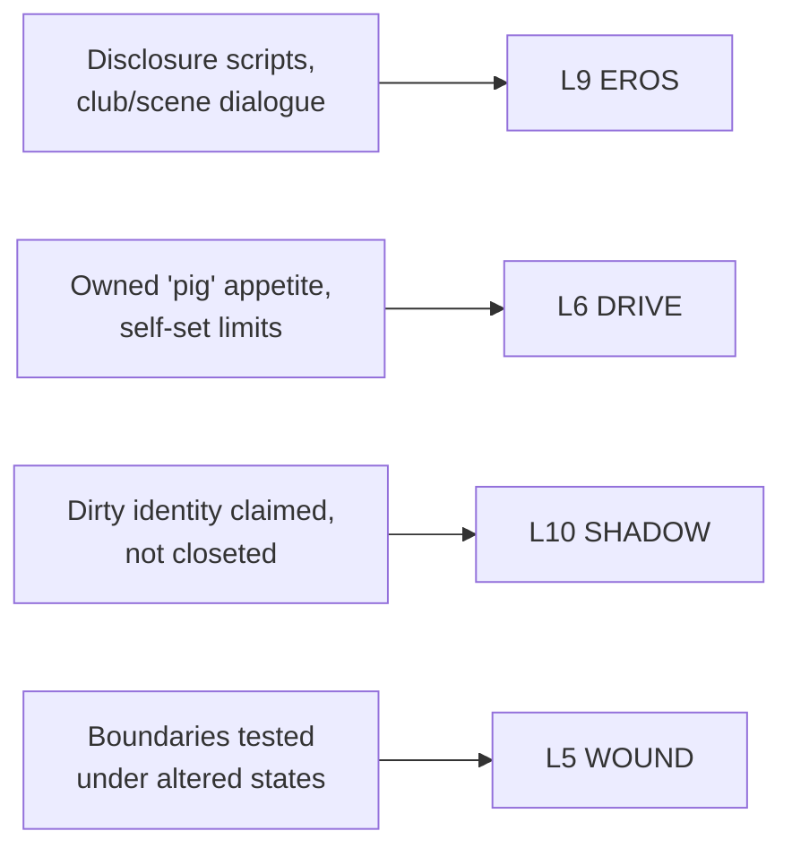

# 🧬 MSX.35 — Sex Pigs — PLWHA NSW (n.d.)
### Knowledge Entry — Distill

A short harm-reduction pamphlet from People Living with HIV/AIDS (NSW), told through six first-person gay-male sex confessions (disclosure, crystal, G, hookups, club sex, fisting) each paired with a practical "what you need to know" box; it meets men who fuck raw, high, and in groups where they already are, rather than telling them to stop.

## TABLE OF CONTENTS
- [Core Thesis](#1-core-thesis)
- [Mind Models](#2-mind-models)
- [Framework](#3-framework--structure)
- [Key Concepts](#4-key-concepts)
- [Heuristics](#5-heuristics--decision-rules)
- [Invariants](#6-invariants)
- [Pitfalls](#7-pitfalls--myths)
- [Application](#8-application)
- [Cross-References](#9-cross-references)
- [Provenance](#10-provenance--confidence)

---

## 1 · CORE THESIS

Dirty, raunchy, drug-enhanced, group and fetish sex and careful health management are not opposites: every vignette pairs a filthy scene with a plain fact (disclose status, dose carefully, test every three months) because desire needs boundaries to survive contact with reality, not less of them.

---

## 2 · MIND MODELS

*Required. Minimum two diagrams, maximum five.*

**Diagram 1 — the whole argument.**
Caption: *six confessions, six risk domains — the pamphlet is a set of scene-specific harm-reduction cards, not one continuous argument.*

**Diagram 2 — the central mechanism (the same risk-check, run before every scene).**
Caption: *every good outcome and every near-miss in the pamphlet traces back to this one loop, run or skipped.*

**Diagram 3 — mapped onto the Command's character stack.**
Caption: *the pamphlet's content lands on desire-register and drive, not on the story-spine directly — spine keys to the wound layer because boundaries are what get tested.*

---

## 3 · FRAMEWORK / STRUCTURE

Seven short sections, each a first-person confession followed by a boxed "What you need to know" list, bookended by a resource directory:

| Section | Scene | Governing risk |
|---|---|---|
| Dirty bareback fucker | Full HIV-status disclosure before barebacking | Serosorting only works if status is current and spoken |
| Blasting | Injecting crystal (slamming) for a multi-day session | Escalation of dose, partners, and self-focus; the crash |
| Cubicles and G | A club-toilet hookup interrupted by a GHB overdose | The dose/overdose margin is small |
| Hooking up | A verbatim hookup-app chat about status and bareback | Assumed status vs. disclosed status |
| Clubbing and fucking | A group scene at a sex club, naked night | "Dirty" is not itself information about status |
| Fisting | A first fisting, built up over time with a partner | Skill and lubricant beat force; glove hygiene |
| Getting the message | A text disclosing a positive gonorrhoea/chlamydia result | Regular testing and prompt partner notification |

The seven scenes are not sequential; each stands alone as a card, closed with its own boxed facts, which is why the pamphlet reads as a deck rather than a chapter book.

---

## 4 · KEY CONCEPTS

| Concept | What it is | Why it matters |
|---|---|---|
| **Full disclosure as risk strategy** | Stating HIV+ status upfront and barebacking only with other confirmed-positive partners, in place of condom negotiation | A working alternative harm-reduction model, not a lapse in caution — it substitutes verified information for a barrier |
| **Stale "neg"** | A partner's claimed negative status based on a test from months or years ago | The pamphlet's recurring failure point: negativity is a snapshot, not a standing fact |
| **Blasting (slamming)** | Injecting crystal methamphetamine specifically to intensify a sex session | Escalates session length, partner count, and self-absorption (checking who's online over who's in the room); the comedown is real cost, not incidental |
| **G's dosing margin** | The gap between an effective dose of GHB and an overdose | Described as "very small"; redosing too soon or mixing with alcohol are the two named triggers |
| **Bystander overdose protocol** | Fresh air, hydration, staying with the person; escalate to medical help if incoherent or convulsing | Venue staff in the pamphlet already know this drill — the scene treats it as routine competence, not panic |
| **"Dirty doesn't necessarily equal raw"** | The pamphlet's own correction: wanting rough, group, or watched-bareback sex says nothing about a person's HIV status | Breaks the intuitive link between kink/intensity and unprotected sex |
| **Fisting as a built skill** | Trained up with dildos and time, not attempted cold; more about width than depth | Reframes an extreme act as craft and patience rather than a stunt |
| **Glove discipline** | Changing latex gloves between partners during fisting | The specific barrier against Hepatitis C and other STIs; distinct from, and additional to, condom use |
| **Three-month testing cadence** | For men who "fuck a lot": urine sample, throat and anal swab, blood test, every three months | Catches STIs that carry no symptoms before they progress or spread |
| **Partner notification as norm** | Texting a recent partner after a positive result, matter-of-factly | Framed as ordinary courtesy, reinforced by the NSW Public Health Act's disclosure duty |
| **PEP's 72-hour window** | Post-exposure prophylaxis: a four-week course of antiretrovirals that can prevent HIV infection after a risk exposure | Time-critical; the pamphlet gives the hotline number directly because the window is the whole intervention |

---

## 5 · HEURISTICS & DECISION RULES

| Situation | Do this | Not this |
|---|---|---|
| Meeting to bareback | Confirm both your own and his HIV status explicitly | Assume "neg" means recently tested |
| Using crystal for sex | Set your dose and duration limits before starting | Let the session's own momentum decide how far it goes |
| Taking G | Wait out one dose's full effect before considering another | Redose quickly because the first hit "isn't working yet" |
| G and alcohol | Never combine them | Drink "just a bit" and use G anyway |
| Someone incoherent or seizing on G | Get medical help immediately | Assume they'll "sleep it off" |
| A hookup or scene partner's status is unstated | Ask directly, or use a barrier if you don't know | Read reassurance into their looks, venue, or vibe |
| First time fisting | Build up with dildos, lots of lubricant, and time | Go straight to a hand |
| Fisting more than one partner | Change latex gloves between each partner | Reuse gloves across partners |
| You test positive for an STI | Tell recent partners directly and plainly | Stay silent and hope it wasn't you |
| You fuck often, with multiple partners | Test every three months: urine, throat/anal swab, blood | Wait for symptoms before testing |
| You think you've had a risk exposure to HIV | Call the PEP line inside 72 hours | Wait to see if symptoms appear |

---

## 6 · INVARIANTS

1. **Disclosed status protects better than assumed status.** Every vignette that goes wrong in the pamphlet turns on an assumption, never on a lie told to the reader's face.
2. **Altered states are where boundaries get tested, not suspended.** "Know your boundaries and stick to them, even when you're on drugs" recurs because intoxication is treated as the actual test condition.
3. **The GHB dose/overdose margin is narrow, and alcohol narrows it further,** regardless of a person's claimed tolerance or experience.
4. **Desire for rough, group, or bareback-watching sex carries no information about serostatus either way.** Intensity of want and HIV status are independent variables.
5. **Regular testing sits under every practice described, including disclosure-based barebacking.** Confirmed-positive couples are still told to keep testing for other STIs.
6. **Partner notification is a community norm with legal backing,** not merely an individual kindness — the NSW Public Health Act requires disclosure of a sexually transmissible condition before sex.

---

## 7 · PITFALLS / MYTHS

- Treating a partner's stated interest in "everything dirty" as itself a disclosure of HIV status.
- Reading silence on a hookup profile as reassurance rather than as missing information.
- Assuming last year's, or "last time I got tested," negative result still holds today.
- Separating condom use from drug sobriety as unrelated questions — the pamphlet keeps returning to how drugs specifically erode the boundary-keeping that safer sex depends on.
- Mistaking "dirty" as a euphemism for "unprotected" — corrected directly in the text: dirty doesn't necessarily equal raw.
- Skipping regular testing because no symptoms have shown — several of the infections named are explicitly asymptomatic.

---

## 8 · APPLICATION

*Prose carries the why; `feeds:` carries the wiring (D3). Both required, neither redundant.*

- **Spine level:** L5 (per BOLO 88's binding for this batch) — the pamphlet's material is boundary-under-pressure material: every scene tests a stated limit against an altered state or an unverified assumption, which is what a WOUND-layer entry is for.
- **12-layer character stack:** L9 EROS primary (verbatim scene vocabulary and disclosure choreography for gay male hookup, club, and group-sex dialogue); L6 DRIVE supporting (the "pig" appetite framed as an owned drive with a self-set governor, not a symptom); L10 SHADOW contextual (a dirty/pig identity claimed and eroticized rather than closeted).
- **plot_systems:** none direct.
- **Setting:** none direct, but the pamphlet is a strong community-texture source: cruising club floor-plans (hallways, cubicles, naked nights), drug-culture register (blasting, G, the comedown), and an authentic hookup-app chat transcript a writer can steal the rhythm of rather than invent from scratch.

Practically, this entry is less a theory source than a register and protocol source: it gives a writer the actual sentences gay men use to disclose status, decline or accept a scene, and manage a friend through a G overdose, plus the specific harm-reduction facts (dosing margins, glove changes, testing cadence, the 72-hour PEP window) that keep a "dirty and dark" sex scene or character honest rather than either sanitized or reckless on the page.

---

## 9 · CROSS-REFERENCES

| Related entry | Relation |
|---|---|
| [[🧬 MSX.17 — Mating in Captivity — Perel (2006)]] | Contrast pair — Perel's long-term-couple desire paradox (distance sustains want) sits beside this pamphlet's casual-scene harm reduction (disclosure sustains safety); different relationship shapes, same insistence that structure, not suppression, is what makes desire survivable |
| [[MSX.24]] | Florêncio, "Bareback Porn, Porous Masculinities, Queer Futures: The Ethics of Becoming-Pig" (2020) — distilled as MSX.24, the theoretical sibling; reads the same "pig" identity this pamphlet lives inside as a scholarly object, theory counterpart to this entry's field voice |

---

## 10 · PROVENANCE & CONFIDENCE

Full text read whole: the source is an 18 KB / ~20-page community harm-reduction pamphlet (People Living with HIV/AIDS NSW, "Sex Pigs — a rough guide to dirty sex"), plain enough to read cover to cover rather than sample. No publication year appears anywhere in the text, front matter, or credits (concept: Kathy Triffitt; editor: Glenn Flanagan; photos: Jamie Dunbar; printed by Crackerjack Communications) — `year: n.d.` is asserted rather than found, per the instruction to take title/author/year from the text itself and no further. A handful of pull-quote call-out boxes extracted from the source PDF as scrambled character runs (a layout artifact of stacked/rotated decorative text, not body copy); their plain-language equivalents survive intact in the adjacent "What you need to know" boxes and are what this distill draws on. Confidence set to medium: the source is a grassroots field pamphlet, not a clinical or peer-reviewed text, undated, and thin enough (six short vignettes) that this distill sits near the floor of what a `complete` status can carry — flagged honestly per the tasking rather than padded.

## META
- Template: BVX-LEARN-v4.0
- Source classification: full-text, community harm-reduction pamphlet, complete read
- Created / Updated: 2026-09-29
