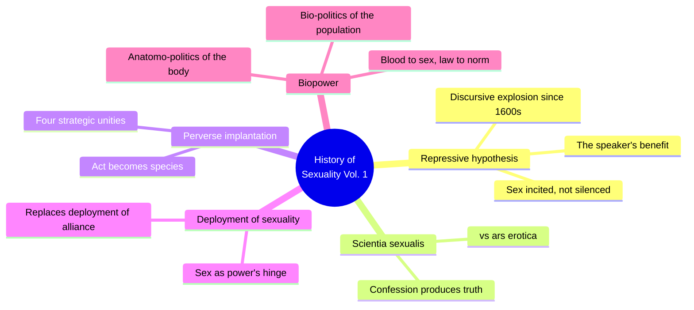
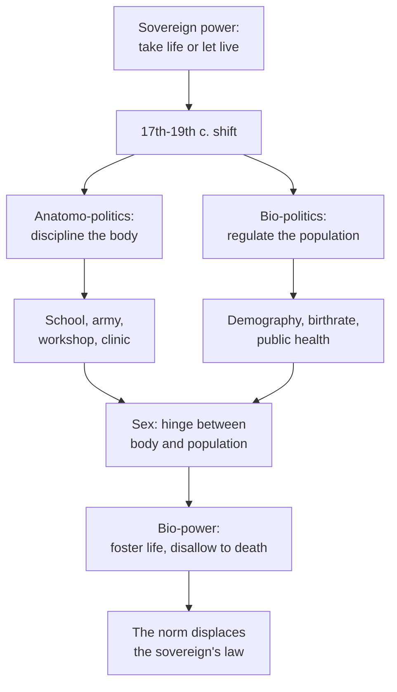
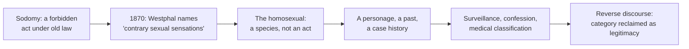
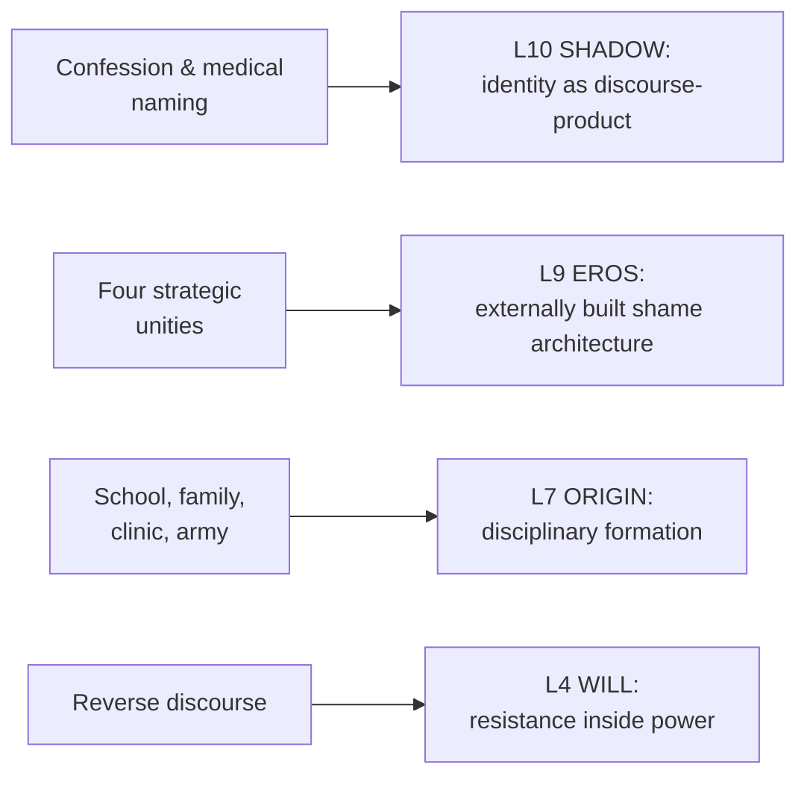

# 🧬 MSX.36 — The History of Sexuality — Foucault (1978)
### Knowledge Entry — Distill

Foucault's 1976 essay, translated into English by Robert Hurley in 1978, is the founding text of the claim that the history of sexuality is a history of power. It dismantles the idea that the modern West repressed sex and replaces it with an account of how discourse, confession, and biopower manufactured sex as an object of truth and identity.

## TABLE OF CONTENTS
- [Core Thesis](#1-core-thesis)
- [Mind Models](#2-mind-models)
- [Framework](#3-framework--structure)
- [Key Concepts](#4-key-concepts)
- [Heuristics](#5-heuristics--decision-rules)
- [Invariants](#6-invariants)
- [Pitfalls](#7-pitfalls--myths)
- [Application](#8-application)
- [Cross-References](#9-cross-references)
- [Provenance](#10-provenance--confidence)

---

## 1 · CORE THESIS

Modern societies did not silence sex; they built a machinery that incites, classifies, and confesses it, manufacturing "sex" itself as a secret each of us must decode to find our truth. That machinery runs on two fused techniques: discipline of the individual body and regulation of the population's life — biopower.

---

## 2 · MIND MODELS

*Required. Minimum two diagrams, maximum five.*

**Diagram 1 — the whole argument.**
Caption: *five moves, one throughline — a repression story gets replaced by a production story, and biopower is the engine that makes the production story run.*

**Diagram 2 — the central mechanism (biopower's bipolar technology).**
Caption: *power over life runs two tracks at once — drilling the individual body and managing the population's vital statistics — and sex is the single target wired into both tracks, which is why it became the norm's obsession where law's had been the crime.*

**Diagram 3 — the perverse implantation (act into species).**
Caption: *naming an act into a species cuts both ways — it hands power a permanent target to surveil, and it hands the named group a ready-made vocabulary to fight back with.*

**Diagram 4 — mapped onto the Command's 12-layer character stack.**
Caption: *four Foucault mechanisms land on four layers cleanly: naming builds SHADOW, the four unities build EROS's shame rules, disciplinary institutions build ORIGIN, and reverse discourse is WILL resisting from inside the field of power, not from outside it.*

---

## 3 · FRAMEWORK / STRUCTURE

Five parts, each dismantling one piece of the repression story and replacing it with a production story:

| Part | Governing move |
|---|---|
| I. We "Other Victorians" | States the repressive hypothesis as everyone tells it, then flags the "speaker's benefit": claiming sex is silenced lets the speaker feel transgressive just by talking about it |
| II. The Repressive Hypothesis | Ch. 1: since the 17th century, sex was talked about more, not less, through pedagogy, medicine, demography, criminal justice. Ch. 2, The Perverse Implantation: discourse didn't exclude "peripheral sexualities," it multiplied them, naming the sodomite's act into the homosexual's species |
| III. Scientia Sexualis | The West's method for producing the truth of sex is confession, not the initiated pleasure-accumulation of an *ars erotica* |
| IV. The Deployment of Sexuality | Lays out Foucault's theory of power: relational, productive, exercised from everywhere, not held by a sovereign. Names the "deployment of alliance" (kinship, law) being supplemented by a newer "deployment of sexuality" (body, discipline, pleasure), and the four strategic unities that manufactured sexuality as an object |
| V. Right of Death and Power over Life | The payoff chapter: traces the shift from sovereign power (the right to kill) to biopower (the power to foster life or disallow it to death), naming the two poles, anatomo-politics of the body and bio-politics of the population, that constitute it |

---

## 4 · KEY CONCEPTS

| Concept | What it is | Why it matters |
|---|---|---|
| **Repressive hypothesis** | The received story that a Victorian-onward West silenced, taboo'd, and censored sex | Foucault's target, not his conclusion. He asks not "why are we repressed?" but "why do we insist, with such passion, that we are?" Talking about sex feels like defying power, so the discourse of repression rewards and reproduces itself |
| **Discursive explosion** | Since the 17th century, church confession, pedagogy, medicine, demography, and criminal law multiplied talk about sex rather than silencing it | The book's founding empirical claim: apparent silence, a policed vocabulary, coded propriety, coexisted with an enormous rise in specialized discourse |
| **Ars erotica vs. scientia sexualis** | Two methods for producing truth about pleasure: erotic art (China, Japan, India, Rome), where truth is drawn from pleasure itself and transmitted secretly, master to disciple, versus the West's science of sex, where truth is extracted through confession | The West has no secret-initiation tradition of pleasure. It has an apparatus for extracting confessions and calling the result truth |
| **Confession** | Since the Lateran Council of 1215, the West's central ritual for producing truth: one confesses crimes, sins, thoughts, desires, illness, to parents, doctors, lovers, oneself | Confession is not a report on a pre-existing truth. The obligation to confess, and the expectant listener, shape what gets produced as "the truth" |
| **The perverse implantation** | 19th-century power did not try to eliminate peripheral sexualities; it proliferated and specified them into new names, new categories, new "species" of pleasure | Four operations: propagation rather than decrease, specification of individuals, a whole technology of surveillance, and a "sensualization of power" where pleasure feeds back into the power that watches it |
| **"The homosexual was now a species"** | Before 1870, sodomy was a forbidden *act*, its perpetrator a juridical subject like any other. Westphal's 1870 article on "contrary sexual sensations" is the homosexual's "date of birth" as a *type of person*, a personage, a past, a case history, a childhood | The clearest statement in the book of how a sexual identity is manufactured by naming, not discovered pre-existing. The template for how any "kind of person" gets invented by a discourse |
| **Deployment of alliance vs. deployment of sexuality** | Alliance is the older system of marriage, kinship, and transmitted names and possessions, organized by law. Sexuality is the newer system organized around the body, discipline, and the production of pleasure and truth | Sexuality supplements alliance rather than simply replacing it, but it is the deployment that produced "sex" as an object of knowledge |
| **Four strategic unities** | Hysterization of women's bodies; pedagogization of children's sex; socialization of procreative behavior; psychiatrization of perverse pleasure | The four concrete 19th-century mechanisms that manufactured sexuality, each yielding a "privileged object": the hysterical woman, the masturbating child, the Malthusian couple, the perverse adult |
| **Power as relational, not substantive** | Power is not an institution or a possession; it is "the name one attributes to a complex strategical situation," exercised from innumerable points | Foucault's anti-juridical model: power is not seized or held, it circulates. "Power comes from below," not only from a sovereign or a ruling class |
| **Reverse discourse** | The same vocabulary that pathologized homosexuality (species, inversion, psychic hermaphrodism) was picked up by homosexuals themselves to demand legitimacy, "often in the same vocabulary" | Resistance works from inside the categories that subordinated it. There is no clean outside to speak from |
| **Anatomo-politics / bio-politics** | The two poles of biopower: anatomo-politics disciplines the individual body (schools, barracks, workshops); bio-politics regulates the population (birthrate, mortality, life expectancy, public health) | Sex sits at the hinge of both at once, a body-level discipline problem and a population-level regulation problem, which is why it became the 19th century's obsessive target |
| **From blood to sex, from law to norm** | Sovereign societies spoke through blood (lineage, the sword); modern societies speak through sex (health, progeny, the vitality of the social body) | The matching shift in mechanism: law's weapon is death. A power that administers life instead needs continuous regulatory and corrective mechanisms, the norm rather than the sword |

---

## 5 · HEURISTICS & DECISION RULES

| Situation | Do this | Not this |
|---|---|---|
| Writing a "coming out" or identity-realization scene | Show the character's sense of a fixed sexual self as a category absorbed from discourse around them (clinical, familial, religious) | Write it as excavating a hidden natural truth that was always simply there, waiting to be found |
| Writing an institution (school, clinic, prison, barracks) disciplining bodies | Render its power as productive: case files, categories, confessions, vocabularies of deviance | Write institutional power as only saying no, banning, or silencing |
| Writing a "repressed" or puritanical society or era | Show speech about sex proliferating in coded, institutional registers even where the surface looks silent | Assume silence means absence; a repressive-looking surface is usually where the discursive explosion hides |
| Writing a doctor, priest, or interrogator extracting a confession | Render confession as a technology that produces the truth it claims only to uncover | Write confession as a neutral window onto a pre-existing truth |
| Building a queer or stigmatized community or subculture | Give it a reverse discourse: reclaiming the same terms that pathologized the group to demand legitimacy | Invent an entirely separate vocabulary untouched by the discourse that first named them |
| Writing institutional control over a population (an empire, a school, a cult) | Split it into two registers, discipline of individual bodies and regulation of the population as a whole, hinged on sex | Write "control" as one undifferentiated force with no body/population distinction |
| Naming or diagnosing a character's sexuality in-world | Treat naming as a power move that manufactures a permanent "species" with real consequences | Treat naming as neutral description with no lasting effect on the character |

---

## 6 · INVARIANTS

1. **Discourse about sex multiplies power's grip on it; it is not simply silence's opposite.** Talking, confessing, and classifying are themselves exercises of power, not escapes from it.
2. **Confession, not initiated pleasure, is the West's method for producing sexual truth.** There is no Western *ars erotica*; there is an apparatus for extracting admissions and calling the result truth.
3. **Naming a practice into an identity is an exercise of power, not passive description.** The 1870 birth of "the homosexual" as a species is the paradigm case; the same mechanism generalizes to any invented "kind of person."
4. **Power operates positively — inciting, classifying, intensifying — at least as much as it prohibits.** The 19th century multiplied and specified "peripheral sexualities" rather than eliminating them.
5. **Power has no single source; it is exercised from innumerable points and comes from below.** There is no headquarters, no ruling class alone directing the entire network.
6. **Wherever there is power there is resistance, immanent to it, never simply outside it.** Reverse discourse is the proof: the pathologized reclaim the pathologizing vocabulary itself.
7. **Modern power's default technology is the norm (medical, statistical, pedagogical), not the sovereign's law.** Law persists but increasingly operates as one more normalizing apparatus among others.
8. **Sex sits at the hinge between the discipline of individual bodies and the regulation of populations.** This double location is why sex, specifically, became biopower's central target.

---

## 7 · PITFALLS / MYTHS

- Treating "the Victorians repressed sex" as a settled historical fact rather than the thing Foucault puts in question.
- Assuming more talk about sex equals more freedom; a "liberation" sermon can be another chapter of the same discourse it claims to escape.
- Treating any sexual identity, "the homosexual" or any other named category, as a timeless natural kind rather than a datable clinical invention (Westphal, 1870).
- Confusing psychoanalysis's law-and-desire framework with the only possible model of sexuality; Foucault treats it as one historically bound response, not the final truth.
- Reading power only as repression, law, or the sword, and missing its productive, everywhere-and-nowhere operation.
- Imagining resistance as one grand Refusal located outside power, rather than a plurality of local, uneven resistance points working from inside the same field.
- Collapsing biopower into "state control" alone; it runs through family, medicine, pedagogy, and statistics as much as through government.
- Stopping at "sex is repressed, power is its enemy." Foucault's real move: even the idea of "sex" as a single hidden essence is a product of the deployment of sexuality.

---

## 8 · APPLICATION

- **Spine level:** L5
- **12-layer character stack:** L10 SHADOW (primary — the perverse implantation and reverse discourse show identity-as-species being manufactured by naming, not excavated); L9 EROS (primary — the four strategic unities are concrete external levers that build a character's shame architecture and satisfaction rules before any adult desire scene); L7 ORIGIN (supporting — anatomo-politics names the exact institutions, school, army, clinic, family, that do a character's disciplinary formation); L4 WILL (contextual — reverse discourse is a specific resistance mode, built from inside the categories that subordinated the character, not from a clean outside)
- **plot_systems:** contextual — institutions that manufacture identity categories and case-histories (a clinic, a school's disciplinary file, a court) are ready-made antagonist-machinery; the "four operations" of the perverse implantation (propagate rather than exclude, specify the individual, install surveillance, sensualize power) is a reusable scene-engine for any institution processing a stigmatized character
- **Setting:** contextual, the anatomo-politics/bio-politics split (discipline of the individual body vs. regulation of the population) is a direct blueprint for a fictional institution's control apparatus: a school, an empire, a cult, a company town. This is where BOLO 80's theme work leans hardest, since biopower gives a concrete two-track mechanism, individual drilling plus population management hinged on sex, rather than a vague "the system controls people." Dovetails with, but does not formally feed, the SETTING-shelf's S4 LAW and S8 HABIT layers already opened by [[BVX.0458]]

Foucault's real usefulness for a writer building gay and bi men's sexuality and lives into a character system is not a theory of desire itself (Perel and Waldrep carry that weight elsewhere on this shelf) but a theory of how a society manufactures the categories a character then has to live inside or against. A disciplinary institution such as a school drills bodies, keeps files, and sexualizes childhood, and in doing so can manufacture the very "species" of identity a character later discovers, confesses, or reclaims. Writing a character's sexual self-understanding as a historically specific discourse-product, not a timeless truth waiting under the repression, is the single most transferable move here. It also powers a reverse-discourse arc directly: a character who takes the label used to diagnose or exclude them and turns it into a claim of legitimacy and community.

---

## 9 · CROSS-REFERENCES

| Related entry | Relation |
|---|---|
| [[🧬 MSX.17 — Mating in Captivity — Perel (2006)]] | Perel's "bounded space of eroticism" (ordinary rules suspended so desire can operate) is a clinical, present-day cousin of Foucault's confession-and-normalization apparatus — Perel describes desire's psychology inside the system this book explains the historical construction of |
| [[🧬 MSX.33 — The Space of Sex — Waldrep (2021)]] | Waldrep's "bounded, licensed space" (a masked frame that lets transgression happen safely) is a craft-level instance of Foucault's larger claim that power organizes zones where sex can be produced, watched, and contained rather than simply forbidden |
| [[BVX.0458]] | The Command's founding SETTING-shelf distill; this entry's anatomo-politics/bio-politics split is a ready-made mechanism for that shelf's S4 LAW and S8 HABIT layers (how an institution's control apparatus actually works), though not formally fed here |

---

## 10 · PROVENANCE & CONFIDENCE

Full text, pdftotext extraction, 161pp. Title page confirms: Michel Foucault, *The History of Sexuality, Volume 1: An Introduction*, translated from the French by Robert Hurley, Pantheon Books, New York, English translation copyright 1978, originally published as *La Volonté de savoir*, Éditions Gallimard, 1976. Read in full: Part One, "We 'Other Victorians'" (the repressive hypothesis stated, the speaker's-benefit argument); the second half of Part Two, Chapter 2, "The Perverse Implantation" (the four operations of power on peripheral sexualities, the full "homosexual as species" passage); roughly the first third of Part Three, "Scientia Sexualis" (the *ars erotica* vs. *scientia sexualis* distinction, confession's history, Charcot's Salpêtrière example); Part Four's "Method" chapter in full (the definition of power, "power is everywhere," "power comes from below," resistance as immanent to power) and most of "Domain" (the four strategic unities, deployment of alliance vs. deployment of sexuality); Part Five, "Right of Death and Power over Life," in full (sovereign right to kill vs. biopower's right to foster life, anatomo-politics and bio-politics, blood to sex, law to norm, and the closing pages on bodies and pleasures).

Sampled or not directly read: most of Part Two, Chapter 1, "The Incitement to Discourse"; the middle and later portions of Part Three (racism-and-eugenics material); Part Four's "Objective" and "Periodization" chapters (the "four privileged objects of knowledge" was captured from its restatement inside "Domain"). Index and back matter were skimmed only to locate terms. This is a deliberate scope cut toward the brief's four named targets, repressive hypothesis, scientia sexualis, the homosexual as species, biopower; those sections were read in full or near-full at the cost of the book's more purely historiographic stretches.

The `feeds:` keying (L10 primary, L9 primary, L7 supporting, L4 contextual) is this distill's own synthesis against the Command's 12-layer character stack; Foucault's text uses none of that vocabulary. The `spine: [L5]` value follows the assigning brief's explicit instruction.

## META
- Template: BVX-LEARN-v4.0
- Source classification: full-text pdftotext extraction, deep read on Parts One and Five plus targeted sections of Parts Two through Four, sampled on the remainder
- Created / Updated: 2026-09-29
