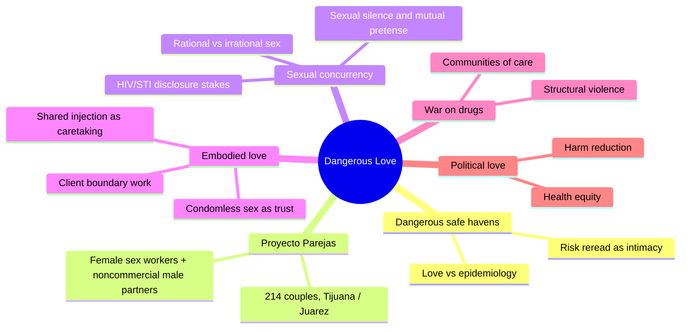
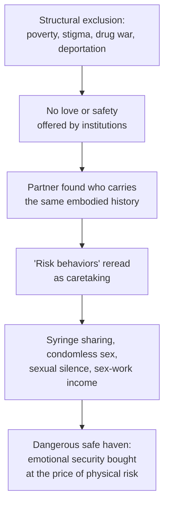
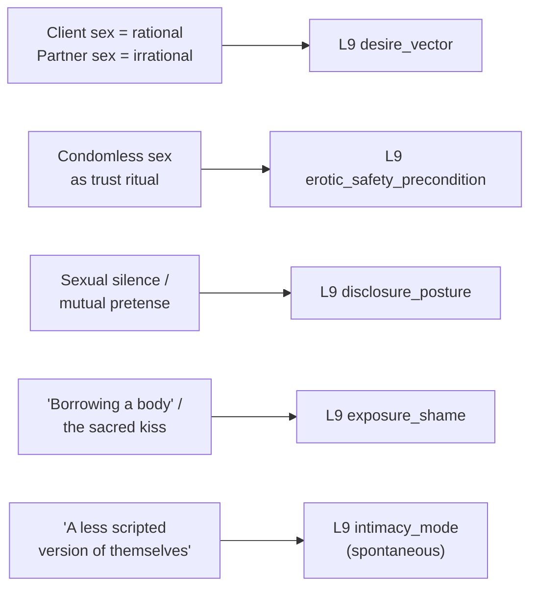

# 🧬 MSX.37 — Dangerous Love — Syvertsen (2022)
### Knowledge Entry — Distill

An anthropological ethnography of seven couples drawn from Proyecto Parejas, a 214-couple NIH-funded HIV/STI study of female sex workers and their noncommercial male partners in Tijuana. Its central move: behaviors public health scores as "risk" — condomless sex, shared syringes, silence about clients — are read from inside the relationship as the concrete vocabulary of love.

## TABLE OF CONTENTS
- [Core Thesis](#1-core-thesis)
- [Mind Models](#2-mind-models)
- [Framework](#3-framework--structure)
- [Key Concepts](#4-key-concepts)
- [Heuristics](#5-heuristics--decision-rules)
- [Invariants](#6-invariants)
- [Pitfalls](#7-pitfalls--myths)
- [Application](#8-application)
- [Cross-References](#9-cross-references)
- [Provenance](#10-provenance--confidence)

---

## 1 · CORE THESIS

Among Tijuana sex workers and their noncommercial male partners, behaviors public health labels as "risk" — condomless sex, shared syringes, silence about clients — function inside the relationship as the concrete vocabulary of trust and care. Couples build "dangerous safe havens": intimacy is not undermined by structural violence and outside sex, but forged from managing both together.

---

## 2 · MIND MODELS

*Required. Minimum two diagrams, maximum five.*

**Diagram 1 — the whole argument.**
Caption: *one field study, five interlocking claims — love is read through the body, the couple, and the political economy at once, never through any single one alone.*

**Diagram 2 — the central mechanism (how structural exclusion converts into "risk-as-intimacy").**
Caption: *the same practices public health flags as risk factors are the mechanism the relationship runs on — a writer needs both readings of the same scene held at once, not swapped in sequence.*

**Diagram 3 — mapped onto the Command's L9 EROS fields.**
Caption: *five ethnographic mechanisms key cleanly to five L9 fields — three of them primary, because this source gives working models rather than gestures.*

---

## 3 · FRAMEWORK / STRUCTURE

Seven core narrative chapters, built from serial interviews, participant observation, and a photovoice project (partners given cameras to document their own lives), layered onto the quantitative Parejas cohort data:

| Section | Focus |
|---|---|
| Introduction: Dangerous Safe Havens | States the book's central concept — sex workers' intimate relationships as spaces where HIV-risk behaviors double as meaningful acts of love and care |
| 1. Parejas | Historical and structural context of Tijuana's Red Light District; origins of the Proyecto Parejas study |
| 2. Where Sex Ends and Emotions Begin | Two composite couples (Lucia/Jaime, Julieta/Mateo); sexual concurrency, sexual silence, HIV/STI disclosure |
| 3. Love in a War Zone | Couples whose homes function as picaderos (shooting galleries) amid the drug war; communities of care beyond the dyad |
| 4. Rewriting Risk | Cindy and Beto; love as embodied practice — shared injection, condomless sex, client boundary work |
| 5. (Not) Lost to Follow-Up | Two US women's incomplete, harder-to-capture relationships; methodological reflection on what research can and can't retain |
| Conclusion: Love as a Pathway to Health Equity | Political love and harm reduction as a reframe for public-health policy and practice |

---

## 4 · KEY CONCEPTS

| Concept | What it is | Why it matters |
|---|---|---|
| **Dangerous safe haven** | A relationship in which HIV-risk behaviors (unprotected sex, syringe sharing, sex work) simultaneously endanger and protect both partners, functioning as their primary source of emotional security | The book's organizing frame: danger and safety are not opposites here, they are the same practice read from two angles |
| **Sexual concurrency** | Overlapping sexual relationships (a primary partner plus clients and/or outside partners), normally studied only as an HIV-transmission risk factor | Reframed as a social phenomenon with its own emotional logic, not merely an epidemiological hazard |
| **Sexual silence / mutual pretense** | A couple's shared, unspoken strategy of not asking and not telling about clients or outside partners, preserving an "illusion of fidelity" both people actively maintain | Silence is active co-production, not passive ignorance or one-sided deception |
| **Rational vs. irrational sex** (Carrillo) | Sex "without love and total surrender," done for money or pleasure (rational), versus sex as full emotional surrender to a loved partner (irrational) | Gives desire two non-competing tracks a character can run at once; outside sex doesn't have to threaten the primary bond in the participants' own accounting |
| **Embodiment / the "mindful body"** | Emotions and social conditions inscribed directly onto the body — track marks, scarring, injection rituals — as one continuous material and emotional record | Grounds intimacy in shared bodily history rather than only in words; explains why partners who share visible marks of hardship "understand each other from the beginning" |
| **Situated rationality** | Prioritizing the relationship's immediate socioemotional security over the "logically rational" avoidance of long-term disease risk | Explains condomless sex and syringe sharing as reasoned choices within the actual conditions of scarcity, not ignorance or recklessness |
| **Client hierarchy as harm reduction** | Women rank clients by risk (one-time strangers worst, known regulars safest) and manage the social risk of a regular client "falling in love" with them | An autonomous, skill-based practice — women's own client-selection measurably lowered HIV/STI rates for themselves and their partners in the underlying cohort data |
| **The dissociative boundary** | Sex work performed by mentally "leaving" the body ("borrowing a body") while reserving specific acts (a kiss) as "sacred," exclusive to the loved partner | A precise, legible boundary-marking technique for keeping a work self and an intimate self from bleeding into each other |
| **Political love** | Love reframed as a lens for policy and research ethics, not only a private feeling — a basis for harm-reduction and health-equity programming | The book's second intervention: interpersonal love scaled up into a political and methodological stance |

---

## 5 · HEURISTICS & DECISION RULES

| Situation | Do this | Not this |
|---|---|---|
| Writing a sex worker character's client relationships | Give her an active, specific rule-set (what's for sale, what's reserved, how she manages the risk of a client's feelings) | Write all client contact as uniformly degrading or uniformly neutral, with no internal boundary logic |
| Writing a couple's discretion about outside sex | Show it as a co-produced silence — both partners quietly not asking, not telling, to protect what they have | Write it as one partner's unilateral deception of an unsuspecting victim |
| Writing a shared risky intimacy (unprotected sex, shared needles, pooled money) | Let the risk itself be the thing the characters are offering each other as proof of trust | Frame the behavior only as recklessness, ignorance, or codependency |
| Writing a character who strays outside a primary relationship under economic or structural pressure | Root it in restoring dignity, agency, or masculinity rather than dissatisfaction with the partner | Treat any infidelity as automatic evidence the primary relationship has failed |
| Depicting a relationship formed out of shared trauma or addiction | Let the shared wound be the actual basis of the bond, understood instantly, not an obstacle real love has to overcome | Write addiction or trauma as something love must clear away before it can "really" exist |
| Writing a scene meant to prove a couple's real intimacy | Give them a moment of unscripted play or private myth-making that breaks from their managed, presentable performance of partnership | Signal intimacy only through declarations of love or through sex scenes |
| Writing a partner accepting personal risk for the other's sake | Make the calculation explicit — whose consequence is worse (arrest, incarceration, violence) if the risk isn't absorbed by this partner | Present risk-taking as symmetrical or unexamined between partners |

---

## 6 · INVARIANTS

1. **Behaviors labeled "risk" from outside a relationship can function inside it as the concrete vocabulary of trust and care.** The label and the lived meaning are not the same fact.
2. **Disclosure is titrated, not binary.** Sexual silence is an actively maintained mutual pretense both partners uphold together, not simply one partner's deception of the other.
3. **Sex sought outside a primary relationship and sex within it can run on separate, non-competing logics** (rational/pleasure vs. irrational/emotional surrender) without either one threatening the other, in the participants' own accounting.
4. **Partners accept personal risk asymmetrically to protect each other from a worse structural risk** — a partner absorbs a physical danger (sex work, unsafe injection) specifically to keep the other out of a harsher one (arrest, incarceration).
5. **Emotional security and physical safety are different axes.** Under scarcity, characters will trade one for the other, and the trade is legible as care, not just as failure.
6. **Shared embodied history creates instant legibility between partners** ("we understood each other from the beginning, because we had similar lives") that a relationship without that shared history does not have access to.

---

## 7 · PITFALLS / MYTHS

- Reading sex worker/partner relationships as inherently coercive "pimp-prostitute" arrangements — this erases the far more common freelance, autonomous, love-based reality the ethnography documents.
- Treating condom use or non-use inside an intimate relationship as a rational health calculation — the data show these choices are governed by relational meaning first, epidemiological logic second.
- Assuming infidelity in a precarious or marginalized relationship automatically signals its failure or the absence of love — the source repeatedly shows fidelity to the primary bond persisting alongside outside sex, "failing at fidelity doesn't mean failing in love."
- Writing structural violence (drug war, deportation, poverty, policing) as inert backdrop rather than the actual mechanism that manufactures both a couple's risk-taking and their intimacy.
- Presenting sex work as uniformly either empowering or degrading — the women here hold a clear money-motive and a clear emotional-boundary practice simultaneously, without collapsing into either single narrative.
- Missing that competence, not just victimhood, is often the operative frame: women's own client-selection strategies measurably lowered HIV/STI risk for themselves and their partners in this cohort.

---

## 8 · APPLICATION

- **Spine level:** L5
- **12-layer character stack:** L9 EROS (primary: desire_vector, the rational/irrational sex split as a two-track, non-competing desire architecture; primary: erotic_safety_precondition, condomless sex functioning as the trust ritual rather than something trust merely permits; primary: disclosure_posture, sexual silence as a co-produced mutual pretense; supporting: exposure_shame, the dissociative work/intimate boundary and the reserved "sacred" act; contextual: intimacy_mode, unscripted storytelling as the tell for genuine closeness against managed performance). Touches L6 drive_texture (Jaime's outside sex as masculinity/dignity restoration under economic pressure) and L11 growth_requirement (the dangerous safe haven as the bounded relational space where both partners' survival needs are met) without being formally fed at those layers here.
- **plot_systems:** contextual — the "dangerous safe haven" trade-off (emotional security bought at the price of physical risk) is a directly reusable relationship-under-siege engine for a plot pairing lovers whose intimacy is inseparable from the danger they share
- **Setting:** contextual — Tijuana's Red Light District under drug-war conditions is a strong worked model for a setting where a community's intimacy practices are shaped by structural violence, policing, and stigma; dovetails with, but does not formally feed, the SETTING SLICE's S4 LAW and S8 HABIT layers already opened by [[BVX.0458]]

The book's real usefulness for a writer building sex work and desire into a character system is that it gives working, citable mechanics for things usually left vague: how a person keeps a client's body and a partner's body governed by different rules without confusion, how two people jointly build and maintain a silence rather than one deceiving the other, and how a dangerous shared practice can be the trust ritual itself rather than something trust merely tolerates. Read against [[🧬 MSX.17 — Mating in Captivity — Perel (2006)]], the throughline is structural rather than psychological: Perel treats eroticism's need for separateness as an individual-psychology problem to manage, while Syvertsen shows the same separateness (a client self walled off from a partner self) forged under conditions of poverty, criminalization, and violence, where the wall is survival infrastructure, not merely erotic technique.

---

## 9 · CROSS-REFERENCES

| Related entry | Relation |
|---|---|
| [[🧬 MSX.17 — Mating in Captivity — Perel (2006)]] | Both treat separateness/boundary-keeping as necessary to desire; Perel frames it as psychological technique inside security, Syvertsen shows the same mechanism built from structural necessity under scarcity and criminalization |
| [[🧬 MSX.36 — The History of Sexuality — Foucault (1978)]] | Direct resonance on silence: Foucault argues silence about sex is itself a productive discursive strategy, not simple absence of speech; this book's "sexual silence"/"mutual pretense" is a concrete, dyadic, present-day instance of exactly that claim |

---

## 10 · PROVENANCE & CONFIDENCE

Full text, open-access (UC Press Luminos, CC BY-NC-ND), pdftotext extraction, 159pp. Read in full: front matter and the complete Introduction ("Dangerous Safe Havens" — the book's theoretical framework, the Proyecto Parejas study design, and the chapter-by-chapter roadmap); the opening of Chapter 1 ("Parejas"); Chapter 2 in full ("Where Sex Ends and Emotions Begin" — the Lucia/Jaime and Julieta/Mateo composite-couple case studies on sexual concurrency, sexual silence, and HIV/STI disclosure); Chapter 4 in full ("Rewriting Risk" — the Cindy/Beto case study on embodied love, shared injection practice, condomless sex, and client boundary work).

Sampled by chapter title and table of contents only, not deep-extracted: Chapter 3 ("Love in a War Zone"), Chapter 5 ("(Not) Lost to Follow-Up"), the Conclusion ("Love as a Pathway to Health Equity"), and the Afterword. This is a deliberate scope cut toward the two chapters carrying the book's most concrete, transferable L9 mechanics (concurrency/disclosure logic in chapter 2; embodied intimacy and risk-as-trust in chapter 4), read against the Introduction's full theoretical frame.

The `feeds:` keying (L9 primary x3, supporting x1, contextual x1) is this distill's own synthesis against the Command's 12-layer character stack; the source uses none of that vocabulary. The `spine: [L5]` value follows the assigning brief's explicit instruction.

## META
- Template: BVX-LEARN-v4.0
- Source classification: full-text open-access monograph, deep extraction on the Introduction and Chapters 2 and 4, sampled by TOC on the remainder
- Created / Updated: 2026-09-29
