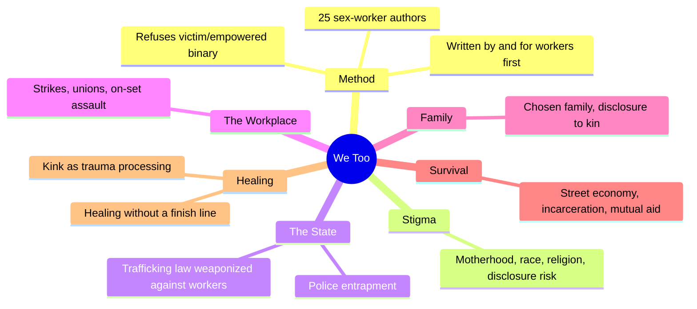
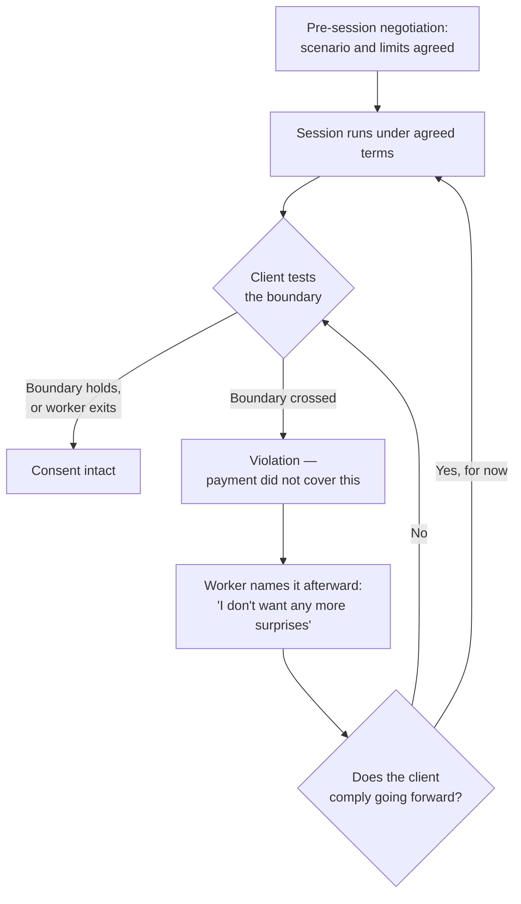
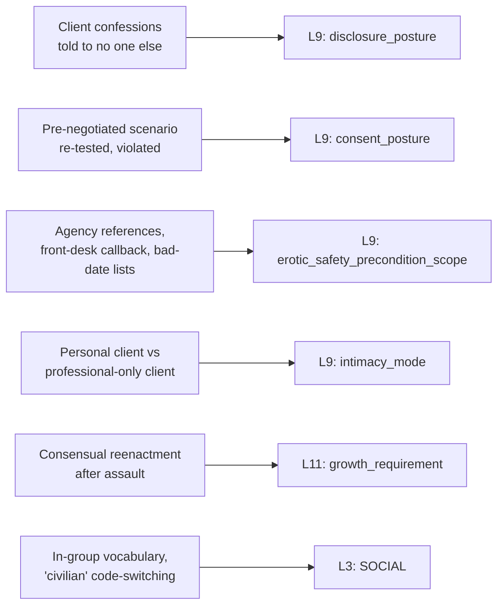

# 🧬 MSX.38 — We Too — West, Horn & Selena, eds. (2021)
### Knowledge Entry — Distill

Twenty-five current and former sex workers write personal essays on labor, violence, family, and healing inside the sex industries, organized as a direct answer to #MeToo's exclusion of workers the culture has decided cannot be assaulted; the first BVX-LEARN entry to carry first-person testimony, rather than ethnography or theory, into the intimacy layer.

## TABLE OF CONTENTS
- [Core Thesis](#1-core-thesis)
- [Mind Models](#2-mind-models)
- [Framework](#3-framework--structure)
- [Key Concepts](#4-key-concepts)
- [Heuristics](#5-heuristics--decision-rules)
- [Invariants](#6-invariants)
- [Pitfalls](#7-pitfalls--myths)
- [Application](#8-application)
- [Cross-References](#9-cross-references)
- [Provenance](#10-provenance--confidence)

---

## 1 · CORE THESIS

Sex workers hold some of the most nuanced, actively practiced understanding of consent of any working population, precisely because their consent is routinely tested, disbelieved, and criminalized; twenty-five first-person accounts refuse both the "happy hooker" and "trafficking victim" scripts in favor of workers as full narrators of their own violence, labor, and healing.

---

## 2 · MIND MODELS

*Required. Minimum two diagrams, maximum five.*

**Diagram 1 — the whole argument.**
Caption: *six sections move outward from stigma to healing, but every section restates the same refusal: neither "happy hooker" nor "trafficking victim" is the whole story.*

**Diagram 2 — the central mechanism (consent as a continuously defended boundary, not a one-time contract).**
Caption: *from "How to Rape a Sex Worker," AK Saini's account of a repeat client: the same negotiated boundary must be re-defended every session, and a client who reframes violation as his own fetish will keep testing it.*

**Diagram 3 — mapped onto the Command's L9 EROS, L11 DESTINY, and L3 SOCIAL.**
Caption: *the book's load-bearing claims split across disclosure, consent, and external safety on L9, with one healing arc reaching L11 and one code-switching pattern reaching L3.*

---

## 3 · FRAMEWORK / STRUCTURE

Foreword (Selena the Stripper) plus an editor's introduction plus twenty-five essays sorted into six sections, moving from the individual (stigma) outward to the structural (the state, the workplace) and then inward again (family, survival, healing):

| Section | Governing question | Representative essays read |
|---|---|---|
| Stigma | What does it cost to be visibly a sex worker in public, familial, or religious life? | *That Sliver of Light* (Ashley Paige) |
| The State | How does the legal system criminalize the workers it claims to rescue? | *How to Rape a Sex Worker* (AK Saini); *Victim-Defendant* (Christa Marie Sacco); *Hustling Survival* (Brit Schulte with Judy Szurgot and Alisha Walker) |
| The Workplace | What do labor conditions and on-set/on-shift assault actually look like? | *Dispatch from the California Stripper Strike* (Antonia Crane) |
| Family | How is sex work disclosed to, hidden from, or integrated with family and chosen family? | *A Family Affair* (Dia Dynasty) |
| Survival | What does it take to survive the industry's most criminalized, least protected edges? | *The Invisibles* (Ignacio G. Hutía Xeiti Rivera) |
| Healing | What does recovery from violence look like when therapy, community, and the trade itself are entangled? | *We All Deserve to Heal* (Yin Q); *How to Build a Hookers Army* (Vanessa Carlisle) |

The editor's introduction sets the book's argument before any essay begins: mainstream #MeToo discourse assumed sex workers could not be meaningfully assaulted ("How can you sexually assault a whore?"), a 2007 Philadelphia judge reduced a sex worker's gang rape to "theft of services," and anti-trafficking law is simultaneously too broad (counting any debt-financed labor migration) and too narrow (offering "rescue" only through police contact, which criminalizes the people it claims to save). The book's throughline is that community — bad-date lists, mutual aid, peer-taught self-defense — repeatedly does the safety work that state and NGO institutions either fail to do or actively obstruct.

---

## 4 · KEY CONCEPTS

| Concept | What it is | Why it matters |
|---|---|---|
| **"Sex work is work"** | The movement's foundational refrain: sex work is labor, not identity, trauma, or automatic victimhood, and should be evaluated by workplace-safety standards like any other job | Without this framing, sex workers cannot claim labor rights, because "victims" are rescued, not protected on the job |
| **Happy hooker / trafficking victim binary** | The two socially "acceptable" scripts for a sex worker's narrative: joyfully empowered, or passively exploited | The book's central refusal — most contributors' lives fit neither, and insisting on one erases the "unhappy hooker" who still deserves better conditions, not rescue |
| **Consent separated from payment** | Being paid for one act, or for time generally, is never treated as consent to a different or escalated act | The load-bearing distinction across nearly every essay involving violence; violation is defined by exceeding what was actually agreed, not by the existence of money changing hands |
| **The victim-defendant pipeline** | Anti-trafficking law channels "rescue" exclusively through police contact, so accessing services requires cooperating with the same system that criminalizes the worker | Explains why many trafficking survivors never self-identify as such, and why community-run alternatives to police-gated services exist |
| **Bounded authenticity, sex-worker register** | A "personal client" tier — clients allowed past the strictly transactional frame into something resembling friendship, disclosure, and continuity — coexists with a majority of purely professional, bounded relationships | Confirms, from a first-person register, the scripted-to-spontaneous spectrum documented in the industry-research literature (MSX.19, MSX.27); this book supplies its lived texture |
| **The lifeboat dynamic** | For kink-adjacent or trauma-disclosing clients, the sex worker may be the only person the client discusses his sexual orientation or history with at all | Names an emotional-labor risk distinct from physical risk: the worker absorbs a disproportionate share of a client's unmet need for confidants |
| **Screening chain failure** | Safety infrastructure (agency screening, references, front-desk verification) fails specifically when an intermediary's incentive (commission, an arrest quota) conflicts with the worker's safety | Shows structural safety as sabotageable, not simply present-or-absent; the same infrastructure can protect or endanger depending on who administers it |
| **Community-built safety** | Bad-date lists, peer-taught self-defense (Hookers Army), harm-reduction outreach (the "condom lady"), and mutual aid substitute for institutions that criminalize the population they claim to protect | The book's recurring answer to "who keeps sex workers safe": workers themselves, informally and continuously, because formal institutions cannot be trusted to |
| **Kink as trauma metabolism** | Consensual, reversible reenactment of power and violence (bondage, impact play, ritualized "punishment" scenes) lets both worker and client process real trauma inside a structure with a safeword, an ending, and mutual agreement | Reframes BDSM sex work as a distinct therapeutic register from either straightforward pleasure-service or straightforward exploitation |
| **Healing without a finish line** | "Healing is never done" — trauma processing through the trade is ongoing, imperfect, and can coexist with continuing to work with a client whose disclosed history is disturbing | Refuses a redemption-arc structure in favor of a sustained, sometimes contradictory practice |

---

## 5 · HEURISTICS & DECISION RULES

| Situation | Do this | Not this |
|---|---|---|
| Writing a paid-sex scene that turns non-consensual | Show the specific boundary that was agreed and then crossed, and let the character name the violation afterward, even if the relationship continues | Write payment itself as the thing that was violated, or let payment stand in for consent to everything that followed |
| A client discloses something disturbing (a past crime, an unspeakable want) to a sex-work or service-adjacent character | Show the character absorbing it as routine occupational weight — "we carry the secrets" — without instantly becoming the client's therapist or judge | Have the character either instantly report/punish the confession or become emotionally overwhelmed and break the professional frame |
| Depicting a character's safety infrastructure in a criminalized or stigmatized trade | Show peer networks (bad-date lists, screening, check-ins) as the operative safety layer, with official institutions absent, hostile, or actively dangerous | Default to police or official services as the safety net |
| A character has different levels of intimacy with different clients or partners in the same trade | Give them a visible tier system — most kept strictly bounded, a few allowed into a "personal" register — and let the tiers be legible to the reader | Flatten every client relationship into either pure transaction or pure connection |
| Showing a character process past sexual violence through present consensual kink or power-exchange practice | Let the practice be genuinely reparative and imperfect at once — coexisting with continued distress, poor choices, or unresolved anger | Write it as either pure pathology (repeating the trauma) or a clean, completed cure |
| A character is asked to forgive someone who has confessed a past assault to them | Let them hold the tension without resolving it cleanly (refusing forgiveness while still expressing something short of hatred is a valid, realistic landing point) | Force a tidy forgiveness arc or a tidy rejection arc |
| Writing legal or institutional characters (police, NGOs, courts) interacting with a criminalized-trade character | Show the institution's incentive structure (quotas, funding conditions, "rescue" requiring cooperation) actively shaping outcomes, sometimes against the person it claims to help | Write the institution as a neutral, purely protective backdrop |
| A character code-switches between a public advocacy voice, a client-facing professional voice, and a private off-duty voice | Give each register distinct vocabulary and let the character move between them visibly | Write one flat voice regardless of audience |

---

## 6 · INVARIANTS

1. **Consent is scoped to the specific act agreed, not to the payment or the relationship as a whole.** This holds across every essay touching violation: the crime is exceeding what was actually agreed, not the existence of a transaction.
2. **Disclosure inside a stigmatized trade runs both directions and is asymmetric.** Clients disclose what they tell no one else; workers disclose selectively, to build trust, never universally.
3. **External safety infrastructure is only as reliable as the intermediary administering it.** Agencies, screening systems, and police can each either protect or endanger, depending on whether their incentives align with the worker's.
4. **Formal institutional "rescue" that requires cooperation with the same system that criminalizes a person will be avoided by the people it claims to help**, for coherent, survival-rational reasons, not out of denial.
5. **Intimacy in a commercial-sexual context is gradable, not binary.** The same worker holds strictly professional and "personal" registers simultaneously, with different clients.
6. **Healing through reenactment does not resolve into a finished state.** It can coexist indefinitely with unprocessed anger, poor decisions, and continued contact with people who caused or confessed harm.
7. **Community-built, peer-taught safety systems persist specifically because formal ones fail or actively harm the population they are meant to serve.**
8. **A single narrative frame (victim or empowered) cannot hold a whole life; most lived accounts require both, unresolved, at once.**

---

## 7 · PITFALLS / MYTHS

- Treating "sex workers cannot be sexually assaulted" as a fringe belief; the book documents it in judicial rulings, online harassment, and everyday client behavior alike.
- Assuming payment for sex work implies consent to whatever a client wants once the session begins; several essays specifically dramatize this as the mechanism of violation, not an edge case.
- Assuming anti-trafficking law and NGOs reliably help the people they claim to serve; the book documents police-gated "rescue" services, funding structures that bar decriminalization language, and survivors who avoid identifying as trafficked because doing so triggers incarceration risk, not protection.
- Reading self-defense or safety training as a neutral good regardless of who designs it; mainstream "women's self-defense" is shown actively harming sex workers through victim-blaming, "stranger danger" racial scripting, and erasure of LGBTQ and sex-worker-specific violence patterns.
- Assuming a sex worker processing trauma through kink work is either purely healed or purely re-traumatized; the book insists on both/and, including a case where a worker continues seeing a client who has confessed to raping his ex-wife, without a clean resolution.
- Collapsing all workers into one experience; the book is explicit that race, immigration status, gender identity, and which segment of the industry (street-based versus indoor, escort versus stripper versus cam) drastically change risk and access to protection.
- Mistaking the "happy hooker" narrative sex workers sometimes perform for civilians (and in their own advertising) as the whole truth; the book explicitly names this as a strategic, partial narrative distinct from private accounts among peers.

---

## 8 · APPLICATION

- **Spine level:** [L5] WOUND, per this batch's assigned keying (a testimony-and-survival source; wound here is accumulated and ongoing — institutional, familial, and client-inflicted — rather than a single originating injury, and several contributors explicitly resist a "resolved trauma" arc)
- **12-layer character stack:** L9 EROS, primary (`disclosure_posture`, `consent_posture`, `erotic_safety_precondition_scope`); L9 EROS, supporting (`intimacy_mode`, graduated trust tiers); L11 DESTINY, supporting (`growth_requirement`, healing as non-terminating practice); L3 SOCIAL, contextual (in-group code-switching across public/client-facing/private registers)
- **plot_systems:** contextual candidate once `04_PLOT_SYSTEMS/` opens — the screening-chain-failure mechanism (Diagram 2's structural cousin: safety infrastructure sabotaged by a misaligned intermediary) is a ready-made engine for institutional-betrayal plot beats in any criminalized-trade or stigmatized-community setting
- **Setting:** contextual — the book's account of community-built parallel institutions (bad-date lists, peer self-defense, harm-reduction outreach existing because state institutions are hostile) is a portable model for any setting where a marginalized population builds its own S4 LAW/S8 HABIT infrastructure in the shadow of a hostile official one

This anthology's real contribution to the intimacy layer is refusing to let consent collapse into a single yes/no gate. `consent_posture` should be writable as something actively, repeatedly defended — tested, sometimes crossed, named afterward, and re-negotiated going forward — rather than settled once at the start of a scene. Equally, `disclosure_posture` should carry real asymmetry: a character in a confidant-adjacent trade absorbs disclosures they never solicited and rarely reciprocate in full, and that asymmetry is itself a load a character carries, distinct from shame or desire. Finally, the book's healing arcs are useful precisely because they refuse closure: `growth_requirement` should be able to hold a character who is genuinely, verifiably healing and still making choices a reader might question, at the same time.

---

## 9 · CROSS-REFERENCES

| Related entry | Relation |
|---|---|
| [[🧬 MSX.18 — Porn Work — Berg (2021)]] | Sibling labor-ethnography on sex work as real, structurally precarious work; this entry supplies first-person testimony where Berg supplies ethnographic synthesis, and both refuse the victim/empowered binary independently |
| [[🧬 PSY.16 — Techniques of Pleasure — Weiss (2011)]] | Shared territory on consent as an actively negotiated, re-defended practice (SSC/RACK, checklist-to-attunement) rather than a single settled fact; this book supplies the first-person stakes when that negotiation fails |
| [[🧬 MSX.27 — Routledge Handbook of Sex Industry Research — Dewey, Crowhurst & Izugbara (2018)]] | Academic-register sibling on client motive, platform-shaped self-presentation, and "bounded authenticity"; this book's "personal client" tier is the lived, narrative version of that research literature's scripted-to-spontaneous spectrum |
| [[🧬 MSX.28 — Sex Pigs — PLWHA NSW (2007)]] | Sibling on disclosure running its own register, separable from shame or desire; this book generalizes that finding from HIV/STI status specifically to trauma history and criminal-legal exposure more broadly |

---

## 10 · PROVENANCE & CONFIDENCE

Full text, pdftotext extraction (~220pp main text before contributor biographies and back matter), clean text layer with a machine-readable table of contents. Read in full: the Foreword (Selena the Stripper) and the editor's Introduction (Natalie West — the #MeToo exclusion argument, the trafficking-law critique, the "sex work is work" framing, the happy hooker/trafficking victim binary). Read in full or near-full: "How to Rape a Sex Worker" (AK Saini, all four vignettes: Fantasy, Fetish, Bareback, Enforcement); "Victim-Defendant" (Christa Marie Sacco, all three character sketches plus conclusion) through its full argument on the victim-defendant pipeline; the opening of "Hustling Survival" (Brit Schulte with Judy Szurgot and Alisha Walker); "We All Deserve to Heal" (Yin Q, full essay); "How to Build a Hookers Army" (Vanessa Carlisle, the critique of mainstream women's self-defense and the founding of Hookers Army LA, read through its opening argument). Not deep-extracted: the remaining eighteen essays (Stigma, Workplace, Family, and Survival sections beyond those sampled above) and the contributor biographies; represented here only through the editor's introduction's own framing of the collection's scope and the section-level table of contents.

The `feeds:` variable names (`disclosure_posture`, `consent_posture`, `erotic_safety_precondition_scope`, `intimacy_mode`, `growth_requirement`, `SOCIAL`) are taken directly from L9 EROS and adjacent layer definitions in `ssot_02_character_systems_vertical_slice.md` PART A and the L9 EROS synthesis (`ssot_02_l9_eros_synthesis.md`), not inferred loosely.

## META
- Template: BVX-LEARN-v4.0, sexuality variant (BOLO 87/88, `brief.DISTILL.md` as changed by `brief.DISTILL.wave3.md`)
- Source classification: full-text essay anthology, deep extraction on 5 of 25 essays plus foreword and introduction, remaining essays represented via table of contents and editorial framing only
- Created / Updated: 2026-09-29
