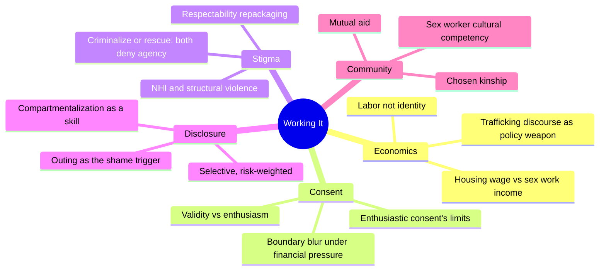
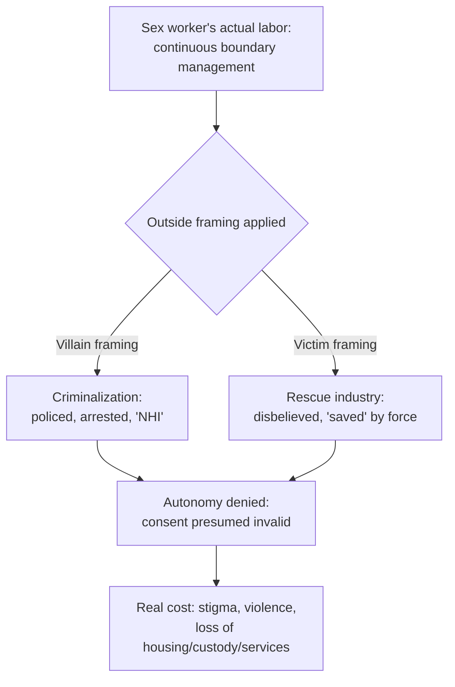
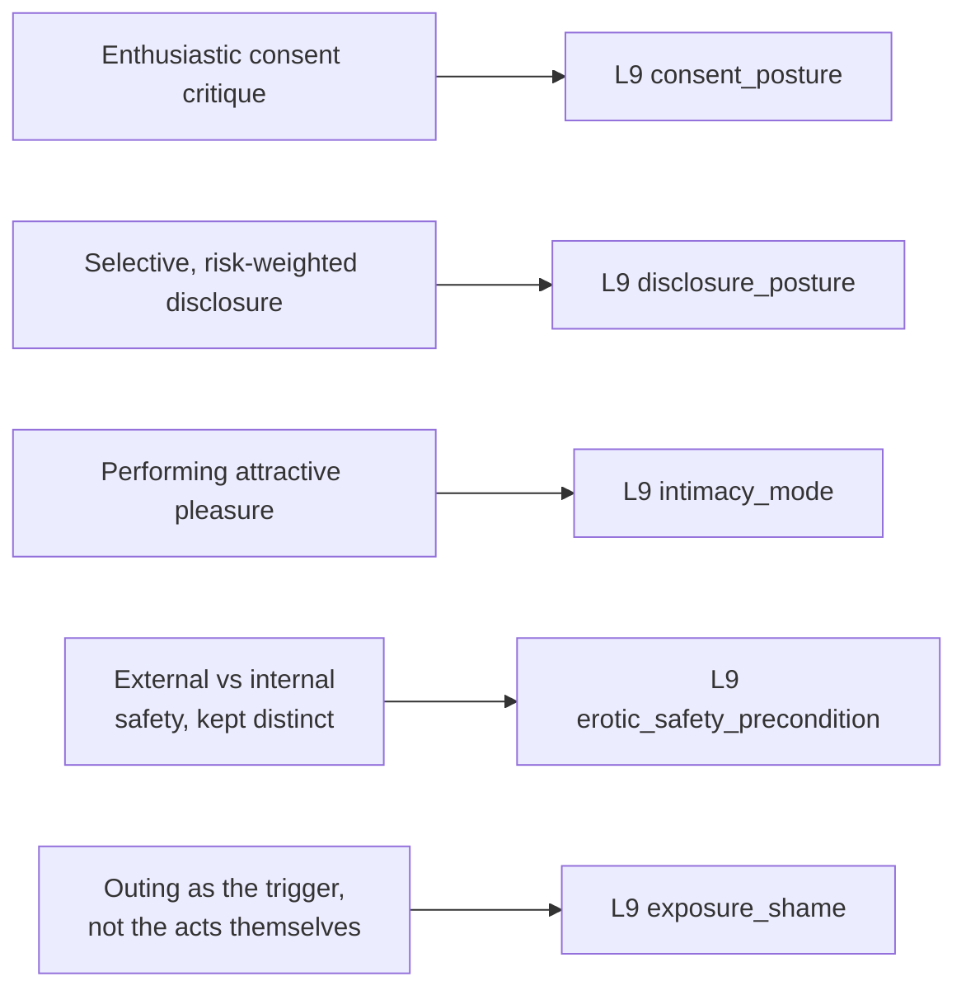

# MSX.39 — Working It: Sex Workers on the Work of Sex — ed. Matilda Bickers, with peech breshears and Janis Luna (2023)
### Knowledge Entry — Distill

An anthology of essays, interviews, and art by sex workers on the economics, stigma, and emotional mechanics of the trade — written for the SEXWORK shelf of the sexuality library, where it fills a first-person labor-and-consent gap no clinical or academic source can.

## TABLE OF CONTENTS
- [Core Thesis](#1-core-thesis)
- [Mind Models](#2-mind-models)
- [Framework](#3-framework--structure)
- [Key Concepts](#4-key-concepts)
- [Heuristics](#5-heuristics--decision-rules)
- [Invariants](#6-invariants)
- [Pitfalls](#7-pitfalls--myths)
- [Application](#8-application)
- [Cross-References](#9-cross-references)
- [Provenance](#10-provenance--confidence)

---

## 1 · CORE THESIS

Sex work makes visible what all intimacy labor actually costs: boundary management under financial pressure, not sex itself, is the skill being sold. Two dominant outside framings — criminalize as villain, or rescue as victim — both convert that skill into a denial of the worker's autonomy.

---

## 2 · MIND MODELS

*Required. Minimum two diagrams, maximum five.*

**Diagram 1 — the whole argument.**
Caption: *four recurring pressures run under every essay in the book — economics, consent, stigma, and disclosure — and community/mutual aid is the load-bearing response to all four at once.*

**Diagram 2 — the central mechanism (a double bind: two competing outside framings converge on the same result).**
Caption: *criminalization and rescue look like opposites but land in the same place — read either framing as evidence the worker cannot be trusted with her own consent, so the worker's actual skill (boundary management) never enters the picture at all.*

**Diagram 3 — mapped onto the Command's L9 EROS layer.**
Caption: *the book's sharpest mechanisms land on the consent, disclosure, and intimacy-mode fields almost directly — this source is a corrective to any L9 default that treats consent as binary or intimacy as always spontaneous.*

---

## 3 · FRAMEWORK / STRUCTURE

No single argument runs the book; it is a kaleidoscope (the editor's own word) of personal essays, an academic-leaning introduction, short interviews, poems, and art, arranged so that adjacent pieces answer or complicate each other. The long editorial introduction (Bickers with Melissa Ditmore) does the structural work a framework chapter would in a monograph: it lays out the economic argument (sex work as a response to a minimum wage that doesn't cover a "housing wage"), the trafficking-discourse history (from the 1875 Page Act and 1910 Mann Act through SESTA/FOSTA in 2018), and previews each contributor's piece with a connecting thread. From there the book alternates between essay and interview format — the interviews use a repeated question set (how did you start, what do you do to relax after a bad client, what would make sex workers' lives safer) that functions as a second, informal data set running underneath the essays' individual arguments.

---

## 4 · KEY CONCEPTS

| Concept | What it is | Why it matters |
|---|---|---|
| **Sex work as labor** | Trading sex or sexualized services framed explicitly as work — flexible-schedule, above-minimum-wage, but unstable and emotionally taxing — not as identity, empowerment, or pathology | The book's foundational reframe: the question is working conditions, not the morality of the act |
| **The rescue/criminalize double bind** | Sex workers are alternately treated as villains (criminalized, "NHI" — no humans involved) or as victims lacking capacity to consent (rescue-industry policy) | Both framings converge on denying autonomy; neither asks the worker what she needs |
| **Enthusiastic consent's blind spot** | "Enthusiastic consent" as a cultural standard implicitly recodes any non-enthusiastic-but-real consent (most paid sex work) as indistinguishable from rape | Phoenix Calida's essay: this erases the distinction that matters most — between an unwanted-but-chosen transaction and an actual assault — for the people the standard claims to protect |
| **Respectability repackaging** | Comparing sex work to therapy, athletics, or the service industry to make it more palatable to outsiders | Janis Luna's essay: repackaging restigmatizes by implying the "sex" part needs excusing, when it's the actual point of the work |
| **Boundary blur under pressure** | The active, effortful enforcement of personal boundaries against client desire, bent or blurred specifically when income is short | peech breshears: the professional skill isn't performing desire, it's continuously managing where the line sits and what it costs to move it |
| **Performed intimacy / the client's own fantasy** | "Performing attractive pleasure" as a discrete, learnable skill, frequently made easier because the client's own selective perception does half the performative labor | Matilda Bickers: a client wanting to believe he's loved, or that a worker "loves sex," does much of the scene's emotional work unprompted |
| **Selective, risk-weighted disclosure** | Choosing what to reveal to whom — family, coworkers, new partners — based on relationship, jurisdiction, and consequence, revisited continuously rather than decided once | Alyssa Pariah's and Janis Luna's essays: disclosure is never a single out/closeted choice; it is managed exposure under real structural risk |
| **NHI and the stigma economy** | "No humans involved" — the police shorthand applied to crimes against sex workers, houseless people, and drug users — named directly as the backdrop against which every interaction happens | Establishes that the stakes of a bad client or a broken boundary are not merely social discomfort but documented, disproportionate violence |
| **Mutual aid and chosen kinship** | Sex workers and their communities building material and relational safety nets (SWARM's pandemic mutual aid fund, Danzine's phone tree of bad clients, alternative family structures) where legal and social systems fail or actively harm | The book's answer to the double bind: horizontal community support substitutes for the formal safety net that criminalization and stigma foreclose |
| **Sex work vs. sex trafficking** | A sharp, repeated distinction between consensual labor (even under economic duress) and trafficking (force, fraud, coercion, or being underage) | The book's most-defended boundary, because conflating the two is the mechanism that legitimizes both criminalization and coercive "rescue" |

---

## 5 · HEURISTICS & DECISION RULES

| Situation | Do this | Not this |
|---|---|---|
| Judging whether paid, non-enthusiastic sex counts as valid consent | Treat consent's validity and its enthusiasm as separate questions | Collapse "not enthusiastic" into "therefore not consensual" |
| Deciding what to tell someone about the work | Weigh relationship, jurisdiction, and consequence each time; disclose selectively | Default to either full disclosure or total concealment as a fixed policy |
| Responding to a "you're just like a therapist/athlete" comparison | Name the sexual labor directly as its own legitimate category | Accept the comparison to borrow another profession's legitimacy |
| Money runs short and a boundary is under pressure | Recognize the blur as a real cost being paid, and decide consciously | Pretend the boundary wasn't moved, or treat the blur as costless |
| A client projects fantasy or affection onto the transaction | Let the client's own perception do performative work rather than manufacturing enthusiasm from nothing | Correct the client's fantasy or force authentic reciprocal feeling |
| Writing or portraying a sex worker character's autonomy | Hold both "this can be exploitative" and "this can be a rational, even preferable, choice" simultaneously | Write purely-empowered or purely-victim narratives as the only two options |
| Distinguishing sex work from trafficking in a scene or policy | Key the distinction to force, fraud, coercion, or age — not to the presence of money | Treat any exchange of money for sex as definitionally coercive |

---

## 6 · INVARIANTS

1. **Consent's validity is separable from its enthusiasm.** A real yes need not be an enthusiastic one; the two are independent measurements.
2. **Boundary management, not sex, is the deliverable being sold and the skill being exercised.** Financial pressure is the variable that moves the boundary, not desire.
3. **Disclosure under stigma is always selective and situational**, re-decided per relationship and context, never resolved once.
4. **Stigma imposes real, disproportionate safety costs** regardless of which outside framing (criminalize or rescue) is applied.
5. **Sex work and trafficking are distinct categories** keyed to force/fraud/coercion/age, and conflating them harms the people both frames claim to protect.
6. **Community and mutual aid fill the safety-net gap** that formal legal and social systems leave open or actively worsen for stigmatized labor.

---

## 7 · PITFALLS / MYTHS

- Treating "sex work is empowering" and "sex work is exploitation" as the only two available narratives — the book explicitly rejects both as totalizing.
- Reading physiological or verbal enthusiasm as the only valid marker of consent, erasing chosen-but-unenthusiastic consent as a real category.
- Assuming disclosure is a one-time, binary decision rather than a continuously renegotiated risk calculation.
- Respectability comparisons ("it's like therapy," "it's like sports") that appear to defend the worker while actually reinforcing the idea that the sexual content needs justifying.
- Conflating sex work with sex trafficking, which both criminalization and rescue-industry policy do for opposite rhetorical ends.
- Assuming financial desperation and genuine choice are mutually exclusive — the book repeatedly holds "this is coercive because of poverty" and "this is still my chosen, managed labor" as simultaneously true.

---

## 8 · APPLICATION

- **Spine level:** none — this is an L9 EROS character-layer source, not a story-spine source (per the v4 template's binding rule that character-stack feeds sit beside the spine, not on it)
- **12-layer character stack:** L9 primary across three fields (consent_posture, disclosure_posture, intimacy_mode), supporting on two more (erotic_safety_precondition, exposure_shame)
- **plot_systems:** contextual — the criminalize/rescue double bind (Diagram 2) is a ready-made external-pressure generator for any character whose intimacy or labor is stigmatized, sex-work or otherwise
- **Setting:** none

The book's sharpest gift to L9 is separating two things a lazier model would fuse: the *validity* of a character's consent and the *enthusiasm* of it. A character who consents without enthusiasm (for money, for safety, for a relationship's sake, under any real-world pressure) still has a real consent_posture — writing that flatly, without smuggling in either "she secretly loved it" or "this was actually assault," is the harder and truer version the book insists on. disclosure_posture gets a concrete default shape: not a single closet door but a continuously reassessed risk calculation, keyed differently per relationship (Alyssa's mother, Janis Luna's therapy clients, Adrie Rose's dating-app matches all get different disclosure treatment from the same person). intimacy_mode gets its scripted pole filled in with real texture — "performing attractive pleasure" as a professional competency, and the observation that a scene partner's own selective perception frequently does half the performative work unasked, which is a usable mechanism for writing any character managing a partner's projection, paid or not. The weakest transfer is erotic_safety_precondition: the book is explicit that external safety (legal status, community, screening, an exit route) and internal safety (the compartmentalization skill several contributors name directly) are both necessary and are not substitutes for each other — a character with excellent internal safety skills in an externally unsafe structure is still not safe, and L9 authoring should resist collapsing the two into one field.

---

## 9 · CROSS-REFERENCES

| Related entry | Relation |
|---|---|
| [[🧬 MSX.41 — Camming — Jones (2020)]] | Sibling SEXWORK-shelf source, same wave — Jones's camming study is the online/mediated counterpart to this anthology's largely in-person and club-based labor accounts |
| [[🧬 MSX.17 — Mating in Captivity — Perel (2006)]] | Cross-shelf L9 source — Perel's bounded-space-of-eroticism concept (rules inside the erotic differ from rules outside it) is a softer, non-labor version of this book's performed-intimacy argument |
| [[🧬 PSY.17 — Women's Anatomy of Arousal — Winston (2010)]] | Cross-shelf L9 source, same wave — Winston's signal-reading and consent model describes the same attunement/boundary-reading skill this book locates as professional labor under financial pressure |

---

## 10 · PROVENANCE & CONFIDENCE

Full text, plain-text extraction, ~2,568 lines (~435 KB). Read via table of contents and grep-located chapter boundaries, then targeted full reads: front matter, foreword (Molly Smith), and the full editorial introduction (Bickers with Ditmore, covering the economic argument and the trafficking-discourse history); "I Don't Consent to Enthusiastic Consent" (Phoenix Calida, full); "Respectability Politics by Any Other Name" (Janis Luna, full); "Intimate Labor" (Matilda Bickers, full); "When My Mom Found My Craigslist Ad" (Alyssa Pariah, full); the Adrie Rose and Beyondeep interviews (full); "El Cerrito" (Nick Lovett, opening). Not individually read in full: the remaining dozen essays and interviews (Leila Raven, Sarah Sage, Domino Rey, Emily Dall'Ora Warfield, Melissa Ditmore's "The High Cost of Cheap Labor," Naomi, Stephanie Kaylor, xaxum omer, Crystal Kimewon, Susan Elizabeth Shepard, Dee Lucas) — their content and arguments were captured secondhand through the editorial introduction's own detailed summary of each, which the introduction is explicitly structured to provide. No claim in this entry rests on a piece known only through that secondhand summary without corroboration from a directly read piece.

## META
- Template: BVX-LEARN-v4.0
- Source classification: full-text anthology, deep extraction on 6 of ~20 contributions plus the full introduction, remainder captured via the introduction's own per-piece summary
- Created / Updated: 2026-09-29
