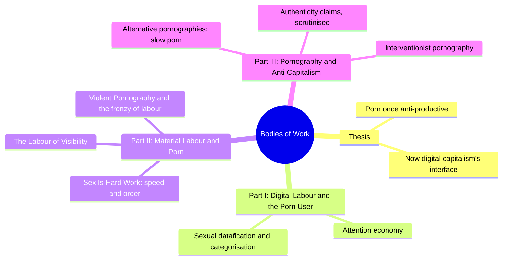
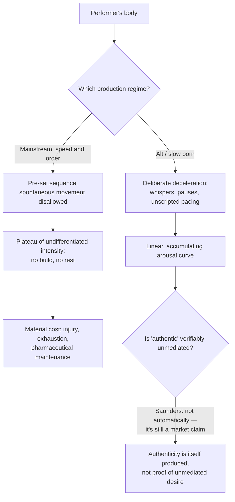
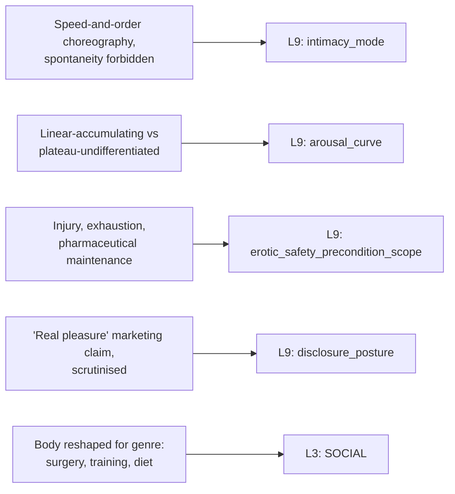

# 🧬 MSX.40 — Bodies of Work — Saunders (2020)
### Knowledge Entry — Distill

A media and cultural theorist's academic study of digital pornography as a central interface of postindustrial capitalism, arguing that porn's historically anti-productive, transgressive body has been recaptured as a labouring one — the first BVX-LEARN entry to read pornographic performance through political economy rather than ethnography, testimony, or clinical practice.

## TABLE OF CONTENTS
- [Core Thesis](#1-core-thesis)
- [Mind Models](#2-mind-models)
- [Framework](#3-framework--structure)
- [Key Concepts](#4-key-concepts)
- [Heuristics](#5-heuristics--decision-rules)
- [Invariants](#6-invariants)
- [Pitfalls](#7-pitfalls--myths)
- [Application](#8-application)
- [Cross-References](#9-cross-references)
- [Provenance](#10-provenance--confidence)

---

## 1 · CORE THESIS

Pornography, historically defined by its opposition to productive work, has been recaptured by digital capitalism as a genre centrally about the display of bodily labour: mainstream porn now performs "speed and order" (a manufactured plateau of maximum intensity with no build and no rest), while "alternative" pornography's claimed authenticity is itself a produced market position, not proof of unmediated desire.

---

## 2 · MIND MODELS

*Required. Minimum two diagrams, maximum five.*

**Diagram 1 — the whole argument.**
Caption: *three parts trace one arc — porn's historical opposition to productive labour gets inverted twice: first captured as digital labour, then claimed (not necessarily truthfully) to be escaped again by "alternative" porn.*

**Diagram 2 — the central mechanism (two production regimes, two arousal curves).**
Caption: *the same body produces two opposite curves depending on the regime it works under — and the "authentic" curve's claim to be unmediated is itself something the book treats as a marketing position, not a verified fact.*

**Diagram 3 — mapped onto the Command's L9 EROS and L3 SOCIAL.**
Caption: *the book's four load-bearing findings split across a scripted-intimacy extreme, two opposite curve shapes, a physical safety ledger, and a skeptical read on authenticity claims.*

---

## 3 · FRAMEWORK / STRUCTURE

Introduction plus three parts, moving from the viewer's digital labour to the performer's material labour to pornography's claimed escape from both:

| Part / Chapter | Governing move | What it establishes |
|---|---|---|
| Introduction | Situates digital pornography as central to postindustrial capitalism's valorisation of attention, affect, and the sexual body | Pornography's historical status as anti-productive is the precondition for its later capture, not a contradiction of it |
| Part I: Digital Labour and the Porn User (Ch2-3) | The viewer's attentional labour and the "sexual datafication" of porn sites (tags, categories, algorithmic sorting) | Consumption itself is a form of digital labour that reshapes what gets produced |
| Part II: Material Labour and Contemporary Pornography (Ch4-6) | Performers' bodies as the material substrate of digital labour demands | "Sex Is Hard Work" (speed and order, the "sexual athlete"); "The Labour of Visibility" (documentary-style visibility as its own performed labour); "Violent Pornography and the 'Frenzy' of Labour" (intensity as productivity's most extreme signal) |
| Part III: Pornography and Anti-Capitalism (Ch7-8) | Alternative and "interventionist" pornographies positioned against Part II's labour regime | "Alternative Pornographies and Unalienated Labour" (slow porn, authenticity claims, scrutinised); "Interventionist Pornography" (queer, feminist, explicitly political porn as a further step) |

The book's throughline: pornography was historically defined by opposition to productive, disciplined work (its "excess" was the point); digital capitalism's attention and information economies recaptured that same excess as a demand for maximal, continuous performance; and "alternative" pornography's claim to have escaped this by being "authentic" and "unalienated" is treated by Saunders as itself a market position requiring scrutiny, not an automatically verified exit from labour.

---

## 4 · KEY CONCEPTS

| Concept | What it is | Why it matters |
|---|---|---|
| **Speed and order** | Mainstream digital porn's twin formal demands: performers move with maximal velocity (speed) through pre-determined, categorised sequences of acts (order), with spontaneous deviation actively disallowed | Reframes "hot" mainstream porn's pacing as a labour discipline borrowed from digital-economy imperatives (attention capture, content categorisation), not simply an aesthetic choice |
| **The sexual athlete** | Performers' own self-description (coined by Sasha Grey) of porn work as requiring the fitness, training, and bodily discipline of professional athleticism | Names the material, physical labour underneath an ostensibly "immaterial," attention-economy-driven industry; porn performance is not dematerialized labour |
| **Plateau of undifferentiated intensity** | Contemporary mainstream porn's replacement of a building, accumulating arousal arc with immediate, sustained "maximum" activity from the first second, with no differentiated build or rest | A concrete, describable alternative arousal_curve shape, contrasted explicitly with 1970s features' slower, accumulating pacing |
| **Bounded authenticity's shadow: the authenticity claim as market position** | "Alternative"/"alt"/"slow" porn markets itself on claimed realness (real couples, unscripted, "no porn tropes"), but Saunders argues this claim itself functions rhetorically to pre-empt scrutiny of the production process, not to prove it | A useful caution: a character's or a scene's claim to unmediated authenticity should not be taken by the narrative as self-verifying |
| **Disavowed labour** | The specific rhetorical move by which "alternative" pornography's emphasis on authentic pleasure renders the very concept of the performer's alienation from their labour "a theoretical impossibility" in its own marketing | Shows how claiming an experience is "real" can function to foreclose questions about consent, working conditions, or exploitation, rather than answering them |
| **Sexual datafication** | The tagging, categorisation, and algorithmic sorting of porn content into rigid taxonomies (positions, acts, durations) that then feed back into how content itself is produced | The viewer's information-economy behaviour (searching, tagging, categorising) materially reshapes what performers are required to perform, a feedback loop from consumption to production |
| **Slow porn / counter-aesthetics** | A named alternative movement (Sensate Films, Belladonna's later work, MakeLoveNotPorn) deliberately decelerating pace, favoring whispers, pauses, and diegetic narrative over rapid choreographed sequences | Demonstrates that arousal_curve and intimacy_mode are deliberately, consciously authored choices by producers and performers, not natural facts about sex |
| **The material cost of manufactured intensity** | Physical injury, chronic infection, malnutrition on set, and pharmaceutical maintenance of erection/arousal documented directly by performers (e.g., ex-performer Jessie Rogers) | Grounds "erotic labour" claims in concrete embodied cost, distinct from and additional to emotional or psychological safety concerns |
| **"It's like being paid to fuck my girlfriend"** | A performer's own description (Billy Rough) of alt-porn shoots with a real partner as dissolving the line between paid performance and private intimacy entirely | The chapter's title claim; Saunders treats it as a genuinely felt account that nonetheless still functions as labour, refusing the binary between "real" and "work" |
| **Interventionist pornography** | The book's own proposed final category: porn that neither claims escape from capitalism (alt/authentic) nor unreflectively performs labour (mainstream), but self-consciously works against exploitative structures while still being commercial | The book's answer to "can pornographic sex resist capitalist capture" — a qualified, structurally aware yes, not a clean one |

---

## 5 · HEURISTICS & DECISION RULES

| Situation | Do this | Not this |
|---|---|---|
| Writing a commercially performed sex scene (porn, sex work, any professionally staged intimacy) | Decide explicitly which arousal_curve shape the scene uses — building/accumulating, or immediate/plateaued maximum intensity — and let that choice carry meaning | Default to an undifferentiated "hot scene" with no considered pacing shape |
| A character performs intimacy under strict choreography | Show spontaneous deviation being actively caught and corrected, not merely absent | Write scripted intimacy as simply less emotional, without showing the active suppression of spontaneity |
| A character or scene claims to be "authentic," "real," or "unscripted" | Let the claim be a posture that can be sincere and strategic at once, and let other characters or the narrative be entitled to question it | Treat a character's authenticity claim as automatically, narratively true |
| Depicting the physical toll of sustained performed intimacy (sex work, athletic performance, any body-as-labour context) | Show concrete embodied costs — injury, exhaustion, chemical/medical maintenance — as their own safety ledger, separate from emotional or consent-related harm | Conflate physical labour cost with emotional trauma, or omit it entirely in favor of only psychological stakes |
| A character's body has been materially reshaped for a professional or performed role | Show the reshaping as visible, disciplined, and effortful, distinct from the character's private, unperformed body | Write the performed body as identical to the private one with no visible gap or maintenance cost |
| A "return to authenticity" or "slow" alternative to a mechanized practice appears in the story | Let it be a genuine, deliberate aesthetic and ethical choice, while still being situated inside the same market/production system it claims to oppose | Write the alternative as a clean escape from all the pressures of the mechanized version |
| A performer describes their paid, staged intimacy as indistinguishable from their private relationship | Hold both facts at once — it can be genuinely felt and still be labour with real production demands | Force a choice between "it's real" and "it's just work" |

---

## 6 · INVARIANTS

1. **Pacing (the arousal curve's shape) is a produced choice, not a natural given.** Any two regimes can generate opposite curves from the same underlying acts.
2. **A spontaneous deviation from a script is a distinct, nameable event, not simply the absence of choreography.** Scripted intimacy can actively catch and correct spontaneity in real time.
3. **A claim of authenticity is itself a produced position, not self-verifying evidence.** It can function rhetorically to pre-empt scrutiny of underlying conditions.
4. **Manufactured continuous "maximum" intensity carries a material, embodied cost distinct from any emotional cost.** Physical safety and psychological safety are separable ledgers.
5. **Consumption behaviour (categorisation, tagging, search) materially reshapes what gets produced.** The feedback loop runs from viewer to performer, not only performer to viewer.
6. **A performer's body-as-labour-instrument and their private body are distinct, even when a claimed "authenticity" tries to collapse the two.**
7. **"Real" and "work" are not mutually exclusive categories for the same act.** A genuinely felt intimate experience can simultaneously be commercial labour with real production demands.
8. **Rejecting one regime's demands (mainstream speed and order) does not exit the market that both regimes operate within.** The alternative remains commercial, even while critiquing the mainstream.

---

## 7 · PITFALLS / MYTHS

- Assuming pornography's explicitness or intensity is evidence of unmediated, "natural" desire; the book documents intensity as a manufactured, disciplined, and sometimes pharmaceutically maintained performance standard.
- Reading "alternative" or "authentic" pornography's claims (real couples, unscripted, no porn tropes) as self-evidently true simply because they are asserted; the book treats these claims as themselves market-facing rhetoric requiring the same scrutiny as any other production claim.
- Assuming immateriality (attention economy, information economy) means porn labour is no longer physical; the book insists digital-economy imperatives are inscribed directly and materially on performers' bodies (injury, surgery, pharmaceuticals, physical training).
- Treating a performer's genuine emotional/relational connection to a scene partner as proof that no labour, script, or production pressure was present; the book's own chapter-title example ("paid to fuck my girlfriend") explicitly holds both facts as true at once.
- Assuming "unalienated labour" is achievable simply by performers owning their own means of production (self-shot, self-distributed content); the book is skeptical that authenticity claims alone dissolve alienation as a theoretical or practical matter.
- Reading historical pornography (1970s features) as cruder or less developed than contemporary mainstream porn; the book documents the earlier form as slower, more narratively embedded, and closer to a building arousal curve, not simply less explicit.
- Collapsing all "alternative" pornography into one undifferentiated category; the book distinguishes slow/counter-aesthetic porn (Sensate Films), authenticity-branded porn (MakeLoveNotPorn, Bright Desire), and the book's own proposed further category of interventionist pornography as doing different work.

---

## 8 · APPLICATION

- **Spine level:** [L5] WOUND, per this batch's assigned keying (a political-economy source; the wound frame sits under the material cost of manufactured intensity — accumulated physical toll from sustained performance demands, not a single injury)
- **12-layer character stack:** L9 EROS, primary (`intimacy_mode`, `arousal_curve`, `erotic_safety_precondition_scope`); L9 EROS, supporting (`disclosure_posture`, authenticity claims as posture not proof); L3 SOCIAL, supporting (a disciplined, professionally reshaped body distinct from the private one)
- **plot_systems:** contextual candidate once `04_PLOT_SYSTEMS/` opens — the "authenticity claim as market position" mechanism (Diagram 2's caution) is directly reusable as a plot device for any scene where a character's claimed sincerity needs to be held in productive doubt
- **Setting:** contextual — the book's account of an industry with two competing production regimes (mainstream speed-and-order vs. alt/slow) and its own economic feedback loops (S6 ECONOMY-adjacent: viewer categorisation behaviour reshaping performer demands) is a portable model for any setting with a commercialized-intimacy economy, sex work or otherwise

This book's sharpest, most transferable contribution to the intimacy layer is a working method for two things existing at once: a scene's arousal_curve and intimacy_mode are deliberately authored, disciplined choices with real material costs, and a character's or scene's claim to authenticity or spontaneity is itself something that can be produced, marketed, and strategically deployed — genuinely felt and still a performance, without that being a contradiction. Writing a professionally performed intimate scene should specify which curve shape is in play and treat any claimed "this is just us being real" line as a posture worth narrative attention, not an automatic truth-flag.

---

## 9 · CROSS-REFERENCES

| Related entry | Relation |
|---|---|
| [[🧬 MSX.18 — Porn Work — Berg (2021)]] | Direct sibling on porn as manufactured, disciplined labour; Berg supplies the ethnographic/worker-testimony register, this book the political-economy/textual-analysis register on the same industry |
| [[🧬 MSX.26 — Pornographic Art and the Aesthetics of Pornography — Maes, ed. (2013)]] | Shared citation (Maes' "protraction" as aesthetic judgment is used directly in this book's slow-porn analysis) and shared territory on pacing as the actual determinant of whether a scene reads as art, desire, or labour |
| [[🧬 MSX.33 — The Space of Sex — Waldrep (2021)]] | Sibling on pacing devices (withhold, fragment, bound, interrupt) as transferable craft tools; this book's speed-and-order versus slow-porn contrast is the same pacing question read through labour rather than film-craft |
| [[🧬 PSY.16 — Techniques of Pleasure — Weiss (2011)]] | Shared method (both read a sexual subculture/industry through a political-economy-inflected lens rather than pure ethnography or clinical practice); Weiss's "circuit" concept and this book's labour-capture argument both refuse a clean private/public or authentic/performed binary |

---

## 10 · PROVENANCE & CONFIDENCE

Full text, pdftotext extraction (~291pp main text before bibliography/index), clean text layer with a machine-readable table of contents and running page/chapter headers. Read in full: the Introduction (the digital-capitalism/pornography argument, the historical anti-productive-body argument via Bauman, Bataille, Marcuse, and Federici, the chapter-by-chapter synopsis); Chapter 4, "Sex Is Hard Work" (full — speed and order, the "sexual athlete," the Score/Behind the Green Door/Nurses film comparison, the Jessie Rogers material-cost testimony, bodily discipline and performer fitness culture); the opening two sections of Chapter 7, "'It's Like Being Paid to Fuck My Girlfriend': Alternative Pornographies and Unalienated Labour" ("Alternative Aesthetics and Slow Porn" and "Real Pleasure, Sexual Politics and Disavowed Labour," through the alienation/authenticity argument). Sampled, not deep-extracted: Part I (Chapters 2-3, digital excess, sexual datafication); Chapter 5, "The Labour of Visibility"; Chapter 6, "Violent Pornography and the 'Frenzy' of Labour"; the remainder of Chapter 7; Chapter 8, "Interventionist Pornography" (used only for its closing framing, via the introduction's synopsis and one direct quotation located during navigation).

The `feeds:` variable names (`intimacy_mode`, `arousal_curve`, `erotic_safety_precondition_scope`, `disclosure_posture`, `SOCIAL`) are taken directly from L9 EROS and adjacent layer definitions in `ssot_02_character_systems_vertical_slice.md` PART A and the L9 EROS synthesis (`ssot_02_l9_eros_synthesis.md`), not inferred loosely.

## META
- Template: BVX-LEARN-v4.0, sexuality variant (BOLO 87/88, `brief.DISTILL.md` as changed by `brief.DISTILL.wave3.md`)
- Source classification: full-text academic monograph, deep extraction on 1 of 8 chapters plus introduction, partial extraction on a second chapter, remaining chapters represented via table of contents and introduction's synopsis
- Created / Updated: 2026-09-29
