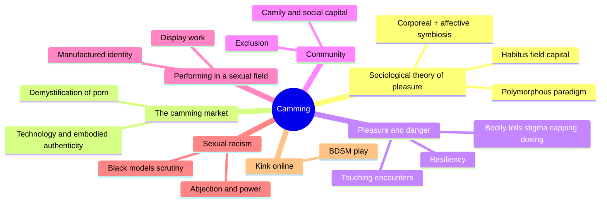
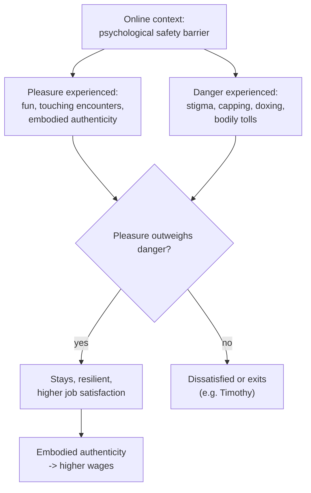
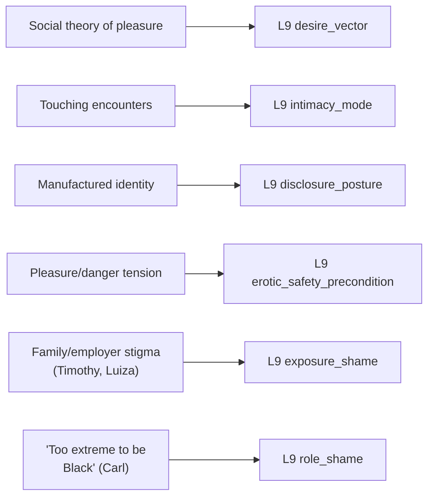

# MSX.41 — Camming: Money, Power, and Pleasure in the Sex Work Industry — Angela Jones (2020)
### Knowledge Entry — Distill

A sociological study of adult webcam performers, built on an original theory of pleasure and a large interview/survey dataset — written for the SEXWORK shelf, where its contribution is the pleasure/danger mechanism and a precise, dual-source model of sexual shame.

## TABLE OF CONTENTS
- [Core Thesis](#1-core-thesis)
- [Mind Models](#2-mind-models)
- [Framework](#3-framework--structure)
- [Key Concepts](#4-key-concepts)
- [Heuristics](#5-heuristics--decision-rules)
- [Invariants](#6-invariants)
- [Pitfalls](#7-pitfalls--myths)
- [Application](#8-application)
- [Cross-References](#9-cross-references)
- [Provenance](#10-provenance--confidence)

---

## 1 · CORE THESIS

Pleasure is not a biological reflex but a social experience, shaped by who a person is (habitus), where they act (field), and what resources they hold (capital) — and in camming, pleasure is also the deliverable: performers who experience more pleasure than danger stay, succeed, and sell "embodied authenticity" that scripted-only performance can't fake.

---

## 2 · MIND MODELS

*Required. Minimum two diagrams, maximum five.*

**Diagram 1 — the whole argument.**
Caption: *the book runs one theory (pleasure is social, not biological) through nine chapters of market, motivation, danger, community, performance, race, and kink — every chapter is the theory tested against a different facet of the same industry.*

**Diagram 2 — the central mechanism (the pleasure/danger balance determining who stays and who succeeds).**
Caption: *the online context lowers danger's weight relative to pleasure — that shift, not the absence of danger, is what makes sustained, successful camming possible.*

**Diagram 3 — mapped onto the Command's L9 EROS layer.**
Caption: *this book's sharpest contribution is splitting shame into two distinct sources — outsider exposure and in-group role judgment — which most L9 sources collapse into one field.*

---

## 3 · FRAMEWORK / STRUCTURE

An introduction lays the methodology (progressive stacking, autoethnography, intersectionality, the polymorphous paradigm against the oppression/empowerment binary) and Chapter 1 states the book's original theoretical contribution: a sociological theory of pleasure, built against biological and Freudian models that treat pleasure as a fixed drive rather than a socially constructed, contextual, intersectional experience. The remaining eight chapters apply this theory to successive facets of the camming industry — the market itself, why people enter it, the pleasure/danger calculus that determines who stays, community formation ("Camily"), the performative labor of the work, racial discrimination within it, and BDSM/kink practice online — each chapter functioning as the pleasure theory tested against a different empirical domain rather than a separate argument.

---

## 4 · KEY CONCEPTS

| Concept | What it is | Why it matters |
|---|---|---|
| **The sociological theory of pleasure** | Pleasure is defined as infinitely varied, subjective, contextual social experience — shaped by habitus (subjectivity/pedigree), field (social context), and capital (resources), with corporeal and affective pleasure symbiotic, not separable | The book's founding move against biological/psychoanalytic models that treat pleasure as a fixed drive independent of who the person is |
| **The polymorphous paradigm** | Weitzer's framework: sex work is neither inherently exploitative nor inherently empowering, but a "constellation of occupational arrangements" that varies by context | Replaces the oppression/empowerment binary that dominated the earlier feminist "Sex Wars" |
| **Embodied authenticity** | What clients are actually purchasing — the performer's genuine embodied pleasure response, not a purely simulated performance | Explains why performer pleasure has direct monetary value: fakeable enthusiasm is a worse product than real pleasure |
| **Pleasure/danger tension** | Carol Vance's framework, applied to camming: the online context acts as a psychological barrier that lets performers explore sexuality pleasurably despite real risk | The book's central mechanism (Diagram 2) — sustained, successful work depends on pleasure outweighing danger, not on danger's absence |
| **Touching encounters** | Kevin Walby's term for affectual, non-purely-transactional exchanges between sex workers and clients (companionship, conversation, attachment) that develop inside paid interactions | A concrete case (Crista and a regular) of paid intimacy generating a real, blurred-boundary attachment neither party fully labels |
| **Manufactured identity** | A performer's deliberately constructed persona and information-security practice — separate devices, disabled geotags, no crossover with personal social media | Named explicitly as a safety discipline against stigma and doxing, not as inauthenticity |
| **Capping, doxing, and stigma** | Three distinct named external dangers: unauthorized recording/redistribution of shows, malicious identification of a performer's real-world location/identity, and social/economic harm from discovery | Each has its own accepted-as-inevitable status among performers and its own partial mitigation strategy (DMCA takedowns, site/price selection, information discipline) |
| **Resiliency** | The capacity to manage sex work's dangers well enough that pleasure predominates and job satisfaction stays high | Directly measured in the data — 86.6% job satisfaction, with dissatisfaction concentrated in the small group for whom danger/drudgery outweighs pleasure |
| **Abjection and power** | Drawing on Darieck Scott: performing acts coded as degrading or humiliating (Carl's extreme anal performances) can be a site of resistance and power, not merely harm | Complicates any reading of "extreme" or "degrading" sex acts as simple victimization |
| **Dual-source sexual shame** | Shame from outsider stigma (family, employer, wider culture discovering the work) is distinct from shame imposed by one's own community for not conforming to its expectations (Carl told he's "too extreme" to be "genuinely Black") | Gives sexual shame two separable mechanisms rather than one generic source |

---

## 5 · HEURISTICS & DECISION RULES

| Situation | Do this | Not this |
|---|---|---|
| Assessing whether a character/performer will sustain sexualized labor | Weigh experienced pleasure against experienced danger explicitly | Assume danger alone predicts dropout, or pleasure alone predicts success |
| Writing a stage name, persona, or protected identity | Treat it as a deliberate safety-and-labor practice | Treat it as simple dishonesty or a mask hiding a "real" self |
| A client relationship starts to feel like genuine friendship | Recognize it as a touching encounter — real, but requiring extra disclosure caution | Treat all paid intimacy as purely transactional, or as automatically genuine |
| A character faces judgment for a sexual practice | Identify whether the judgment is outsider stigma (exposure_shame) or in-group role policing (role_shame) | Collapse both into one generic "shame" |
| Judging whether an erotic context is safe | Check internal (felt psychological safety, resiliency) and external (moderation, doxing/stalking exposure) factors separately | Rely on "it feels safe" as sufficient evidence |
| Depicting risky or "extreme" sexual practice | Distinguish chosen risk pursued for pleasure/power (Carl) from pressured risk taken under economic vulnerability | Treat all risk-taking in sex work as equally voluntary or equally coerced |
| Writing pleasure in a stigmatized or marginalized character | Ground it in their specific subjectivity (age, race, health status, history) rather than a universal response | Write pleasure as a generic, identity-independent bodily reflex |

---

## 6 · INVARIANTS

1. **Pleasure is social and contextual, not purely biological** — the same stimulus produces different pleasure depending on habitus, field, and capital.
2. **Sustained, successful sex work correlates with the pleasure/danger balance**, not with danger's absence.
3. **A manufactured/protected identity is a standard safety practice** under stigma and surveillance risk, not evidence of dishonesty.
4. **Internal safety (felt psychological freedom, resiliency) and external safety (moderation, doxing, capping, stigma exposure) are separate variables** that must both be tracked.
5. **Shame in stigmatized sexual labor has at least two distinct sources** — outsider exposure and in-group role-conformity judgment — and they operate independently.

---

## 7 · PITFALLS / MYTHS

- Treating sex work as either purely exploitative or purely empowering (the oppression/empowerment binary the polymorphous paradigm explicitly rejects).
- Reading a performer's persona as simple fakery rather than a professional and safety practice.
- Assuming technological/external danger (capping, doxing) is the only risk category — bodily tolls (repeated toy use, anal prolapse) and stigma-driven social/economic harm are equally real and distinct.
- Conflating "accepting a risk as part of the job" with lack of agency — some risk (Carl's extreme anal play) is actively chosen for pleasure and power, not merely tolerated for money.
- Assuming in-group shame (being judged by one's own community for not fitting its expectations) works identically to outsider stigma — the book shows they wound differently and separately.
- Assuming pleasure in sex work is purely a performance for clients — the data shows real corporeal and affective pleasure experienced by performers themselves, sometimes exceeding what they report in non-work contexts.

---

## 8 · APPLICATION

- **Spine level:** none — this is an L9 EROS character-layer source, not a story-spine source (per the v4 template's binding rule that character-stack feeds sit beside the spine, not on it)
- **12-layer character stack:** L9 primary across four fields (desire_vector, intimacy_mode, disclosure_posture, erotic_safety_precondition), supporting on two more (exposure_shame, role_shame)
- **plot_systems:** contextual — the pleasure/danger balance (Diagram 2) is a ready-made tension generator for any character doing stigmatized or risky intimate labor, sex work or otherwise
- **Setting:** none

The book's clearest gift to L9 is precision on shame's sourcing: role_shame and exposure_shame are usually treated as interchangeable, but Carl's account gives them genuinely different mechanisms — exposure_shame runs on outsiders discovering something the character has kept private (Timothy's family, Luiza's father), while role_shame runs on the character's own community judging them for failing to perform its expected version of an identity they already claim (Carl judged by other Black customers as "not Black enough" for his sexual practice). A character can carry either, both, or neither, and they call for different scenes and different resolutions. intimacy_mode gets a concrete non-binary case in "touching encounters": a relationship can remain professionally scripted in its economic frame while producing genuinely spontaneous attachment, and the two do not have to resolve into one or the other. disclosure_posture gets the "manufactured identity" as a positive, specific practice (device separation, information discipline, the exact mechanism — closeness with regulars — that erodes it) rather than a vague notion of secrecy. erotic_safety_precondition gets its clearest internal/external split of the wave: the online context's psychological-safety effect is explicitly internal and subjective, while capping, doxing, and stigma are external and operate regardless of how safe the character feels — a character can have excellent internal safety and terrible external safety at once, and the book insists on tracking both.

---

## 9 · CROSS-REFERENCES

| Related entry | Relation |
|---|---|
| [[🧬 MSX.39 — Working It — Bickers, breshears & Luna, eds. (2023)]] | Sibling SEXWORK-shelf source, same wave — this book's quantitative/theoretical register (survey data, sociological theory) complements that anthology's first-person essay register; both independently arrive at boundary-management and stigma as the core labor |
| [[🧬 PSY.17 — Women's Anatomy of Arousal — Winston (2010)]] | Cross-shelf L9 source, same wave — Winston's arousal-staircase model and Jones's sociological pleasure theory are complementary registers (physiological mechanism vs. social construction) for the same underlying phenomenon |
| [[🧬 MSX.24 — Bareback Porn — Florêncio (2020)]] | Cross-shelf source — shares this book's concern with embodied authenticity as the actual commodity in sexualized digital performance |

---

## 10 · PROVENANCE & CONFIDENCE

Full text, plain-text extraction, ~4,422 lines (~677 KB). Read via table of contents and grep-located chapter boundaries, then targeted full reads: front matter, methodology sections of the introduction (progressive stacking, autoethnography, the pornographic imagination, the polymorphous paradigm, intersectionality); the full body of Chapter 1, "The Pleasure Deficit: Toward a Sociological Theory of Pleasure" (the intellectual-history sections through evolutionary biology and psychology); and the full body of Chapter 5, "'I Get Paid to Have Orgasms': Pleasure, Danger, and the Development of Resiliency" (joys of camming, touching encounters, sexual pleasure case studies including Sherry and Carl, bodily tolls, stigma, capping, and doxing). Not directly read: Chapters 2–4 and 6–9 (technology/embodied authenticity introduction, the contemporary camming market, global motivations, community/"Camily," display work and gender performance, sexual racism, and BDSM/kink chapters) plus the three appendices. These were confirmed via table of contents and figure list only; no claim in this entry rests on their unread content, though the "sexual racism" and "manufactured identity" material in Chapter 5 overlaps substantially with what Chapters 7–8 would cover in full.

## META
- Template: BVX-LEARN-v4.0
- Source classification: full-text monograph, deep extraction on 2 of 9 chapters plus the full introduction, remainder confirmed structurally via TOC only
- Created / Updated: 2026-09-29
