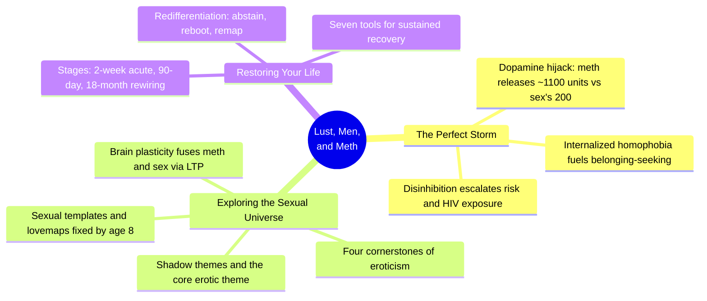
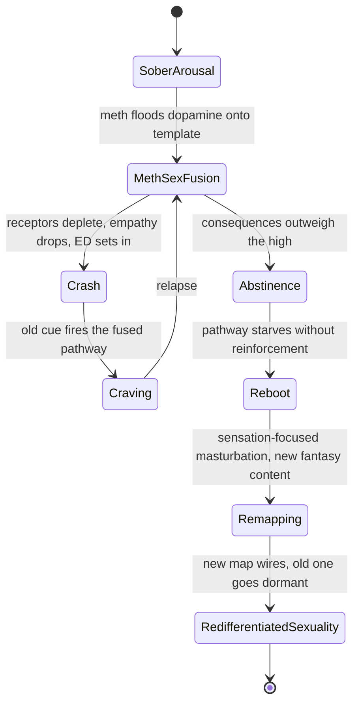
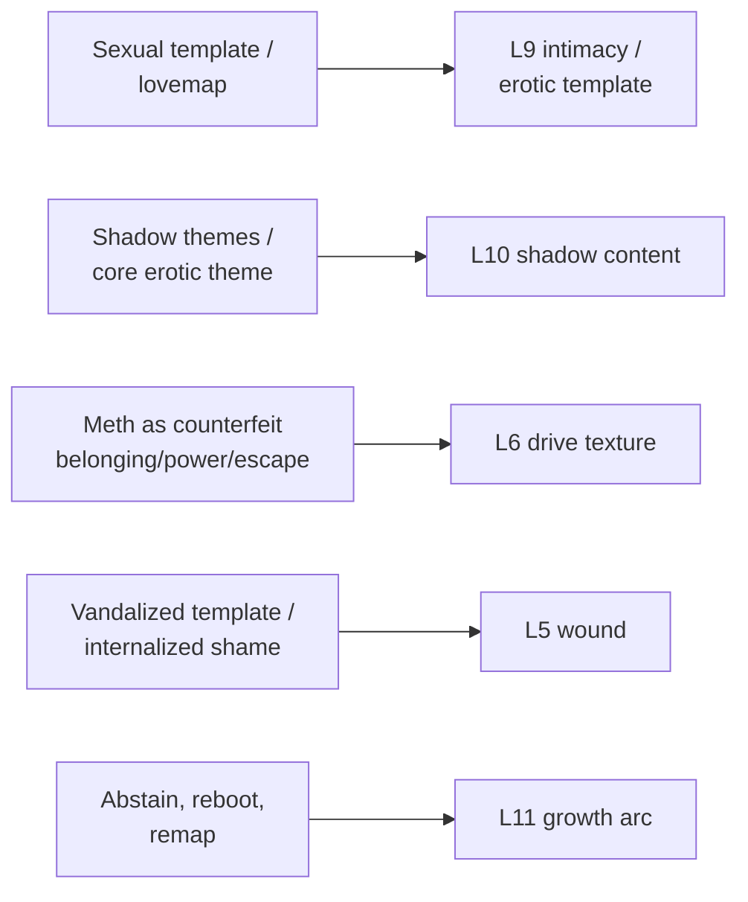

# 🧬 PSY.08 — Lust, Men, and Meth — Fawcett (2015)
### Knowledge Entry — Distill

A sex therapist and addiction counselor's clinical guide to why methamphetamine and gay male sexuality fuse into one neural loop, and how that fusion is undone; the first BVX-LEARN entry to carry a full chemsex-and-recovery model into the intimacy layer.

## TABLE OF CONTENTS
- [Core Thesis](#1-core-thesis)
- [Mind Models](#2-mind-models)
- [Framework](#3-framework--structure)
- [Key Concepts](#4-key-concepts)
- [Heuristics](#5-heuristics--decision-rules)
- [Invariants](#6-invariants)
- [Pitfalls](#7-pitfalls--myths)
- [Application](#8-application)
- [Cross-References](#9-cross-references)
- [Provenance](#10-provenance--confidence)

---

## 1 · CORE THESIS

Methamphetamine fuses with sexual desire because it hijacks the same dopamine circuit that generates arousal, welding drug and sex into one neural loop that shame, taboo, and unmet belonging make unusually binding. Recovery is not returning to old sexuality but rewiring it: abstain first, then deliberately rebuild new erotic pathways, sensation before fantasy.

---

## 2 · MIND MODELS

*Required. Minimum two diagrams, maximum five.*

**Diagram 1 — the whole argument.**
Caption: *three parts, one throughline — a dopamine hijack (Part I) exploits a pre-existing template and its shadow (Part II), and recovery must rebuild the very system that got hijacked (Part III).*

**Diagram 2 — the central mechanism (a state change under a chemical and its reversal).**
Caption: *the whole book is one loop — the same states that get built under meth (fusion, crash, craving) must be visited in reverse, starved rather than argued with, to come apart.*

**Diagram 3 — mapped onto the Command's 12-layer character stack.**
Caption: *five clinical concepts key directly onto five character layers — this book is a ready-made pipeline for any character whose desire runs through a wound.*

---

## 3 · FRAMEWORK / STRUCTURE

Three parts, each with its own governing question, moving from mechanism to damage to repair:

| Part | Chapters | Governing question |
|---|---|---|
| I · The Perfect Storm | Gay Men, Meth, and Sex · The Hijacking of Sexual Desire · The Chase for Intensity · Men, Drugs, and a Deadly Virus | Why does this specific drug weld itself to this specific population's sexuality? |
| II · Exploring the Sexual Universe | Sexual Templates, Themes, and Shadows · The Aphrodisiac Effect of Secret Desires · Sex and the Plastic Brain | What is desire made of, before any drug touches it, and how does the brain let two things become one? |
| III · Restoring Your Life | The Recovery Process · Healing Old Wounds · Embracing Feelings · Seven Essential Tools · Epilogue | How do you take the fused thing apart and grow a working sexuality back? |

Fawcett writes as a working clinician: every mechanism is illustrated by a composite or anonymized client case (Mike, Stanley, Matthew, Todd, Neal, Ted, Sam), and the science (dopamine, limbic system, neuroplasticity) is always in service of a specific man's specific relapse or specific recovery, never presented in the abstract.

---

## 4 · KEY CONCEPTS

| Concept | What it is | Why it matters |
|---|---|---|
| **The dopamine differential** | Measured dopamine release: food ~150 units, sex ~200, nicotine ~250, cocaine ~350, methamphetamine ~1,100 | Explains in one number why meth out-competes every other reward, including sex itself, for the brain's attention |
| **Sexual template / lovemap** | John Money's term for the fixed, largely unconscious pattern of what a person finds arousing (body type, age, scenario, power dynamic), set by early puberty and essentially permanent after | The single most load-bearing concept in the book: meth doesn't create new desires, it exposes and unbinds elements of a template that was already there |
| **Template "vandalism"** | Templates are most vulnerable between ages 5–8; abuse, deprivation, or punishment at that age can weld arousal to shame, pain, or a paraphilic substitute object | Explains why a template's darkest element is often the oldest wound, not a moral failing or a drug-created taste |
| **The four cornerstones of eroticism** (Morin) | Longing and anticipation · breaking taboos · searching for power · overcoming ambivalence — the four interpersonal dynamics that ratchet up desire | A portable checklist for why any given attraction is charged; meth amplifies all four simultaneously, which is why it feels like desire "going nuclear" |
| **Core erotic theme / shadow theme** | A person's recurring emotional storyline (e.g., "seduce a dangerous man and survive it") that persists under any surface costume; Jung's "shadow" is the disowned material a theme is built to metabolize | The theme is stable even when the content of a fantasy escalates under drugs — treat the theme, not the latest costume |
| **Sexual scripts (cultural / interpersonal / intrapsychic)** | Gagnon and Simon's three-tier model of where sexual meaning comes from — society, relationships, and the individual mind | The intrapsychic script is what meth exposes; it was always there, just below conscious reach |
| **Crystal dick** | Meth constricts blood vessels via its pseudoephedrine precursor, so heightened desire coexists with an inability to get or keep an erection, often producing an "instant bottom" | A concrete, unglamorous physiological fact that undercuts the myth of meth-sex as peak performance |
| **The brain trap (LTP) and redifferentiation (LTD)** | Long-term potentiation fuses two previously separate brain functions (drug high, sexual arousal) into one map; long-term depression is the slow, imperfect process of separating them again | Names why quitting meth can mean temporarily losing sexual desire entirely — the two were never separate to begin with |
| **Sensitization and tolerance** | Repeated dopamine flooding reduces receptor count, so normal stimuli (sober sex, a real partner) stop registering, and increasingly extreme stimuli are needed for the same effect | The mechanism behind "kink-creep" and why vanilla sex feels dead in early recovery — it is a receptor problem, not a preference change |
| **Cross-addiction and the relapse domino** (Gorski) | Any unaddressed compulsive outlet (sex, gambling, work, spending) can tip over the first domino leading back to the primary drug | Total abstinence from all compulsive "back doors," not just the named substance, is the operative recovery principle |
| **Stages of recovery** | Acute (0–2 weeks: crash, paranoia, physical symptoms) → early (2 weeks–90 days: fuzzy cognition, high relapse risk) → rebuilding (90 days–18 months: new neural pathways, dopamine system regenerates) | Gives a concrete timeline for how long "not wanting sex at all" is expected to last, and when to worry if it doesn't shift |
| **Seven essential tools** | Mindfulness · self-compassion and forgiveness · connecting with the inner child · discovering shadows · fueling optimism · practicing gratitude · developing empathy | The book's working toolkit for the emotional labor recovery requires once the drug can no longer numb it |

---

## 5 · HEURISTICS & DECISION RULES

| Situation | Do this | Not this |
|---|---|---|
| Writing a character's drug-sex fusion | Show a template that pre-existed the drug, now unbound and exposed | Write the drug as inventing a new, unrelated kink or desire |
| A character discovers a shocking fantasy in an altered state | Treat it as a buried element of an old template becoming conscious, with full recall | Treat it as an alcohol-style blackout with no ownership |
| Depicting relapse into old sexual behavior | Show boredom and unstructured time as the trigger, not just temptation | Show relapse as purely a moment of moral weakness |
| A character in early recovery reports no sexual desire at all | Write this as expected, receptor-level, lasting months, sometimes 18 | Write it as psychological resistance to be argued out of |
| A character tries to "get back to normal" sex quickly | Show sensation-first, fantasy-content-avoidant masturbation before partnered sex | Show them jumping straight back into their old scripts or partners |
| A character's core shame gets sexualized | Trace it to a specific early wound (ages 5–8) that got "vandalized" | Present it as an arbitrary or purely aesthetic kink |
| Someone urges a character to just stop wanting the taboo thing | Show that templates can be expanded with new content, never erased | Show successful "conversion" or eradication of an element of desire |
| A recovering character seeks intensity | Name the four cornerstones (longing, taboo, power, ambivalence) driving it | Treat "chasing a high" as an unexplained appetite |
| Writing a clinician or helper character | Have them approach with respect and curiosity, not confrontation or moral horror | Use a "scared straight" or shaming intervention style |
| A character faces a support-system collapse | Show that drug-only friendships evaporate once the drug stops, and name that grief | Treat lost friendships from the addiction as a minor detail |

---

## 6 · INVARIANTS

1. **Meth does not create desire, it exposes and unbinds an existing template.** Whatever a person finds arousing was present before the drug; meth's disinhibition brings buried elements into consciousness and dissolves the rigidity that once contained them.
2. **Sexual templates are set young (ages 5–8 are most vulnerable) and are permanent once formed.** Elements can be added around a template; none can be surgically removed. Aversion therapy and "conversion" approaches fail because of this.
3. **Fused neural pathways (drug + sex) cannot be argued apart, only starved and replaced.** Long-term potentiation binds two functions; long-term depression, the slow un-binding, requires abstinence and new repeated experience, not insight alone.
4. **Loss of libido after quitting is a receptor-level fact, not a psychological failure.** Sensitization from chronic dopamine flooding reduces receptor density; normal stimuli genuinely register as less arousing for a period measured in months.
5. **Shame that fuses with arousal in childhood becomes a lifelong erotic theme, not a phase.** The specific content varies; the underlying theme (what is being converted from threat to pleasure) persists across a person's sexual history.
6. **Objectification and reduced empathy are the direct cost of drug-amplified lust**, and they scale with dose and duration, not with the partner's consent to the scene.
7. **Cross-addiction defeats single-substance recovery.** Any unaddressed compulsive outlet becomes the first domino back to the primary drug.
8. **Recovery timelines are physiological, not willpower-based**: roughly two weeks acute, ninety days for the highest relapse risk, up to eighteen months for the dopamine transporter system to substantially recover.

---

## 7 · PITFALLS / MYTHS

- Treating meth as just another "drug du jour" that will fade — its dopamine release (~1,100 units) and receptor-destroying toxicity make it categorically different from cocaine or alcohol.
- Believing sexual orientation or a sexual template is a choice, or that either can be corrected by therapy, aversion, or willpower — Fawcett states both are fixed and treats attempts to change them as actively harmful.
- Confrontational, shame-based treatment models — they compound the exact shame that fuels the addiction and drive users further underground.
- Assuming a shocking fantasy revealed under meth was invented by the drug — it was very likely already part of the person's template, simply unexposed.
- Expecting sexual desire to return quickly or at all once meth stops — many men wait six months to a year, and premature attempts to force arousal usually pull them back into the old, drug-linked scripts.
- Interpreting a client's or character's dark fantasy as intent to act, rather than as symbolic material (a "heroic effort," in the sexologists' phrase, to rescue lust from total suppression).
- Believing meth-driven "connection" during sex is real intimacy — it is described by users themselves as feeling profound in the moment and leaving them lonelier afterward.
- Twenty-eight-day inpatient or heavy confrontational-detox models, effective for alcohol/opiates, generally fail meth users because of impaired verbal memory and short attention span in early recovery; shorter, visually-oriented, repeated-contact formats work better.

---

## 8 · APPLICATION

- **Spine level:** L5 (WOUND) — this is fundamentally a wound-and-recovery source: the fusion is built on an early injury (shame, internalized homophobia, a "vandalized" template) and the plot Fawcett tells, case after case, is the working-through of that wound via substance and then via recovery.
- **12-layer character stack:** primary at L9 (erotic template/intimacy) and L10 (shadow content); supporting at L6 (drive texture) and L5 (wound); supporting at L11 (growth arc) for the recovery model specifically.
- **plot_systems:** contextual — the "four cornerstones of eroticism" (longing, taboo, power, ambivalence) function as a ready-made desire-intensity dial for any scene needing to explain why an attraction has unusual charge, independent of substance use.
- **Setting:** none directly — this is a character/psychology-layer source, not a setting source.

For the intimacy and sexuality layer of a fiction character system, this book supplies something rare: a clinically grounded, non-euphemistic account of how desire, shame, trauma, and a specific chemical can weld into one structure, and a structured account of how that structure is dismantled. It gives a writer permission and vocabulary to render a character's arousal as specific and templated rather than generic ("he likes men" versus "his template is fixed on power-differential scenarios with an undercurrent of danger, formed around age seven"), and to render recovery as a rebuild rather than a reset — new pathways grown deliberately alongside old ones left to go dormant, never erased. The seven tools (§4) double as a scene-generation checklist for a recovery arc: a mindfulness scene, a shadow-confrontation scene, an inner-child scene, a gratitude-practice beat, an empathy-repair scene with a partner or ally.

---

## 9 · CROSS-REFERENCES

| Related entry | Relation |
|---|---|
| [[🧬 MSX.17 — Mating in Captivity — Perel (2006)]] | Counterpoint on the same axis: Perel treats security/desire polarity as the universal condition of long-term intimacy; Fawcett treats the same taboo-and-distance mechanics as hijacked by a specific chemical in a specific population — read together, the healthy and the addicted versions of the same erotic engine |
| [[🧬 PSY.03 — Unlimited Intimacy — Dean (2009)]] | Sibling on the same shelf: Dean's ethnography of the barebacking subculture is the community-level, meaning-making account of the same risk behaviors Fawcett treats clinically as symptoms of drug-fused desire |
| [[🧬 PSY.06 — Fuckology — Downing, Morland & Sullivan (2014)]] | Critical counterweight: Fawcett uses John Money's "lovemap"/template concept uncritically as clinical fact; Fuckology is the theoretical interrogation of Money's diagnostic categories this book never pauses to make |
| [[🧬 MSX.14 — The New Bottoming Book — Easton & Hardy (2001)]] | Adjacent on power-exchange: Fawcett's "searching for power" cornerstone and top/bottom-as-erotic-role material sits upstream of Easton and Hardy's practical treatment of the same dynamic without drugs in the frame |

---

## 10 · PROVENANCE & CONFIDENCE

Full text read from a pdftotext extraction of the complete book (front matter, all three parts, epilogue; ~1,275 lines of extracted text). Read in full: Foreword, Introduction, all four chapters of Part I ("Gay Men, Meth, and Sex," "The Hijacking of Sexual Desire," "The Chase for Intensity," "Men, Drugs, and a Deadly Virus"), all three chapters of Part II ("Sexual Templates, Themes, and Shadows," "The Aphrodisiac Effect of Secret Desires," "Sex and the Plastic Brain"), and the opening two chapters plus the full "Seven Essential Tools" chapter and Epilogue of Part III. Sampled at chapter-boundary level only (not deep-extracted): "Healing Old Wounds" and "Embracing Feelings" (Part III, between the Recovery Process chapter and the Seven Tools chapter) and the closing Appendix on other substances and Recommended Reading list. The dopamine-unit figures, the lovemap/template model (Money), the four cornerstones (Morin), and the LTP/LTD brain-trap framing (Merzenich, via Doidge) are all drawn directly from full-text passages, not secondary summary. The `feeds:` keying against the 12-layer character stack is this distill's own synthesis, built by analogy to the layer-naming already established in [[🧬 MSX.17 — Mating in Captivity — Perel (2006)]] and in the L5–L12 usage visible across the KNOWLEDGE_AREAS index; no SSOT document defining exact L-layer boundaries for the sexuality/intimacy shelf was available at time of writing, so this keying should be treated as a first pass, not a ruled mapping.

## META
- Template: BVX-LEARN-v4.0
- Source classification: full-text book extraction, deep read on 9 of 13 chapters plus front/back matter, sampled on 2 middle chapters and the appendix
- Created / Updated: 2026-09-29
