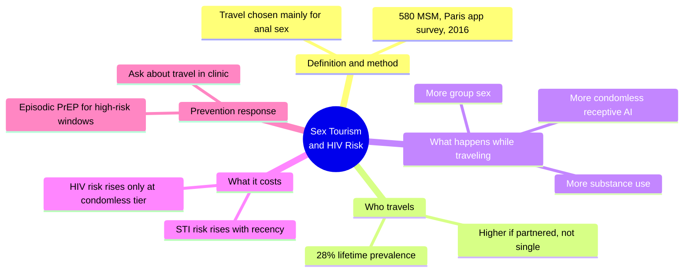
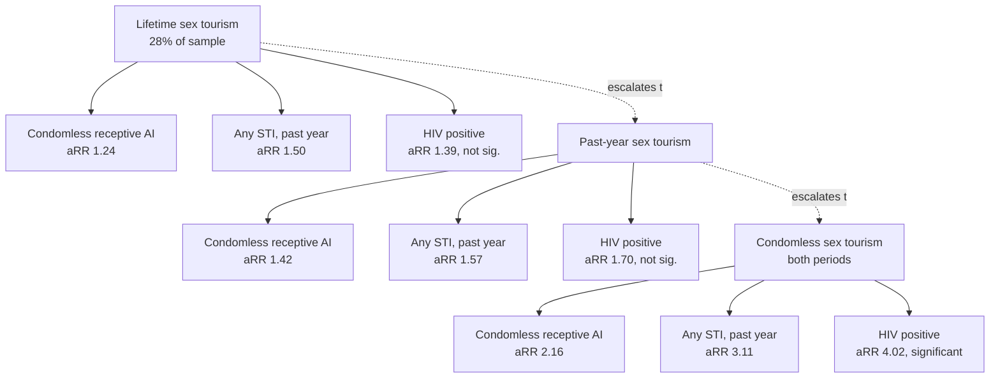
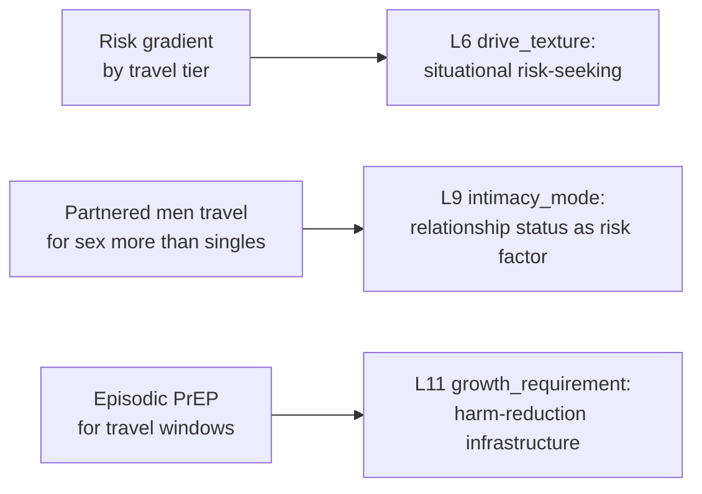

# 🧬 PSY.09 — Sex Tourism and HIV Risk — Harry-Hernández et al. (2019)
### Knowledge Entry — Distill

A cross-sectional survey of 580 geosocial-app-using men who have sex with men (MSM) in Paris, the first study of sex tourism and HIV/STI risk conducted in Western Europe; it turns "travel for sex" from an anecdote into a measured, graded risk factor.

## TABLE OF CONTENTS
- [Core Thesis](#1-core-thesis)
- [Mind Models](#2-mind-models)
- [Framework / Structure](#3-framework--structure)
- [Key Concepts](#4-key-concepts)
- [Heuristics & Decision Rules](#5-heuristics--decision-rules)
- [Invariants](#6-invariants)
- [Pitfalls / Myths](#7-pitfalls--myths)
- [Application](#8-application)
- [Cross-References](#9-cross-references)
- [Provenance & Confidence](#10-provenance--confidence)

---

## 1 · CORE THESIS

Sex tourism (travel chosen mainly for anal intercourse) is common among MSM (28% lifetime in this Paris sample) and behaves as a risk escalator: risk climbs from lifetime engagement, to recent engagement, to condomless engagement, where STI risk triples and HIV risk quadruples. It also tracks relationship status, not just singlehood.

---

## 2 · MIND MODELS

*Required. Minimum two diagrams, maximum five.*

**Diagram 1 — the whole argument.**
Caption: *five moving parts: definition, who travels, what they do while traveling, what it costs them, and what clinics should do about it.*

**Diagram 2 — the central mechanism (a dose-response gradient).**
Caption: *the finding is not "sex tourism is risky," it is a staircase: each tier of the same behavior carries a bigger adjusted risk ratio (aRR), and HIV only becomes significant at the top step.*

**Diagram 3 — mapped onto the Command's character system.**
Caption: *three findings, three feeds: the escalator is a drive texture, the partnered-uptake finding complicates intimacy mode, and episodic PrEP is a concrete growth-requirement prop.*

---

## 3 · FRAMEWORK / STRUCTURE

A single cross-sectional online survey, structured in four moves:

1. **Recruit.** An ad ran on a popular geosocial-networking (GSN) app for MSM in Paris for 72 consecutive hours in October 2016, in English and French, offering a chance to win €65. It read: "Looking to improve your health and the health of those in your community? Share your thoughts with us on gay and bisexual men's health…"
2. **Translate and administer.** The 52-item survey was built in English, translated to French by three independent translators, reconciled by a fourth, then back-translated to check accuracy (the translate/review/adjudicate/pretest/document model). 5,206 users clicked through; 935 began the survey; 580 completed it (62% completion rate).
3. **Measure five things.** (a) Sex tourism itself, a single item asking whether the respondent ever vacationed with the main goal of anal intercourse, with or without a condom, in the last year or lifetime; (b) condomless insertive and receptive anal intercourse, past 3 months; (c) group sex (3+ people, one encounter); (d) alcohol/drug use before or during sex, past 3 months; (e) HIV status and six STIs (gonorrhea, chlamydia, syphilis, HSV, HPV, hepatitis C) diagnosed in the past year.
4. **Model it three ways.** Log-binomial (or modified Poisson, where models failed to converge) regression tested three separate sex-tourism variables, ever (lifetime), recent (past year), and condomless, against every outcome, each adjusted for age, sexual orientation, being born in France, employment, and relationship status.

---

## 4 · KEY CONCEPTS

| Concept | What it is | Why it matters |
|---|---|---|
| **Sex tourism (operational definition)** | "Gone on a vacation or selected a vacation site with the main goal of having anal intercourse with or without a condom with one or more partners" | A single yes/no item, but the study then splits it three ways (lifetime / recent / condomless): the definition is broad, the analysis is what does the work |
| **The three sex-tourism variables** | Lifetime (ever), recent (past year), condomless (without a condom, both recently and ever) | Not three separate behaviors, but a nested severity ladder, each a subset of the one before it, with risk climbing at every step down |
| **Dose-response gradient** | Adjusted risk ratios rise from ~1.1–1.5 (lifetime) to ~1.2–1.7 (recent) to ~1.9–4.0 (condomless) across the same outcomes | The paper's real finding: sex tourism is not one risk factor, it is a spectrum, and only the riskiest tier moves HIV status significantly |
| **Nonmain partner** | Someone the respondent had sex with but did not consider a main partner | The behavioral backdrop sex tourism happens against: casual, often first-time, partners |
| **Direction of travel** | Sex tourists in this and prior studies (French, American, Chinese) tend to travel from lower-HIV-prevalence places to higher-prevalence ones | Structurally raises exposure risk independent of any individual behavior change |
| **Circuit party attendance** | Multi-day dance/party events tied to gay resort and vacation culture | A previously identified predictor of sex tourism, alongside HIV serostatus and partner count |
| **Disinhibition hypothesis** | Travel loosens home-context norms and self-monitoring, elevating risk behavior | The dominant explanation in the literature (11x higher condomless AI at a resort vs. 60 days at home in one prior study), though not the only pattern found |
| **Truong's counter-finding** | A separate San Francisco study found MSM reported *fewer* risky behaviors during international travel than locally | Disinhibition is not universal: some travelers behave more cautiously abroad, a pattern the field has not yet reconciled with the disinhibition studies |
| **Episodic PrEP** | Pre-exposure prophylaxis taken only around defined high-risk windows rather than daily | The paper's proposed intervention: matched to a bounded trip rather than an ongoing regimen |

---

## 5 · HEURISTICS & DECISION RULES

| Situation | Do this | Not this |
|---|---|---|
| Writing a gay/bi character planning a vacation | Treat roughly a 1-in-4 to 1-in-3 chance the trip is at least partly sex-motivated, higher if he's partnered | Assume travel-sex only happens to single, unattached characters |
| Showing a character who travels for sex | Pair it with a realistic behavior cluster: more condomless sex, more group sex, more alcohol/drugs than his baseline | Show one behavior in isolation as if the others don't cluster with it |
| Writing risk escalation across a trip or a season | Use the gradient: a first trip reads different from a habitual traveler, which reads different from someone who has stopped using condoms on trips | Write "sex tourist" as one flat risk level regardless of frequency or condom use |
| A character gets an HIV diagnosis after travel | Anchor it to the condomless tier specifically (aRR 4.02); lifetime or recent sex tourism alone barely moves HIV odds | Have any vacation-sex history "cause" an HIV plot beat with equal weight |
| A partnered character has an affair-adjacent trip | Know that partnered men reported *more* lifetime sex tourism than singles (33.1% vs. 24.9%) in this sample | Write vacation infidelity as a single-man's-only behavior for plausibility |
| A clinician or friend character responds to travel-sex disclosure | Have them ask about the trip specifically and mention episodic PrEP as a real option | Have them treat any disclosure as either shameful or a non-issue with no follow-up questions |
| Depicting risk-taking abroad for "realism" | Remember the counter-finding: some men reduce risk while traveling internationally | Assume disinhibition is a law of nature that applies to every character every time |
| Building a scene involving language barriers and a partner met abroad | Treat unclear serostatus disclosure as a real, documented risk factor, not an oversight to skip past | Have characters casually and fluently discuss HIV status across a language barrier with no friction |

---

## 6 · INVARIANTS

1. **Risk rises with recency, not just lifetime history.** Past-year sex tourism carries higher adjusted risk ratios than ever-in-a-lifetime sex tourism across nearly every outcome measured.
2. **Condomless sex tourism is a distinct, much higher tier, not a variant of the same risk.** Its adjusted risk ratios (1.9–4.0) dwarf lifetime (1.1–1.5) and recent (1.2–1.7) tiers, and it is the only tier where HIV status itself becomes significantly elevated (aRR 4.02).
3. **Sex tourism clusters with other risk behaviors.** It is independently associated with condomless receptive anal intercourse, group sex participation, and substance use before or during sex; it is not associated with condomless insertive intercourse or overall condomless intercourse, which stayed non-significant.
4. **STI risk is infection-specific.** Gonorrhea (aRR 2.18) and chlamydia (aRR 2.03) were significantly elevated by lifetime sex tourism; syphilis, herpes, and HPV were not significant on their own, though the composite STI measures were.
5. **Sex tourism is not a singles-only behavior.** Men in a relationship with a man reported higher lifetime engagement (33.1%) than single men (24.9%), a statistically significant difference (p = .046).
6. **Direction of travel matters structurally.** Sex tourists in this and other studies tend to travel toward higher-HIV-prevalence destinations from lower-prevalence ones, adding exposure risk independent of behavior change.
7. **Self-reported, cross-sectional data cannot establish causation.** The study demonstrates association only; it does not show sex tourism causes STI/HIV acquisition, nor pin down where transmission occurred.
8. **The partner's identity is unknown.** Whether a condomless encounter was with a fellow traveler, a local resident, or a sex worker is not captured, and destination is not recorded; the mechanism of exposure stays a real gap, not a settled fact.

---

## 7 · PITFALLS / MYTHS

- Treating "vacation sex" as automatically low-stakes or harmless because it's framed as leisure: the data show the opposite gradient.
- Assuming disinhibition abroad is universal; a separate San Francisco cohort found the reverse pattern (fewer risky behaviors internationally).
- Assuming sex tourism is a single-men's phenomenon; partnered men reported more of it in this sample.
- Collapsing "ever" and "condomless" sex tourism into one risk level: they are different tiers, with an order-of-magnitude difference in adjusted risk for HIV.
- Reading the STI findings as blanket: only gonorrhea, chlamydia, and the composite measures reached significance; syphilis, HSV, and HPV did not individually.
- Inferring where or with whom transmission happened: the study cannot say whether risk played out with a local, a fellow traveler, or a sex worker, or at which destination.
- Treating this as a story about American or Caribbean/African sex tourism (the literature's usual setting): this is the first data on Western European (French) MSM, a region with its own high HIV prevalence (up to 17.7% among MSM in France) independent of the tourism literature's usual geography.

---

## 8 · APPLICATION

- **Spine level:** L5
- **12-layer character stack:** L6 (drive_texture — situational risk-seeking under travel/context-shift), L9 (intimacy_mode — relationship status as a sex-tourism risk factor, not just singlehood), L11 (growth_requirement — episodic PrEP as harm-reduction infrastructure)
- **plot_systems:** contextual — the three-tier gradient (lifetime → recent → condomless) is a ready-made escalation ladder for a travel-sex subplot, and the "direction of travel toward higher prevalence" finding is a concrete, non-moralizing way to raise stakes on a trip
- **Setting:** contextual — travel destinations (resorts, circuit parties, cities with high local HIV prevalence) are the backdrop this behavior plays out against, though this paper does not itself supply setting detail

This entry exists to let a writer render gay and bi men's travel-sex behavior, risk, and prevention truthfully rather than by cliché. The load-bearing move for character work is the gradient in Diagram 2: a character who has ever traveled for sex is a mild risk case: a character who does it regularly is a moderate one; a character who has stopped using condoms on those trips is the one for whom an HIV or STI plot beat is statistically earned, not imposed. The partnered-uptake finding (33.1% vs. 24.9%) is equally useful as a corrective — it lets a writer put this behavior on a partnered character without breaking plausibility, and it pairs cleanly with MSX.17's "shadow of the third" concept: travel-sex is one concrete, real-world shape that third can take. Episodic PrEP is a small, precise, undramatic detail — a pill pack, a clinic conversation — that signals a character (or the people around him) taking real-world risk seriously without turning the scene into an after-school special.

---

## 9 · CROSS-REFERENCES

| Related entry | Relation |
|---|---|
| [[🧬 PSY.03 — Unlimited Intimacy — Dean (2009)]] | Direct thematic sibling — Dean's subculture-of-barebacking ethnography supplies the interior, meaning-making register; this paper supplies the population-level numbers behind the same condomless-sex behavior |
| [[🧬 PSY.07 — Sex and Leisure — Parry & Johnson (2020)]] | Shares the travel/leisure frame directly — Parry & Johnson theorize sex as leisure activity, this paper measures a specific leisure-sex behavior (vacation sex) and its health costs |
| [[🧬 MSX.17 — Mating in Captivity — Perel (2006)]] | Perel's "shadow of the third" and distance-fuels-desire mechanism is the psychological engine; this paper shows one real-world, risk-bearing form that engine takes when a partner travels for sex |

---

## 10 · PROVENANCE & CONFIDENCE

Full text read in full — an 8-page research article (Journal of the Association of Nurses in AIDS Care, July–August 2019), including abstract, introduction, methods, all five results tables, discussion, future research, limitations, and conclusion. All percentages and adjusted risk ratios (aRR) with 95% confidence intervals cited above are taken directly from the article's Tables 1–5 and results text, not estimated or rounded beyond what the source itself reports. Confidence is high for the quantitative findings (a single, well-described cross-sectional survey, N = 580, log-binomial/modified-Poisson regression, clearly reported adjustment covariates); confidence is lower, and flagged as such throughout, for causal or mechanistic claims (partner identity, transmission location, and directionality are explicitly unmeasured per the article's own limitations section). The `feeds:` variable names (drive_texture, intimacy_mode, growth_requirement) are reused deliberately from MSX.17's established vocabulary for the L6/L9/L11 layers rather than invented fresh, per the shared 12-layer character-stack schema.

## META
- Template: BVX-LEARN-v4.0
- Source classification: full-text journal article, complete read
- Created / Updated: 2026-09-29
