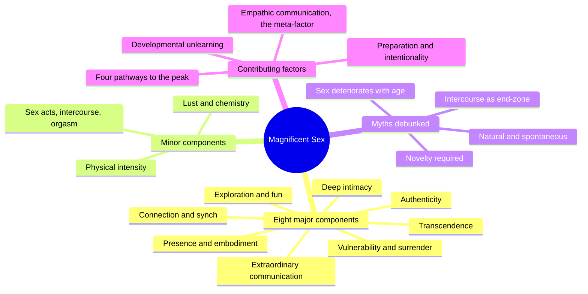
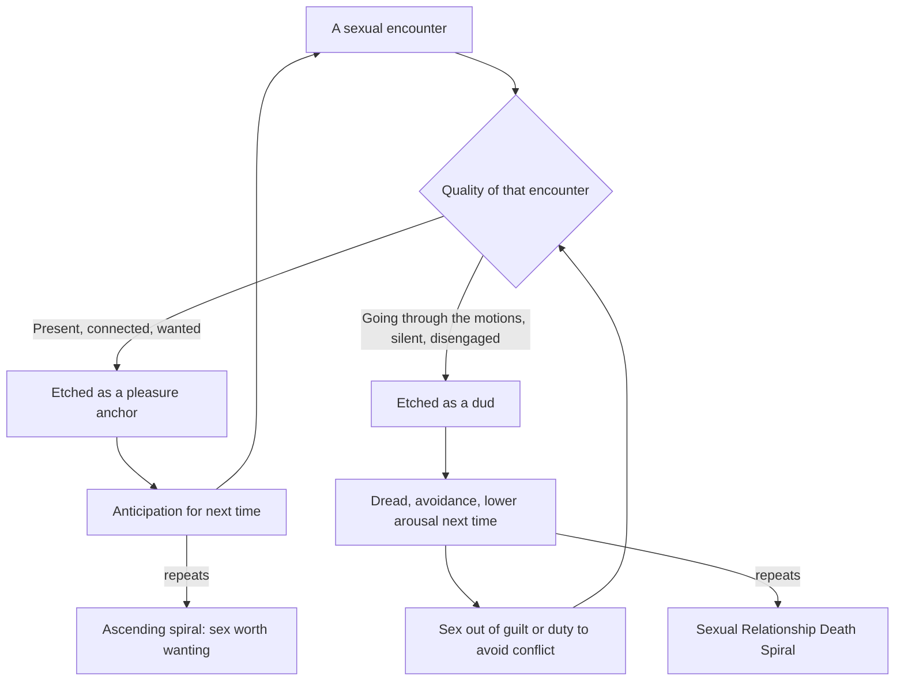
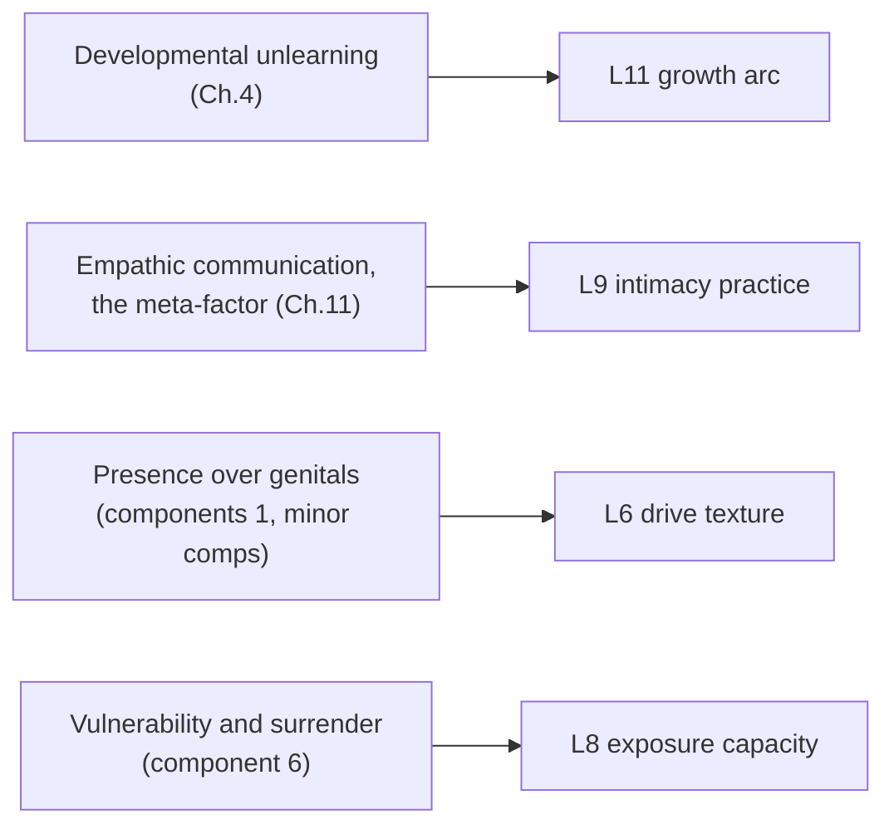

# 🧬 PSY.10 — Magnificent Sex — Kleinplatz & Ménard (2020)
### Knowledge Entry — Distill

The largest phenomenological interview study of people having extraordinary sex ever conducted (75 "extraordinary lovers" plus 20 sex therapists), yielding an empirically-derived model of what magnificent sex actually is, why it has almost nothing to do with media depictions, and how ordinary lovers built it.

## TABLE OF CONTENTS
- [Core Thesis](#1-core-thesis)
- [Mind Models](#2-mind-models)
- [Framework](#3-framework--structure)
- [Key Concepts](#4-key-concepts)
- [Heuristics](#5-heuristics--decision-rules)
- [Invariants](#6-invariants)
- [Pitfalls](#7-pitfalls--myths)
- [Application](#8-application)
- [Cross-References](#9-cross-references)
- [Provenance](#10-provenance--confidence)

---

## 1 · CORE THESIS

Magnificent sex is eight learnable components — led by presence, connection, and empathic communication — not a body in the right position. Genitals, intercourse, and orgasm are minor and dispensable. Great lovers are made, not born: optimal sex is built through deliberate unlearning and relational risk, most often discovered at midlife.

---

## 2 · MIND MODELS

*Required. Minimum two diagrams, maximum five.*

**Diagram 1 — the whole argument.**
Caption: *eight major components dwarf the minor, physical ones — the book's real surprise is how little genitals and orgasm matter to the people actually having the best sex of their lives.*

**Diagram 2 — the central mechanism (a state change: dread versus anticipation).**
Caption: *the same feedback loop runs in both directions — the quality of last time, not the frequency of sex, decides whether next time is dreaded or wanted.*

**Diagram 3 — mapped onto the Command's 12-layer character stack.**
Caption: *the book's four contributing-factor chapters land on four different layers — this is a character's sex life built in parts, not one dial.*

---

## 3 · FRAMEWORK / STRUCTURE

A phenomenological interview study (descriptive, discovery-oriented, not hypothesis-testing), built in four parts:

| Part | Chapters | Governing question |
|---|---|---|
| I — Introduction | 1 | How and why was this studied, and who counts as an expert on great sex? |
| II — Components | 2–3 | What *is* magnificent sex, and how does it differ from the media myth? |
| III — Contributing Factors | 4–12 | What brings magnificent sex about, across development, preparation, individual and relational qualities, skills, and the pathways lovers actually take? |
| IV — Implications | 13–14 | What does this mean for lovers and for sex therapy, especially around low desire? |

Participants: 30 individuals over 60 in relationships of 25+ years, 25 self-identified sexual-minority individuals (LGBTQ, kink, poly), and 20 sex therapists — recruited because each group had been forced, by age, marginalization, or profession, to think outside normative sex scripts. Masked-transcript analysis found the research team could not distinguish participants by sex, age, or kink status — but could reliably spot the sex-therapist transcripts, which skewed pessimistic about long-term desire.

---

## 4 · KEY CONCEPTS

| Concept | What it is | Why it matters |
|---|---|---|
| **The eight major components** | Presence/embodiment; connection/synch; deep intimacy; extraordinary communication and empathy; authenticity; vulnerability and surrender; exploration/risk-taking/fun; transcendence and transformation | Identical across sex, age, orientation, and kink status — "the view from the top of the mountain is the same," even though the climb differs |
| **The minor components** | Lust/attraction/chemistry, physical intensity, and sex acts (kissing partially excepted, intercourse and orgasm largely irrelevant) | The data "consistently converge showing that the physical is fairly irrelevant to magnificent sex" — directly inverts the pop-culture and Cosmo model of great sex |
| **The cookie-recipe model** | All optimal experiences share the same eight ingredients, but proportions, order, and "oven temperature" differ per couple | Explains why the components are universal but no two magnificent sex lives look alike; guards against turning the eight components into a checklist |
| **Great lovers are made, not born** | Most extraordinary lovers first found "great" sex in midlife, after years of unlearning shame, guilt, and normative scripts, not in youth or a first relationship | Reframes optimal sex as a developmental achievement with a known unlock condition, not a genetic gift or a phase that fades |
| **"Every point of pleasure on the circle is an end in itself"** | Rejects the linear desire → foreplay → intercourse → orgasm script in favor of a non-hierarchical circle where any act can be the point | Kills the "did we have real sex" anxiety and the idea that anything short of intercourse is incomplete |
| **The Sexual Relationship Death Spiral** | Sex-out-of-duty produces lower engagement, which produces worse sex, which produces more duty-sex and more dread, compounding until frequency becomes the couple's central fight | The named mechanism behind chronic low desire; the fix is reversing the loop toward quality, not scheduling more frequency |
| **Empathic communication, the meta-factor** | Verbal and tactile communication so total it functions as a sexual act itself — reading and responding to a partner's cues, not just disclosing preferences | The single thread running through every other component; "at heightened levels of empathy... empathy is the linchpin of relational qualities" |
| **Four pathways to the peak** | Pathway A: relationship qualities (trust, safety) produce individual growth. Pathway B: individual qualities (sex-positivity, confidence) produce relational growth. Pathway C: self-relationship (valuing one's own pleasure as an entitlement). Pathway D: specific erotic preferences | Settles a real clinical fight (differentiation vs. attachment vs. Perel's separateness) by showing all four routes reach the same summit — there is no single correct sequence |
| **Symptom vs. signpost** | Low desire is reframed from a dysfunction to a signal: "your body's understandable response to sex that is mechanically functional but otherwise uninspiring" | Directly reverses standard sex-therapy framing; the "cure" for low desire/frequency is creating desirable sex, not raising frequency |

---

## 5 · HEURISTICS & DECISION RULES

| Situation | Do this | Not this |
|---|---|---|
| A couple argues about sexual frequency | Shift the conversation to the quality and meaning of the sex on offer | Negotiate a compromise number of times per month |
| Someone says "if I never had sex again I wouldn't miss it" | Treat it as evidence of good judgment about *that* sex, and ask what sex they would miss | Diagnose it as a desire disorder needing correction |
| Writing a couple whose "spark" has faded | Show accumulated duty-sex and disengagement (the death spiral), not just declining hormones | Default to "the honeymoon phase just wore off" as the whole explanation |
| A character is expected to want sex because it's "natural" | Treat sexual desire like cultivated taste (a cooked meal), requiring preparation and attention | Write desire as an involuntary bodily reflex like hunger or breathing |
| Depicting a long-term or older couple's sex life | Let their sex be better than their youth's, driven by earned maturity and lowered shame | Default to sitcom-style decline, dysfunction, or asexuality |
| A partner reveals a fantasy or kink | Render it as a bid for trust and revelation, met with curiosity | Play it for shock, judgment, or as proof of dysfunction |
| Building a scene meant to read as genuinely erotic | Foreground presence, attention, and responsive touch/word over choreography | Default to technique, position, or a checklist of acts |
| A character routes their whole identity through "parent" or "provider" | Show the erotic self protected as a separate, deliberately guarded space | Let the adult sexual self simply vanish once a caretaking role begins |

---

## 6 · INVARIANTS

1. **The eight components are universal**, indistinguishable across sex, age, orientation, and kink status; only the pathway to them differs.
2. **Genital acts, intercourse, and orgasm are neither necessary nor sufficient** for optimal sexual experience, and are frequently described as irrelevant.
3. **Optimal sex requires deliberate effort and intentionality**; it is not spontaneous, and the illusion of spontaneity in new relationships is itself the product of unseen labor.
4. **Quality of the last encounter, not frequency, drives desire for the next one** — the memory-anticipation/dread loop is self-reinforcing in both directions.
5. **Empathic communication (verbal and tactile) is the load-bearing mechanism** beneath every other component; it is what makes presence, intimacy, and vulnerability actually transmissible between partners.
6. **Vulnerability and surrender are structural, not optional** — a lover must be willing to be "emotionally naked in full view of another" for the experience to register as magnificent.
7. **Development is lifelong and non-terminal**; no extraordinary lover reported having "arrived," and most reported improving decade over decade.

---

## 7 · PITFALLS / MYTHS

- **"Sex should be natural and spontaneous"** — the most damaging myth; magnificent sex in long relationships requires prioritizing, planning, and deliberate preparation, precisely what new couples do invisibly.
- **"Real sex means intercourse"** — the linear "one-way drive downfield to the end zone" model; extraordinary lovers describe a non-hierarchical circle instead.
- **"Great sex needs candles, lingerie, and date night"** — participants wanted an environment congruent with what they and their partner needed that day, not a prop list.
- **"Great sex requires novelty"** — familiarity and ongoing discovery within a known partner were valued as much as novelty; the two are not opposites.
- **"Great sex means great orgasms"** — a small minority found orgasm necessary; most called it a bonus, and some deliberately delayed or foreclosed it (edging) in service of a better experience.
- **"Great sex only happens early in a relationship"** — a myth mainly voiced by sex therapists in this sample, contradicted by extraordinary lovers who reported their best sex arriving after 20-plus years.
- **"Sex deteriorates with age"** — most participants over 60 reported their sex getting better, not worse, as shame and performance anxiety receded.
- **The clomping-foot-of-nerdism error in sex therapy**: treating "no dysfunction" as the ceiling of the goal, rather than optimal experience as a distinct, higher target.

---

## 8 · APPLICATION

- **Spine level:** L5 — the relational/intimate-arc register of the story-spine; this source is about what a bonded pair builds together over time, not a solitary want (L6) or a single scene's action (L4).
- **12-layer character stack:** L9 intimacy_practice (primary), L11 sexual_maturation_arc (primary), L6 drive_texture (supporting), L8 vulnerability_capacity (supporting) — see frontmatter `feeds:` for the full wiring.
- **plot_systems:** contextual candidate once `04_PLOT_SYSTEMS/` opens — the Sexual Relationship Death Spiral (Diagram 2) is a ready-made, mechanically precise conflict generator for any couple subplot: duty-sex, disengagement, resentment, escalating frequency arguments, all derivable from one starting condition (sex without desire, chosen out of goodwill).
- **Setting:** not applicable — this is a character/psychology source, not a setting source.

For a character system that has to write men's sex, bodies, and desire truthfully rather than decoratively, this book is the empirical corrective to two failure modes at once: the pornographic (technique, positions, effortless arousal) and the clinical-deficit (defining sexuality by the absence of dysfunction). It gives four concrete, citable levers for rendering a character's sex life as earned rather than performed: what they are actually paying attention to during sex (presence, not choreography); what they risk exposing (vulnerability, not conquest); what they had to unlearn to get there (shame, not technique); and what they say and do, in the moment, to read and be read by a partner (empathic communication, not dialogue-as-decoration). Kleinplatz's "sexual relationship death spiral" is precise enough to plot a couple's arc scene by scene without inventing new mechanics, and pairs directly with Perel's separateness/security tension (MSX.17): where Perel explains *why* desire needs a gap, this book supplies the *mechanism* — attentive, empathic communication — by which two people actually cross it.

---

## 9 · CROSS-REFERENCES

| Related entry | Relation |
|---|---|
| [[🧬 MSX.17 — Mating in Captivity — Perel (2006)]] | Companion source on the same L9/L6/L11 feeds; Perel supplies the theoretical tension (security vs. desire), this book supplies the empirical mechanism (empathic communication) that resolves it in practice |
| [[🧬 PSY.01 — Whole-Body Sex — Walker (2020)]] | Sibling on embodiment and presence as the substrate of good sex, read against this book's "being completely present" component |
| [[🧬 PSY.06 — Fuckology — Downing, Morland & Sullivan (2014)]] | Sibling on the psychology and theory of sexuality; useful counterweight, more theoretical where this book is empirical and interview-driven |
| [[🧬 PHI.01 — The Art of Sexual Ecstasy — Anand (1989)]] | Adjacent tradition (Tantra) making a related claim about presence and transcendence in sex from a spiritual rather than clinical register |

---

## 10 · PROVENANCE & CONFIDENCE

Full text, pdftotext extraction of a Routledge academic monograph (~230pp, ~1,470 lines of extracted text), clean text layer with occasional encoding artifacts (accented characters in "Ménard" rendered as "M�nard" in source, corrected here). Read in full: front matter and endorsements; the Introduction and Chapter 1 (methodology, sample of 75 extraordinary lovers plus 20 sex therapists); Chapter 2, the eight major components and the minor/physical components in full; Chapter 3, myths and realities, including the "great lovers are made, not born" and normative-script sections, in full; the opening synthesis of Part III (contributing factors) and Chapter 4, developmental factors, in full; Chapter 11, empathic communication as the meta-factor, in full; Chapter 12, the four pathways to magnificent sex, in full; Chapter 13, implications and applications (including the Sexual Relationship Death Spiral, the memory/anticipation model, and the group-couples-therapy protocol derived from the research), in full; the opening of Chapter 14, conclusions, sampled. Sampled or not separately extracted: Chapters 5–10 (preparation; enduring individual qualities; individual qualities in-the-moment; skills; qualities of the relationship; relational qualities in-the-moment) and the closing pages of Chapter 14 — their content is substantially previewed and cross-referenced within the Part III synthesis and Chapter 13 already extracted, and the book's own structure states these chapters draw on the same eight components and contributing-factor taxonomy covered above.

## META
- Template: BVX-LEARN-v4.0
- Source classification: full-text academic monograph, deep extraction on introduction, components, myths, developmental factors, the empathic-communication meta-factor, pathways, and implications; sampled on preparation/skills/relational-qualities chapters (5–10) and the closing pages of the conclusion
- Created / Updated: 2026-09-29
