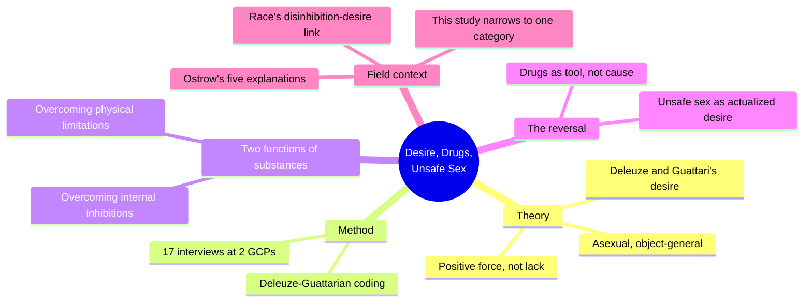
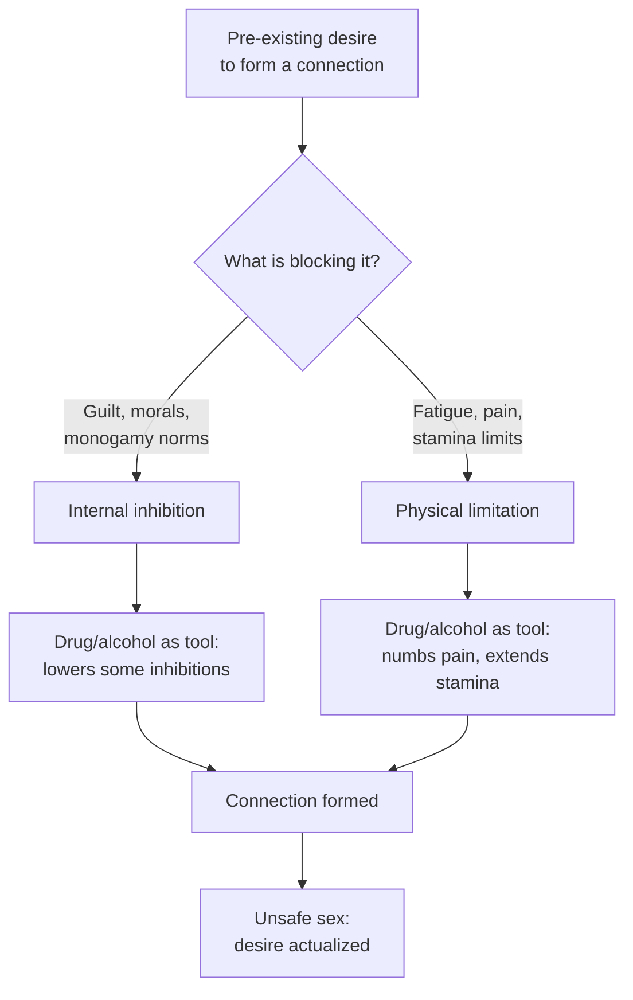
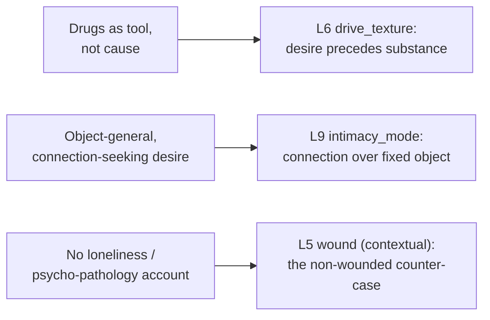

# 🧬 PSY.11 — Desire, Drugs, and Unsafe Sex — O'Byrne & Holmes (2011)
### Knowledge Entry — Distill

A 17-interview ethnographic study of gay circuit party (GCP) attendees, read through Deleuze and Guattari's theory of desire, that inverts the standard "drugs cause unsafe sex" model: for this subgroup, desire comes first and substances are the tool used to actualize it.

## TABLE OF CONTENTS
- [Core Thesis](#1-core-thesis)
- [Mind Models](#2-mind-models)
- [Framework / Structure](#3-framework--structure)
- [Key Concepts](#4-key-concepts)
- [Heuristics & Decision Rules](#5-heuristics--decision-rules)
- [Invariants](#6-invariants)
- [Pitfalls / Myths](#7-pitfalls--myths)
- [Application](#8-application)
- [Cross-References](#9-cross-references)
- [Provenance & Confidence](#10-provenance--confidence)

---

## 1 · CORE THESIS

For some gay men at circuit parties, desire (read through Deleuze and Guattari as a positive force that produces connection, not a reaction to lack) precedes drug and alcohol use. Substances are tools that remove internal and physical limits on wants that already exist, so unsafe sex is desire's actualization, not disinhibition's accident.

---

## 2 · MIND MODELS

*Required. Minimum two diagrams, maximum five.*

**Diagram 1 — the whole argument.**
Caption: *one theory, one method, two functions, one reversal of the field's default causal story.*

**Diagram 2 — the central mechanism (a process, tool applied to a pre-existing want).**
Caption: *desire is the constant on both ends; drugs only swap out which restriction stands between want and act.*

**Diagram 3 — mapped onto the Command's 12-layer character stack.**
Caption: *the reframe lands on drive texture and intimacy mode; the wound layer is where this paper explicitly declines to go.*

---

## 3 · FRAMEWORK / STRUCTURE

A single qualitative study, built in four moves:

1. **Situate the gap.** Six quantitative GCP studies (four data sets, 173–1,169 participants each) establish that drug/alcohol use correlates with unsafe sex at circuit parties. Four qualitative studies explain the benefits GCP-goers themselves report: survival celebration against HIV/AIDS and heteronormativity (Lewis and Ross), crystal meth to overcome negative emotion (Kurtz), a wish to be recognized (Westhaver). None of the ten prior papers isolates desire itself as a variable.
2. **Adopt a theory of desire.** Ostrow's review sorts prior explanations of the substance-unsafe-sex link into five categories: causation, sensation-seeking, disinhibition, social context, multi-factorial. Race's later critique surfaces desire as an unacknowledged current running under all five, specifically desire *for* disinhibition. O'Byrne and Holmes go further and adopt Deleuze and Guattari's desire directly: a positive, productive, asexual force that impels connection generally, prior to and independent of any specific object.
3. **Collect.** On-site surveys and observation at two GCPs, then 17 off-site formal interviews with men screened for one profile: adult, male, GCP attendee, drug/alcohol user, unsafe sex while intoxicated. Semi-structured, open-ended questions on desire, drug use, and sexual practice.
4. **Code Deleuze-Guattarian.** Six-stage thematic analysis: familiarization, line-by-line coding for metaphor, theme aggregation, theme review for internal coherence and external distinctness, naming, and a deliberate search for negative cases to test saturation.

---

## 4 · KEY CONCEPTS

| Concept | What it is | Why it matters |
|---|---|---|
| **Deleuze-Guattarian desire** | A positive, productive, asexual force that impels connections between people, objects, and entities; it pre-exists constraint and is not a reaction to lack (the Freudian default the authors explicitly reject) | The whole paper's engine: desire does not appear because something is forbidden, so drugs cannot be its origin, only its facilitator |
| **Asexual and unfocused desire** | Desire has no fixed aim, object, or "normal" expression; labeling some desires normal and others abnormal is itself an exercise of stratifying power, not a neutral description | Explains why the study never asks "why *that* partner/act" — it asks how connection got formed at all |
| **Gay circuit party (GCP)** | A thematic, techno-music, multi-day dance party attended heavily by gay/bisexual men, historically documented as a site of both drug use and unsafe sex | The chosen field site precisely because prior research already located both behaviors there |
| **Ostrow's five categories** | Causation, sensation-seeking, disinhibition/cognitive distortion/cognitive escape, social context, multi-factorial — the field's prior menu of explanations for substance-then-unsafe-sex | This study narrows to, and complicates, the disinhibition category specifically |
| **Cognitive distortion / escape / disinhibition** | The field's dominant account: drugs impair judgment (distortion), let users skip rational deliberation (escape), and lower the threshold for unsafe acts (disinhibition) | Validated as real by this study's own participants, but shown to explain only the *how*, not the *why*, of the sequence |
| **Drugs as tool, not cause** | The paper's central reframe: participants report using substances deliberately, with an outcome already in mind, to overcome a specific restriction | The load-bearing move for character work: intoxication facilitates an existing want, it does not conjure a new one |
| **Two functions of substance use** | (1) Overcoming internal/psychological inhibitions (guilt, monogamy values, STI/HIV risk-awareness); (2) overcoming physical limitations (fatigue, pain, arousal duration, recovery time between partners) | These are separable mechanisms with separate evidence in the interviews, not one undifferentiated "disinhibition" |
| **Bounded disinhibition** | Participants describe losing "some" inhibitions while stating their underlying values are unchanged; several report continuing to "second question" themselves and knowing personal limits even while using | Disinhibition in this account is partial and governed, not a total suspension of the self |
| **The A-B-C sequence critique** | Substance use (A) precedes cognitive distortion/disinhibition (B) precedes unsafe behavior (C); this chain explains how B connects A to C but says nothing about why A was chosen in the first place | The paper's key methodological point: the field has been answering "how" while leaving "why" unaddressed |
| **Unsafe sex as actualized desire** | The paper's closing claim: forming a connection without a condom is not accidental fallout of intoxication, it is desire's positive force expressed through one particular, visible, reproductive-bodied form of connection | Reframes the "outcome" of the drug-sex sequence as the point, not the accident |
| **The identity effect of connection** | Forming sexual connections lets participants actualize themselves as gay men; forming them while using drugs actualizes them as recreational users at STI/HIV risk; forming them without condoms actualizes a barebacker identity | Desire does not just produce acts, it produces the identities those acts confirm |

---

## 5 · HEURISTICS & DECISION RULES

| Situation | Do this | Not this |
|---|---|---|
| A character uses drugs or alcohol before risky sex | Write the want as already present; the substance is a chosen tool to act on it | Write the substance as the origin that conjures a desire from nothing |
| A character breaks a stated value (monogamy, safety) while intoxicated | Show "some" inhibitions loosening while the character's core values stay intact and named | Show a total personality swap or a no-memory blackout with no ownership of the choice |
| A character explains a risky decision afterward | Let the account come out more logical and sequenced than the moment likely felt, since reflection imposes order | Assume the tidy post-hoc explanation is a transcript of real-time thinking |
| A character uses drugs to keep having sex despite pain or exhaustion | Treat this as a separate, physical function (numbing pain, extending stamina, shortening recovery time) | Fold it into the same "disinhibition" bucket as moral loosening |
| Writing a circuit party or similar scene | Ground it as an identity-affirming, communal space (survival, freedom, recognition) as well as a party | Use it only as hedonistic set dressing with no community meaning |
| A risky or unsafe-sex subplot needs a payoff | Treat the unsafe act as the character getting the connection he wanted | Treat it only as a mistake awaiting punishment or moralized consequence |
| A friend, partner, or clinician character responds to a disclosure | Have them ask what connection or want the character was pursuing | Lead with "the drugs made you do it" as the full explanation |
| Writing a scene with multiple partners or group sex | Treat it as the same connection-seeking desire finding more channels | Require one fixed "reason," kink, or pathology to justify it |
| A character states firm rules even while using ("I know my limits") | Keep that self-regulation visible and consistent; it is evidence of bounded, not total, disinhibition | Write drug use as erasing a character's judgment entirely, every time |

---

## 6 · INVARIANTS

1. **Desire precedes and exceeds drug use.** Substances facilitate an already-present want; they do not manufacture it.
2. **Disinhibition is partial and bounded, not total.** Participants report losing "some" inhibitions while their underlying values remain intact, and several describe active, ongoing self-monitoring while intoxicated.
3. **Substances serve two distinct, separable functions**: removing internal/psychological restrictions and removing physical limitations. Evidence for each is independent in the interviews.
4. **A retrospective account is a product of reflection, not a recording.** Interview data, gathered after the fact and away from the party context, is necessarily more cerebral and sequenced than the lived, non-rational moment it describes.
5. **Cognitive distortion, escape, and disinhibition explain sequence, not origin.** They describe how substance use (step A) connects to unsafe behavior (step C) via an intervening state (step B); they do not explain why the substance was sought in the first place.
6. **Desire in this frame is object-general, not object-fixed.** It drives connection-formation as such; the specific partner, act, or number of partners is the channel desire finds, not its cause.
7. **Findings from one subgroup do not overwrite other explanatory models.** Loneliness, lack of recognition, sensation-seeking, and this study's desire-first account can all be true of different men without contradicting each other.

---

## 7 · PITFALLS / MYTHS

- Taking a participant's "the drugs made me do it" at face value as the complete causal story, rather than as one link in a chain that starts with a pre-existing want.
- Assuming intoxication erases judgment wholesale; several participants in this study describe active rule-following and self-questioning while using.
- Collapsing all GCP research into one model: the quantitative literature emphasizes negative outcomes, one strand of prior qualitative work emphasizes loneliness or lack of recognition, and this study's subgroup fits neither cleanly.
- Treating the labeling of some desires as "normal" and others as "abnormal" as a neutral, purely descriptive act rather than (per Deleuze and Guattari) an exercise of stratifying power.
- Reading a calm, coherent, interview-room explanation as a literal transcript of a chaotic, drug-influenced, real-time decision.
- Generalizing this subgroup's desire-first account to all gay men, all drug users, or all GCP attendees; the sample was small (17), targeted, and screened for one specific behavioral profile, not randomly drawn.
- Confusing "desire causes drug use" with "drug use causes desire": the paper's whole argument is that neither direction is the field's real question, and the causal arrow runs from desire to substance choice, not the reverse.

---

## 8 · APPLICATION

- **Spine level:** L5
- **12-layer character stack:** primary at L6 (drive_texture: desire precedes and outlasts the substance; the substance is chosen equipment, not an origin story); supporting at L9 (intimacy_mode: desire as connection-seeking in general, not fixed to one partner, act, or number); contextual at L5 (wound: this subgroup explicitly does not run on a loneliness/damage account, a useful non-wounded counterweight to trauma-centered models)
- **plot_systems:** contextual; the internal-versus-physical split (§4, §5) is a ready-made way to write a substance-and-sex scene sequence that is neither moralized ("the drugs are why he fell") nor absolved ("the drugs made him not responsible")
- **Setting:** contextual; gay circuit parties are a concrete, historically documented communal setting, tied by the cited prior literature (Lewis and Ross) to survival celebration against HIV/AIDS and heteronormativity, not just to hedonism

This paper's real usefulness for character work is the reversal in Diagram 2: a writer defaults, almost by reflex, to the "drugs lowered his guard and then it happened" sequence, and this study says that sequence has the arrow backwards for a real subgroup of men. Writing a character who uses a substance as a chosen tool toward a want he already holds, rather than as the thing that creates the want, produces a more specific, less moralized character: one who can state his own rules ("I know when enough's enough"), who distinguishes overcoming shame from overcoming exhaustion, and whose unsafe sex is legible as him getting something he wanted rather than as a plot accident that happened to him. The asexual, object-general reading of desire (§4) is equally useful for a character who moves through multiple partners or group scenes: the desire is one thing, connection; the number and shape of the connections is just where that one force found room to run.

---

## 9 · CROSS-REFERENCES

| Related entry | Relation |
|---|---|
| [[🧬 PSY.08 — Lust, Men, and Meth — Fawcett (2015)]] | Direct counterpoint on mechanism: Fawcett treats meth as unbinding and exposing a wounded, pre-formed erotic template (shame-fused, trauma-originated); O'Byrne and Holmes treat desire as a positive force with no wound requirement, and their subgroup explicitly rejects the loneliness/psycho-pathology account Fawcett's clinical population runs on. Read together for the wounded and non-wounded versions of "drugs facilitate a pre-existing want." |
| [[🧬 PSY.09 — Sex Tourism and HIV Risk — Harry-Hernández et al. (2019)]] | Sibling risk-behavior register, same MSM population type: this paper supplies the qualitative, motive-level account of why substance-linked unsafe sex happens; PSY.09 supplies the population-level dose-response gradient for what it costs |
| [[🧬 MSX.17 — Mating in Captivity — Perel (2006)]] | Distant but resonant: Perel's "bounded space of eroticism," where ordinary rules are safely transgressed, sits near this paper's account of GCPs as a space where restrictions are deliberately, temporarily lifted by chosen means |

---

## 10 · PROVENANCE & CONFIDENCE

Full text read in full: a 13-page journal article (*Culture, Health & Sexuality*, Vol. 13, No. 1, January 2011), including abstract, introduction, literature review, the Deleuze-Guattarian theoretical framework section, methods (recruitment, interview questions, six-stage data analysis), both results themes with all quoted participant excerpts, discussion, final remarks, references, and the French and Spanish abstracts. The extracted text carries publisher/download-banner boilerplate and minor OCR encoding artifacts (stray characters replacing some em dashes, apostrophes, and accented letters in the French/Spanish abstracts); none of this affects the body text's legibility or the participant quotations, which are reproduced in the source cleanly. All participant names are the authors' own pseudonyms; ages are as reported in-text. The theoretical vocabulary (Deleuze and Guattari's desire, Ostrow's five categories, Race's disinhibition-desire link) is drawn directly from the article's own literature review and framework sections, not from outside summary. The `feeds:` keying reuses established vocabulary (drive_texture at L6, intimacy_mode at L9, wound at L5) from [[🧬 PSY.08 — Lust, Men, and Meth — Fawcett (2015)]] and [[🧬 PSY.09 — Sex Tourism and HIV Risk — Harry-Hernández et al. (2019)]] per the shared 12-layer character-stack schema; the wound-layer entry is deliberately marked contextual, since this paper's contribution is precisely that its subgroup does not fit a wound-driven account.

## META
- Template: BVX-LEARN-v4.0
- Source classification: full-text journal article, complete read
- Created / Updated: 2026-09-29
