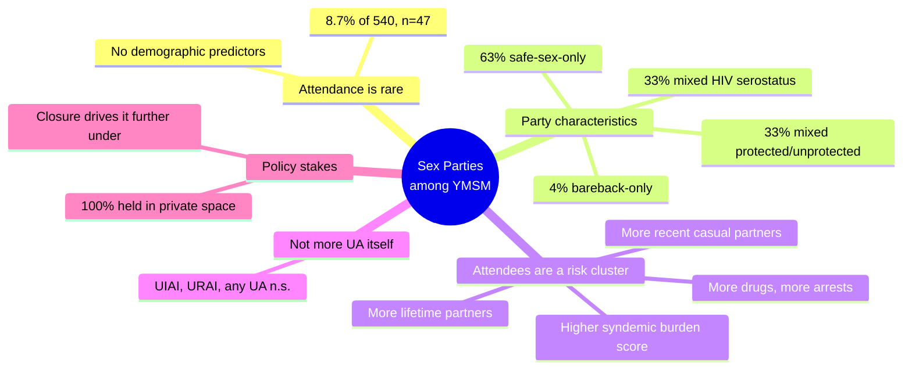
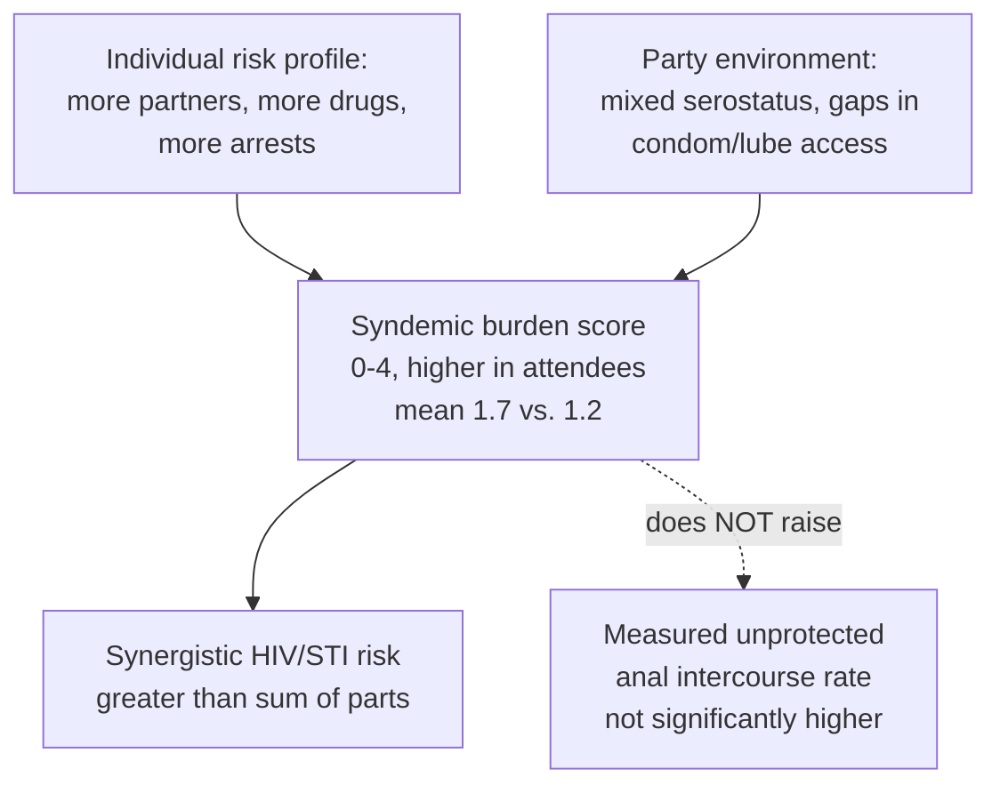
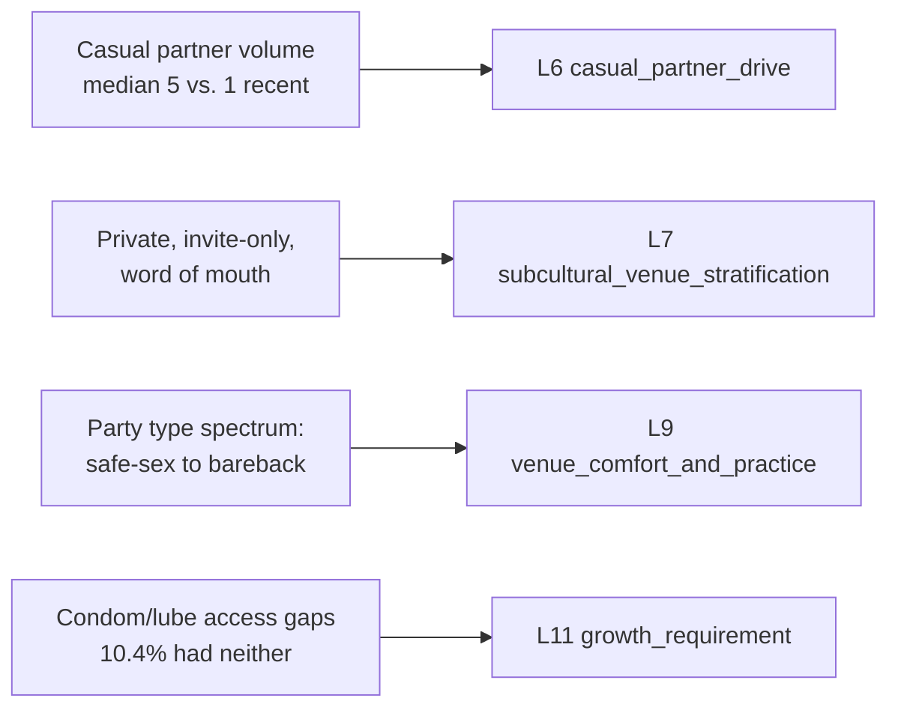

# 🧬 PSY.12 — Sex Parties among YMSM in NYC — Solomon et al. (2011)
### Knowledge Entry — Distill

A cross-sectional survey of 540 young (18-29) gay, bisexual, and other men who have sex with men (YMSM) in New York City, the first study to profile private sex-party attendance and behavior specifically in a racially diverse youth sample; read whole (ten journal pages, *Journal of Urban Health*, 2011).

## TABLE OF CONTENTS
- [Core Thesis](#1-core-thesis)
- [Mind Models](#2-mind-models)
- [Framework / Structure](#3-framework--structure)
- [Key Concepts](#4-key-concepts)
- [Heuristics & Decision Rules](#5-heuristics--decision-rules)
- [Invariants](#6-invariants)
- [Pitfalls / Myths](#7-pitfalls--myths)
- [Application](#8-application)
- [Cross-References](#9-cross-references)
- [Provenance & Confidence](#10-provenance--confidence)

---

## 1 · CORE THESIS

Among 540 young NYC gay, bisexual, and other MSM ages 18 to 29, only 8.7% (n=47) attended a private sex party in the past three months, yet attendees form a distinct risk cluster: more lifetime and recent casual partners, more drug use, more arrests, and higher total syndemic burden than nonattendees, though not significantly more unprotected anal intercourse.

---

## 2 · MIND MODELS

*Required. Minimum two diagrams, maximum five.*

**Diagram 1 — the whole argument.**
Caption: *attendance is rare, parties are mostly not bareback, and the risk lives in who shows up more than in what happens at the door.*

**Diagram 2 — the central mechanism (individual burden meets environment burden).**
Caption: *the paper's real claim is not "the party causes risk" — it's that a pre-existing individual risk profile and a permissive party environment compound each other, without that compounding showing up as more literal unprotected sex in this sample.*

**Diagram 3 — mapped onto the Command's systems.**
Caption: *four findings, four feeds: partner volume is a drive variable, private/themed access is a sociological stratum below MSX.20's venues, party type is a scoreable intimacy practice, and supply gaps are a concrete harm-reduction prop.*

---

## 3 · FRAMEWORK / STRUCTURE

Project Desire, a single cross-sectional survey run in four moves:

1. **Recruit.** Research staff spent 75 total hours across a summer 2008 window approaching men in venues across all five NYC boroughs — community events, bars, dance clubs, parks, street corners — regardless of perceived age or orientation, and screened verbally for eligibility (biologically male, ages 18-29). The sampling frame was deliberately stratified: Black and Latino men were guaranteed at least 67% of the sample, and each of three age bands (18-20, 21-25, 26-29) was targeted for roughly a third.
2. **Administer privately.** Eligible, consenting men (paid $10) completed the survey alone on a touchscreen PDA running ACASI-style (audio-computer-assisted self-interview) software, a method chosen specifically because it measurably increases honest reporting of sex and drug behavior over face-to-face interview. Data collection ran 90 days in summer 2008; the final sample was 540 men, mean age 22.79 (SD=3.42, median=22), 66% ages 18-24 and 34% ages 25-29.
3. **Measure five domains.** (a) Sociodemographics and self-reported HIV status; (b) sex-party attendance in the past 3 months, and, for attendees, party type, cost, HIV-serostatus mix, prevention supplies present, how they found out, and location; (c) lifetime and recent (3-month) sexual behavior, including casual-partner counts and episodic unprotected anal intercourse (insertive, receptive, and any); (d) a 3-month drug-use checklist across 16 substances, licit and illicit; (e) arrest history and history of physical harm by a boyfriend.
4. **Compare and composite.** Attendees vs. nonattendees were compared with chi-square and Kruskal-Wallis tests, plus a composite Total Burden score built from four dichotomous indicators (see Key Concepts) and compared by t-test.

---

## 4 · KEY CONCEPTS

| Concept | What it is | Why it matters |
|---|---|---|
| **Sex party** | A privately organized group-sex event (a hotel room, a rented space, a home), distinct from a commercial sex environment (CSE, e.g. bathhouse) or public sex environment (PSE, e.g. cruising park) because it is neither commercially operated nor publicly accessible | A third category of sex venue, below both of MSX.20's CSE/PSE categories on visibility, and the hardest for outreach to reach |
| **Party type** | Host-set rule for condom use: "safe-sex only" (required), "mixed" (both protected and unprotected present), or "bareback" (condoms not used) | 63.3% (n=31) safe-sex-only, 32.7% (n=16) mixed, 4.1% (n=2) bareback-only — the popular image of the party as a uniformly bareback space is wrong for nearly two-thirds of them |
| **Serostatus mix** | Whether a party's attendees were HIV-negative only, HIV-positive only, or both | 60.4% (n=29) negative-only, 6.2% (n=3) positive-only, 33% (n=16) mixed — a third of parties cross serostatus lines in the room |
| **Prevention-supply availability** | Whether condoms, lubricant, both, or neither were present at the party | 58% (n=28) had both, 14.6% (n=7) condoms only, 16.7% (n=8) lubricant only, 10.4% (n=5) neither |
| **Access channel** | How the attendee learned the party existed | Friend (38.3%, n=18), internet (31.9%, n=15), clubs/bars (17%, n=8), magazines (12.8%, n=6) — nearly 70% word-of-mouth or online, never a public listing |
| **Total Burden score** | A composite 0-4 score: 1 point each for (1) any unprotected anal intercourse with a casual partner in the past 3 months, (2) any drug/alcohol-to-intoxication use in the past 3 months, (3) ever arrested, (4) ever physically harmed by a boyfriend | Attendees scored higher on average (mean 1.7, SD=1.1) than nonattendees (mean 1.2, SD=1.0), t(436)=3.00, p<.01 — a single portable number for "how much is stacked on this character" |
| **Syndemic theory** | The framework (Stall et al.) that co-occurring epidemics — drug use, psychosocial burden, sexual risk-taking — interact synergistically, producing more risk together than any one alone would predict | The paper's explanatory frame for why sex-party attendees are worth flagging even though their raw unprotected-sex rate isn't significantly elevated |
| **Cognitive escape model** | McKirnan et al.'s model: certain environments (like a party) lower self-monitoring and facilitate disinhibited behavior | The mechanism candidate offered for why the party environment itself, not just attendee traits, may add risk |
| **ACASI / PDA administration** | Self-administered, computer-assisted survey delivery that increases honest disclosure of stigmatized behavior versus a live interviewer | Explains why this dataset can be trusted more than a face-to-face survey on the same topic |

---

## 5 · HEURISTICS & DECISION RULES

| Situation | Do this | Not this |
|---|---|---|
| Introducing a character who attends sex parties | Give them an already-elevated casual-partner count, drug-use pattern, and history of arrest before the party ever appears on-page | Make party attendance the origin of the character's risk profile |
| Writing what happens inside a party | Default to safe-sex-only or mixed rules (95.9% of parties), not a bareback free-for-all | Write every sex party as automatically condomless |
| Setting the serostatus makeup of a party scene | A third of parties mix HIV-positive and HIV-negative attendees openly; write that as ordinary, not scandalous | Assume parties sort cleanly by status, or that mixed-status attendance is itself a plot bomb |
| Showing how a character finds out about a party | Route it through a friend or the internet | Have a character stumble on a flyer, a public ad, or a walk-up door |
| Depicting supplies at a party | Show real gaps: roughly 1 in 10 parties has neither condoms nor lube on hand | Assume every private party is fully stocked and harm-reduction-ready |
| Raising the stakes on a party-attending character | Reach for the Total Burden score's four levers — recent unprotected casual sex, recent drug/alcohol use, an arrest, past partner violence — and stack two or more | Reach for one dramatic, isolated risk act with no surrounding pattern |
| A public-health or clinician character responds to party attendance | Have them treat it as a distinct venue needing its own tailored outreach, not lumped with bathhouse or park-cruising strategies | Have them apply generic CSE/PSE prevention messaging unchanged |
| Deciding whether unprotected sex "must" follow from party attendance | Know that this sample found no significant difference in unprotected anal intercourse rates between attendees and nonattendees | Write attendance itself as narrative shorthand for "and then he had unsafe sex" |

---

## 6 · INVARIANTS

1. **Sex-party attendance is rare even among sexually active urban YMSM.** 8.7% (n=47 of 540) attended one in the prior 3 months; 90.7% (n=490) had not.
2. **No demographic variable predicts attendance.** Race/ethnicity, sexual orientation, HIV status, and perceived family socioeconomic status showed no significant relationship to sex-party attendance in this sample.
3. **Most parties are not bareback.** 63.3% require condoms, 32.7% are mixed, and only 4.1% are explicitly bareback.
4. **Serostatus mixing at parties is common.** A third of attendees (33%, n=16) reported parties open to both HIV-positive and HIV-negative men.
5. **Harm-reduction supplies are inconsistently available.** 58% of parties had both condoms and lubricant; 10.4% had neither.
6. **Attendees carry a much larger casual-partner volume**, lifetime (median 18 vs. 11), recent casual (median 5 vs. 1), and total recent (median 8 vs. 2) — all statistically significant.
7. **Attendees show significantly higher drug use**: more total unique drugs used (median 2 vs. 1) and higher rates of powdered cocaine, crack cocaine, inhalant nitrates, GHB, methamphetamine, nonprescribed PDE-5 inhibitors, nonprescribed benzodiazepines, and nonprescribed HIV medications.
8. **Attendees carry more psychosocial burden**: 34% (n=16) report an arrest history versus 20% (n=99) of nonattendees; total syndemic burden score is significantly higher (mean 1.7 vs. 1.2).
9. **Unprotected anal intercourse rates do not differ significantly by attendance** (UIAI, URAI, and any UA all nonsignificant), despite every other risk index being elevated.
10. **Sex parties are categorically private.** 100% of attendees in this sample reported the party took place in a private space or residence, never a public or commercial venue.

---

## 7 · PITFALLS / MYTHS

- **The bareback-orgy myth.** Popular imagination treats "sex party" as synonymous with condomless group sex; only 4.1% of parties here were bareback-only, and nearly two-thirds required condoms.
- **The "attendance equals unsafe sex" myth.** Attendees were not significantly more likely to report unprotected anal intercourse than nonattendees — the elevated risk shows up in partner volume, drugs, and psychosocial burden, not in that one specific act.
- **The demographic-marker myth.** No race, orientation, HIV-status, or SES group is more likely to attend; treating party-goers as a demographically distinct type is not supported.
- **The closure-helps myth.** The authors note (citing prior policy in NYC and San Francisco) that closing commercial venues does not eliminate risk; it pushes group sex into exactly the kind of fully private, word-of-mouth space this study documents — 100% of parties already were.
- **The isolated-risk-factor myth.** Reading sexual risk, drug use, and psychosocial burden as separate, unrelated facts about a person misses the paper's syndemic point: they compound each other rather than adding up independently.
- **The small-sample overreach.** Only 47 respondents (8.7%) attended a party; the authors themselves caution against generalizing findings to all YMSM or inferring that attendance causes HIV transmission. Treat this as a real, specific pattern in one 2008 NYC cohort, not a universal law.

---

## 8 · APPLICATION

*Prose carries the why; `feeds:` carries the wiring (D3). Both required, neither redundant.*

- **Spine level:** L5 — non-story-structural source, kept for batch consistency with the sexuality shelf.
- **12-layer character stack:** L6 (casual_partner_drive — primary), L7 (subcultural_venue_stratification — primary), L9 (venue_comfort_and_practice — supporting), L11 (growth_requirement — contextual).
- **plot_systems:** contextual; the syndemic composite (unprotected sex + drug use + arrest + partner violence) is a ready-made stacking mechanism for raising or defusing stakes on a character without inventing a single dramatic incident.
- **Setting:** directly extends MSX.20 (sex venues). MSX.20 maps a city's commercial and semi-public sex-venue geography (saunas, clubs) by clientele reputation; this paper adds the layer beneath it — the fully private, invite-only, word-of-mouth-or-internet party that never appears on that public map at all, arranged by friend networks rather than a storefront. A setting built on MSX.20's venue stratification is incomplete without this private tier: some of a city's group-sex culture is, by design, invisible to anyone without a personal connection into it.

For a writer, the load-bearing move is Diagram 2: a character's sex-party attendance is not itself the risk event, it's a marker that individual burden (partners, drugs, arrests) and an environment with real supply gaps (roughly 1 in 10 parties has no protection on hand at all) sit in the same scene together. That lets a writer put a character at a party without forcing an unprotected-sex beat onto the page (the data don't support that link), while still giving the scene real, earned stakes through the Total Burden score's other three levers. The access channel (friend or internet, never public) and the universally private location are also concrete staging details: a party scene should open with an invitation, not a discovery.

---

## 9 · CROSS-REFERENCES

| Related entry | Relation |
|---|---|
| [[🧬 MSX.20 — Sex on Premises Venues — Smith, Grierson & von Doussa (2010)]] | Direct venue-tier sibling: MSX.20 maps the visible, community-recognized geography of saunas and sex clubs; this paper adds the private, invite-only sex party as the tier below that public map |
| [[🧬 PSY.09 — Sex Tourism and HIV Risk — Harry-Hernández et al. (2019)]] | Same analytic shape — a quantitative behavioral-health survey turning a risk context into graded, measured predictors rather than anecdote — applied to a different context (travel vs. private parties) |
| [[🧬 PSY.03 — Unlimited Intimacy — Dean (2009)]] | Same population and risk terrain from the opposite method: Dean's ethnographic, meaning-making account of barebacking subculture pairs with this paper's population-level numbers on party attendance and risk |

---

## 10 · PROVENANCE & CONFIDENCE

Read whole: a ten-page peer-reviewed research article (*Journal of Urban Health: Bulletin of the New York Academy of Medicine*, Vol. 88, No. 6, 2011), sourced from a plain-text conversion, not the Zotero library (no Zotero key on hand). Abstract, introduction, methods, results, discussion, limitations, and conclusion were all read in full. All percentages, ns, medians, and test statistics (chi-square, Kruskal-Wallis, t-test, with p-values) cited above are taken directly from the article's running Results/Discussion prose, which was legible and internally consistent. The two demographic and drug-use data tables (Tables 1 and 3) suffered visible OCR/extraction corruption — cell values and row labels were scrambled out of alignment during the plain-text conversion — so this distill deliberately does not cite exact per-cell figures from those two tables and relies instead on the paper's own clean prose statements of the same findings (e.g., specific chi-square results for each drug, stated inline in the Results text) wherever the two sources might diverge. Table 2 (lifetime/recent partner medians) was legible and is cited directly. Confidence is high for the reported quantitative findings; confidence is explicitly lower for any causal claim, which the authors themselves disclaim (self-reported, cross-sectional, small attendee subgroup, n=47). The `feeds:` variable names (casual_partner_drive, subcultural_venue_stratification, venue_comfort_and_practice, growth_requirement) are reused deliberately from MSX.20 and PSY.09's established vocabulary for the L6/L7/L9/L11 layers rather than invented fresh, per the shared 12-layer character-stack schema.

## META
- Template: BVX-LEARN-v4.0
- Source classification: full-text journal article, complete read
- Created / Updated: 2026-09-29
