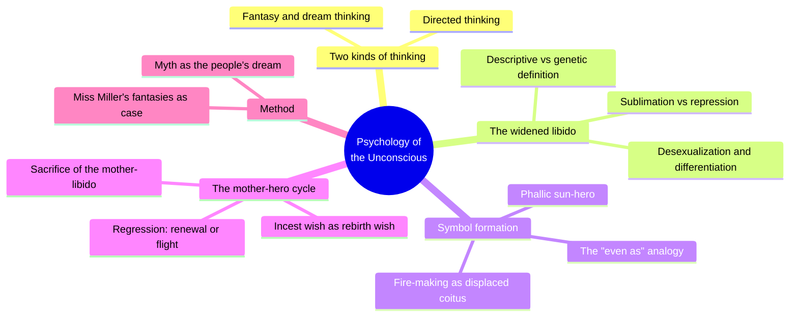
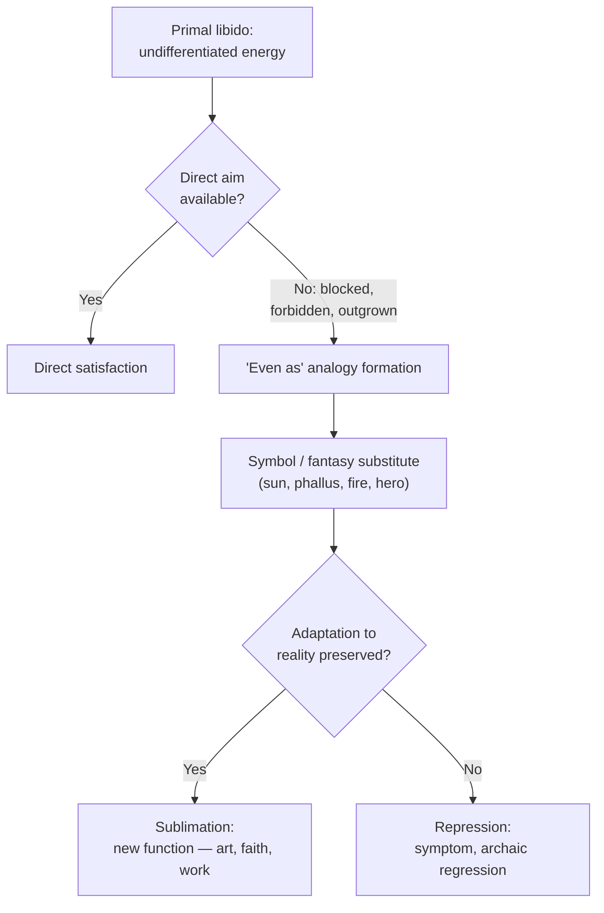
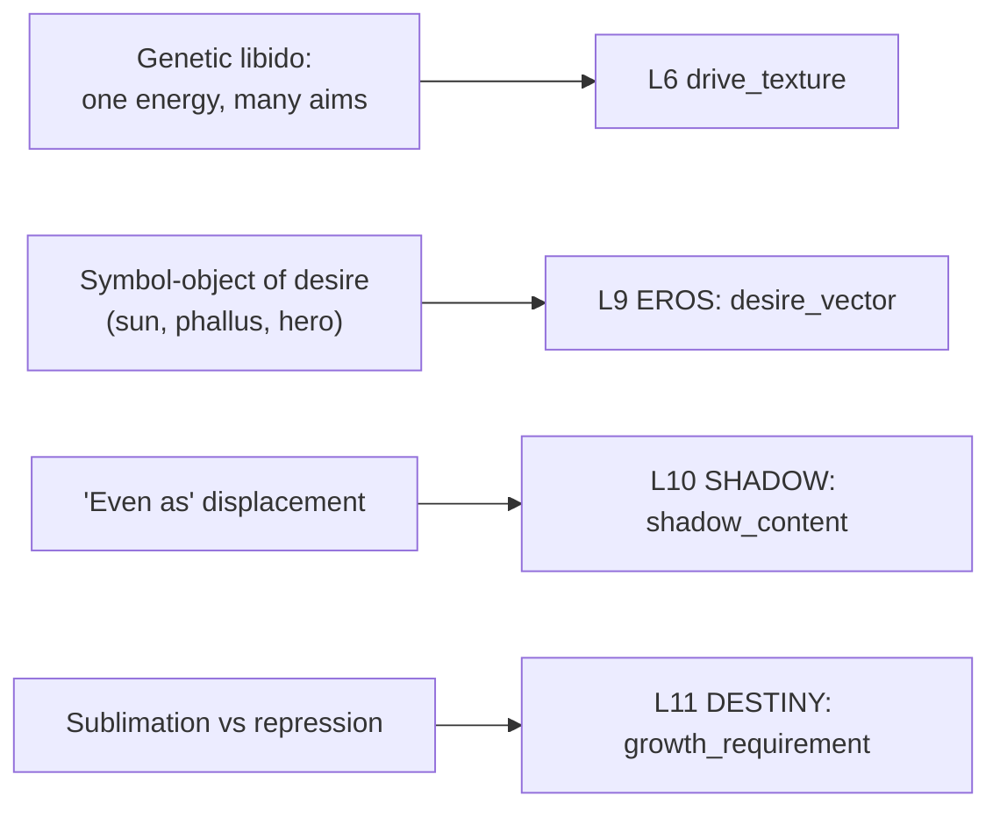

# 🧬 PSY.13 — Psychology of the Unconscious — Jung (1916)
### Knowledge Entry — Distill

Jung's 1912 break from Freud, translated into English in 1916 by Beatrice Hinkle: a case study of one American woman's published fantasies used as the occasion to argue that libido is not sexual desire narrowly, but the general life-energy behind all wanting, of which sex is only the most differentiated channel.

## TABLE OF CONTENTS
- [Core Thesis](#1-core-thesis)
- [Mind Models](#2-mind-models)
- [Framework](#3-framework--structure)
- [Key Concepts](#4-key-concepts)
- [Heuristics](#5-heuristics--decision-rules)
- [Invariants](#6-invariants)
- [Pitfalls](#7-pitfalls--myths)
- [Application](#8-application)
- [Cross-References](#9-cross-references)
- [Provenance](#10-provenance--confidence)

---

## 1 · CORE THESIS

Libido is not sexual desire but the total psychic energy of the organism, of which sexuality is one late-differentiated derivative among many: nutrition, art, religion, ambition. Blocked or forbidden desire never simply vanishes; it transforms into symbol (sun, phallus, fire, hero) through the same "even as" analogy-making that builds fantasy, myth, and dream.

---

## 2 · MIND MODELS

*Required. Minimum two diagrams, maximum five.*

**Diagram 1 — the whole argument.**
Caption: *one woman's fantasies (Miss Miller) are the pretext; the real argument is that dream, myth, and desire run on one shared unconscious machinery, and Part II names that machinery libido.*

**Diagram 2 — the central mechanism (a state change: what happens when desire hits a wall).**
Caption: *a blocked want has exactly two exits, not one — disguise it and keep functioning, or disguise it and break; the fork is the whole clinical and creative stakes of the book.*

**Diagram 3 — mapped onto the Command's 12-layer character stack.**
Caption: *the theory chapter (Part II, Ch. I–III) lands cleanly on four layers — this is a psychology-of-desire toolkit, not a single dial.*

---

## 3 · FRAMEWORK / STRUCTURE

Two parts, built around one running case:

| Part | Chapters | Governing move |
|---|---|---|
| I, The Case | Introduction; Two Kinds of Thinking; The Miller Phantasies; The Hymn of Creation; The Song of the Moth | A modern woman's published poems and visions ("Miss Miller," a real American traveler) prove structured exactly like myth, since both run on the same undirected, image-based "fantasy thinking" |
| II, The Theory | Aspects of the Libido; The Conception and the Genetic Theory of Libido; The Transformation of the Libido; The Unconscious Origin of the Hero; Symbolism of the Mother and of Rebirth; The Battle for Deliverance from the Mother; The Dual Mother Role; The Sacrifice | Names and defends the widened libido concept (Ch. I–III), then spends five chapters tracing one mechanism, the hero's symbolic battle to be reborn out of, not to sexually possess, the mother, across world mythology |

The book's method is the reverse of a textbook: it walks a single, minor case (Miller's Moth-poem, a fantasy about longing for the sun) outward into astral myth, Faust, Hindu scripture, and the Cabiric mysteries, then folds back into a general theory. Part I is deliberately "surreptitious." Jung states outright (Part II, Ch. II) that he smuggled the genetic libido concept into Part I before defending it, so the reader meets the phenomenon before the argument.

---

## 4 · KEY CONCEPTS

| Concept | What it is | Why it matters |
|---|---|---|
| **Directed vs. fantasy thinking** | Directed thinking is language-bound, effortful, adapted to outer reality; fantasy/dream thinking is image-based, effortless, wish-driven, identical in structure in a child, a "savage," or a modern dreamer | Lets Jung treat one woman's poetry as mythological data: fantasy thinking is not degraded reasoning but reasoning's older, parallel mode |
| **Descriptive libido (Freud) vs. genetic libido (Jung)** | Freud's 1905 definition: libido is sexual impulse displaced onto non-sexual functions. Jung's genetic definition: libido is a general life-energy of which sexuality is one differentiation among several | The book's central move; reached because paranoia and dementia praecox showed patients losing "interest in reality" far beyond what sexual repression alone explains |
| **Desexualization / differentiation** | Tracing evolution, Jung argues nest-building, courtship display, and eventually music, art, and abstract thought are derivatives of the procreative instinct that became functionally independent of it | Explains why calling music or religion "sublimated sex" both is and isn't true: sexual in ancestry, not in present function, like calling a cathedral mineralogy because it is built of stone |
| **Sublimation vs. repression** | The same diversion of libido from a blocked aim succeeds (sublimation: adaptation preserved) or fails (repression: adaptation breaks, symptom follows) | The only binary outcome for suppressed desire; no third option where a blocked want simply disappears without residue |
| **The "even as" (Gleich wie)** | Steinthal's phrase, adopted by Jung: analogy-making, "X is even as Y," is the basic cognitive operation that lets libido attach to a substitute object once its original aim is barred | The mechanism, not just the observation, behind symbol formation: *how* fire-making, poetry, and myth get built out of blocked desire, not merely evidence that they are |
| **Phallic symbolism of the libido** | The "small, insignificant instrument" (Faust's key, the Vedic Tom-Thumb god, the Cabiric dwarf-smiths) that performs impossible feats: creative power in humble, even ugly, form | A recurring pattern for writing male creative/sexual power as paradoxical: the organ of world-making figured as small, crude, or comic, never grand |
| **The sun as libido symbol** | Introverted mystics report finding, "in their heart," the same sun they thought they worshipped outside themselves; chosen because it is both giver of life and indifferently destructive | Libido, like the sun, "allows the useful and injurious to proceed"; desire here is never written as clean or purely benevolent |
| **Archaic surrogate / regression** | When a patient's function of reality collapses (paranoia, psychosis, milder neurotic regression), the missing adaptation is replaced by mythologically-patterned material (a flat, sun-circled earth; boiling-cauldron visions matching alchemical text) | Shows regression is structured, not random: the mind falls back on species-old material, not blank confusion |
| **The mother as rebirth symbol, not incest object** | Jung reframes the incest wish: the pull toward the mother in myth (city, sea, cave, dragon's hoard) figures a wish to be born again, not a literal sexual aim | Jung's decisive break from Freud: incest imagery is read as the vehicle for renewal, the sexual reading as one surface layer over a deeper regenerative one |
| **Myth as the people's dream, dream as the individual's myth** | The same unconscious material appears collectively (myth, scaled to a culture) and individually (dream/fantasy, scaled to one person) | Licenses reading any private fantasy as myth in miniature, and any myth as a culture's recurring dream |

---

## 5 · HEURISTICS & DECISION RULES

| Situation | Do this | Not this |
|---|---|---|
| Writing a man's stated sexual want | Treat it as one channel of a single life-energy that also runs his ambition, art, or faith | Wall his sexuality off as a separate compartment from the rest of his drive |
| His desire fixates on one object or person | Write the object as standing in for something larger the desire is actually after (renewal, potency, escape, belonging) | Assume the stated object is the whole, literal, complete target |
| A desire is blocked, forbidden, or outgrown | Show it resurfacing displaced — as symbol, ritual, obsession, or creative work | Have it simply vanish once suppressed |
| A character's fantasy reads as strange or shameful | Read it as symbolic problem-solving and ask what it is standing in for | Write it as a literal blueprint for action, or as proof of pathology |
| Depicting a man's spiritual, artistic, or ambitious passion | Let it run on the same charge as his sexuality, without collapsing one into the other | Reduce religion or art to "really just" repressed sex, or dismiss sex as merely animal beside them |
| A character represses or renounces a desire | Decide explicitly whether the diversion is sublimation (new function, adaptation holds) or repression (symptom, regression follows) | Write suppression as costless, complete, and consequence-free |
| Writing dream or fantasy sequences | Use dense, ambivalent, mythic-feeling images (sun, snake, fire, a small crude tool with great power) that carry opposed meanings at once | Have the dream or fantasy state its own meaning outright |
| A man's desire keeps circling back toward an earlier attachment or a mother-figure | Read the pull as libido seeking symbolic rebirth or renewal through regression | Read the regression literally, as incestuous intent |

---

## 6 · INVARIANTS

1. **Libido is a general life-energy; sexuality is its most differentiated expression, not its only one.** Nutrition, allurement, art, and abstract thought are earlier or later derivatives of the same root impulse.
2. **Blocked libido does not disappear; it is displaced into symbol, ritual, fantasy, or symptom.** There is no third outcome where suppressed desire simply ends.
3. **Analogy — "even as" — is the basic operation by which desire becomes symbol, myth, and art.** It is a mechanism, not a metaphor for one.
4. **A symbol's overt content is never its full meaning.** The same image (sun, snake, phallus) carries opposed values — creative and destructive, holy and terrible — simultaneously.
5. **Dream and myth are the same material at different scales.** Myth is "the mass-dream of the people"; the dream is "the myth of the individual."
6. **Every diversion of libido from a blocked aim resolves one of two ways:** sublimation (adaptation to reality preserved under a new function) or repression (adaptation breaks, producing symptom or archaic regression).
7. **Regression is not pathology by default.** It can serve symbolic rebirth and renewal as readily as it can serve flight from life; the two are structurally identical and diverge only in outcome.

---

## 7 · PITFALLS / MYTHS

- Treating "libido" as a synonym for "sex drive." Jung explicitly widens the term past Freud's 1905 definition; using it narrowly misreads the entire book.
- Reading a fantasy or dream image as a single, literal statement (a snake "just means" the phallus) rather than a compressed, ambivalent symbol.
- Assuming repression erases a desire rather than displacing it. The book's clinical cases (paranoid cosmology, boiling-cauldron visions) are evidence of the desire resurfacing in mythic form, not of its absence.
- Treating myth and private fantasy as unrelated categories; Jung's method depends on their being the same machinery at different scales.
- Reading Jung's "incest wish" as a literal sexual aim at an actual parent rather than a symbol for the wish to be reborn: the specific point on which Jung breaks from Freud here.
- Assuming sublimation is a clean substitution, as if art or religion "cools" what sexuality "heats." The descendant function can still run at full charge; only the aim has changed, not the intensity.

---

## 8 · APPLICATION

- **Spine level:** L5, the character register of the story-spine — this is a source about what drives a person, not about plot mechanics or setting.
- **12-layer character stack:** L6 drive_texture (primary), L9 EROS desire_vector (primary), L10 SHADOW shadow_content (primary), L11 DESTINY growth_requirement (supporting). See frontmatter `feeds:` for the full wiring.
- **plot_systems:** contextual candidate once `04_PLOT_SYSTEMS/` opens — the blocked-libido fork (Diagram 2) is a reusable engine for any subplot built on suppressed or redirected desire: name the block, name the symbol it produces, then decide sublimation or repression before the scene, not after.
- **Setting:** not applicable; this is a psychology-of-desire source, not a setting source.

For a writer rendering men's desire and fantasy, this book's use is structural rather than descriptive: it gives a mechanism, not a catalogue. The widened libido concept means a male character's sexuality can be written as continuous with his ambition, craft, faith, and fear, rather than as a separate, lower system that occasionally overrides the rest of him; the same energy simply runs through a different channel scene to scene. The "even as" analogy mechanism gives a concrete method for building a character's private symbol-language: pick what his desire is actually blocked from (a dead parent, an unreachable ideal, an unlived life), then let his fantasies, fixations, or obsessions be the displaced form that desire takes, ambivalent and overdetermined the way Jung's suns and snakes are, never a clean one-to-one code. The sublimation/repression fork (Diagram 2) is a decision a writer can make explicitly for any suppressed want in a story: does this diversion cost the character his grip on reality, or does it feed something he can still function inside of? Read against Perel (MSX.17), where desire needs a gap between self and other to survive, Jung supplies the deeper claim underneath: the gap sits not primarily between two people, but between a general life-energy and whatever single aim currently, and only provisionally, channels it.

---

## 9 · CROSS-REFERENCES

| Related entry | Relation |
|---|---|
| [[🧬 MSX.17 — Mating in Captivity — Perel (2006)]] | Perel's "eroticism requires separateness" and "desire is fuelled by the unknown" are a modern, relational restatement of Jung's structural claim: desire is never fully sated by its stated object because the object is a symbol, not the whole of what libido wants |
| [[🧬 PSY.08 — Lust, Men, and Meth — Fawcett (2015)]] | Direct lineage: Fawcett's `shadow_content` (L10) explicitly operationalizes Jung's shadow and "core erotic theme" for gay men's compulsive sexuality; this entry is the founding theoretical source, Fawcett the clinical/applied instance |
| [[🧬 PSY.10 — Magnificent Sex — Kleinplatz & Ménard (2020)]] | Contrast in method and claim: Kleinplatz's empirically-derived components (presence, connection) locate great sex in conscious, communicated attention; Jung locates desire's real engine one layer down, in unconscious symbol-formation neither partner needs to name |
| [[🧬 MSX.30 — Urban Tantra — Carrellas (2017)]] | Parallel "desire as energy" model from a practice tradition rather than a clinical one; useful counterweight — Carrellas treats libido-as-current as trainable and redirectable at will, where Jung treats its displacements as largely unconscious and involuntary |

---

## 10 · PROVENANCE & CONFIDENCE

Full text, OCR/pdftotext extraction of the 1916 Moffat, Yard and Company first English edition (translated, with introduction, by Beatrice M. Hinkle, M.D.), ~1.2MB, ~33,000 lines, main text running from the Author's Note and Introduction (p. 3) through the end of "The Sacrifice" (p. 483), followed by roughly 200 pages of endnotes and index not separately extracted here. Title page confirmed against the source file before drafting: author Dr. C. G. Jung, "Authorized Translation, with Introduction, by Beatrice M. Hinkle, M.D.," Moffat, Yard and Company, New York, 1916 (translator and year taken directly from this page, per the tasking brief). The delivered text file is misnamed `MSX.36.txt` in the extraction pipeline but its contents are this book.

Read in full: the Translator's Note; the Introduction (the Oedipus-legend premise and the case for widening psychoanalysis into historical material); Part I, Ch. I, "Concerning the Two Kinds of Thinking"; Part II, Ch. I, "Aspects of the Libido" (the sun/phallus symbolism argument, the classical and etymological history of the word libido); Part II, Ch. II, "The Conception and the Genetic Theory of Libido," the book's core theoretical chapter (Freud's descriptive definition, the paranoia problem that forced Jung's widening, desexualization, sublimation vs. repression, the "even as" analogy mechanism), in full; Part II, Ch. III, "The Transformation of the Libido," opening case study in full. The remaining Part I chapters (Miller Phantasies, Hymn of Creation, Song of the Moth) and Part II, Ch. IV to VIII (Unconscious Origin of the Hero through The Sacrifice) were not deep-extracted; they are represented through the book's own detailed chapter-by-chapter table of contents, which in this edition works as a paragraph-level argument outline rather than a bare list of titles, plus a targeted read of the closing pages of "The Sacrifice." Given the source's length against the brief's read budget, this entry prioritizes full extraction of the theoretical chapters that carry the widened-libido argument it is keyed to, over the five mythological case chapters that apply it at length to Miss Miller's material.

`zotero_key` is blank: checked directly against the live Zotero database, where no Jung entry currently exists; flagged for a future cataloging pass rather than invented.

## META
- Template: BVX-LEARN-v4.0
- Source classification: full-text OCR extraction, deep extraction on the Introduction and the three theoretical chapters (Part II, Ch. I–III) that carry the widened-libido argument; the five mythological application chapters (Part I, Ch. II–IV; Part II, Ch. IV–VIII) represented via the source's own detailed table of contents rather than full-text extraction
- Created / Updated: 2026-09-29
