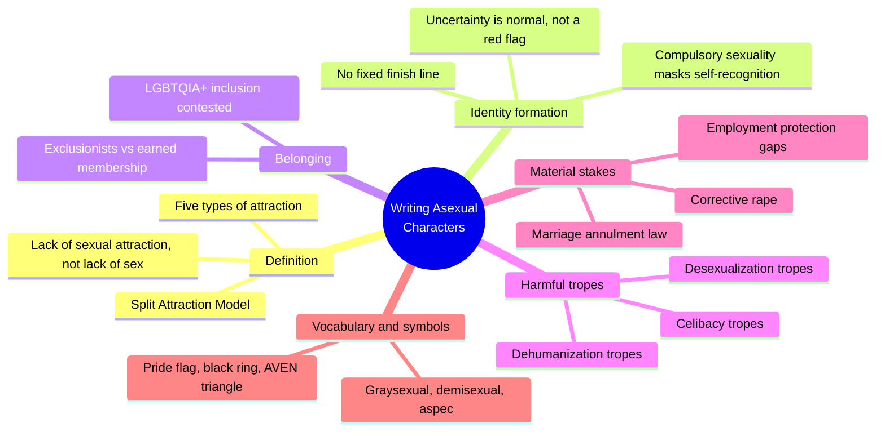
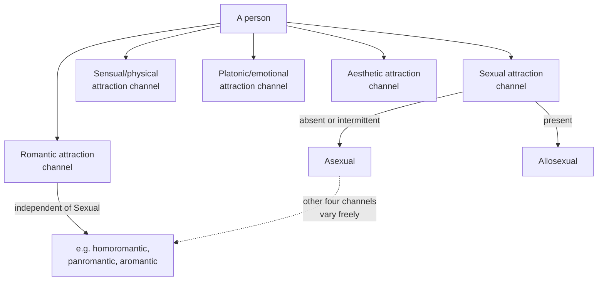
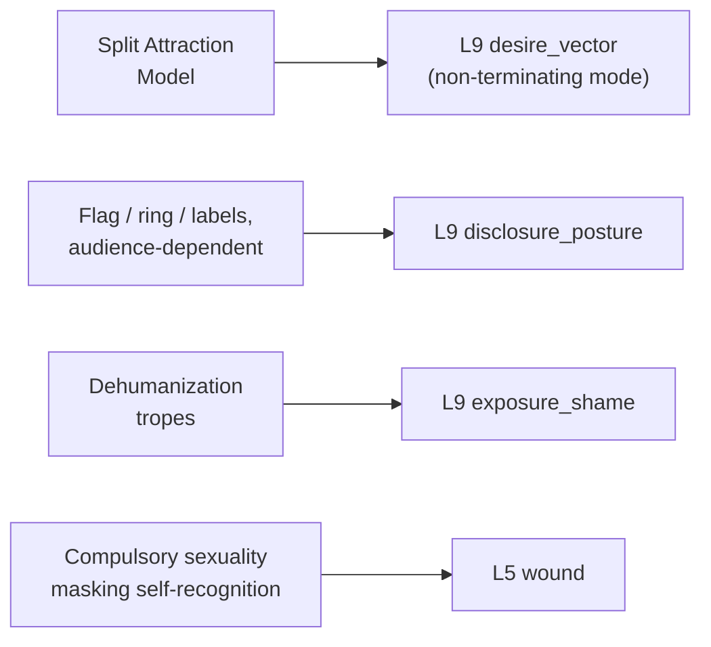

# 🧬 PSY.14 — Writing Asexual Characters — Salt and Sage Books (2020)
### Knowledge Entry — Distill

A short craft guide written by asexual sensitivity readers and editors, built entirely around one framework (the Split Attraction Model) and one recurring failure pattern (four families of harmful trope); the library's first entry keyed specifically to the ACE/ARO band of the sexuality shelf.

## TABLE OF CONTENTS
- [Core Thesis](#1-core-thesis)
- [Mind Models](#2-mind-models)
- [Framework](#3-framework--structure)
- [Key Concepts](#4-key-concepts)
- [Heuristics](#5-heuristics--decision-rules)
- [Invariants](#6-invariants)
- [Pitfalls](#7-pitfalls--myths)
- [Application](#8-application)
- [Cross-References](#9-cross-references)
- [Provenance](#10-provenance--confidence)

---

## 1 · CORE THESIS

Asexuality is the absence of sexual attraction, full stop — not celibacy (a choice), not desexualization (something done to a character), not dehumanization (a trope dressed as a trait). Attraction itself splits into five independent channels (sexual, romantic, sensual, platonic, aesthetic); a character's orientation is which channels run and which stay silent.

---

## 2 · MIND MODELS

*Required. Minimum two diagrams, maximum five.*

**Diagram 1 — the whole argument.**
Caption: *one framework (Split Attraction) and one recurring failure pattern (three families of trope) run under every chapter, from definition through legality to symbols.*

**Diagram 2 — the central mechanism (five independent attraction channels).**
Caption: *asexuality is one channel going quiet, not the whole system shutting down — the other four keep running, in any combination.*

**Diagram 3 — mapped onto the Command's L9 EROS fields.**
Caption: *the book's own machinery lines up one-to-one with three L9 fields — this is a source that was already speaking the Command's vocabulary.*

---

## 3 · FRAMEWORK / STRUCTURE

Eleven short chapters, each closing with a "Character & Story Implications" section that is the book's real payload — the preceding pages establish the concept, the closing section converts it into scene-level craft:

| Chapter | Governing question |
|---|---|
| Intro to Asexuality | What is asexuality, and how does it differ from every adjacent orientation? |
| Uncertainty and Identifying | Why is recognizing an absence harder than recognizing a presence? |
| Part of the LGBTQIA+ Community? | Does an orientation defined by absence still belong in a community organized around attraction? |
| Tropes: Celibacy | When is "doesn't have sex" a choice, and when is it an identity? |
| Tropes: Desexualization | What happens when a character is stripped of sexuality to serve a different trait? |
| Tropes: Dehumanization | What happens when the stripping is inverted into evidence of inhumanity? |
| Legality | What tangible legal exposure follows from an identity built on non-consummation? |
| Who's Who: Vocabulary | What does the Split Attraction Model unlock, and what is the community's actual word-set? |
| Common Conflations | Which adjacent things (aromanticism, libido, sex-aversion, celibacy) does asexuality get wrongly merged with? |
| Symbols | How does an out character signal, and to whom? |
| Final Takeaways | How do you avoid making one ace character stand in for all asexuality? |

---

## 4 · KEY CONCEPTS

| Concept | What it is | Why it matters |
|---|---|---|
| **The five types of attraction** | Sexual, romantic, sensual/physical, platonic/emotional, aesthetic — five distinct pulls that can each be present, absent, or vary independently in the same person | The load-bearing taxonomy of the whole book; without it, "asexual" collapses into "doesn't feel anything," which is false for most aces |
| **Split Attraction Model (SAM)** | The framework that a person's romantic and sexual orientations are separate axes, each independently labeled (e.g., "homoromantic asexual") | Lets a writer build a character who is warm, tactile, and relationship-seeking while still being asexual — attraction type, not intensity, is what varies |
| **Celibacy vs. asexuality** | Celibacy is a chosen, reversible abstention from sex/marriage; asexuality is an unchosen, lifelong lack of sexual attraction that coexists with any amount of actual sexual activity | The single most common reader confusion; conflating the two erases aces who do have sex and pathologizes celibate allosexuals as secretly ace |
| **The three trope families** | Celibacy tropes (Hiding Behind Asexuality, the Intellectual) · Desexualization tropes (Eternal Child, Disabled/Sick, Ice Queen) · Dehumanization tropes (Literally Inhuman, Coldhearted, Death-Adjacent) | A diagnostic checklist: nearly every existing ace-coded character in media falls into one of nine named slots, almost none of them affirmative |
| **The reinforcement test** | Ask whether a character's asexuality is being used to reinforce another trait (childishness, cruelty, inhumanity) rather than standing as a trait in its own right | The book's single portable editing tool — run any ace character's narrative function through it before publishing |
| **Compulsory sexuality/heterosexuality** | The cultural default assumption that everyone experiences sexual attraction (and toward the "correct" gender), strong enough to make a person misread their own asexuality for years or decades | Explains why ace self-discovery is so often delayed relative to other orientations — the absence is invisible against a background that assumes universal presence |
| **Graysexual and demisexual** | Graysexual: the zone between asexual and allosexual (intermittent, ambiguous, or context-dependent sexual attraction). Demisexual: sexual attraction that requires a prior emotional bond as a necessary-but-not-sufficient condition | Both sit under the asexual umbrella by convention but are their own labels; a character doesn't have to be "fully" asexual to authentically use ace-adjacent vocabulary |
| **Material stakes** | US annulment law (nonconsummation/impotence as grounds), constructive desertion in divorce, immigration consummation requirements, and absent employment protection in all but one US state | Converts "asexuality is just a preference" into concrete plot leverage — marriage, immigration status, and custody can all turn on this axis |
| **Symbols with audience-dependent risk** | Ace pride flag (public), black ring on the right middle finger (semi-covert, but risks misread as a swinger signal), ace of spades/hearts (community-internal only) | Each symbol trades visibility for safety differently; which one a character uses is itself characterization |

---

## 5 · HEURISTICS & DECISION RULES

| Situation | Do this | Not this |
|---|---|---|
| Establishing a character's orientation | Set the sexual attraction channel independently from romantic, sensual, platonic, and aesthetic channels | Write "asexual" as a single flat toggle that also switches off warmth, touch, and romance |
| A character discovers they might be ace | Show years of self-misreading under an assumed-allosexual default, not a sudden lightning-bolt realization | Compress identity discovery into one scene of instant, total certainty |
| Writing an evil or cold character | Give the villainy a human motivation unrelated to their orientation | Use asexuality (or aromanticism) as shorthand for sociopathy or moral coldness |
| A non-human or alien character is asexual | Let platonic love, duty, loss, or sacrifice do the "becoming human" work | Make their inhumanity partly defined by their lack of sexual interest |
| A character is desexualized by the plot (illness, aging, trauma) | Distinguish this explicitly from an asexual character's baseline orientation | Let incidental desexualization read as "secretly this character was ace all along" |
| A character's ace identity gets challenged by another character | Show the challenge as a form of erasure the character has to navigate | Resolve it by having the character "discover" they weren't really ace after all |
| Depicting an ace character having sex | Ground the motive in an established, specific reason (intimacy, pleasure, compromise) | Treat any sexual activity as proof the "asexual" label was wrong |
| Choosing what symbols a character uses | Match the symbol to how out and how safe the character is in that specific room | Default every ace character to the same flag-waving visibility |
| Writing more than one ace character | Give them distinct personalities, attitudes toward sex, and disclosure choices | Let a single ace character imply what "the asexual experience" looks like |
| Setting the story in a historical period | Use period-plausible framing rather than modern labels, but don't erase the experience itself | Assume asexuality is anachronistic just because the vocabulary is |

---

## 6 · INVARIANTS

1. **Asexuality is about attraction, not action.** Any amount of actual sexual activity, arousal, or libido can coexist with it; the only defining fact is the absence (or near-absence) of sexual attraction to other people.
2. **The five attraction types are independent.** Romantic, sensual, platonic, and aesthetic attraction do not require sexual attraction to be present, and none of the four is optional flavor — each can carry real narrative weight on its own.
3. **Celibacy is chosen and reversible; asexuality is neither.** A character can enter and exit celibacy at will; a character cannot choose their way into or out of being asexual.
4. **Desexualization is done to a character; asexuality is a trait of a character.** The direction of the verb is the whole distinction — something imposed by the narrative versus something the character simply is.
5. **There is no finish line on identity certainty.** Ongoing uncertainty, later relabeling, or context-dependent label use are all valid and do not retroactively invalidate a character's earlier self-understanding.
6. **No single ace character can represent the whole spectrum.** Sex-repulsed, sex-neutral, and sex-positive aces coexist, as do those who masturbate and those who don't, those who marry and those who don't.
7. **Erasure operates from both directions.** Cishet culture invalidates asexuality as "not real"; some corners of queer culture (exclusionists) gatekeep it as "not queer enough" — both are live narrative threats to an out ace character.

---

## 7 · PITFALLS / MYTHS

- Writing an "asexual" character who is secretly just shy, traumatized, or a late bloomer who "hasn't met the right person yet" — this is the Hiding Behind Asexuality trope, not actual representation.
- Using an ace character's lack of romantic entanglement to signal genius or purity (the Intellectual and Eternal Child tropes) rather than writing a fully socially developed adult.
- Making an ace character a robot, alien, or otherwise literally inhuman with no pushback on the implied equation of "no sexual attraction = not fully human."
- Building a villain's menace out of asexuality or aromanticism (the Coldhearted Asexual trope) — treats the orientation itself as evidence of moral deficiency.
- Linking asexuality to death, necromancy, or the already-deceased (the Death-Adjacent trope), even accidentally, by writing dead characters as newly "free of desire."
- Treating a character's asexuality as curable, as a phase, or as something correctable through therapy, medication, or "the power of a loving relationship" — echoes real corrective-rape rhetoric.
- Conflating asexuality with low libido, sex-aversion, or a medical dysfunction "to be fixed," rather than as its own stable orientation independent of any of those.
- Forgetting the material stakes: annulment grounds, immigration consummation requirements, and near-total absence of legal protection are live plot pressure, not backstory trivia.

---

## 8 · APPLICATION

- **Spine level:** L5 (WOUND) — the strongest story-structural material here is the delayed self-recognition arc: years spent inside a compulsory-sexuality default before a character can even name what they're missing, which is a wound shape (misread self, imposed frame) independent of any single traumatic event.
- **12-layer character stack:** primary at L9 (desire_vector, disclosure_posture); supporting at L9 (consent_posture, exposure_shame) and L5 (wound).
- **plot_systems:** contextual — the material-stakes chapter (annulment, immigration, employment) is a ready-made pressure generator for any plot that needs a legal or institutional antagonist rather than an interpersonal one.
- **Setting:** none directly — this is a character/psychology-layer source, not a setting source.

For the EROS layer, this book's real gift is the Split Attraction Model itself as a desire_vector architecture: instead of one intensity dial running from "no interest" to "high interest," a writer gets five independent channels that can be set separately for any character, ace or not. A character's desire_vector doesn't have to terminate in a sexual outcome to be full, textured, and plot-relevant — romantic, sensual, platonic, and aesthetic pulls can carry a relationship's entire weight. The reinforcement test (§4) is a fast, reusable gate for any character whose orientation risks becoming a stand-in for a different trait (coldness, purity, otherness) rather than standing as itself. The trope taxonomy also generalizes past asexuality specifically: the same three failure shapes (used to justify inaction, used to strip agency, used to justify dehumanization) recur wherever a writer reaches for an underused identity as shorthand for something else.

---

## 9 · CROSS-REFERENCES

| Related entry | Relation |
|---|---|
| [[🧬 MSX.17 — Mating in Captivity — Perel (2006)]] | Structural counterpoint: Perel's whole model assumes desire runs on distance and mystery within a sexual register; this book supplies the case where the sexual register itself is absent while the intimacy machinery (closeness, separateness, disclosure) still fully operates |
| [[🧬 PSY.08 — Lust, Men, and Meth — Fawcett (2015)]] | Both key to L9 desire_vector, from opposite ends: Fawcett's template is fused and overdetermined by a drug; this book's is absent on one channel and independent on the rest — together they bracket the field's range |
| [[🧬 PSY.06 — Fuckology — Downing, Morland & Sullivan (2014)]] | Shared method: both interrogate a clinical/diagnostic category (Money's lovemap there, "low libido"/"disorder" framings of asexuality here) as a site where medicalization does cultural work beyond description |

---

## 10 · PROVENANCE & CONFIDENCE

Full text read in its entirety — a short (86 KB, roughly 15,000-word) guide with no chapters requiring sampling. All eleven chapters, the two authors' letters, the afterword, and the resource/vocabulary appendices were read directly from the extracted text, including every "Character & Story Implications" closing section, which the framework and heuristics above draw from most heavily. No inference beyond the source's own explicit claims was required; the `feeds:` keying against L9 EROS fields is this distill's synthesis, built by direct analogy between the book's own named mechanism (the Split Attraction Model) and the field's description of desire_vector's non-terminating mode.

## META
- Template: BVX-LEARN-v4.0
- Source classification: full-text guide, complete read, no sampling
- Created / Updated: 2026-09-29
