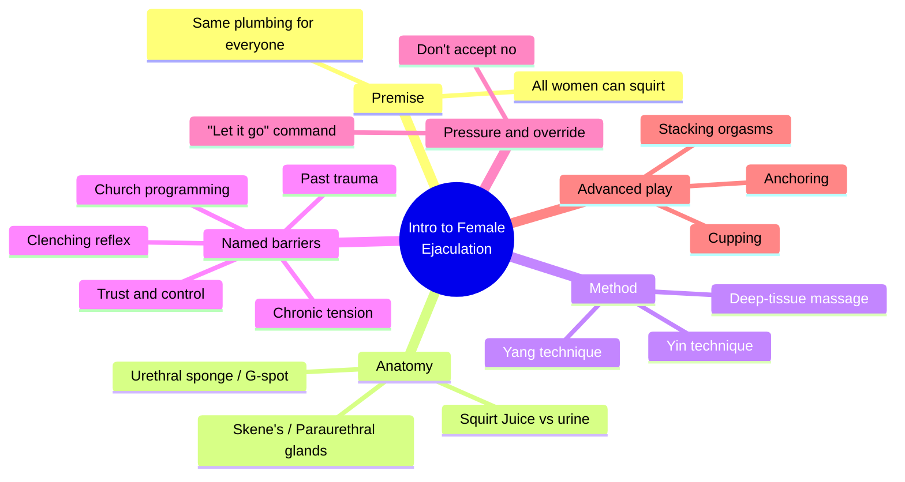
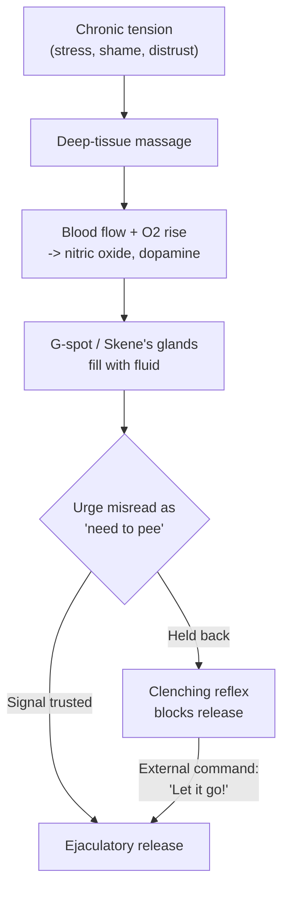
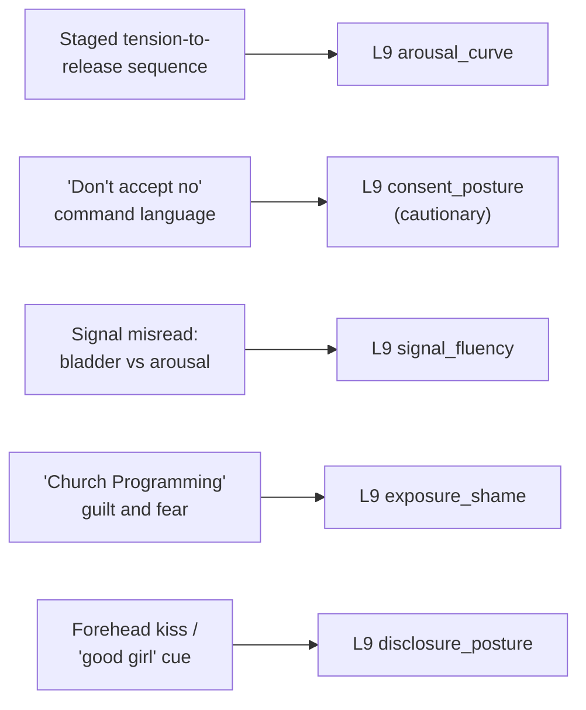

# 🧬 PSY.15 — Intro to Female Ejaculation — Hemon (2006)
### Knowledge Entry — Distill

A short, self-published instructional pamphlet accompanying a how-to DVD, sold direct-to-consumer by "ideaGasms." Not a clinical or peer-reviewed source; useful to this library for its concrete (and partly accurate) anatomy, its staged-arousal shape, and as a clear, citable case of a coercive consent posture dressed up as generosity.

## TABLE OF CONTENTS
- [Core Thesis](#1-core-thesis)
- [Mind Models](#2-mind-models)
- [Framework](#3-framework--structure)
- [Key Concepts](#4-key-concepts)
- [Heuristics](#5-heuristics--decision-rules)
- [Invariants](#6-invariants)
- [Pitfalls](#7-pitfalls--myths)
- [Application](#8-application)
- [Cross-References](#9-cross-references)
- [Provenance](#10-provenance--confidence)

---

## 1 · CORE THESIS

Female ejaculation is framed as a trainable, staged physical process: release chronic body tension, increase blood flow to the urethral sponge and Skene's glands, then push the partner through a single confusing signal (arousal read as a need to urinate) to reach release. The source treats that pushing-through as the instructor's job, not the partner's choice.

---

## 2 · MIND MODELS

*Required. Minimum two diagrams, maximum five.*

**Diagram 1 — the whole argument.**
Caption: *one physiological method wrapped in a second, unexamined argument about who gets to decide when "no" means stop.*

**Diagram 2 — the central mechanism (a staged arousal process).**
Caption: *the whole method funnels down to one ambiguous body signal, and the source resolves the ambiguity with an external command rather than the partner's own signal literacy.*

**Diagram 3 — mapped onto the Command's L9 EROS fields.**
Caption: *five pieces of this pamphlet key cleanly to five L9 fields, two of them cautionary rather than aspirational.*

---

## 3 · FRAMEWORK / STRUCTURE

No formal chapters; the pamphlet runs as a single continuous pitch-and-instruction letter, in this order:

| Section | What it does |
|---|---|
| Intro and warnings | Frames the DVD as instructional, not pornographic; warns against showing it to a partner unprepared for what it implies about her own sexuality |
| Why not dildos | States the author's stated motive (to out-perform a vibrator) and sets up the "Yang Technique" |
| Anatomy | Names the urethral sponge / G-spot, the Paraurethral (Skene's) glands, and distinguishes "Squirt Juice" from urine and from regular lubrication |
| The seven inhibitors | Lists the reasons the author claims most women don't ejaculate: tension, holding back, "church programming," clenching reflex, prior partners' negative reactions, disbelief, and trauma |
| The techniques | Yin (gentler, two fingers) and Yang (firmer, two fingers) manual stimulation of the G-spot, both requiring lubrication and trimmed nails |
| The barrier moment | Names the "false pee barrier" as the single choke point and instructs the reader to command the partner through it |
| Advanced techniques | Cupping (rhythmic pressure on the pubic bone), continued touch during orgasm to multiply it, tongue-hold on the clitoris, and anchoring a cue (touch, word, sound) to the orgasmic state for later re-triggering |

---

## 4 · KEY CONCEPTS

| Concept | What it is | Why it matters |
|---|---|---|
| **Urethral sponge / G-spot** | Erectile tissue surrounding the urethra along the front vaginal wall; swells with blood on arousal, compressing the urethra | The accurate anatomical anchor under the pamphlet's informal language; a writer can use the real structure even where the surrounding claims are unverified |
| **Skene's (Paraurethral) glands** | Glands within the urethral sponge that can produce fluid, released through the urethra, distinct in composition from urine though sharing the same duct | Explains why the sensation is easily mistaken for needing to urinate -- the confusion is anatomical, not just psychological |
| **The seven named inhibitors** | Tension, holding back/control, "church programming," the clenching reflex, a partner's past negative reaction, disbelief, and trauma | A ready-made taxonomy of things a character could be silently managing during a sex scene, several of them non-sexual in origin |
| **"Abreaction"** | The pamphlet's term for an old, unrelated emotional memory surfacing during massage or sex, sometimes as tears | A reusable scene-mechanic: touch in one place opens onto backstory that has nothing to do with the current partner |
| **The "false pee barrier"** | The point at which the ejaculatory urge and the urge to urinate feel identical, and the partner instinctively clenches to prevent either | The book's real discovery -- one legitimate, dramatizable moment of bodily ambiguity, before the text pivots to solving it by command |
| **"Don't accept no for an answer"** | The instructed response to the partner's hesitation at the barrier moment: repeated commands, refusal to pause and discuss | The book's least examined move -- it treats overriding a stated or embodied hesitation as skill rather than as a decision with a cost |
| **Anchoring** | Pairing a cue (a kiss, a word, a sound) with peak arousal so the cue alone can later reinduce that state | A concrete, working model for a private, built signal between two people -- useful independent of the pamphlet's NLP framing |
| **"Squirter Dimples"** | Lower-back dimples ("Dimples of Venus") offered as a visual predictor of ejaculatory capacity | An invented pseudo-diagnostic; useful to a writer only as an example of a character using junk science to read a stranger's body |

---

## 5 · HEURISTICS & DECISION RULES

| Situation | Do this | Not this |
|---|---|---|
| Writing a female-ejaculation or high-intensity arousal scene | Ground it in the real signal confusion (bladder urge vs. arousal build) and a staged build, not an instant, uncomplicated event | Write it as switch-flip and effortless, with no physical buildup or ambiguity |
| Writing diffuse, unclaimed sexual shame | Let it surface as a felt block with no clear present-day source ("church programming") rather than a single traceable scene | Reduce all sexual shame to one flashback of religious trauma |
| Writing a partner pushing past another's hesitation | Name the pattern on the page — commands, refusal to pause, "don't accept no" — as pressure with a cost, even if the scene lets it "work" | Present pushing someone through a stated or bodily hesitation as romantic or heroic with no narrative consequence |
| Writing a private intimacy cue (a word, a touch, a gesture) | Give it history — established, paired, and repeated before it can reliably retrigger anything | Have a cue work the first time it's used, with no prior pairing |
| Writing old trauma surfacing mid-scene | Let an unrelated touch open onto a disproportionate emotional memory, and let the scene stop or shift when it does | Keep a sex scene's emotional content walled off from the character's unrelated history |
| Assessing a character's "readiness" for a vulnerable sexual step | Base it on established trust and prior communication between the specific partners | Substitute a physical marker (dimples, fitness, "sense of humor") for actual evidence of safety or consent |
| Depicting an instructor- or expert-coded partner | Show their confidence as partly earned technique and partly untested authority they've never had to justify | Write technical fluency as automatically conferring good judgment about the other person's limits |

---

## 6 · INVARIANTS

*Presented as the source's own operating claims, not verified clinical fact — several are directly contradicted by the Pitfalls below.*

1. **The pamphlet treats physical tension and non-sexual emotional history as stored in the same tissue** — massage that releases one can surface the other uninvited.
2. **The bladder-signal and the ejaculatory-signal share a pathway and are, in the source's account, subjectively hard to tell apart** — this is the one structural claim the whole method depends on.
3. **Every technique in the pamphlet is staged**: tension release precedes arousal, arousal precedes the barrier moment, and the barrier moment precedes release — the order is treated as fixed, not optional.
4. **The source's own list of "inhibitors" (distrust, control-seeking, unresolved trauma) would block the method entirely if actually present** — the text's confidence in "pushing through" is never reconciled with its own list of reasons a partner might be withholding for good reason.
5. **The method assumes the partner has already opted into being taught this specific technique** — nowhere does the source describe obtaining that agreement in the moment; it assumes it happened earlier, off the page.

---

## 7 · PITFALLS / MYTHS

- Claims "all reasonably healthy women" can be trained to ejaculate, and that a single failure case (out of dozens) is the exception that proves the rule — an anecdotal sample presented as near-universal fact, no clinical citation offered.
- Recommends *not* showing a partner the source material that explains what the technique is or why it's being used on her — substituting the reader's private intention for the partner's informed understanding of the plan.
- Normalizes overriding a stated or embodied hesitation: "don't accept no for an answer... just yell at her to let it go" is presented as generosity and confidence, not named anywhere as pressure.
- Uses invented pseudo-diagnostic markers — lower-back dimples, "Heart Chakra" openness, "sense of humor" — as stand-ins for trustworthiness or readiness assessments that have no established validity.
- Borrows Wilhelm Reich's "issues are in the tissues" and NLP anchoring as if they were settled clinical science rather than contested or informal frameworks.
- Frames a partner's crying or a surfacing trauma memory as an expected, even desirable, side effect ("crying equals healing") without ever describing the condition under which the encounter should instead stop.
- Offers unverified biochemical specifics (exact fluid composition, a precise "20% or less body-fat" correlation) with the confident tone of established research.

---

## 8 · APPLICATION

- **Spine level:** L5
- **12-layer character stack:** L9 EROS (primary: arousal_curve, the staged tension-to-release sequence and the false-pee-barrier signal-confusion moment; primary/cautionary: consent_posture, the command-driven override as a legible bad pattern to name or assign to a character rather than model uncritically; supporting: signal_fluency, the bladder/arousal misread as realistic bodily ambiguity between partners; supporting: exposure_shame, diffuse unclaimed "church programming" guilt surfacing at peak vulnerability; contextual: disclosure_posture, the anchor as a built private cue)
- **plot_systems:** contextual — the "abreaction" mechanic (unrelated touch surfacing old memory) is a reusable scene-engine for opening a sex scene onto backstory without a flashback
- **Setting:** none

This pamphlet earns its place on the sexuality shelf less for its authority than for what it makes visible by being artless about it. The real anatomical content — the urethral sponge, the shared urethral pathway that produces genuine signal confusion, the staged buildup through tension release and blood flow — is usable groundwork for any female-ejaculation or high-intensity arousal scene, independent of everything else in the source. What the pamphlet does *not* earn is its confidence about consent: "don't accept no for an answer" is stated flatly, without acknowledging it as a choice with stakes, which makes this a clean, citable instance of a coercive consent_posture dressed as care — useful precisely because a writer can hand a character this exact voice and have the reader recognize the pattern, or can use it as the shape of a scene gone wrong. Read against [[🧬 MSX.17 — Mating in Captivity — Perel (2006)]], the contrast is instructive: Perel's eroticism requires separateness and the partner's own sovereignty; this pamphlet's method requires the partner's sovereignty to be talked past at the one moment it matters most.

---

## 9 · CROSS-REFERENCES

| Related entry | Relation |
|---|---|
| [[🧬 MSX.17 — Mating in Captivity — Perel (2006)]] | Direct contrast on consent_posture — Perel treats the partner's separateness and sovereignty as the precondition for eroticism; this pamphlet's "don't accept no" model treats overriding that sovereignty as a technique |
| [[🧬 PSY.10 — Magnificent Sex — Kleinplatz & Ménard (2020)]] | Legitimate clinical counter-source on the same general territory (optimal sexual experience) — where this pamphlet substitutes command and pseudo-diagnostics, Kleinplatz & Ménard ground extraordinary sex in communication and attunement |

---

## 10 · PROVENANCE & CONFIDENCE

Read in full — the source is a short, self-published PDF (~1,500 words of body text plus images not reproduced in the extracted text), sold as the companion manual to an instructional DVD by "ideaGasms" (Stephane Hemon), copyright 2006. No publisher, no peer review, no citations for its biochemical or statistical claims. Confidence is medium: the core anatomical content (urethral sponge, Skene's/Paraurethral glands, the shared urethral pathway) matches mainstream descriptions of female sexual anatomy and is usable as-is; the behavioral, statistical, and pseudo-diagnostic claims (universal "trainability," "Squirter Dimples," Chakra and NLP framing, "don't accept no") are the source's own unverified assertions and are flagged as such throughout rather than treated as fact.

The `feeds:` keying (L9 primary x2, supporting x2, contextual x1) is this distill's own synthesis against the Command's 12-layer character stack; the source uses none of that vocabulary. The `spine: [L5]` value follows the assigning brief's explicit instruction.

## META
- Template: BVX-LEARN-v4.0
- Source classification: full-text read, self-published promotional/instructional pamphlet, no deep-extraction needed given length (~1,500 words)
- Created / Updated: 2026-09-29
