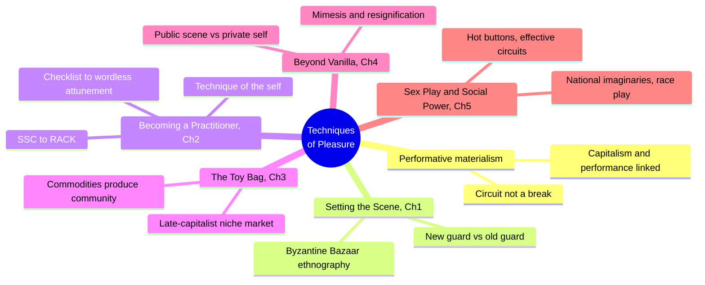
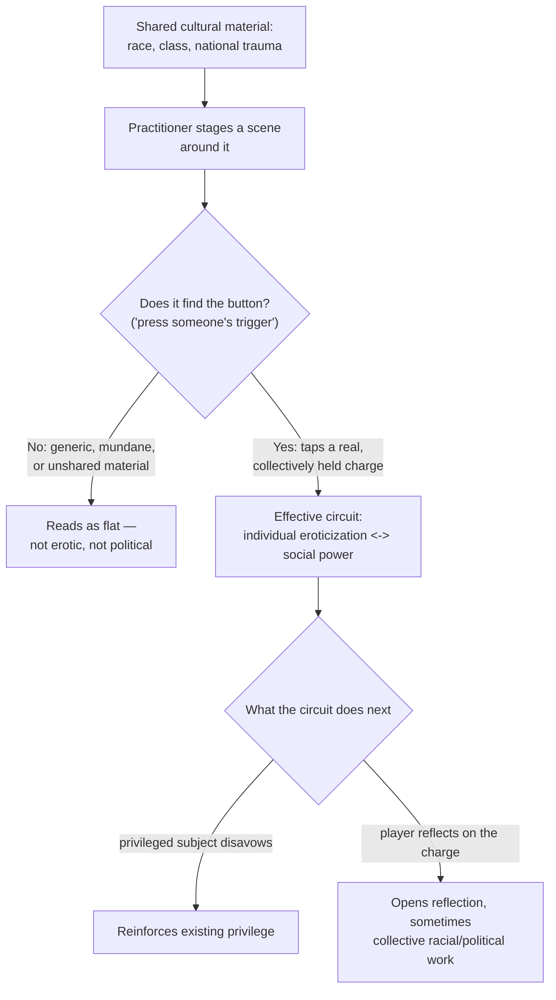
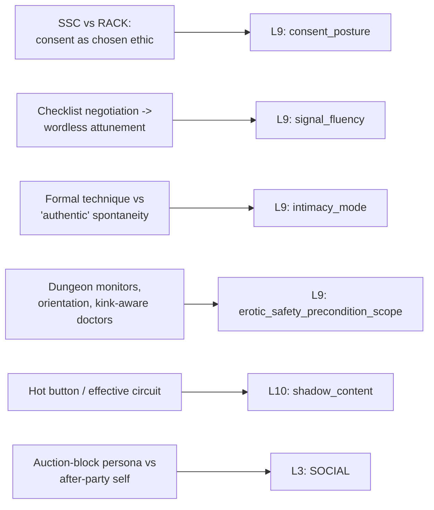

# 🧬 PSY.16 — Techniques of Pleasure — Weiss (2011)
### Knowledge Entry — Distill

An anthropologist's multi-year ethnography of the San Francisco Bay Area pansexual BDSM scene (the "new guard," post-1990s), arguing that SM desire is not a private escape from social power but a circuit built out of it — the first BVX-LEARN entry to treat kink as a learned communal craft with its own institutions, curricula, and internal politics, rather than as an individual orientation.

## TABLE OF CONTENTS
- [Core Thesis](#1-core-thesis)
- [Mind Models](#2-mind-models)
- [Framework](#3-framework--structure)
- [Key Concepts](#4-key-concepts)
- [Heuristics](#5-heuristics--decision-rules)
- [Invariants](#6-invariants)
- [Pitfalls](#7-pitfalls--myths)
- [Application](#8-application)
- [Cross-References](#9-cross-references)
- [Provenance](#10-provenance--confidence)

---

## 1 · CORE THESIS

BDSM desire is not a private break from social power but a "circuit" running through it: practitioners become practitioners by mastering community-taught technique (negotiation, safewords, SSC/RACK), and their scenes generate erotic charge precisely by tapping shared, real social material — race, class, national trauma — not by escaping it.

---

## 2 · MIND MODELS

*Required. Minimum two diagrams, maximum five.*

**Diagram 1 — the whole argument.**
Caption: *five chapters trace one circuit from technique to trauma — becoming a practitioner and finding a "hot button" are the same move, aimed at different targets.*

**Diagram 2 — the central mechanism (finding the "hot button").**
Caption: *a scene only becomes erotic when it taps a real, shared social charge — generic or invented material stays flat no matter how skillfully it is staged.*

**Diagram 3 — mapped onto the Command's L9 EROS and L10 SHADOW.**
Caption: *the book's two load-bearing mechanisms split cleanly: technique-as-craft lands on three L9 sub-fields, the hot-button mechanism lands on L10.*

---

## 3 · FRAMEWORK / STRUCTURE

Introduction plus five chapters, each moving the argument one step further from the individual body toward the national imaginary:

| Chapter | Governing move | What it establishes |
|---|---|---|
| Introduction: Toward a Performative Materialism | States the method: sexuality is a social relation, not a private escape from one | The "circuit" concept — connections between the subjective and the socioeconomic that are productive, not merely contextual |
| One, Setting the Scene | Ethnographic entry point: the Byzantine Bazaar slave auction | The "new guard" pansexual scene's demographics (white, professional, 40s–50s) and its formal, classroom-like organization |
| Two, Becoming a Practitioner | Foucauldian technique-of-the-self reading of SM training | Self-mastery through community-taught rules (SSC/RACK, negotiation, safewords, dungeon monitors) as biopolitics, not repression |
| Three, The Toy Bag | Economic reading of gear, classes, and commodified expertise | Commodities and community co-produce each other under late capitalism |
| Four, Beyond Vanilla | Public performance versus private "authentic" self | Practitioners police a real/fake binary (technique versus "energy") that the book treats as itself socially produced |
| Five, Sex Play and Social Power | Reads specific taboo scenes (slave auction, Nazi play, mock mugging, Abu Ghraib) | The "effective circuit" mechanism: scenes work when they find a real, shared "hot button," not a generic or invented one |

The book's method, "performative materialism," runs the same question at every chapter: is this practice a break from social power, or a channel for it? Weiss answers channel, every time, without treating that answer as a debunking — the erotic charge is real, and it is real *because* it runs through the social, not despite it.

---

## 4 · KEY CONCEPTS

| Concept | What it is | Why it matters |
|---|---|---|
| **The circuit** | A connection, like an electrical circuit, between domains imagined as separate (subjective/social, private/public, bedroom/capitalism) that only works, and generates charge, when current flows between them | The book's master metaphor; replaces "sex as private escape" with "sex as a conduit," reframing every subsequent chapter |
| **Performative materialism** | A method combining Butler's performativity (subjects produced through reiterated, citational practice) with a materialist reading of production and economic relations | Lets the book read a slave auction as simultaneously fundraiser, entertainment, and racialized political performance, without collapsing the three |
| **Technique of the self** | Foucault's term (*The Use of Pleasure*) for practices one performs on oneself not just to follow a rule, but to become the ethical subject of one's own conduct | SM practitioners are not born knowing how to do SM; they are *made* into practitioners through classes, negotiation forms, and community norms — desire is disciplined into shape, not simply expressed |
| **SSC vs. RACK** | Safe, Sane, and Consensual (the 1983 community mantra) versus Risk-Aware Consensual Kink (a later challenger that drops the unfalsifiable "safe" and "sane") | Two competing consent ethics practitioners actively debate and pick between; consent is a chosen, arguable framework, not a single settled standard |
| **Negotiation as checklist** | Formal pre-scene disclosure covering limits, safewords, medical/emotional history, and specific acts, sometimes run off multi-category printed forms | The community's answer to "how do strangers do something this intense safely" — and also the target of the scene's own internal critique (see Pitfalls) |
| **The "OTW" (one true way)** | Mocking community shorthand for someone excessively invested in a single correct technique, produced by the proliferation of classes, books, and certifying organizations | Names the tension between standardized safety education and the "old guard" ideal of personal, mentor-transmitted craft |
| **Checklist-to-attunement arc** | Long-term partners (Pam and Vince) who no longer negotiate or use safewords because sustained attention has replaced the need for explicit protocol — "all I really need to do is pay attention" | A concrete, citable model for signal fluency as something built over time inside one relationship, not a fixed trait a person either has or lacks |
| **Hot button / trigger** | A scene element (race, Nazi imagery, mock mugging, ownership) that "presses" a real, culturally shared, affectively loaded nerve, as opposed to generic or invented content | The mechanism that separates an erotically *effective* scene from a flat one; Weiss shows the same race-play scene work for one audience and fail for another based only on whether it found real shared material |
| **The mimesis/resignification split** | Playing a role (a Klansman, a slave) can either simply repeat (mimic) real-world oppression or repeat it with a difference that opens reflection (resignify it) | Determines whether a given scene reinforces privilege or unsettles it; the difference is not in the content but in the audience's and player's relation to it |
| **Dungeon Monitors Association (DMA)** | A certifying body (first aid/CPR, a written exam, logged shift hours) that trains volunteers to police safety and rule-compliance at play parties | A concrete example of externalized, structural safety infrastructure that exists apart from what two players negotiate between themselves |

---

## 5 · HEURISTICS & DECISION RULES

| Situation | Do this | Not this |
|---|---|---|
| Writing a character's first scene in a new kink community | Show them working a formal checklist: limits, safewords, medical disclosure, explicit categories | Have them "just know" the rules through instinct or attraction alone |
| Writing two long-term partners' scene | Let negotiation shrink to near-nothing — reading each other replaces the checklist | Force the same explicit protocol on a couple with years of built attunement |
| Deciding whether a taboo or power-laden scene reads as erotic in the story | Root it in a real, shared cultural charge the audience/other characters recognize | Invent a private, idiosyncratic trigger and expect it to land as intense for anyone else |
| A character defends or debates "the rules" (safewords, negotiation, SSC) | Let them argue a specific position (RACK over SSC, or vice versa) as a real intellectual and community stance | Write "the rules" as a single flat monolith nobody has opinions about |
| Showing a public kink or power scene (an auction, a demonstration) | Keep the performer's on-stage persona legibly separate from who they are once it ends | Assume the public role is simply the character's true self unmasked |
| A scene invokes real historical trauma (slavery, genocide, colonization) | Show it working or failing to work based on whether it taps something the audience actually shares and recognizes, and let it sometimes fail | Treat any transgressive content as automatically erotic or automatically horrifying by default |
| A character is new to a scene versus a veteran | Give the newcomer classes, certifications, and mentors; give the veteran earned shortcuts and an "I've outgrown that" attitude | Flatten expertise into either "everyone already knows" or "everyone needs the same training" |
| Writing community infrastructure around a kink or subculture practice | Include institutions: certifying bodies, vetted professionals, screening processes, a literature of how-to guides | Write the practice as existing only in the moment between two people, with no surrounding social scaffolding |

---

## 6 · INVARIANTS

1. **Desire is not a private escape from social power; it runs through it.** The book's foundational move — every subsequent claim depends on this one.
2. **Becoming skilled at a sexual practice is a social, taught process, not a spontaneous unlocking of an inner truth.** Self-mastery in SM is produced by classes, mentors, and community norms, exactly like any other craft.
3. **Consent and desire are separable, arguable frameworks (SSC vs. RACK), not one settled fact.** Practitioners actively debate which standard to use and customize both.
4. **Signal fluency is built, not innate, and can retire explicit protocol once it is built.** The same relationship can move from checklist to wordless attunement over time.
5. **A scene's erotic charge depends on whether it finds a real, shared "hot button," not on how skillfully or explicitly it is staged.** Identical technical execution can be flat or electric depending on what social material it touches.
6. **Public sexual/power performance and private self are structurally distinct registers.** A practitioner's stage persona does not simply reveal a hidden true self underneath.
7. **Safety infrastructure exists at two separable scales: in-scene (negotiation, safewords) and structural (certifying bodies, vetted professionals, community screening).** Losing one does not mean losing the other.
8. **Playing with historical trauma can either reinforce or unsettle the inequality it stages — the same content, different outcome, depending on audience relation, not on the act itself.**

---

## 7 · PITFALLS / MYTHS

- Reading "the rules" (safewords, negotiation checklists) as simply making sex safer and nothing else; practitioners themselves argue formalized rules can flatten intimacy into "a mechanical exercise" and mourn a lost "sacredness."
- Assuming more explicit negotiation always signals less trust or less heat; some practitioners read a detailed checklist scene as *more* erotic (the pleasure of describing one's desires in exhaustive detail), not less.
- Treating SSC as an uncontested, universally accepted standard; a significant faction explicitly rejects it as unfalsifiable ("nothing is truly safe or sane") in favor of RACK.
- Assuming a transgressive or taboo scene is automatically politically subversive, or automatically politically regressive; the book insists the same act can do either, and that the binary itself is the wrong question.
- Reading a public kink performance (an auction, a demonstration) as the performer's unmediated real self; the book repeatedly finds practitioners whose stage persona and after-party self diverge on purpose.
- Assuming expertise and self-mastery in a kink community float free of race and class privilege; the book documents the "ideal practitioner" (white, professional, propertied) as itself produced by which forms of self-cultivation the community rewards.
- Mistaking "safe, sane, and consensual" for a claim that bdsm eliminates risk; several interviewees explicitly reject the phrase because nothing about intense physical/psychological play is actually risk-free.

---

## 8 · APPLICATION

- **Spine level:** [L5] WOUND, per this batch's assigned keying (a community-and-craft source, not a single-injury source; the wound frame sits under the "hot button" mechanism — what a character's desire lights up on is diagnostic of unresolved social/historical material, not a discrete trauma event)
- **12-layer character stack:** L9 EROS, primary (`consent_posture`, `signal_fluency`, `intimacy_mode`); L10 SHADOW, primary (`shadow_content`, via the hot-button/effective-circuit mechanism); L3 SOCIAL, contextual (public performance persona distinct from private self)
- **plot_systems:** contextual candidate once `04_PLOT_SYSTEMS/` opens — the "effective circuit" (Diagram 2) is a ready-made test for whether a scene's stakes land: does it tap something the reader already recognizes and cares about, or is it generic peril dressed as intensity
- **Setting:** contextual — the book's account of a subculture's own institutions (certifying bodies, curricula, semipublic venues, a literature of guides) is a portable model for building any community-of-practice around a taboo or high-skill activity, kink or otherwise

Weiss's real contribution to the intimacy layer is refusing to treat kink competence as either purely innate ("some people are just wired for this") or purely mechanical ("just follow the checklist"). A character's `signal_fluency` should be writable as a biography: explicit and checklist-driven early, capable of retiring into wordless attunement later, and never entirely free of the community infrastructure (classes, mentors, certifying bodies) that built it. Separately, the `shadow_content`/hot-button mechanism gives a concrete, testable model for why some scenes (sexual, dramatic, or otherwise) land as charged and others as flat: the difference is whether the material taps something the audience already, really, shares.

---

## 9 · CROSS-REFERENCES

| Related entry | Relation |
|---|---|
| [[🧬 MSX.22 — The Ultimate Guide to Kink — Taormino (2012)]] | Sibling on SSC/RACK, negotiation, and aftercare from a practitioner-facing how-to register; this entry supplies the same territory's ethnographic and political reading, ten years earlier |
| [[🧬 PSY.13 — Psychology of the Unconscious — Jung (1916)]] | The "hot button"/effective-circuit mechanism (desire charged by tapping something that stands in for a larger, shared meaning) is a sociological cousin of Jung's claim that a desired object is structurally a symbol, never the literal target |
| [[🧬 MSX.29 — Cruising Guide — Thorne Harbour Health (2018)]] | Sibling on nonverbal signal literacy as its own learnable fluency, independent of desire's content — cruising's approach/decline grammar and this book's checklist-to-attunement arc describe the same skill from different communities |
| [[🧬 MSX.36 — The History of Sexuality — Foucault (1978)]] | This book's central method (technique of the self, biopower) is explicitly and directly Foucauldian; read together, Foucault supplies the theory this ethnography applies to one concrete, present-day American subculture |

---

## 10 · PROVENANCE & CONFIDENCE

Full text, pdftotext extraction (~248pp main text before appendix/notes/references/index), clean text layer with a machine-readable table of contents. Read in full: A Note on Terminology; the Introduction, "Toward a Performative Materialism" (the circuit concept, the performative-materialist method); the opening and closing sections of Chapter One, "Setting the Scene" (the Byzantine Bazaar ethnography, new guard/old guard demographics); Chapter Two, "Becoming a Practitioner" (full — technique of the self, the DMA, Janus and classes, the OTW critique, SSC versus RACK, negotiation and safewords, the checklist-to-attunement contrast between newer and veteran practitioners); the opening of Chapter Five, "Sex Play and Social Power" (the "effective circuit" theory statement) and its central case studies (the slave auction reprise, the Klansman/mugging/race-play scenes, the hot-button mechanism, the mimesis/resignification distinction). Sampled, not deep-extracted: Chapter Three, "The Toy Bag" (opening pages only — commodification and community); Chapter Four, "Beyond Vanilla" (closing pages only — the public/private, real/fake debate that sets up Chapter Five); the Appendix (interviewee vignettes, used only to confirm demographic claims already read in the main text); Notes and References not read.

The `feeds:` variable names (`consent_posture`, `signal_fluency`, `intimacy_mode`, `erotic_safety_precondition_scope`, `shadow_content`, `SOCIAL`) are taken directly from L9 EROS and adjacent layer definitions in `ssot_02_character_systems_vertical_slice.md` PART A and the L9 EROS synthesis (`ssot_02_l9_eros_synthesis.md`), not inferred loosely; `consent_posture`, `signal_fluency`, and `erotic_safety_precondition_scope` were fields the 9/29 synthesis pass already ruled onto L9 from an earlier wave of this shelf (MSX.18–36, PSY.08–13), and this entry is independent confirmation from a fourth, ethnographic source rather than a new proposal.

## META
- Template: BVX-LEARN-v4.0, sexuality variant (BOLO 87/88, `brief.DISTILL.md` as changed by `brief.DISTILL.wave3.md`)
- Source classification: full-text book, deep extraction on 2 of 5 chapters plus introduction, partial extraction on 2 chapters, appendix sampled for confirmation only
- Created / Updated: 2026-09-29
