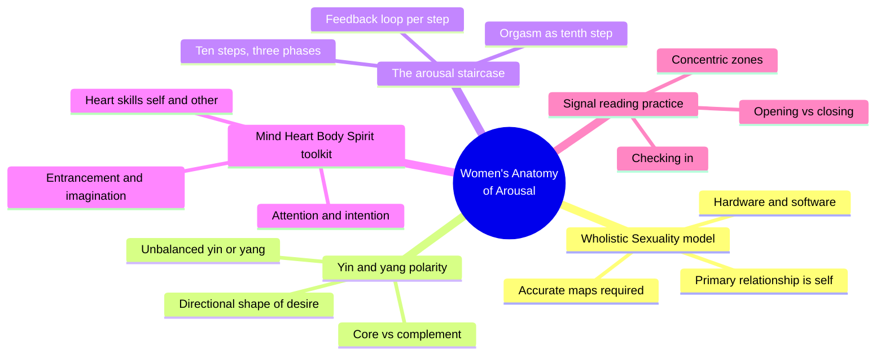
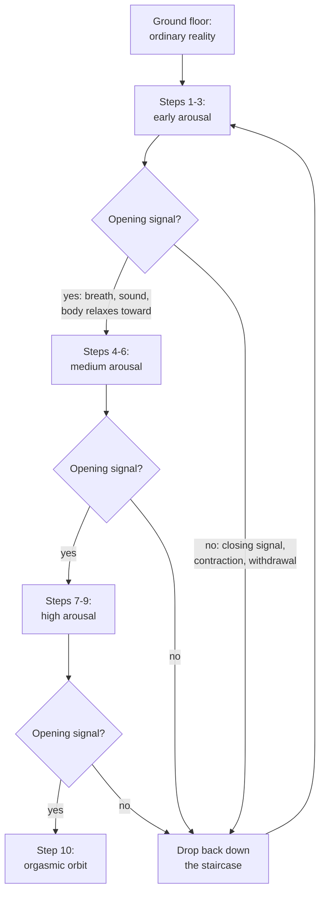
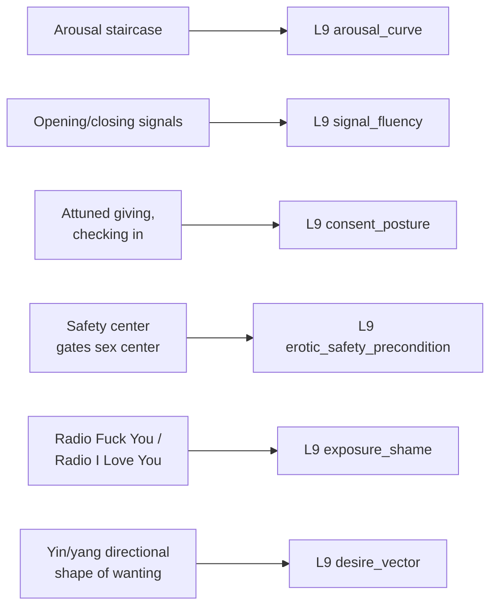

# PSY.17 — Women's Anatomy of Arousal: Secret Maps to Buried Pleasure — Sheri Winston (2010)
### Knowledge Entry — Distill

A sex educator and midwife's field manual for female arousal: an explicit stepwise model of how arousal climbs, a polarity model of how desire moves, and a signal-reading practice for staying attuned to both — written for the DESIRE_INTIMACY shelf of the sexuality library.

## TABLE OF CONTENTS
- [Core Thesis](#1-core-thesis)
- [Mind Models](#2-mind-models)
- [Framework](#3-framework--structure)
- [Key Concepts](#4-key-concepts)
- [Heuristics](#5-heuristics--decision-rules)
- [Invariants](#6-invariants)
- [Pitfalls](#7-pitfalls--myths)
- [Application](#8-application)
- [Cross-References](#9-cross-references)
- [Provenance](#10-provenance--confidence)

---

## 1 · CORE THESIS

Arousal is a ten-step staircase, not a switch: each step needs its own feedback loop before the next opens, and the climb is gated the whole way by real-time signals of opening or closing. Desire also has a directional shape — inward-accumulating (yin) or outward-initiating (yang) — that every person carries in some mix, independent of gender or partner.

---

## 2 · MIND MODELS

*Required. Minimum two diagrams, maximum five.*

**Diagram 1 — the whole argument.**
Caption: *the book runs three passes over the same material — a model of sexuality, a map of anatomy, then a toolkit — and the toolkit pass is where the model becomes usable technique.*

**Diagram 2 — the central mechanism (a process: gated ascent through the arousal staircase).**
Caption: *every step forward requires a signal of opening; any closing signal drops the climb back down rather than pausing it in place — attunement isn't a courtesy layered on top of arousal, it's the gate the process runs through.*

**Diagram 3 — mapped onto the Command's L9 EROS layer.**
Caption: *five source mechanisms land on five L9 fields almost one-to-one — this book is closer to an L9 field manual than a general sexuality source.*

---

## 3 · FRAMEWORK / STRUCTURE

Three sections, each building on the last: **Section One (Maps, Models and Mistakes)** lays the Wholistic Sexuality framework — hardware/software, the primacy of self-relationship, yin/yang polarity — before any anatomy is introduced, on the premise that bad maps produce bad sex regardless of the territory's accuracy. **Section Two (Journey to the Origin of the World)** is the anatomical atlas proper — the full erectile network, most of it absent from mainstream models. **Section Three (Becoming an Erotic Virtuoso)** converts both into a four-part toolkit (mind, heart, body, spirit) plus a closing partner-facing chapter that operationalizes everything as a signal-reading, pacing and consent practice. The book is explicitly a solo-first curriculum: master the instrument alone before playing duets, on the argument that partner skill is solo skill applied to a second nervous system.

---

## 4 · KEY CONCEPTS

| Concept | What it is | Why it matters |
|---|---|---|
| **Wholistic Sexuality** | A five-principle framework: self-relationship is primary, sex is connection at every scale, sexuality is a lifelong learning journey, skills are learnable, and learning depends on accurate models | The book's justification for existing — most sexual difficulty is a bad-map problem, not a bad-body problem |
| **Hardware and software** | Sexual behavior is part evolved wiring (hardware), part culturally learned programming (software) | Frames technique and shame both as learnable/unlearnable, not fixed traits |
| **The arousal staircase** | Ten discrete steps in three phases (early, medium, high) plus a distinct orgasmic tenth step; each step requires its own physiological feedback loop before the next opens | The book's core mechanism — arousal is climbed, not switched on, and can't be skipped to |
| **Concentric zones** | Body mapped in rings — energy field, non-erogenous zone, erogenous zone, genital zone ("yard," "porch," inner sanctum) — each unlocked only at a matching arousal level | Turns "go slow" into a spatial rule: outer zones first, genitals only once medium-to-high arousal is already signaled |
| **Yin and yang core/complement** | Two directional energies everyone carries in some ratio: yin (cool, inward-accumulating, needs safety to open) and yang (hot, center-outward, goal-directed) — one usually dominant, the other complementary | Gives desire a *shape*, not just an intensity; explains why the same approach doesn't work on every partner or every mood |
| **Opening vs. closing signals** | Real-time read of breath, sound, movement and body posture as continuous data about whether to advance, hold, or retreat | The book's practical consent mechanism — pacing is driven by signal, not by a fixed script or elapsed time |
| **The safety center** | An energetic checkpoint below the genitals that inward-moving (yin) arousal must pass through before reaching the sex center | Makes "she needs to feel safe first" a structural claim about the arousal pathway, not just relational advice |
| **The four-part toolkit** | Mind tools (attention, intention, entrancement, imagination), heart tools (witnessing, open-heartedness, compassion, giving/receiving), plus body and spirit tools | Treats arousal as actively cultivated across four domains, not a passive physiological event happening to a person |
| **Radio Fuck You / Radio I Love You** | The internalized critical voice that interrupts arousal, named and given a dial the reader can consciously retune | A concrete mechanism for exposure/role shame: it has a name, a moment it fires, and a counter-practice |
| **Mistaking wetness/erection for readiness** | Vaginal lubrication or erection is flagged explicitly as an early-arousal indicator, not a consent or readiness signal | The book's sharpest correction to a common cultural conflation, stated as a rule for partners to act on |

---

## 5 · HEURISTICS & DECISION RULES

| Situation | Do this | Not this |
|---|---|---|
| Beginning to arouse a partner | Start at the outer zones (non-erogenous first) and let arousal climb before approaching genitals | Go straight for breasts/genitals to "get things started" |
| Partner shows a closing signal (tensing, pulling back, silence) | Back off, return to an outer zone, slow the pace | Push forward assuming it will pass |
| Uncertain whether a partner is ready for deeper contact | Ask directly, or read for an explicit opening signal (sound, movement toward you) | Infer readiness from wetness, erection, or elapsed time |
| Arousal stalls or a negative self-critical thought intrudes | Notice it as a "bad movie," name it, gently redirect attention | Push through it, or treat the stall as a personal or bodily failure |
| Trying to sustain deep arousal | Use breath, sound, and movement (body tools) to "enhance the trance," and hold steady once a rhythm is working | Change technique or speed once something is clearly working |
| A partner's desire seems slower to ignite than your own | Recognize it may be a yin-shaped (accumulating, safety-gated) pattern rather than a deficit | Read the difference in pace as disinterest or dysfunction |
| Teaching or writing a character's arousal | Give it stepwise structure with a stall/regression condition, not a single threshold | Write arousal as binary (off/on) or purely duration-based |

---

## 6 · INVARIANTS

1. **Arousal is stepwise and directional.** It can be climbed quickly or slowly, but not skipped; a closing signal drops the climb back down rather than freezing it in place.
2. **Safety precedes opening for inward-accumulating (yin-shaped) desire.** The safety center is positioned structurally before the sex center in the pathway the book describes.
3. **Physical arousal indicators are not consent indicators.** Wetness and erection are early-step data, never a stand-in for a yes.
4. **Everyone carries both directional energies**, in an individual, non-gender-locked ratio; one is usually core, the other complementary, and both need development.
5. **Attunement is continuous, not a one-time checkpoint** — it is read moment to moment off breath, sound, and movement throughout the whole climb.
6. **The mind actively shapes arousal** through attention, intention, entrancement, and imagination; it is not a passive bystander to physiological process.

---

## 7 · PITFALLS / MYTHS

- Treating lubrication or erection as a green light rather than an early-arousal signal.
- Genital-first technique — approaching the most sensitive zones before outer-zone arousal has built.
- Reading a partner's slower or non-linear arousal pattern as disinterest, dysfunction, or a technique failure to be fixed.
- Assuming one script or technique works on every partner, or on the same partner every time (arousal energy is described as fluxing, not fixed).
- Confining fantasy content to a literal behavioral wish list rather than a free, private zone with no enactment obligation.
- Treating the mind and body as separable "modes," when the book's own claim is that all four domains (mind, heart, body, spirit) interweave in one process.

---

## 8 · APPLICATION

- **Spine level:** none — this is an L9 EROS character-layer source, not a story-spine source (per the v4 template's binding rule that character-stack feeds sit beside the spine, not on it)
- **12-layer character stack:** L9 primary, across five fields (see `feeds:`) — arousal_curve, signal_fluency, consent_posture, erotic_safety_precondition, exposure_shame, desire_vector
- **plot_systems:** contextual — the opening/closing signal vocabulary is a ready-made beat-level tool for writing a scene's escalation or de-escalation truthfully, independent of which character layer owns it
- **Setting:** none

What a writer gets from this book is a *mechanism*, not just vocabulary: a character's L9 arousal_curve can be authored with an actual climb rate, stall conditions, and a regression rule (a closing signal drops the climb rather than pausing it), rather than a single intensity dial. signal_fluency stops being an abstract trait and becomes legible as "does this character correctly read opening/closing signals, in themselves or a partner" — which is directly testable in a scene. consent_posture gets a concrete default behavior to write toward or against: attuned giving, "let her wanting precede your giving," checking in at every zone boundary — and a character who violates this (genital-first, ignoring closing signals, treating wetness as permission) is legible as a specific, nameable failure mode rather than a vague "bad lover." exposure_shame gets a named internal mechanism (the critical voice, and the practice of retuning it) that a writer can dramatize as an interruption at a specific staircase step rather than generalized inhibition. The yin/yang directional model is the weakest part to import wholesale — it is gender-essentialist in its own framing even while the author insists it's not gender-locked — but stripped of the gender mapping, "inward-accumulating desire that needs a safety precondition" vs. "outward-initiating desire that is goal-directed" is a usable, non-gendered pair of desire_vector shapes.

---

## 9 · CROSS-REFERENCES

| Related entry | Relation |
|---|---|
| [[🧬 MSX.17 — Mating in Captivity — Perel (2006)]] | Sibling L9 source — Perel's security/passion polarity is the relational-arc counterpart to this book's safety-precedes-opening structural claim at the arousal-mechanics level |
| [[🧬 MSX.30 — Urban Tantra — Carrellas (2017)]] | Sibling energy-work source — shares the yin/yang and energy-circuit vocabulary; Carrellas develops the spiritual/energetic register this book only sketches in its "spirit tools" |
| [[🧬 PSY.01 — Whole-Body Sex — Walker (2020)]] | Sibling DESIRE_INTIMACY source — both argue against genital-only arousal models; Walker's whole-body erogenous-zone mapping is a more clinical parallel to this book's concentric-zones model |

---

## 10 · PROVENANCE & CONFIDENCE

Full text, plain-text extraction, ~2,590 lines (~437 KB). Read via table of contents and chapter-boundary grep, then targeted full reads: front matter and Chapter One (arousal as altered state, the ten-step staircase introduced); Chapter Three (the Wholistic Sexuality primer in full); Chapter Four (the yin/yang polarity model in full); Chapter Nine (mind and heart tools in full); Chapter Twelve (the partner-facing signal-reading and consent practice, in full). Chapters Two, Five through Eight, Ten, and Eleven (cultural-confusion framing, the detailed genital anatomy atlas, senses, and energy/tantra technique) were sampled by table of contents and chapter opening only — their content is anatomical/technical detail downstream of the models extracted here, and their omission does not change any claim made in this entry. No content was inferred beyond what appears in the read passages.

## META
- Template: BVX-LEARN-v4.0
- Source classification: full-text book, deep extraction on 5 of 12 chapters (chs. 1, 3, 4, 9, 12), sampled on the remainder
- Created / Updated: 2026-09-29
