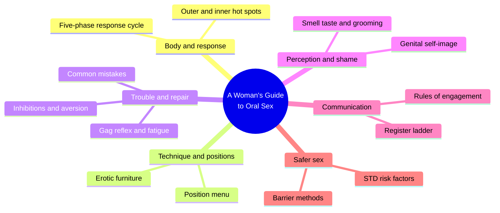
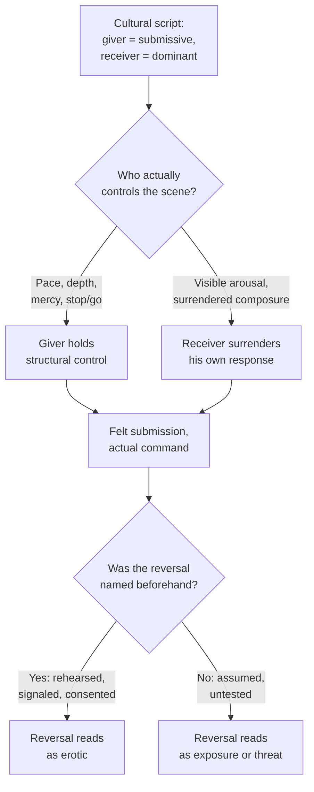
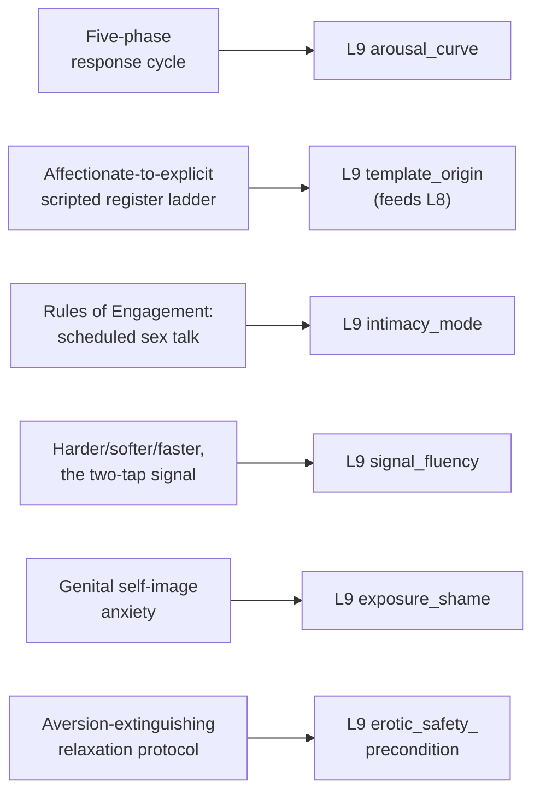

# 🧬 PSY.18 — A Woman's Guide to Oral Sex — Fulbright (2012)
### Knowledge Entry — Distill

A short, frank how-to guide (Adams Media's *Secrets of Great Sex* series, abridged from Yvonne K. Fulbright's *The Best Oral Sex Ever*): anatomy, technique, and troubleshooting for fellatio, framed throughout by two recurring claims — the visibly submissive position secretly holds the control, and neither pleasure nor safety survives on instinct without being spoken aloud.

## TABLE OF CONTENTS
- [Core Thesis](#1-core-thesis)
- [Mind Models](#2-mind-models)
- [Framework](#3-framework--structure)
- [Key Concepts](#4-key-concepts)
- [Heuristics](#5-heuristics--decision-rules)
- [Invariants](#6-invariants)
- [Pitfalls](#7-pitfalls--myths)
- [Application](#8-application)
- [Cross-References](#9-cross-references)
- [Provenance](#10-provenance--confidence)

---

## 1 · CORE THESIS

Oral sex compresses the whole erotic system into one act: desire, power, shame, and safety are all negotiated in miniature. The kneeling "giver" looks submissive but structurally holds command — pace, depth, mercy — while the receiver surrenders composure and control of his own response. Neither pleasure nor safety runs on instinct alone; both require it to be said out loud first.

---

## 2 · MIND MODELS

*Required. Minimum two diagrams, maximum five.*

**Diagram 1 — the whole argument.**
Caption: *a practical manual sorts into six working concerns — body, technique, trouble, shame, talk, and risk — each treated as something to be managed on purpose, not left to chance.*

**Diagram 2 — the central mechanism (a state change: apparent submission flips to actual command).**
Caption: *the kneeling position looks like the powerless one — the book insists it is the opposite, and that whether the reversal reads as erotic or threatening depends entirely on whether it was named beforehand.*

**Diagram 3 — mapped onto the Command's L9 EROS fields.**
Caption: *six concrete pieces of this how-to guide land on six distinct L9 variables — the book is a toolkit for writing an intimate scene's mechanics, not just its mood.*

---

## 3 · FRAMEWORK / STRUCTURE

A linear manual with two intercut registers, technique-and-anatomy chapters alternating with troubleshooting-and-communication chapters:

| Section | Governing move |
|---|---|
| Introduction | Names the book's premise: desire and equipment are innate, technique and confidence are learned |
| Sexual anatomy | Maps outer hot spots (glans, foreskin, frenulum, corona, shaft, scrotum, perineum) and inner ones (testicles, prostate) as an intentional itinerary, not an undifferentiated zone |
| The response cycle | States the five-phase model (desire, arousal, plateau, orgasm, resolution) as a loose road map, explicitly non-linear |
| Positions | Presents ~13 named positions, each with a "why couples love it," a role split (him/you), tips, and variations — a repeatable authoring template |
| Owning your pleasures | Diagnoses common mistakes, breath management, gagging, and fatigue as solvable mechanical problems |
| Common concerns | Splits anxiety by role: her self-perception and guilt, his erectile and ejaculatory fear, both rooted more often in psychology than physiology |
| Inhibitions and aversion | Distinguishes ordinary hesitation from clinical aversion and trauma-linked avoidance, each with a different repair path |
| Genital perceptions | Treats body-image toward one's own genitals as a predictor of sexual enjoyment, independent of the partner's skill |
| Communication | Formalizes "sex talk" into rules of engagement, an initiation script, and a graded register of dirty talk |
| Safer sex | Runs risk factors, barrier methods, and disclosure conversations as a final, explicit negotiation layer |

The throughline: every chapter converts something usually left implicit (what turns him on, what a position signals, how to ask, how to disclose risk) into an explicit, nameable move.

---

## 4 · KEY CONCEPTS

| Concept | What it is | Why it matters |
|---|---|---|
| **The five-phase response cycle** | Desire, arousal, plateau, orgasm, resolution — presented as a rough sequence a body may skip, loop, or exit early | The book explicitly decouples orgasm from satisfaction: "sex without orgasm can be very satisfying" when presence and connection are strong |
| **The submission/command inversion** | The kneeling giver looks passive but sets pace, depth, and mercy; the receiver looks dominant but surrenders his own composure and reactions | Reframes any visually submissive erotic position as a site of real control — useful for writing power dynamics that aren't what they look like from outside the scene |
| **The register ladder** | Five named registers of erotic speech — affectionate, romantic, sensual, seductive, explicit — each with example lines and fill-in-the-blank templates | A literal vocabulary-by-intimacy-level a writer can lift wholesale to differentiate how two characters, or one character in two moods, actually talk during sex |
| **Rules of Engagement** | A scheduled, undistracted, judgment-suspended protocol for talking about sex outside the bedroom (timing, tone, listening moves, forbidden moves) | Distinguishes in-scene signal-reading (spontaneous) from out-of-scene negotiation (scripted) as two different registers the same couple must both run |
| **The feedback loop** | A stock set of mid-scene check-in questions ("harder? softer? faster?") and a physical fallback signal (two taps on the thigh) for when a receiver can't speak | A concrete mechanism for signal_fluency: desire and consent are read continuously, not settled once at the start |
| **Genital self-image as a gate** | Favorable perception of one's own genitals correlates with both willingness to engage in and enjoyment of oral sex, more than partner skill does | Makes exposure_shame a precondition variable, not a background mood — a character's capacity for pleasure is gated by his relationship to his own body before his partner ever touches him |
| **Aversion vs. ordinary hesitation** | Aversion is a conditioned, near-panic negative reaction to a specific act, distinct from simple unfamiliarity or nerves, and treated with a named extinguishing protocol (daily relaxation, then imagined exposure, then real exposure) | Gives a graded, clinically plausible severity scale for erotic blocks, from mild self-consciousness to trauma-rooted avoidance, each with its own believable repair arc |
| **The scent/taste economy** | What a body tastes and smells like is treated as partly manageable (diet, hygiene, timing) and partly just true about a person, never fully erasable or fully controllable | Grounds a scene in the body's specificity rather than a sanitized abstraction — desire here has a texture, not just an intensity |
| **The devotion myth, rejected** | The book explicitly names and refuses the idea that swallowing, or any specific act, is proof of love or a test of commitment | A clean piece of consent_posture material: an act's meaning is negotiated per-couple, not read off a cultural script of what devotion requires |
| **Deciding your own rules** | The closing move: risk tolerance, disclosure requirements, and barrier-method policy are framed as a couple's own draftable ruleset, revisited per relationship | Consent and safety are recast as an ongoing, written-in-pencil agreement rather than a single yes/no moment |

---

## 5 · HEURISTICS & DECISION RULES

| Situation | Do this | Not this |
|---|---|---|
| Writing a visually submissive erotic position | Let the "submissive" party hold real structural control (pace, depth, mercy) | Assume the visible posture tells you who has the power |
| Writing a character's stated desire vs. body's response | Let them diverge — desire, arousal, and climax can arrive out of order or not at all | Treat the five-phase cycle as a fixed sequence every scene must complete |
| A character hesitates or freezes mid-scene | Distinguish ordinary self-consciousness from a conditioned aversion, and give each its own severity and repair pace | Write all hesitation as the same flavor of shyness |
| A character is self-conscious about their body during sex | Root it in how they see their own genitals or scent, not only in fear of the partner's judgment | Make partner reassurance alone sufficient to resolve it |
| Two characters negotiate what they're willing to do | Give them an explicit, even scripted, out-of-scene conversation before the in-scene encounter | Let consent be assumed from prior intimacy or unspoken chemistry |
| Writing dirty talk or pillow talk | Pick a register deliberately (affectionate through explicit) and let it shift with mood or stage of the relationship | Give every character or every scene the same flat register |
| A character can't or won't speak mid-scene | Establish a physical signal in advance (a touch, a tap, a change in grip) | Leave the scene without any fallback communication channel |
| A character is pressured toward an act framed as "proof of love" | Let a character name and refuse that framing explicitly | Write reluctant compliance as romantic or as evidence of devotion |

---

## 6 · INVARIANTS

1. **Visible position does not equal actual control.** The party who looks submissive can hold the pace, depth, and stopping power; the party who looks dominant can be the one surrendering composure.
2. **Desire, arousal, and orgasm are separable.** None guarantees the others; satisfaction does not require orgasm.
3. **An erotic block has a severity gradient.** Ordinary hesitation, learned self-consciousness, and conditioned aversion are different phenomena requiring different repair paths, not one undifferentiated "nervousness."
4. **A body's own self-image gates its capacity for pleasure.** How a character feels about their own genitals, scent, and shape predicts willingness and enjoyment independent of a partner's skill.
5. **Consent and safety are re-negotiated, not settled once.** Rules about risk, disclosure, and barrier use are drafted per relationship and revisited, not inherited from a single founding agreement.
6. **Erotic speech has registers, not one voice.** The same couple can move from affectionate to explicit language depending on mood, stage, and what the moment calls for.
7. **Signal-reading during a scene is continuous.** Desire and consent are checked in real time (verbally or through a prearranged physical signal), not fixed at the scene's opening.

---

## 7 · PITFALLS / MYTHS

- Treating the giver role as powerless because it looks passive from outside the scene.
- Writing orgasm as the mandatory finish line of every erotic scene rather than one possible outcome among several satisfying ones.
- Collapsing all reluctance into one flavor of "shy," rather than distinguishing ordinary nerves from a genuine, conditioned aversion.
- Making an act (swallowing, a specific position, going further than planned) into proof of love or commitment rather than a negotiated preference.
- Assuming a couple's chemistry or prior intimacy stands in for an explicit conversation about limits and risk.
- Writing genital or body self-consciousness as fully resolved by a partner's reassurance alone, skipping the character's own relationship to their body.
- Treating a fixed communication register (all sweet, all crude) as realistic across an entire relationship or scene.

---

## 8 · APPLICATION

- **Spine level:** L5, the character register of the story-spine — this is a source about how desire, power, and communication operate inside an intimate act, not about plot mechanics or setting.
- **12-layer character stack:** L9 EROS primarily — arousal_curve, template_origin (feeding L8), intimacy_mode, signal_fluency, exposure_shame, erotic_safety_precondition. See frontmatter `feeds:` for the full wiring.
- **plot_systems:** contextual candidate once `04_PLOT_SYSTEMS/` opens — the submission/command inversion (Diagram 2) is a reusable scene-engine for any subplot where a visibly powerless position conceals real control, sexual or otherwise.
- **Setting:** not applicable; this is a desire/intimacy source, not a setting source.

For a writer rendering desire, bodies, and intimate scenes truthfully, this book's use is mechanical rather than literary: it supplies a vocabulary and a sequence, not a philosophy. The register ladder (affectionate to explicit) gives L9 `template_origin` a ready-made, gradable script bank feeding L8's character voice — a character's erotic speech can shift register the way their ordinary speech shifts formality, and the shift itself can carry story information (a character reaching for the "wrong" register signals discomfort, performance, or a relationship stage they haven't earned yet). The submission/command inversion (Diagram 2) is the book's most transferable idea beyond fellatio specifically: any scene built on a visibly powerless position (kneeling, bound, pleading) can be written with the real leverage running the other way, and whether that reversal reads as erotic or as threat is set entirely by whether it was named and consented to beforehand, not by the position itself. The aversion-extinguishing protocol (relaxation, then imagined exposure, then real exposure) gives `erotic_safety_precondition` a concrete internal mechanism: a character's desire can be structurally present but functionally unavailable until a named precondition clears, and that clearing can be dramatized as its own beat rather than skipped over.

---

## 9 · CROSS-REFERENCES

| Related entry | Relation |
|---|---|
| [[🧬 MSX.17 — Mating in Captivity — Perel (2006)]] | Complementary registers on the same territory: Perel supplies the theory of why distance and mystery fuel desire, this book supplies the mechanics of how partners speak and signal inside a single erotic act |
| [[🧬 PSY.10 — Magnificent Sex — Kleinplatz & Ménard (2020)]] | Shared claim that great sex is built on explicit communication and presence rather than instinct or technique alone; Kleinplatz's is the qualitative research case, this book the applied script |
| [[🧬 PSY.13 — Psychology of the Unconscious — Jung (1916)]] | Contrast in depth: Jung locates desire's engine in unconscious symbol-formation, this book stays entirely at the level of conscious, speakable negotiation — together they cover both the surface and the depth a character's desire can be written at |

---

## 10 · PROVENANCE & CONFIDENCE

Full text, plain-text extraction (~23,000 words), read start to finish: introduction, anatomy, response cycle, all position entries, troubleshooting sections (mistakes, breathing, gagging, fatigue), concerns for both partners, inhibitions and aversion, genital perception, scent/taste, communication (rules of engagement, register ladder, feedback loop), and the full safer-sex section through to the closing "deciding your own rules." No sampling was needed; the source is short enough to read in full within budget. Title-page and copyright-page text (visible mid-file) identifies the actual author as Yvonne K. Fulbright, this edition an abridgment of her *The Best Oral Sex Ever: Her Guide to Going Down* (2011), published by Adams Media, copyright 2012 — used here in place of the tasking sheet's placeholder "Adams Media" and blank year, per the same title-page-first convention used across this shelf. `pdf_pages` is an estimate from word count (no native PDF pagination exists for this ebook source). `zotero_key` is blank: not checked against the live Zotero database in this pass; flagged for a future cataloging sweep rather than invented.

The frontmatter `feeds:` keying is this distill's own synthesis against the wave 3 brief's L9 field list (character v2.2.0): the response cycle maps to `arousal_curve`, the register ladder to `template_origin` (feeding L8), the scripted/spontaneous split between out-of-scene negotiation and in-scene signal-reading to `intimacy_mode`, the feedback-loop vocabulary to `signal_fluency`, genital self-image to `exposure_shame`, and the aversion-extinguishing protocol plus disclosure negotiation to `erotic_safety_precondition`.

## META
- Template: BVX-LEARN-v4.0
- Source classification: full-text plain-text extraction, complete read
- Created / Updated: 2026-09-29
