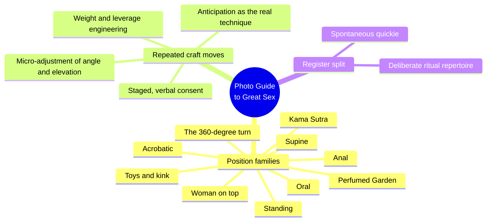
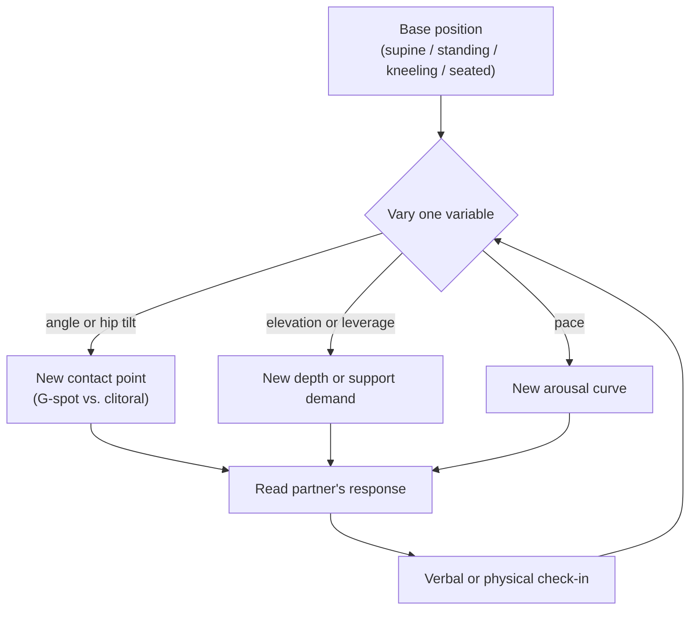
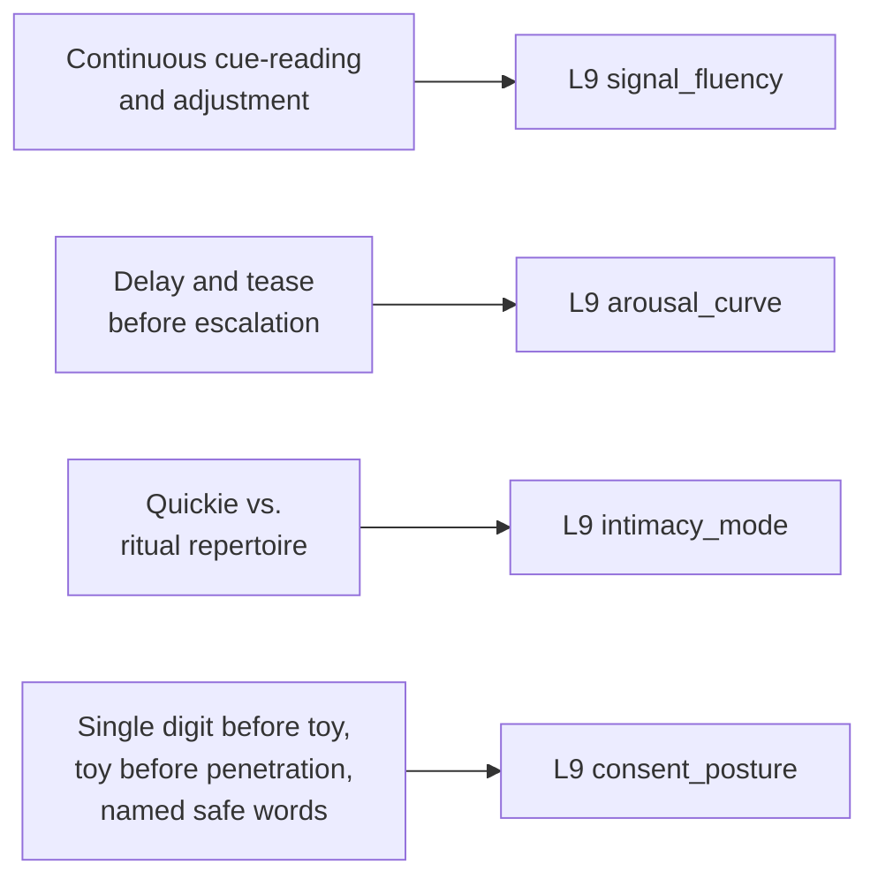

# 🧬 PSY.19 — The Complete Photo Guide to Great Sex — Quiver (2012)
### Knowledge Entry — Distill

A photo-technique manual (captions only survive extraction; images did not) organized as ten chapters of position families — the value here is not theory but a dense, concrete vocabulary of physical mechanics, pacing language, and consent staging that a prose writer can steal directly for embodied scene-writing.

## TABLE OF CONTENTS
- [Core Thesis](#1-core-thesis)
- [Mind Models](#2-mind-models)
- [Framework](#3-framework--structure)
- [Key Concepts](#4-key-concepts)
- [Heuristics](#5-heuristics--decision-rules)
- [Invariants](#6-invariants)
- [Pitfalls](#7-pitfalls--myths)
- [Application](#8-application)
- [Cross-References](#9-cross-references)
- [Provenance](#10-provenance--confidence)

---

## 1 · CORE THESIS

Great sex is not a fixed catalog of positions but a handful of physical bases (supine, standing, kneeling, seated) run through continuous micro-adjustment — angle, elevation, pace, hand placement — each producing a distinct sensation. Anticipation and staged, communicated consent are named as the actual mechanisms of pleasure and safety, not decoration around the acts.

---

## 2 · MIND MODELS

*Required. Minimum two diagrams, maximum five.*

**Diagram 1 — the whole argument.**
Caption: *ten chapters, one repeated move — every position family is the same base body shape, varied.*

**Diagram 2 — the central mechanism (a process: same base, new sensation).**
Caption: *the loop that produces every described "trick" — pick a base, change one variable, read the response, adjust again.*

**Diagram 3 — mapped onto the Command's L9 fields.**
Caption: *the four recurring craft moves land cleanly on four L9 variables — this thin source is a vocabulary supplier, not a theory supplier.*

---

## 3 · FRAMEWORK / STRUCTURE

Ten chapters, each a position family rather than an argument step; the book has no thesis chapter, only a running craft rule restated in every section:

| Chapter | Register | Governing move |
|---|---|---|
| Supine Sex | Baseline | Small changes (leg lift, hip tilt) turn "boring" missionary into a variable instrument |
| Standing Positions | Spontaneous | Height/weight mismatch solved by leaning surfaces, not strength alone |
| Woman on Top | Control transfer | She sets rhythm, speed, depth; he adds hands, eyes, voice |
| Kama Sutra Pleasures | Ritual, historical | Named postures (Yawning, Clasping, Splitting the Bamboo) as a formal repertoire |
| The Perfumed Garden | Ritual, historical | Postures explicitly keyed to penis-size accommodation and mutual consideration |
| Acrobatic Positions | High-skill, high-support | Leverage, furniture, and stamina become explicit design constraints |
| The 360-Degree Turn | Sustained novelty | One continuous, uninterrupted rotation reframed as a single long "journey" |
| Oral Sex | Anticipation-led | Repeated insistence that pacing and teasing outweigh technique |
| Anal Sex | Consent-staged | Explicit escalation ladder: caress, single digit, toy, penetration |
| Toys & Kink | Vocabulary extension | Toys and mild bondage framed as adding sensation channels, not replacing the partner |

---

## 4 · KEY CONCEPTS

| Concept | What it is | Why it matters |
|---|---|---|
| **Micro-adjustment principle** | The same base position (supine, standing, kneeling) yields different sensation from small variable changes: hip tilt, leg elevation, hand placement, pace | Technique is combinatorial, not a fixed catalog — a writer needs four or five bases and a set of variables, not fifty named positions |
| **Leverage and support engineering** | Acrobatic and standing sections treat who bears whose weight, and with what support (furniture, arms, headboard), as the actual design constraint on a position | Grounds a sex scene in bodies that get tired, need to brace, and negotiate physical limits — the antidote to weightless, effortless-looking scenes |
| **Anticipation as the real mechanism** | Oral sex sections repeat, almost verbatim, that delay and teasing produce more pleasure than any specific mouth or hand technique ("half of giving him a great blow job is anticipation") | Gives a concrete, portable pacing rule: withhold, then arrive, rather than escalate directly to the described act |
| **Staged consent ladder (anal)** | An explicit escalation order — caress and circle, single lubricated finger, toy with a flared base, penetration — each step gated on the partner's visible readiness | The clearest concrete consent-in-action sequence in the source; directly renderable as scene beats rather than a stated boundary |
| **Named safe words (kink)** | Pain-adjacent and bondage play require an agreed word to slow or stop the scene, stated before the scene begins | The one place the book names an explicit verbal contract prior to an act, distinct from in-scene cue-reading |
| **Register split: quickie vs. ritual** | Standing/spontaneous sex (partially dressed, urgent, opportunistic) is framed against Kama Sutra/Perfumed Garden sex (deliberate, prop-heavy, unhurried) as two different modes, not a hierarchy | A ready-made instance of a scripted-versus-spontaneous axis inside one source, useful for contrasting two characters' or one character's two modes |
| **Body-difference accommodation** | Height, weight, and size mismatches are treated as a design problem to solve (stairs, pillows, angle changes), not a failure or a joke | Normalizes differently-sized bodies finding working configurations rather than defaulting to one idealized body pairing |
| **Toys and kink as vocabulary extension** | Vibrators, dildos, sleeves, and restraints are framed as adding sensation channels and role-reversal, not replacing partner attention | Positions toy use as an extension of the same read-and-adjust loop, not a separate, mechanical activity |

---

## 5 · HEURISTICS & DECISION RULES

| Situation | Do this | Not this |
|---|---|---|
| Writing a spontaneous, urgent scene | Show partial dress, minimal setup, opportunistic location, and a leaning surface for support | Stage it with the same deliberate build-up as a planned scene |
| Writing a deliberate, ritualized scene | Let pacing, named positions, and props (pillows, a headboard) carry the deliberateness | Compress it to the same speed as a quickie |
| Writing anal or first-time penetrative escalation | Show the staged ladder: touch, single digit, toy, penetration, each gated on a visible cue | Cut straight to penetration with no staged consent beat |
| Writing kink or pain-adjacent play | Establish a named safe word on the page before the scene escalates | Assume unspoken understanding covers the boundary |
| Writing two differently-sized or differently-abled bodies together | Show creative accommodation (furniture, angle, pillows) as normal problem-solving | Play the mismatch as failure, comedy at their expense, or skip the logistics entirely |
| Writing oral sex as skilled or memorable | Foreground delay, teasing, and pace variation over anatomical description | Describe only mechanical contact with no anticipation beat |
| Showing a character reading a partner's arousal | Have them change one physical variable (angle, pace, pressure) in response to a visible or spoken cue | Have arousal simply happen, uncued, with no adjustment loop shown |
| Introducing a toy into a scene | Write it as a shared object extending both partners' attention | Write it as a solo gadget or as comic relief |

---

## 6 · INVARIANTS

1. **A base position is a variable, not a fixed thing.** The same starting shape (supine, standing, kneeling, seated) produces different sensation purely through angle, elevation, and pace changes.
2. **Physical support and leverage bound what is sustainable.** Which positions a given pair of bodies can hold, and for how long, is a real constraint, not a footnote.
3. **Anticipation outweighs technique.** Across the oral-sex chapter specifically, delay and teasing are named as more load-bearing than any specific physical move.
4. **Escalation into penetrative or pain-adjacent acts is staged, not binary.** Consent in this source is built from an incremental sequence of smaller permissions, each checked before the next.
5. **Body-difference is the normal case, not the exception.** Height, weight, and size mismatches are routinely solved with furniture, angle, and pillows rather than treated as disqualifying.

---

## 7 · PITFALLS / MYTHS

- Treating "great sex" as a fixed catalog of named positions rather than a small set of bases under continuous variable adjustment.
- Skipping the staged consent ladder on anal or kink content — the source treats "single digit before toy before penetration" and named safe words as load-bearing, not optional decorum.
- Ignoring physical plausibility (relative height, weight, stamina, what's actually bearing the weight) when writing acrobatic or "adventurous" sex.
- Treating anticipation and teasing as filler before "the real act," when the source repeatedly states teasing *is* the real act.
- Writing toy use as comic relief or a solo gadget rather than a shared sensation channel that keeps both partners' attention in the loop.
- Defaulting to one idealized body pairing and skipping the logistics differently-sized partners actually solve for.

---

## 8 · APPLICATION

- **Spine level:** L4, single-scene action. This source is choreography and pacing at the level of one encounter, not a relational arc (L5) or a standing want (L6).
- **12-layer character stack:** L9 signal_fluency (primary), L9 arousal_curve (primary), L9 intimacy_mode (supporting), L9 consent_posture (supporting). See frontmatter `feeds:` for the full wiring.
- **plot_systems:** contextual candidate once `04_PLOT_SYSTEMS/` opens — the staged-consent ladder (anal, kink) is a ready-made beat sequence for any scene that needs a believable escalation rather than a jump cut.
- **Setting:** not applicable; this is a character-scene technique source, not a setting source.

This is the thinnest source in the wave theoretically, and the most useful for one narrow job: writing an embodied sex scene that reads as physically plausible and attentive rather than either clinical or pornographic-generic. Where Perel (MSX.17) explains why desire needs distance and Kleinplatz (PSY.10) supplies the empathic-communication mechanism that crosses it, this source supplies the physical vocabulary those mechanisms move through — what a hand does, what a hip does, what gets said before an anal or kink scene escalates. Its clearest craft export is the anticipation rule: across every act family described, the delay before the act is what the source calls the technique, not the act itself. That gives `arousal_curve` a concrete, renderable shape (withhold, tease, arrive) instead of a label, and gives `consent_posture` a staged, incremental texture (touch, ask, smaller step, ask again) that can be written as beats rather than stated as a fact about the character.

---

## 9 · CROSS-REFERENCES

| Related entry | Relation |
|---|---|
| [[🧬 PSY.10 — Magnificent Sex — Kleinplatz & Ménard (2020)]] | Direct counterweight: PSY.10 argues technique and genital acts are minor to optimal sex; this source is almost entirely technique, useful precisely as the physical-vocabulary layer PSY.10's empathic-communication argument moves through |
| [[🧬 MSX.17 — Mating in Captivity — Perel (2006)]] | Perel's spontaneous/ritualized tension in long relationships maps onto this source's literal quickie-versus-Kama-Sutra register split |
| [[🧬 PSY.28 — New Naked — Herbenick (2025)]] | Sibling clinical sex-education source, likely the corrective register where this source is silent on anatomy, safety data, or diversity of bodies beyond size/height |

---

## 10 · PROVENANCE & CONFIDENCE

Loose-attachment extraction (no chapter or page markers survived; original is a heavily photo-illustrated book where captions, not prose, carry the text). Read in full: all extracted caption text across all ten chapters, front matter, and copyright page. No author is credited in the source or in Zotero metadata; the book is a Quiver/Quayside Publishing Group house title (2012), consistent with the imprint's photo-guide series format. Because only caption text survived extraction and no images, tables, or original page layout are available, confidence is medium rather than high: the source's argument is thin by design (a technique reference, not a monograph), and this distill's framing — micro-adjustment, anticipation, staged consent — is this analyst's synthesis of a pattern repeated across captions, not a thesis the book states for itself.

## META
- Template: BVX-LEARN-v4.0
- Source classification: full caption text (loose-attachment extraction), no original author credited, thin theoretical content by design
- Created / Updated: 2026-09-29
