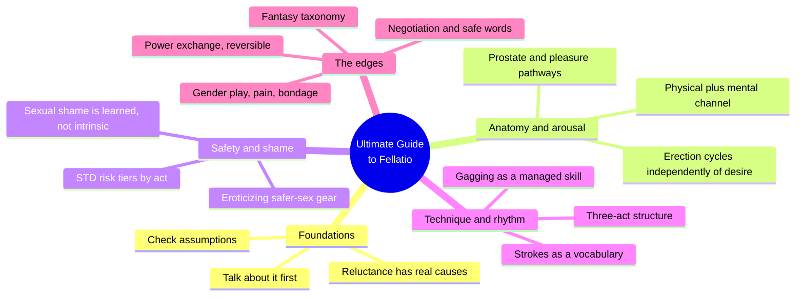
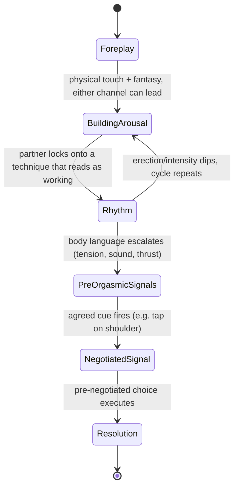
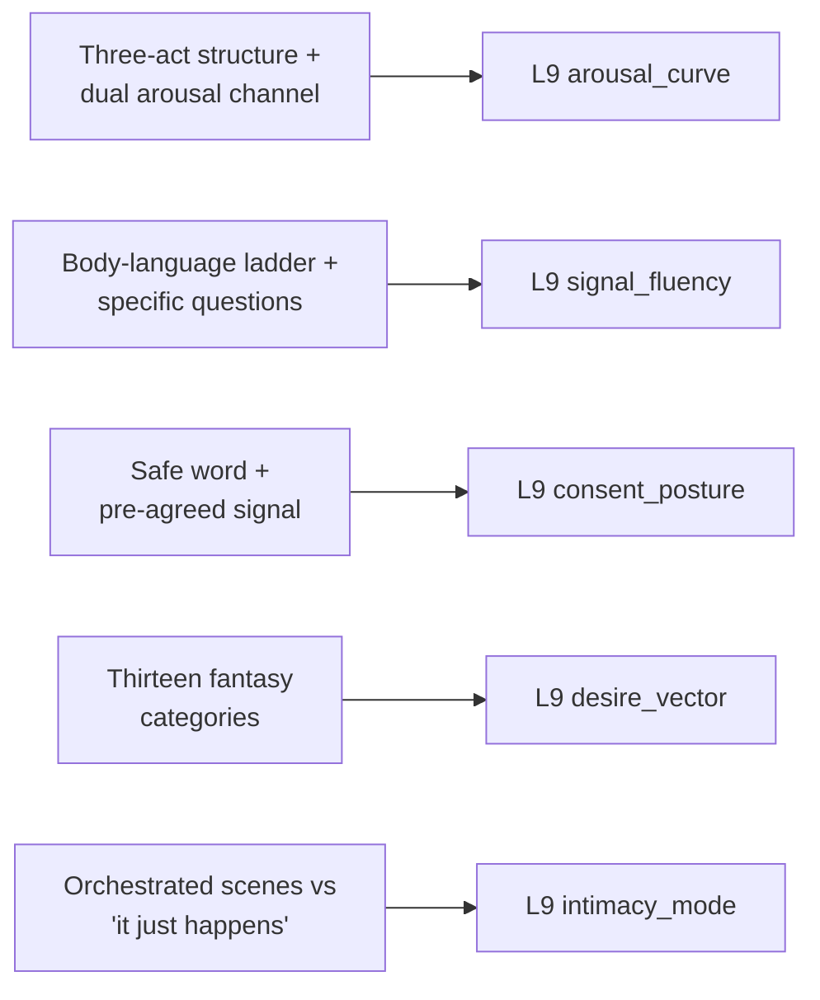

# 🧬 PSY.20 — The Ultimate Guide to Fellatio — Blue (2002)
### Knowledge Entry — Distill

A sex educator's craft manual for oral sex on a man, built around reading and directing arousal in real time; the library's first entry to model the mechanics of an in-scene arousal_curve and a negotiated signal system in this much operational detail.

## TABLE OF CONTENTS
- [Core Thesis](#1-core-thesis)
- [Mind Models](#2-mind-models)
- [Framework](#3-framework--structure)
- [Key Concepts](#4-key-concepts)
- [Heuristics](#5-heuristics--decision-rules)
- [Invariants](#6-invariants)
- [Pitfalls](#7-pitfalls--myths)
- [Application](#8-application)
- [Cross-References](#9-cross-references)
- [Provenance](#10-provenance--confidence)

---

## 1 · CORE THESIS

Fellatio runs a three-act arousal curve — build, establish rhythm, ride the peak — powered by two simultaneous channels, physical touch and mental fantasy, that a skilled partner reads through escalating body language and confirms through pre-negotiated signals. Power, pain, and disclosure are all adjustable dials set by ongoing negotiation, never fixed defaults or a single consent granted once.

---

## 2 · MIND MODELS

*Required. Minimum two diagrams, maximum five.*

**Diagram 1 — the whole argument.**
Caption: *fourteen chapters sort into five working bands — foundations, anatomy, safety, technique, and the edges (fantasy, power, pain) — with negotiation and signal-reading as the connective tissue running through all five.*

**Diagram 2 — the central mechanism (a state cycle: build, rhythm, peak, negotiated resolution).**
Caption: *arousal doesn't climb in a straight line — it loops through building and dipping until pre-orgasmic signals fire, and even then the ending is a choice point set by prior agreement, not autopilot.*

**Diagram 3 — mapped onto the Command's L9 EROS fields.**
Caption: *the book's own operational vocabulary — rhythm, signals, negotiation, fantasy menu — lines up directly onto five L9 fields without much translation.*

---

## 3 · FRAMEWORK / STRUCTURE

Fourteen chapters move from mindset through anatomy, safety, and hygiene into escalating technique, closing on the fantasy/power/pain register — each chapter pairs explicit how-to with a first-person quote layer drawn from the author's reader questionnaires, plus interstitial erotica by Alison Tyler that dramatizes the chapter's concept in scene form:

| Chapter | Governing move |
|---|---|
| 1 · More Than a Mouthful | Name and dismiss the two default assumptions (everyone wants it, it's an easy service act) |
| 2 · The Anatomy of a Man's Pleasure | Establish physical geography and the two-channel arousal model |
| 3 · For Him | Address the receiving partner's anxieties (appearance, control, erection reliability) directly |
| 4 · Know the Hard Facts | Tier STD risk by specific act, then reframe safer-sex gear as erotic material |
| 5 · Hair and Hygiene | Handle the body-maintenance layer without moralizing it |
| 6 · Before You Go Down | Build technique from relaxation and massage upward |
| 7 · Giving Head | The core mechanism chapter: rhythm, body-language reading, negotiated ejaculation choice |
| 8 · Any Way You Want It | Positions and access, including disability and strap-on adaptations |
| 9 · Deep Throat | A specific advanced skill taught as a managed process, not a dare |
| 10 · More Techniques | Toys, anal play, and sensation-layering |
| 11 · To the Limit | Fantasy, power exchange, gender play, pain, and bondage, all under an explicit negotiation frame |
| 12–14 | Media literacy and resource chapters (watching, reading, buying) |

---

## 4 · KEY CONCEPTS

| Concept | What it is | Why it matters |
|---|---|---|
| **The three-act structure** | Build arousal through unhurried foreplay, establish and vary a rhythm once a technique reads as working, then ride the body-language signals into the orgasmic peak | The book's own named shape for the whole act; a direct model for pacing any oral-sex or broader arousal scene rather than writing "and then they had sex" |
| **The two-channel arousal model** | Physical stimulation and mental/fantasy stimulation trigger the same neural arousal pathway independently, and can operate in any proportion — fantasy alone can arouse, touch alone can arouse, or both together | Explains why a character can be "checked out" into fantasy while still fully aroused, and why physical technique alone sometimes underperforms without an engaged mental channel |
| **Erection/arousal cycling** | Physical arousal signs (erection, in particular) naturally rise and fall through a scene independent of desire — a soft moment mid-scene is normal cycling, not lost interest | Directly prevents a common writing error: reading any physical dip as an emotional or narrative turning point when it's often just physiology |
| **Pre-orgasmic body language** | A specific, escalating signal set — muscle tension in thighs/jaw/abdomen, testicular retraction, vocalization, hip thrusting, grinding — that reliably precedes climax and can be read without asking | Gives a writer concrete, embodied beats to dramatize approach-to-climax rather than narrating "he was close" |
| **The negotiated signal** | A specific nonverbal cue (the recurring example: a tap on the shoulder) agreed on before the scene, used to communicate a time-sensitive choice (where ejaculation happens) without breaking the moment | A clean, generalizable mechanism for any scene needing a mid-peak choice point that can't rely on a verbal check-in |
| **Reversible power exchange** | Control in fellatio can sit with either partner — the receiver "using" the giver, or the giver "making" the receiver submit — and the same pairing can trade which role each partner holds from encounter to encounter | Breaks the assumption that a given sex act has one fixed power valence; the act's meaning is set by who's directing it, not by the act itself |
| **The fantasy taxonomy** | Thirteen named categories of erotic fantasy content: firsts, loss of control, having control, taboo, multiple partners, casual/anonymous partners, partner-specific, public space, being used, role-play, romance, objectification/fetish, gender play | A ready reference menu for what a character's desire is actually oriented toward, beyond a flat "aroused/not aroused" |
| **Fantasy-reality separation** | Fantasy content, however extreme (forced sex, taboo pairings), does not indicate a wish for the content to happen in reality; the fantasy is a "safe space where imagination fuels desire" | The same invariant found across the sexuality shelf (compare Perel, Fawcett): a character's dark fantasy content is not a literal plot intention unless the narrative separately establishes that it is |
| **The negotiation protocol for pain/power play** | Discuss the activity beforehand, distinguish "good pain" from "bad pain" specifically, agree on a safe word, and ask concrete questions in-scene ("harder, softer, more, stop") instead of the ambiguous "is this okay?" | A complete, portable consent script for any escalating or edge-play scene, not just this specific act |
| **Eroticizing the logistics** | Safer-sex gear (gloves, condoms, dental dams) is explicitly reframed from a mood-killing chore into anticipatory ritual — "the snap of the glove... means one delicious thing" | A craft move: procedural/safety beats in a scene can be written as arousal-building rather than as interruption |

---

## 5 · HEURISTICS & DECISION RULES

| Situation | Do this | Not this |
|---|---|---|
| Pacing an arousal scene | Move through build, rhythm, and peak as distinct beats, each given room | Jump straight to climax without an established rhythm |
| A character's erection or arousal sign fades mid-scene | Write it as normal physiological cycling | Read it as lost desire or a narrative turning point |
| Showing a character approaching climax | Layer in specific body-language cues (tension, sound, thrust, testicular retraction) | Summarize with "he was getting close" |
| A scene needs a time-sensitive choice at the peak | Establish a nonverbal signal earlier in the scene and pay it off | Insert a verbal negotiation in the middle of the climax |
| Depicting power exchange | Let either partner hold control, and let it be establishable in advance or traded mid-scene | Default power always to the same role (e.g., always the receiver, always the giver) |
| A character reveals a shocking fantasy | Keep its content separate from any claim about real-world intent | Treat the fantasy's content as a literal desire or plot foreshadowing |
| Writing pain or power play | Show (or imply offstage) a negotiation: activity, limits, safe word | Have intensity escalate with no prior agreement shown |
| A character checks in mid-scene | Have them ask something concrete (harder, softer, stop) | Have them ask a vague "is this okay?" that carries no information |
| Introducing safer-sex logistics into a scene | Let the gear itself become part of the anticipation | Treat the logistics purely as a pause or interruption |
| A character is reluctant about a new sexual act | Show them talking about it beforehand and naming the specific worry | Have them simply comply or simply refuse with no stated reason |

---

## 6 · INVARIANTS

1. **Arousal runs on two simultaneous channels — physical and mental — that need not be in the same proportion at every moment.** Either channel can carry a scene alone; together they compound.
2. **Physical arousal signs cycle naturally and independently of desire.** A dip is not evidence of waning interest; the pleasure cycle "dips and peaks along its normal course."
3. **Power exchange is directional but not fixed.** Whoever is nominally "in control" of a given sex act is a choice made by the partners, reversible from encounter to encounter, not a property of the act itself.
4. **Fantasy content and real-world intent are governed by different rules.** The extremity of a fantasy's content carries no default claim about what a person actually wants to happen.
5. **A signal agreed before arousal peaks is more reliable than a check made during it.** Time-sensitive choices need their communication channel set up in advance.
6. **Sexual shame is culturally sourced, not intrinsic to an act.** The specific narrative that codes fellatio as submissive or degrading is traceable and therefore addressable, not a fixed fact about the act.
7. **Negotiation is ongoing, not a single gate.** Consent for pain, power, or a specific in-scene outcome is set, can be reset, and is confirmed through specific rather than vague questions.

---

## 7 · PITFALLS / MYTHS

- Treating a lost or softening erection as proof of lost desire, rather than the pleasure cycle's normal rise and fall.
- Writing oral sex as inherently submissive or degrading for the giver without tracing that reading to its specific cultural source (the "commodity" framing the book names directly).
- Letting a character's fantasy content stand in for their literal real-world wish, especially for taboo or forced-sex content.
- Writing power-exchange or pain play with no negotiation beat at all, so intensity appears to escalate on autopilot.
- Using a single verbal "is this okay?" as if it carries the same information as a specific question ("harder, softer, stop").
- Assuming one technique, rhythm, or scene formula reads the same for every partner or every encounter — the text repeatedly insists on individual variation and asking rather than assuming.
- Treating safer-sex logistics purely as narrative friction rather than as material that can be eroticized.

---

## 8 · APPLICATION

- **Spine level:** L5 — assigned per the wave's shelf-wide spine key; this source's own center of gravity is craft and in-scene negotiation rather than a wound arc, but it does carry secondary L5-adjacent material in its treatment of learned sexual shame (the cultural coding of fellatio as degrading) and performance anxiety as a traceable, addressable injury rather than a fixed trait.
- **12-layer character stack:** primary at L9 (arousal_curve, signal_fluency, consent_posture); supporting at L9 (desire_vector, intimacy_mode).
- **plot_systems:** contextual — the negotiated-signal mechanism (§4) generalizes past sex scenes to any plot beat needing a pre-agreed, time-pressured, nonverbal choice point between two characters.
- **Setting:** none directly — a character/psychology-layer source, not a setting source.

For the EROS layer, this book's distinctive contribution is operational: where other sexuality-shelf sources describe what desire is (a template, a polarity, an absence), this one describes how two people actually run a scene together in real time — reading signals, adjusting rhythm, negotiating outcomes, trading power. The three-act arousal_curve and the body-language escalation ladder are directly reusable pacing tools for any sex scene, explicit or implied. The negotiated-signal mechanism and the "good pain / bad pain" distinction give consent_posture concrete, dramatizable texture instead of an offstage assumption. The fantasy taxonomy (§4) is a fast reference for grounding a character's desire_vector in a specific scenario type rather than a generic "turned on," and the explicit naming of both scripted (orchestrated, costumed) and spontaneous ("it just happens") modes in the same chapter gives intimacy_mode a clean binary a writer can pick or blend deliberately.

---

## 9 · CROSS-REFERENCES

| Related entry | Relation |
|---|---|
| [[🧬 MSX.17 — Mating in Captivity — Perel (2006)]] | Shared invariant: both insist fantasy content is symbolic/exploratory, not a literal wish-list — Perel at the level of relationship theory, this book at the level of in-scene craft |
| [[🧬 PSY.14 — Writing Asexual Characters — Salt and Sage Books (2020)]] | Structural contrast: this book's fantasy taxonomy and arousal-channel model assume a baseline allosexual desire_vector; reading them against PSY.14's Split Attraction Model clarifies which of this book's mechanisms (signal-reading, negotiation) transfer to an asexual character's non-sexual intimacy scenes and which (the arousal channels themselves) don't |
| [[🧬 PSY.08 — Lust, Men, and Meth — Fawcett (2015)]] | Shared method, opposite register: Fawcett's "four cornerstones of eroticism" (longing, taboo, power, ambivalence) is the clinical-theory version of this book's practical fantasy taxonomy and power-exchange material |

---

## 10 · PROVENANCE & CONFIDENCE

Full text available (391 KB extraction); read directly and in depth: the Preface, Introduction, Chapter 1 ("More Than a Mouthful," full), the arousal-mechanism sections of Chapter 2 ("Appearance and Pleasure Physiology" through "His Sexual Response Cycle" and "Ejaculation," full), Chapter 3 ("For Him," full, including "Masturbation and Fantasy" and "Head Etiquette"), Chapter 4's safer-sex risk-tiering and "The Eroticism of Safer Sex" (full), the opening of Chapter 5, Chapter 7 in full ("Giving Head" through "Rhythm," "Bump and Grind: Pre-Orgasmic Body Language," "Orgasm," and the closing erotica), and Chapter 11 in full ("Using Fantasy in Reality," "Power Exchange," "Gender Play," "When a Little Pain Is Nice," "Pain, Pain, Don't Go Away," and "Tie Me Up, Tie Me Down," plus closing erotica). Sampled at table-of-contents level only, not deep-extracted: Chapters 6, 8, 9, 10 (hands-on technique, positions, deep-throat mechanics, and toy-specific material — largely procedural content with limited additional yield for the L9 keying beyond what Chapter 7 already establishes) and Chapters 12–14 (media and resource listings). The `feeds:` keying against L9 EROS fields is this distill's synthesis, built by direct analogy between the book's own named mechanisms (the three-act structure, the negotiated signal, the fantasy taxonomy) and the field definitions supplied in the wave 3 brief.

## META
- Template: BVX-LEARN-v4.0
- Source classification: full-text book extraction, deep read on 6 of 14 chapters (the mechanism-bearing chapters), sampled at TOC level on the remainder
- Created / Updated: 2026-09-29
