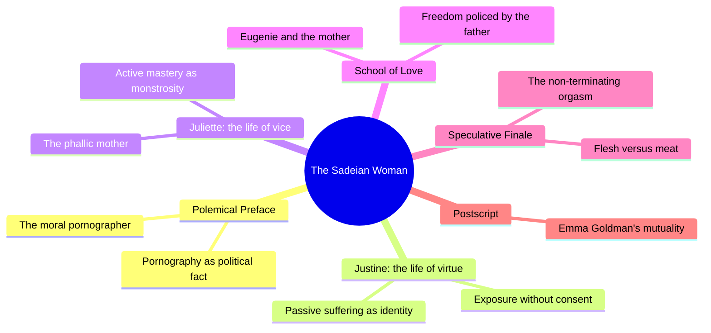
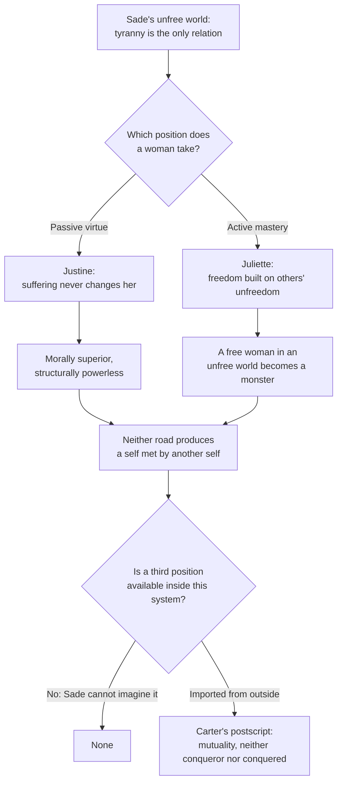
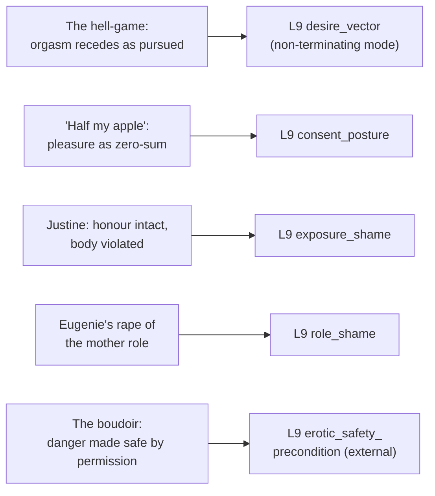

# 🧬 PSY.21 — The Sadeian Woman — Carter (1978)
### Knowledge Entry — Distill

Angela Carter's 1978 essay reads Sade's pornography as a diagnostic instrument for the politics of desire: Justine (passive virtue, endless victimhood) and Juliette (active mastery, monstrous freedom) are read as the only two positions a woman can occupy inside a system built on tyranny, with a third, mutual position gestured at only in the book's closing quotation from Emma Goldman.

## TABLE OF CONTENTS
- [Core Thesis](#1-core-thesis)
- [Mind Models](#2-mind-models)
- [Framework](#3-framework--structure)
- [Key Concepts](#4-key-concepts)
- [Heuristics](#5-heuristics--decision-rules)
- [Invariants](#6-invariants)
- [Pitfalls](#7-pitfalls--myths)
- [Application](#8-application)
- [Cross-References](#9-cross-references)
- [Provenance](#10-provenance--confidence)

---

## 1 · CORE THESIS

Sexuality is never neutral; it is always a political relation of power, and pornography stages that relation nakedly. Sade's two heroines mark his world's only positions: Justine's passive virtue guarantees endless victimhood, Juliette's active mastery requires becoming a monster. Emancipation lies outside both, in a mutuality neither can imagine.

---

## 2 · MIND MODELS

*Required. Minimum two diagrams, maximum five.*

**Diagram 1 — the whole argument.**
Caption: *six movements, one argument run six times: sexuality as political fact, then tested against a victim, a monster, a rebellious daughter, and the flesh itself.*

**Diagram 2 — the central mechanism (a two-position system with no third option inside it).**
Caption: *both roads dead-end in a self that is never met by another self — the book's real argument is that a third position has to be imported from outside the system, because the system cannot generate one.*

**Diagram 3 — mapped onto the Command's L9 EROS fields.**
Caption: *five scenes from the book give five distinct L9 variables a concrete, load-bearing mechanism rather than an abstract definition.*

---

## 3 · FRAMEWORK / STRUCTURE

Six movements, each testing the same claim against a different case:

| Section | Governing move |
|---|---|
| Introductory Note | States Sade's historical position (born 1740, died 1814 in an asylum) and Carter's method: a late-twentieth-century interpretation, not a biography or a defense |
| Polemical Preface | Argues pornography is never apolitical; names the "moral pornographer," an artist who could use explicit sexual material as a critique of real sexual relations rather than a false-universal fantasy of them |
| The Desecration of the Temple (Justine) | Reads the novel's heroine as the prototype of a whole cultural lineage of "beautiful victims" (Marilyn Monroe named directly), whose suffering is real but confers no power and changes nothing |
| Sexuality as Terrorism (Juliette) | Reads Justine's sister as the dialectical opposite: a woman who transcends victimhood by adopting the tyrant's own methods, at the cost of becoming one |
| The School of Love (Eugenie) | A close reading of Philosophy in the Boudoir's Eugenie de Mistival, whose ritual assault on her own mother is read through Freud's Oedipal theory as a war over whose desire is permitted to exist |
| Speculative Finale | States the book's most abstract claim: that pleasure withheld from reciprocity turns flesh into meat, and that libertine desire, pursued as conquest, structurally cannot arrive at satisfaction |
| Postscript | A single closing quotation from Emma Goldman, naming the position outside Sade's binary: emancipation as mutual "giving of one's self," neither conqueror nor conquered |

The throughline: each chapter takes one figure (Justine, Juliette, Eugenie, "flesh" itself) and shows the same tyranny recurring in a different costume, closing only with a quotation, not an argument, for what lies outside it.

---

## 4 · KEY CONCEPTS

| Concept | What it is | Why it matters |
|---|---|---|
| **The moral pornographer** | A hypothetical artist who uses explicit sexual material "as a critique of current relations between the sexes" rather than as false-universal fantasy | The book's proposed exit from ordinary pornography: pornography becomes valuable exactly when it stops flattering myth and starts describing real, socially-located sex |
| **False universals / archetype** | Pornographic and mythic archetypes ("man proposes, woman is disposed of") extract a couple's particularity and replace it with a mythic abstraction that denies real social difference (class, money, history) | A ready check for any erotic scene: has the specificity of these two people been replaced by a generic "man" and "woman," and if so, on purpose or by accident? |
| **Justine's virtue-as-location** | Justine locates her morality entirely in her genitals ("does not fuck") and her honour survives rape intact because her consciousness declines to participate | Shows a character's stated ethic (virtue) and her actual vulnerability (endless victimization) can be the same mechanism, not opposites |
| **The heart's egoism** | Justine's compassion collapses the instant she must risk herself for another; she can identify with suffering but not sacrifice herself to prevent it | A precise mechanism for writing sympathetic-but-passive characters: sympathy that only operates until it would cost the character something |
| **The Good Bad Girl** | The cultural type (Marilyn Monroe as its exemplar) who is desired, laughed at, and diminished for the same allure, and whose ignorance of her own power is her only permitted "innocence" | Names a specific shame architecture: a character's beauty read as both gift and liability, protected only by pretending not to notice it |
| **"A free woman in an unfree society will be a monster"** | Juliette's liberation is real but personal only; it is purchased with other people's unfreedom, including other women's | The clearest single sentence in the book for writing a "liberated" antagonist or anti-heroine without accidentally endorsing her as a role model |
| **The phallic mother (Durand)** | A post-menopausal, physically unpenetrable, non-reproductive mother-figure who mothers through domination and shared crime rather than nurture | An alternative to warm-mother and absent-father tropes: a maternal relationship built entirely on complicity and mutual usefulness, not tenderness |
| **Eugenie's Oedipal transgression** | Eugenie rapes, infects, and sews shut her mother in a ritual that is vengeance for her mother's attempt to repress her sexuality, framed through Freud's theory of mother/daughter rivalry | Models desire-suppression as generational conflict — one person's desire gated by another's fear of being replaced or exposed by it |
| **Sade's failure of nerve** | At the climactic moment, Sade will not let Madame de Mistival feel pleasure; she faints instead, because her orgasm would collapse the whole system's pleasure/pain, tyranny/freedom binary | Shows how a text can flirt with a genuinely transformative possibility (a victim's pleasure) and then retreat from it to protect its own rules — a diagnosable authorial tell |
| **Flesh versus meat; the hell-game** | Reciprocal, human sexual contact is "flesh"; sexuality stripped of exchange and treated purely as consumption is "meat." Libertine desire, chased as conquest, produces the "hell-game," where the goal recedes the harder it is pursued | The book's central mechanism for desire that cannot terminate: escalation as its own trap, not its own reward |

---

## 5 · HEURISTICS & DECISION RULES

| Situation | Do this | Not this |
|---|---|---|
| Writing a character whose main power is being victimized | Give the suffering a logic (an egoism that stops at the edge of real sacrifice) rather than pure passivity | Write suffering as simply happening to a blank, reactionless vessel |
| Writing a character who seizes power inside an unfree system | Show whose unfreedom her freedom is built on | Let her mastery read as unqualified liberation with no cost to anyone |
| Writing an escalating erotic or violent pursuit | Let the goal recede the harder the character chases it, if the pursuit itself is the character's real object | Let intensifying pursuit always reach a clean, satisfying terminus |
| Writing shame around a body being seen or used | Decide whether the shame is about exposure (being seen, judged) or about a violated role (motherhood, virtue, rank) — they read differently | Collapse every kind of sexual shame into one generic embarrassment |
| Writing a scene of erotic power reversal or transgression | Make it explicit whether the reversal is authorised and bounded (safe) or genuinely unpoliced — the two produce opposite emotional registers | Leave the reader to assume all transgression is equally free or equally dangerous |
| Writing a character's relationship to a partner's pleasure | Decide whether the character can tolerate a partner's pleasure existing independently, or needs to own, deny, or extinguish it | Assume shared pleasure is automatically mutual just because two bodies are in the same scene |
| Writing an alluring character who is diminished or mocked for her own beauty | Show what the joke costs her — the ignorance of her own power that is supposed to protect her | Play it as costless comic relief |
| Writing a generational or mother/daughter erotic conflict | Ground it in the real stakes of whose desire is permitted to exist | Use the transgression only for shock, without the underlying rivalry |

---

## 6 · INVARIANTS

1. **Sexuality is a social and political fact, never an ahistorical constant.** The same act carries opposite meanings depending on who holds power in the exchange.
2. **A system built on tyranny offers a woman only two positions: victim or monster.** A genuine third position has to be imported from outside the system; the system itself cannot generate one.
3. **A pleasure economy where "to share is to be robbed" cannot produce mutual pleasure.** The libertine surrounds himself with accomplices, not partners, because a real partner would change him.
4. **Suffering does not automatically confer virtue, and virtue does not automatically confer safety.** Passivity is a position with its own logic, not an absence of agency.
5. **Freedom taken by one person inside an unfree system, if it is not extended to others, reproduces the same tyranny in a new body.**
6. **Desire pursued as an escalating hunt against resistance has no natural terminus.** Harder pursuit makes the goal recede rather than arrive.
7. **Flesh becomes meat the instant an exchange stops being reciprocal.** The abyss between master and victim is definitional to that mode of sexuality, not an accident of circumstance.

---

## 7 · PITFALLS / MYTHS

- Treating pornographic or violent sexual content as depicting a timeless, apolitical "human nature" rather than a historically specific arrangement of power.
- Writing a victimized character's suffering as proof of superior morality, without examining what that suffering actually costs and permits.
- Writing a "liberated" or dominant female character without acknowledging whose unfreedom her freedom requires.
- Confusing shared physical proximity with mutual pleasure — group scenes in the text are explicitly parallel and solitary, not joined.
- Assuming a victim's non-resistance or apparent complicity implies consent; the text argues explicitly that absolute tyranny leaves no possibility of real refusal.
- Treating escalating desire as something that naturally resolves, rather than as a structure of deferral and recession.
- Using a generational or taboo transgression purely for shock, without registering what the story itself flinches from allowing (here, the mother's pleasure).

---

## 8 · APPLICATION

- **Spine level:** L5, the character register of the story-spine — this is a source about how power structures desire, shame, and consent, not about plot mechanics or setting.
- **12-layer character stack:** L9 EROS primarily — desire_vector (non-terminating mode), consent_posture, exposure_shame, role_shame, erotic_safety_precondition. L10 SHADOW shadow_content supporting. See frontmatter `feeds:` for the full wiring.
- **plot_systems:** contextual candidate once `04_PLOT_SYSTEMS/` opens — the victim/monster two-position system (Diagram 2) is a reusable antagonist-protagonist engine for any story where a character escapes powerlessness only by adopting the powerful's own methods.
- **Setting:** not applicable; this is a desire/power theory source, not a setting source.

For a writer rendering desire truthfully, especially where it intersects power, coercion, and taboo, this book's use is structural: it supplies working mechanisms for scenes that are otherwise hard to write honestly. The hell-game (Diagram 2's pursuit logic) gives `desire_vector`'s non-terminating mode a concrete shape: a character chasing an escalating want should find the want receding, not arriving, the harder they chase it, because the chase itself, not the stated object, is what such desire actually runs on. The exposure_shame/role_shame split (Justine's intact "honour" under violated body versus Eugenie's attack on her mother's role rather than her mother's body) gives a writer two clearly different shame mechanisms to choose between rather than one undifferentiated blush. The erotic_safety_precondition material is unusually double-edged here: the boudoir scene shows that even a transgressive, taboo-breaking encounter can be written as safe once it is explicitly authorised and bounded by the power structure around it, while the "free woman in an unfree society will be a monster" line warns that the same act, unauthorised and unbounded, reproduces the tyranny it seems to escape — the difference is not in the act but in whether the precondition was met. Consent_posture's clearest gift is negative: Clement's "half my apple" economics names, precisely so it can be refused, one coherent but ugly model of consent as ownership, against which any writer can measure a healthier, mutual model without having to invent the ugly one from scratch.

---

## 9 · CROSS-REFERENCES

| Related entry | Relation |
|---|---|
| [[🧬 MSX.17 — Mating in Captivity — Perel (2006)]] | Direct contrast: Perel's desire needs a gap, a separateness that is never closed; Carter's libertine desire needs total consumption, a closing of the gap by annihilation — two opposite structural answers to "what does desire want from its object" |
| [[🧬 PSY.13 — Psychology of the Unconscious — Jung (1916)]] | The libertines' regression to infantile cruelty ("their destination has always been their commencement") is Carter's narrative-scale case of the same blocked-libido-returns-as-symbol/displaced-act mechanism Jung names clinically |
| [[🧬 PSY.18 — A Woman's Guide to Oral Sex — Fulbright (2012)]] | Sharp contrast in register on the same submission/control question: Fulbright's giver-holds-real-control inversion assumes a consensual, negotiated frame; Carter's master/victim inversion assumes an absolute, unconsented one — together they mark the boundary between an erotic power reversal and a tyrannical one |

---

## 10 · PROVENANCE & CONFIDENCE

Full text, OCR/scan extraction (~55,000 words across 154 pages), of uneven scan quality (occasional garbled words and misordered lines, typical of pre-digital OCR). Read in full: the Introductory Note; the entire Polemical Preface; the entire "Desecration of the Temple" chapter (the life of Justine, all four sections); the Postscript (Emma Goldman quotation) and bibliography. Read substantially (the great majority of the chapter, with the narrative core and analytical passages both covered, a middle stretch of purely plot-recounting material sampled rather than read line by line): "Sexuality as Terrorism" (the life of Juliette); "The School of Love" (Eugenie de Mistival, read through the climactic scene and Sade's refusal to let the mother feel pleasure, with the chapter's closing pages sampled); "Speculative Finale" (the flesh/meat argument and the hell-game passage read in full through to the chapter's close).

The frontmatter `feeds:` keying is this distill's own synthesis against the wave 3 brief's L9 field list (character v2.2.0): the hell-game's escalation-without-arrival structure maps to `desire_vector`'s non-terminating mode; Clement's and Dolmance's pleasure-economics arguments map to `consent_posture`; Justine's exposed-body-intact-honour split maps to `exposure_shame`; Eugenie's assault on her mother's role rather than her mother's body maps to `role_shame`; the authorised, bounded boudoir versus the unauthorised, unbounded "monster" line maps to `erotic_safety_precondition`; the libertines' regression to infantile cruelty maps to L10 `shadow_content`, supporting.

`zotero_key` is blank: not checked against the live Zotero database in this pass; flagged for a future cataloging sweep rather than invented.

## META
- Template: BVX-LEARN-v4.0
- Source classification: full-text OCR extraction, deep read on Preface, Justine chapter, and Postscript; substantial read with a sampled middle stretch on the Juliette, School of Love, and Speculative Finale chapters
- Created / Updated: 2026-09-29
