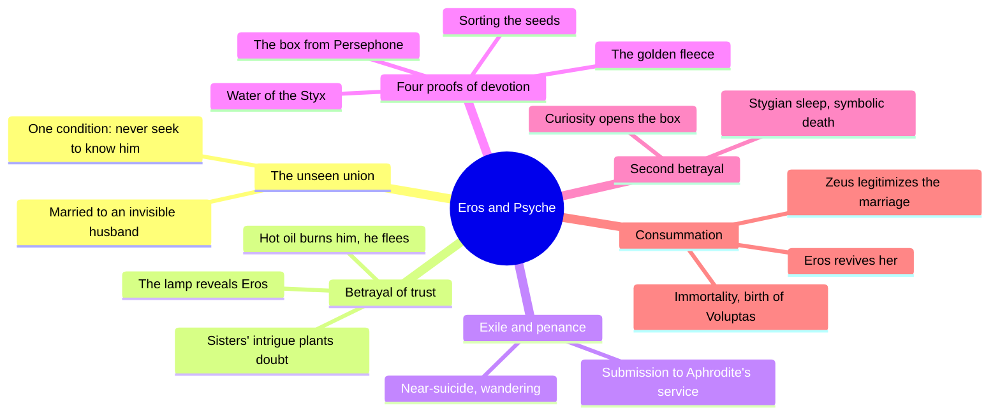
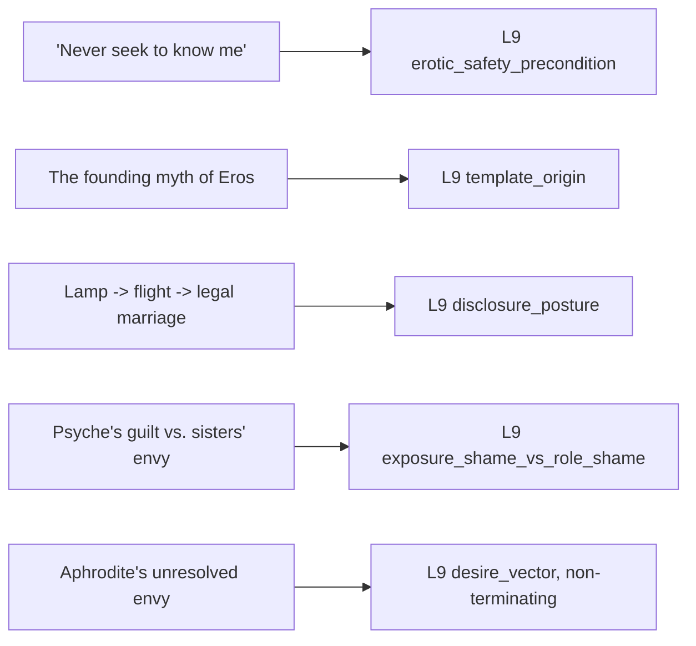

# 🧬 PSY.22 — Eros and Psyche — Carus after Apuleius (1900)
### Knowledge Entry — Distill

Paul Carus's 1900 retelling of the only fairy tale to survive from ancient Greece, preserved in Apuleius's *Golden Ass*: the founding myth of Eros (desire) and Psyche (soul), whose union requires broken trust, exile, impossible labor, and a symbolic death before it can become conscious, mutual, and permanent.

## TABLE OF CONTENTS
- [Core Thesis](#1-core-thesis)
- [Mind Models](#2-mind-models)
- [Framework](#3-framework--structure)
- [Key Concepts](#4-key-concepts)
- [Heuristics](#5-heuristics--decision-rules)
- [Invariants](#6-invariants)
- [Pitfalls](#7-pitfalls--myths)
- [Application](#8-application)
- [Cross-References](#9-cross-references)
- [Provenance](#10-provenance--confidence)

---

## 1 · CORE THESIS

Desire and the soul cannot unite as equals until the soul survives broken trust, exile, impossible labor, and a symbolic death from one final act of curiosity. Only then does love become conscious of its own nature, mingled with longing, suffering, and self-surrender. Carus states it directly: death is the problem of life, but love is its solution.

---

## 2 · MIND MODELS

*Required. Minimum two diagrams, maximum five.*

**Diagram 1 — the whole argument.**
Caption: *fourteen chapters resolve into six movements — trust granted blind, broken by seeing, atoned for by labor, nearly lost to curiosity again, and only then legitimized.*

**Diagram 2 — the central mechanism (a state change: trust broken, then re-earned, then legitimized).**
Caption: *Psyche's status changes twice through the same shape — a rule broken, a labor of atonement, a return — but only the second cycle ends in permanent, public union.*

```mermaid
stateDiagram-v2
    [*] --> BlindTrust: married in secret, forbidden to look
    BlindTrust --> Betrayed: the lamp; oil burns Eros; he flees
    Betrayed --> Exile: despair, wandering, no help from other gods
    Exile --> Servitude: submits to Aphrodite
    Servitude --> ProvenByLabor: four escalating tasks, each aided from outside herself
    ProvenByLabor --> SecondTemptation: final task carries a box she is told not to open
    SecondTemptation --> SymbolicDeath: curiosity wins; Stygian sleep
    SymbolicDeath --> Revived: Eros crosses to intervene directly
    Revived --> LegitimateUnion: Zeus recognizes the marriage before all Olympus
    LegitimateUnion --> [*]: immortality granted; daughter Voluptas born
```

**Diagram 3 — mapped onto the Command's L9 fields.**
Caption: *this myth is not a craft manual — it is raw material other L9 sources theorize about; five moments in the plot are direct, literal instances of five separate L9 variables.*

---

## 3 · FRAMEWORK / STRUCTURE

Fourteen chapters, no interpretive breaks within the narrative itself; Carus's preface and closing paragraph frame the tale as religious-philosophical allegory before and after the story proper.

| Chapter | Movement | What happens |
|---|---|---|
| A Rival of Aphrodite | Setup | Psyche's beauty draws worship meant for the goddess; Aphrodite's envy ignites |
| The Sacrifice | Setup | An oracle commands Psyche married to a "monster" on a mountaintop |
| The Wonderful Palace | The unseen union | An invisible husband, unseen servants, one condition: never seek to know him |
| Longings | The unseen union | Psyche's loneliness for her sisters cracks the blind trust |
| Intrigues | Betrayal of trust | The sisters visit and plant jealousy and doubt |
| Doubts and Anxieties | Betrayal of trust | Psyche wavers on whether to break the rule |
| The Mystery Solved | Betrayal of trust | The lamp scene: she sees Eros, hot oil burns him, he flees |
| The Punishment of Guilt | Exile and penance | Despair, near-suicide, rejected by other gods |
| The Censure | Exile and penance | Aphrodite's wrath; Psyche has nowhere left to turn |
| The Quest | Exile and penance | Wandering search for Eros ends in submission to Aphrodite |
| Submission | Exile and penance | Enters Aphrodite's household as a servant |
| The Three Tasks | Four proofs of devotion | Sorting seeds, the golden fleece, water of the Styx — each impossible alone, each aided from outside her |
| The Realm of Death | Four proofs of devotion / second betrayal | The fourth task, into the underworld for Persephone's box; strict rules for the passage; curiosity opens the box on the way back |
| The Marriage Feast | Consummation | Eros revives her from the death-sleep; Zeus legitimizes the marriage before all Olympus; immortality; birth of the daughter Voluptas |

---

## 4 · KEY CONCEPTS

| Concept | What it is | Why it matters |
|---|---|---|
| **The unseen bridegroom / blind-trust precondition** | Psyche is married nightly to a husband she may never see or ask to name; the marriage's continuation is conditioned entirely on her not seeking to know him | A precondition stated as a single, absolute rule rather than a negotiated boundary — trust here is binary, not a spectrum |
| **The lamp scene (the broken taboo)** | Doubt, planted by her sisters, drives Psyche to light a lamp and look at her sleeping husband; a drop of hot oil burns him and wakes him; he flees immediately | The structural crisis of the whole story: one act of seeing ends the relationship's first form entirely, with no partial consequence available |
| **Sisters' intrigue as an envy engine** | Megalometis and Baskania, married to lesser men, manufacture Psyche's doubt out of their own status resentment, hoping to inherit Eros themselves | Doubt in the myth is imported from outside, not self-generated; the sisters function as a delivery mechanism for role-based envy |
| **The four proofs of devotion** | Sorting a mountain of mixed seeds, fetching wool from murderous golden-fleeced rams, filling a vessel from an impassable river, and retrieving a box of beauty from the underworld — each set by Aphrodite as punishment, each completed only with outside aid (ants, a reed, an eagle, a talking tower) | Devotion is proven through escalating, near-impossible labor, but never through unaided solo effort; help always arrives from something outside the self |
| **The underworld's discipline (Realm of Death)** | Strict rules for the final task: bribe the ferryman and the three-headed dog, refuse to help a floating corpse or weaving spinsters who beg for aid, decline Persephone's banquet and eat only plain rye bread | A boundary-holding sequence distinct from the tasks before it — the danger here is generosity and appetite, not difficulty |
| **The second temptation (opening the box)** | Having survived the underworld, Psyche opens the sealed box out of curiosity about the "beauty" inside, meant only for Aphrodite; it releases not beauty but Stygian sleep, and she collapses as if dead | The final and costliest temptation strikes nearest the goal, after every prior trial has been passed, not before the journey starts |
| **Symbolic death and revival** | Eros, healed from his burn, crosses directly to intervene, lifts the death-sleep from her, and wakes her with an arrow's touch and a kiss | Consummation is preceded by an actual death-state, not merely a reconciliation scene; the rescue is an active crossing, not a passive forgiveness |
| **Voluptas, the child of Soul and Desire** | Zeus legitimizes the marriage before the full assembly of gods, grants Psyche immortality by nectar, and the couple's daughter is named Voluptas — Pleasure, called "Joy" | The myth's explicit closing claim: sensual pleasure is the literal offspring of soul and desire united, not their opposite, their risk, or their distraction |

---

## 5 · HEURISTICS & DECISION RULES

| Situation | Do this | Not this |
|---|---|---|
| Writing an intimacy gated on a not-knowing / not-looking condition | Make the condition absolute and immediately costly when broken | Write it as a soft preference that bends without consequence |
| A character's doubt about their partner needs a source | Route it through an outside voice (a rival, a sibling, a rumor) rather than unmotivated self-suspicion | Have the character invent groundless doubt from nowhere |
| Writing a "prove yourself" arc demanded by a gatekeeping figure | Stage escalating, near-impossible tasks, each one completed with help arriving from outside the character | Have the character grind through unaided brute effort alone |
| Placing the story's worst temptation | Put it at the very end, after every earlier trial has already been passed | Front-load the hardest temptation before the character has anything at stake |
| Writing reconciliation after a betrayal that ended a relationship | Have the wronged party actively cross back to intervene | Have the relationship simply resume once enough time has passed |
| Marking a union as fully real, not just privately reconciled | Give it a public, social, or legal recognition beat distinct from the private reconciliation | Let private forgiveness alone stand in for full legitimacy |
| Writing sensual pleasure thematically within a love story | Treat pleasure as the earned outcome and literal offspring of the soul-desire union | Treat pleasure as separate from, prior to, or in tension with the emotional bond |

---

## 6 · INVARIANTS

1. **A not-seeing / not-knowing precondition, once broken, cannot be partially broken.** The myth allows no soft violation — one look ends the arrangement outright.
2. **Doubt is imported, not self-generated.** An external voice (the sisters) supplies the suspicion that Psyche's own trust would not have produced alone.
3. **Proof of devotion is staged as escalating labor, never as solo achievement.** Each of the four tasks succeeds only because help arrives from outside the protagonist.
4. **The final temptation strikes nearest the goal.** Curiosity wins on the last leg of the last task, not at the outset.
5. **Full union requires public legitimization in addition to private reconciliation.** Eros forgiving Psyche is not the same event as Zeus recognizing their marriage before all Olympus.
6. **Pleasure is figured as the offspring of soul and desire completed, not their risk.** Voluptas is born only after the full cycle closes.

---

## 7 · PITFALLS / MYTHS

- Treating the "forbidden to look" taboo as arbitrary decoration rather than as the mechanism that makes trust testable and legible in the first place.
- Writing rival/jealous figures (the sisters, Aphrodite) as flat obstacles instead of as the engine that manufactures the protagonist's doubt.
- Compressing or skipping the labor stage and jumping straight from crisis to reconciliation, which strips the eventual union of its earned quality.
- Playing the curiosity-driven final failure as a permanent moral verdict on the character, when the myth uses it as the necessary last test before full consummation, not a disqualification.
- Treating sensual pleasure as opposed to or separate from soul-level love, when the myth's own ending fuses them explicitly in a single offspring.
- Reading Aphrodite's envy as resolved once Psyche completes her tasks — the text is explicit that her hostility is never really satisfied, only overruled by Zeus.

---

## 8 · APPLICATION

- **Spine level:** L5, the relational/intimate-arc register — this is a single pair's union tested and re-formed across an extended arc, not a single scene (L4) or a solitary want (L6).
- **12-layer character stack:** L9 erotic_safety_precondition (primary), L9 template_origin (primary), L9 disclosure_posture (primary), L9 exposure_shame_vs_role_shame (supporting), L9 desire_vector (supporting). See frontmatter `feeds:` for the full wiring.
- **plot_systems:** contextual candidate once `04_PLOT_SYSTEMS/` opens — the four-tasks structure (Diagram 2) is a ready-made escalating-proof-of-devotion plot engine, and the underworld's discipline (refuse to help, refuse to eat, bribe passage) is a portable boundary-holding sequence for any quest subplot.
- **Setting:** not applicable; this is a psychological/mythic source, not a setting source.

Unlike the other wave-three sources, this one is not a craft manual — it is raw mythic material that other L9 sources (Perel, Kleinplatz) theorize *about*. Its distinct value is giving five separate L9 variables a literal, citable origin story rather than an abstract definition. `erotic_safety_precondition` gets a clean worked example of an absolute rule and its exact cost when broken. `template_origin` gets the actual founding myth of Eros to cite as a character's erotic template, whether that character trusts the unseen or was burned by looking too soon. `disclosure_posture` gets a three-stage arc — enforced secrecy, accidental exposure, full public recognition — that is directly restageable as plot beats. And the myth's closing claim, that Voluptas (Pleasure) is literally born from Soul and Desire's completed union, is a ready citation against any framing that treats sensuality as separate from or lesser than emotional intimacy.

---

## 9 · CROSS-REFERENCES

| Related entry | Relation |
|---|---|
| [[🧬 MSX.17 — Mating in Captivity — Perel (2006)]] | Perel's separateness-as-precondition-for-desire is the modern theoretical restatement of this myth's "never seek to know him" — the myth dramatizes what Perel argues |
| [[🧬 PSY.10 — Magnificent Sex — Kleinplatz & Ménard (2020)]] | Kleinplatz's vulnerability/surrender component and this myth's symbolic-death-before-consummation describe the same structural risk from empirical and mythic registers respectively |
| [[🧬 PSY.13 — Psychology of the Unconscious — Jung (1916)]] | Direct disciplinary sibling: Jung's own school drew heavily on the Eros-Psyche myth as an anima/individuation allegory; this distill supplies the primary text Jungian readings interpret |

---

## 10 · PROVENANCE & CONFIDENCE

Full text, OCR extraction of a 1900 public-domain edition (Open Court Publishing, Chicago; Cornell University Library copy, ~99pp), with visible OCR noise (broken words, scrambled diacritics, occasional line-order corruption typical of century-old scanned typefaces, most severe in the closing philosophical paragraph). Read in full: front matter, Carus's preface (comparative-mythology framing of the tale against Grimm, Beauty and the Beast, and the Eleusinian mysteries), and all fourteen narrative chapters from "A Rival of Aphrodite" through "The Marriage Feast," including the closing philosophical paragraph on Love and Death. This is a public-domain retelling of Apuleius's second-century tale (from *The Golden Ass*), filtered through Carus's own late-Victorian religious-philosophical lens; the myth's plot beats are the reliable layer, Carus's interpretive framing (mystery-religion, monism) is a period-specific reading laid over it and is flagged as such throughout this distill.

## META
- Template: BVX-LEARN-v4.0
- Source classification: full-text public-domain OCR extraction, myth/urtext rather than craft manual, one interpretive layer (Carus, 1900) over the ancient narrative
- Created / Updated: 2026-09-29
