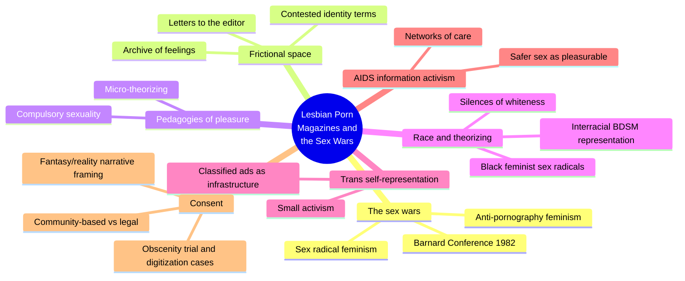
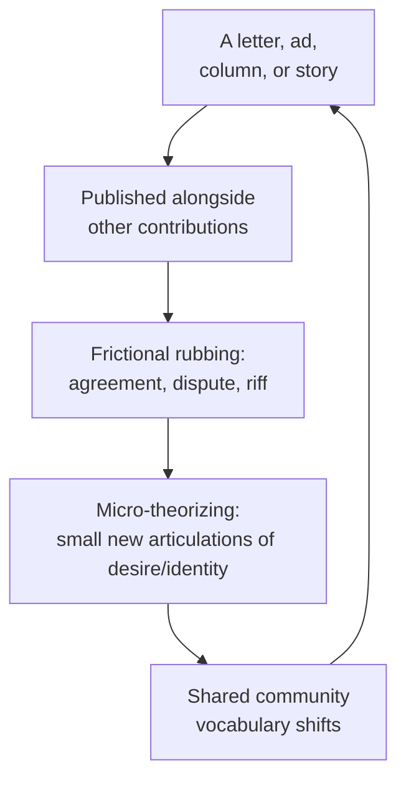
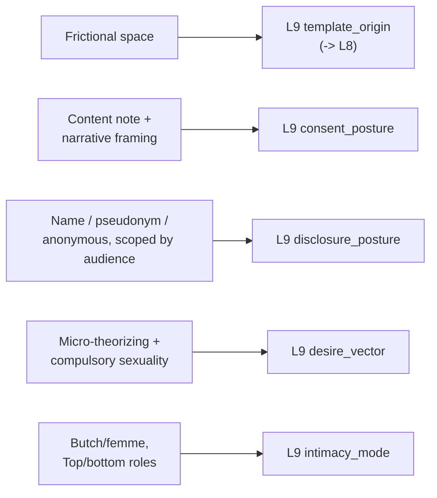

# 🧬 PSY.23 — Lesbian Porn Magazines and the Sex Wars — Groeneveld (2023)
### Knowledge Entry — Distill

An intersectional media history of five 1980s lesbian sex magazines (Bad Attitude, Cathexis, On Our Backs, Outrageous Women, The Power Exchange), arguing they built new, community-specific grammars of sex, power, and identity through the friction of readers and contributors rubbing against each other in print — the library's first entry to model desire vocabulary as collectively manufactured rather than individually discovered.

## TABLE OF CONTENTS
- [Core Thesis](#1-core-thesis)
- [Mind Models](#2-mind-models)
- [Framework](#3-framework--structure)
- [Key Concepts](#4-key-concepts)
- [Heuristics](#5-heuristics--decision-rules)
- [Invariants](#6-invariants)
- [Pitfalls](#7-pitfalls--myths)
- [Application](#8-application)
- [Cross-References](#9-cross-references)
- [Provenance](#10-provenance--confidence)

---

## 1 · CORE THESIS

Five 1980s lesbian sex magazines built desire collectively: readers, writers, and editors rubbed against each other in letters, ads, and fiction to produce a community-specific grammar of sex, power, and identity — a "frictional space" no single author controlled. Consent inside that space was defined by the community itself, and rarely survived translation into law, a new medium, or a wider audience.

---

## 2 · MIND MODELS

*Required. Minimum two diagrams, maximum five.*

**Diagram 1 — the whole argument.**
Caption: *seven chapters plus a conclusion trace one archive through six different lenses — friction, pleasure, race, trans presence, AIDS, and consent — all converging on the same underlying mechanism.*

**Diagram 2 — the central mechanism (frictional space as a community feedback loop).**
Caption: *no single letter, ad, or story defines the community's vocabulary — desire language is manufactured in the repeated rubbing of one contribution against the next, then fed back into what gets submitted next issue.*

**Diagram 3 — mapped onto the Command's L9 EROS fields.**
Caption: *the book's own analytic vocabulary — frictional space, consent statements, disclosure choices, micro-theorizing, butch/femme roles — keys directly onto five L9 fields with little translation needed.*

---

## 3 · FRAMEWORK / STRUCTURE

Seven chapters plus a conclusion, moving from a general mechanism (frictional space) through specific lenses the same archive is read against:

| Chapter | Governing question |
|---|---|
| Introduction | What is frictional space, and why did five lesbian sex magazines launch in a single year? |
| 1 · Letters to the Editor as Frictional Space | How do reader letters, not just editorial content, build an "archive of feelings" about the sex wars? |
| 2 · Micro-Theorizing, Pedagogies of Pleasure, and the Sexual Imperative | How do advice columns teach readers new sexual vocabulary, and when does that teaching become its own pressure? |
| 3 · "The Possibility of Freedom": Black Feminist Sex Radical Theorizing | How do Black contributors eroticize race, power, and history in ways white-led magazines didn't anticipate? |
| 4 · Small Activism: Trans Self-Representation | How do small, incremental interventions (a classified ad) ripple into larger visibility over a decade? |
| 5 · Making Lesbian/Trans Lifeworlds in Fiction and in Fact | How do fiction and reader response together build a livable, if constrained, sense of community? |
| 6 · AIDS Information Activism and Networks of Care | How did sex magazines become public-health infrastructure when official agencies had none for lesbians? |
| 7 · Consent and Lesbian Porn Magazines | How is consent defined inside a specific community, and what happens when that definition meets law or a new medium? |
| Conclusion | What is the afterlife of 1980s lesbian porn in 1990s-and-beyond queer zine, video, and web culture? |

---

## 4 · KEY CONCEPTS

| Concept | What it is | Why it matters |
|---|---|---|
| **Frictional space** | The book's central concept: magazines as sites where different readers', writers', and editors' ideas "rub up against each other" productively, generating new vocabulary rather than just reflecting pre-existing community consensus | The load-bearing mechanism of the whole book — community desire vocabulary is manufactured through friction, not simply transmitted from an authority or discovered privately by an individual |
| **The sex wars: anti-pornography vs. sex radical** | Two 1980s feminist positions: anti-pornography feminism held that patriarchy fundamentally compromises women's capacity to consent to porn, BDSM, or sex work; sex radical feminism held that consenting adults' sexual choices, however stigmatized, deserve destigmatization rather than restriction | The debate both camps organized around was ultimately about who gets to be recognized as a consenting subject — the same question that structures the book's L9-relevant consent material |
| **Micro-theorizing** | Small, localized articulations of an alternative vision of sex or identity, typically surfacing in advice columns as a specific reader's question gets a specific, personalizing answer | A model for how desire_vector gets named piece by piece in community dialogue, rather than arriving as a finished taxonomy |
| **Compulsory sexuality** | Ela Przybylo's term, applied here to the magazines' own tendency to frame exploratory lesbian sex as the necessary route to "the good life," even while destigmatizing many specific practices | A caution: sex-positive community discourse can generate its own pressure/imperative even as it dismantles an older one — pedagogy and pressure aren't always distinguishable in the same text |
| **The content note / consent statement** | Outrageous Women's printed editorial note distinguishing depicted nonconsent in fiction from "real-life" nonconsent, framing S/M fiction as "consensual by definition: the reader is free to stop reading at any time" | An early, concrete model (predating modern trigger warnings) for how a text can hold dark content and explicit consent framing simultaneously |
| **Narrative techniques for framing fictional nonconsent** | Three specific craft moves: double narration (both partners' internal POV shown), direct reader address ("did you get all sticky and wet...?"), and typographic markers (italics) separating fantasy layers from the story's frame | Concrete, reusable fiction-writing tools for signaling that depicted nonconsent is consensual roleplay without breaking the scene's heat |
| **Community-based vs. legal consent** | Sex radical and BDSM communities developed internal consent norms (mutuality, negotiated roles, fantasy/reality distinctions) that courts and legal frameworks (the Canadian Butler Decision) failed, or refused, to recognize | Demonstrates that "consent" is not one universal standard but a claim whose legibility depends on which community's grammar is doing the reading |
| **Small activism** | Small, individually modest interventions (a single classified ad for a trans-support publication) whose effects ripple outward over years, eventually enabling larger acts of visibility | A useful shape for a slow-burn character or community arc: visibility built by accretion, not one dramatic coming-out |
| **Scoped disclosure / consent that doesn't travel** | Original contributors consented to appear in a 1980s print magazine read by a specific community; decades later, digitizing that same material for a global online archive raised a distinct, unresolved consent question | Disclosure_posture is bound to an audience and a moment, not a permanent blanket setting — republication in a new context is a new disclosure event |
| **Eroticizing safer sex** | Lesbian sex magazines, absent any CDC guidance on woman-to-woman HIV transmission, built their own safer-sex education and reframed protective practices as desirable rather than merely risk-reducing | Direct structural echo of the erotic_safety_precondition move seen elsewhere on this shelf (compare PSY.20's "Eroticism of Safer Sex") |

---

## 5 · HEURISTICS & DECISION RULES

| Situation | Do this | Not this |
|---|---|---|
| Writing a scene depicting apparent nonconsent as consensual roleplay | Signal the frame explicitly: both partners' internal POV, direct address, or a typographic marker separating fantasy from story-reality | Leave the consensual frame implicit and hope the reader infers it |
| Building a community's shared sexual vocabulary in a story | Show it forming through exchange — letters, disputes, answered questions — not handed down from one authoritative voice | Have one character or institution simply define the community's terms once |
| A marginalized character pushes for representation within a space they don't control | Show incremental, small interventions accumulating over time (small activism) | Compress the arc into a single dramatic confrontation that changes everything at once |
| A character's fantasy content is dark, taboo, or power-imbalanced | Keep the fantasy's content separate from any claim about the character's real-world desire or intent | Use fantasy content as a shortcut to reveal a character's "true" hidden wish |
| A scene or archive material moves to a new audience, medium, or era | Treat that move as a new disclosure/consent event requiring its own negotiation | Assume original consent automatically covers republication at a different scale |
| Depicting a court, institution, or outsider judging a community's sexual practice | Show the specific mismatch between the community's internal grammar (roles, mutuality, negotiated fantasy) and the outside frame imposed on it | Let the outside judgment simply be right or simply be wrong without dramatizing the translation failure |
| A sex-positive community or character teaches new sexual possibility | Let the teaching carry its own subtle pressure or imperative alongside its liberation | Write sex-positive pedagogy as pure, frictionless liberation with no cost |
| Depicting safer-sex practice in a scene | Consider framing it as chosen, desirable, and community-built rather than merely protective | Treat safety practice as an externally imposed, joyless obligation |

---

## 6 · INVARIANTS

1. **Consent is community-contextual, not a single universal standard.** What counts as informed, adult consent is defined differently by a specific community's internal norms than by a liberal contract model or a legal statute, and the two frequently fail to translate.
2. **Fantasy content and real-world desire are governed by different rules, and communities build explicit conventions to mark the difference.** A text's own framing devices (content notes, narrative techniques) do real consent-signaling work, not just decoration.
3. **Desire vocabulary is manufactured collectively, through friction, not discovered by isolated individuals.** A community's shared language for what it wants emerges from contributors and readers rubbing against each other over time.
4. **Consent and disclosure are scoped to a specific audience, medium, and moment.** They do not automatically extend to a later, larger, or different context — republication or remediation is its own consent event.
5. **Small, incremental interventions accumulate into structural change.** Visibility and inclusion are as often built through small activism as through singular dramatic acts.
6. **Sex-positive pedagogy can generate its own pressure even as it dismantles an older one.** Naming and destigmatizing desire is not automatically free of its own compulsory logic.
7. **Marginalization operates through silence as much as through explicit exclusion.** A predominantly white or cis space's unremarked defaults are themselves a form of structuring, not a neutral absence.

---

## 7 · PITFALLS / MYTHS

- Reading a character's or text's dark, nonconsensual-themed fantasy content as literal evidence of what that character (or the real person behind a fictional narrator) actually wants to happen.
- Assuming a single "correct" definition of consent applies identically across communities, eras, and legal frameworks without translation loss.
- Treating original disclosure or publication consent as covering all future republication, regardless of scale, medium, or audience shift.
- Writing representation for a marginalized character or community as one clean, singular act rather than an accumulation of smaller interventions, often against real resistance.
- Portraying a sex-positive or liberationist community/pedagogy as free of its own internal pressures or imperatives.
- Letting racial or other structural dynamics disappear from a scene or community simply because no character remarks on them — silence is itself a form of construction, not neutrality.
- Collapsing BDSM power-exchange roles (butch/femme, Top/bottom) into the same register as non-negotiated, non-consensual real-world power dynamics.

---

## 8 · APPLICATION

- **Spine level:** L5 — assigned per the wave's shelf-wide spine key; this source's strongest content sits in community-formation and consent theory rather than a single wound arc, though the recurring material on stigma, job-loss risk, and legal jeopardy for disclosure supplies concrete, structural wound material for any character whose desire carries real external cost.
- **12-layer character stack:** primary at L9 (template_origin, consent_posture, disclosure_posture); supporting at L9 (desire_vector, intimacy_mode).
- **plot_systems:** contextual — the frictional-space mechanism (§4) generalizes past sex magazines to any in-world community-media plot device (message boards, zines, group chats) that needs to visibly manufacture shared vocabulary or norms among a cast, rather than having one character simply announce them.
- **Setting:** contextual — the specific magazine ecosystem (exchange advertisements, overlapping contributor networks, archive/access politics) is a reusable template for building a fictional subculture's print or media infrastructure.

For the EROS layer, this book's distinctive contribution is treating desire and consent as community-manufactured rather than individually pre-formed — a character's template_origin can be written as something built in dialogue with a specific readership or peer group, complete with disputes, riffs, and revisions, rather than arriving fully formed. The consent chapter's narrative techniques (§4–5) are immediately usable craft tools for any scene that needs to depict power-imbalanced or dark content while keeping its consensual frame legible to the reader. The scoped, non-transferable nature of disclosure_posture — consent that doesn't automatically travel to a new audience or medium — is a sharp, underused plot mechanism: a character's past disclosure resurfacing in a new context is itself a new, unresolved consent event, not a simple continuity of an old one.

---

## 9 · CROSS-REFERENCES

| Related entry | Relation |
|---|---|
| [[🧬 PSY.20 — The Ultimate Guide to Fellatio — Blue (2002)]] | Direct structural echo: both sources independently reframe safer-sex practice as erotic and desirable rather than merely protective, one at the level of a single scene's technique, the other at the level of a whole subculture's public-health activism |
| [[🧬 PSY.14 — Writing Asexual Characters — Salt and Sage Books (2020)]] | Shared method, different register: both interrogate how a community builds and defends its own vocabulary against an outside culture that keeps mistranslating or pathologizing it |
| [[🧬 MSX.17 — Mating in Captivity — Perel (2006)]] | Shared invariant on fantasy: both insist fantasy content is symbolic rather than a literal wish-list, Perel at the level of individual psychology, this book at the level of a community's explicit, printed framing conventions for the same claim |

---

## 10 · PROVENANCE & CONFIDENCE

Full text available (703 KB extraction); read directly and in depth: the Preface, Acknowledgements, the Introduction in full (the sex wars context, the five-magazine overview, the "Defining Lesbian Porn" and "Studying Lesbian Sex Magazines" methodology sections, and the full Chapter Overview), the opening of Chapter 1 ("Letters to the Editor as Frictional Space," through the Honey Lee Cottrell "Bulldagger of the Season" analysis), and Chapter 7 ("Consent and Lesbian Porn Magazines") in full, including the Outrageous Women consent statement, the three narrative-framing techniques, both case studies (the Bad Attitude obscenity trial and the On Our Backs digitization controversy), and the chapter's conclusion. Chapters 2 through 6 and the book's Conclusion were read via the Introduction's detailed chapter-overview summaries (each a full paragraph written by the author previewing that chapter's argument and evidence) rather than deep-extracted in full; the Key Concepts entries drawn from these chapters (micro-theorizing, compulsory sexuality, small activism, eroticizing safer sex) are sourced from those author-written summaries rather than from full in-chapter reading. The `feeds:` keying against L9 EROS fields is this distill's synthesis, built by direct analogy between the book's own named mechanisms (frictional space, the content note, scoped disclosure) and the field definitions supplied in the wave 3 brief.

## META
- Template: BVX-LEARN-v4.0
- Source classification: full-text academic monograph, deep read on Introduction and Chapter 7, remaining chapters (2–6, Conclusion) read via author-written chapter-overview summaries
- Created / Updated: 2026-09-29
